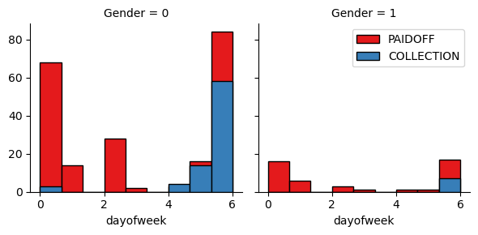

<p style="text-align:center">
    <a href="https://skills.network/?utm_medium=Exinfluencer&utm_source=Exinfluencer&utm_content=000026UJ&utm_term=10006555&utm_id=NA-SkillsNetwork-Channel-SkillsNetworkCoursesIBMDeveloperSkillsNetworkML0101ENSkillsNetwork20718538-2022-01-01" target="_blank">
    
    </a>
</p>

<h1 align="center"><font size="5">Classification with Python</font></h1>


In this notebook we try to practice all the classification algorithms that we have learned in this course.

We load a dataset using Pandas library, and apply the following algorithms, and find the best one for this specific dataset by accuracy evaluation methods.

Let's first load required libraries:


```python
import itertools
import numpy as np
import matplotlib.pyplot as plt
from matplotlib.ticker import NullFormatter
import pandas as pd
import numpy as np
import matplotlib.ticker as ticker
from sklearn import preprocessing
%matplotlib inline
```

    /home/jupyterlab/conda/envs/python/lib/python3.7/site-packages/sklearn/utils/validation.py:37: DeprecationWarning: distutils Version classes are deprecated. Use packaging.version instead.
      LARGE_SPARSE_SUPPORTED = LooseVersion(scipy_version) >= '0.14.0'


### About dataset


This dataset is about past loans. The **Loan_train.csv** data set includes details of 346 customers whose loan are already paid off or defaulted. It includes following fields:

| Field          | Description                                                                           |
| -------------- | ------------------------------------------------------------------------------------- |
| Loan_status    | Whether a loan is paid off on in collection                                           |
| Principal      | Basic principal loan amount at the                                                    |
| Terms          | Origination terms which can be weekly (7 days), biweekly, and monthly payoff schedule |
| Effective_date | When the loan got originated and took effects                                         |
| Due_date       | Since it’s one-time payoff schedule, each loan has one single due date                |
| Age            | Age of applicant                                                                      |
| Education      | Education of applicant                                                                |
| Gender         | The gender of applicant                                                               |


Let's download the dataset


```python
!wget -O loan_train.csv https://cf-courses-data.s3.us.cloud-object-storage.appdomain.cloud/IBMDeveloperSkillsNetwork-ML0101EN-SkillsNetwork/labs/FinalModule_Coursera/data/loan_train.csv
```

    --2022-09-01 08:46:06--  https://cf-courses-data.s3.us.cloud-object-storage.appdomain.cloud/IBMDeveloperSkillsNetwork-ML0101EN-SkillsNetwork/labs/FinalModule_Coursera/data/loan_train.csv
    Resolving cf-courses-data.s3.us.cloud-object-storage.appdomain.cloud (cf-courses-data.s3.us.cloud-object-storage.appdomain.cloud)... 169.63.118.104
    Connecting to cf-courses-data.s3.us.cloud-object-storage.appdomain.cloud (cf-courses-data.s3.us.cloud-object-storage.appdomain.cloud)|169.63.118.104|:443... connected.
    HTTP request sent, awaiting response... 200 OK
    Length: 23101 (23K) [text/csv]
    Saving to: ‘loan_train.csv’
    
    loan_train.csv      100%[===================>]  22.56K  --.-KB/s    in 0s      
    
    2022-09-01 08:46:06 (50.8 MB/s) - ‘loan_train.csv’ saved [23101/23101]
    


### Load Data From CSV File


```python
df = pd.read_csv('loan_train.csv')
df.head()
```


<div>
<style scoped>
    .dataframe tbody tr th:only-of-type {
        vertical-align: middle;
    }

    .dataframe tbody tr th {
        vertical-align: top;
    }

    .dataframe thead th {
        text-align: right;
    }
</style>
<table border="1" class="dataframe">
  <thead>
    <tr style="text-align: right;">
      <th></th>
      <th>Unnamed: 0</th>
      <th>Unnamed: 0.1</th>
      <th>loan_status</th>
      <th>Principal</th>
      <th>terms</th>
      <th>effective_date</th>
      <th>due_date</th>
      <th>age</th>
      <th>education</th>
      <th>Gender</th>
    </tr>
  </thead>
  <tbody>
    <tr>
      <th>0</th>
      <td>0</td>
      <td>0</td>
      <td>PAIDOFF</td>
      <td>1000</td>
      <td>30</td>
      <td>9/8/2016</td>
      <td>10/7/2016</td>
      <td>45</td>
      <td>High School or Below</td>
      <td>male</td>
    </tr>
    <tr>
      <th>1</th>
      <td>2</td>
      <td>2</td>
      <td>PAIDOFF</td>
      <td>1000</td>
      <td>30</td>
      <td>9/8/2016</td>
      <td>10/7/2016</td>
      <td>33</td>
      <td>Bechalor</td>
      <td>female</td>
    </tr>
    <tr>
      <th>2</th>
      <td>3</td>
      <td>3</td>
      <td>PAIDOFF</td>
      <td>1000</td>
      <td>15</td>
      <td>9/8/2016</td>
      <td>9/22/2016</td>
      <td>27</td>
      <td>college</td>
      <td>male</td>
    </tr>
    <tr>
      <th>3</th>
      <td>4</td>
      <td>4</td>
      <td>PAIDOFF</td>
      <td>1000</td>
      <td>30</td>
      <td>9/9/2016</td>
      <td>10/8/2016</td>
      <td>28</td>
      <td>college</td>
      <td>female</td>
    </tr>
    <tr>
      <th>4</th>
      <td>6</td>
      <td>6</td>
      <td>PAIDOFF</td>
      <td>1000</td>
      <td>30</td>
      <td>9/9/2016</td>
      <td>10/8/2016</td>
      <td>29</td>
      <td>college</td>
      <td>male</td>
    </tr>
  </tbody>
</table>
</div>


```python
df.shape
```


    (346, 10)


### Convert to date time object


```python
df['due_date'] = pd.to_datetime(df['due_date'])
df['effective_date'] = pd.to_datetime(df['effective_date'])
df.head()
```


<div>
<style scoped>
    .dataframe tbody tr th:only-of-type {
        vertical-align: middle;
    }

    .dataframe tbody tr th {
        vertical-align: top;
    }

    .dataframe thead th {
        text-align: right;
    }
</style>
<table border="1" class="dataframe">
  <thead>
    <tr style="text-align: right;">
      <th></th>
      <th>Unnamed: 0</th>
      <th>Unnamed: 0.1</th>
      <th>loan_status</th>
      <th>Principal</th>
      <th>terms</th>
      <th>effective_date</th>
      <th>due_date</th>
      <th>age</th>
      <th>education</th>
      <th>Gender</th>
    </tr>
  </thead>
  <tbody>
    <tr>
      <th>0</th>
      <td>0</td>
      <td>0</td>
      <td>PAIDOFF</td>
      <td>1000</td>
      <td>30</td>
      <td>2016-09-08</td>
      <td>2016-10-07</td>
      <td>45</td>
      <td>High School or Below</td>
      <td>male</td>
    </tr>
    <tr>
      <th>1</th>
      <td>2</td>
      <td>2</td>
      <td>PAIDOFF</td>
      <td>1000</td>
      <td>30</td>
      <td>2016-09-08</td>
      <td>2016-10-07</td>
      <td>33</td>
      <td>Bechalor</td>
      <td>female</td>
    </tr>
    <tr>
      <th>2</th>
      <td>3</td>
      <td>3</td>
      <td>PAIDOFF</td>
      <td>1000</td>
      <td>15</td>
      <td>2016-09-08</td>
      <td>2016-09-22</td>
      <td>27</td>
      <td>college</td>
      <td>male</td>
    </tr>
    <tr>
      <th>3</th>
      <td>4</td>
      <td>4</td>
      <td>PAIDOFF</td>
      <td>1000</td>
      <td>30</td>
      <td>2016-09-09</td>
      <td>2016-10-08</td>
      <td>28</td>
      <td>college</td>
      <td>female</td>
    </tr>
    <tr>
      <th>4</th>
      <td>6</td>
      <td>6</td>
      <td>PAIDOFF</td>
      <td>1000</td>
      <td>30</td>
      <td>2016-09-09</td>
      <td>2016-10-08</td>
      <td>29</td>
      <td>college</td>
      <td>male</td>
    </tr>
  </tbody>
</table>
</div>


# Data visualization and pre-processing


Let’s see how many of each class is in our data set


```python
df['loan_status'].value_counts()
```


    PAIDOFF       260
    COLLECTION     86
    Name: loan_status, dtype: int64


260 people have paid off the loan on time while 86 have gone into collection


Let's plot some columns to underestand data better:


```python
# notice: installing seaborn might takes a few minutes
!conda install -c anaconda seaborn -y
```

    Collecting package metadata (current_repodata.json): done
    Solving environment: | 
    The environment is inconsistent, please check the package plan carefully
    The following packages are causing the inconsistency:
    
      - conda-forge/linux-64::tensorflow-base==1.14.0=py37h4531e10_0
      - conda-forge/linux-64::libabseil==20220623.0=cxx17_h48a1fff_2
      - conda-forge/linux-64::tensorflow==1.14.0=h4531e10_0
      - conda-forge/linux-64::grpcio==1.48.0=py37hc2f46f4_5
      - conda-forge/linux-64::grpc-cpp==1.48.0=h05bd8bd_5
      - conda-forge/linux-64::tensorflow-estimator==1.14.0=py37h5ca1d4c_0
    failed with initial frozen solve. Retrying with flexible solve.
    Solving environment: failed with repodata from current_repodata.json, will retry with next repodata source.
    Collecting package metadata (repodata.json): done
    Solving environment: / 
    The environment is inconsistent, please check the package plan carefully
    The following packages are causing the inconsistency:
    
      - conda-forge/linux-64::tensorflow-base==1.14.0=py37h4531e10_0
      - conda-forge/linux-64::libabseil==20220623.0=cxx17_h48a1fff_2
      - conda-forge/linux-64::tensorflow==1.14.0=h4531e10_0
      - conda-forge/linux-64::grpcio==1.48.0=py37hc2f46f4_5
      - conda-forge/linux-64::grpc-cpp==1.48.0=h05bd8bd_5
      - conda-forge/linux-64::tensorflow-estimator==1.14.0=py37h5ca1d4c_0
    failed with initial frozen solve. Retrying with flexible solve.
    Solving environment: - 
    Found conflicts! Looking for incompatible packages.
    This can take several minutes.  Press CTRL-C to abort.
                                                                                                     -                                                     |failed
    
    UnsatisfiableError: The following specifications were found
    to be incompatible with the existing python installation in your environment:
    
    Specifications:
    
      - h5py -> python[version='<3']
      - tenacity -> python[version='>=3.5,<3.6.0a0']
    
    Your python: python~=3.7
    
    If python is on the left-most side of the chain, that's the version you've asked for.
    When python appears to the right, that indicates that the thing on the left is somehow
    not available for the python version you are constrained to. Note that conda will not
    change your python version to a different minor version unless you explicitly specify
    that.
    
    The following specifications were found to be incompatible with a past
    explicit spec that is not an explicit spec in this operation (pip):
    
      - seaborn -> python[version='>=3.6'] -> pip
    
    The following specifications were found to be incompatible with each other:
    
    Output in format: Requested package -> Available versions
    
    Package libffi conflicts for:
    jupyter-dash==0.4.0 -> python[version='>=3.5'] -> libffi[version='3.2.*|>=3.2.1,<4.0a0|>=3.3,<3.4.0a0|>=3.2.1,<3.3a0|>=3.4.2,<3.5.0a0']
    pillow -> python[version='>=3.7,<3.8.0a0'] -> libffi[version='3.2.*|>=3.2.1,<3.3a0|>=3.2.1,<4.0a0|>=3.3,<3.4.0a0|>=3.4.2,<3.5.0a0']
    gstreamer -> gettext -> libffi[version='>=3.0.0|>=3.3,<3.4.0a0|>=3.3|>=3.4.2,<3.5.0a0']
    pytorch==1.5.0 -> cffi -> libffi[version='>=3.2.1,<3.3a0|>=3.2.1,<4.0a0|>=3.3|>=3.3,<3.4.0a0|>=3.4.2,<3.5.0a0']
    parso -> python[version='>=3.6'] -> libffi[version='3.2.*|>=3.2.1,<4.0a0|>=3.3,<3.4.0a0|>=3.2.1,<3.3a0|>=3.4.2,<3.5.0a0']
    pyshp -> python -> libffi[version='3.2.*|>=3.2.1,<4.0a0|>=3.3,<3.4.0a0|>=3.2.1,<3.3a0|>=3.4.2,<3.5.0a0']
    packaging -> python[version='>=3.6'] -> libffi[version='3.2.*|>=3.2.1,<4.0a0|>=3.3,<3.4.0a0|>=3.2.1,<3.3a0|>=3.4.2,<3.5.0a0']
    jedi -> python[version='>=3.10,<3.11.0a0'] -> libffi[version='3.2.*|>=3.2.1,<3.3a0|>=3.2.1,<4.0a0|>=3.3,<3.4.0a0|>=3.4.2,<3.5.0a0']
    backports.functools_lru_cache -> python -> libffi[version='3.2.*|>=3.2.1,<4.0a0|>=3.3,<3.4.0a0|>=3.2.1,<3.3a0|>=3.4.2,<3.5.0a0']
    soupsieve -> python[version='>=3.6'] -> libffi[version='3.2.*|>=3.2.1,<4.0a0|>=3.3,<3.4.0a0|>=3.2.1,<3.3a0|>=3.4.2,<3.5.0a0']
    pywavelets -> python[version='>=3.10,<3.11.0a0'] -> libffi[version='3.2.*|>=3.2.1,<3.3a0|>=3.2.1,<4.0a0|>=3.3,<3.4.0a0|>=3.4.2,<3.5.0a0']
    scikit-image==0.17.2 -> python[version='>=3.9,<3.10.0a0'] -> libffi[version='3.2.*|>=3.2.1,<4.0a0|>=3.3,<3.4.0a0|>=3.2.1,<3.3a0|>=3.4.2,<3.5.0a0']
    wheel -> python -> libffi[version='3.2.*|>=3.2.1,<4.0a0|>=3.3,<3.4.0a0|>=3.2.1,<3.3a0|>=3.4.2,<3.5.0a0']
    nest-asyncio -> python[version='>=3.7,<3.8.0a0'] -> libffi[version='3.2.*|>=3.2.1,<3.3a0|>=3.2.1,<4.0a0|>=3.3,<3.4.0a0|>=3.4.2,<3.5.0a0']
    libglib -> gettext[version='>=0.19.8.1,<1.0a0'] -> libffi[version='>=3.2.1,<3.3a0|>=3.2.1,<4.0a0']
    partd -> python[version='>=3.5'] -> libffi[version='3.2.*|>=3.2.1,<4.0a0|>=3.3,<3.4.0a0|>=3.2.1,<3.3a0|>=3.4.2,<3.5.0a0']
    beautifulsoup4==4.11.1 -> python[version='>=3.7,<3.8.0a0'] -> libffi[version='3.2.*|>=3.2.1,<3.3a0|>=3.2.1,<4.0a0|>=3.3,<3.4.0a0|>=3.4.2,<3.5.0a0']
    fonttools -> python[version='>=3.6'] -> libffi[version='3.2.*|>=3.2.1,<4.0a0|>=3.3,<3.4.0a0|>=3.2.1,<3.3a0|>=3.4.2,<3.5.0a0']
    locket -> python[version='>=3.7,<3.8.0a0'] -> libffi[version='3.2.*|>=3.2.1,<3.3a0|>=3.2.1,<4.0a0|>=3.3,<3.4.0a0|>=3.4.2,<3.5.0a0']
    python_abi -> python=3.7 -> libffi[version='>=3.2.1,<3.3a0|>=3.2.1,<4.0a0|>=3.3,<3.4.0a0|>=3.4.2,<3.5.0a0']
    qt -> glib[version='>=2.56.2,<2.57.0a0'] -> libffi[version='>=3.0.0|>=3.2.1,<3.3a0|>=3.2.1,<4.0a0|>=3.4.2,<3.5.0a0|>=3.3|>=3.3,<3.4.0a0']
    pyparsing -> python[version='>=3.6'] -> libffi[version='3.2.*|>=3.2.1,<4.0a0|>=3.3,<3.4.0a0|>=3.2.1,<3.3a0|>=3.4.2,<3.5.0a0']
    toolz -> python[version='>=3.5'] -> libffi[version='3.2.*|>=3.2.1,<4.0a0|>=3.3,<3.4.0a0|>=3.2.1,<3.3a0|>=3.4.2,<3.5.0a0']
    tensorboard -> python[version='>=3.8,<3.9.0a0'] -> libffi[version='3.2.*|>=3.2.1,<3.3a0|>=3.2.1,<4.0a0|>=3.3,<3.4.0a0|>=3.4.2,<3.5.0a0']
    flask -> python[version='>=3.7,<3.8.0a0'] -> libffi[version='3.2.*|>=3.2.1,<3.3a0|>=3.2.1,<4.0a0|>=3.3,<3.4.0a0|>=3.4.2,<3.5.0a0']
    click -> python[version='>=3.10,<3.11.0a0'] -> libffi[version='3.2.*|>=3.2.1,<3.3a0|>=3.2.1,<4.0a0|>=3.3,<3.4.0a0|>=3.4.2,<3.5.0a0']
    certifi -> python[version='>=3.8,<3.9.0a0'] -> libffi[version='3.2.*|>=3.2.1,<3.3a0|>=3.2.1,<4.0a0|>=3.3,<3.4.0a0|>=3.4.2,<3.5.0a0']
    cryptography -> cffi[version='>=1.12'] -> libffi[version='3.2.*|>=3.2.1,<3.3a0|>=3.2.1,<4.0a0|>=3.3|>=3.3,<3.4.0a0|>=3.4.2,<3.5.0a0']
    charset-normalizer -> python[version='>=3.5'] -> libffi[version='3.2.*|>=3.2.1,<4.0a0|>=3.3,<3.4.0a0|>=3.2.1,<3.3a0|>=3.4.2,<3.5.0a0']
    tensorflow -> python=3.8 -> libffi[version='3.2.*|>=3.2.1,<3.3a0|>=3.2.1,<4.0a0|>=3.3,<3.4.0a0|>=3.4.2,<3.5.0a0']
    keras-applications -> python -> libffi[version='3.2.*|>=3.2.1,<4.0a0|>=3.3,<3.4.0a0|>=3.2.1,<3.3a0|>=3.4.2,<3.5.0a0']
    tensorflow-estimator -> python[version='>=3.7,<3.8.0a0'] -> libffi[version='3.2.*|>=3.2.1,<3.3a0|>=3.2.1,<4.0a0|>=3.3,<3.4.0a0|>=3.4.2,<3.5.0a0']
    ibm_db==3.0.4 -> python[version='>=3.7,<3.8.0a0'] -> libffi[version='>=3.2.1,<3.3a0|>=3.2.1,<4.0a0|>=3.3,<3.4.0a0|>=3.4.2,<3.5.0a0']
    scipy -> python[version='>=3.7,<3.8.0a0'] -> libffi[version='3.2.*|>=3.2.1,<3.3a0|>=3.2.1,<4.0a0|>=3.3,<3.4.0a0|>=3.4.2,<3.5.0a0']
    gettext -> libffi[version='>=3.2.1,<3.3a0|>=3.2.1,<4.0a0|>=3.4.2,<3.5.0a0']
    tornado -> python[version='>=3.10,<3.11.0a0'] -> libffi[version='3.2.*|>=3.2.1,<4.0a0|>=3.3,<3.4.0a0|>=3.2.1,<3.3a0|>=3.4.2,<3.5.0a0']
    tifffile -> python[version='>=3.7'] -> libffi[version='3.2.*|>=3.2.1,<3.3a0|>=3.2.1,<4.0a0|>=3.3,<3.4.0a0|>=3.4.2,<3.5.0a0']
    entrypoints -> python[version='>=3.8,<3.9.0a0'] -> libffi[version='3.2.*|>=3.2.1,<3.3a0|>=3.2.1,<4.0a0|>=3.3,<3.4.0a0|>=3.4.2,<3.5.0a0']
    prompt-toolkit -> python -> libffi[version='3.2.*|>=3.2.1,<4.0a0|>=3.3,<3.4.0a0|>=3.2.1,<3.3a0|>=3.4.2,<3.5.0a0']
    tensorflow-base -> python[version='>=3.7,<3.8.0a0'] -> libffi[version='3.2.*|>=3.2.1,<3.3a0|>=3.2.1,<4.0a0|>=3.3,<3.4.0a0|>=3.4.2,<3.5.0a0']
    google-pasta -> python -> libffi[version='3.2.*|>=3.2.1,<4.0a0|>=3.3,<3.4.0a0|>=3.2.1,<3.3a0|>=3.4.2,<3.5.0a0']
    tqdm==4.60.0 -> python[version='>=2.7'] -> libffi[version='3.2.*|>=3.2.1,<4.0a0|>=3.3,<3.4.0a0|>=3.2.1,<3.3a0|>=3.4.2,<3.5.0a0']
    imutils==0.5.4 -> python[version='>=3.7,<3.8.0a0'] -> libffi[version='>=3.2.1,<3.3a0|>=3.2.1,<4.0a0|>=3.3,<3.4.0a0|>=3.4.2,<3.5.0a0']
    gst-plugins-base -> gettext -> libffi[version='>=3.0.0|>=3.2.1,<3.3a0|>=3.2.1,<4.0a0|>=3.4.2,<3.5.0a0|>=3.3|>=3.3,<3.4.0a0']
    markdown -> python[version='>=3.10,<3.11.0a0'] -> libffi[version='3.2.*|>=3.2.1,<4.0a0|>=3.3,<3.4.0a0|>=3.2.1,<3.3a0|>=3.4.2,<3.5.0a0']
    typing-extensions -> python[version='>=3.10,<3.11.0a0'] -> libffi[version='3.2.*|>=3.2.1,<3.3a0|>=3.2.1,<4.0a0|>=3.3,<3.4.0a0|>=3.4.2,<3.5.0a0']
    urllib3 -> python[version='>=3.9,<3.10.0a0'] -> libffi[version='3.2.*|>=3.2.1,<3.3a0|>=3.2.1,<4.0a0|>=3.3,<3.4.0a0|>=3.4.2,<3.5.0a0']
    graphviz==2.40.1 -> pango[version='>=1.42.1,<2.0a0'] -> libffi[version='>=3.3|>=3.3,<3.4.0a0']
    werkzeug -> python[version='>=3.6'] -> libffi[version='3.2.*|>=3.2.1,<4.0a0|>=3.3,<3.4.0a0|>=3.2.1,<3.3a0|>=3.4.2,<3.5.0a0']
    networkx -> python[version='>=3.9,<3.10.0a0'] -> libffi[version='3.2.*|>=3.2.1,<3.3a0|>=3.2.1,<4.0a0|>=3.3,<3.4.0a0|>=3.4.2,<3.5.0a0']
    cffi -> python[version='>=3.6,<3.7.0a0'] -> libffi=3.2
    ipython -> python[version='>=3.10,<3.11.0a0'] -> libffi[version='3.2.*|>=3.2.1,<3.3a0|>=3.2.1,<4.0a0|>=3.3,<3.4.0a0|>=3.4.2,<3.5.0a0']
    astor -> python[version='>=3.10,<3.11.0a0'] -> libffi[version='3.2.*|>=3.2.1,<4.0a0|>=3.3,<3.4.0a0|>=3.2.1,<3.3a0|>=3.4.2,<3.5.0a0']
    pexpect -> python -> libffi[version='3.2.*|>=3.2.1,<4.0a0|>=3.3,<3.4.0a0|>=3.2.1,<3.3a0|>=3.4.2,<3.5.0a0']
    pyyaml -> python[version='>=3.7,<3.8.0a0'] -> libffi[version='3.2.*|>=3.2.1,<3.3a0|>=3.2.1,<4.0a0|>=3.3,<3.4.0a0|>=3.4.2,<3.5.0a0']
    matplotlib-base -> python[version='>=3.8,<3.9.0a0'] -> libffi[version='3.2.*|>=3.2.1,<3.3a0|>=3.2.1,<4.0a0|>=3.3,<3.4.0a0|>=3.4.2,<3.5.0a0']
    bottleneck -> python[version='>=3.9,<3.10.0a0'] -> libffi[version='3.2.*|>=3.2.1,<3.3a0|>=3.2.1,<4.0a0|>=3.3,<3.4.0a0|>=3.4.2,<3.5.0a0']
    basemap==1.2.0 -> python[version='>=3.6,<3.7.0a0'] -> libffi[version='3.2.*|>=3.2.1,<4.0a0|>=3.3,<3.4.0a0|>=3.2.1,<3.3a0|>=3.4.2,<3.5.0a0']
    importlib-metadata -> python[version='>=3.10,<3.11.0a0'] -> libffi[version='3.2.*|>=3.2.1,<3.3a0|>=3.2.1,<4.0a0|>=3.3,<3.4.0a0|>=3.4.2,<3.5.0a0']
    cffi -> libffi[version='>=3.2.1,<3.3a0|>=3.2.1,<4.0a0|>=3.3|>=3.3,<3.4.0a0|>=3.4.2,<3.5.0a0']
    pyproj -> python[version='>=3.9,<3.10.0a0'] -> libffi[version='3.2.*|>=3.2.1,<3.3a0|>=3.2.1,<4.0a0|>=3.3,<3.4.0a0|>=3.4.2,<3.5.0a0']
    six -> python -> libffi[version='3.2.*|>=3.2.1,<4.0a0|>=3.3,<3.4.0a0|>=3.2.1,<3.3a0|>=3.4.2,<3.5.0a0']
    xorg-libxpm -> gettext[version='>=0.19.8.1,<1.0a0'] -> libffi[version='>=3.2.1,<3.3a0|>=3.2.1,<4.0a0|>=3.4.2,<3.5.0a0']
    keras-preprocessing -> python[version='>=3.6'] -> libffi[version='3.2.*|>=3.2.1,<4.0a0|>=3.3,<3.4.0a0|>=3.2.1,<3.3a0|>=3.4.2,<3.5.0a0']
    psutil -> python[version='>=3.8,<3.9.0a0'] -> libffi[version='3.2.*|>=3.2.1,<3.3a0|>=3.2.1,<4.0a0|>=3.3,<3.4.0a0|>=3.4.2,<3.5.0a0']
    graphviz==2.40.1 -> libffi[version='>=3.2.1,<3.3a0|>=3.2.1,<4.0a0']
    backcall -> python -> libffi[version='3.2.*|>=3.2.1,<4.0a0|>=3.3,<3.4.0a0|>=3.2.1,<3.3a0|>=3.4.2,<3.5.0a0']
    pytz -> python[version='>=3.10,<3.11.0a0'] -> libffi[version='3.2.*|>=3.2.1,<3.3a0|>=3.2.1,<4.0a0|>=3.3,<3.4.0a0|>=3.4.2,<3.5.0a0']
    setuptools -> python[version='>=3.10,<3.11.0a0'] -> libffi[version='3.2.*|>=3.2.1,<3.3a0|>=3.2.1,<4.0a0|>=3.3,<3.4.0a0|>=3.4.2,<3.5.0a0']
    kiwisolver -> python[version='>=3.8,<3.9.0a0'] -> libffi[version='3.2.*|>=3.2.1,<3.3a0|>=3.2.1,<4.0a0|>=3.3,<3.4.0a0|>=3.4.2,<3.5.0a0']
    olefile -> python[version='>=3.5,<3.6.0a0'] -> libffi[version='3.2.*|>=3.2.1,<4.0a0|>=3.3,<3.4.0a0|>=3.2.1,<3.3a0|>=3.4.2,<3.5.0a0']
    jinja2 -> python[version='>=3.6'] -> libffi[version='3.2.*|>=3.2.1,<4.0a0|>=3.3,<3.4.0a0|>=3.2.1,<3.3a0|>=3.4.2,<3.5.0a0']
    grpcio -> python[version='>=3.10,<3.11.0a0'] -> libffi[version='3.2.*|>=3.2.1,<3.3a0|>=3.2.1,<4.0a0|>=3.3,<3.4.0a0|>=3.4.2,<3.5.0a0']
    backports -> python -> libffi[version='3.2.*|>=3.2.1,<4.0a0|>=3.3,<3.4.0a0|>=3.2.1,<3.3a0|>=3.4.2,<3.5.0a0']
    requests -> python[version='>=3.8,<3.9.0a0'] -> libffi[version='3.2.*|>=3.2.1,<3.3a0|>=3.2.1,<4.0a0|>=3.3,<3.4.0a0|>=3.4.2,<3.5.0a0']
    libglib -> libffi[version='>=3.4.2,<3.5.0a0']
    plotly -> python[version='>=3.8,<3.9.0a0'] -> libffi[version='3.2.*|>=3.2.1,<3.3a0|>=3.2.1,<4.0a0|>=3.3,<3.4.0a0|>=3.4.2,<3.5.0a0']
    cairo -> glib[version='>=2.69.1,<3.0a0'] -> libffi[version='>=3.0.0|>=3.2.1,<3.3a0|>=3.2.1,<4.0a0|>=3.3|>=3.3,<3.4.0a0|>=3.4.2,<3.5.0a0']
    cytoolz -> python[version='>=3.10,<3.11.0a0'] -> libffi[version='3.2.*|>=3.2.1,<3.3a0|>=3.2.1,<4.0a0|>=3.3,<3.4.0a0|>=3.4.2,<3.5.0a0']
    python-dateutil -> python -> libffi[version='3.2.*|>=3.2.1,<4.0a0|>=3.3,<3.4.0a0|>=3.2.1,<3.3a0|>=3.4.2,<3.5.0a0']
    wrapt -> python[version='>=3.9,<3.10.0a0'] -> libffi[version='3.2.*|>=3.2.1,<3.3a0|>=3.2.1,<4.0a0|>=3.3,<3.4.0a0|>=3.4.2,<3.5.0a0']
    decorator -> python[version='>=3.5'] -> libffi[version='3.2.*|>=3.2.1,<4.0a0|>=3.3,<3.4.0a0|>=3.2.1,<3.3a0|>=3.4.2,<3.5.0a0']
    pyzmq -> python[version='>=3.9,<3.10.0a0'] -> libffi[version='3.2.*|>=3.2.1,<3.3a0|>=3.2.1,<4.0a0|>=3.3,<3.4.0a0|>=3.4.2,<3.5.0a0']
    python~=3.7 -> libffi[version='>=3.2.1,<3.3a0|>=3.2.1,<4.0a0|>=3.3,<3.4.0a0|>=3.4.2,<3.5.0a0']
    dash -> python -> libffi[version='3.2.*|>=3.2.1,<4.0a0|>=3.3,<3.4.0a0|>=3.2.1,<3.3a0|>=3.4.2,<3.5.0a0']
    traitlets -> python[version='>=3.7'] -> libffi[version='3.2.*|>=3.2.1,<3.3a0|>=3.2.1,<4.0a0|>=3.3,<3.4.0a0|>=3.4.2,<3.5.0a0']
    gast -> python -> libffi[version='3.2.*|>=3.2.1,<4.0a0|>=3.3,<3.4.0a0|>=3.2.1,<3.3a0|>=3.4.2,<3.5.0a0']
    fsspec -> python[version='>=3.8,<3.9.0a0'] -> libffi[version='3.2.*|>=3.2.1,<3.3a0|>=3.2.1,<4.0a0|>=3.3,<3.4.0a0|>=3.4.2,<3.5.0a0']
    brotlipy -> cffi[version='>=1.0.0'] -> libffi[version='3.2.*|>=3.2.1,<3.3a0|>=3.2.1,<4.0a0|>=3.3|>=3.3,<3.4.0a0|>=3.4.2,<3.5.0a0']
    pango -> libffi[version='>=3.2.1,<3.3a0|>=3.2.1,<4.0a0|>=3.3,<3.4.0a0']
    seaborn -> python[version='>=3.6'] -> libffi[version='3.2.*|>=3.2.1,<4.0a0|>=3.3,<3.4.0a0|>=3.2.1,<3.3a0|>=3.4.2,<3.5.0a0']
    brotli-python -> python[version='>=3.8,<3.9.0a0'] -> libffi[version='3.2.*|>=3.2.1,<3.3a0|>=3.2.1,<4.0a0|>=3.3,<3.4.0a0|>=3.4.2,<3.5.0a0']
    jupyter_core -> python[version='>=3.8,<3.9.0a0'] -> libffi[version='3.2.*|>=3.2.1,<3.3a0|>=3.2.1,<4.0a0|>=3.3,<3.4.0a0|>=3.4.2,<3.5.0a0']
    markupsafe -> python[version='>=3.8,<3.9.0a0'] -> libffi[version='3.2.*|>=3.2.1,<3.3a0|>=3.2.1,<4.0a0|>=3.3,<3.4.0a0|>=3.4.2,<3.5.0a0']
    termcolor -> python[version='>=3.10,<3.11.0a0'] -> libffi[version='3.2.*|>=3.2.1,<3.3a0|>=3.2.1,<4.0a0|>=3.3,<3.4.0a0|>=3.4.2,<3.5.0a0']
    zipp -> python[version='>=3.9,<3.10.0a0'] -> libffi[version='3.2.*|>=3.2.1,<3.3a0|>=3.2.1,<4.0a0|>=3.3,<3.4.0a0|>=3.4.2,<3.5.0a0']
    pip -> python[version='>=3.7,<3.8.0a0'] -> libffi[version='3.2.*|>=3.2.1,<3.3a0|>=3.2.1,<4.0a0|>=3.3,<3.4.0a0|>=3.4.2,<3.5.0a0']
    protobuf -> python[version='>=3.9,<3.10.0a0'] -> libffi[version='3.2.*|>=3.2.1,<3.3a0|>=3.2.1,<4.0a0|>=3.3,<3.4.0a0|>=3.4.2,<3.5.0a0']
    unicodedata2 -> python[version='>=3.10,<3.11.0a0'] -> libffi[version='3.2.*|>=3.2.1,<3.3a0|>=3.2.1,<4.0a0|>=3.3,<3.4.0a0|>=3.4.2,<3.5.0a0']
    pycparser -> python[version='>=3.6'] -> libffi[version='3.2.*|>=3.2.1,<4.0a0|>=3.3,<3.4.0a0|>=3.2.1,<3.3a0|>=3.4.2,<3.5.0a0']
    pysocks -> python[version='>=3.7,<3.8.0a0'] -> libffi[version='3.2.*|>=3.2.1,<3.3a0|>=3.2.1,<4.0a0|>=3.3,<3.4.0a0|>=3.4.2,<3.5.0a0']
    absl-py -> python -> libffi[version='3.2.*|>=3.2.1,<4.0a0|>=3.3,<3.4.0a0|>=3.2.1,<3.3a0|>=3.4.2,<3.5.0a0']
    pango -> glib[version='>=2.62'] -> libffi[version='>=3.0.0|>=3.3|>=3.4.2,<3.5.0a0']
    pandas -> python[version='>=3.10,<3.11.0a0'] -> libffi[version='3.2.*|>=3.2.1,<3.3a0|>=3.2.1,<4.0a0|>=3.3,<3.4.0a0|>=3.4.2,<3.5.0a0']
    flask-compress -> python[version='>=2.7'] -> libffi[version='3.2.*|>=3.2.1,<4.0a0|>=3.3,<3.4.0a0|>=3.2.1,<3.3a0|>=3.4.2,<3.5.0a0']
    debugpy -> python[version='>=3.10,<3.11.0a0'] -> libffi[version='3.2.*|>=3.2.1,<3.3a0|>=3.2.1,<4.0a0|>=3.3,<3.4.0a0|>=3.4.2,<3.5.0a0']
    typing_extensions -> python[version='>=3.8,<3.9.0a0'] -> libffi[version='3.2.*|>=3.2.1,<3.3a0|>=3.2.1,<4.0a0|>=3.3,<3.4.0a0|>=3.4.2,<3.5.0a0']
    imagecodecs-lite -> python[version='>=3.7,<3.8.0a0'] -> libffi[version='>=3.2.1,<3.3a0|>=3.2.1,<4.0a0|>=3.3,<3.4.0a0|>=3.4.2,<3.5.0a0']
    cycler -> python[version='>=3.6'] -> libffi[version='3.2.*|>=3.2.1,<4.0a0|>=3.3,<3.4.0a0|>=3.2.1,<3.3a0|>=3.4.2,<3.5.0a0']
    cython -> python[version='>=3.7,<3.8.0a0'] -> libffi[version='3.2.*|>=3.2.1,<3.3a0|>=3.2.1,<4.0a0|>=3.3,<3.4.0a0|>=3.4.2,<3.5.0a0']
    matplotlib-inline -> python[version='>=3.6'] -> libffi[version='3.2.*|>=3.2.1,<4.0a0|>=3.3,<3.4.0a0|>=3.2.1,<3.3a0|>=3.4.2,<3.5.0a0']
    harfbuzz -> glib[version='>=2.69.1,<3.0a0'] -> libffi[version='>=3.0.0|>=3.2.1,<3.3a0|>=3.2.1,<4.0a0|>=3.3|>=3.3,<3.4.0a0|>=3.4.2,<3.5.0a0']
    itsdangerous -> python[version='>=3.6'] -> libffi[version='3.2.*|>=3.2.1,<4.0a0|>=3.3,<3.4.0a0|>=3.2.1,<3.3a0|>=3.4.2,<3.5.0a0']
    wcwidth -> python -> libffi[version='3.2.*|>=3.2.1,<4.0a0|>=3.3,<3.4.0a0|>=3.2.1,<3.3a0|>=3.4.2,<3.5.0a0']
    jupyter_client -> python[version='>=3.10,<3.11.0a0'] -> libffi[version='3.2.*|>=3.2.1,<3.3a0|>=3.2.1,<4.0a0|>=3.3,<3.4.0a0|>=3.4.2,<3.5.0a0']
    pygments -> python[version='>=3.5'] -> libffi[version='3.2.*|>=3.2.1,<4.0a0|>=3.3,<3.4.0a0|>=3.2.1,<3.3a0|>=3.4.2,<3.5.0a0']
    ipykernel -> python[version='>=3.10,<3.11.0a0'] -> libffi[version='3.2.*|>=3.2.1,<3.3a0|>=3.2.1,<4.0a0|>=3.3,<3.4.0a0|>=3.4.2,<3.5.0a0']
    retrying -> python[version='>=3.6,<3.7.0a0'] -> libffi[version='3.2.*|>=3.2.1,<4.0a0|>=3.3,<3.4.0a0|>=3.2.1,<3.3a0|>=3.4.2,<3.5.0a0']
    cloudpickle -> python[version='>=3.6'] -> libffi[version='3.2.*|>=3.2.1,<4.0a0|>=3.3,<3.4.0a0|>=3.2.1,<3.3a0|>=3.4.2,<3.5.0a0']
    ansi2html -> python[version='>=3.10,<3.11.0a0'] -> libffi[version='3.2.*|>=3.2.1,<4.0a0|>=3.3,<3.4.0a0|>=3.2.1,<3.3a0|>=3.4.2,<3.5.0a0']
    idna -> python[version='>=3.5'] -> libffi[version='3.2.*|>=3.2.1,<4.0a0|>=3.3,<3.4.0a0|>=3.2.1,<3.3a0|>=3.4.2,<3.5.0a0']
    xlrd==1.2.0 -> python[version='>=3.7,<3.8.0a0'] -> libffi[version='3.2.*|>=3.2.1,<3.3a0|>=3.2.1,<4.0a0|>=3.3,<3.4.0a0|>=3.4.2,<3.5.0a0']
    pyopenssl -> python[version='>=3.6'] -> libffi[version='3.2.*|>=3.2.1,<4.0a0|>=3.3,<3.4.0a0|>=3.2.1,<3.3a0|>=3.4.2,<3.5.0a0']
    imageio -> python[version='>=3.9,<3.10.0a0'] -> libffi[version='3.2.*|>=3.2.1,<3.3a0|>=3.2.1,<4.0a0|>=3.3,<3.4.0a0|>=3.4.2,<3.5.0a0']
    ptyprocess -> python -> libffi[version='3.2.*|>=3.2.1,<4.0a0|>=3.3,<3.4.0a0|>=3.2.1,<3.3a0|>=3.4.2,<3.5.0a0']
    libclang -> libllvm14[version='>=14.0.6,<14.1.0a0'] -> libffi[version='>=3.3,<3.4.0a0']
    dbus -> glib -> libffi[version='>=3.0.0|>=3.2.1,<4.0a0|>=3.3|>=3.3,<3.4.0a0|>=3.2.1,<3.3a0|>=3.4.2,<3.5.0a0']
    gstreamer -> libffi[version='>=3.2.1,<3.3a0|>=3.2.1,<4.0a0']
    numpy -> python[version='>=3.10,<3.11.0a0'] -> libffi[version='3.2.*|>=3.2.1,<3.3a0|>=3.2.1,<4.0a0|>=3.3,<3.4.0a0|>=3.4.2,<3.5.0a0']
    py-opencv -> python[version='>=3.7,<3.8.0a0'] -> libffi[version='3.2.*|>=3.2.1,<3.3a0|>=3.2.1,<4.0a0|>=3.3,<3.4.0a0|>=3.4.2,<3.5.0a0']
    numexpr -> python[version='>=3.7,<3.8.0a0'] -> libffi[version='3.2.*|>=3.2.1,<3.3a0|>=3.2.1,<4.0a0|>=3.3,<3.4.0a0|>=3.4.2,<3.5.0a0']
    pickleshare -> python[version='>=3'] -> libffi[version='3.2.*|>=3.2.1,<4.0a0|>=3.3,<3.4.0a0|>=3.2.1,<3.3a0|>=3.4.2,<3.5.0a0']
    tenacity -> python[version='>=3.7,<3.8.0a0'] -> libffi[version='3.2.*|>=3.2.1,<3.3a0|>=3.2.1,<4.0a0|>=3.3,<3.4.0a0|>=3.4.2,<3.5.0a0']
    h5py -> python[version='>=3.10,<3.11.0a0'] -> libffi[version='3.2.*|>=3.2.1,<3.3a0|>=3.2.1,<4.0a0|>=3.3,<3.4.0a0|>=3.4.2,<3.5.0a0']
    munkres -> python -> libffi[version='3.2.*|>=3.2.1,<4.0a0|>=3.3,<3.4.0a0|>=3.2.1,<3.3a0|>=3.4.2,<3.5.0a0']
    dask-core -> python[version='>=3.10,<3.11.0a0'] -> libffi[version='3.2.*|>=3.2.1,<3.3a0|>=3.2.1,<4.0a0|>=3.3,<3.4.0a0|>=3.4.2,<3.5.0a0']
    ninja -> python -> libffi[version='3.2.*|>=3.2.1,<4.0a0|>=3.3,<3.4.0a0|>=3.2.1,<3.3a0|>=3.4.2,<3.5.0a0']
    
    Package python_abi conflicts for:
    h5py -> numpy[version='>=1.21.5,<2.0a0'] -> python_abi=3.7[build=*_cp37m]
    requests -> certifi[version='>=2017.4.17'] -> python_abi=3.7[build=*_cp37m]
    pickleshare -> python_abi=3.7[build=*_cp37m]
    keras-preprocessing -> numpy[version='>=1.9.1'] -> python_abi=3.7[build=*_cp37m]
    protobuf -> python_abi=3.7[build=*_cp37m]
    setuptools -> python_abi=3.7[build=*_cp37m]
    plotly -> setuptools -> python_abi=3.7[build=*_cp37m]
    pytorch==1.5.0 -> cffi -> python_abi=3.7[build=*_cp37m]
    unicodedata2 -> python_abi=3.7[build=*_cp37m]
    tensorflow-base -> python_abi=3.7[build=*_cp37m]
    jedi -> python_abi=3.7[build=*_cp37m]
    pygments -> setuptools -> python_abi=3.7[build=*_cp37m]
    keras-applications -> numpy[version='>=1.9.1'] -> python_abi=3.7[build=*_cp37m]
    basemap==1.2.0 -> matplotlib-base[version='>=1.0.0'] -> python_abi=3.7[build=*_cp37m]
    tensorflow -> python_abi=3.7[build=*_cp37m]
    debugpy -> python_abi=3.7[build=*_cp37m]
    cryptography -> python_abi=3.7[build=*_cp37m]
    jupyter-dash==0.4.0 -> ansi2html -> python_abi=3.7[build=*_cp37m]
    pyopenssl -> cryptography[version='>=35.0'] -> python_abi=3.7[build=*_cp37m]
    certifi -> python_abi=3.7[build=*_cp37m]
    cytoolz -> python_abi=3.7[build=*_cp37m]
    brotli-python -> python_abi=3.7[build=*_cp37m]
    pysocks -> python_abi=3.7[build=*_cp37m]
    imagecodecs-lite -> python_abi=3.7[build=*_cp37m]
    backports.functools_lru_cache -> setuptools -> python_abi=3.7[build=*_cp37m]
    grpcio -> python_abi=3.7[build=*_cp37m]
    wrapt -> python_abi=3.7[build=*_cp37m]
    brotlipy -> python_abi=3.7[build=*_cp37m]
    click -> python_abi=3.7[build=*_cp37m]
    fonttools -> python_abi=3.7[build=*_cp37m]
    dask-core -> pyyaml[version='>=5.3.1'] -> python_abi=3.7[build=*_cp37m]
    py-opencv -> numpy[version='>=1.11.3,<2.0a0'] -> python_abi=3.7[build=*_cp37m]
    seaborn -> numpy[version='>=1.15'] -> python_abi=3.7[build=*_cp37m]
    cffi -> python_abi=3.7[build=*_cp37m]
    jupyter_client -> jupyter_core[version='>=4.9.2'] -> python_abi=3.7[build=*_cp37m]
    werkzeug -> markupsafe[version='>=2.1.1'] -> python_abi=3.7[build=*_cp37m]
    ibm_db==3.0.4 -> python_abi=3.7[build=*_cp37m]
    scipy -> python_abi=3.7[build=*_cp37m]
    pillow -> python_abi=3.7[build=*_cp37m]
    flask-compress -> brotli-python -> python_abi=3.7[build=*_cp37m]
    imageio -> numpy -> python_abi=3.7[build=*_cp37m]
    urllib3 -> brotlipy[version='>=0.6.0'] -> python_abi=3.7[build=*_cp37m]
    scikit-image==0.17.2 -> python_abi=3.7[build=*_cp37m]
    tensorboard -> grpcio[version='>=1.24.3'] -> python_abi=3.7[build=*_cp37m]
    pandas -> bottleneck[version='>=1.3.1'] -> python_abi=3.7[build=*_cp37m]
    tifffile -> numpy[version='>=1.15.1'] -> python_abi=3.7[build=*_cp37m]
    bottleneck -> python_abi=3.7[build=*_cp37m]
    pywavelets -> python_abi=3.7[build=*_cp37m]
    networkx -> numpy[version='>=1.19'] -> python_abi=3.7[build=*_cp37m]
    markupsafe -> python_abi=3.7[build=*_cp37m]
    flask -> click[version='>=8.0'] -> python_abi=3.7[build=*_cp37m]
    wheel -> setuptools -> python_abi=3.7[build=*_cp37m]
    numexpr -> python_abi=3.7[build=*_cp37m]
    numpy -> python_abi=3.7[build=*_cp37m]
    ipykernel -> debugpy[version='>=1.0.0,<2.0'] -> python_abi=3.7[build=*_cp37m]
    dash -> pyyaml[version='>=5.1.1'] -> python_abi=3.7[build=*_cp37m]
    pip -> setuptools -> python_abi=3.7[build=*_cp37m]
    ansi2html -> python_abi=3.7[build=*_cp37m]
    jinja2 -> markupsafe[version='>=2.0'] -> python_abi=3.7[build=*_cp37m]
    markdown -> importlib-metadata -> python_abi=3.7[build=*_cp37m]
    tensorflow-estimator -> grpcio[version='>=1.8.6'] -> python_abi=3.7[build=*_cp37m]
    kiwisolver -> python_abi=3.7[build=*_cp37m]
    jupyter_core -> python_abi=3.7[build=*_cp37m]
    cython -> python_abi=3.7[build=*_cp37m]
    psutil -> python_abi=3.7[build=*_cp37m]
    importlib-metadata -> python_abi=3.7[build=*_cp37m]
    matplotlib-base -> python_abi=3.7[build=*_cp37m]
    imutils==0.5.4 -> python_abi=3.7[build=*_cp37m]
    pyproj -> certifi -> python_abi=3.7[build=*_cp37m]
    pexpect -> python_abi=3.7[build=*_cp37m]
    pyyaml -> python_abi=3.7[build=*_cp37m]
    ipython -> python_abi=3.7[build=*_cp37m]
    pyzmq -> python_abi=3.7[build=*_cp37m]
    tornado -> python_abi=3.7[build=*_cp37m]
    
    Package _openmp_mutex conflicts for:
    pcre -> libgcc-ng[version='>=7.5.0'] -> _openmp_mutex[version='>=4.5']
    libevent -> libgcc-ng[version='>=7.5.0'] -> _openmp_mutex[version='>=4.5']
    ncurses -> libgcc-ng[version='>=11.2.0'] -> _openmp_mutex[version='>=4.5']
    libnghttp2 -> libgcc-ng[version='>=7.5.0'] -> _openmp_mutex[version='>=4.5']
    libglib -> libgcc-ng[version='>=12'] -> _openmp_mutex[version='>=4.5']
    krb5 -> libgcc-ng[version='>=7.5.0'] -> _openmp_mutex[version='>=4.5']
    mkl -> _openmp_mutex[version='*|>=4.5',build=*_llvm]
    alsa-lib -> libgcc-ng[version='>=10.3.0'] -> _openmp_mutex[version='>=4.5']
    zeromq -> libgcc-ng[version='>=7.3.0'] -> _openmp_mutex[version='>=4.5']
    fonttools -> libgcc-ng[version='>=12'] -> _openmp_mutex[version='>=4.5']
    xorg-xextproto -> libgcc-ng[version='>=9.3.0'] -> _openmp_mutex[version='>=4.5']
    blas-devel -> mkl[version='>=2022.1.0,<2023.0a0'] -> _openmp_mutex[version='*|>=4.5',build=*_llvm]
    protobuf -> libgcc-ng[version='>=7.5.0'] -> _openmp_mutex[version='>=4.5']
    cryptography -> libgcc-ng -> _openmp_mutex[version='>=4.5']
    xz -> libgcc-ng[version='>=7.5.0'] -> _openmp_mutex[version='>=4.5']
    libxkbcommon -> libgcc-ng[version='>=7.5.0'] -> _openmp_mutex[version='>=4.5']
    binutils_impl_linux-64 -> libgcc-ng[version='>=7.3.0'] -> _openmp_mutex[version='>=4.5']
    libwebp -> libgcc-ng[version='>=7.5.0'] -> _openmp_mutex[version='>=4.5']
    gstreamer -> libgcc-ng[version='>=7.5.0'] -> _openmp_mutex[version='>=4.5']
    cudatoolkit -> libgcc-ng[version='>=9.3.0'] -> _openmp_mutex[version='>=4.5']
    tesseract==4.1.1 -> libgcc-ng[version='>=7.3.0'] -> _openmp_mutex[version='>=4.5']
    gst-plugins-base -> libgcc-ng[version='>=7.5.0'] -> _openmp_mutex[version='>=4.5']
    qt -> libgcc-ng[version='>=7.3.0'] -> _openmp_mutex[version='>=4.5']
    kiwisolver -> libgcc-ng[version='>=7.5.0'] -> _openmp_mutex[version='>=4.5']
    brotli-bin -> libgcc-ng[version='>=11.2.0'] -> _openmp_mutex[version='>=4.5']
    nspr -> libgcc-ng[version='>=7.5.0'] -> _openmp_mutex[version='>=4.5']
    pywavelets -> libgcc-ng[version='>=7.5.0'] -> _openmp_mutex[version='>=4.5']
    geos -> libgcc-ng[version='>=7.5.0'] -> _openmp_mutex[version='>=4.5']
    libssh2 -> libgcc-ng[version='>=7.5.0'] -> _openmp_mutex[version='>=4.5']
    libsqlite -> libgcc-ng[version='>=12'] -> _openmp_mutex[version='>=4.5']
    gmp -> libgcc-ng[version='>=7.5.0'] -> _openmp_mutex[version='>=4.5']
    giflib -> libgcc-ng[version='>=7.3.0'] -> _openmp_mutex[version='>=4.5']
    blas -> _openmp_mutex[version='*|>=4.5',build=*_llvm]
    xorg-libxt -> libgcc-ng[version='>=9.3.0'] -> _openmp_mutex[version='>=4.5']
    libblas -> mkl[version='>=2022.1.0,<2023.0a0'] -> _openmp_mutex[version='*|>=4.5',build=*_llvm]
    gnutls -> libgcc-ng[version='>=7.3.0'] -> _openmp_mutex[version='>=4.5']
    markupsafe -> libgcc-ng[version='>=7.5.0'] -> _openmp_mutex[version='>=4.5']
    pthread-stubs -> libgcc-ng[version='>=7.2.0'] -> _openmp_mutex[version='>=4.5']
    gettext -> libgcc-ng[version='>=7.3.0'] -> _openmp_mutex[version='>=4.5']
    pillow -> libgcc-ng[version='>=11.2.0'] -> _openmp_mutex[version='>=4.5']
    libbrotlidec -> libgcc-ng[version='>=11.2.0'] -> _openmp_mutex[version='>=4.5']
    unicodedata2 -> libgcc-ng[version='>=7.5.0'] -> _openmp_mutex[version='>=4.5']
    cairo -> libgcc-ng[version='>=7.5.0'] -> _openmp_mutex[version='>=4.5']
    cython -> libgcc-ng[version='>=11.2.0'] -> _openmp_mutex[version='>=4.5']
    jasper -> libgcc-ng[version='>=7.5.0'] -> _openmp_mutex[version='>=4.5']
    yaml -> libgcc-ng[version='>=7.3.0'] -> _openmp_mutex[version='>=4.5']
    libiconv -> libgcc-ng[version='>=7.5.0'] -> _openmp_mutex[version='>=4.5']
    ninja -> libgcc-ng[version='>=7.5.0'] -> _openmp_mutex[version='>=4.5']
    libvorbis -> libgcc-ng[version='>=7.3.0'] -> _openmp_mutex[version='>=4.5']
    libev -> libgcc-ng[version='>=7.5.0'] -> _openmp_mutex[version='>=4.5']
    libopus -> libgcc-ng[version='>=7.3.0'] -> _openmp_mutex[version='>=4.5']
    brotli -> libgcc-ng[version='>=11.2.0'] -> _openmp_mutex[version='>=4.5']
    libbrotlienc -> libgcc-ng[version='>=11.2.0'] -> _openmp_mutex[version='>=4.5']
    xorg-libxext -> libgcc-ng[version='>=9.3.0'] -> _openmp_mutex[version='>=4.5']
    brotlipy -> libgcc-ng[version='>=7.3.0'] -> _openmp_mutex[version='>=4.5']
    nss -> libgcc-ng[version='>=7.5.0'] -> _openmp_mutex[version='>=4.5']
    tifffile -> libgcc-ng[version='>=7.3.0'] -> _openmp_mutex[version='>=4.5']
    expat -> libgcc-ng[version='>=7.5.0'] -> _openmp_mutex[version='>=4.5']
    freetype -> libgcc-ng[version='>=7.5.0'] -> _openmp_mutex[version='>=4.5']
    libzlib -> libgcc-ng[version='>=12'] -> _openmp_mutex[version='>=4.5']
    openssl -> libgcc-ng[version='>=7.5.0'] -> _openmp_mutex[version='>=4.5']
    jpeg -> libgcc-ng[version='>=7.5.0'] -> _openmp_mutex[version='>=4.5']
    re2 -> libgcc-ng[version='>=7.5.0'] -> _openmp_mutex[version='>=4.5']
    cffi -> libgcc-ng[version='>=11.2.0'] -> _openmp_mutex[version='>=4.5']
    openjpeg -> libgcc-ng[version='>=7.5.0'] -> _openmp_mutex[version='>=4.5']
    xorg-libxrender -> libgcc-ng[version='>=9.3.0'] -> _openmp_mutex[version='>=4.5']
    xorg-renderproto -> libgcc-ng[version='>=9.3.0'] -> _openmp_mutex[version='>=4.5']
    pango -> libgcc-ng[version='>=11.2.0'] -> _openmp_mutex[version='>=4.5']
    mkl-devel -> mkl==2022.1.0=h84fe81f_915 -> _openmp_mutex[version='*|>=4.5',build=*_llvm]
    libarchive -> libgcc-ng[version='>=7.5.0'] -> _openmp_mutex[version='>=4.5']
    scikit-image==0.17.2 -> libgcc-ng[version='>=7.3.0'] -> _openmp_mutex[version='>=4.5']
    psutil -> libgcc-ng[version='>=11.2.0'] -> _openmp_mutex[version='>=4.5']
    bzip2 -> libgcc-ng[version='>=7.3.0'] -> _openmp_mutex[version='>=4.5']
    libxcb -> libgcc-ng[version='>=7.5.0'] -> _openmp_mutex[version='>=4.5']
    matplotlib-base -> libgcc-ng[version='>=7.5.0'] -> _openmp_mutex[version='>=4.5']
    libllvm11 -> libgcc-ng[version='>=7.5.0'] -> _openmp_mutex[version='>=4.5']
    gcc_impl_linux-64 -> libgcc-ng[version='>=11.2.0'] -> _openmp_mutex[version='>=4.5']
    xorg-kbproto -> libgcc-ng[version='>=9.3.0'] -> _openmp_mutex[version='>=4.5']
    scipy -> libgcc-ng[version='>=7.5.0'] -> _openmp_mutex[version='*|>=4.5',build=*_llvm]
    pyyaml -> libgcc-ng[version='>=7.5.0'] -> _openmp_mutex[version='>=4.5']
    lz4-c -> libgcc-ng[version='>=7.5.0'] -> _openmp_mutex[version='>=4.5']
    tensorflow-base -> libgcc-ng[version='>=11.2.0'] -> _openmp_mutex[version='*|>=4.5',build=*_llvm]
    imagecodecs-lite -> libgcc-ng[version='>=10.3.0'] -> _openmp_mutex[version='>=4.5']
    imutils==0.5.4 -> opencv -> _openmp_mutex[version='>=4.5|>=5.1']
    xorg-xproto -> libgcc-ng[version='>=7.3.0'] -> _openmp_mutex[version='>=4.5']
    pytorch==1.5.0 -> libgcc-ng[version='>=7.3.0'] -> _openmp_mutex[version='*|>=4.5',build=*_llvm]
    libffi -> libgcc-ng[version='>=7.5.0'] -> _openmp_mutex[version='>=4.5']
    libtool -> libgcc-ng[version='>=7.5.0'] -> _openmp_mutex[version='>=4.5']
    libgcc-ng -> _openmp_mutex[version='>=4.5']
    pyproj -> libgcc-ng[version='>=7.5.0'] -> _openmp_mutex[version='>=4.5']
    zstd -> libgcc-ng[version='>=7.5.0'] -> _openmp_mutex[version='>=4.5']
    tornado -> libgcc-ng[version='>=7.5.0'] -> _openmp_mutex[version='>=4.5']
    ffmpeg -> libgcc-ng[version='>=7.3.0'] -> _openmp_mutex[version='>=4.5']
    xorg-libx11 -> libgcc-ng[version='>=9.3.0'] -> _openmp_mutex[version='>=4.5']
    harfbuzz -> libgcc-ng[version='>=11.2.0'] -> _openmp_mutex[version='>=4.5']
    readline -> libgcc-ng[version='>=7.5.0'] -> _openmp_mutex[version='>=4.5']
    libxml2 -> libgcc-ng[version='>=7.5.0'] -> _openmp_mutex[version='>=4.5']
    libclang -> libgcc-ng[version='>=7.3.0'] -> _openmp_mutex[version='>=4.5']
    xorg-libxdmcp -> libgcc-ng[version='>=9.3.0'] -> _openmp_mutex[version='>=4.5']
    tensorboard -> libgcc-ng[version='>=7.3.0'] -> _openmp_mutex[version='>=4.5']
    lame -> libgcc-ng[version='>=7.3.0'] -> _openmp_mutex[version='>=4.5']
    proj4==5.2.0 -> libgcc-ng[version='>=7.5.0'] -> _openmp_mutex[version='>=4.5']
    python~=3.7 -> libgcc-ng[version='>=7.5.0'] -> _openmp_mutex[version='>=4.5']
    libogg -> libgcc-ng[version='>=7.3.0'] -> _openmp_mutex[version='>=4.5']
    fontconfig -> libgcc-ng[version='>=7.3.0'] -> _openmp_mutex[version='>=4.5']
    libsodium -> libgcc-ng[version='>=7.3.0'] -> _openmp_mutex[version='>=4.5']
    nodejs==10.15.3 -> libgcc-ng[version='>=7.3.0'] -> _openmp_mutex[version='>=4.5']
    dbus -> libgcc-ng[version='>=7.3.0'] -> _openmp_mutex[version='>=4.5']
    libuuid -> libgcc-ng[version='>=7.5.0'] -> _openmp_mutex[version='>=4.5']
    fribidi -> libgcc-ng[version='>=7.3.0'] -> _openmp_mutex[version='>=4.5']
    h5py -> libgcc-ng[version='>=11.2.0'] -> _openmp_mutex[version='>=4.5']
    libpng -> libgcc-ng[version='>=7.3.0'] -> _openmp_mutex[version='>=4.5']
    libpq -> libgcc-ng[version='>=11.2.0'] -> _openmp_mutex[version='>=4.5']
    libbrotlicommon -> libgcc-ng[version='>=11.2.0'] -> _openmp_mutex[version='>=4.5']
    numexpr -> libgcc-ng[version='>=11.2.0'] -> _openmp_mutex[version='*|>=4.5',build=*_llvm]
    xorg-libxau -> libgcc-ng[version='>=9.3.0'] -> _openmp_mutex[version='>=4.5']
    zlib -> libgcc-ng[version='>=7.5.0'] -> _openmp_mutex[version='>=4.5']
    basemap==1.2.0 -> libgcc-ng[version='>=7.3.0'] -> _openmp_mutex[version='>=4.5']
    icu -> libgcc-ng[version='>=7.3.0'] -> _openmp_mutex[version='>=4.5']
    openh264 -> libgcc-ng[version='>=7.5.0'] -> _openmp_mutex[version='>=4.5']
    libnsl -> libgcc-ng[version='>=9.4.0'] -> _openmp_mutex[version='>=4.5']
    sqlite -> libgcc-ng[version='>=11.2.0'] -> _openmp_mutex[version='>=4.5']
    xorg-libsm -> libgcc-ng[version='>=9.3.0'] -> _openmp_mutex[version='>=4.5']
    libcurl -> libgcc-ng[version='>=11.2.0'] -> _openmp_mutex[version='>=4.5']
    graphite2 -> libgcc-ng[version='>=7.5.0'] -> _openmp_mutex[version='>=4.5']
    grpcio -> libgcc-ng[version='>=7.5.0'] -> _openmp_mutex[version='>=4.5']
    wrapt -> libgcc-ng[version='>=11.2.0'] -> _openmp_mutex[version='>=4.5']
    debugpy -> libgcc-ng[version='>=7.5.0'] -> _openmp_mutex[version='>=4.5']
    pixman -> libgcc-ng[version='>=7.5.0'] -> _openmp_mutex[version='>=4.5']
    tbb -> libgcc-ng[version='>=7.5.0'] -> _openmp_mutex[version='>=4.5']
    graphviz==2.40.1 -> libgcc-ng[version='>=7.2.0'] -> _openmp_mutex[version='>=4.5']
    lzo -> libgcc-ng[version='>=7.3.0'] -> _openmp_mutex[version='>=4.5']
    xorg-libxpm -> libgcc-ng[version='>=9.3.0'] -> _openmp_mutex[version='>=4.5']
    cytoolz -> libgcc-ng[version='>=7.5.0'] -> _openmp_mutex[version='>=4.5']
    x264 -> libgcc-ng[version='>=7.3.0'] -> _openmp_mutex[version='>=4.5']
    grpc-cpp -> libgcc-ng[version='>=8.4.0'] -> _openmp_mutex[version='>=4.5']
    hdf5 -> libgcc-ng[version='>=11.2.0'] -> _openmp_mutex[version='>=4.5']
    py-opencv -> opencv==4.5.5 -> _openmp_mutex[version='>=4.5|>=5.1']
    tensorflow -> libgcc-ng[version='>=5.4.0'] -> _openmp_mutex[version='>=4.5']
    libprotobuf -> libgcc-ng[version='>=7.5.0'] -> _openmp_mutex[version='>=4.5']
    pyzmq -> libgcc-ng[version='>=11.2.0'] -> _openmp_mutex[version='>=4.5']
    numpy -> libgcc-ng[version='>=11.2.0'] -> _openmp_mutex[version='*|>=4.5',build=*_llvm]
    tk -> libgcc-ng[version='>=7.5.0'] -> _openmp_mutex[version='>=4.5']
    lcms2 -> libgcc-ng[version='>=7.3.0'] -> _openmp_mutex[version='>=4.5']
    libtiff -> libgcc-ng[version='>=7.5.0'] -> _openmp_mutex[version='>=4.5']
    nettle==3.6 -> libgcc-ng[version='>=7.5.0'] -> _openmp_mutex[version='>=4.5']
    c-ares -> libgcc-ng[version='>=7.5.0'] -> _openmp_mutex[version='>=4.5']
    leptonica -> libgcc-ng[version='>=7.3.0'] -> _openmp_mutex[version='>=4.5']
    brotli-python -> libgcc-ng[version='>=11.2.0'] -> _openmp_mutex[version='>=4.5']
    ibm_db==3.0.4 -> libgcc-ng[version='>=9.3.0'] -> _openmp_mutex[version='>=4.5']
    mysql-libs -> libgcc-ng[version='>=9.3.0'] -> _openmp_mutex[version='>=4.5']
    keyutils -> libgcc-ng[version='>=10.3.0'] -> _openmp_mutex[version='>=4.5']
    xorg-libice -> libgcc-ng[version='>=9.3.0'] -> _openmp_mutex[version='>=4.5']
    pandas -> libgcc-ng[version='>=11.2.0'] -> _openmp_mutex[version='>=4.5']
    libopencv -> opencv==4.5.5 -> _openmp_mutex[version='>=4.5|>=5.1']
    bottleneck -> libgcc-ng[version='>=11.2.0'] -> _openmp_mutex[version='>=4.5']
    libedit -> libgcc-ng[version='>=7.5.0'] -> _openmp_mutex[version='>=4.5']
    libabseil -> libgcc-ng[version='>=12'] -> _openmp_mutex[version='>=4.5']
    
    Package tzdata conflicts for:
    networkx -> python[version='>=3.9,<3.10.0a0'] -> tzdata
    flask -> python[version='>=3.10,<3.11.0a0'] -> tzdata
    astor -> python[version='>=3.10,<3.11.0a0'] -> tzdata
    pyyaml -> python[version='>=3.9,<3.10.0a0'] -> tzdata
    pywavelets -> python[version='>=3.10,<3.11.0a0'] -> tzdata
    bottleneck -> python[version='>=3.9,<3.10.0a0'] -> tzdata
    olefile -> python -> tzdata
    importlib-metadata -> python[version='>=3.10,<3.11.0a0'] -> tzdata
    keras-preprocessing -> python[version='>=3.6'] -> tzdata
    dask-core -> python[version='>=3.10,<3.11.0a0'] -> tzdata
    tqdm==4.60.0 -> python[version='>=2.7'] -> tzdata
    tifffile -> python[version='>=3.7'] -> tzdata
    click -> python[version='>=3.10,<3.11.0a0'] -> tzdata
    matplotlib-inline -> python[version='>=3.6'] -> tzdata
    pysocks -> python[version='>=3.10,<3.11.0a0'] -> tzdata
    prompt-toolkit -> python -> tzdata
    certifi -> python[version='>=3.9,<3.10.0a0'] -> tzdata
    cryptography -> python[version='>=3.10,<3.11.0a0'] -> tzdata
    psutil -> python[version='>=3.10,<3.11.0a0'] -> tzdata
    cloudpickle -> python[version='>=3.6'] -> tzdata
    requests -> python[version='>=3.10,<3.11.0a0'] -> tzdata
    jupyter_client -> python[version='>=3.10,<3.11.0a0'] -> tzdata
    pyproj -> python[version='>=3.9,<3.10.0a0'] -> tzdata
    nest-asyncio -> python[version='>=3.9,<3.10.0a0'] -> tzdata
    brotlipy -> python[version='>=3.9,<3.10.0a0'] -> tzdata
    tensorflow-estimator -> python[version='>=3.10,<3.11.0a0'] -> tzdata
    wcwidth -> python -> tzdata
    matplotlib-base -> python[version='>=3.9,<3.10.0a0'] -> tzdata
    xlrd==1.2.0 -> python -> tzdata
    parso -> python[version='>=3.6'] -> tzdata
    pyshp -> python -> tzdata
    cytoolz -> python[version='>=3.10,<3.11.0a0'] -> tzdata
    retrying -> python -> tzdata
    flask-compress -> python[version='>=2.7'] -> tzdata
    locket -> python[version='>=3.9,<3.10.0a0'] -> tzdata
    ipython -> python[version='>=3.10,<3.11.0a0'] -> tzdata
    cycler -> python[version='>=3.6'] -> tzdata
    itsdangerous -> python[version='>=3.6'] -> tzdata
    wrapt -> python[version='>=3.9,<3.10.0a0'] -> tzdata
    markupsafe -> python[version='>=3.10,<3.11.0a0'] -> tzdata
    brotli-python -> python[version='>=3.9,<3.10.0a0'] -> tzdata
    six -> python -> tzdata
    tensorboard -> python[version='>=3.10,<3.11.0a0'] -> tzdata
    gast -> python -> tzdata
    beautifulsoup4==4.11.1 -> python[version='>=3.10,<3.11.0a0'] -> tzdata
    zipp -> python[version='>=3.9,<3.10.0a0'] -> tzdata
    pytz -> python[version='>=3.10,<3.11.0a0'] -> tzdata
    fsspec -> python[version='>=3.10,<3.11.0a0'] -> tzdata
    jinja2 -> python[version='>=3.6'] -> tzdata
    ipykernel -> python[version='>=3.10,<3.11.0a0'] -> tzdata
    fonttools -> python[version='>=3.6'] -> tzdata
    pycparser -> python[version='>=3.6'] -> tzdata
    backports.functools_lru_cache -> python -> tzdata
    soupsieve -> python[version='>=3.6'] -> tzdata
    munkres -> python -> tzdata
    keras-applications -> python -> tzdata
    ninja -> python -> tzdata
    ansi2html -> python[version='>=3.10,<3.11.0a0'] -> tzdata
    decorator -> python[version='>=3.5'] -> tzdata
    seaborn -> python[version='>=3.6'] -> tzdata
    python~=3.7 -> tzdata
    backcall -> python -> tzdata
    urllib3 -> python[version='>=3.9,<3.10.0a0'] -> tzdata
    packaging -> python[version='>=3.6'] -> tzdata
    pyparsing -> python[version='>=3.6'] -> tzdata
    absl-py -> python -> tzdata
    jedi -> python[version='>=3.10,<3.11.0a0'] -> tzdata
    typing-extensions -> python[version='>=3.10,<3.11.0a0'] -> tzdata
    entrypoints -> python[version='>=3.9,<3.10.0a0'] -> tzdata
    google-pasta -> python -> tzdata
    tensorflow-base -> python[version='>=3.10,<3.11.0a0'] -> tzdata
    imageio -> python[version='>=3.9,<3.10.0a0'] -> tzdata
    tensorflow -> python=3.9 -> tzdata
    pip -> python[version='>=3.9,<3.10.0a0'] -> tzdata
    setuptools -> python[version='>=3.10,<3.11.0a0'] -> tzdata
    jupyter-dash==0.4.0 -> python[version='>=3.5'] -> tzdata
    jupyter_core -> python[version='>=3.10,<3.11.0a0'] -> tzdata
    grpcio -> python[version='>=3.10,<3.11.0a0'] -> tzdata
    python-dateutil -> python -> tzdata
    ptyprocess -> python -> tzdata
    cython -> python[version='>=3.10,<3.11.0a0'] -> tzdata
    typing_extensions -> python[version='>=3.10,<3.11.0a0'] -> tzdata
    charset-normalizer -> python[version='>=3.5'] -> tzdata
    pexpect -> python -> tzdata
    idna -> python[version='>=3.5'] -> tzdata
    traitlets -> python[version='>=3.7'] -> tzdata
    tenacity -> python[version='>=3.10,<3.11.0a0'] -> tzdata
    pyzmq -> python[version='>=3.9,<3.10.0a0'] -> tzdata
    werkzeug -> python[version='>=3.6'] -> tzdata
    termcolor -> python[version='>=3.10,<3.11.0a0'] -> tzdata
    unicodedata2 -> python[version='>=3.10,<3.11.0a0'] -> tzdata
    pillow -> python[version='>=3.10,<3.11.0a0'] -> tzdata
    protobuf -> python[version='>=3.9,<3.10.0a0'] -> tzdata
    pickleshare -> python[version='>=3'] -> tzdata
    partd -> python[version='>=3.5'] -> tzdata
    tornado -> python[version='>=3.10,<3.11.0a0'] -> tzdata
    scipy -> python[version='>=3.9,<3.10.0a0'] -> tzdata
    pyopenssl -> python[version='>=3.6'] -> tzdata
    numexpr -> python[version='>=3.9,<3.10.0a0'] -> tzdata
    pandas -> python[version='>=3.10,<3.11.0a0'] -> tzdata
    cffi -> python[version='>=3.9,<3.10.0a0'] -> tzdata
    debugpy -> python[version='>=3.10,<3.11.0a0'] -> tzdata
    scikit-image==0.17.2 -> python[version='>=3.9,<3.10.0a0'] -> tzdata
    numpy -> python[version='>=3.10,<3.11.0a0'] -> tzdata
    wheel -> python -> tzdata
    pygments -> python[version='>=3.5'] -> tzdata
    h5py -> python[version='>=3.10,<3.11.0a0'] -> tzdata
    plotly -> python[version='>=3.9,<3.10.0a0'] -> tzdata
    dash -> python -> tzdata
    kiwisolver -> python[version='>=3.9,<3.10.0a0'] -> tzdata
    toolz -> python[version='>=3.5'] -> tzdata
    backports -> python -> tzdata
    markdown -> python[version='>=3.10,<3.11.0a0'] -> tzdata
    
    Package futures conflicts for:
    tensorflow -> tensorboard[version='>=2.1.0'] -> futures[version='>=3.1.1']
    tensorboard -> grpcio[version='>=1.24.3'] -> futures[version='>=2.2.0']
    imageio -> futures
    tensorflow-base -> grpcio[version='>=1.24.3,<2.0'] -> futures[version='>=2.2.0|>=3.1.1']
    jupyter_client -> tornado[version='>=4.1'] -> futures
    tenacity -> futures[version='>=3']
    ipykernel -> tornado[version='>=4.2,<7.0'] -> futures
    scikit-image==0.17.2 -> imageio[version='>=2.3.0'] -> futures
    matplotlib-base -> tornado -> futures
    tensorflow-estimator -> grpcio[version='>=1.8.6'] -> futures[version='>=2.2.0']
    tensorboard -> futures[version='>=3.1.1']
    tornado -> futures
    grpcio -> futures[version='>=2.2.0']
    
    Package tensorboard conflicts for:
    tensorflow-base -> tensorboard[version='2.8.*|>=2.6.0,<2.7|>=2.5.0,<2.6|2.9.*|>=1.14.0,<1.15.0a0']
    tensorflow -> tensorboard[version='1.15.*|2.8.*|>=2.6.0|>=2.5.0|>=2.4.0|>=2.3.0|>=2.2.0|>=2.1.0|>=2.0.0|>=1.14.0,<1.15.0|>=1.13.0,<1.14.0|>=1.12.0,<1.13.0|>=1.11.0,<1.12.0|>=1.10.0,<1.11.0|>=1.9.0,<1.10.0|>=1.8.0,<1.9.0|>=1.7.0,<1.8.0|>=1.6.0,<1.7.0|2.9.*']
    tensorflow-estimator -> tensorflow-base=2.8 -> tensorboard[version='2.8.*|>=1.14.0,<1.15.0a0']
    tensorflow -> tensorflow-base==2.6.0=eigen_py38ha9cc040_0 -> tensorboard[version='>=1.14.0,<1.15.0a0|>=2.5.0,<2.6|>=2.6.0,<2.7']
    
    Package libxml2 conflicts for:
    gst-plugins-base -> gettext -> libxml2[version='>=2.9.10,<2.10.0a0']
    graphviz==2.40.1 -> fontconfig[version='>=2.13.0,<3.0a0'] -> libxml2[version='>=2.9.10,<2.10.0a0|>=2.9.7,<2.10.0a0|>=2.9.9,<2.10.0a0']
    cairo -> fontconfig[version='>=2.13.1,<3.0a0'] -> libxml2[version='>=2.9.10,<2.10.0a0|>=2.9.8,<2.10.0a0|>=2.9.7,<2.10.0a0|>=2.9.4,<2.10.0a0']
    libglib -> gettext[version='>=0.19.8.1,<1.0a0'] -> libxml2[version='>=2.9.10,<2.10.0a0']
    gettext -> libxml2[version='>=2.9.10,<2.10.0a0']
    pango -> fontconfig[version='>=2.13.0'] -> libxml2[version='>=2.9.4,<2.10.0a0|>=2.9.7,<2.10.0a0']
    fontconfig -> libxml2[version='>=2.9.10,<2.10.0a0|>=2.9.8,<2.10.0a0|>=2.9.7,<2.10.0a0|>=2.9.4,<2.10.0a0']
    pango -> libxml2[version='>=2.9.10,<2.10.0a0|>=2.9.9,<2.10.0a0|>=2.9.8,<2.10.0a0']
    libopencv -> qt=5.12 -> libxml2[version='>=2.9.10,<2.10.0a0']
    gstreamer -> gettext -> libxml2[version='>=2.9.10,<2.10.0a0']
    graphviz==2.40.1 -> libxml2[version='>=2.9.8,<2.10.0a0']
    qt -> qt-main[version='>=5.15,<6'] -> libxml2[version='>=2.9.14,<2.10.0a0|>=2.9.4,<2.10.0a0']
    qt -> libxml2[version='>=2.9.10,<2.10.0a0|>=2.9.7,<2.10.0a0|>=2.9.8,<2.10.0a0']
    tesseract==4.1.1 -> libarchive[version='>=3.3.3,<3.6.0a0'] -> libxml2[version='>=2.9.10,<2.10.0a0|>=2.9.12,<2.10.0a0|>=2.9.14,<2.10.0a0|>=2.9.9,<2.10.0a0|>=2.9.8,<2.10.0a0']
    libxkbcommon -> libxml2[version='>=2.9.10,<2.10.0a0|>=2.9.12,<2.10.0a0']
    xorg-libxpm -> gettext[version='>=0.19.8.1,<1.0a0'] -> libxml2[version='>=2.9.10,<2.10.0a0']
    libarchive -> libxml2[version='>=2.9.10,<2.10.0a0|>=2.9.12,<2.10.0a0|>=2.9.14,<2.10.0a0|>=2.9.9,<2.10.0a0|>=2.9.8,<2.10.0a0|>=2.9.7,<2.10.0a0|>=2.9.4,<2.10.0a0']
    ibm_db==3.0.4 -> libxml2[version='>=2.9.10,<2.10.0a0']
    
    Package sqlite conflicts for:
    cryptography -> python[version='>=3.10,<3.11.0a0'] -> sqlite[version='>=3.20.1,<4.0a0|>=3.22.0,<4.0a0|>=3.23.1,<4.0a0|>=3.24.0,<4.0a0|>=3.25.2,<4.0a0|>=3.25.3,<4.0a0|>=3.26.0,<4.0a0|>=3.27.2,<4.0a0|>=3.29.0,<4.0a0|>=3.30.0,<4.0a0|>=3.30.1,<4.0a0|>=3.31.1,<4.0a0|>=3.32.3,<4.0a0|>=3.33.0,<4.0a0|>=3.35.4,<4.0a0|>=3.36.0,<4.0a0|>=3.37.2,<4.0a0|>=3.38.0,<4.0a0|>=3.38.3,<4.0a0|>=3.38.2,<4.0a0']
    scipy -> python[version='>=3.7,<3.8.0a0'] -> sqlite[version='>=3.20.1,<4.0a0|>=3.22.0,<4.0a0|>=3.23.1,<4.0a0|>=3.24.0,<4.0a0|>=3.25.2,<4.0a0|>=3.25.3,<4.0a0|>=3.26.0,<4.0a0|>=3.27.2,<4.0a0|>=3.29.0,<4.0a0|>=3.30.1,<4.0a0|>=3.31.1,<4.0a0|>=3.33.0,<4.0a0|>=3.35.4,<4.0a0|>=3.36.0,<4.0a0|>=3.38.0,<4.0a0|>=3.38.3,<4.0a0|>=3.38.2,<4.0a0|>=3.32.3,<4.0a0|>=3.30.0,<4.0a0|>=3.37.2,<4.0a0']
    pygments -> python[version='>=3.5'] -> sqlite[version='>=3.20.1,<4.0a0|>=3.22.0,<4.0a0|>=3.23.1,<4.0a0|>=3.24.0,<4.0a0|>=3.25.2,<4.0a0|>=3.25.3,<4.0a0|>=3.26.0,<4.0a0|>=3.27.2,<4.0a0|>=3.29.0,<4.0a0|>=3.30.0,<4.0a0|>=3.30.1,<4.0a0|>=3.31.1,<4.0a0|>=3.32.3,<4.0a0|>=3.33.0,<4.0a0|>=3.35.4,<4.0a0|>=3.36.0,<4.0a0|>=3.37.2,<4.0a0|>=3.38.0,<4.0a0|>=3.38.3,<4.0a0|>=3.38.2,<4.0a0']
    termcolor -> python[version='>=3.10,<3.11.0a0'] -> sqlite[version='>=3.20.1,<4.0a0|>=3.22.0,<4.0a0|>=3.23.1,<4.0a0|>=3.24.0,<4.0a0|>=3.25.2,<4.0a0|>=3.26.0,<4.0a0|>=3.29.0,<4.0a0|>=3.30.0,<4.0a0|>=3.30.1,<4.0a0|>=3.31.1,<4.0a0|>=3.32.3,<4.0a0|>=3.33.0,<4.0a0|>=3.35.4,<4.0a0|>=3.36.0,<4.0a0|>=3.37.2,<4.0a0|>=3.38.0,<4.0a0|>=3.38.3,<4.0a0|>=3.38.2,<4.0a0|>=3.27.2,<4.0a0|>=3.25.3,<4.0a0']
    unicodedata2 -> python[version='>=3.10,<3.11.0a0'] -> sqlite[version='>=3.20.1,<4.0a0|>=3.22.0,<4.0a0|>=3.23.1,<4.0a0|>=3.24.0,<4.0a0|>=3.25.2,<4.0a0|>=3.26.0,<4.0a0|>=3.29.0,<4.0a0|>=3.30.0,<4.0a0|>=3.30.1,<4.0a0|>=3.31.1,<4.0a0|>=3.32.3,<4.0a0|>=3.33.0,<4.0a0|>=3.35.4,<4.0a0|>=3.36.0,<4.0a0|>=3.37.2,<4.0a0|>=3.38.0,<4.0a0|>=3.38.3,<4.0a0|>=3.38.2,<4.0a0|>=3.27.2,<4.0a0|>=3.25.3,<4.0a0']
    fsspec -> python[version='>=3.8,<3.9.0a0'] -> sqlite[version='>=3.20.1,<4.0a0|>=3.22.0,<4.0a0|>=3.23.1,<4.0a0|>=3.24.0,<4.0a0|>=3.25.2,<4.0a0|>=3.25.3,<4.0a0|>=3.26.0,<4.0a0|>=3.27.2,<4.0a0|>=3.29.0,<4.0a0|>=3.30.0,<4.0a0|>=3.30.1,<4.0a0|>=3.31.1,<4.0a0|>=3.32.3,<4.0a0|>=3.33.0,<4.0a0|>=3.35.4,<4.0a0|>=3.36.0,<4.0a0|>=3.38.0,<4.0a0|>=3.37.2,<4.0a0|>=3.38.3,<4.0a0|>=3.38.2,<4.0a0']
    h5py -> python[version='>=3.10,<3.11.0a0'] -> sqlite[version='>=3.20.1,<4.0a0|>=3.22.0,<4.0a0|>=3.23.1,<4.0a0|>=3.24.0,<4.0a0|>=3.25.2,<4.0a0|>=3.25.3,<4.0a0|>=3.26.0,<4.0a0|>=3.27.2,<4.0a0|>=3.29.0,<4.0a0|>=3.30.0,<4.0a0|>=3.30.1,<4.0a0|>=3.31.1,<4.0a0|>=3.32.3,<4.0a0|>=3.33.0,<4.0a0|>=3.35.4,<4.0a0|>=3.36.0,<4.0a0|>=3.37.2,<4.0a0|>=3.38.0,<4.0a0|>=3.38.3,<4.0a0|>=3.38.2,<4.0a0']
    scikit-image==0.17.2 -> python[version='>=3.9,<3.10.0a0'] -> sqlite[version='>=3.20.1,<4.0a0|>=3.22.0,<4.0a0|>=3.23.1,<4.0a0|>=3.24.0,<4.0a0|>=3.25.2,<4.0a0|>=3.26.0,<4.0a0|>=3.29.0,<4.0a0|>=3.30.1,<4.0a0|>=3.31.1,<4.0a0|>=3.33.0,<4.0a0|>=3.35.4,<4.0a0|>=3.36.0,<4.0a0|>=3.38.0,<4.0a0|>=3.38.2,<4.0a0|>=3.38.3,<4.0a0|>=3.27.2,<4.0a0|>=3.25.3,<4.0a0|>=3.32.3,<4.0a0|>=3.30.0,<4.0a0']
    toolz -> python[version='>=3.5'] -> sqlite[version='>=3.20.1,<4.0a0|>=3.22.0,<4.0a0|>=3.23.1,<4.0a0|>=3.24.0,<4.0a0|>=3.25.2,<4.0a0|>=3.25.3,<4.0a0|>=3.26.0,<4.0a0|>=3.27.2,<4.0a0|>=3.29.0,<4.0a0|>=3.30.0,<4.0a0|>=3.30.1,<4.0a0|>=3.31.1,<4.0a0|>=3.32.3,<4.0a0|>=3.33.0,<4.0a0|>=3.35.4,<4.0a0|>=3.36.0,<4.0a0|>=3.37.2,<4.0a0|>=3.38.0,<4.0a0|>=3.38.3,<4.0a0|>=3.38.2,<4.0a0']
    grpcio -> python[version='>=3.10,<3.11.0a0'] -> sqlite[version='>=3.20.1,<4.0a0|>=3.22.0,<4.0a0|>=3.23.1,<4.0a0|>=3.24.0,<4.0a0|>=3.25.2,<4.0a0|>=3.25.3,<4.0a0|>=3.26.0,<4.0a0|>=3.27.2,<4.0a0|>=3.29.0,<4.0a0|>=3.30.0,<4.0a0|>=3.30.1,<4.0a0|>=3.31.1,<4.0a0|>=3.32.3,<4.0a0|>=3.33.0,<4.0a0|>=3.35.4,<4.0a0|>=3.36.0,<4.0a0|>=3.37.2,<4.0a0|>=3.38.0,<4.0a0|>=3.38.3,<4.0a0|>=3.38.2,<4.0a0']
    prompt-toolkit -> python -> sqlite[version='>=3.20.1,<4.0a0|>=3.22.0,<4.0a0|>=3.23.1,<4.0a0|>=3.24.0,<4.0a0|>=3.25.2,<4.0a0|>=3.25.3,<4.0a0|>=3.26.0,<4.0a0|>=3.27.2,<4.0a0|>=3.29.0,<4.0a0|>=3.30.0,<4.0a0|>=3.30.1,<4.0a0|>=3.31.1,<4.0a0|>=3.32.3,<4.0a0|>=3.33.0,<4.0a0|>=3.35.4,<4.0a0|>=3.36.0,<4.0a0|>=3.37.2,<4.0a0|>=3.38.0,<4.0a0|>=3.38.3,<4.0a0|>=3.38.2,<4.0a0']
    nss -> sqlite[version='>=3.31.1,<4.0a0|>=3.36.0,<4.0a0|>=3.37.0,<4.0a0|>=3.38.5,<4.0a0']
    xlrd==1.2.0 -> python[version='>=3.7,<3.8.0a0'] -> sqlite[version='>=3.20.1,<4.0a0|>=3.22.0,<4.0a0|>=3.23.1,<4.0a0|>=3.24.0,<4.0a0|>=3.25.2,<4.0a0|>=3.25.3,<4.0a0|>=3.26.0,<4.0a0|>=3.27.2,<4.0a0|>=3.29.0,<4.0a0|>=3.30.1,<4.0a0|>=3.31.1,<4.0a0|>=3.33.0,<4.0a0|>=3.35.4,<4.0a0|>=3.36.0,<4.0a0|>=3.38.0,<4.0a0|>=3.30.0,<4.0a0|>=3.37.2,<4.0a0|>=3.38.3,<4.0a0|>=3.38.2,<4.0a0|>=3.32.3,<4.0a0']
    tensorflow -> python=3.8 -> sqlite[version='>=3.20.1,<4.0a0|>=3.22.0,<4.0a0|>=3.23.1,<4.0a0|>=3.24.0,<4.0a0|>=3.25.2,<4.0a0|>=3.25.3,<4.0a0|>=3.26.0,<4.0a0|>=3.27.2,<4.0a0|>=3.29.0,<4.0a0|>=3.30.0,<4.0a0|>=3.30.1,<4.0a0|>=3.31.1,<4.0a0|>=3.32.3,<4.0a0|>=3.33.0,<4.0a0|>=3.35.4,<4.0a0|>=3.36.0,<4.0a0|>=3.38.0,<4.0a0|>=3.39.0,<4.0a0|>=3.38.3,<4.0a0|>=3.38.2,<4.0a0|>=3.37.2,<4.0a0|>=3.38.5,<4.0a0|>=3.39.2,<4.0a0']
    pycparser -> python[version='>=3.6'] -> sqlite[version='>=3.20.1,<4.0a0|>=3.22.0,<4.0a0|>=3.23.1,<4.0a0|>=3.24.0,<4.0a0|>=3.25.2,<4.0a0|>=3.25.3,<4.0a0|>=3.26.0,<4.0a0|>=3.27.2,<4.0a0|>=3.29.0,<4.0a0|>=3.30.0,<4.0a0|>=3.30.1,<4.0a0|>=3.31.1,<4.0a0|>=3.32.3,<4.0a0|>=3.33.0,<4.0a0|>=3.35.4,<4.0a0|>=3.36.0,<4.0a0|>=3.37.2,<4.0a0|>=3.38.0,<4.0a0|>=3.38.3,<4.0a0|>=3.38.2,<4.0a0']
    python-dateutil -> python -> sqlite[version='>=3.20.1,<4.0a0|>=3.22.0,<4.0a0|>=3.23.1,<4.0a0|>=3.24.0,<4.0a0|>=3.25.2,<4.0a0|>=3.25.3,<4.0a0|>=3.26.0,<4.0a0|>=3.27.2,<4.0a0|>=3.29.0,<4.0a0|>=3.30.0,<4.0a0|>=3.30.1,<4.0a0|>=3.31.1,<4.0a0|>=3.32.3,<4.0a0|>=3.33.0,<4.0a0|>=3.35.4,<4.0a0|>=3.36.0,<4.0a0|>=3.37.2,<4.0a0|>=3.38.0,<4.0a0|>=3.38.3,<4.0a0|>=3.38.2,<4.0a0']
    cycler -> python[version='>=3.6'] -> sqlite[version='>=3.20.1,<4.0a0|>=3.22.0,<4.0a0|>=3.23.1,<4.0a0|>=3.24.0,<4.0a0|>=3.25.2,<4.0a0|>=3.25.3,<4.0a0|>=3.26.0,<4.0a0|>=3.27.2,<4.0a0|>=3.29.0,<4.0a0|>=3.30.0,<4.0a0|>=3.30.1,<4.0a0|>=3.31.1,<4.0a0|>=3.32.3,<4.0a0|>=3.33.0,<4.0a0|>=3.35.4,<4.0a0|>=3.36.0,<4.0a0|>=3.37.2,<4.0a0|>=3.38.0,<4.0a0|>=3.38.3,<4.0a0|>=3.38.2,<4.0a0']
    urllib3 -> python[version='>=3.9,<3.10.0a0'] -> sqlite[version='>=3.20.1,<4.0a0|>=3.22.0,<4.0a0|>=3.23.1,<4.0a0|>=3.24.0,<4.0a0|>=3.25.2,<4.0a0|>=3.25.3,<4.0a0|>=3.26.0,<4.0a0|>=3.27.2,<4.0a0|>=3.29.0,<4.0a0|>=3.30.0,<4.0a0|>=3.30.1,<4.0a0|>=3.31.1,<4.0a0|>=3.32.3,<4.0a0|>=3.33.0,<4.0a0|>=3.35.4,<4.0a0|>=3.36.0,<4.0a0|>=3.38.0,<4.0a0|>=3.38.2,<4.0a0|>=3.38.3,<4.0a0|>=3.37.2,<4.0a0']
    charset-normalizer -> python[version='>=3.5'] -> sqlite[version='>=3.20.1,<4.0a0|>=3.22.0,<4.0a0|>=3.23.1,<4.0a0|>=3.24.0,<4.0a0|>=3.25.2,<4.0a0|>=3.25.3,<4.0a0|>=3.26.0,<4.0a0|>=3.27.2,<4.0a0|>=3.29.0,<4.0a0|>=3.30.0,<4.0a0|>=3.30.1,<4.0a0|>=3.31.1,<4.0a0|>=3.32.3,<4.0a0|>=3.33.0,<4.0a0|>=3.35.4,<4.0a0|>=3.36.0,<4.0a0|>=3.37.2,<4.0a0|>=3.38.0,<4.0a0|>=3.38.3,<4.0a0|>=3.38.2,<4.0a0']
    dask-core -> python[version='>=3.10,<3.11.0a0'] -> sqlite[version='>=3.20.1,<4.0a0|>=3.22.0,<4.0a0|>=3.23.1,<4.0a0|>=3.24.0,<4.0a0|>=3.25.2,<4.0a0|>=3.25.3,<4.0a0|>=3.26.0,<4.0a0|>=3.27.2,<4.0a0|>=3.29.0,<4.0a0|>=3.30.0,<4.0a0|>=3.30.1,<4.0a0|>=3.31.1,<4.0a0|>=3.32.3,<4.0a0|>=3.33.0,<4.0a0|>=3.35.4,<4.0a0|>=3.36.0,<4.0a0|>=3.37.2,<4.0a0|>=3.38.0,<4.0a0|>=3.38.3,<4.0a0|>=3.38.2,<4.0a0']
    seaborn -> python[version='>=3.6'] -> sqlite[version='>=3.20.1,<4.0a0|>=3.22.0,<4.0a0|>=3.23.1,<4.0a0|>=3.24.0,<4.0a0|>=3.25.2,<4.0a0|>=3.25.3,<4.0a0|>=3.26.0,<4.0a0|>=3.27.2,<4.0a0|>=3.29.0,<4.0a0|>=3.30.0,<4.0a0|>=3.30.1,<4.0a0|>=3.31.1,<4.0a0|>=3.32.3,<4.0a0|>=3.33.0,<4.0a0|>=3.35.4,<4.0a0|>=3.36.0,<4.0a0|>=3.37.2,<4.0a0|>=3.38.0,<4.0a0|>=3.38.3,<4.0a0|>=3.38.2,<4.0a0']
    traitlets -> python[version='>=3.7'] -> sqlite[version='>=3.20.1,<4.0a0|>=3.22.0,<4.0a0|>=3.23.1,<4.0a0|>=3.24.0,<4.0a0|>=3.25.2,<4.0a0|>=3.25.3,<4.0a0|>=3.26.0,<4.0a0|>=3.27.2,<4.0a0|>=3.29.0,<4.0a0|>=3.30.0,<4.0a0|>=3.30.1,<4.0a0|>=3.31.1,<4.0a0|>=3.32.3,<4.0a0|>=3.33.0,<4.0a0|>=3.35.4,<4.0a0|>=3.36.0,<4.0a0|>=3.37.2,<4.0a0|>=3.38.0,<4.0a0|>=3.38.3,<4.0a0|>=3.38.2,<4.0a0']
    itsdangerous -> python[version='>=3.6'] -> sqlite[version='>=3.20.1,<4.0a0|>=3.22.0,<4.0a0|>=3.23.1,<4.0a0|>=3.24.0,<4.0a0|>=3.25.2,<4.0a0|>=3.25.3,<4.0a0|>=3.26.0,<4.0a0|>=3.27.2,<4.0a0|>=3.29.0,<4.0a0|>=3.30.0,<4.0a0|>=3.30.1,<4.0a0|>=3.31.1,<4.0a0|>=3.32.3,<4.0a0|>=3.33.0,<4.0a0|>=3.35.4,<4.0a0|>=3.36.0,<4.0a0|>=3.37.2,<4.0a0|>=3.38.0,<4.0a0|>=3.38.3,<4.0a0|>=3.38.2,<4.0a0']
    kiwisolver -> python[version='>=3.8,<3.9.0a0'] -> sqlite[version='>=3.20.1,<4.0a0|>=3.22.0,<4.0a0|>=3.23.1,<4.0a0|>=3.24.0,<4.0a0|>=3.25.2,<4.0a0|>=3.25.3,<4.0a0|>=3.26.0,<4.0a0|>=3.27.2,<4.0a0|>=3.29.0,<4.0a0|>=3.30.0,<4.0a0|>=3.30.1,<4.0a0|>=3.31.1,<4.0a0|>=3.32.3,<4.0a0|>=3.33.0,<4.0a0|>=3.35.4,<4.0a0|>=3.36.0,<4.0a0|>=3.38.0,<4.0a0|>=3.38.3,<4.0a0|>=3.38.2,<4.0a0|>=3.37.2,<4.0a0']
    wcwidth -> python -> sqlite[version='>=3.20.1,<4.0a0|>=3.22.0,<4.0a0|>=3.23.1,<4.0a0|>=3.24.0,<4.0a0|>=3.25.2,<4.0a0|>=3.25.3,<4.0a0|>=3.26.0,<4.0a0|>=3.27.2,<4.0a0|>=3.29.0,<4.0a0|>=3.30.0,<4.0a0|>=3.30.1,<4.0a0|>=3.31.1,<4.0a0|>=3.32.3,<4.0a0|>=3.33.0,<4.0a0|>=3.35.4,<4.0a0|>=3.36.0,<4.0a0|>=3.37.2,<4.0a0|>=3.38.0,<4.0a0|>=3.38.3,<4.0a0|>=3.38.2,<4.0a0']
    importlib-metadata -> python[version='>=3.10,<3.11.0a0'] -> sqlite[version='>=3.20.1,<4.0a0|>=3.22.0,<4.0a0|>=3.23.1,<4.0a0|>=3.24.0,<4.0a0|>=3.25.2,<4.0a0|>=3.25.3,<4.0a0|>=3.26.0,<4.0a0|>=3.27.2,<4.0a0|>=3.29.0,<4.0a0|>=3.30.1,<4.0a0|>=3.31.1,<4.0a0|>=3.33.0,<4.0a0|>=3.35.4,<4.0a0|>=3.36.0,<4.0a0|>=3.37.2,<4.0a0|>=3.38.0,<4.0a0|>=3.32.3,<4.0a0|>=3.30.0,<4.0a0|>=3.38.3,<4.0a0|>=3.38.2,<4.0a0']
    markdown -> python[version='>=3.10,<3.11.0a0'] -> sqlite[version='>=3.20.1,<4.0a0|>=3.22.0,<4.0a0|>=3.23.1,<4.0a0|>=3.24.0,<4.0a0|>=3.25.2,<4.0a0|>=3.26.0,<4.0a0|>=3.29.0,<4.0a0|>=3.30.1,<4.0a0|>=3.31.1,<4.0a0|>=3.33.0,<4.0a0|>=3.35.4,<4.0a0|>=3.36.0,<4.0a0|>=3.37.2,<4.0a0|>=3.38.0,<4.0a0|>=3.38.3,<4.0a0|>=3.38.2,<4.0a0|>=3.27.2,<4.0a0|>=3.25.3,<4.0a0|>=3.32.3,<4.0a0|>=3.30.0,<4.0a0']
    ansi2html -> python[version='>=3.10,<3.11.0a0'] -> sqlite[version='>=3.20.1,<4.0a0|>=3.22.0,<4.0a0|>=3.23.1,<4.0a0|>=3.24.0,<4.0a0|>=3.25.2,<4.0a0|>=3.26.0,<4.0a0|>=3.29.0,<4.0a0|>=3.30.1,<4.0a0|>=3.31.1,<4.0a0|>=3.33.0,<4.0a0|>=3.35.4,<4.0a0|>=3.36.0,<4.0a0|>=3.37.2,<4.0a0|>=3.38.0,<4.0a0|>=3.32.3,<4.0a0|>=3.30.0,<4.0a0|>=3.27.2,<4.0a0|>=3.25.3,<4.0a0|>=3.38.3,<4.0a0|>=3.38.2,<4.0a0']
    tqdm==4.60.0 -> python[version='>=2.7'] -> sqlite[version='>=3.20.1,<4.0a0|>=3.22.0,<4.0a0|>=3.23.1,<4.0a0|>=3.24.0,<4.0a0|>=3.25.2,<4.0a0|>=3.25.3,<4.0a0|>=3.26.0,<4.0a0|>=3.27.2,<4.0a0|>=3.29.0,<4.0a0|>=3.30.0,<4.0a0|>=3.30.1,<4.0a0|>=3.31.1,<4.0a0|>=3.32.3,<4.0a0|>=3.33.0,<4.0a0|>=3.35.4,<4.0a0|>=3.36.0,<4.0a0|>=3.37.2,<4.0a0|>=3.38.0,<4.0a0|>=3.38.3,<4.0a0|>=3.38.2,<4.0a0']
    pytz -> python[version='>=3.10,<3.11.0a0'] -> sqlite[version='>=3.20.1,<4.0a0|>=3.22.0,<4.0a0|>=3.23.1,<4.0a0|>=3.24.0,<4.0a0|>=3.25.2,<4.0a0|>=3.25.3,<4.0a0|>=3.26.0,<4.0a0|>=3.27.2,<4.0a0|>=3.29.0,<4.0a0|>=3.30.0,<4.0a0|>=3.30.1,<4.0a0|>=3.31.1,<4.0a0|>=3.32.3,<4.0a0|>=3.33.0,<4.0a0|>=3.35.4,<4.0a0|>=3.36.0,<4.0a0|>=3.37.2,<4.0a0|>=3.38.0,<4.0a0|>=3.38.3,<4.0a0|>=3.38.2,<4.0a0']
    pyyaml -> python[version='>=3.7,<3.8.0a0'] -> sqlite[version='>=3.20.1,<4.0a0|>=3.22.0,<4.0a0|>=3.23.1,<4.0a0|>=3.24.0,<4.0a0|>=3.25.2,<4.0a0|>=3.25.3,<4.0a0|>=3.26.0,<4.0a0|>=3.27.2,<4.0a0|>=3.29.0,<4.0a0|>=3.30.1,<4.0a0|>=3.31.1,<4.0a0|>=3.33.0,<4.0a0|>=3.35.4,<4.0a0|>=3.36.0,<4.0a0|>=3.38.0,<4.0a0|>=3.38.3,<4.0a0|>=3.38.2,<4.0a0|>=3.32.3,<4.0a0|>=3.30.0,<4.0a0|>=3.37.2,<4.0a0']
    pillow -> python[version='>=3.7,<3.8.0a0'] -> sqlite[version='>=3.20.1,<4.0a0|>=3.22.0,<4.0a0|>=3.23.1,<4.0a0|>=3.24.0,<4.0a0|>=3.25.2,<4.0a0|>=3.25.3,<4.0a0|>=3.26.0,<4.0a0|>=3.27.2,<4.0a0|>=3.29.0,<4.0a0|>=3.30.1,<4.0a0|>=3.31.1,<4.0a0|>=3.33.0,<4.0a0|>=3.35.4,<4.0a0|>=3.36.0,<4.0a0|>=3.38.0,<4.0a0|>=3.37.2,<4.0a0|>=3.38.3,<4.0a0|>=3.38.2,<4.0a0|>=3.32.3,<4.0a0|>=3.30.0,<4.0a0']
    networkx -> python[version='>=3.9,<3.10.0a0'] -> sqlite[version='>=3.20.1,<4.0a0|>=3.22.0,<4.0a0|>=3.23.1,<4.0a0|>=3.24.0,<4.0a0|>=3.25.2,<4.0a0|>=3.25.3,<4.0a0|>=3.26.0,<4.0a0|>=3.27.2,<4.0a0|>=3.29.0,<4.0a0|>=3.30.0,<4.0a0|>=3.30.1,<4.0a0|>=3.31.1,<4.0a0|>=3.32.3,<4.0a0|>=3.33.0,<4.0a0|>=3.35.4,<4.0a0|>=3.36.0,<4.0a0|>=3.38.0,<4.0a0|>=3.38.2,<4.0a0|>=3.38.3,<4.0a0|>=3.37.2,<4.0a0']
    astor -> python[version='>=3.10,<3.11.0a0'] -> sqlite[version='>=3.20.1,<4.0a0|>=3.22.0,<4.0a0|>=3.23.1,<4.0a0|>=3.24.0,<4.0a0|>=3.25.2,<4.0a0|>=3.26.0,<4.0a0|>=3.29.0,<4.0a0|>=3.30.1,<4.0a0|>=3.31.1,<4.0a0|>=3.33.0,<4.0a0|>=3.35.4,<4.0a0|>=3.36.0,<4.0a0|>=3.37.2,<4.0a0|>=3.38.0,<4.0a0|>=3.38.3,<4.0a0|>=3.38.2,<4.0a0|>=3.27.2,<4.0a0|>=3.25.3,<4.0a0|>=3.32.3,<4.0a0|>=3.30.0,<4.0a0']
    debugpy -> python[version='>=3.10,<3.11.0a0'] -> sqlite[version='>=3.20.1,<4.0a0|>=3.22.0,<4.0a0|>=3.23.1,<4.0a0|>=3.24.0,<4.0a0|>=3.25.2,<4.0a0|>=3.25.3,<4.0a0|>=3.26.0,<4.0a0|>=3.27.2,<4.0a0|>=3.29.0,<4.0a0|>=3.30.0,<4.0a0|>=3.30.1,<4.0a0|>=3.31.1,<4.0a0|>=3.32.3,<4.0a0|>=3.33.0,<4.0a0|>=3.35.4,<4.0a0|>=3.36.0,<4.0a0|>=3.37.2,<4.0a0|>=3.38.0,<4.0a0|>=3.38.3,<4.0a0|>=3.38.2,<4.0a0']
    pyopenssl -> python[version='>=3.6'] -> sqlite[version='>=3.20.1,<4.0a0|>=3.22.0,<4.0a0|>=3.23.1,<4.0a0|>=3.24.0,<4.0a0|>=3.25.2,<4.0a0|>=3.25.3,<4.0a0|>=3.26.0,<4.0a0|>=3.27.2,<4.0a0|>=3.29.0,<4.0a0|>=3.30.0,<4.0a0|>=3.30.1,<4.0a0|>=3.31.1,<4.0a0|>=3.32.3,<4.0a0|>=3.33.0,<4.0a0|>=3.35.4,<4.0a0|>=3.36.0,<4.0a0|>=3.37.2,<4.0a0|>=3.38.0,<4.0a0|>=3.38.3,<4.0a0|>=3.38.2,<4.0a0']
    tornado -> python[version='>=3.10,<3.11.0a0'] -> sqlite[version='>=3.20.1,<4.0a0|>=3.22.0,<4.0a0|>=3.23.1,<4.0a0|>=3.24.0,<4.0a0|>=3.25.2,<4.0a0|>=3.26.0,<4.0a0|>=3.29.0,<4.0a0|>=3.30.1,<4.0a0|>=3.31.1,<4.0a0|>=3.33.0,<4.0a0|>=3.35.4,<4.0a0|>=3.36.0,<4.0a0|>=3.37.2,<4.0a0|>=3.38.0,<4.0a0|>=3.38.3,<4.0a0|>=3.38.2,<4.0a0|>=3.32.3,<4.0a0|>=3.30.0,<4.0a0|>=3.27.2,<4.0a0|>=3.25.3,<4.0a0']
    py-opencv -> python[version='>=3.7,<3.8.0a0'] -> sqlite[version='>=3.20.1,<4.0a0|>=3.22.0,<4.0a0|>=3.23.1,<4.0a0|>=3.24.0,<4.0a0|>=3.25.2,<4.0a0|>=3.25.3,<4.0a0|>=3.26.0,<4.0a0|>=3.27.2,<4.0a0|>=3.29.0,<4.0a0|>=3.30.1,<4.0a0|>=3.31.1,<4.0a0|>=3.33.0,<4.0a0|>=3.35.4,<4.0a0|>=3.36.0,<4.0a0|>=3.38.0,<4.0a0|>=3.30.0,<4.0a0']
    flask -> python[version='>=3.7,<3.8.0a0'] -> sqlite[version='>=3.20.1,<4.0a0|>=3.22.0,<4.0a0|>=3.23.1,<4.0a0|>=3.24.0,<4.0a0|>=3.25.2,<4.0a0|>=3.25.3,<4.0a0|>=3.26.0,<4.0a0|>=3.27.2,<4.0a0|>=3.29.0,<4.0a0|>=3.30.1,<4.0a0|>=3.31.1,<4.0a0|>=3.33.0,<4.0a0|>=3.35.4,<4.0a0|>=3.36.0,<4.0a0|>=3.38.0,<4.0a0|>=3.32.3,<4.0a0|>=3.30.0,<4.0a0|>=3.37.2,<4.0a0|>=3.38.3,<4.0a0|>=3.38.2,<4.0a0']
    numpy -> python[version='>=3.10,<3.11.0a0'] -> sqlite[version='>=3.20.1,<4.0a0|>=3.22.0,<4.0a0|>=3.23.1,<4.0a0|>=3.24.0,<4.0a0|>=3.25.2,<4.0a0|>=3.25.3,<4.0a0|>=3.26.0,<4.0a0|>=3.27.2,<4.0a0|>=3.29.0,<4.0a0|>=3.30.0,<4.0a0|>=3.30.1,<4.0a0|>=3.31.1,<4.0a0|>=3.32.3,<4.0a0|>=3.33.0,<4.0a0|>=3.35.4,<4.0a0|>=3.36.0,<4.0a0|>=3.37.2,<4.0a0|>=3.38.0,<4.0a0|>=3.38.3,<4.0a0|>=3.38.2,<4.0a0']
    python_abi -> python=3.7 -> sqlite[version='>=3.24.0,<4.0a0|>=3.25.2,<4.0a0|>=3.25.3,<4.0a0|>=3.26.0,<4.0a0|>=3.27.2,<4.0a0|>=3.29.0,<4.0a0|>=3.30.1,<4.0a0|>=3.31.1,<4.0a0|>=3.33.0,<4.0a0|>=3.35.4,<4.0a0|>=3.36.0,<4.0a0|>=3.38.0,<4.0a0']
    munkres -> python -> sqlite[version='>=3.20.1,<4.0a0|>=3.22.0,<4.0a0|>=3.23.1,<4.0a0|>=3.24.0,<4.0a0|>=3.25.2,<4.0a0|>=3.25.3,<4.0a0|>=3.26.0,<4.0a0|>=3.27.2,<4.0a0|>=3.29.0,<4.0a0|>=3.30.0,<4.0a0|>=3.30.1,<4.0a0|>=3.31.1,<4.0a0|>=3.32.3,<4.0a0|>=3.33.0,<4.0a0|>=3.35.4,<4.0a0|>=3.36.0,<4.0a0|>=3.37.2,<4.0a0|>=3.38.0,<4.0a0|>=3.38.3,<4.0a0|>=3.38.2,<4.0a0']
    ibm_db==3.0.4 -> python[version='>=3.7,<3.8.0a0'] -> sqlite[version='>=3.24.0,<4.0a0|>=3.25.2,<4.0a0|>=3.25.3,<4.0a0|>=3.26.0,<4.0a0|>=3.27.2,<4.0a0|>=3.29.0,<4.0a0|>=3.30.1,<4.0a0|>=3.31.1,<4.0a0|>=3.33.0,<4.0a0|>=3.35.4,<4.0a0|>=3.36.0,<4.0a0|>=3.38.0,<4.0a0']
    brotlipy -> python[version='>=3.7,<3.8.0a0'] -> sqlite[version='>=3.20.1,<4.0a0|>=3.22.0,<4.0a0|>=3.23.1,<4.0a0|>=3.24.0,<4.0a0|>=3.25.2,<4.0a0|>=3.25.3,<4.0a0|>=3.26.0,<4.0a0|>=3.27.2,<4.0a0|>=3.29.0,<4.0a0|>=3.30.1,<4.0a0|>=3.31.1,<4.0a0|>=3.33.0,<4.0a0|>=3.35.4,<4.0a0|>=3.36.0,<4.0a0|>=3.38.0,<4.0a0|>=3.32.3,<4.0a0|>=3.30.0,<4.0a0|>=3.38.3,<4.0a0|>=3.38.2,<4.0a0|>=3.37.2,<4.0a0']
    backports -> python -> sqlite[version='>=3.20.1,<4.0a0|>=3.22.0,<4.0a0|>=3.23.1,<4.0a0|>=3.24.0,<4.0a0|>=3.25.2,<4.0a0|>=3.25.3,<4.0a0|>=3.26.0,<4.0a0|>=3.27.2,<4.0a0|>=3.29.0,<4.0a0|>=3.30.0,<4.0a0|>=3.30.1,<4.0a0|>=3.31.1,<4.0a0|>=3.32.3,<4.0a0|>=3.33.0,<4.0a0|>=3.35.4,<4.0a0|>=3.36.0,<4.0a0|>=3.37.2,<4.0a0|>=3.38.0,<4.0a0|>=3.38.3,<4.0a0|>=3.38.2,<4.0a0']
    pyshp -> python -> sqlite[version='>=3.20.1,<4.0a0|>=3.22.0,<4.0a0|>=3.23.1,<4.0a0|>=3.24.0,<4.0a0|>=3.25.2,<4.0a0|>=3.25.3,<4.0a0|>=3.26.0,<4.0a0|>=3.27.2,<4.0a0|>=3.29.0,<4.0a0|>=3.30.0,<4.0a0|>=3.30.1,<4.0a0|>=3.31.1,<4.0a0|>=3.32.3,<4.0a0|>=3.33.0,<4.0a0|>=3.35.4,<4.0a0|>=3.36.0,<4.0a0|>=3.37.2,<4.0a0|>=3.38.0,<4.0a0|>=3.38.3,<4.0a0|>=3.38.2,<4.0a0']
    basemap==1.2.0 -> python[version='>=3.6,<3.7.0a0'] -> sqlite[version='>=3.20.1,<4.0a0|>=3.22.0,<4.0a0|>=3.23.1,<4.0a0|>=3.24.0,<4.0a0|>=3.25.2,<4.0a0|>=3.26.0,<4.0a0|>=3.29.0,<4.0a0|>=3.30.1,<4.0a0|>=3.31.1,<4.0a0|>=3.33.0,<4.0a0|>=3.35.4,<4.0a0|>=3.38.0,<4.0a0|>=3.36.0,<4.0a0|>=3.32.3,<4.0a0|>=3.30.0,<4.0a0|>=3.27.2,<4.0a0|>=3.25.3,<4.0a0']
    cytoolz -> python[version='>=3.10,<3.11.0a0'] -> sqlite[version='>=3.20.1,<4.0a0|>=3.22.0,<4.0a0|>=3.23.1,<4.0a0|>=3.24.0,<4.0a0|>=3.25.2,<4.0a0|>=3.25.3,<4.0a0|>=3.26.0,<4.0a0|>=3.27.2,<4.0a0|>=3.29.0,<4.0a0|>=3.30.0,<4.0a0|>=3.30.1,<4.0a0|>=3.31.1,<4.0a0|>=3.32.3,<4.0a0|>=3.33.0,<4.0a0|>=3.35.4,<4.0a0|>=3.36.0,<4.0a0|>=3.37.2,<4.0a0|>=3.38.0,<4.0a0|>=3.38.3,<4.0a0|>=3.38.2,<4.0a0']
    cffi -> python[version='>=3.7,<3.8.0a0'] -> sqlite[version='>=3.20.1,<4.0a0|>=3.22.0,<4.0a0|>=3.23.1,<4.0a0|>=3.24.0,<4.0a0|>=3.25.2,<4.0a0|>=3.25.3,<4.0a0|>=3.26.0,<4.0a0|>=3.27.2,<4.0a0|>=3.29.0,<4.0a0|>=3.30.1,<4.0a0|>=3.31.1,<4.0a0|>=3.33.0,<4.0a0|>=3.35.4,<4.0a0|>=3.36.0,<4.0a0|>=3.38.0,<4.0a0|>=3.38.3,<4.0a0|>=3.38.2,<4.0a0|>=3.32.3,<4.0a0|>=3.30.0,<4.0a0|>=3.37.2,<4.0a0']
    packaging -> python[version='>=3.6'] -> sqlite[version='>=3.20.1,<4.0a0|>=3.22.0,<4.0a0|>=3.23.1,<4.0a0|>=3.24.0,<4.0a0|>=3.25.2,<4.0a0|>=3.25.3,<4.0a0|>=3.26.0,<4.0a0|>=3.27.2,<4.0a0|>=3.29.0,<4.0a0|>=3.30.0,<4.0a0|>=3.30.1,<4.0a0|>=3.31.1,<4.0a0|>=3.32.3,<4.0a0|>=3.33.0,<4.0a0|>=3.35.4,<4.0a0|>=3.36.0,<4.0a0|>=3.37.2,<4.0a0|>=3.38.0,<4.0a0|>=3.38.3,<4.0a0|>=3.38.2,<4.0a0']
    pyzmq -> python[version='>=3.9,<3.10.0a0'] -> sqlite[version='>=3.20.1,<4.0a0|>=3.22.0,<4.0a0|>=3.23.1,<4.0a0|>=3.24.0,<4.0a0|>=3.25.2,<4.0a0|>=3.25.3,<4.0a0|>=3.26.0,<4.0a0|>=3.27.2,<4.0a0|>=3.29.0,<4.0a0|>=3.30.0,<4.0a0|>=3.30.1,<4.0a0|>=3.31.1,<4.0a0|>=3.32.3,<4.0a0|>=3.33.0,<4.0a0|>=3.35.4,<4.0a0|>=3.36.0,<4.0a0|>=3.38.0,<4.0a0|>=3.38.2,<4.0a0|>=3.38.3,<4.0a0|>=3.37.2,<4.0a0']
    pandas -> python[version='>=3.10,<3.11.0a0'] -> sqlite[version='>=3.20.1,<4.0a0|>=3.22.0,<4.0a0|>=3.23.1,<4.0a0|>=3.24.0,<4.0a0|>=3.25.2,<4.0a0|>=3.25.3,<4.0a0|>=3.26.0,<4.0a0|>=3.27.2,<4.0a0|>=3.29.0,<4.0a0|>=3.30.0,<4.0a0|>=3.30.1,<4.0a0|>=3.31.1,<4.0a0|>=3.32.3,<4.0a0|>=3.33.0,<4.0a0|>=3.35.4,<4.0a0|>=3.36.0,<4.0a0|>=3.37.2,<4.0a0|>=3.38.0,<4.0a0|>=3.38.3,<4.0a0|>=3.38.2,<4.0a0']
    typing-extensions -> python[version='>=3.10,<3.11.0a0'] -> sqlite[version='>=3.20.1,<4.0a0|>=3.22.0,<4.0a0|>=3.23.1,<4.0a0|>=3.24.0,<4.0a0|>=3.25.2,<4.0a0|>=3.25.3,<4.0a0|>=3.26.0,<4.0a0|>=3.27.2,<4.0a0|>=3.29.0,<4.0a0|>=3.30.1,<4.0a0|>=3.31.1,<4.0a0|>=3.33.0,<4.0a0|>=3.35.4,<4.0a0|>=3.36.0,<4.0a0|>=3.37.2,<4.0a0|>=3.38.0,<4.0a0|>=3.38.3,<4.0a0|>=3.38.2,<4.0a0|>=3.32.3,<4.0a0|>=3.30.0,<4.0a0']
    markupsafe -> python[version='>=3.8,<3.9.0a0'] -> sqlite[version='>=3.20.1,<4.0a0|>=3.22.0,<4.0a0|>=3.23.1,<4.0a0|>=3.24.0,<4.0a0|>=3.25.2,<4.0a0|>=3.25.3,<4.0a0|>=3.26.0,<4.0a0|>=3.27.2,<4.0a0|>=3.29.0,<4.0a0|>=3.30.0,<4.0a0|>=3.30.1,<4.0a0|>=3.31.1,<4.0a0|>=3.32.3,<4.0a0|>=3.33.0,<4.0a0|>=3.35.4,<4.0a0|>=3.36.0,<4.0a0|>=3.38.0,<4.0a0|>=3.37.2,<4.0a0|>=3.38.3,<4.0a0|>=3.38.2,<4.0a0']
    typing_extensions -> python[version='>=3.8,<3.9.0a0'] -> sqlite[version='>=3.20.1,<4.0a0|>=3.22.0,<4.0a0|>=3.23.1,<4.0a0|>=3.24.0,<4.0a0|>=3.25.2,<4.0a0|>=3.25.3,<4.0a0|>=3.26.0,<4.0a0|>=3.27.2,<4.0a0|>=3.29.0,<4.0a0|>=3.30.0,<4.0a0|>=3.30.1,<4.0a0|>=3.31.1,<4.0a0|>=3.32.3,<4.0a0|>=3.33.0,<4.0a0|>=3.35.4,<4.0a0|>=3.36.0,<4.0a0|>=3.38.0,<4.0a0|>=3.37.2,<4.0a0|>=3.38.3,<4.0a0|>=3.38.2,<4.0a0']
    pywavelets -> python[version='>=3.10,<3.11.0a0'] -> sqlite[version='>=3.20.1,<4.0a0|>=3.22.0,<4.0a0|>=3.23.1,<4.0a0|>=3.24.0,<4.0a0|>=3.25.2,<4.0a0|>=3.25.3,<4.0a0|>=3.26.0,<4.0a0|>=3.27.2,<4.0a0|>=3.29.0,<4.0a0|>=3.30.1,<4.0a0|>=3.31.1,<4.0a0|>=3.33.0,<4.0a0|>=3.35.4,<4.0a0|>=3.36.0,<4.0a0|>=3.37.2,<4.0a0|>=3.38.0,<4.0a0|>=3.32.3,<4.0a0|>=3.30.0,<4.0a0|>=3.38.3,<4.0a0|>=3.38.2,<4.0a0']
    tensorflow-base -> python[version='>=3.7,<3.8.0a0'] -> sqlite[version='>=3.20.1,<4.0a0|>=3.22.0,<4.0a0|>=3.23.1,<4.0a0|>=3.24.0,<4.0a0|>=3.25.2,<4.0a0|>=3.25.3,<4.0a0|>=3.26.0,<4.0a0|>=3.27.2,<4.0a0|>=3.29.0,<4.0a0|>=3.30.1,<4.0a0|>=3.31.1,<4.0a0|>=3.38.0,<4.0a0|>=3.32.3,<4.0a0|>=3.30.0,<4.0a0|>=3.37.2,<4.0a0|>=3.38.3,<4.0a0|>=3.38.2,<4.0a0']
    wrapt -> python[version='>=3.9,<3.10.0a0'] -> sqlite[version='>=3.20.1,<4.0a0|>=3.22.0,<4.0a0|>=3.23.1,<4.0a0|>=3.24.0,<4.0a0|>=3.25.2,<4.0a0|>=3.25.3,<4.0a0|>=3.26.0,<4.0a0|>=3.27.2,<4.0a0|>=3.29.0,<4.0a0|>=3.30.0,<4.0a0|>=3.30.1,<4.0a0|>=3.31.1,<4.0a0|>=3.32.3,<4.0a0|>=3.33.0,<4.0a0|>=3.35.4,<4.0a0|>=3.36.0,<4.0a0|>=3.38.0,<4.0a0|>=3.38.2,<4.0a0|>=3.38.3,<4.0a0|>=3.37.2,<4.0a0']
    google-pasta -> python -> sqlite[version='>=3.20.1,<4.0a0|>=3.22.0,<4.0a0|>=3.23.1,<4.0a0|>=3.24.0,<4.0a0|>=3.25.2,<4.0a0|>=3.25.3,<4.0a0|>=3.26.0,<4.0a0|>=3.27.2,<4.0a0|>=3.29.0,<4.0a0|>=3.30.0,<4.0a0|>=3.30.1,<4.0a0|>=3.31.1,<4.0a0|>=3.32.3,<4.0a0|>=3.33.0,<4.0a0|>=3.35.4,<4.0a0|>=3.36.0,<4.0a0|>=3.37.2,<4.0a0|>=3.38.0,<4.0a0|>=3.38.3,<4.0a0|>=3.38.2,<4.0a0']
    tenacity -> python[version='>=3.7,<3.8.0a0'] -> sqlite[version='>=3.20.1,<4.0a0|>=3.22.0,<4.0a0|>=3.23.1,<4.0a0|>=3.24.0,<4.0a0|>=3.25.2,<4.0a0|>=3.25.3,<4.0a0|>=3.26.0,<4.0a0|>=3.27.2,<4.0a0|>=3.29.0,<4.0a0|>=3.30.1,<4.0a0|>=3.31.1,<4.0a0|>=3.33.0,<4.0a0|>=3.35.4,<4.0a0|>=3.36.0,<4.0a0|>=3.38.0,<4.0a0|>=3.37.2,<4.0a0|>=3.32.3,<4.0a0|>=3.30.0,<4.0a0|>=3.38.3,<4.0a0|>=3.38.2,<4.0a0']
    gast -> python -> sqlite[version='>=3.20.1,<4.0a0|>=3.22.0,<4.0a0|>=3.23.1,<4.0a0|>=3.24.0,<4.0a0|>=3.25.2,<4.0a0|>=3.25.3,<4.0a0|>=3.26.0,<4.0a0|>=3.27.2,<4.0a0|>=3.29.0,<4.0a0|>=3.30.0,<4.0a0|>=3.30.1,<4.0a0|>=3.31.1,<4.0a0|>=3.32.3,<4.0a0|>=3.33.0,<4.0a0|>=3.35.4,<4.0a0|>=3.36.0,<4.0a0|>=3.37.2,<4.0a0|>=3.38.0,<4.0a0|>=3.38.3,<4.0a0|>=3.38.2,<4.0a0']
    absl-py -> python -> sqlite[version='>=3.20.1,<4.0a0|>=3.22.0,<4.0a0|>=3.23.1,<4.0a0|>=3.24.0,<4.0a0|>=3.25.2,<4.0a0|>=3.25.3,<4.0a0|>=3.26.0,<4.0a0|>=3.27.2,<4.0a0|>=3.29.0,<4.0a0|>=3.30.0,<4.0a0|>=3.30.1,<4.0a0|>=3.31.1,<4.0a0|>=3.32.3,<4.0a0|>=3.33.0,<4.0a0|>=3.35.4,<4.0a0|>=3.36.0,<4.0a0|>=3.37.2,<4.0a0|>=3.38.0,<4.0a0|>=3.38.3,<4.0a0|>=3.38.2,<4.0a0']
    flask-compress -> python[version='>=2.7'] -> sqlite[version='>=3.20.1,<4.0a0|>=3.22.0,<4.0a0|>=3.23.1,<4.0a0|>=3.24.0,<4.0a0|>=3.25.2,<4.0a0|>=3.25.3,<4.0a0|>=3.26.0,<4.0a0|>=3.27.2,<4.0a0|>=3.29.0,<4.0a0|>=3.30.0,<4.0a0|>=3.30.1,<4.0a0|>=3.31.1,<4.0a0|>=3.32.3,<4.0a0|>=3.33.0,<4.0a0|>=3.35.4,<4.0a0|>=3.36.0,<4.0a0|>=3.37.2,<4.0a0|>=3.38.0,<4.0a0|>=3.38.3,<4.0a0|>=3.38.2,<4.0a0']
    olefile -> python[version='>=3.5,<3.6.0a0'] -> sqlite[version='>=3.20.1,<4.0a0|>=3.22.0,<4.0a0|>=3.23.1,<4.0a0|>=3.24.0,<4.0a0|>=3.35.4,<4.0a0|>=3.33.0,<4.0a0|>=3.31.1,<4.0a0|>=3.30.1,<4.0a0|>=3.29.0,<4.0a0|>=3.26.0,<4.0a0|>=3.25.2,<4.0a0|>=3.30.0,<4.0a0|>=3.27.2,<4.0a0|>=3.25.3,<4.0a0|>=3.38.0,<4.0a0|>=3.36.0,<4.0a0|>=3.37.2,<4.0a0|>=3.38.3,<4.0a0|>=3.38.2,<4.0a0|>=3.32.3,<4.0a0']
    pysocks -> python[version='>=3.7,<3.8.0a0'] -> sqlite[version='>=3.20.1,<4.0a0|>=3.22.0,<4.0a0|>=3.23.1,<4.0a0|>=3.24.0,<4.0a0|>=3.25.2,<4.0a0|>=3.25.3,<4.0a0|>=3.26.0,<4.0a0|>=3.27.2,<4.0a0|>=3.29.0,<4.0a0|>=3.30.1,<4.0a0|>=3.31.1,<4.0a0|>=3.33.0,<4.0a0|>=3.35.4,<4.0a0|>=3.36.0,<4.0a0|>=3.38.0,<4.0a0|>=3.37.2,<4.0a0|>=3.38.3,<4.0a0|>=3.38.2,<4.0a0|>=3.32.3,<4.0a0|>=3.30.0,<4.0a0']
    tensorflow-base -> sqlite[version='>=3.33.0,<4.0a0|>=3.35.4,<4.0a0|>=3.36.0,<4.0a0|>=3.38.5,<4.0a0|>=3.39.0,<4.0a0|>=3.39.2,<4.0a0']
    cloudpickle -> python[version='>=3.6'] -> sqlite[version='>=3.20.1,<4.0a0|>=3.22.0,<4.0a0|>=3.23.1,<4.0a0|>=3.24.0,<4.0a0|>=3.25.2,<4.0a0|>=3.25.3,<4.0a0|>=3.26.0,<4.0a0|>=3.27.2,<4.0a0|>=3.29.0,<4.0a0|>=3.30.0,<4.0a0|>=3.30.1,<4.0a0|>=3.31.1,<4.0a0|>=3.32.3,<4.0a0|>=3.33.0,<4.0a0|>=3.35.4,<4.0a0|>=3.36.0,<4.0a0|>=3.37.2,<4.0a0|>=3.38.0,<4.0a0|>=3.38.3,<4.0a0|>=3.38.2,<4.0a0']
    matplotlib-inline -> python[version='>=3.6'] -> sqlite[version='>=3.20.1,<4.0a0|>=3.22.0,<4.0a0|>=3.23.1,<4.0a0|>=3.24.0,<4.0a0|>=3.25.2,<4.0a0|>=3.25.3,<4.0a0|>=3.26.0,<4.0a0|>=3.27.2,<4.0a0|>=3.29.0,<4.0a0|>=3.30.0,<4.0a0|>=3.30.1,<4.0a0|>=3.31.1,<4.0a0|>=3.32.3,<4.0a0|>=3.33.0,<4.0a0|>=3.35.4,<4.0a0|>=3.36.0,<4.0a0|>=3.37.2,<4.0a0|>=3.38.0,<4.0a0|>=3.38.3,<4.0a0|>=3.38.2,<4.0a0']
    jupyter_client -> python[version='>=3.10,<3.11.0a0'] -> sqlite[version='>=3.20.1,<4.0a0|>=3.22.0,<4.0a0|>=3.23.1,<4.0a0|>=3.24.0,<4.0a0|>=3.25.2,<4.0a0|>=3.25.3,<4.0a0|>=3.26.0,<4.0a0|>=3.27.2,<4.0a0|>=3.29.0,<4.0a0|>=3.30.0,<4.0a0|>=3.30.1,<4.0a0|>=3.31.1,<4.0a0|>=3.32.3,<4.0a0|>=3.33.0,<4.0a0|>=3.35.4,<4.0a0|>=3.36.0,<4.0a0|>=3.37.2,<4.0a0|>=3.38.0,<4.0a0|>=3.38.3,<4.0a0|>=3.38.2,<4.0a0']
    entrypoints -> python[version='>=3.8,<3.9.0a0'] -> sqlite[version='>=3.20.1,<4.0a0|>=3.22.0,<4.0a0|>=3.23.1,<4.0a0|>=3.24.0,<4.0a0|>=3.25.2,<4.0a0|>=3.25.3,<4.0a0|>=3.26.0,<4.0a0|>=3.27.2,<4.0a0|>=3.29.0,<4.0a0|>=3.30.0,<4.0a0|>=3.30.1,<4.0a0|>=3.31.1,<4.0a0|>=3.32.3,<4.0a0|>=3.33.0,<4.0a0|>=3.35.4,<4.0a0|>=3.36.0,<4.0a0|>=3.38.0,<4.0a0|>=3.38.3,<4.0a0|>=3.38.2,<4.0a0|>=3.37.2,<4.0a0']
    ptyprocess -> python -> sqlite[version='>=3.20.1,<4.0a0|>=3.22.0,<4.0a0|>=3.23.1,<4.0a0|>=3.24.0,<4.0a0|>=3.25.2,<4.0a0|>=3.25.3,<4.0a0|>=3.26.0,<4.0a0|>=3.27.2,<4.0a0|>=3.29.0,<4.0a0|>=3.30.0,<4.0a0|>=3.30.1,<4.0a0|>=3.31.1,<4.0a0|>=3.32.3,<4.0a0|>=3.33.0,<4.0a0|>=3.35.4,<4.0a0|>=3.36.0,<4.0a0|>=3.37.2,<4.0a0|>=3.38.0,<4.0a0|>=3.38.3,<4.0a0|>=3.38.2,<4.0a0']
    imageio -> python[version='>=3.9,<3.10.0a0'] -> sqlite[version='>=3.20.1,<4.0a0|>=3.22.0,<4.0a0|>=3.23.1,<4.0a0|>=3.24.0,<4.0a0|>=3.25.2,<4.0a0|>=3.25.3,<4.0a0|>=3.26.0,<4.0a0|>=3.27.2,<4.0a0|>=3.29.0,<4.0a0|>=3.30.0,<4.0a0|>=3.30.1,<4.0a0|>=3.31.1,<4.0a0|>=3.32.3,<4.0a0|>=3.33.0,<4.0a0|>=3.35.4,<4.0a0|>=3.36.0,<4.0a0|>=3.38.0,<4.0a0|>=3.38.2,<4.0a0|>=3.38.3,<4.0a0|>=3.37.2,<4.0a0']
    retrying -> python[version='>=3.6,<3.7.0a0'] -> sqlite[version='>=3.20.1,<4.0a0|>=3.22.0,<4.0a0|>=3.23.1,<4.0a0|>=3.24.0,<4.0a0|>=3.25.2,<4.0a0|>=3.26.0,<4.0a0|>=3.29.0,<4.0a0|>=3.30.1,<4.0a0|>=3.31.1,<4.0a0|>=3.33.0,<4.0a0|>=3.35.4,<4.0a0|>=3.38.0,<4.0a0|>=3.36.0,<4.0a0|>=3.27.2,<4.0a0|>=3.25.3,<4.0a0|>=3.30.0,<4.0a0|>=3.37.2,<4.0a0|>=3.38.3,<4.0a0|>=3.38.2,<4.0a0|>=3.32.3,<4.0a0']
    nest-asyncio -> python[version='>=3.7,<3.8.0a0'] -> sqlite[version='>=3.20.1,<4.0a0|>=3.22.0,<4.0a0|>=3.23.1,<4.0a0|>=3.24.0,<4.0a0|>=3.25.2,<4.0a0|>=3.25.3,<4.0a0|>=3.26.0,<4.0a0|>=3.27.2,<4.0a0|>=3.29.0,<4.0a0|>=3.30.1,<4.0a0|>=3.31.1,<4.0a0|>=3.33.0,<4.0a0|>=3.35.4,<4.0a0|>=3.36.0,<4.0a0|>=3.38.0,<4.0a0|>=3.32.3,<4.0a0|>=3.30.0,<4.0a0|>=3.38.3,<4.0a0|>=3.38.2,<4.0a0|>=3.37.2,<4.0a0']
    ipykernel -> python[version='>=3.10,<3.11.0a0'] -> sqlite[version='>=3.20.1,<4.0a0|>=3.22.0,<4.0a0|>=3.23.1,<4.0a0|>=3.24.0,<4.0a0|>=3.25.2,<4.0a0|>=3.25.3,<4.0a0|>=3.26.0,<4.0a0|>=3.27.2,<4.0a0|>=3.29.0,<4.0a0|>=3.30.1,<4.0a0|>=3.31.1,<4.0a0|>=3.33.0,<4.0a0|>=3.35.4,<4.0a0|>=3.36.0,<4.0a0|>=3.37.2,<4.0a0|>=3.38.0,<4.0a0|>=3.38.3,<4.0a0|>=3.38.2,<4.0a0|>=3.32.3,<4.0a0|>=3.30.0,<4.0a0']
    jupyter-dash==0.4.0 -> python[version='>=3.5'] -> sqlite[version='>=3.20.1,<4.0a0|>=3.22.0,<4.0a0|>=3.23.1,<4.0a0|>=3.24.0,<4.0a0|>=3.25.2,<4.0a0|>=3.25.3,<4.0a0|>=3.26.0,<4.0a0|>=3.27.2,<4.0a0|>=3.29.0,<4.0a0|>=3.30.0,<4.0a0|>=3.30.1,<4.0a0|>=3.31.1,<4.0a0|>=3.32.3,<4.0a0|>=3.33.0,<4.0a0|>=3.35.4,<4.0a0|>=3.36.0,<4.0a0|>=3.37.2,<4.0a0|>=3.38.0,<4.0a0|>=3.38.3,<4.0a0|>=3.38.2,<4.0a0']
    plotly -> python[version='>=3.8,<3.9.0a0'] -> sqlite[version='>=3.20.1,<4.0a0|>=3.22.0,<4.0a0|>=3.23.1,<4.0a0|>=3.24.0,<4.0a0|>=3.25.2,<4.0a0|>=3.25.3,<4.0a0|>=3.26.0,<4.0a0|>=3.27.2,<4.0a0|>=3.29.0,<4.0a0|>=3.30.0,<4.0a0|>=3.30.1,<4.0a0|>=3.31.1,<4.0a0|>=3.32.3,<4.0a0|>=3.33.0,<4.0a0|>=3.35.4,<4.0a0|>=3.36.0,<4.0a0|>=3.38.0,<4.0a0|>=3.38.3,<4.0a0|>=3.38.2,<4.0a0|>=3.37.2,<4.0a0']
    partd -> python[version='>=3.5'] -> sqlite[version='>=3.20.1,<4.0a0|>=3.22.0,<4.0a0|>=3.23.1,<4.0a0|>=3.24.0,<4.0a0|>=3.25.2,<4.0a0|>=3.25.3,<4.0a0|>=3.26.0,<4.0a0|>=3.27.2,<4.0a0|>=3.29.0,<4.0a0|>=3.30.0,<4.0a0|>=3.30.1,<4.0a0|>=3.31.1,<4.0a0|>=3.32.3,<4.0a0|>=3.33.0,<4.0a0|>=3.35.4,<4.0a0|>=3.36.0,<4.0a0|>=3.37.2,<4.0a0|>=3.38.0,<4.0a0|>=3.38.3,<4.0a0|>=3.38.2,<4.0a0']
    protobuf -> python[version='>=3.9,<3.10.0a0'] -> sqlite[version='>=3.20.1,<4.0a0|>=3.22.0,<4.0a0|>=3.23.1,<4.0a0|>=3.24.0,<4.0a0|>=3.25.2,<4.0a0|>=3.25.3,<4.0a0|>=3.26.0,<4.0a0|>=3.27.2,<4.0a0|>=3.29.0,<4.0a0|>=3.30.1,<4.0a0|>=3.31.1,<4.0a0|>=3.33.0,<4.0a0|>=3.35.4,<4.0a0|>=3.36.0,<4.0a0|>=3.38.0,<4.0a0|>=3.38.2,<4.0a0|>=3.38.3,<4.0a0|>=3.37.2,<4.0a0|>=3.32.3,<4.0a0|>=3.30.0,<4.0a0']
    beautifulsoup4==4.11.1 -> python[version='>=3.7,<3.8.0a0'] -> sqlite[version='>=3.20.1,<4.0a0|>=3.22.0,<4.0a0|>=3.23.1,<4.0a0|>=3.24.0,<4.0a0|>=3.25.2,<4.0a0|>=3.25.3,<4.0a0|>=3.26.0,<4.0a0|>=3.27.2,<4.0a0|>=3.29.0,<4.0a0|>=3.30.1,<4.0a0|>=3.31.1,<4.0a0|>=3.33.0,<4.0a0|>=3.35.4,<4.0a0|>=3.36.0,<4.0a0|>=3.38.0,<4.0a0|>=3.37.2,<4.0a0|>=3.32.3,<4.0a0|>=3.30.0,<4.0a0|>=3.38.3,<4.0a0|>=3.38.2,<4.0a0']
    certifi -> python[version='>=3.8,<3.9.0a0'] -> sqlite[version='>=3.20.1,<4.0a0|>=3.22.0,<4.0a0|>=3.23.1,<4.0a0|>=3.24.0,<4.0a0|>=3.25.2,<4.0a0|>=3.25.3,<4.0a0|>=3.26.0,<4.0a0|>=3.27.2,<4.0a0|>=3.29.0,<4.0a0|>=3.30.0,<4.0a0|>=3.30.1,<4.0a0|>=3.31.1,<4.0a0|>=3.32.3,<4.0a0|>=3.33.0,<4.0a0|>=3.35.4,<4.0a0|>=3.36.0,<4.0a0|>=3.38.0,<4.0a0|>=3.38.3,<4.0a0|>=3.38.2,<4.0a0|>=3.37.2,<4.0a0']
    brotli-python -> python[version='>=3.8,<3.9.0a0'] -> sqlite[version='>=3.20.1,<4.0a0|>=3.22.0,<4.0a0|>=3.23.1,<4.0a0|>=3.24.0,<4.0a0|>=3.25.2,<4.0a0|>=3.25.3,<4.0a0|>=3.26.0,<4.0a0|>=3.27.2,<4.0a0|>=3.29.0,<4.0a0|>=3.30.0,<4.0a0|>=3.30.1,<4.0a0|>=3.31.1,<4.0a0|>=3.32.3,<4.0a0|>=3.33.0,<4.0a0|>=3.35.4,<4.0a0|>=3.36.0,<4.0a0|>=3.38.0,<4.0a0|>=3.38.3,<4.0a0|>=3.38.2,<4.0a0|>=3.37.2,<4.0a0']
    pickleshare -> python[version='>=3'] -> sqlite[version='>=3.20.1,<4.0a0|>=3.22.0,<4.0a0|>=3.23.1,<4.0a0|>=3.24.0,<4.0a0|>=3.25.2,<4.0a0|>=3.25.3,<4.0a0|>=3.26.0,<4.0a0|>=3.27.2,<4.0a0|>=3.29.0,<4.0a0|>=3.30.0,<4.0a0|>=3.30.1,<4.0a0|>=3.31.1,<4.0a0|>=3.32.3,<4.0a0|>=3.33.0,<4.0a0|>=3.35.4,<4.0a0|>=3.36.0,<4.0a0|>=3.37.2,<4.0a0|>=3.38.0,<4.0a0|>=3.38.3,<4.0a0|>=3.38.2,<4.0a0']
    pexpect -> python -> sqlite[version='>=3.20.1,<4.0a0|>=3.22.0,<4.0a0|>=3.23.1,<4.0a0|>=3.24.0,<4.0a0|>=3.25.2,<4.0a0|>=3.25.3,<4.0a0|>=3.26.0,<4.0a0|>=3.27.2,<4.0a0|>=3.29.0,<4.0a0|>=3.30.0,<4.0a0|>=3.30.1,<4.0a0|>=3.31.1,<4.0a0|>=3.32.3,<4.0a0|>=3.33.0,<4.0a0|>=3.35.4,<4.0a0|>=3.36.0,<4.0a0|>=3.37.2,<4.0a0|>=3.38.0,<4.0a0|>=3.38.3,<4.0a0|>=3.38.2,<4.0a0']
    tensorflow-estimator -> python[version='>=3.7,<3.8.0a0'] -> sqlite[version='>=3.20.1,<4.0a0|>=3.22.0,<4.0a0|>=3.23.1,<4.0a0|>=3.24.0,<4.0a0|>=3.25.2,<4.0a0|>=3.25.3,<4.0a0|>=3.26.0,<4.0a0|>=3.27.2,<4.0a0|>=3.29.0,<4.0a0|>=3.30.1,<4.0a0|>=3.31.1,<4.0a0|>=3.33.0,<4.0a0|>=3.35.4,<4.0a0|>=3.36.0,<4.0a0|>=3.38.0,<4.0a0|>=3.39.0,<4.0a0|>=3.38.5,<4.0a0|>=3.32.3,<4.0a0|>=3.30.0,<4.0a0|>=3.37.2,<4.0a0|>=3.38.3,<4.0a0|>=3.38.2,<4.0a0']
    ipython -> python[version='>=3.10,<3.11.0a0'] -> sqlite[version='>=3.20.1,<4.0a0|>=3.22.0,<4.0a0|>=3.23.1,<4.0a0|>=3.24.0,<4.0a0|>=3.25.2,<4.0a0|>=3.25.3,<4.0a0|>=3.26.0,<4.0a0|>=3.27.2,<4.0a0|>=3.29.0,<4.0a0|>=3.30.0,<4.0a0|>=3.30.1,<4.0a0|>=3.31.1,<4.0a0|>=3.32.3,<4.0a0|>=3.33.0,<4.0a0|>=3.35.4,<4.0a0|>=3.36.0,<4.0a0|>=3.37.2,<4.0a0|>=3.38.0,<4.0a0|>=3.38.3,<4.0a0|>=3.38.2,<4.0a0']
    libopencv -> qt=5.12 -> sqlite[version='>=3.34.0,<4.0a0']
    wheel -> python -> sqlite[version='>=3.20.1,<4.0a0|>=3.22.0,<4.0a0|>=3.23.1,<4.0a0|>=3.24.0,<4.0a0|>=3.25.2,<4.0a0|>=3.25.3,<4.0a0|>=3.26.0,<4.0a0|>=3.27.2,<4.0a0|>=3.29.0,<4.0a0|>=3.30.0,<4.0a0|>=3.30.1,<4.0a0|>=3.31.1,<4.0a0|>=3.32.3,<4.0a0|>=3.33.0,<4.0a0|>=3.35.4,<4.0a0|>=3.36.0,<4.0a0|>=3.37.2,<4.0a0|>=3.38.0,<4.0a0|>=3.38.3,<4.0a0|>=3.38.2,<4.0a0']
    ninja -> python -> sqlite[version='>=3.20.1,<4.0a0|>=3.22.0,<4.0a0|>=3.23.1,<4.0a0|>=3.24.0,<4.0a0|>=3.25.2,<4.0a0|>=3.25.3,<4.0a0|>=3.26.0,<4.0a0|>=3.27.2,<4.0a0|>=3.29.0,<4.0a0|>=3.30.0,<4.0a0|>=3.30.1,<4.0a0|>=3.31.1,<4.0a0|>=3.32.3,<4.0a0|>=3.33.0,<4.0a0|>=3.35.4,<4.0a0|>=3.36.0,<4.0a0|>=3.37.2,<4.0a0|>=3.38.0,<4.0a0|>=3.38.3,<4.0a0|>=3.38.2,<4.0a0']
    six -> python -> sqlite[version='>=3.20.1,<4.0a0|>=3.22.0,<4.0a0|>=3.23.1,<4.0a0|>=3.24.0,<4.0a0|>=3.25.2,<4.0a0|>=3.25.3,<4.0a0|>=3.26.0,<4.0a0|>=3.27.2,<4.0a0|>=3.29.0,<4.0a0|>=3.30.0,<4.0a0|>=3.30.1,<4.0a0|>=3.31.1,<4.0a0|>=3.32.3,<4.0a0|>=3.33.0,<4.0a0|>=3.35.4,<4.0a0|>=3.36.0,<4.0a0|>=3.37.2,<4.0a0|>=3.38.0,<4.0a0|>=3.38.3,<4.0a0|>=3.38.2,<4.0a0']
    locket -> python[version='>=3.7,<3.8.0a0'] -> sqlite[version='>=3.20.1,<4.0a0|>=3.22.0,<4.0a0|>=3.23.1,<4.0a0|>=3.24.0,<4.0a0|>=3.25.2,<4.0a0|>=3.25.3,<4.0a0|>=3.26.0,<4.0a0|>=3.27.2,<4.0a0|>=3.29.0,<4.0a0|>=3.30.1,<4.0a0|>=3.31.1,<4.0a0|>=3.33.0,<4.0a0|>=3.35.4,<4.0a0|>=3.36.0,<4.0a0|>=3.38.0,<4.0a0|>=3.38.3,<4.0a0|>=3.38.2,<4.0a0|>=3.37.2,<4.0a0|>=3.32.3,<4.0a0|>=3.30.0,<4.0a0']
    decorator -> python[version='>=3.5'] -> sqlite[version='>=3.20.1,<4.0a0|>=3.22.0,<4.0a0|>=3.23.1,<4.0a0|>=3.24.0,<4.0a0|>=3.25.2,<4.0a0|>=3.25.3,<4.0a0|>=3.26.0,<4.0a0|>=3.27.2,<4.0a0|>=3.29.0,<4.0a0|>=3.30.0,<4.0a0|>=3.30.1,<4.0a0|>=3.31.1,<4.0a0|>=3.32.3,<4.0a0|>=3.33.0,<4.0a0|>=3.35.4,<4.0a0|>=3.36.0,<4.0a0|>=3.37.2,<4.0a0|>=3.38.0,<4.0a0|>=3.38.3,<4.0a0|>=3.38.2,<4.0a0']
    pyproj -> proj[version='>=8.2.1'] -> sqlite[version='>=3.11|>=3.37.2,<4.0a0|>=3.38.3,<4.0a0|>=3.38.2,<4.0a0|>=3.38.0,<4.0a0|>=3.36.0,<4.0a0|>=3.35.4,<4.0a0|>=3.33.0,<4.0a0|>=3.32.3,<4.0a0|>=3.31.1,<4.0a0|>=3.30.1,<4.0a0|>=3.30.0,<4.0a0|>=3.37.0,<4.0a0|>=3.29.0,<4.0a0|>=3.26.0,<4.0a0|>=3.25.2,<4.0a0|>=3.24.0,<4.0a0|>=3.23.1,<4.0a0|>=3.22.0,<4.0a0|>=3.20.1,<4.0a0|>=3.27.2,<4.0a0|>=3.25.3,<4.0a0']
    pip -> python[version='>=3.7,<3.8.0a0'] -> sqlite[version='>=3.20.1,<4.0a0|>=3.22.0,<4.0a0|>=3.23.1,<4.0a0|>=3.24.0,<4.0a0|>=3.25.2,<4.0a0|>=3.25.3,<4.0a0|>=3.26.0,<4.0a0|>=3.27.2,<4.0a0|>=3.29.0,<4.0a0|>=3.30.1,<4.0a0|>=3.31.1,<4.0a0|>=3.33.0,<4.0a0|>=3.35.4,<4.0a0|>=3.36.0,<4.0a0|>=3.38.0,<4.0a0|>=3.38.3,<4.0a0|>=3.38.2,<4.0a0|>=3.32.3,<4.0a0|>=3.30.0,<4.0a0|>=3.37.2,<4.0a0']
    qt -> sqlite[version='>=3.20.1,<4.0a0|>=3.22.0,<4.0a0|>=3.23.1,<4.0a0|>=3.24.0,<4.0a0|>=3.25.3,<4.0a0|>=3.34.0,<4.0a0']
    idna -> python[version='>=3.5'] -> sqlite[version='>=3.20.1,<4.0a0|>=3.22.0,<4.0a0|>=3.23.1,<4.0a0|>=3.24.0,<4.0a0|>=3.25.2,<4.0a0|>=3.25.3,<4.0a0|>=3.26.0,<4.0a0|>=3.27.2,<4.0a0|>=3.29.0,<4.0a0|>=3.30.0,<4.0a0|>=3.30.1,<4.0a0|>=3.31.1,<4.0a0|>=3.32.3,<4.0a0|>=3.33.0,<4.0a0|>=3.35.4,<4.0a0|>=3.36.0,<4.0a0|>=3.37.2,<4.0a0|>=3.38.0,<4.0a0|>=3.38.3,<4.0a0|>=3.38.2,<4.0a0']
    jinja2 -> python[version='>=3.6'] -> sqlite[version='>=3.20.1,<4.0a0|>=3.22.0,<4.0a0|>=3.23.1,<4.0a0|>=3.24.0,<4.0a0|>=3.25.2,<4.0a0|>=3.25.3,<4.0a0|>=3.26.0,<4.0a0|>=3.27.2,<4.0a0|>=3.29.0,<4.0a0|>=3.30.0,<4.0a0|>=3.30.1,<4.0a0|>=3.31.1,<4.0a0|>=3.32.3,<4.0a0|>=3.33.0,<4.0a0|>=3.35.4,<4.0a0|>=3.36.0,<4.0a0|>=3.37.2,<4.0a0|>=3.38.0,<4.0a0|>=3.38.3,<4.0a0|>=3.38.2,<4.0a0']
    requests -> python[version='>=3.8,<3.9.0a0'] -> sqlite[version='>=3.20.1,<4.0a0|>=3.22.0,<4.0a0|>=3.23.1,<4.0a0|>=3.24.0,<4.0a0|>=3.25.2,<4.0a0|>=3.25.3,<4.0a0|>=3.26.0,<4.0a0|>=3.27.2,<4.0a0|>=3.29.0,<4.0a0|>=3.30.0,<4.0a0|>=3.30.1,<4.0a0|>=3.31.1,<4.0a0|>=3.32.3,<4.0a0|>=3.33.0,<4.0a0|>=3.35.4,<4.0a0|>=3.36.0,<4.0a0|>=3.38.0,<4.0a0|>=3.37.2,<4.0a0|>=3.38.3,<4.0a0|>=3.38.2,<4.0a0']
    parso -> python[version='>=3.6'] -> sqlite[version='>=3.20.1,<4.0a0|>=3.22.0,<4.0a0|>=3.23.1,<4.0a0|>=3.24.0,<4.0a0|>=3.25.2,<4.0a0|>=3.25.3,<4.0a0|>=3.26.0,<4.0a0|>=3.27.2,<4.0a0|>=3.29.0,<4.0a0|>=3.30.0,<4.0a0|>=3.30.1,<4.0a0|>=3.31.1,<4.0a0|>=3.32.3,<4.0a0|>=3.33.0,<4.0a0|>=3.35.4,<4.0a0|>=3.36.0,<4.0a0|>=3.37.2,<4.0a0|>=3.38.0,<4.0a0|>=3.38.3,<4.0a0|>=3.38.2,<4.0a0']
    bottleneck -> python[version='>=3.9,<3.10.0a0'] -> sqlite[version='>=3.20.1,<4.0a0|>=3.22.0,<4.0a0|>=3.23.1,<4.0a0|>=3.24.0,<4.0a0|>=3.25.2,<4.0a0|>=3.25.3,<4.0a0|>=3.26.0,<4.0a0|>=3.27.2,<4.0a0|>=3.29.0,<4.0a0|>=3.30.1,<4.0a0|>=3.31.1,<4.0a0|>=3.33.0,<4.0a0|>=3.35.4,<4.0a0|>=3.36.0,<4.0a0|>=3.38.0,<4.0a0|>=3.38.2,<4.0a0|>=3.38.3,<4.0a0|>=3.37.2,<4.0a0|>=3.32.3,<4.0a0|>=3.30.0,<4.0a0']
    backports.functools_lru_cache -> python -> sqlite[version='>=3.20.1,<4.0a0|>=3.22.0,<4.0a0|>=3.23.1,<4.0a0|>=3.24.0,<4.0a0|>=3.25.2,<4.0a0|>=3.25.3,<4.0a0|>=3.26.0,<4.0a0|>=3.27.2,<4.0a0|>=3.29.0,<4.0a0|>=3.30.0,<4.0a0|>=3.30.1,<4.0a0|>=3.31.1,<4.0a0|>=3.32.3,<4.0a0|>=3.33.0,<4.0a0|>=3.35.4,<4.0a0|>=3.36.0,<4.0a0|>=3.37.2,<4.0a0|>=3.38.0,<4.0a0|>=3.38.3,<4.0a0|>=3.38.2,<4.0a0']
    werkzeug -> python[version='>=3.6'] -> sqlite[version='>=3.20.1,<4.0a0|>=3.22.0,<4.0a0|>=3.23.1,<4.0a0|>=3.24.0,<4.0a0|>=3.25.2,<4.0a0|>=3.25.3,<4.0a0|>=3.26.0,<4.0a0|>=3.27.2,<4.0a0|>=3.29.0,<4.0a0|>=3.30.0,<4.0a0|>=3.30.1,<4.0a0|>=3.31.1,<4.0a0|>=3.32.3,<4.0a0|>=3.33.0,<4.0a0|>=3.35.4,<4.0a0|>=3.36.0,<4.0a0|>=3.37.2,<4.0a0|>=3.38.0,<4.0a0|>=3.38.3,<4.0a0|>=3.38.2,<4.0a0']
    soupsieve -> python[version='>=3.6'] -> sqlite[version='>=3.20.1,<4.0a0|>=3.22.0,<4.0a0|>=3.23.1,<4.0a0|>=3.24.0,<4.0a0|>=3.25.2,<4.0a0|>=3.25.3,<4.0a0|>=3.26.0,<4.0a0|>=3.27.2,<4.0a0|>=3.29.0,<4.0a0|>=3.30.0,<4.0a0|>=3.30.1,<4.0a0|>=3.31.1,<4.0a0|>=3.32.3,<4.0a0|>=3.33.0,<4.0a0|>=3.35.4,<4.0a0|>=3.36.0,<4.0a0|>=3.37.2,<4.0a0|>=3.38.0,<4.0a0|>=3.38.3,<4.0a0|>=3.38.2,<4.0a0']
    zipp -> python[version='>=3.9,<3.10.0a0'] -> sqlite[version='>=3.20.1,<4.0a0|>=3.22.0,<4.0a0|>=3.23.1,<4.0a0|>=3.24.0,<4.0a0|>=3.25.2,<4.0a0|>=3.25.3,<4.0a0|>=3.26.0,<4.0a0|>=3.27.2,<4.0a0|>=3.29.0,<4.0a0|>=3.30.1,<4.0a0|>=3.31.1,<4.0a0|>=3.33.0,<4.0a0|>=3.35.4,<4.0a0|>=3.36.0,<4.0a0|>=3.38.0,<4.0a0|>=3.38.2,<4.0a0|>=3.38.3,<4.0a0|>=3.37.2,<4.0a0|>=3.32.3,<4.0a0|>=3.30.0,<4.0a0']
    pytorch==1.5.0 -> python[version='>=3.7,<3.8.0a0'] -> sqlite[version='>=3.24.0,<4.0a0|>=3.25.2,<4.0a0|>=3.25.3,<4.0a0|>=3.26.0,<4.0a0|>=3.27.2,<4.0a0|>=3.29.0,<4.0a0|>=3.30.1,<4.0a0|>=3.31.1,<4.0a0|>=3.33.0,<4.0a0|>=3.35.4,<4.0a0|>=3.36.0,<4.0a0|>=3.38.0,<4.0a0']
    matplotlib-base -> python[version='>=3.8,<3.9.0a0'] -> sqlite[version='>=3.20.1,<4.0a0|>=3.22.0,<4.0a0|>=3.23.1,<4.0a0|>=3.24.0,<4.0a0|>=3.25.2,<4.0a0|>=3.25.3,<4.0a0|>=3.26.0,<4.0a0|>=3.27.2,<4.0a0|>=3.29.0,<4.0a0|>=3.30.0,<4.0a0|>=3.30.1,<4.0a0|>=3.31.1,<4.0a0|>=3.32.3,<4.0a0|>=3.33.0,<4.0a0|>=3.35.4,<4.0a0|>=3.36.0,<4.0a0|>=3.38.0,<4.0a0|>=3.38.3,<4.0a0|>=3.38.2,<4.0a0|>=3.37.2,<4.0a0']
    qt -> qt-main[version='>=5.15,<6'] -> sqlite[version='>=3.37.0,<4.0a0|>=3.38.5,<4.0a0|>=3.39.2,<4.0a0']
    imagecodecs-lite -> python[version='>=3.7,<3.8.0a0'] -> sqlite[version='>=3.24.0,<4.0a0|>=3.25.2,<4.0a0|>=3.25.3,<4.0a0|>=3.26.0,<4.0a0|>=3.27.2,<4.0a0|>=3.29.0,<4.0a0|>=3.30.1,<4.0a0|>=3.31.1,<4.0a0|>=3.33.0,<4.0a0|>=3.35.4,<4.0a0|>=3.36.0,<4.0a0|>=3.38.0,<4.0a0']
    keras-applications -> python -> sqlite[version='>=3.20.1,<4.0a0|>=3.22.0,<4.0a0|>=3.23.1,<4.0a0|>=3.24.0,<4.0a0|>=3.25.2,<4.0a0|>=3.25.3,<4.0a0|>=3.26.0,<4.0a0|>=3.27.2,<4.0a0|>=3.29.0,<4.0a0|>=3.30.0,<4.0a0|>=3.30.1,<4.0a0|>=3.31.1,<4.0a0|>=3.32.3,<4.0a0|>=3.33.0,<4.0a0|>=3.35.4,<4.0a0|>=3.36.0,<4.0a0|>=3.37.2,<4.0a0|>=3.38.0,<4.0a0|>=3.38.3,<4.0a0|>=3.38.2,<4.0a0']
    tensorboard -> python[version='>=3.8,<3.9.0a0'] -> sqlite[version='>=3.20.1,<4.0a0|>=3.22.0,<4.0a0|>=3.23.1,<4.0a0|>=3.24.0,<4.0a0|>=3.25.2,<4.0a0|>=3.25.3,<4.0a0|>=3.26.0,<4.0a0|>=3.27.2,<4.0a0|>=3.29.0,<4.0a0|>=3.30.0,<4.0a0|>=3.30.1,<4.0a0|>=3.31.1,<4.0a0|>=3.32.3,<4.0a0|>=3.33.0,<4.0a0|>=3.35.4,<4.0a0|>=3.36.0,<4.0a0|>=3.38.0,<4.0a0|>=3.37.2,<4.0a0|>=3.38.3,<4.0a0|>=3.38.2,<4.0a0']
    backcall -> python -> sqlite[version='>=3.20.1,<4.0a0|>=3.22.0,<4.0a0|>=3.23.1,<4.0a0|>=3.24.0,<4.0a0|>=3.25.2,<4.0a0|>=3.25.3,<4.0a0|>=3.26.0,<4.0a0|>=3.27.2,<4.0a0|>=3.29.0,<4.0a0|>=3.30.0,<4.0a0|>=3.30.1,<4.0a0|>=3.31.1,<4.0a0|>=3.32.3,<4.0a0|>=3.33.0,<4.0a0|>=3.35.4,<4.0a0|>=3.36.0,<4.0a0|>=3.37.2,<4.0a0|>=3.38.0,<4.0a0|>=3.38.3,<4.0a0|>=3.38.2,<4.0a0']
    psutil -> python[version='>=3.8,<3.9.0a0'] -> sqlite[version='>=3.20.1,<4.0a0|>=3.22.0,<4.0a0|>=3.23.1,<4.0a0|>=3.24.0,<4.0a0|>=3.25.2,<4.0a0|>=3.25.3,<4.0a0|>=3.26.0,<4.0a0|>=3.27.2,<4.0a0|>=3.29.0,<4.0a0|>=3.30.0,<4.0a0|>=3.30.1,<4.0a0|>=3.31.1,<4.0a0|>=3.32.3,<4.0a0|>=3.33.0,<4.0a0|>=3.35.4,<4.0a0|>=3.36.0,<4.0a0|>=3.38.0,<4.0a0|>=3.37.2,<4.0a0|>=3.38.3,<4.0a0|>=3.38.2,<4.0a0']
    keras-preprocessing -> python[version='>=3.6'] -> sqlite[version='>=3.20.1,<4.0a0|>=3.22.0,<4.0a0|>=3.23.1,<4.0a0|>=3.24.0,<4.0a0|>=3.25.2,<4.0a0|>=3.25.3,<4.0a0|>=3.26.0,<4.0a0|>=3.27.2,<4.0a0|>=3.29.0,<4.0a0|>=3.30.0,<4.0a0|>=3.30.1,<4.0a0|>=3.31.1,<4.0a0|>=3.32.3,<4.0a0|>=3.33.0,<4.0a0|>=3.35.4,<4.0a0|>=3.36.0,<4.0a0|>=3.37.2,<4.0a0|>=3.38.0,<4.0a0|>=3.38.3,<4.0a0|>=3.38.2,<4.0a0']
    fonttools -> python[version='>=3.6'] -> sqlite[version='>=3.20.1,<4.0a0|>=3.22.0,<4.0a0|>=3.23.1,<4.0a0|>=3.24.0,<4.0a0|>=3.25.2,<4.0a0|>=3.25.3,<4.0a0|>=3.26.0,<4.0a0|>=3.27.2,<4.0a0|>=3.29.0,<4.0a0|>=3.30.0,<4.0a0|>=3.30.1,<4.0a0|>=3.31.1,<4.0a0|>=3.32.3,<4.0a0|>=3.33.0,<4.0a0|>=3.35.4,<4.0a0|>=3.36.0,<4.0a0|>=3.37.2,<4.0a0|>=3.38.0,<4.0a0|>=3.38.3,<4.0a0|>=3.38.2,<4.0a0']
    setuptools -> python[version='>=3.10,<3.11.0a0'] -> sqlite[version='>=3.20.1,<4.0a0|>=3.22.0,<4.0a0|>=3.23.1,<4.0a0|>=3.24.0,<4.0a0|>=3.25.2,<4.0a0|>=3.25.3,<4.0a0|>=3.26.0,<4.0a0|>=3.27.2,<4.0a0|>=3.29.0,<4.0a0|>=3.30.0,<4.0a0|>=3.30.1,<4.0a0|>=3.31.1,<4.0a0|>=3.32.3,<4.0a0|>=3.33.0,<4.0a0|>=3.35.4,<4.0a0|>=3.36.0,<4.0a0|>=3.37.2,<4.0a0|>=3.38.0,<4.0a0|>=3.38.3,<4.0a0|>=3.38.2,<4.0a0']
    python~=3.7 -> sqlite[version='>=3.24.0,<4.0a0|>=3.25.2,<4.0a0|>=3.25.3,<4.0a0|>=3.26.0,<4.0a0|>=3.27.2,<4.0a0|>=3.29.0,<4.0a0|>=3.30.0,<4.0a0|>=3.30.1,<4.0a0|>=3.31.1,<4.0a0|>=3.32.3,<4.0a0|>=3.33.0,<4.0a0|>=3.35.4,<4.0a0|>=3.36.0,<4.0a0|>=3.37.2,<4.0a0|>=3.38.0,<4.0a0|>=3.38.3,<4.0a0|>=3.38.2,<4.0a0']
    click -> python[version='>=3.10,<3.11.0a0'] -> sqlite[version='>=3.20.1,<4.0a0|>=3.22.0,<4.0a0|>=3.23.1,<4.0a0|>=3.24.0,<4.0a0|>=3.25.2,<4.0a0|>=3.25.3,<4.0a0|>=3.26.0,<4.0a0|>=3.27.2,<4.0a0|>=3.29.0,<4.0a0|>=3.30.1,<4.0a0|>=3.31.1,<4.0a0|>=3.33.0,<4.0a0|>=3.35.4,<4.0a0|>=3.36.0,<4.0a0|>=3.37.2,<4.0a0|>=3.38.0,<4.0a0|>=3.38.3,<4.0a0|>=3.38.2,<4.0a0|>=3.32.3,<4.0a0|>=3.30.0,<4.0a0']
    cython -> python[version='>=3.7,<3.8.0a0'] -> sqlite[version='>=3.20.1,<4.0a0|>=3.22.0,<4.0a0|>=3.23.1,<4.0a0|>=3.24.0,<4.0a0|>=3.25.2,<4.0a0|>=3.25.3,<4.0a0|>=3.26.0,<4.0a0|>=3.27.2,<4.0a0|>=3.29.0,<4.0a0|>=3.30.1,<4.0a0|>=3.31.1,<4.0a0|>=3.33.0,<4.0a0|>=3.35.4,<4.0a0|>=3.36.0,<4.0a0|>=3.38.0,<4.0a0|>=3.32.3,<4.0a0|>=3.30.0,<4.0a0|>=3.37.2,<4.0a0|>=3.38.3,<4.0a0|>=3.38.2,<4.0a0']
    numexpr -> python[version='>=3.7,<3.8.0a0'] -> sqlite[version='>=3.20.1,<4.0a0|>=3.22.0,<4.0a0|>=3.23.1,<4.0a0|>=3.24.0,<4.0a0|>=3.25.2,<4.0a0|>=3.25.3,<4.0a0|>=3.26.0,<4.0a0|>=3.27.2,<4.0a0|>=3.29.0,<4.0a0|>=3.30.1,<4.0a0|>=3.31.1,<4.0a0|>=3.33.0,<4.0a0|>=3.35.4,<4.0a0|>=3.36.0,<4.0a0|>=3.38.0,<4.0a0|>=3.38.3,<4.0a0|>=3.38.2,<4.0a0|>=3.37.2,<4.0a0|>=3.32.3,<4.0a0|>=3.30.0,<4.0a0']
    pyparsing -> python[version='>=3.6'] -> sqlite[version='>=3.20.1,<4.0a0|>=3.22.0,<4.0a0|>=3.23.1,<4.0a0|>=3.24.0,<4.0a0|>=3.25.2,<4.0a0|>=3.25.3,<4.0a0|>=3.26.0,<4.0a0|>=3.27.2,<4.0a0|>=3.29.0,<4.0a0|>=3.30.0,<4.0a0|>=3.30.1,<4.0a0|>=3.31.1,<4.0a0|>=3.32.3,<4.0a0|>=3.33.0,<4.0a0|>=3.35.4,<4.0a0|>=3.36.0,<4.0a0|>=3.37.2,<4.0a0|>=3.38.0,<4.0a0|>=3.38.3,<4.0a0|>=3.38.2,<4.0a0']
    tifffile -> python[version='>=3.7'] -> sqlite[version='>=3.20.1,<4.0a0|>=3.22.0,<4.0a0|>=3.23.1,<4.0a0|>=3.24.0,<4.0a0|>=3.25.2,<4.0a0|>=3.25.3,<4.0a0|>=3.26.0,<4.0a0|>=3.27.2,<4.0a0|>=3.29.0,<4.0a0|>=3.30.0,<4.0a0|>=3.30.1,<4.0a0|>=3.31.1,<4.0a0|>=3.32.3,<4.0a0|>=3.33.0,<4.0a0|>=3.35.4,<4.0a0|>=3.36.0,<4.0a0|>=3.37.2,<4.0a0|>=3.38.0,<4.0a0|>=3.38.3,<4.0a0|>=3.38.2,<4.0a0']
    jupyter_core -> python[version='>=3.8,<3.9.0a0'] -> sqlite[version='>=3.20.1,<4.0a0|>=3.22.0,<4.0a0|>=3.23.1,<4.0a0|>=3.24.0,<4.0a0|>=3.25.2,<4.0a0|>=3.25.3,<4.0a0|>=3.26.0,<4.0a0|>=3.27.2,<4.0a0|>=3.29.0,<4.0a0|>=3.30.0,<4.0a0|>=3.30.1,<4.0a0|>=3.31.1,<4.0a0|>=3.32.3,<4.0a0|>=3.33.0,<4.0a0|>=3.35.4,<4.0a0|>=3.36.0,<4.0a0|>=3.38.0,<4.0a0|>=3.37.2,<4.0a0|>=3.38.3,<4.0a0|>=3.38.2,<4.0a0']
    dash -> python -> sqlite[version='>=3.20.1,<4.0a0|>=3.22.0,<4.0a0|>=3.23.1,<4.0a0|>=3.24.0,<4.0a0|>=3.25.2,<4.0a0|>=3.25.3,<4.0a0|>=3.26.0,<4.0a0|>=3.27.2,<4.0a0|>=3.29.0,<4.0a0|>=3.30.0,<4.0a0|>=3.30.1,<4.0a0|>=3.31.1,<4.0a0|>=3.32.3,<4.0a0|>=3.33.0,<4.0a0|>=3.35.4,<4.0a0|>=3.36.0,<4.0a0|>=3.37.2,<4.0a0|>=3.38.0,<4.0a0|>=3.38.3,<4.0a0|>=3.38.2,<4.0a0']
    jedi -> python[version='>=3.10,<3.11.0a0'] -> sqlite[version='>=3.20.1,<4.0a0|>=3.22.0,<4.0a0|>=3.23.1,<4.0a0|>=3.24.0,<4.0a0|>=3.25.2,<4.0a0|>=3.25.3,<4.0a0|>=3.26.0,<4.0a0|>=3.27.2,<4.0a0|>=3.29.0,<4.0a0|>=3.30.0,<4.0a0|>=3.30.1,<4.0a0|>=3.31.1,<4.0a0|>=3.32.3,<4.0a0|>=3.33.0,<4.0a0|>=3.35.4,<4.0a0|>=3.36.0,<4.0a0|>=3.37.2,<4.0a0|>=3.38.0,<4.0a0|>=3.38.3,<4.0a0|>=3.38.2,<4.0a0']
    imutils==0.5.4 -> python[version='>=3.7,<3.8.0a0'] -> sqlite[version='>=3.24.0,<4.0a0|>=3.25.2,<4.0a0|>=3.25.3,<4.0a0|>=3.26.0,<4.0a0|>=3.27.2,<4.0a0|>=3.29.0,<4.0a0|>=3.30.1,<4.0a0|>=3.31.1,<4.0a0|>=3.33.0,<4.0a0|>=3.35.4,<4.0a0|>=3.36.0,<4.0a0|>=3.38.0,<4.0a0']
    
    Package icu conflicts for:
    pango -> icu[version='>=58.2,<59.0a0']
    basemap==1.2.0 -> matplotlib-base[version='>=1.0.0'] -> icu[version='>=58.2,<59.0a0']
    graphviz==2.40.1 -> icu[version='>=58.2,<59.0a0']
    libxml2 -> icu[version='>=58.2,<59.0a0|>=68.1,<69.0a0']
    tensorflow -> tensorflow-base==2.8.2=gpu_py38h1986732_0 -> icu[version='>=58.2,<59.0a0|>=68.1,<69.0a0']
    harfbuzz -> icu[version='>=58.2,<59.0a0|>=68.1,<69.0a0']
    libarchive -> libxml2[version='>=2.9.14,<2.10.0a0'] -> icu[version='>=58.2,<59.0a0|>=68.1,<69.0a0']
    graphviz==2.40.1 -> cairo[version='>=1.14.12,<2.0a0'] -> icu[version='>=68.1,<69.0a0']
    gettext -> libxml2[version='>=2.9.10,<2.10.0a0'] -> icu[version='>=58.2,<59.0a0|>=68.1,<69.0a0']
    tensorflow-estimator -> tensorflow-base=2.8 -> icu[version='>=58.2,<59.0a0']
    matplotlib-base -> icu[version='>=58.2,<59.0a0']
    ibm_db==3.0.4 -> libxml2[version='>=2.9.10,<2.10.0a0'] -> icu[version='>=58.2,<59.0a0|>=68.1,<69.0a0']
    pango -> cairo[version='>=1.12.10'] -> icu[version='>=68.1,<69.0a0']
    tensorflow-base -> icu[version='>=58.2,<59.0a0|>=68.1,<69.0a0']
    seaborn -> matplotlib[version='>=2.2'] -> icu[version='>=58.2,<59.0a0']
    scikit-image==0.17.2 -> matplotlib-base[version='>=2.0.0'] -> icu[version='>=58.2,<59.0a0']
    libopencv -> harfbuzz[version='>=1.7.6,<2.0a0'] -> icu[version='>=58.2,<59.0a0|>=68.1,<69.0a0']
    libxkbcommon -> libxml2[version='>=2.9.12,<2.10.0a0'] -> icu[version='>=58.2,<59.0a0|>=68.1,<69.0a0']
    fontconfig -> icu[version='>=58.2,<59.0a0']
    qt -> icu[version='>=58.2,<59.0a0|>=68.1,<69.0a0']
    fontconfig -> libxml2[version='>=2.9.10,<2.10.0a0'] -> icu[version='>=68.1,<69.0a0']
    cairo -> icu[version='>=58.2,<59.0a0|>=68.1,<69.0a0']
    imutils==0.5.4 -> matplotlib-base -> icu[version='>=58.2,<59.0a0']
    
    Package expat conflicts for:
    graphviz==2.40.1 -> expat[version='>=2.2.5,<3.0.0a0|>=2.2.5,<3.0a0']
    maven==3.6.0 -> openjdk -> expat
    dbus -> expat[version='>=2.2.10,<3.0a0|>=2.2.6,<3.0a0|>=2.2.5,<3.0a0|>=2.4.2,<3.0a0']
    libarchive -> expat[version='>=2.2.4,<3.0a0']
    qt -> qt-main[version='>=5.15,<6'] -> expat[version='>=2.2.10,<3.0a0|>=2.4.2,<3.0a0|>=2.4.8,<3.0a0']
    pango -> fontconfig[version='>=2.13.0'] -> expat[version='>=2.4.8,<3.0a0']
    qt -> expat[version='>=2.2.10,<3.0.0a0|>=2.2.5,<3.0a0|>=2.2.6,<3.0a0']
    cairo -> fontconfig[version='>=2.13.1,<3.0a0'] -> expat[version='>=2.4.8,<3.0a0']
    graphviz==2.40.1 -> fontconfig[version='>=2.13.0,<3.0a0'] -> expat[version='>=2.4.8,<3.0a0']
    fontconfig -> expat[version='>=2.4.8,<3.0a0']
    libopencv -> qt=5.12 -> expat[version='>=2.2.10,<3.0.0a0']
    
    Package libwebp-base conflicts for:
    libtiff -> libwebp-base
    libwebp -> libwebp-base
    libopencv -> opencv==4.5.5 -> libwebp-base
    imutils==0.5.4 -> opencv -> libwebp-base
    tesseract==4.1.1 -> libtiff[version='>=4.1.0,<5.0a0'] -> libwebp-base
    openjpeg -> libtiff[version='>=4.1.0,<5.0a0'] -> libwebp-base
    py-opencv -> opencv==4.5.5 -> libwebp-base
    lcms2 -> libtiff[version='>=4.1.0,<5.0a0'] -> libwebp-base
    pillow -> libtiff[version='>=4.1.0,<5.0a0'] -> libwebp-base
    graphviz==2.40.1 -> libtiff[version='>=4.0.9,<5.0a0'] -> libwebp-base
    leptonica -> libtiff[version='>=4.1.0,<5.0a0'] -> libwebp-base
    
    Package enum34 conflicts for:
    grpcio -> enum34[version='>=1.0.4']
    pyopenssl -> cryptography[version='>=2.8'] -> enum34
    ipython -> traitlets[version='>=4.2'] -> enum34
    tensorflow-base -> grpcio[version='>=1.24.3,<2.0'] -> enum34[version='>=1.0.4']
    absl-py -> enum34
    tensorflow -> tensorflow-base==2.1.0=gpu_py27hb9b3ea8_0 -> enum34[version='>=1.1.6|>=1.1.6,<2.0a0']
    scikit-image==0.17.2 -> imageio[version='>=2.3.0'] -> enum34
    tensorboard -> absl-py[version='>=0.4'] -> enum34[version='>=1.0.4']
    traitlets -> enum34
    tensorflow-base -> enum34[version='>=1.1.6|>=1.1.6,<2.0a0']
    jupyter_client -> traitlets -> enum34
    ipykernel -> traitlets[version='>=4.1.0,<6.0'] -> enum34
    imageio -> enum34
    urllib3 -> cryptography[version='>=1.3.4'] -> enum34
    jupyter_core -> traitlets -> enum34
    cryptography -> enum34
    tensorflow-estimator -> absl-py[version='>=0.7.0'] -> enum34[version='>=1.0.4|>=1.1.6|>=1.1.6,<2.0a0']
    matplotlib-inline -> traitlets -> enum34
    
    Package matplotlib-base conflicts for:
    seaborn -> matplotlib[version='>=2.2'] -> matplotlib-base[version='3.1.2|3.1.2|3.1.2|3.1.3|3.1.3|3.1.3|>=3.2.1,<3.2.2.0a0|>=3.2.2,<3.2.3.0a0|>=3.3.1,<3.3.2.0a0|>=3.3.2,<3.3.3.0a0|>=3.3.4,<3.3.5.0a0|>=3.4.2,<3.4.3.0a0|>=3.4.3,<3.4.4.0a0|>=3.5.0,<3.5.1.0a0|>=3.5.1,<3.5.2.0a0|>=3.5.2,<3.5.3.0a0',build='py36hef1b27d_1|py36hef1b27d_0|py37hef1b27d_0|py38hef1b27d_0|py38hef1b27d_1|py37hef1b27d_1']
    basemap==1.2.0 -> matplotlib[version='>=1.0.0'] -> matplotlib-base[version='3.1.2|3.1.2|3.1.2|3.1.3|3.1.3|3.1.3|>=3.2.1,<3.2.2.0a0|>=3.2.2,<3.2.3.0a0|>=3.3.1,<3.3.2.0a0|>=3.3.2,<3.3.3.0a0|>=3.3.4,<3.3.5.0a0|>=3.4.2,<3.4.3.0a0|>=3.4.3,<3.4.4.0a0|>=3.5.0,<3.5.1.0a0|>=3.5.1,<3.5.2.0a0|>=3.5.2,<3.5.3.0a0',build='py36hef1b27d_1|py36hef1b27d_0|py37hef1b27d_0|py38hef1b27d_0|py38hef1b27d_1|py37hef1b27d_1']
    scikit-image==0.17.2 -> networkx[version='>=2.0'] -> matplotlib-base[version='>=3.3']
    networkx -> matplotlib-base[version='>=3.3']
    basemap==1.2.0 -> matplotlib-base[version='>=1.0.0']
    imutils==0.5.4 -> matplotlib-base
    scikit-image==0.17.2 -> matplotlib-base[version='>=2.0.0']
    networkx -> matplotlib[version='>=3.3'] -> matplotlib-base[version='>=3.3.1,<3.3.2.0a0|>=3.3.2,<3.3.3.0a0|>=3.3.4,<3.3.5.0a0|>=3.4.2,<3.4.3.0a0|>=3.4.3,<3.4.4.0a0|>=3.5.0,<3.5.1.0a0|>=3.5.1,<3.5.2.0a0|>=3.5.2,<3.5.3.0a0']
    
    Package readline conflicts for:
    libpq -> readline[version='>=7.0,<8.0a0|>=8.0,<9.0a0|>=8.1,<9.0a0']
    imageio -> python[version='>=3.9,<3.10.0a0'] -> readline[version='7.*|>=7.0,<8.0a0|>=8.0,<9.0a0|>=8.1,<9.0a0']
    py-opencv -> python[version='>=3.7,<3.8.0a0'] -> readline[version='7.*|>=7.0,<8.0a0|>=8.0,<9.0a0|>=8.1,<9.0a0']
    pywavelets -> python[version='>=3.10,<3.11.0a0'] -> readline[version='7.*|>=7.0,<8.0a0|>=8.0,<9.0a0|>=8.1,<9.0a0']
    tensorflow-base -> python[version='>=3.7,<3.8.0a0'] -> readline[version='7.*|>=7.0,<8.0a0|>=8.0,<9.0a0|>=8.1,<9.0a0|>=8.1.2,<9.0a0']
    tornado -> python[version='>=3.10,<3.11.0a0'] -> readline[version='7.*|>=7.0,<8.0a0|>=8.0,<9.0a0|>=8.1,<9.0a0']
    python-dateutil -> python -> readline[version='7.*|>=7.0,<8.0a0|>=8.0,<9.0a0|>=8.1,<9.0a0']
    pyzmq -> python[version='>=3.9,<3.10.0a0'] -> readline[version='7.*|>=7.0,<8.0a0|>=8.0,<9.0a0|>=8.1,<9.0a0']
    setuptools -> python[version='>=3.10,<3.11.0a0'] -> readline[version='7.*|>=7.0,<8.0a0|>=8.0,<9.0a0|>=8.1,<9.0a0']
    plotly -> python[version='>=3.8,<3.9.0a0'] -> readline[version='7.*|>=7.0,<8.0a0|>=8.0,<9.0a0|>=8.1,<9.0a0']
    pexpect -> python -> readline[version='7.*|>=7.0,<8.0a0|>=8.0,<9.0a0|>=8.1,<9.0a0']
    ptyprocess -> python -> readline[version='7.*|>=7.0,<8.0a0|>=8.0,<9.0a0|>=8.1,<9.0a0']
    traitlets -> python[version='>=3.7'] -> readline[version='7.*|>=7.0,<8.0a0|>=8.0,<9.0a0|>=8.1,<9.0a0']
    parso -> python[version='>=3.6'] -> readline[version='7.*|>=7.0,<8.0a0|>=8.0,<9.0a0|>=8.1,<9.0a0']
    gast -> python -> readline[version='7.*|>=7.0,<8.0a0|>=8.0,<9.0a0|>=8.1,<9.0a0']
    psutil -> python[version='>=3.8,<3.9.0a0'] -> readline[version='7.*|>=7.0,<8.0a0|>=8.0,<9.0a0|>=8.1,<9.0a0']
    pytorch==1.5.0 -> python[version='>=3.7,<3.8.0a0'] -> readline[version='>=7.0,<8.0a0|>=8.0,<9.0a0|>=8.1,<9.0a0']
    idna -> python[version='>=3.5'] -> readline[version='7.*|>=7.0,<8.0a0|>=8.0,<9.0a0|>=8.1,<9.0a0']
    ipykernel -> python[version='>=3.10,<3.11.0a0'] -> readline[version='7.*|>=7.0,<8.0a0|>=8.0,<9.0a0|>=8.1,<9.0a0']
    fsspec -> python[version='>=3.8,<3.9.0a0'] -> readline[version='7.*|>=7.0,<8.0a0|>=8.0,<9.0a0|>=8.1,<9.0a0']
    wheel -> python -> readline[version='7.*|>=7.0,<8.0a0|>=8.0,<9.0a0|>=8.1,<9.0a0']
    sqlite -> readline[version='>=8.0,<9.0a0|>=8.1.2,<9.0a0']
    xlrd==1.2.0 -> python[version='>=3.7,<3.8.0a0'] -> readline[version='7.*|>=7.0,<8.0a0|>=8.0,<9.0a0|>=8.1,<9.0a0']
    termcolor -> python[version='>=3.10,<3.11.0a0'] -> readline[version='7.*|>=7.0,<8.0a0|>=8.0,<9.0a0|>=8.1,<9.0a0']
    backports.functools_lru_cache -> python -> readline[version='7.*|>=7.0,<8.0a0|>=8.0,<9.0a0|>=8.1,<9.0a0']
    locket -> python[version='>=3.7,<3.8.0a0'] -> readline[version='7.*|>=7.0,<8.0a0|>=8.0,<9.0a0|>=8.1,<9.0a0']
    pickleshare -> python[version='>=3'] -> readline[version='7.*|>=7.0,<8.0a0|>=8.0,<9.0a0|>=8.1,<9.0a0']
    soupsieve -> python[version='>=3.6'] -> readline[version='7.*|>=7.0,<8.0a0|>=8.0,<9.0a0|>=8.1,<9.0a0']
    olefile -> python[version='>=3.5,<3.6.0a0'] -> readline[version='7.*|>=7.0,<8.0a0|>=8.0,<9.0a0|>=8.1,<9.0a0']
    partd -> python[version='>=3.5'] -> readline[version='7.*|>=7.0,<8.0a0|>=8.0,<9.0a0|>=8.1,<9.0a0']
    numpy -> python[version='>=3.10,<3.11.0a0'] -> readline[version='7.*|>=7.0,<8.0a0|>=8.0,<9.0a0|>=8.1,<9.0a0']
    pyshp -> python -> readline[version='7.*|>=7.0,<8.0a0|>=8.0,<9.0a0|>=8.1,<9.0a0']
    numexpr -> python[version='>=3.7,<3.8.0a0'] -> readline[version='7.*|>=7.0,<8.0a0|>=8.0,<9.0a0|>=8.1,<9.0a0']
    keras-applications -> python -> readline[version='7.*|>=7.0,<8.0a0|>=8.0,<9.0a0|>=8.1,<9.0a0']
    pandas -> python[version='>=3.10,<3.11.0a0'] -> readline[version='7.*|>=7.0,<8.0a0|>=8.0,<9.0a0|>=8.1,<9.0a0']
    ninja -> python -> readline[version='7.*|>=7.0,<8.0a0|>=8.0,<9.0a0|>=8.1,<9.0a0']
    h5py -> python[version='>=3.10,<3.11.0a0'] -> readline[version='7.*|>=7.0,<8.0a0|>=8.0,<9.0a0|>=8.1,<9.0a0']
    typing_extensions -> python[version='>=3.8,<3.9.0a0'] -> readline[version='7.*|>=7.0,<8.0a0|>=8.0,<9.0a0|>=8.1,<9.0a0']
    cython -> python[version='>=3.7,<3.8.0a0'] -> readline[version='7.*|>=7.0,<8.0a0|>=8.0,<9.0a0|>=8.1,<9.0a0']
    certifi -> python[version='>=3.8,<3.9.0a0'] -> readline[version='7.*|>=7.0,<8.0a0|>=8.0,<9.0a0|>=8.1,<9.0a0']
    astor -> python[version='>=3.10,<3.11.0a0'] -> readline[version='7.*|>=7.0,<8.0a0|>=8.0,<9.0a0|>=8.1,<9.0a0']
    tensorflow -> python=3.8 -> readline[version='7.*|>=7.0,<8.0a0|>=8.0,<9.0a0|>=8.1,<9.0a0']
    pygments -> python[version='>=3.5'] -> readline[version='7.*|>=7.0,<8.0a0|>=8.0,<9.0a0|>=8.1,<9.0a0']
    flask -> python[version='>=3.7,<3.8.0a0'] -> readline[version='7.*|>=7.0,<8.0a0|>=8.0,<9.0a0|>=8.1,<9.0a0']
    imutils==0.5.4 -> python[version='>=3.7,<3.8.0a0'] -> readline[version='>=7.0,<8.0a0|>=8.0,<9.0a0|>=8.1,<9.0a0']
    pyparsing -> python[version='>=3.6'] -> readline[version='7.*|>=7.0,<8.0a0|>=8.0,<9.0a0|>=8.1,<9.0a0']
    tifffile -> python[version='>=3.7'] -> readline[version='7.*|>=7.0,<8.0a0|>=8.0,<9.0a0|>=8.1,<9.0a0']
    jedi -> python[version='>=3.10,<3.11.0a0'] -> readline[version='7.*|>=7.0,<8.0a0|>=8.0,<9.0a0|>=8.1,<9.0a0']
    fonttools -> python[version='>=3.6'] -> readline[version='7.*|>=7.0,<8.0a0|>=8.0,<9.0a0|>=8.1,<9.0a0']
    toolz -> python[version='>=3.5'] -> readline[version='7.*|>=7.0,<8.0a0|>=8.0,<9.0a0|>=8.1,<9.0a0']
    bottleneck -> python[version='>=3.9,<3.10.0a0'] -> readline[version='7.*|>=7.0,<8.0a0|>=8.0,<9.0a0|>=8.1,<9.0a0']
    basemap==1.2.0 -> python[version='>=3.6,<3.7.0a0'] -> readline[version='7.*|>=7.0,<8.0a0|>=8.0,<9.0a0|>=8.1,<9.0a0']
    pycparser -> python[version='>=3.6'] -> readline[version='7.*|>=7.0,<8.0a0|>=8.0,<9.0a0|>=8.1,<9.0a0']
    cffi -> python[version='>=3.7,<3.8.0a0'] -> readline[version='7.*|>=7.0,<8.0a0|>=8.0,<9.0a0|>=8.1,<9.0a0']
    keras-preprocessing -> python[version='>=3.6'] -> readline[version='7.*|>=7.0,<8.0a0|>=8.0,<9.0a0|>=8.1,<9.0a0']
    absl-py -> python -> readline[version='7.*|>=7.0,<8.0a0|>=8.0,<9.0a0|>=8.1,<9.0a0']
    tenacity -> python[version='>=3.7,<3.8.0a0'] -> readline[version='7.*|>=7.0,<8.0a0|>=8.0,<9.0a0|>=8.1,<9.0a0']
    charset-normalizer -> python[version='>=3.5'] -> readline[version='7.*|>=7.0,<8.0a0|>=8.0,<9.0a0|>=8.1,<9.0a0']
    retrying -> python[version='>=3.6,<3.7.0a0'] -> readline[version='7.*|>=7.0,<8.0a0|>=8.0,<9.0a0|>=8.1,<9.0a0']
    importlib-metadata -> python[version='>=3.10,<3.11.0a0'] -> readline[version='7.*|>=7.0,<8.0a0|>=8.0,<9.0a0|>=8.1,<9.0a0']
    dask-core -> python[version='>=3.10,<3.11.0a0'] -> readline[version='7.*|>=7.0,<8.0a0|>=8.0,<9.0a0|>=8.1,<9.0a0']
    pillow -> python[version='>=3.7,<3.8.0a0'] -> readline[version='7.*|>=7.0,<8.0a0|>=8.0,<9.0a0|>=8.1,<9.0a0']
    click -> python[version='>=3.10,<3.11.0a0'] -> readline[version='7.*|>=7.0,<8.0a0|>=8.0,<9.0a0|>=8.1,<9.0a0']
    prompt-toolkit -> python -> readline[version='7.*|>=7.0,<8.0a0|>=8.0,<9.0a0|>=8.1,<9.0a0']
    nss -> sqlite[version='>=3.37.0,<4.0a0'] -> readline[version='>=8.0,<9.0a0|>=8.1.2,<9.0a0']
    kiwisolver -> python[version='>=3.8,<3.9.0a0'] -> readline[version='7.*|>=7.0,<8.0a0|>=8.0,<9.0a0|>=8.1,<9.0a0']
    urllib3 -> python[version='>=3.9,<3.10.0a0'] -> readline[version='7.*|>=7.0,<8.0a0|>=8.0,<9.0a0|>=8.1,<9.0a0']
    requests -> python[version='>=3.8,<3.9.0a0'] -> readline[version='7.*|>=7.0,<8.0a0|>=8.0,<9.0a0|>=8.1,<9.0a0']
    matplotlib-inline -> python[version='>=3.6'] -> readline[version='7.*|>=7.0,<8.0a0|>=8.0,<9.0a0|>=8.1,<9.0a0']
    wrapt -> python[version='>=3.9,<3.10.0a0'] -> readline[version='7.*|>=7.0,<8.0a0|>=8.0,<9.0a0|>=8.1,<9.0a0']
    jupyter_client -> python[version='>=3.10,<3.11.0a0'] -> readline[version='7.*|>=7.0,<8.0a0|>=8.0,<9.0a0|>=8.1,<9.0a0']
    cryptography -> python[version='>=3.10,<3.11.0a0'] -> readline[version='7.*|>=7.0,<8.0a0|>=8.0,<9.0a0|>=8.1,<9.0a0']
    markupsafe -> python[version='>=3.8,<3.9.0a0'] -> readline[version='7.*|>=7.0,<8.0a0|>=8.0,<9.0a0|>=8.1,<9.0a0']
    cloudpickle -> python[version='>=3.6'] -> readline[version='7.*|>=7.0,<8.0a0|>=8.0,<9.0a0|>=8.1,<9.0a0']
    brotli-python -> python[version='>=3.8,<3.9.0a0'] -> readline[version='7.*|>=7.0,<8.0a0|>=8.0,<9.0a0|>=8.1,<9.0a0']
    jupyter_core -> python[version='>=3.8,<3.9.0a0'] -> readline[version='7.*|>=7.0,<8.0a0|>=8.0,<9.0a0|>=8.1,<9.0a0']
    nest-asyncio -> python[version='>=3.7,<3.8.0a0'] -> readline[version='7.*|>=7.0,<8.0a0|>=8.0,<9.0a0|>=8.1,<9.0a0']
    brotlipy -> python[version='>=3.7,<3.8.0a0'] -> readline[version='7.*|>=7.0,<8.0a0|>=8.0,<9.0a0|>=8.1,<9.0a0']
    protobuf -> python[version='>=3.9,<3.10.0a0'] -> readline[version='7.*|>=7.0,<8.0a0|>=8.0,<9.0a0|>=8.1,<9.0a0']
    google-pasta -> python -> readline[version='7.*|>=7.0,<8.0a0|>=8.0,<9.0a0|>=8.1,<9.0a0']
    pyproj -> python[version='>=3.9,<3.10.0a0'] -> readline[version='7.*|>=7.0,<8.0a0|>=8.0,<9.0a0|>=8.1,<9.0a0']
    cytoolz -> python[version='>=3.10,<3.11.0a0'] -> readline[version='7.*|>=7.0,<8.0a0|>=8.0,<9.0a0|>=8.1,<9.0a0']
    imagecodecs-lite -> python[version='>=3.7,<3.8.0a0'] -> readline[version='>=7.0,<8.0a0|>=8.0,<9.0a0|>=8.1,<9.0a0']
    pyopenssl -> python[version='>=3.6'] -> readline[version='7.*|>=7.0,<8.0a0|>=8.0,<9.0a0|>=8.1,<9.0a0']
    pysocks -> python[version='>=3.7,<3.8.0a0'] -> readline[version='7.*|>=7.0,<8.0a0|>=8.0,<9.0a0|>=8.1,<9.0a0']
    qt -> sqlite[version='>=3.25.3,<4.0a0'] -> readline[version='>=8.0,<9.0a0|>=8.1.2,<9.0a0|>=8.1,<9.0a0']
    debugpy -> python[version='>=3.10,<3.11.0a0'] -> readline[version='7.*|>=7.0,<8.0a0|>=8.0,<9.0a0|>=8.1,<9.0a0']
    beautifulsoup4==4.11.1 -> python[version='>=3.7,<3.8.0a0'] -> readline[version='7.*|>=7.0,<8.0a0|>=8.0,<9.0a0|>=8.1,<9.0a0']
    grpcio -> python[version='>=3.10,<3.11.0a0'] -> readline[version='7.*|>=7.0,<8.0a0|>=8.0,<9.0a0|>=8.1,<9.0a0']
    python_abi -> python=3.7 -> readline[version='>=7.0,<8.0a0|>=8.0,<9.0a0|>=8.1,<9.0a0']
    entrypoints -> python[version='>=3.8,<3.9.0a0'] -> readline[version='7.*|>=7.0,<8.0a0|>=8.0,<9.0a0|>=8.1,<9.0a0']
    scikit-image==0.17.2 -> python[version='>=3.9,<3.10.0a0'] -> readline[version='7.*|>=7.0,<8.0a0|>=8.0,<9.0a0|>=8.1,<9.0a0']
    pip -> python[version='>=3.7,<3.8.0a0'] -> readline[version='7.*|>=7.0,<8.0a0|>=8.0,<9.0a0|>=8.1,<9.0a0']
    ibm_db==3.0.4 -> python[version='>=3.7,<3.8.0a0'] -> readline[version='>=7.0,<8.0a0|>=8.0,<9.0a0|>=8.1,<9.0a0']
    jupyter-dash==0.4.0 -> python[version='>=3.5'] -> readline[version='7.*|>=7.0,<8.0a0|>=8.0,<9.0a0|>=8.1,<9.0a0']
    tensorboard -> python[version='>=3.8,<3.9.0a0'] -> readline[version='7.*|>=7.0,<8.0a0|>=8.0,<9.0a0|>=8.1,<9.0a0']
    itsdangerous -> python[version='>=3.6'] -> readline[version='7.*|>=7.0,<8.0a0|>=8.0,<9.0a0|>=8.1,<9.0a0']
    flask-compress -> python[version='>=2.7'] -> readline[version='7.*|>=7.0,<8.0a0|>=8.0,<9.0a0|>=8.1,<9.0a0']
    ipython -> python[version='>=3.10,<3.11.0a0'] -> readline[version='7.*|>=7.0,<8.0a0|>=8.0,<9.0a0|>=8.1,<9.0a0']
    cycler -> python[version='>=3.6'] -> readline[version='7.*|>=7.0,<8.0a0|>=8.0,<9.0a0|>=8.1,<9.0a0']
    six -> python -> readline[version='7.*|>=7.0,<8.0a0|>=8.0,<9.0a0|>=8.1,<9.0a0']
    pytz -> python[version='>=3.10,<3.11.0a0'] -> readline[version='7.*|>=7.0,<8.0a0|>=8.0,<9.0a0|>=8.1,<9.0a0']
    tensorflow-estimator -> python[version='>=3.7,<3.8.0a0'] -> readline[version='7.*|>=7.0,<8.0a0|>=8.0,<9.0a0|>=8.1,<9.0a0']
    backports -> python -> readline[version='7.*|>=7.0,<8.0a0|>=8.0,<9.0a0|>=8.1,<9.0a0']
    markdown -> python[version='>=3.10,<3.11.0a0'] -> readline[version='7.*|>=7.0,<8.0a0|>=8.0,<9.0a0|>=8.1,<9.0a0']
    zipp -> python[version='>=3.9,<3.10.0a0'] -> readline[version='7.*|>=7.0,<8.0a0|>=8.0,<9.0a0|>=8.1,<9.0a0']
    werkzeug -> python[version='>=3.6'] -> readline[version='7.*|>=7.0,<8.0a0|>=8.0,<9.0a0|>=8.1,<9.0a0']
    scipy -> python[version='>=3.7,<3.8.0a0'] -> readline[version='7.*|>=7.0,<8.0a0|>=8.0,<9.0a0|>=8.1,<9.0a0']
    unicodedata2 -> python[version='>=3.10,<3.11.0a0'] -> readline[version='7.*|>=7.0,<8.0a0|>=8.0,<9.0a0|>=8.1,<9.0a0']
    jinja2 -> python[version='>=3.6'] -> readline[version='7.*|>=7.0,<8.0a0|>=8.0,<9.0a0|>=8.1,<9.0a0']
    tqdm==4.60.0 -> python[version='>=2.7'] -> readline[version='7.*|>=7.0,<8.0a0|>=8.0,<9.0a0|>=8.1,<9.0a0']
    munkres -> python -> readline[version='7.*|>=7.0,<8.0a0|>=8.0,<9.0a0|>=8.1,<9.0a0']
    matplotlib-base -> python[version='>=3.8,<3.9.0a0'] -> readline[version='7.*|>=7.0,<8.0a0|>=8.0,<9.0a0|>=8.1,<9.0a0']
    ansi2html -> python[version='>=3.10,<3.11.0a0'] -> readline[version='7.*|>=7.0,<8.0a0|>=8.0,<9.0a0|>=8.1,<9.0a0']
    decorator -> python[version='>=3.5'] -> readline[version='7.*|>=7.0,<8.0a0|>=8.0,<9.0a0|>=8.1,<9.0a0']
    seaborn -> python[version='>=3.6'] -> readline[version='7.*|>=7.0,<8.0a0|>=8.0,<9.0a0|>=8.1,<9.0a0']
    wcwidth -> python -> readline[version='7.*|>=7.0,<8.0a0|>=8.0,<9.0a0|>=8.1,<9.0a0']
    backcall -> python -> readline[version='7.*|>=7.0,<8.0a0|>=8.0,<9.0a0|>=8.1,<9.0a0']
    dash -> python -> readline[version='7.*|>=7.0,<8.0a0|>=8.0,<9.0a0|>=8.1,<9.0a0']
    typing-extensions -> python[version='>=3.10,<3.11.0a0'] -> readline[version='7.*|>=7.0,<8.0a0|>=8.0,<9.0a0|>=8.1,<9.0a0']
    packaging -> python[version='>=3.6'] -> readline[version='7.*|>=7.0,<8.0a0|>=8.0,<9.0a0|>=8.1,<9.0a0']
    networkx -> python[version='>=3.9,<3.10.0a0'] -> readline[version='7.*|>=7.0,<8.0a0|>=8.0,<9.0a0|>=8.1,<9.0a0']
    pyyaml -> python[version='>=3.7,<3.8.0a0'] -> readline[version='7.*|>=7.0,<8.0a0|>=8.0,<9.0a0|>=8.1,<9.0a0']
    python~=3.7 -> readline[version='>=7.0,<8.0a0|>=8.0,<9.0a0|>=8.1,<9.0a0']
    python~=3.7 -> sqlite[version='>=3.38.0,<4.0a0'] -> readline[version='>=8.1.2,<9.0a0']
    
    Package idna conflicts for:
    requests -> idna[version='>=2.5,<2.7|>=2.5,<2.8|>=2.5,<2.9|>=2.5,<3|>=2.5,<4']
    requests -> urllib3[version='>=1.21.1,<1.27'] -> idna[version='>=2.0.0']
    tensorboard -> requests[version='>=2.21.0,<3'] -> idna[version='>=2.5,<2.9|>=2.5,<3|>=2.5,<4']
    urllib3 -> idna[version='>=2.0.0']
    cryptography -> idna[version='>=2.1']
    plotly -> requests -> idna[version='>=2.5,<2.7|>=2.5,<2.8|>=2.5,<2.9|>=2.5,<3|>=2.5,<4']
    urllib3 -> cryptography[version='>=1.3.4'] -> idna[version='>=2.1']
    pyopenssl -> cryptography[version='>=2.8'] -> idna[version='>=2.1']
    jupyter-dash==0.4.0 -> requests -> idna[version='>=2.5,<2.7|>=2.5,<2.8|>=2.5,<2.9|>=2.5,<3|>=2.5,<4']
    
    Package _libgcc_mutex conflicts for:
    ibm_db==3.0.4 -> libgcc-ng[version='>=9.3.0'] -> _libgcc_mutex[version='*|0.1',build='main|main|conda_forge']
    libzlib -> libgcc-ng[version='>=12'] -> _libgcc_mutex==0.1=conda_forge
    python~=3.7 -> libgcc-ng[version='>=7.5.0'] -> _libgcc_mutex[version='*|0.1',build='main|main|conda_forge']
    keyutils -> libgcc-ng[version='>=10.3.0'] -> _libgcc_mutex[version='*|0.1',build='main|main|conda_forge']
    pixman -> libgcc-ng[version='>=7.5.0'] -> _libgcc_mutex[version='*|0.1',build='main|main|conda_forge']
    xorg-libice -> libgcc-ng[version='>=9.3.0'] -> _libgcc_mutex[version='*|0.1',build='main|main|conda_forge']
    libpng -> libgcc-ng[version='>=7.3.0'] -> _libgcc_mutex[version='*|0.1',build='main|main|conda_forge']
    protobuf -> libgcc-ng[version='>=7.5.0'] -> _libgcc_mutex[version='*|0.1',build='main|main|conda_forge']
    libbrotlicommon -> libgcc-ng[version='>=11.2.0'] -> _libgcc_mutex[version='*|0.1',build='main|main|conda_forge']
    libabseil -> libgcc-ng[version='>=12'] -> _libgcc_mutex==0.1=conda_forge
    mkl -> _openmp_mutex=[build=*_llvm] -> _libgcc_mutex==0.1[build='main|conda_forge']
    libsodium -> libgcc-ng[version='>=7.3.0'] -> _libgcc_mutex[version='*|0.1',build='main|main|conda_forge']
    expat -> libgcc-ng[version='>=7.5.0'] -> _libgcc_mutex[version='*|0.1',build='main|main|conda_forge']
    xorg-libxrender -> libgcc-ng[version='>=9.3.0'] -> _libgcc_mutex[version='*|0.1',build='main|main|conda_forge']
    libevent -> libgcc-ng[version='>=7.5.0'] -> _libgcc_mutex[version='*|0.1',build='main|main|conda_forge']
    ncurses -> libgcc-ng[version='>=11.2.0'] -> _libgcc_mutex[version='*|0.1',build='main|main|conda_forge']
    libnghttp2 -> libgcc-ng[version='>=7.5.0'] -> _libgcc_mutex[version='*|0.1',build='main|main|conda_forge']
    krb5 -> libgcc-ng[version='>=7.5.0'] -> _libgcc_mutex[version='*|0.1',build='main|main|conda_forge']
    matplotlib-base -> libgcc-ng[version='>=7.5.0'] -> _libgcc_mutex[version='*|0.1',build='main|main|conda_forge']
    lz4-c -> libgcc-ng[version='>=7.5.0'] -> _libgcc_mutex[version='*|0.1',build='main|main|conda_forge']
    xorg-xextproto -> libgcc-ng[version='>=9.3.0'] -> _libgcc_mutex[version='*|0.1',build='main|main|conda_forge']
    tk -> libgcc-ng[version='>=7.5.0'] -> _libgcc_mutex[version='*|0.1',build='main|main|conda_forge']
    libcurl -> libgcc-ng[version='>=11.2.0'] -> _libgcc_mutex[version='*|0.1',build='main|main|conda_forge']
    graphite2 -> libgcc-ng[version='>=7.5.0'] -> _libgcc_mutex[version='*|0.1',build='main|main|conda_forge']
    grpcio -> libgcc-ng[version='>=7.5.0'] -> _libgcc_mutex[version='*|0.1',build='main|main|conda_forge']
    basemap==1.2.0 -> libgcc-ng[version='>=7.3.0'] -> _libgcc_mutex[version='*|0.1',build='main|main|conda_forge']
    wrapt -> libgcc-ng[version='>=11.2.0'] -> _libgcc_mutex[version='*|0.1',build='main|main|conda_forge']
    libwebp -> libgcc-ng[version='>=7.5.0'] -> _libgcc_mutex[version='*|0.1',build='main|main|conda_forge']
    gstreamer -> libgcc-ng[version='>=7.5.0'] -> _libgcc_mutex[version='*|0.1',build='main|main|conda_forge']
    tornado -> libgcc-ng[version='>=7.5.0'] -> _libgcc_mutex[version='*|0.1',build='main|main|conda_forge']
    debugpy -> libgcc-ng[version='>=7.5.0'] -> _libgcc_mutex[version='*|0.1',build='main|main|conda_forge']
    ffmpeg -> libgcc-ng[version='>=7.3.0'] -> _libgcc_mutex[version='*|0.1',build='main|main|conda_forge']
    libssh2 -> libgcc-ng[version='>=7.5.0'] -> _libgcc_mutex[version='*|0.1',build='main|main|conda_forge']
    xorg-xproto -> libgcc-ng[version='>=7.3.0'] -> _libgcc_mutex[version='*|0.1',build='main|main|conda_forge']
    cudatoolkit -> libgcc-ng[version='>=9.3.0'] -> _libgcc_mutex[version='*|0.1',build='main|main|conda_forge']
    gmp -> libgcc-ng[version='>=7.5.0'] -> _libgcc_mutex[version='*|0.1',build='main|main|conda_forge']
    libprotobuf -> libgcc-ng[version='>=7.5.0'] -> _libgcc_mutex[version='*|0.1',build='main|main|conda_forge']
    graphviz==2.40.1 -> libgcc-ng[version='>=7.2.0'] -> _libgcc_mutex[version='*|0.1',build='main|main|conda_forge']
    gst-plugins-base -> libgcc-ng[version='>=7.5.0'] -> _libgcc_mutex[version='*|0.1',build='main|main|conda_forge']
    libuuid -> libgcc-ng[version='>=7.5.0'] -> _libgcc_mutex[version='*|0.1',build='main|main|conda_forge']
    _openmp_mutex -> _libgcc_mutex==0.1[build='main|conda_forge']
    h5py -> libgcc-ng[version='>=11.2.0'] -> _libgcc_mutex[version='*|0.1',build='main|main|conda_forge']
    py-opencv -> libgcc-ng[version='>=7.3.0'] -> _libgcc_mutex[version='*|0.1',build='main|main|conda_forge']
    gnutls -> libgcc-ng[version='>=7.3.0'] -> _libgcc_mutex[version='*|0.1',build='main|main|conda_forge']
    markupsafe -> libgcc-ng[version='>=7.5.0'] -> _libgcc_mutex[version='*|0.1',build='main|main|conda_forge']
    qt -> libgcc-ng[version='>=7.3.0'] -> _libgcc_mutex[version='*|0.1',build='main|main|conda_forge']
    gettext -> libgcc-ng[version='>=7.3.0'] -> _libgcc_mutex[version='*|0.1',build='main|main|conda_forge']
    nettle==3.6 -> libgcc-ng[version='>=7.5.0'] -> _libgcc_mutex[version='*|0.1',build='main|main|conda_forge']
    lcms2 -> libgcc-ng[version='>=7.3.0'] -> _libgcc_mutex[version='*|0.1',build='main|main|conda_forge']
    brotli -> libgcc-ng[version='>=11.2.0'] -> _libgcc_mutex[version='*|0.1',build='main|main|conda_forge']
    binutils_impl_linux-64 -> libgcc-ng[version='>=7.3.0'] -> _libgcc_mutex[version='*|0.1',build='main|main|conda_forge']
    libsqlite -> libgcc-ng[version='>=12'] -> _libgcc_mutex==0.1=conda_forge
    cython -> libgcc-ng[version='>=11.2.0'] -> _libgcc_mutex[version='*|0.1',build='main|main|conda_forge']
    ninja -> libgcc-ng[version='>=7.5.0'] -> _libgcc_mutex[version='*|0.1',build='main|main|conda_forge']
    giflib -> libgcc-ng[version='>=7.3.0'] -> _libgcc_mutex[version='*|0.1',build='main|main|conda_forge']
    jasper -> libgcc-ng[version='>=7.5.0'] -> _libgcc_mutex[version='*|0.1',build='main|main|conda_forge']
    scipy -> libgcc-ng[version='>=7.5.0'] -> _libgcc_mutex[version='*|0.1',build='main|main|conda_forge']
    kiwisolver -> libgcc-ng[version='>=7.5.0'] -> _libgcc_mutex[version='*|0.1',build='main|main|conda_forge']
    blas -> _openmp_mutex=[build=*_llvm] -> _libgcc_mutex==0.1[build='main|conda_forge']
    tesseract==4.1.1 -> libgcc-ng[version='>=7.3.0'] -> _libgcc_mutex[version='*|0.1',build='main|main|conda_forge']
    pthread-stubs -> libgcc-ng[version='>=7.2.0'] -> _libgcc_mutex[version='*|0.1',build='main|main|conda_forge']
    openssl -> libgcc-ng[version='>=7.5.0'] -> _libgcc_mutex[version='*|0.1',build='main|main|conda_forge']
    pytorch==1.5.0 -> libgcc-ng[version='>=7.3.0'] -> _libgcc_mutex[version='*|0.1',build='main|main|conda_forge']
    mysql-libs -> libgcc-ng[version='>=9.3.0'] -> _libgcc_mutex[version='*|0.1',build='main|main|conda_forge']
    unicodedata2 -> libgcc-ng[version='>=7.5.0'] -> _libgcc_mutex[version='*|0.1',build='main|main|conda_forge']
    yaml -> libgcc-ng[version='>=7.3.0'] -> _libgcc_mutex[version='*|0.1',build='main|main|conda_forge']
    fonttools -> libgcc-ng[version='>=12'] -> _libgcc_mutex==0.1=conda_forge
    xorg-libxau -> libgcc-ng[version='>=9.3.0'] -> _libgcc_mutex[version='*|0.1',build='main|main|conda_forge']
    libiconv -> libgcc-ng[version='>=7.5.0'] -> _libgcc_mutex[version='*|0.1',build='main|main|conda_forge']
    alsa-lib -> libgcc-ng[version='>=10.3.0'] -> _libgcc_mutex[version='*|0.1',build='main|main|conda_forge']
    geos -> libgcc-ng[version='>=7.5.0'] -> _libgcc_mutex[version='*|0.1',build='main|main|conda_forge']
    libvorbis -> libgcc-ng[version='>=7.3.0'] -> _libgcc_mutex[version='*|0.1',build='main|main|conda_forge']
    libev -> libgcc-ng[version='>=7.5.0'] -> _libgcc_mutex[version='*|0.1',build='main|main|conda_forge']
    libopus -> libgcc-ng[version='>=7.3.0'] -> _libgcc_mutex[version='*|0.1',build='main|main|conda_forge']
    cryptography -> libgcc-ng -> _libgcc_mutex[version='*|0.1',build='main|main|conda_forge']
    libbrotlienc -> libgcc-ng[version='>=11.2.0'] -> _libgcc_mutex[version='*|0.1',build='main|main|conda_forge']
    xorg-libxext -> libgcc-ng[version='>=9.3.0'] -> _libgcc_mutex[version='*|0.1',build='main|main|conda_forge']
    xorg-renderproto -> libgcc-ng[version='>=9.3.0'] -> _libgcc_mutex[version='*|0.1',build='main|main|conda_forge']
    brotlipy -> libgcc-ng[version='>=7.3.0'] -> _libgcc_mutex[version='*|0.1',build='main|main|conda_forge']
    scikit-image==0.17.2 -> libgcc-ng[version='>=7.3.0'] -> _libgcc_mutex[version='*|0.1',build='main|main|conda_forge']
    zeromq -> libgcc-ng[version='>=7.3.0'] -> _libgcc_mutex[version='*|0.1',build='main|main|conda_forge']
    nss -> libgcc-ng[version='>=7.5.0'] -> _libgcc_mutex[version='*|0.1',build='main|main|conda_forge']
    fontconfig -> libgcc-ng[version='>=7.3.0'] -> _libgcc_mutex[version='*|0.1',build='main|main|conda_forge']
    pillow -> libgcc-ng[version='>=11.2.0'] -> _libgcc_mutex[version='*|0.1',build='main|main|conda_forge']
    freetype -> libgcc-ng[version='>=7.5.0'] -> _libgcc_mutex[version='*|0.1',build='main|main|conda_forge']
    imagecodecs-lite -> libgcc-ng[version='>=10.3.0'] -> _libgcc_mutex[version='*|0.1',build='main|main|conda_forge']
    pcre -> libgcc-ng[version='>=7.5.0'] -> _libgcc_mutex[version='*|0.1',build='main|main|conda_forge']
    tbb -> libgcc-ng[version='>=7.5.0'] -> _libgcc_mutex[version='*|0.1',build='main|main|conda_forge']
    cffi -> libgcc-ng[version='>=11.2.0'] -> _libgcc_mutex[version='*|0.1',build='main|main|conda_forge']
    libgcc-ng -> _libgcc_mutex[version='*|0.1',build='main|main|conda_forge']
    pandas -> libgcc-ng[version='>=11.2.0'] -> _libgcc_mutex[version='*|0.1',build='main|main|conda_forge']
    sqlite -> libgcc-ng[version='>=11.2.0'] -> _libgcc_mutex[version='*|0.1',build='main|main|conda_forge']
    libffi -> libgcc-ng[version='>=7.5.0'] -> _libgcc_mutex[version='*|0.1',build='main|main|conda_forge']
    libxcb -> libgcc-ng[version='>=7.5.0'] -> _libgcc_mutex[version='*|0.1',build='main|main|conda_forge']
    libllvm11 -> libgcc-ng[version='>=7.5.0'] -> _libgcc_mutex[version='*|0.1',build='main|main|conda_forge']
    xorg-libx11 -> libgcc-ng[version='>=9.3.0'] -> _libgcc_mutex[version='*|0.1',build='main|main|conda_forge']
    pywavelets -> libgcc-ng[version='>=7.5.0'] -> _libgcc_mutex[version='*|0.1',build='main|main|conda_forge']
    harfbuzz -> libgcc-ng[version='>=11.2.0'] -> _libgcc_mutex[version='*|0.1',build='main|main|conda_forge']
    readline -> libgcc-ng[version='>=7.5.0'] -> _libgcc_mutex[version='*|0.1',build='main|main|conda_forge']
    xorg-kbproto -> libgcc-ng[version='>=9.3.0'] -> _libgcc_mutex[version='*|0.1',build='main|main|conda_forge']
    xorg-libxdmcp -> libgcc-ng[version='>=9.3.0'] -> _libgcc_mutex[version='*|0.1',build='main|main|conda_forge']
    libtool -> libgcc-ng[version='>=7.5.0'] -> _libgcc_mutex[version='*|0.1',build='main|main|conda_forge']
    lame -> libgcc-ng[version='>=7.3.0'] -> _libgcc_mutex[version='*|0.1',build='main|main|conda_forge']
    libopencv -> libgcc-ng[version='>=7.3.0'] -> _libgcc_mutex[version='*|0.1',build='main|main|conda_forge']
    libxkbcommon -> libgcc-ng[version='>=7.5.0'] -> _libgcc_mutex[version='*|0.1',build='main|main|conda_forge']
    zstd -> libgcc-ng[version='>=7.5.0'] -> _libgcc_mutex[version='*|0.1',build='main|main|conda_forge']
    libogg -> libgcc-ng[version='>=7.3.0'] -> _libgcc_mutex[version='*|0.1',build='main|main|conda_forge']
    xz -> libgcc-ng[version='>=7.5.0'] -> _libgcc_mutex[version='*|0.1',build='main|main|conda_forge']
    pyzmq -> libgcc-ng[version='>=11.2.0'] -> _libgcc_mutex[version='*|0.1',build='main|main|conda_forge']
    libglib -> libgcc-ng[version='>=12'] -> _libgcc_mutex==0.1=conda_forge
    libbrotlidec -> libgcc-ng[version='>=11.2.0'] -> _libgcc_mutex[version='*|0.1',build='main|main|conda_forge']
    pyproj -> libgcc-ng[version='>=7.5.0'] -> _libgcc_mutex[version='*|0.1',build='main|main|conda_forge']
    nodejs==10.15.3 -> libgcc-ng[version='>=7.3.0'] -> _libgcc_mutex[version='*|0.1',build='main|main|conda_forge']
    cairo -> libgcc-ng[version='>=7.5.0'] -> _libgcc_mutex[version='*|0.1',build='main|main|conda_forge']
    tensorboard -> libgcc-ng[version='>=7.3.0'] -> _libgcc_mutex[version='*|0.1',build='main|main|conda_forge']
    libedit -> libgcc-ng[version='>=7.5.0'] -> _libgcc_mutex[version='*|0.1',build='main|main|conda_forge']
    libclang -> libgcc-ng[version='>=7.3.0'] -> _libgcc_mutex[version='*|0.1',build='main|main|conda_forge']
    bottleneck -> libgcc-ng[version='>=11.2.0'] -> _libgcc_mutex[version='*|0.1',build='main|main|conda_forge']
    gcc_impl_linux-64 -> libgcc-ng[version='>=11.2.0'] -> _libgcc_mutex[version='*|0.1',build='main|main|conda_forge']
    re2 -> libgcc-ng[version='>=7.5.0'] -> _libgcc_mutex[version='*|0.1',build='main|main|conda_forge']
    xorg-libxt -> libgcc-ng[version='>=9.3.0'] -> _libgcc_mutex[version='*|0.1',build='main|main|conda_forge']
    zlib -> libgcc-ng[version='>=7.5.0'] -> _libgcc_mutex[version='*|0.1',build='main|main|conda_forge']
    icu -> libgcc-ng[version='>=7.3.0'] -> _libgcc_mutex[version='*|0.1',build='main|main|conda_forge']
    openh264 -> libgcc-ng[version='>=7.5.0'] -> _libgcc_mutex[version='*|0.1',build='main|main|conda_forge']
    libnsl -> libgcc-ng[version='>=9.4.0'] -> _libgcc_mutex[version='*|0.1',build='main|main|conda_forge']
    tifffile -> libgcc-ng[version='>=7.3.0'] -> _libgcc_mutex[version='*|0.1',build='main|main|conda_forge']
    brotli-bin -> libgcc-ng[version='>=11.2.0'] -> _libgcc_mutex[version='*|0.1',build='main|main|conda_forge']
    lzo -> libgcc-ng[version='>=7.3.0'] -> _libgcc_mutex[version='*|0.1',build='main|main|conda_forge']
    xorg-libsm -> libgcc-ng[version='>=9.3.0'] -> _libgcc_mutex[version='*|0.1',build='main|main|conda_forge']
    cytoolz -> libgcc-ng[version='>=7.5.0'] -> _libgcc_mutex[version='*|0.1',build='main|main|conda_forge']
    pango -> libgcc-ng[version='>=11.2.0'] -> _libgcc_mutex[version='*|0.1',build='main|main|conda_forge']
    libarchive -> libgcc-ng[version='>=7.5.0'] -> _libgcc_mutex[version='*|0.1',build='main|main|conda_forge']
    jpeg -> libgcc-ng[version='>=7.5.0'] -> _libgcc_mutex[version='*|0.1',build='main|main|conda_forge']
    psutil -> libgcc-ng[version='>=11.2.0'] -> _libgcc_mutex[version='*|0.1',build='main|main|conda_forge']
    bzip2 -> libgcc-ng[version='>=7.3.0'] -> _libgcc_mutex[version='*|0.1',build='main|main|conda_forge']
    tensorflow -> libgcc-ng[version='>=5.4.0'] -> _libgcc_mutex[version='*|0.1',build='main|main|conda_forge']
    dbus -> libgcc-ng[version='>=7.3.0'] -> _libgcc_mutex[version='*|0.1',build='main|main|conda_forge']
    openjpeg -> libgcc-ng[version='>=7.5.0'] -> _libgcc_mutex[version='*|0.1',build='main|main|conda_forge']
    proj4==5.2.0 -> libgcc-ng[version='>=7.5.0'] -> _libgcc_mutex[version='*|0.1',build='main|main|conda_forge']
    fribidi -> libgcc-ng[version='>=7.3.0'] -> _libgcc_mutex[version='*|0.1',build='main|main|conda_forge']
    xorg-libxpm -> libgcc-ng[version='>=9.3.0'] -> _libgcc_mutex[version='*|0.1',build='main|main|conda_forge']
    pyyaml -> libgcc-ng[version='>=7.5.0'] -> _libgcc_mutex[version='*|0.1',build='main|main|conda_forge']
    nspr -> libgcc-ng[version='>=7.5.0'] -> _libgcc_mutex[version='*|0.1',build='main|main|conda_forge']
    libtiff -> libgcc-ng[version='>=7.5.0'] -> _libgcc_mutex[version='*|0.1',build='main|main|conda_forge']
    x264 -> libgcc-ng[version='>=7.3.0'] -> _libgcc_mutex[version='*|0.1',build='main|main|conda_forge']
    grpc-cpp -> libgcc-ng[version='>=8.4.0'] -> _libgcc_mutex[version='*|0.1',build='main|main|conda_forge']
    hdf5 -> libgcc-ng[version='>=11.2.0'] -> _libgcc_mutex[version='*|0.1',build='main|main|conda_forge']
    leptonica -> libgcc-ng[version='>=7.3.0'] -> _libgcc_mutex[version='*|0.1',build='main|main|conda_forge']
    libpq -> libgcc-ng[version='>=11.2.0'] -> _libgcc_mutex[version='*|0.1',build='main|main|conda_forge']
    numpy -> libgcc-ng[version='>=11.2.0'] -> _libgcc_mutex[version='*|0.1',build='main|main|conda_forge']
    numexpr -> libgcc-ng[version='>=11.2.0'] -> _libgcc_mutex[version='*|0.1',build='main|main|conda_forge']
    tensorflow-base -> libgcc-ng[version='>=11.2.0'] -> _libgcc_mutex[version='*|0.1',build='main|main|conda_forge']
    libxml2 -> libgcc-ng[version='>=7.5.0'] -> _libgcc_mutex[version='*|0.1',build='main|main|conda_forge']
    c-ares -> libgcc-ng[version='>=7.5.0'] -> _libgcc_mutex[version='*|0.1',build='main|main|conda_forge']
    brotli-python -> libgcc-ng[version='>=11.2.0'] -> _libgcc_mutex[version='*|0.1',build='main|main|conda_forge']
    
    Package absl-py conflicts for:
    tensorflow-estimator -> tensorflow-base=2.8 -> absl-py[version='>=0.10.0|>=0.11.0|>=0.7.1|>=0.8.1|>=0.7.1,<1.0a0']
    tensorflow -> tensorboard=2.8 -> absl-py[version='>=0.1.6|>=0.10.0|>=0.4|>=0.7.0|>=0.11.0|>=0.7|>=0.7.1|>=0.8.1|>=0.7.1,<1.0a0']
    tensorboard -> absl-py[version='>=0.4|>=0.7']
    tensorflow-estimator -> absl-py[version='>=0.1.6|>=0.7.0']
    tensorflow-base -> tensorboard=2.8 -> absl-py[version='>=0.4']
    tensorflow-base -> absl-py[version='>=0.1.6|>=0.10.0|>=0.11.0|>=0.7.1|>=0.8.1|>=0.7.1,<1.0a0|>=0.7.0']
    
    Package openjpeg conflicts for:
    imutils==0.5.4 -> opencv -> openjpeg[version='>=2.3.0,<3.0a0']
    pillow -> openjpeg[version='>=2.3.0,<3.0a0']
    py-opencv -> opencv==4.5.5 -> openjpeg[version='>=2.3.0,<3.0a0']
    tifffile -> imagecodecs[version='>=2021.4.28'] -> openjpeg[version='>=2.3.0,<3.0a0']
    imageio -> pillow -> openjpeg[version='>=2.3.0,<3.0a0']
    scikit-image==0.17.2 -> pillow[version='>=4.3.0'] -> openjpeg[version='>=2.3.0,<3.0a0']
    tesseract==4.1.1 -> openjpeg[version='>=2.3.1,<2.4.0a0']
    matplotlib-base -> pillow[version='>=6.2.0'] -> openjpeg[version='>=2.3.0,<3.0a0']
    libopencv -> opencv==4.5.5 -> openjpeg[version='>=2.3.0,<3.0a0']
    leptonica -> openjpeg[version='>=2.3.1,<2.4.0a0']
    
    Package tk conflicts for:
    ansi2html -> python[version='>=3.10,<3.11.0a0'] -> tk[version='8.6.*|>=8.6.10,<8.7.0a0|>=8.6.11,<8.7.0a0|>=8.6.8,<8.7.0a0|>=8.6.7,<8.7.0a0']
    soupsieve -> python[version='>=3.6'] -> tk[version='8.6.*|>=8.6.10,<8.7.0a0|>=8.6.11,<8.7.0a0|>=8.6.8,<8.7.0a0|>=8.6.7,<8.7.0a0']
    tenacity -> python[version='>=3.7,<3.8.0a0'] -> tk[version='8.6.*|>=8.6.10,<8.7.0a0|>=8.6.11,<8.7.0a0|>=8.6.8,<8.7.0a0|>=8.6.7,<8.7.0a0']
    pip -> python[version='>=3.7,<3.8.0a0'] -> tk[version='8.6.*|>=8.6.10,<8.7.0a0|>=8.6.11,<8.7.0a0|>=8.6.8,<8.7.0a0|>=8.6.7,<8.7.0a0']
    basemap==1.2.0 -> matplotlib-base[version='>=1.0.0'] -> tk[version='8.6.*|>=8.6.10,<8.7.0a0|>=8.6.8,<8.7.0a0|>=8.6.12,<8.7.0a0|>=8.6.7,<8.7.0a0|>=8.6.11,<8.7.0a0']
    pycparser -> python[version='>=3.6'] -> tk[version='8.6.*|>=8.6.10,<8.7.0a0|>=8.6.11,<8.7.0a0|>=8.6.8,<8.7.0a0|>=8.6.7,<8.7.0a0']
    scipy -> python[version='>=3.7,<3.8.0a0'] -> tk[version='8.6.*|>=8.6.10,<8.7.0a0|>=8.6.11,<8.7.0a0|>=8.6.8,<8.7.0a0|>=8.6.7,<8.7.0a0']
    setuptools -> python[version='>=3.10,<3.11.0a0'] -> tk[version='8.6.*|>=8.6.10,<8.7.0a0|>=8.6.11,<8.7.0a0|>=8.6.8,<8.7.0a0|>=8.6.7,<8.7.0a0']
    pywavelets -> python[version='>=3.10,<3.11.0a0'] -> tk[version='8.6.*|>=8.6.10,<8.7.0a0|>=8.6.11,<8.7.0a0|>=8.6.8,<8.7.0a0|>=8.6.7,<8.7.0a0']
    h5py -> python[version='>=3.10,<3.11.0a0'] -> tk[version='8.6.*|>=8.6.10,<8.7.0a0|>=8.6.11,<8.7.0a0|>=8.6.8,<8.7.0a0|>=8.6.7,<8.7.0a0']
    charset-normalizer -> python[version='>=3.5'] -> tk[version='8.6.*|>=8.6.10,<8.7.0a0|>=8.6.11,<8.7.0a0|>=8.6.8,<8.7.0a0|>=8.6.7,<8.7.0a0']
    ptyprocess -> python -> tk[version='8.6.*|>=8.6.10,<8.7.0a0|>=8.6.11,<8.7.0a0|>=8.6.8,<8.7.0a0|>=8.6.7,<8.7.0a0']
    cryptography -> python[version='>=3.10,<3.11.0a0'] -> tk[version='8.6.*|>=8.6.10,<8.7.0a0|>=8.6.11,<8.7.0a0|>=8.6.8,<8.7.0a0|>=8.6.7,<8.7.0a0']
    pygments -> python[version='>=3.5'] -> tk[version='8.6.*|>=8.6.10,<8.7.0a0|>=8.6.11,<8.7.0a0|>=8.6.8,<8.7.0a0|>=8.6.7,<8.7.0a0']
    brotlipy -> python[version='>=3.7,<3.8.0a0'] -> tk[version='8.6.*|>=8.6.10,<8.7.0a0|>=8.6.11,<8.7.0a0|>=8.6.8,<8.7.0a0|>=8.6.7,<8.7.0a0']
    idna -> python[version='>=3.5'] -> tk[version='8.6.*|>=8.6.10,<8.7.0a0|>=8.6.11,<8.7.0a0|>=8.6.8,<8.7.0a0|>=8.6.7,<8.7.0a0']
    ipykernel -> python[version='>=3.10,<3.11.0a0'] -> tk[version='8.6.*|>=8.6.10,<8.7.0a0|>=8.6.11,<8.7.0a0|>=8.6.8,<8.7.0a0|>=8.6.7,<8.7.0a0']
    requests -> python[version='>=3.8,<3.9.0a0'] -> tk[version='8.6.*|>=8.6.10,<8.7.0a0|>=8.6.11,<8.7.0a0|>=8.6.8,<8.7.0a0|>=8.6.7,<8.7.0a0']
    kiwisolver -> python[version='>=3.8,<3.9.0a0'] -> tk[version='8.6.*|>=8.6.10,<8.7.0a0|>=8.6.11,<8.7.0a0|>=8.6.8,<8.7.0a0|>=8.6.7,<8.7.0a0']
    plotly -> python[version='>=3.8,<3.9.0a0'] -> tk[version='8.6.*|>=8.6.10,<8.7.0a0|>=8.6.11,<8.7.0a0|>=8.6.8,<8.7.0a0|>=8.6.7,<8.7.0a0']
    tornado -> python[version='>=3.10,<3.11.0a0'] -> tk[version='8.6.*|>=8.6.10,<8.7.0a0|>=8.6.11,<8.7.0a0|>=8.6.8,<8.7.0a0|>=8.6.7,<8.7.0a0']
    click -> python[version='>=3.10,<3.11.0a0'] -> tk[version='8.6.*|>=8.6.10,<8.7.0a0|>=8.6.11,<8.7.0a0|>=8.6.8,<8.7.0a0|>=8.6.7,<8.7.0a0']
    beautifulsoup4==4.11.1 -> python[version='>=3.7,<3.8.0a0'] -> tk[version='8.6.*|>=8.6.10,<8.7.0a0|>=8.6.11,<8.7.0a0|>=8.6.8,<8.7.0a0|>=8.6.7,<8.7.0a0']
    termcolor -> python[version='>=3.10,<3.11.0a0'] -> tk[version='8.6.*|>=8.6.10,<8.7.0a0|>=8.6.11,<8.7.0a0|>=8.6.8,<8.7.0a0|>=8.6.7,<8.7.0a0']
    prompt-toolkit -> python -> tk[version='8.6.*|>=8.6.10,<8.7.0a0|>=8.6.11,<8.7.0a0|>=8.6.8,<8.7.0a0|>=8.6.7,<8.7.0a0']
    typing-extensions -> python[version='>=3.10,<3.11.0a0'] -> tk[version='8.6.*|>=8.6.10,<8.7.0a0|>=8.6.11,<8.7.0a0|>=8.6.8,<8.7.0a0|>=8.6.7,<8.7.0a0']
    pyyaml -> python[version='>=3.7,<3.8.0a0'] -> tk[version='8.6.*|>=8.6.10,<8.7.0a0|>=8.6.11,<8.7.0a0|>=8.6.8,<8.7.0a0|>=8.6.7,<8.7.0a0']
    pickleshare -> python[version='>=3'] -> tk[version='8.6.*|>=8.6.10,<8.7.0a0|>=8.6.11,<8.7.0a0|>=8.6.8,<8.7.0a0|>=8.6.7,<8.7.0a0']
    google-pasta -> python -> tk[version='8.6.*|>=8.6.10,<8.7.0a0|>=8.6.11,<8.7.0a0|>=8.6.8,<8.7.0a0|>=8.6.7,<8.7.0a0']
    numpy -> python[version='>=3.10,<3.11.0a0'] -> tk[version='8.6.*|>=8.6.10,<8.7.0a0|>=8.6.11,<8.7.0a0|>=8.6.8,<8.7.0a0|>=8.6.7,<8.7.0a0']
    flask-compress -> python[version='>=2.7'] -> tk[version='8.6.*|>=8.6.10,<8.7.0a0|>=8.6.11,<8.7.0a0|>=8.6.8,<8.7.0a0|>=8.6.7,<8.7.0a0']
    pyproj -> python[version='>=3.9,<3.10.0a0'] -> tk[version='8.6.*|>=8.6.10,<8.7.0a0|>=8.6.11,<8.7.0a0|>=8.6.8,<8.7.0a0|>=8.6.7,<8.7.0a0']
    python_abi -> python=3.7 -> tk[version='>=8.6.10,<8.7.0a0|>=8.6.11,<8.7.0a0|>=8.6.8,<8.7.0a0|>=8.6.7,<8.7.0a0']
    typing_extensions -> python[version='>=3.8,<3.9.0a0'] -> tk[version='8.6.*|>=8.6.10,<8.7.0a0|>=8.6.11,<8.7.0a0|>=8.6.8,<8.7.0a0|>=8.6.7,<8.7.0a0']
    cython -> python[version='>=3.7,<3.8.0a0'] -> tk[version='8.6.*|>=8.6.10,<8.7.0a0|>=8.6.11,<8.7.0a0|>=8.6.8,<8.7.0a0|>=8.6.7,<8.7.0a0']
    pillow -> python[version='>=3.7,<3.8.0a0'] -> tk[version='8.6.*|>=8.6.11,<8.7.0a0']
    jupyter-dash==0.4.0 -> python[version='>=3.5'] -> tk[version='8.6.*|>=8.6.10,<8.7.0a0|>=8.6.11,<8.7.0a0|>=8.6.8,<8.7.0a0|>=8.6.7,<8.7.0a0']
    locket -> python[version='>=3.7,<3.8.0a0'] -> tk[version='8.6.*|>=8.6.10,<8.7.0a0|>=8.6.11,<8.7.0a0|>=8.6.8,<8.7.0a0|>=8.6.7,<8.7.0a0']
    protobuf -> python[version='>=3.9,<3.10.0a0'] -> tk[version='8.6.*|>=8.6.10,<8.7.0a0|>=8.6.11,<8.7.0a0|>=8.6.8,<8.7.0a0|>=8.6.7,<8.7.0a0']
    flask -> python[version='>=3.7,<3.8.0a0'] -> tk[version='8.6.*|>=8.6.10,<8.7.0a0|>=8.6.11,<8.7.0a0|>=8.6.8,<8.7.0a0|>=8.6.7,<8.7.0a0']
    markdown -> python[version='>=3.10,<3.11.0a0'] -> tk[version='8.6.*|>=8.6.10,<8.7.0a0|>=8.6.11,<8.7.0a0|>=8.6.8,<8.7.0a0|>=8.6.7,<8.7.0a0']
    cytoolz -> python[version='>=3.10,<3.11.0a0'] -> tk[version='8.6.*|>=8.6.10,<8.7.0a0|>=8.6.11,<8.7.0a0|>=8.6.8,<8.7.0a0|>=8.6.7,<8.7.0a0']
    seaborn -> matplotlib[version='>=2.2'] -> tk[version='8.6.*|>=8.6.8,<8.7.0a0|>=8.6.7,<8.7.0a0|>=8.6.11,<8.7.0a0|>=8.6.10,<8.7.0a0']
    pyparsing -> python[version='>=3.6'] -> tk[version='8.6.*|>=8.6.10,<8.7.0a0|>=8.6.11,<8.7.0a0|>=8.6.8,<8.7.0a0|>=8.6.7,<8.7.0a0']
    astor -> python[version='>=3.10,<3.11.0a0'] -> tk[version='8.6.*|>=8.6.10,<8.7.0a0|>=8.6.11,<8.7.0a0|>=8.6.8,<8.7.0a0|>=8.6.7,<8.7.0a0']
    pexpect -> python -> tk[version='8.6.*|>=8.6.10,<8.7.0a0|>=8.6.11,<8.7.0a0|>=8.6.8,<8.7.0a0|>=8.6.7,<8.7.0a0']
    bottleneck -> python[version='>=3.9,<3.10.0a0'] -> tk[version='8.6.*|>=8.6.10,<8.7.0a0|>=8.6.11,<8.7.0a0|>=8.6.8,<8.7.0a0|>=8.6.7,<8.7.0a0']
    wrapt -> python[version='>=3.9,<3.10.0a0'] -> tk[version='8.6.*|>=8.6.10,<8.7.0a0|>=8.6.11,<8.7.0a0|>=8.6.8,<8.7.0a0|>=8.6.7,<8.7.0a0']
    tensorflow-estimator -> python[version='>=3.7,<3.8.0a0'] -> tk[version='8.6.*|>=8.6.10,<8.7.0a0|>=8.6.11,<8.7.0a0|>=8.6.8,<8.7.0a0|>=8.6.7,<8.7.0a0']
    six -> python -> tk[version='8.6.*|>=8.6.10,<8.7.0a0|>=8.6.11,<8.7.0a0|>=8.6.8,<8.7.0a0|>=8.6.7,<8.7.0a0']
    brotli-python -> python[version='>=3.8,<3.9.0a0'] -> tk[version='8.6.*|>=8.6.10,<8.7.0a0|>=8.6.11,<8.7.0a0|>=8.6.8,<8.7.0a0|>=8.6.7,<8.7.0a0']
    cffi -> python[version='>=3.7,<3.8.0a0'] -> tk[version='8.6.*|>=8.6.10,<8.7.0a0|>=8.6.11,<8.7.0a0|>=8.6.8,<8.7.0a0|>=8.6.7,<8.7.0a0']
    gast -> python -> tk[version='8.6.*|>=8.6.10,<8.7.0a0|>=8.6.11,<8.7.0a0|>=8.6.8,<8.7.0a0|>=8.6.7,<8.7.0a0']
    keras-preprocessing -> python[version='>=3.6'] -> tk[version='8.6.*|>=8.6.10,<8.7.0a0|>=8.6.11,<8.7.0a0|>=8.6.8,<8.7.0a0|>=8.6.7,<8.7.0a0']
    partd -> python[version='>=3.5'] -> tk[version='8.6.*|>=8.6.10,<8.7.0a0|>=8.6.11,<8.7.0a0|>=8.6.8,<8.7.0a0|>=8.6.7,<8.7.0a0']
    fonttools -> python[version='>=3.6'] -> tk[version='8.6.*|>=8.6.10,<8.7.0a0|>=8.6.11,<8.7.0a0|>=8.6.8,<8.7.0a0|>=8.6.7,<8.7.0a0']
    jinja2 -> python[version='>=3.6'] -> tk[version='8.6.*|>=8.6.10,<8.7.0a0|>=8.6.11,<8.7.0a0|>=8.6.8,<8.7.0a0|>=8.6.7,<8.7.0a0']
    imagecodecs-lite -> python[version='>=3.7,<3.8.0a0'] -> tk[version='>=8.6.10,<8.7.0a0|>=8.6.11,<8.7.0a0|>=8.6.8,<8.7.0a0|>=8.6.7,<8.7.0a0']
    toolz -> python[version='>=3.5'] -> tk[version='8.6.*|>=8.6.10,<8.7.0a0|>=8.6.11,<8.7.0a0|>=8.6.8,<8.7.0a0|>=8.6.7,<8.7.0a0']
    tifffile -> python[version='>=3.7'] -> tk[version='8.6.*|>=8.6.10,<8.7.0a0|>=8.6.11,<8.7.0a0|>=8.6.8,<8.7.0a0|>=8.6.7,<8.7.0a0']
    importlib-metadata -> python[version='>=3.10,<3.11.0a0'] -> tk[version='8.6.*|>=8.6.10,<8.7.0a0|>=8.6.11,<8.7.0a0|>=8.6.8,<8.7.0a0|>=8.6.7,<8.7.0a0']
    entrypoints -> python[version='>=3.8,<3.9.0a0'] -> tk[version='8.6.*|>=8.6.10,<8.7.0a0|>=8.6.11,<8.7.0a0|>=8.6.8,<8.7.0a0|>=8.6.7,<8.7.0a0']
    backcall -> python -> tk[version='8.6.*|>=8.6.10,<8.7.0a0|>=8.6.11,<8.7.0a0|>=8.6.8,<8.7.0a0|>=8.6.7,<8.7.0a0']
    ibm_db==3.0.4 -> python[version='>=3.7,<3.8.0a0'] -> tk[version='>=8.6.10,<8.7.0a0|>=8.6.11,<8.7.0a0|>=8.6.8,<8.7.0a0|>=8.6.7,<8.7.0a0']
    matplotlib-base -> tk[version='>=8.6.10,<8.7.0a0|>=8.6.8,<8.7.0a0|>=8.6.12,<8.7.0a0']
    keras-applications -> python -> tk[version='8.6.*|>=8.6.10,<8.7.0a0|>=8.6.11,<8.7.0a0|>=8.6.8,<8.7.0a0|>=8.6.7,<8.7.0a0']
    urllib3 -> python[version='>=3.9,<3.10.0a0'] -> tk[version='8.6.*|>=8.6.10,<8.7.0a0|>=8.6.11,<8.7.0a0|>=8.6.8,<8.7.0a0|>=8.6.7,<8.7.0a0']
    packaging -> python[version='>=3.6'] -> tk[version='8.6.*|>=8.6.10,<8.7.0a0|>=8.6.11,<8.7.0a0|>=8.6.8,<8.7.0a0|>=8.6.7,<8.7.0a0']
    matplotlib-inline -> python[version='>=3.6'] -> tk[version='8.6.*|>=8.6.10,<8.7.0a0|>=8.6.11,<8.7.0a0|>=8.6.8,<8.7.0a0|>=8.6.7,<8.7.0a0']
    wcwidth -> python -> tk[version='8.6.*|>=8.6.10,<8.7.0a0|>=8.6.11,<8.7.0a0|>=8.6.8,<8.7.0a0|>=8.6.7,<8.7.0a0']
    jupyter_client -> python[version='>=3.10,<3.11.0a0'] -> tk[version='8.6.*|>=8.6.10,<8.7.0a0|>=8.6.11,<8.7.0a0|>=8.6.8,<8.7.0a0|>=8.6.7,<8.7.0a0']
    absl-py -> python -> tk[version='8.6.*|>=8.6.10,<8.7.0a0|>=8.6.11,<8.7.0a0|>=8.6.8,<8.7.0a0|>=8.6.7,<8.7.0a0']
    libpq -> krb5[version='>=1.17.1,<1.18.0a0'] -> tk[version='8.6.*|>=8.6.7,<8.7.0a0|>=8.6.8,<8.7.0a0']
    cloudpickle -> python[version='>=3.6'] -> tk[version='8.6.*|>=8.6.10,<8.7.0a0|>=8.6.11,<8.7.0a0|>=8.6.8,<8.7.0a0|>=8.6.7,<8.7.0a0']
    nest-asyncio -> python[version='>=3.7,<3.8.0a0'] -> tk[version='8.6.*|>=8.6.10,<8.7.0a0|>=8.6.11,<8.7.0a0|>=8.6.8,<8.7.0a0|>=8.6.7,<8.7.0a0']
    matplotlib-base -> python[version='>=3.8,<3.9.0a0'] -> tk[version='8.6.*|>=8.6.11,<8.7.0a0|>=8.6.7,<8.7.0a0']
    debugpy -> python[version='>=3.10,<3.11.0a0'] -> tk[version='8.6.*|>=8.6.10,<8.7.0a0|>=8.6.11,<8.7.0a0|>=8.6.8,<8.7.0a0|>=8.6.7,<8.7.0a0']
    certifi -> python[version='>=3.8,<3.9.0a0'] -> tk[version='8.6.*|>=8.6.10,<8.7.0a0|>=8.6.11,<8.7.0a0|>=8.6.8,<8.7.0a0|>=8.6.7,<8.7.0a0']
    pillow -> tk[version='>=8.6.10,<8.7.0a0|>=8.6.8,<8.7.0a0|>=8.6.7,<8.7.0a0']
    itsdangerous -> python[version='>=3.6'] -> tk[version='8.6.*|>=8.6.10,<8.7.0a0|>=8.6.11,<8.7.0a0|>=8.6.8,<8.7.0a0|>=8.6.7,<8.7.0a0']
    imutils==0.5.4 -> matplotlib-base -> tk[version='>=8.6.10,<8.7.0a0|>=8.6.8,<8.7.0a0|>=8.6.12,<8.7.0a0|>=8.6.11,<8.7.0a0|>=8.6.7,<8.7.0a0']
    tqdm==4.60.0 -> python[version='>=2.7'] -> tk[version='8.6.*|>=8.6.10,<8.7.0a0|>=8.6.11,<8.7.0a0|>=8.6.8,<8.7.0a0|>=8.6.7,<8.7.0a0']
    py-opencv -> python[version='>=3.7,<3.8.0a0'] -> tk[version='8.6.*|>=8.6.10,<8.7.0a0|>=8.6.11,<8.7.0a0|>=8.6.8,<8.7.0a0|>=8.6.7,<8.7.0a0']
    libcurl -> krb5[version='>=1.17.1,<1.18.0a0'] -> tk[version='>=8.6.7,<8.7.0a0|>=8.6.8,<8.7.0a0']
    ipython -> python[version='>=3.10,<3.11.0a0'] -> tk[version='8.6.*|>=8.6.10,<8.7.0a0|>=8.6.11,<8.7.0a0|>=8.6.8,<8.7.0a0|>=8.6.7,<8.7.0a0']
    cycler -> python[version='>=3.6'] -> tk[version='8.6.*|>=8.6.10,<8.7.0a0|>=8.6.11,<8.7.0a0|>=8.6.8,<8.7.0a0|>=8.6.7,<8.7.0a0']
    jupyter_core -> python[version='>=3.8,<3.9.0a0'] -> tk[version='8.6.*|>=8.6.10,<8.7.0a0|>=8.6.11,<8.7.0a0|>=8.6.8,<8.7.0a0|>=8.6.7,<8.7.0a0']
    grpcio -> python[version='>=3.10,<3.11.0a0'] -> tk[version='8.6.*|>=8.6.10,<8.7.0a0|>=8.6.11,<8.7.0a0|>=8.6.8,<8.7.0a0|>=8.6.7,<8.7.0a0']
    pytz -> python[version='>=3.10,<3.11.0a0'] -> tk[version='8.6.*|>=8.6.10,<8.7.0a0|>=8.6.11,<8.7.0a0|>=8.6.8,<8.7.0a0|>=8.6.7,<8.7.0a0']
    dask-core -> python[version='>=3.10,<3.11.0a0'] -> tk[version='8.6.*|>=8.6.10,<8.7.0a0|>=8.6.11,<8.7.0a0|>=8.6.8,<8.7.0a0|>=8.6.7,<8.7.0a0']
    xlrd==1.2.0 -> python[version='>=3.7,<3.8.0a0'] -> tk[version='8.6.*|>=8.6.10,<8.7.0a0|>=8.6.11,<8.7.0a0|>=8.6.8,<8.7.0a0|>=8.6.7,<8.7.0a0']
    tensorboard -> python[version='>=3.8,<3.9.0a0'] -> tk[version='8.6.*|>=8.6.10,<8.7.0a0|>=8.6.11,<8.7.0a0|>=8.6.8,<8.7.0a0|>=8.6.7,<8.7.0a0']
    olefile -> python[version='>=3.5,<3.6.0a0'] -> tk[version='8.6.*|>=8.6.10,<8.7.0a0|>=8.6.7,<8.7.0a0|>=8.6.8,<8.7.0a0|>=8.6.11,<8.7.0a0']
    psutil -> python[version='>=3.8,<3.9.0a0'] -> tk[version='8.6.*|>=8.6.10,<8.7.0a0|>=8.6.11,<8.7.0a0|>=8.6.8,<8.7.0a0|>=8.6.7,<8.7.0a0']
    pyopenssl -> python[version='>=3.6'] -> tk[version='8.6.*|>=8.6.10,<8.7.0a0|>=8.6.11,<8.7.0a0|>=8.6.8,<8.7.0a0|>=8.6.7,<8.7.0a0']
    python-dateutil -> python -> tk[version='8.6.*|>=8.6.10,<8.7.0a0|>=8.6.11,<8.7.0a0|>=8.6.8,<8.7.0a0|>=8.6.7,<8.7.0a0']
    pyzmq -> python[version='>=3.9,<3.10.0a0'] -> tk[version='8.6.*|>=8.6.10,<8.7.0a0|>=8.6.11,<8.7.0a0|>=8.6.8,<8.7.0a0|>=8.6.7,<8.7.0a0']
    krb5 -> tk[version='8.6.*|>=8.6.7,<8.7.0a0|>=8.6.8,<8.7.0a0']
    backports.functools_lru_cache -> python -> tk[version='8.6.*|>=8.6.10,<8.7.0a0|>=8.6.11,<8.7.0a0|>=8.6.8,<8.7.0a0|>=8.6.7,<8.7.0a0']
    werkzeug -> python[version='>=3.6'] -> tk[version='8.6.*|>=8.6.10,<8.7.0a0|>=8.6.11,<8.7.0a0|>=8.6.8,<8.7.0a0|>=8.6.7,<8.7.0a0']
    unicodedata2 -> python[version='>=3.10,<3.11.0a0'] -> tk[version='8.6.*|>=8.6.10,<8.7.0a0|>=8.6.11,<8.7.0a0|>=8.6.8,<8.7.0a0|>=8.6.7,<8.7.0a0']
    traitlets -> python[version='>=3.7'] -> tk[version='8.6.*|>=8.6.10,<8.7.0a0|>=8.6.11,<8.7.0a0|>=8.6.8,<8.7.0a0|>=8.6.7,<8.7.0a0']
    ninja -> python -> tk[version='8.6.*|>=8.6.10,<8.7.0a0|>=8.6.11,<8.7.0a0|>=8.6.8,<8.7.0a0|>=8.6.7,<8.7.0a0']
    fsspec -> python[version='>=3.8,<3.9.0a0'] -> tk[version='8.6.*|>=8.6.10,<8.7.0a0|>=8.6.11,<8.7.0a0|>=8.6.8,<8.7.0a0|>=8.6.7,<8.7.0a0']
    python~=3.7 -> tk[version='>=8.6.10,<8.7.0a0|>=8.6.11,<8.7.0a0|>=8.6.8,<8.7.0a0|>=8.6.7,<8.7.0a0']
    zipp -> python[version='>=3.9,<3.10.0a0'] -> tk[version='8.6.*|>=8.6.10,<8.7.0a0|>=8.6.11,<8.7.0a0|>=8.6.8,<8.7.0a0|>=8.6.7,<8.7.0a0']
    markupsafe -> python[version='>=3.8,<3.9.0a0'] -> tk[version='8.6.*|>=8.6.10,<8.7.0a0|>=8.6.11,<8.7.0a0|>=8.6.8,<8.7.0a0|>=8.6.7,<8.7.0a0']
    imageio -> pillow[version='>=8.3.2'] -> tk[version='8.6.*|>=8.6.10,<8.7.0a0|>=8.6.11,<8.7.0a0|>=8.6.8,<8.7.0a0|>=8.6.7,<8.7.0a0']
    pytorch==1.5.0 -> python[version='>=3.7,<3.8.0a0'] -> tk[version='>=8.6.10,<8.7.0a0|>=8.6.11,<8.7.0a0|>=8.6.8,<8.7.0a0|>=8.6.7,<8.7.0a0']
    backports -> python -> tk[version='8.6.*|>=8.6.10,<8.7.0a0|>=8.6.11,<8.7.0a0|>=8.6.8,<8.7.0a0|>=8.6.7,<8.7.0a0']
    munkres -> python -> tk[version='8.6.*|>=8.6.10,<8.7.0a0|>=8.6.11,<8.7.0a0|>=8.6.8,<8.7.0a0|>=8.6.7,<8.7.0a0']
    pysocks -> python[version='>=3.7,<3.8.0a0'] -> tk[version='8.6.*|>=8.6.10,<8.7.0a0|>=8.6.11,<8.7.0a0|>=8.6.8,<8.7.0a0|>=8.6.7,<8.7.0a0']
    decorator -> python[version='>=3.5'] -> tk[version='8.6.*|>=8.6.10,<8.7.0a0|>=8.6.11,<8.7.0a0|>=8.6.8,<8.7.0a0|>=8.6.7,<8.7.0a0']
    retrying -> python[version='>=3.6,<3.7.0a0'] -> tk[version='8.6.*|>=8.6.10,<8.7.0a0|>=8.6.8,<8.7.0a0|>=8.6.7,<8.7.0a0|>=8.6.11,<8.7.0a0']
    networkx -> python[version='>=3.9,<3.10.0a0'] -> tk[version='8.6.*|>=8.6.10,<8.7.0a0|>=8.6.11,<8.7.0a0|>=8.6.8,<8.7.0a0|>=8.6.7,<8.7.0a0|>=8.6.12,<8.7.0a0']
    pandas -> python[version='>=3.10,<3.11.0a0'] -> tk[version='8.6.*|>=8.6.10,<8.7.0a0|>=8.6.11,<8.7.0a0|>=8.6.8,<8.7.0a0|>=8.6.7,<8.7.0a0']
    dash -> python -> tk[version='8.6.*|>=8.6.10,<8.7.0a0|>=8.6.11,<8.7.0a0|>=8.6.8,<8.7.0a0|>=8.6.7,<8.7.0a0']
    tensorflow-base -> python[version='>=3.7,<3.8.0a0'] -> tk[version='8.6.*|>=8.6.10,<8.7.0a0|>=8.6.11,<8.7.0a0|>=8.6.8,<8.7.0a0|>=8.6.7,<8.7.0a0']
    jedi -> python[version='>=3.10,<3.11.0a0'] -> tk[version='8.6.*|>=8.6.10,<8.7.0a0|>=8.6.11,<8.7.0a0|>=8.6.8,<8.7.0a0|>=8.6.7,<8.7.0a0']
    parso -> python[version='>=3.6'] -> tk[version='8.6.*|>=8.6.10,<8.7.0a0|>=8.6.11,<8.7.0a0|>=8.6.8,<8.7.0a0|>=8.6.7,<8.7.0a0']
    pyshp -> python -> tk[version='8.6.*|>=8.6.10,<8.7.0a0|>=8.6.11,<8.7.0a0|>=8.6.8,<8.7.0a0|>=8.6.7,<8.7.0a0']
    numexpr -> python[version='>=3.7,<3.8.0a0'] -> tk[version='8.6.*|>=8.6.10,<8.7.0a0|>=8.6.11,<8.7.0a0|>=8.6.8,<8.7.0a0|>=8.6.7,<8.7.0a0']
    scikit-image==0.17.2 -> matplotlib-base[version='>=2.0.0'] -> tk[version='8.6.*|>=8.6.10,<8.7.0a0|>=8.6.8,<8.7.0a0|>=8.6.12,<8.7.0a0|>=8.6.7,<8.7.0a0|>=8.6.11,<8.7.0a0']
    tensorflow -> python=3.8 -> tk[version='8.6.*|>=8.6.10,<8.7.0a0|>=8.6.11,<8.7.0a0|>=8.6.8,<8.7.0a0|>=8.6.7,<8.7.0a0']
    wheel -> python -> tk[version='8.6.*|>=8.6.10,<8.7.0a0|>=8.6.11,<8.7.0a0|>=8.6.8,<8.7.0a0|>=8.6.7,<8.7.0a0']
    
    Package libgcc-ng conflicts for:
    gast -> python -> libgcc-ng[version='7.2.0.*|>=7.2.0|>=7.3.0|>=7.5.0|>=9.4.0']
    libwebp -> jpeg[version='>=9d,<10a'] -> libgcc-ng[version='7.2.0.*|>=11.2.0|>=12']
    jedi -> python[version='>=3.10,<3.11.0a0'] -> libgcc-ng[version='7.2.0.*|>=7.2.0|>=7.3.0|>=7.5.0|>=9.4.0']
    kiwisolver -> python[version='>=3.7,<3.8.0a0'] -> libgcc-ng[version='>=9.4.0']
    libarchive -> libgcc-ng[version='7.2.0.*|>=7.2.0|>=7.3.0|>=7.5.0|>=9.3.0']
    absl-py -> python -> libgcc-ng[version='7.2.0.*|>=7.2.0|>=7.3.0|>=7.5.0|>=9.4.0']
    libopencv -> libgcc-ng[version='>=7.2.0|>=7.3.0']
    openssl -> libgcc-ng[version='7.2.0.*|>=11.2.0|>=7.5.0|>=7.3.0|>=7.2.0|>=12']
    pandas -> bottleneck[version='>=1.3.1'] -> libgcc-ng[version='>=10.3.0|>=12|>=9.4.0']
    scipy -> numpy[version='>=1.16.6,<2.0a0'] -> libgcc-ng[version='>=10.3.0|>=8.2.0|>=12']
    grpc-cpp -> libgcc-ng[version='>=12|>=7.3.0|>=7.5.0|>=8.4.0|>=9.3.0']
    gst-plugins-base -> libgcc-ng[version='>=7.2.0|>=7.3.0|>=7.5.0|>=9.4.0']
    keras-applications -> h5py -> libgcc-ng[version='7.2.0.*|>=11.2.0|>=7.5.0|>=7.3.0|>=7.2.0|>=10.3.0|>=9.4.0']
    lzo -> libgcc-ng[version='7.2.0.*|>=7.3.0|>=7.2.0|>=7.5.0']
    jupyter_client -> python[version='>=3.10,<3.11.0a0'] -> libgcc-ng[version='7.2.0.*|>=11.2.0|>=7.5.0|>=12|>=7.3.0|>=7.2.0|>=9.4.0']
    xorg-xproto -> libgcc-ng[version='>=7.3.0|>=9.3.0']
    libsodium -> libgcc-ng[version='7.2.0.*|>=7.2.0|>=7.3.0|>=7.5.0']
    gnutls -> gmp[version='>=6.1.2'] -> libgcc-ng[version='7.2.0.*|>=7.2.0']
    hdf5 -> libgcc-ng[version='7.2.0.*|>=11.2.0|>=7.5.0|>=7.3.0|>=7.2.0|>=9.3.0']
    krb5 -> openssl[version='>=1.1.1k,<1.1.2a'] -> libgcc-ng[version='>=11.2.0|>=12|>=9.4.0']
    libbrotlienc -> libgcc-ng[version='>=10.3.0|>=11.2.0']
    xorg-libx11 -> libxcb=1 -> libgcc-ng[version='7.2.0.*|>=7.2.0|>=7.3.0|>=7.5.0|>=9.4.0']
    llvm-openmp -> libzlib[version='>=1.2.11,<1.3.0a0'] -> libgcc-ng[version='>=12']
    debugpy -> libgcc-ng[version='>=12|>=7.5.0']
    cudatoolkit -> libgcc-ng[version='>=10.3.0|>=7.3.0|>=9.3.0']
    zipp -> python[version='>=3.9,<3.10.0a0'] -> libgcc-ng[version='7.2.0.*|>=7.2.0|>=7.3.0|>=7.5.0|>=9.4.0']
    cryptography -> libgcc-ng[version='7.2.0.*|>=7.2.0|>=7.3.0|>=12']
    mkl-devel -> blas=[build=mkl] -> libgcc-ng[version='>=12']
    hdf5 -> libcurl[version='>=7.82.0,<8.0a0'] -> libgcc-ng[version='>=10.3.0|>=12']
    xorg-libxext -> libgcc-ng[version='>=9.3.0']
    graphviz==2.40.1 -> cairo[version='>=1.14.12,<2.0a0'] -> libgcc-ng[version='7.2.0.*|>=7.5.0|>=9.3.0|>=10.3.0|>=12|>=9.4.0|>=11.2.0']
    ibm_db==3.0.4 -> libgcc-ng[version='>=9.3.0']
    python~=3.7 -> bzip2[version='>=1.0.8,<2.0a0'] -> libgcc-ng[version='7.2.0.*|>=10.3.0|>=11.2.0|>=9.3.0|>=12']
    pyzmq -> zeromq[version='>=4.3.4,<4.4.0a0'] -> libgcc-ng[version='>=9.4.0']
    ibm_db==3.0.4 -> libxml2[version='>=2.9.10,<2.10.0a0'] -> libgcc-ng[version='>=7.2.0|>=7.3.0|>=7.5.0|>=9.4.0']
    icu -> libgcc-ng[version='7.2.0.*|>=7.3.0|>=7.2.0|>=9.4.0']
    jpeg -> libgcc-ng[version='7.2.0.*|>=7.5.0|>=7.2.0|>=12']
    xorg-libx11 -> libgcc-ng[version='>=9.3.0']
    readline -> libgcc-ng[version='7.2.0.*|>=7.3.0|>=7.5.0|>=7.2.0|>=12']
    libabseil -> libgcc-ng[version='>=12']
    brotli-python -> python[version='>=3.8,<3.9.0a0'] -> libgcc-ng[version='7.2.0.*|>=7.2.0|>=7.5.0|>=9.4.0']
    libsqlite -> libgcc-ng[version='>=12']
    pywavelets -> libgcc-ng[version='>=10.3.0|>=7.2.0|>=7.3.0|>=7.5.0']
    qt -> libgcc-ng[version='>=7.2.0|>=7.3.0|>=9.3.0']
    ninja -> python -> libgcc-ng[version='7.2.0.*|>=9.4.0']
    tqdm==4.60.0 -> python[version='>=2.7'] -> libgcc-ng[version='7.2.0.*|>=7.2.0|>=7.3.0|>=7.5.0|>=9.4.0']
    pyzmq -> libgcc-ng[version='7.2.0.*|>=11.2.0|>=7.5.0|>=7.3.0|>=7.2.0|>=12']
    numexpr -> libgcc-ng[version='7.2.0.*|>=11.2.0|>=7.5.0|>=7.3.0|>=7.2.0|>=9.4.0']
    numpy -> python[version='>=3.7,<3.8.0a0'] -> libgcc-ng[version='>=12|>=8.2.0|>=9.4.0']
    alsa-lib -> libgcc-ng[version='>=10.3.0']
    python~=3.7 -> libgcc-ng[version='>=7.2.0|>=7.3.0|>=7.5.0|>=9.4.0']
    ansi2html -> python[version='>=3.10,<3.11.0a0'] -> libgcc-ng[version='7.2.0.*|>=7.2.0|>=7.3.0|>=7.5.0|>=9.4.0']
    libxkbcommon -> libgcc-ng[version='>=7.5.0']
    libxkbcommon -> libxcb[version='>=1.14,<2.0a0'] -> libgcc-ng[version='>=7.3.0|>=9.3.0']
    gstreamer -> gettext -> libgcc-ng[version='7.2.0.*|>=9.3.0|>=12']
    retrying -> python[version='>=3.6,<3.7.0a0'] -> libgcc-ng[version='7.2.0.*|>=7.2.0|>=7.3.0|>=7.5.0|>=9.4.0']
    ffmpeg -> bzip2[version='>=1.0.8,<2.0a0'] -> libgcc-ng[version='>=11.2.0|>=12|>=7.5.0|>=9.3.0']
    tensorflow-estimator -> python[version='>=3.7,<3.8.0a0'] -> libgcc-ng[version='7.2.0.*|>=10.3.0|>=11.2.0|>=7.2.0|>=7.3.0|>=7.5.0|>=9.4.0|>=12|>=5.4.0']
    cytoolz -> python[version='>=3.7,<3.8.0a0'] -> libgcc-ng[version='7.2.0.*|>=9.4.0']
    lcms2 -> jpeg[version='>=9b,<10a'] -> libgcc-ng[version='7.2.0.*|>=7.2.0|>=12|>=11.2.0']
    wcwidth -> python -> libgcc-ng[version='7.2.0.*|>=7.2.0|>=7.3.0|>=7.5.0|>=9.4.0']
    libclang -> libgcc-ng[version='>=11.2.0|>=7.3.0|>=9.3.0']
    libiconv -> libgcc-ng[version='>=7.2.0|>=7.5.0']
    krb5 -> libgcc-ng[version='7.2.0.*|>=7.2.0|>=7.3.0|>=7.5.0|>=10.3.0']
    libbrotlidec -> libgcc-ng[version='>=10.3.0|>=11.2.0']
    grpcio -> libgcc-ng[version='>=12|>=7.2.0|>=7.3.0|>=7.5.0']
    libglib -> gettext[version='>=0.19.8.1,<1.0a0'] -> libgcc-ng[version='7.2.0.*|>=7.3.0|>=7.2.0|>=9.4.0|>=7.5.0|>=9.3.0']
    pyopenssl -> cryptography[version='>=35.0'] -> libgcc-ng[version='7.2.0.*|>=12|>=7.5.0|>=7.3.0|>=7.2.0|>=9.4.0']
    tensorboard -> grpcio[version='>=1.24.3'] -> libgcc-ng[version='7.2.0.*|>=11.2.0|>=12|>=7.5.0|>=10.3.0|>=9.4.0']
    jupyter_core -> python[version='>=3.8,<3.9.0a0'] -> libgcc-ng[version='7.2.0.*|>=7.2.0|>=7.3.0|>=7.5.0|>=9.4.0']
    dbus -> libgcc-ng[version='>=7.2.0|>=7.3.0|>=9.4.0']
    nodejs==10.15.3 -> libgcc-ng[version='>=7.3.0']
    beautifulsoup4==4.11.1 -> python[version='>=3.7,<3.8.0a0'] -> libgcc-ng[version='7.2.0.*|>=7.2.0|>=7.3.0|>=7.5.0|>=9.4.0']
    xorg-kbproto -> libgcc-ng[version='>=9.3.0']
    gcc_impl_linux-64 -> libgcc-ng[version='>=11.2.0|>=4.9|>=9.3.0|>=8.4.0|>=7.5.0|>=7.3.0']
    nss -> libgcc-ng[version='>=12|>=7.3.0|>=7.5.0']
    typing-extensions -> python[version='>=3.10,<3.11.0a0'] -> libgcc-ng[version='7.2.0.*|>=7.2.0|>=7.3.0|>=7.5.0|>=9.4.0']
    gxx_impl_linux-64 -> gcc_impl_linux-64==11.2.0=h1234567_1 -> libgcc-ng[version='>=11.2.0|>=4.9|>=9.3.0|>=8.4.0|>=7.5.0|>=7.3.0']
    pip -> python[version='>=3.7,<3.8.0a0'] -> libgcc-ng[version='7.2.0.*|>=7.2.0|>=7.3.0|>=7.5.0|>=9.4.0']
    nettle==3.6 -> libgcc-ng[version='>=7.5.0']
    bottleneck -> libgcc-ng[version='>=11.2.0|>=7.5.0|>=7.3.0|>=7.2.0|>=12']
    graphviz==2.40.1 -> libgcc-ng[version='>=7.2.0|>=7.3.0']
    c-ares -> libgcc-ng[version='>=7.3.0|>=7.5.0|>=9.4.0']
    libbrotlicommon -> libgcc-ng[version='>=10.3.0|>=11.2.0']
    qt -> qt-main[version='>=5.15,<6'] -> libgcc-ng[version='7.2.0.*|>=10.3.0|>=11.2.0|>=9.4.0|>=7.5.0|>=12']
    imutils==0.5.4 -> matplotlib-base -> libgcc-ng[version='7.2.0.*|>=11.2.0|>=12|>=7.3.0|>=7.5.0|>=9.3.0|>=7.2.0|>=10.3.0|>=9.4.0']
    blas -> libgcc-ng[version='>=12']
    mysql-libs -> openssl[version='>=1.1.1k,<1.1.2a'] -> libgcc-ng[version='7.2.0.*|>=11.2.0|>=7.5.0|>=7.3.0|>=12|>=7.2.0']
    markupsafe -> python[version='>=3.7,<3.8.0a0'] -> libgcc-ng[version='7.2.0.*|>=9.4.0']
    re2 -> libgcc-ng[version='>=12|>=7.3.0|>=7.5.0']
    libcurl -> libgcc-ng[version='>=10.3.0|>=11.2.0|>=7.5.0|>=7.3.0|>=7.2.0']
    pyyaml -> python[version='>=3.7,<3.8.0a0'] -> libgcc-ng[version='7.2.0.*|>=9.4.0']
    libwebp -> libgcc-ng[version='>=7.2.0|>=7.3.0|>=7.5.0']
    psutil -> python[version='>=3.7,<3.8.0a0'] -> libgcc-ng[version='>=9.4.0']
    ipython -> python[version='>=3.10,<3.11.0a0'] -> libgcc-ng[version='7.2.0.*|>=7.2.0|>=7.3.0|>=7.5.0|>=9.4.0']
    xorg-libxdmcp -> libgcc-ng[version='>=9.3.0']
    xorg-libxpm -> gettext[version='>=0.19.8.1,<1.0a0'] -> libgcc-ng[version='7.2.0.*|>=7.3.0|>=7.2.0|>=9.4.0']
    libllvm11 -> libgcc-ng[version='>=7.5.0|>=9.4.0']
    cycler -> python[version='>=3.6'] -> libgcc-ng[version='7.2.0.*|>=7.2.0|>=7.3.0|>=7.5.0|>=9.4.0']
    python_abi -> python=3.7 -> libgcc-ng[version='>=7.2.0|>=7.3.0|>=7.5.0|>=9.4.0']
    libnsl -> libgcc-ng[version='>=9.4.0']
    h5py -> numpy[version='>=1.21.5,<2.0a0'] -> libgcc-ng[version='>=10.3.0|>=9.4.0|>=9.3.0']
    ffmpeg -> libgcc-ng[version='7.2.0.*|>=7.2.0|>=7.3.0']
    libclang -> zlib[version='>=1.2.12,<1.3.0a0'] -> libgcc-ng[version='>=12|>=7.5.0|>=9.4.0']
    pyproj -> python[version='>=3.6,<3.7.0a0'] -> libgcc-ng[version='7.2.0.*|>=9.4.0|>=11.2.0|>=10.3.0']
    keras-preprocessing -> numpy[version='>=1.9.1'] -> libgcc-ng[version='7.2.0.*|>=11.2.0|>=7.5.0|>=7.3.0|>=7.2.0|>=10.3.0|>=9.4.0']
    flask-compress -> brotli-python -> libgcc-ng[version='7.2.0.*|>=10.3.0|>=11.2.0|>=7.3.0|>=7.5.0|>=7.2.0|>=9.4.0']
    grpc-cpp -> c-ares[version='>=1.18.1,<2.0a0'] -> libgcc-ng[version='7.2.0.*|>=11.2.0|>=9.4.0|>=7.2.0']
    libcurl -> libnghttp2[version='>=1.46.0,<2.0a0'] -> libgcc-ng[version='7.2.0.*|>=12']
    opencv==3.4.9 -> libopencv==3.4.9=py37_2 -> libgcc-ng[version='>=7.3.0']
    ipykernel -> debugpy[version='>=1.0.0,<2.0'] -> libgcc-ng[version='7.2.0.*|>=12|>=7.5.0|>=7.3.0|>=7.2.0|>=9.4.0|>=11.2.0|>=10.3.0']
    libopencv -> opencv==4.5.5 -> libgcc-ng[version='7.2.0.*|>=11.2.0|>=7.5.0|>=12|>=9.4.0|>=9.3.0']
    xorg-libice -> libgcc-ng[version='>=9.3.0']
    jasper -> libgcc-ng[version='7.2.0.*|>=7.2.0|>=7.5.0|>=7.3.0']
    libxml2 -> xz[version='>=5.2.5,<6.0a0'] -> libgcc-ng[version='>=12|>=9.4.0']
    python-dateutil -> python -> libgcc-ng[version='7.2.0.*|>=7.2.0|>=7.3.0|>=7.5.0|>=9.4.0']
    leptonica -> giflib[version='>=5.2.1,<5.3.0a0'] -> libgcc-ng[version='7.2.0.*|>=11.2.0|>=12|>=7.5.0|>=9.3.0|>=7.2.0']
    py-opencv -> opencv==4.5.5 -> libgcc-ng[version='7.2.0.*|>=11.2.0|>=7.5.0|>=10.3.0|>=9.4.0']
    fonttools -> brotli[version='>=1.0.1'] -> libgcc-ng[version='7.2.0.*|>=10.3.0|>=11.2.0|>=7.3.0|>=7.2.0|>=7.5.0|>=9.4.0']
    seaborn -> matplotlib[version='>=2.2'] -> libgcc-ng[version='7.2.0.*|>=10.3.0|>=11.2.0|>=7.2.0|>=7.3.0|>=7.5.0|>=9.4.0']
    pytz -> python[version='>=3.10,<3.11.0a0'] -> libgcc-ng[version='7.2.0.*|>=7.2.0|>=7.3.0|>=7.5.0|>=9.4.0']
    giflib -> libgcc-ng[version='7.2.0.*|>=7.2.0|>=7.3.0|>=7.5.0']
    nspr -> libgcc-ng[version='>=7.3.0|>=7.5.0|>=9.4.0']
    fontconfig -> freetype[version='>=2.10.4,<3.0a0'] -> libgcc-ng[version='7.2.0.*|>=12|>=7.5.0|>=9.3.0']
    zlib -> libgcc-ng[version='7.2.0.*|>=7.3.0|>=7.5.0|>=7.2.0|>=12']
    tornado -> libgcc-ng[version='>=12|>=7.2.0|>=7.3.0|>=7.5.0']
    gnutls -> libgcc-ng[version='>=7.3.0|>=7.5.0']
    jasper -> jpeg -> libgcc-ng[version='>=12']
    plotly -> python[version='>=3.8,<3.9.0a0'] -> libgcc-ng[version='7.2.0.*|>=7.2.0|>=7.3.0|>=7.5.0|>=9.4.0']
    libglib -> libgcc-ng[version='>=12']
    libffi -> libgcc-ng[version='7.2.0.*|>=7.3.0|>=7.5.0|>=7.2.0|>=9.4.0']
    pexpect -> python -> libgcc-ng[version='7.2.0.*|>=7.2.0|>=7.3.0|>=7.5.0|>=9.4.0']
    libpq -> libgcc-ng[version='7.2.0.*|>=11.2.0|>=7.5.0|>=7.3.0|>=7.2.0|>=9.4.0']
    libxml2 -> libgcc-ng[version='7.2.0.*|>=7.2.0|>=7.3.0|>=7.5.0|>=9.3.0']
    traitlets -> python[version='>=3.7'] -> libgcc-ng[version='7.2.0.*|>=7.2.0|>=7.3.0|>=7.5.0|>=9.4.0']
    bottleneck -> numpy[version='>=1.16.6,<2.0a0'] -> libgcc-ng[version='7.2.0.*|>=10.3.0|>=9.4.0']
    binutils_impl_linux-64 -> libgcc-ng[version='>=7.3.0']
    lame -> libgcc-ng[version='>=7.3.0|>=9.3.0']
    markupsafe -> libgcc-ng[version='>=10.3.0|>=7.2.0|>=7.3.0|>=7.5.0']
    tesseract==4.1.1 -> libgcc-ng[version='>=7.3.0']
    imagecodecs-lite -> numpy[version='>=1.19.5,<2.0a0'] -> libgcc-ng[version='>=11.2.0|>=7.5.0|>=7.3.0|>=7.2.0|>=9.4.0']
    fontconfig -> libgcc-ng[version='>=10.3.0|>=7.2.0|>=7.3.0']
    libopus -> libgcc-ng[version='7.2.0.*|>=7.3.0|>=9.3.0|>=7.2.0']
    pillow -> libgcc-ng[version='7.2.0.*|>=11.2.0|>=7.5.0|>=8.4.0|>=7.3.0|>=7.2.0|>=9.3.0']
    scikit-image==0.17.2 -> cytoolz[version='>=0.7.3'] -> libgcc-ng[version='7.2.0.*|>=10.3.0|>=11.2.0|>=12|>=7.2.0|>=7.5.0|>=8.4.0|>=9.4.0']
    libevent -> openssl[version='>=1.1.1m,<1.1.2a'] -> libgcc-ng[version='>=11.2.0|>=12']
    xorg-libxau -> libgcc-ng[version='>=9.3.0']
    backports.functools_lru_cache -> python -> libgcc-ng[version='7.2.0.*|>=7.2.0|>=7.3.0|>=7.5.0|>=9.4.0']
    soupsieve -> python[version='>=3.6'] -> libgcc-ng[version='7.2.0.*|>=7.2.0|>=7.3.0|>=7.5.0|>=9.4.0']
    sqlite -> ncurses[version='>=6.2,<7.0a0'] -> libgcc-ng[version='>=10.3.0']
    sqlite -> libgcc-ng[version='7.2.0.*|>=11.2.0|>=7.5.0|>=7.3.0|>=7.2.0|>=12']
    numexpr -> numpy[version='>=1.16.6,<2.0a0'] -> libgcc-ng[version='>=10.3.0|>=8.2.0|>=12']
    cffi -> libffi[version='>=3.3'] -> libgcc-ng[version='>=9.4.0']
    numpy -> libgcc-ng[version='7.2.0.*|>=11.2.0|>=7.5.0|>=7.3.0|>=7.2.0|>=10.3.0']
    mysql-libs -> libgcc-ng[version='>=9.3.0']
    binutils_linux-64 -> binutils_impl_linux-64=2.33.1 -> libgcc-ng[version='>=7.3.0']
    kiwisolver -> libgcc-ng[version='7.2.0.*|>=7.2.0|>=7.3.0|>=7.5.0|>=12']
    fsspec -> python[version='>=3.8,<3.9.0a0'] -> libgcc-ng[version='7.2.0.*|>=7.2.0|>=7.3.0|>=7.5.0|>=9.4.0']
    tensorboard -> libgcc-ng[version='>=7.2.0|>=7.3.0']
    proj4==5.2.0 -> libgcc-ng[version='>=7.3.0|>=7.5.0']
    pywavelets -> numpy[version='>=1.21.2,<2.0a0'] -> libgcc-ng[version='7.2.0.*|>=11.2.0|>=9.4.0']
    libedit -> ncurses[version='>=6.3,<7.0a0'] -> libgcc-ng[version='7.2.0.*|>=10.3.0|>=11.2.0']
    libtiff -> jpeg[version='>=9e,<10a'] -> libgcc-ng[version='>=12|>=9.3.0']
    importlib-metadata -> python[version='>=3.10,<3.11.0a0'] -> libgcc-ng[version='7.2.0.*|>=7.2.0|>=7.3.0|>=7.5.0|>=9.4.0']
    typing_extensions -> python[version='>=3.8,<3.9.0a0'] -> libgcc-ng[version='7.2.0.*|>=7.2.0|>=7.3.0|>=7.5.0|>=9.4.0']
    tifffile -> imagecodecs[version='>=2021.4.28'] -> libgcc-ng[version='7.2.0.*|>=10.3.0|>=11.2.0|>=7.5.0|>=7.2.0|>=9.4.0']
    libxcb -> xorg-libxau -> libgcc-ng[version='>=9.3.0']
    backcall -> python -> libgcc-ng[version='7.2.0.*|>=7.2.0|>=7.3.0|>=7.5.0|>=9.4.0']
    locket -> python[version='>=3.7,<3.8.0a0'] -> libgcc-ng[version='7.2.0.*|>=7.2.0|>=7.3.0|>=7.5.0|>=9.4.0']
    olefile -> python[version='>=3.5,<3.6.0a0'] -> libgcc-ng[version='7.2.0.*|>=7.2.0|>=7.3.0|>=7.5.0|>=9.4.0']
    partd -> python[version='>=3.5'] -> libgcc-ng[version='7.2.0.*|>=7.2.0|>=7.3.0|>=7.5.0|>=9.4.0']
    flask -> python[version='>=3.7,<3.8.0a0'] -> libgcc-ng[version='7.2.0.*|>=7.2.0|>=7.3.0|>=7.5.0|>=9.4.0']
    jinja2 -> markupsafe[version='>=2.0'] -> libgcc-ng[version='7.2.0.*|>=10.3.0|>=7.3.0|>=7.5.0|>=7.2.0|>=9.4.0']
    parso -> python[version='>=3.6'] -> libgcc-ng[version='7.2.0.*|>=7.2.0|>=7.3.0|>=7.5.0|>=9.4.0']
    pyshp -> python -> libgcc-ng[version='7.2.0.*|>=7.2.0|>=7.3.0|>=7.5.0|>=9.4.0']
    pysocks -> python[version='>=3.7,<3.8.0a0'] -> libgcc-ng[version='7.2.0.*|>=7.2.0|>=7.3.0|>=7.5.0|>=9.4.0']
    harfbuzz -> libgcc-ng[version='>=11.2.0|>=7.5.0|>=7.3.0|>=7.2.0|>=9.4.0']
    pyparsing -> python[version='>=3.6'] -> libgcc-ng[version='7.2.0.*|>=7.2.0|>=7.3.0|>=7.5.0|>=9.4.0']
    packaging -> python[version='>=3.6'] -> libgcc-ng[version='7.2.0.*|>=7.2.0|>=7.3.0|>=7.5.0|>=9.4.0']
    maven==3.6.0 -> openjdk -> libgcc-ng[version='>=7.5.0']
    pandas -> libgcc-ng[version='7.2.0.*|>=11.2.0|>=7.5.0|>=7.3.0|>=7.2.0']
    cytoolz -> libgcc-ng[version='>=12|>=7.2.0|>=7.3.0|>=7.5.0']
    x264 -> libgcc-ng[version='>=7.3.0']
    cairo -> fontconfig[version='>=2.13.1,<3.0a0'] -> libgcc-ng[version='>=10.3.0|>=12|>=9.4.0']
    tensorflow -> python=3.8 -> libgcc-ng[version='7.2.0.*|>=11.2.0|>=7.3.0|>=7.5.0|>=7.2.0|>=9.4.0|>=10.3.0|>=12']
    xorg-renderproto -> libgcc-ng[version='>=9.3.0']
    libpng -> zlib[version='>=1.2.11,<1.3.0a0'] -> libgcc-ng[version='>=7.5.0']
    imageio -> numpy -> libgcc-ng[version='7.2.0.*|>=11.2.0|>=7.5.0|>=7.3.0|>=7.2.0|>=10.3.0|>=8.4.0|>=9.4.0|>=9.3.0']
    wrapt -> libgcc-ng[version='>=10.3.0|>=11.2.0|>=7.5.0|>=7.3.0|>=7.2.0']
    astor -> python[version='>=3.10,<3.11.0a0'] -> libgcc-ng[version='7.2.0.*|>=7.2.0|>=7.3.0|>=7.5.0|>=9.4.0']
    libogg -> libgcc-ng[version='>=7.3.0|>=9.3.0']
    pygments -> python[version='>=3.5'] -> libgcc-ng[version='7.2.0.*|>=7.2.0|>=7.3.0|>=7.5.0|>=9.4.0']
    openjpeg -> libpng[version='>=1.6.37,<1.7.0a0'] -> libgcc-ng[version='>=11.2.0|>=12|>=7.3.0']
    cloudpickle -> python[version='>=3.6'] -> libgcc-ng[version='7.2.0.*|>=7.2.0|>=7.3.0|>=7.5.0|>=9.4.0']
    wheel -> python -> libgcc-ng[version='7.2.0.*|>=7.2.0|>=7.3.0|>=7.5.0|>=9.4.0']
    keyutils -> libgcc-ng[version='>=10.3.0']
    xorg-libsm -> libgcc-ng[version='>=9.3.0']
    tk -> zlib[version='>=1.2.12,<1.3.0a0'] -> libgcc-ng[version='>=12']
    libuuid -> libgcc-ng[version='>=7.2.0|>=7.5.0|>=9.3.0']
    libedit -> libgcc-ng[version='>=7.2.0|>=7.3.0|>=7.5.0']
    psutil -> libgcc-ng[version='7.2.0.*|>=11.2.0|>=7.5.0|>=7.3.0|>=7.2.0|>=10.3.0']
    grpcio -> c-ares[version='>=1.18.1,<2.0a0'] -> libgcc-ng[version='7.2.0.*|>=11.2.0|>=9.4.0']
    readline -> ncurses[version='>=6.3,<7.0a0'] -> libgcc-ng[version='>=10.3.0|>=11.2.0']
    protobuf -> libgcc-ng[version='7.2.0.*|>=7.2.0|>=7.3.0|>=7.5.0|>=12']
    gmp -> libgcc-ng[version='7.2.0.*|>=7.3.0|>=7.5.0|>=7.2.0']
    zeromq -> libgcc-ng[version='7.2.0.*|>=7.2.0|>=7.3.0|>=9.4.0']
    unicodedata2 -> python[version='>=3.6,<3.7.0a0'] -> libgcc-ng[version='7.2.0.*|>=7.2.0|>=9.4.0']
    tenacity -> python[version='>=3.7,<3.8.0a0'] -> libgcc-ng[version='7.2.0.*|>=7.2.0|>=7.3.0|>=7.5.0|>=9.4.0']
    tensorflow-base -> libgcc-ng[version='>=11.2.0|>=7.5.0|>=5.4.0|>=7.2.0']
    setuptools -> python[version='>=3.10,<3.11.0a0'] -> libgcc-ng[version='7.2.0.*|>=7.2.0|>=7.3.0|>=7.5.0|>=9.4.0']
    libevent -> libgcc-ng[version='7.2.0.*|>=7.3.0|>=7.5.0|>=9.4.0|>=7.2.0']
    gettext -> libgcc-ng[version='7.2.0.*|>=7.3.0|>=7.2.0|>=9.4.0']
    pillow -> freetype[version='>=2.10.4,<3.0a0'] -> libgcc-ng[version='>=12|>=9.4.0']
    harfbuzz -> cairo[version='>=1.16.0,<2.0a0'] -> libgcc-ng[version='7.2.0.*|>=12|>=9.3.0']
    toolz -> python[version='>=3.5'] -> libgcc-ng[version='7.2.0.*|>=7.2.0|>=7.3.0|>=7.5.0|>=9.4.0']
    gettext -> libxml2[version='>=2.9.10,<2.10.0a0'] -> libgcc-ng[version='>=7.5.0|>=9.3.0']
    pango -> cairo[version='>=1.12.10'] -> libgcc-ng[version='>=10.3.0|>=9.3.0|>=12|>=9.4.0']
    scikit-image==0.17.2 -> libgcc-ng[version='>=7.3.0|>=9.3.0']
    networkx -> python[version='>=3.9,<3.10.0a0'] -> libgcc-ng[version='7.2.0.*|>=10.3.0|>=11.2.0|>=7.2.0|>=7.3.0|>=7.5.0|>=9.4.0|>=9.3.0|>=12']
    fribidi -> libgcc-ng[version='>=7.2.0|>=7.3.0|>=7.5.0']
    werkzeug -> python[version='>=3.6'] -> libgcc-ng[version='7.2.0.*|>=7.2.0|>=7.3.0|>=7.5.0|>=9.4.0|>=10.3.0']
    zstd -> xz[version='>=5.2.5,<6.0a0'] -> libgcc-ng[version='7.2.0.*|>=12']
    protobuf -> python[version='>=3.7,<3.8.0a0'] -> libgcc-ng[version='>=9.4.0']
    libssh2 -> openssl[version='>=1.1.1n,<1.1.2a'] -> libgcc-ng[version='>=11.2.0']
    xorg-libxt -> libgcc-ng[version='>=9.3.0']
    geos -> libgcc-ng[version='7.2.0.*|>=7.3.0|>=7.5.0|>=7.2.0']
    openjpeg -> libgcc-ng[version='7.2.0.*|>=7.2.0|>=7.5.0|>=9.3.0']
    pycparser -> python[version='>=3.6'] -> libgcc-ng[version='7.2.0.*|>=7.2.0|>=7.3.0|>=7.5.0|>=9.4.0']
    gst-plugins-base -> gettext -> libgcc-ng[version='7.2.0.*|>=9.3.0|>=12|>=10.3.0']
    pytorch==1.5.0 -> libgcc-ng[version='>=7.3.0']
    openh264 -> libgcc-ng[version='>=7.3.0|>=7.5.0']
    xorg-xextproto -> libgcc-ng[version='>=9.3.0']
    graphite2 -> libgcc-ng[version='>=7.2.0|>=7.3.0|>=7.5.0']
    cython -> python[version='>=3.7,<3.8.0a0'] -> libgcc-ng[version='>=9.4.0']
    brotlipy -> libgcc-ng[version='>=10.3.0|>=7.3.0|>=7.5.0']
    charset-normalizer -> python[version='>=3.5'] -> libgcc-ng[version='7.2.0.*|>=7.2.0|>=7.3.0|>=7.5.0|>=9.4.0']
    tbb -> libgcc-ng[version='>=10.3.0|>=7.2.0|>=7.3.0|>=7.5.0']
    unicodedata2 -> libgcc-ng[version='>=10.3.0|>=7.3.0|>=7.5.0']
    idna -> python[version='>=3.5'] -> libgcc-ng[version='7.2.0.*|>=7.2.0|>=7.3.0|>=7.5.0|>=9.4.0']
    py-opencv -> libgcc-ng[version='>=7.2.0|>=7.3.0']
    pcre -> libgcc-ng[version='7.2.0.*|>=7.2.0|>=7.3.0|>=7.5.0|>=9.3.0']
    matplotlib-inline -> python[version='>=3.6'] -> libgcc-ng[version='7.2.0.*|>=7.2.0|>=7.3.0|>=7.5.0|>=9.4.0']
    brotlipy -> cffi[version='>=1.0.0'] -> libgcc-ng[version='7.2.0.*|>=11.2.0|>=7.2.0|>=12|>=9.4.0']
    brotli-python -> libgcc-ng[version='>=10.3.0|>=11.2.0|>=7.3.0']
    yaml -> libgcc-ng[version='7.2.0.*|>=7.3.0|>=7.2.0|>=9.4.0']
    ptyprocess -> python -> libgcc-ng[version='7.2.0.*|>=7.2.0|>=7.3.0|>=7.5.0|>=9.4.0']
    cython -> libgcc-ng[version='7.2.0.*|>=11.2.0|>=7.5.0|>=7.3.0|>=7.2.0|>=12']
    click -> python[version='>=3.10,<3.11.0a0'] -> libgcc-ng[version='7.2.0.*|>=7.2.0|>=7.3.0|>=7.5.0|>=9.4.0']
    pthread-stubs -> libgcc-ng[version='>=7.2.0|>=7.5.0']
    freetype -> libgcc-ng[version='7.2.0.*|>=7.2.0|>=7.3.0|>=7.5.0|>=12']
    libpng -> libgcc-ng[version='7.2.0.*|>=7.2.0|>=7.3.0|>=12']
    termcolor -> python[version='>=3.10,<3.11.0a0'] -> libgcc-ng[version='7.2.0.*|>=7.2.0|>=7.3.0|>=7.5.0|>=9.4.0']
    prompt-toolkit -> python -> libgcc-ng[version='7.2.0.*|>=7.2.0|>=7.3.0|>=7.5.0|>=9.4.0']
    ncurses -> libgcc-ng[version='7.2.0.*|>=11.2.0|>=7.5.0|>=7.3.0|>=7.2.0|>=10.3.0']
    xorg-libxt -> xorg-xproto -> libgcc-ng[version='>=7.3.0']
    libarchive -> openssl[version='>=1.1.1o,<1.1.2a'] -> libgcc-ng[version='>=10.3.0|>=11.2.0|>=12']
    nest-asyncio -> python[version='>=3.7,<3.8.0a0'] -> libgcc-ng[version='7.2.0.*|>=7.2.0|>=7.3.0|>=7.5.0|>=9.4.0']
    ninja -> libgcc-ng[version='>=10.3.0|>=7.2.0|>=7.3.0|>=7.5.0']
    pyproj -> libgcc-ng[version='>=7.2.0|>=7.3.0|>=7.5.0']
    urllib3 -> brotlipy[version='>=0.6.0'] -> libgcc-ng[version='7.2.0.*|>=10.3.0|>=7.3.0|>=7.5.0|>=7.2.0|>=12|>=9.4.0']
    pickleshare -> python[version='>=3'] -> libgcc-ng[version='7.2.0.*|>=7.2.0|>=7.3.0|>=7.5.0|>=9.4.0']
    libpq -> krb5[version='>=1.19.2,<1.20.0a0'] -> libgcc-ng[version='>=10.3.0|>=12']
    requests -> python[version='>=3.8,<3.9.0a0'] -> libgcc-ng[version='7.2.0.*|>=7.2.0|>=7.3.0|>=7.5.0|>=9.4.0']
    brotli-bin -> libgcc-ng[version='>=10.3.0|>=11.2.0']
    zstd -> libgcc-ng[version='>=7.2.0|>=7.3.0|>=7.5.0|>=9.3.0']
    zeromq -> libsodium[version='>=1.0.18,<1.0.19.0a0'] -> libgcc-ng[version='>=7.5.0']
    pytorch==1.5.0 -> cffi -> libgcc-ng[version='7.2.0.*|>=11.2.0|>=7.5.0|>=7.2.0|>=12|>=10.3.0|>=9.4.0']
    xlrd==1.2.0 -> python[version='>=3.7,<3.8.0a0'] -> libgcc-ng[version='7.2.0.*|>=7.2.0|>=7.3.0|>=7.5.0|>=9.4.0']
    nss -> sqlite[version='>=3.37.0,<4.0a0'] -> libgcc-ng[version='7.2.0.*|>=11.2.0|>=9.4.0|>=7.2.0']
    dash -> python -> libgcc-ng[version='7.2.0.*|>=7.2.0|>=7.3.0|>=7.5.0|>=9.4.0|>=10.3.0']
    libssh2 -> libgcc-ng[version='7.2.0.*|>=7.2.0|>=7.3.0|>=7.5.0|>=12']
    tensorflow-base -> abseil-cpp[version='>=20211102.0,<20211102.1.0a0'] -> libgcc-ng[version='7.2.0.*|>=12|>=7.3.0|>=8.4.0|>=9.3.0|>=10.3.0|>=9.4.0']
    mkl -> tbb=2021 -> libgcc-ng[version='>=10.3.0|>=7.3.0|>=7.5.0']
    libtiff -> libgcc-ng[version='7.2.0.*|>=7.2.0|>=7.3.0|>=7.5.0|>=11.2.0']
    basemap==1.2.0 -> matplotlib-base[version='>=1.0.0'] -> libgcc-ng[version='7.2.0.*|>=10.3.0|>=11.2.0|>=12|>=7.5.0|>=9.3.0|>=7.2.0|>=9.4.0']
    libllvm11 -> zlib -> libgcc-ng[version='7.2.0.*|>=7.3.0|>=7.2.0|>=12']
    cairo -> libgcc-ng[version='7.2.0.*|>=7.2.0|>=7.3.0|>=7.5.0|>=9.3.0']
    tornado -> python[version='>=3.6,<3.7.0a0'] -> libgcc-ng[version='7.2.0.*|>=9.4.0']
    cryptography -> cffi[version='>=1.12'] -> libgcc-ng[version='>=11.2.0|>=7.5.0|>=9.4.0']
    libev -> libgcc-ng[version='>=7.3.0|>=7.5.0']
    tesseract==4.1.1 -> giflib[version='>=5.2.1,<5.3.0a0'] -> libgcc-ng[version='7.2.0.*|>=11.2.0|>=12|>=7.5.0|>=9.3.0|>=7.2.0']
    gstreamer -> libgcc-ng[version='>=7.2.0|>=7.3.0|>=7.5.0|>=9.4.0']
    certifi -> python[version='>=3.8,<3.9.0a0'] -> libgcc-ng[version='7.2.0.*|>=7.2.0|>=7.3.0|>=7.5.0|>=9.4.0']
    libxcb -> libgcc-ng[version='7.2.0.*|>=7.2.0|>=7.3.0|>=7.5.0|>=9.4.0']
    tk -> libgcc-ng[version='7.2.0.*|>=7.3.0|>=7.5.0|>=7.2.0|>=9.4.0']
    libzlib -> libgcc-ng[version='>=12']
    h5py -> libgcc-ng[version='7.2.0.*|>=11.2.0|>=7.5.0|>=7.3.0|>=7.2.0']
    xorg-libxpm -> libgcc-ng[version='>=9.3.0']
    google-pasta -> python -> libgcc-ng[version='7.2.0.*|>=7.2.0|>=7.3.0|>=7.5.0|>=9.4.0']
    tifffile -> libgcc-ng[version='>=7.3.0']
    basemap==1.2.0 -> libgcc-ng[version='>=7.3.0']
    itsdangerous -> python[version='>=3.6'] -> libgcc-ng[version='7.2.0.*|>=7.2.0|>=7.3.0|>=7.5.0|>=9.4.0']
    libprotobuf -> libgcc-ng[version='7.2.0.*|>=7.2.0|>=7.3.0|>=7.5.0|>=12']
    pango -> libgcc-ng[version='7.2.0.*|>=11.2.0|>=7.3.0|>=7.2.0|>=7.5.0']
    scipy -> libgcc-ng[version='7.2.0.*|>=7.2.0|>=7.3.0|>=7.5.0|>=11.2.0|>=9.4.0']
    lcms2 -> libgcc-ng[version='>=7.3.0|>=7.5.0']
    lz4-c -> libgcc-ng[version='7.2.0.*|>=7.2.0|>=7.3.0|>=7.5.0|>=9.3.0']
    xz -> libgcc-ng[version='7.2.0.*|>=7.2.0|>=7.3.0|>=7.5.0|>=12']
    munkres -> python -> libgcc-ng[version='7.2.0.*|>=7.2.0|>=7.3.0|>=7.5.0|>=9.4.0']
    xorg-libxrender -> libgcc-ng[version='>=9.3.0']
    tensorflow -> libgcc-ng[version='>=5.4.0']
    decorator -> python[version='>=3.5'] -> libgcc-ng[version='7.2.0.*|>=7.2.0|>=7.3.0|>=7.5.0|>=9.4.0']
    libnghttp2 -> libgcc-ng[version='>=12|>=7.3.0|>=7.5.0']
    gcc_linux-64 -> gcc_impl_linux-64=11.2.0 -> libgcc-ng[version='>=11.2.0|>=4.9|>=9.3.0|>=8.4.0|>=7.5.0|>=7.3.0']
    libtool -> libgcc-ng[version='7.2.0.*|>=7.3.0|>=7.5.0|>=7.2.0|>=9.4.0']
    entrypoints -> python[version='>=3.8,<3.9.0a0'] -> libgcc-ng[version='7.2.0.*|>=7.2.0|>=7.3.0|>=7.5.0|>=9.4.0']
    fonttools -> libgcc-ng[version='>=12']
    openh264 -> zlib[version='>=1.2.11,<1.3.0a0'] -> libgcc-ng[version='7.2.0.*|>=7.2.0|>=12']
    libvorbis -> libgcc-ng[version='>=7.3.0|>=9.3.0']
    pixman -> libgcc-ng[version='7.2.0.*|>=7.3.0|>=7.5.0|>=7.2.0']
    cffi -> libgcc-ng[version='7.2.0.*|>=11.2.0|>=7.5.0|>=7.3.0|>=7.2.0|>=12']
    pyyaml -> libgcc-ng[version='>=10.3.0|>=7.2.0|>=7.3.0|>=7.5.0']
    jupyter-dash==0.4.0 -> python[version='>=3.5'] -> libgcc-ng[version='7.2.0.*|>=7.2.0|>=7.3.0|>=7.5.0|>=9.4.0']
    libnghttp2 -> c-ares[version='>=1.17.1,<2.0a0'] -> libgcc-ng[version='7.2.0.*|>=11.2.0|>=9.4.0|>=7.2.0']
    imagecodecs-lite -> libgcc-ng[version='>=10.3.0']
    leptonica -> libgcc-ng[version='>=7.3.0']
    brotli -> libgcc-ng[version='>=10.3.0|>=11.2.0|>=7.3.0|>=7.2.0']
    expat -> libgcc-ng[version='7.2.0.*|>=7.3.0|>=7.5.0|>=7.2.0|>=10.3.0']
    dbus -> expat[version='>=2.2.10,<3.0a0'] -> libgcc-ng[version='7.2.0.*|>=10.3.0|>=7.5.0|>=12']
    matplotlib-base -> freetype[version='>=2.3'] -> libgcc-ng[version='7.2.0.*|>=7.2.0|>=10.3.0|>=8.4.0|>=9.4.0']
    backports -> python -> libgcc-ng[version='7.2.0.*|>=7.2.0|>=7.3.0|>=7.5.0|>=9.4.0']
    markdown -> python[version='>=3.10,<3.11.0a0'] -> libgcc-ng[version='7.2.0.*|>=7.2.0|>=7.3.0|>=7.5.0|>=9.4.0']
    debugpy -> python[version='>=3.9,<3.10.0a0'] -> libgcc-ng[version='7.2.0.*|>=7.2.0|>=7.3.0|>=9.4.0']
    dask-core -> python[version='>=3.10,<3.11.0a0'] -> libgcc-ng[version='7.2.0.*|>=10.3.0|>=7.3.0|>=7.5.0|>=7.2.0|>=9.4.0']
    wrapt -> python[version='>=3.7,<3.8.0a0'] -> libgcc-ng[version='7.2.0.*|>=9.4.0']
    bzip2 -> libgcc-ng[version='7.2.0.*|>=7.2.0|>=7.3.0|>=9.3.0']
    matplotlib-base -> libgcc-ng[version='>=11.2.0|>=12|>=7.3.0|>=7.5.0|>=9.3.0']
    six -> python -> libgcc-ng[version='7.2.0.*|>=7.2.0|>=7.3.0|>=7.5.0|>=9.4.0']
    
    Package zlib conflicts for:
    libprotobuf -> zlib[version='>=1.2.11,<1.3.0a0|>=1.2.12,<1.3.0a0']
    toolz -> python[version='>=3.5'] -> zlib[version='>=1.2.11,<1.3.0a0|>=1.2.12,<1.3.0a0']
    openh264 -> zlib[version='>=1.2.11,<1.3.0a0']
    pycparser -> python[version='>=3.6'] -> zlib[version='>=1.2.11,<1.3.0a0|>=1.2.12,<1.3.0a0']
    libclang -> libllvm10[version='>=10.0.1,<10.1.0a0'] -> zlib[version='>=1.2.11,<1.3.0a0']
    scikit-image==0.17.2 -> pillow[version='>=4.3.0'] -> zlib[version='>=1.2.11,<1.3.0a0|>=1.2.12,<1.3.0a0']
    setuptools -> python[version='>=3.10,<3.11.0a0'] -> zlib[version='>=1.2.11,<1.3.0a0|>=1.2.12,<1.3.0a0']
    tensorflow-base -> zlib[version='>=1.2.11,<1.3.0a0|>=1.2.12,<1.3.0a0']
    cffi -> python[version='>=3.7,<3.8.0a0'] -> zlib[version='>=1.2.11,<1.3.0a0|>=1.2.12,<1.3.0a0']
    pywavelets -> python[version='>=3.10,<3.11.0a0'] -> zlib[version='>=1.2.11,<1.3.0a0|>=1.2.12,<1.3.0a0']
    qt -> qt-main[version='>=5.15,<6'] -> zlib[version='>=1.2.12,<1.3.0a0']
    bottleneck -> python[version='>=3.9,<3.10.0a0'] -> zlib[version='>=1.2.11,<1.3.0a0|>=1.2.12,<1.3.0a0']
    charset-normalizer -> python[version='>=3.5'] -> zlib[version='>=1.2.11,<1.3.0a0|>=1.2.12,<1.3.0a0']
    dask-core -> python[version='>=3.10,<3.11.0a0'] -> zlib[version='>=1.2.11,<1.3.0a0|>=1.2.12,<1.3.0a0']
    python_abi -> python=3.7 -> zlib[version='>=1.2.11,<1.3.0a0']
    cryptography -> python[version='>=3.10,<3.11.0a0'] -> zlib[version='>=1.2.11,<1.3.0a0|>=1.2.12,<1.3.0a0']
    grpcio -> zlib[version='>=1.2.11,<1.3.0a0|>=1.2.12,<1.3.0a0']
    wcwidth -> python -> zlib[version='>=1.2.11,<1.3.0a0|>=1.2.12,<1.3.0a0']
    matplotlib-base -> freetype[version='>=2.11.0,<3.0a0'] -> zlib[version='>=1.2.11,<1.3.0a0|>=1.2.12,<1.3.0a0']
    click -> python[version='>=3.10,<3.11.0a0'] -> zlib[version='>=1.2.11,<1.3.0a0|>=1.2.12,<1.3.0a0']
    beautifulsoup4==4.11.1 -> python[version='>=3.7,<3.8.0a0'] -> zlib[version='>=1.2.11,<1.3.0a0|>=1.2.12,<1.3.0a0']
    tqdm==4.60.0 -> python[version='>=2.7'] -> zlib[version='>=1.2.11,<1.3.0a0|>=1.2.12,<1.3.0a0']
    tensorflow -> tensorflow-base==2.8.2=gpu_py38h1986732_0 -> zlib[version='>=1.2.12,<1.3.0a0']
    retrying -> python[version='>=3.6,<3.7.0a0'] -> zlib[version='>=1.2.11,<1.3.0a0|>=1.2.12,<1.3.0a0']
    cairo -> zlib[version='>=1.2.11,<1.3.0a0|>=1.2.12,<1.3.0a0']
    requests -> python[version='>=3.8,<3.9.0a0'] -> zlib[version='>=1.2.11,<1.3.0a0|>=1.2.12,<1.3.0a0']
    kiwisolver -> python[version='>=3.8,<3.9.0a0'] -> zlib[version='>=1.2.11,<1.3.0a0|>=1.2.12,<1.3.0a0']
    matplotlib-inline -> python[version='>=3.6'] -> zlib[version='>=1.2.11,<1.3.0a0|>=1.2.12,<1.3.0a0']
    wrapt -> python[version='>=3.9,<3.10.0a0'] -> zlib[version='>=1.2.11,<1.3.0a0|>=1.2.12,<1.3.0a0']
    pyopenssl -> python[version='>=3.6'] -> zlib[version='>=1.2.11,<1.3.0a0|>=1.2.12,<1.3.0a0']
    termcolor -> python[version='>=3.10,<3.11.0a0'] -> zlib[version='>=1.2.11,<1.3.0a0|>=1.2.12,<1.3.0a0']
    prompt-toolkit -> python -> zlib[version='>=1.2.11,<1.3.0a0|>=1.2.12,<1.3.0a0']
    protobuf -> libprotobuf=3.20.1 -> zlib[version='>=1.2.11,<1.3.0a0|>=1.2.12,<1.3.0a0']
    brotli-python -> python[version='>=3.8,<3.9.0a0'] -> zlib[version='>=1.2.11,<1.3.0a0|>=1.2.12,<1.3.0a0']
    debugpy -> python[version='>=3.10,<3.11.0a0'] -> zlib[version='>=1.2.11,<1.3.0a0|>=1.2.12,<1.3.0a0']
    pyyaml -> python[version='>=3.7,<3.8.0a0'] -> zlib[version='>=1.2.11,<1.3.0a0|>=1.2.12,<1.3.0a0']
    google-pasta -> python -> zlib[version='>=1.2.11,<1.3.0a0|>=1.2.12,<1.3.0a0']
    numpy -> python[version='>=3.10,<3.11.0a0'] -> zlib[version='>=1.2.11,<1.3.0a0|>=1.2.12,<1.3.0a0']
    pyproj -> python[version='>=3.9,<3.10.0a0'] -> zlib[version='>=1.2.11,<1.3.0a0|>=1.2.12,<1.3.0a0']
    typing_extensions -> python[version='>=3.8,<3.9.0a0'] -> zlib[version='>=1.2.11,<1.3.0a0|>=1.2.12,<1.3.0a0']
    basemap==1.2.0 -> python[version='>=3.6,<3.7.0a0'] -> zlib[version='>=1.2.11,<1.3.0a0']
    jupyter-dash==0.4.0 -> python[version='>=3.5'] -> zlib[version='>=1.2.11,<1.3.0a0|>=1.2.12,<1.3.0a0']
    libclang -> zlib[version='>=1.2.12,<1.3.0a0']
    tk -> zlib[version='>=1.2.11,<1.3.0a0|>=1.2.12,<1.3.0a0']
    tesseract==4.1.1 -> libarchive[version='>=3.3.3,<3.6.0a0'] -> zlib[version='>=1.2.12,<1.3.0a0']
    python~=3.7 -> zlib[version='>=1.2.11,<1.3.0a0|>=1.2.12,<1.3.0a0']
    imageio -> pillow[version='>=8.3.2'] -> zlib[version='>=1.2.11,<1.3.0a0|>=1.2.12,<1.3.0a0']
    partd -> python[version='>=3.5'] -> zlib[version='>=1.2.11,<1.3.0a0|>=1.2.12,<1.3.0a0']
    flask -> python[version='>=3.7,<3.8.0a0'] -> zlib[version='>=1.2.11,<1.3.0a0|>=1.2.12,<1.3.0a0']
    graphviz==2.40.1 -> zlib[version='>=1.2.11,<1.3.0a0']
    libxkbcommon -> libxml2[version='>=2.9.12,<2.10.0a0'] -> zlib[version='>=1.2.11,<1.3.0a0|>=1.2.12,<1.3.0a0']
    markdown -> python[version='>=3.10,<3.11.0a0'] -> zlib[version='>=1.2.11,<1.3.0a0|>=1.2.12,<1.3.0a0']
    parso -> python[version='>=3.6'] -> zlib[version='>=1.2.11,<1.3.0a0|>=1.2.12,<1.3.0a0']
    libarchive -> zlib[version='>=1.2.11,<1.3.0a0|>=1.2.12,<1.3.0a0']
    pyshp -> python -> zlib[version='>=1.2.11,<1.3.0a0|>=1.2.12,<1.3.0a0']
    cytoolz -> python[version='>=3.10,<3.11.0a0'] -> zlib[version='>=1.2.11,<1.3.0a0|>=1.2.12,<1.3.0a0']
    openjpeg -> zlib[version='>=1.2.11,<1.3.0a0']
    pytorch==1.5.0 -> python[version='>=3.7,<3.8.0a0'] -> zlib[version='>=1.2.11,<1.3.0a0']
    leptonica -> libtiff[version='>=4.1.0,<5.0a0'] -> zlib[version='>=1.2.12,<1.3.0a0']
    certifi -> python[version='>=3.8,<3.9.0a0'] -> zlib[version='>=1.2.11,<1.3.0a0|>=1.2.12,<1.3.0a0']
    gettext -> libxml2[version='>=2.9.10,<2.10.0a0'] -> zlib[version='>=1.2.11,<1.3.0a0|>=1.2.12,<1.3.0a0']
    astor -> python[version='>=3.10,<3.11.0a0'] -> zlib[version='>=1.2.11,<1.3.0a0|>=1.2.12,<1.3.0a0']
    pexpect -> python -> zlib[version='>=1.2.11,<1.3.0a0|>=1.2.12,<1.3.0a0']
    libxml2 -> zlib[version='>=1.2.11,<1.3.0a0|>=1.2.12,<1.3.0a0']
    tensorflow-estimator -> python[version='>=3.7,<3.8.0a0'] -> zlib[version='>=1.2.11,<1.3.0a0|>=1.2.12,<1.3.0a0']
    tensorflow -> zlib[version='>=1.2.11,<1.3.0a0']
    six -> python -> zlib[version='>=1.2.11,<1.3.0a0|>=1.2.12,<1.3.0a0']
    importlib-metadata -> python[version='>=3.10,<3.11.0a0'] -> zlib[version='>=1.2.11,<1.3.0a0|>=1.2.12,<1.3.0a0']
    gast -> python -> zlib[version='>=1.2.11,<1.3.0a0|>=1.2.12,<1.3.0a0']
    keras-preprocessing -> python[version='>=3.6'] -> zlib[version='>=1.2.11,<1.3.0a0|>=1.2.12,<1.3.0a0']
    zipp -> python[version='>=3.9,<3.10.0a0'] -> zlib[version='>=1.2.11,<1.3.0a0|>=1.2.12,<1.3.0a0']
    olefile -> python[version='>=3.5,<3.6.0a0'] -> zlib[version='>=1.2.11,<1.3.0a0|>=1.2.12,<1.3.0a0']
    jinja2 -> python[version='>=3.6'] -> zlib[version='>=1.2.11,<1.3.0a0|>=1.2.12,<1.3.0a0']
    xlrd==1.2.0 -> python[version='>=3.7,<3.8.0a0'] -> zlib[version='>=1.2.11,<1.3.0a0|>=1.2.12,<1.3.0a0']
    backports.functools_lru_cache -> python -> zlib[version='>=1.2.11,<1.3.0a0|>=1.2.12,<1.3.0a0']
    ffmpeg -> zlib[version='>=1.2.11,<1.3.0a0']
    py-opencv -> opencv==4.5.5 -> zlib[version='>=1.2.11,<1.3.0a0|>=1.2.12,<1.3.0a0']
    sqlite -> zlib[version='>=1.2.11,<1.3.0a0|>=1.2.12,<1.3.0a0']
    pango -> zlib[version='>=1.2.11,<1.3.0a0']
    graphviz==2.40.1 -> cairo[version='>=1.14.12,<2.0a0'] -> zlib[version='>=1.2.12,<1.3.0a0']
    absl-py -> python -> zlib[version='>=1.2.11,<1.3.0a0|>=1.2.12,<1.3.0a0']
    hdf5 -> zlib[version='1.2.*|>=1.2.11,<1.3.0a0|>=1.2.12,<1.3.0a0']
    zstd -> zlib[version='>=1.2.11,<1.3.0a0|>=1.2.12,<1.3.0a0']
    keras-applications -> python -> zlib[version='>=1.2.11,<1.3.0a0|>=1.2.12,<1.3.0a0']
    harfbuzz -> cairo[version='>=1.16.0,<2.0a0'] -> zlib[version='>=1.2.11,<1.3.0a0|>=1.2.12,<1.3.0a0']
    urllib3 -> python[version='>=3.9,<3.10.0a0'] -> zlib[version='>=1.2.11,<1.3.0a0|>=1.2.12,<1.3.0a0']
    tensorboard -> grpcio[version='>=1.24.3'] -> zlib[version='>=1.2.11,<1.3.0a0|>=1.2.12,<1.3.0a0']
    cloudpickle -> python[version='>=3.6'] -> zlib[version='>=1.2.11,<1.3.0a0|>=1.2.12,<1.3.0a0']
    jupyter_client -> python[version='>=3.10,<3.11.0a0'] -> zlib[version='>=1.2.11,<1.3.0a0|>=1.2.12,<1.3.0a0']
    ansi2html -> python[version='>=3.10,<3.11.0a0'] -> zlib[version='>=1.2.11,<1.3.0a0|>=1.2.12,<1.3.0a0']
    backcall -> python -> zlib[version='>=1.2.11,<1.3.0a0|>=1.2.12,<1.3.0a0']
    grpc-cpp -> zlib[version='>=1.2.11,<1.3.0a0|>=1.2.12,<1.3.0a0']
    gst-plugins-base -> zlib[version='>=1.2.11,<1.3.0a0']
    typing-extensions -> python[version='>=3.10,<3.11.0a0'] -> zlib[version='>=1.2.11,<1.3.0a0|>=1.2.12,<1.3.0a0']
    leptonica -> zlib[version='>=1.2.11,<1.3.0a0']
    nest-asyncio -> python[version='>=3.7,<3.8.0a0'] -> zlib[version='>=1.2.11,<1.3.0a0|>=1.2.12,<1.3.0a0']
    opencv==3.4.9 -> libopencv==3.4.9=py37_2 -> zlib[version='>=1.2.11,<1.3.0a0']
    libpng -> zlib[version='>=1.2.11,<1.3.0a0']
    h5py -> hdf5[version='>=1.10.6,<1.10.7.0a0'] -> zlib[version='1.2.*|>=1.2.11,<1.3.0a0|>=1.2.12,<1.3.0a0']
    networkx -> python[version='>=3.9,<3.10.0a0'] -> zlib[version='>=1.2.11,<1.3.0a0|>=1.2.12,<1.3.0a0']
    flask-compress -> python[version='>=2.7'] -> zlib[version='>=1.2.11,<1.3.0a0|>=1.2.12,<1.3.0a0']
    tornado -> python[version='>=3.10,<3.11.0a0'] -> zlib[version='>=1.2.11,<1.3.0a0|>=1.2.12,<1.3.0a0']
    fontconfig -> freetype[version='>=2.10.4,<3.0a0'] -> zlib[version='>=1.2.11,<1.3.0a0|>=1.2.12,<1.3.0a0']
    jedi -> python[version='>=3.10,<3.11.0a0'] -> zlib[version='>=1.2.11,<1.3.0a0|>=1.2.12,<1.3.0a0']
    tifffile -> imagecodecs[version='>=2021.4.28'] -> zlib[version='>=1.2.11,<1.3.0a0|>=1.2.12,<1.3.0a0']
    gstreamer -> glib[version='>=2.69.1,<3.0a0'] -> zlib[version='>=1.2.11,<1.3.0a0']
    maven==3.6.0 -> openjdk -> zlib[version='>=1.2.11,<1.3.0a0']
    ipython -> python[version='>=3.10,<3.11.0a0'] -> zlib[version='>=1.2.11,<1.3.0a0|>=1.2.12,<1.3.0a0']
    qt -> zlib[version='>=1.2.11,<1.3.0a0']
    cycler -> python[version='>=3.6'] -> zlib[version='>=1.2.11,<1.3.0a0|>=1.2.12,<1.3.0a0']
    tenacity -> python[version='>=3.7,<3.8.0a0'] -> zlib[version='>=1.2.11,<1.3.0a0|>=1.2.12,<1.3.0a0']
    jupyter_core -> python[version='>=3.8,<3.9.0a0'] -> zlib[version='>=1.2.11,<1.3.0a0|>=1.2.12,<1.3.0a0']
    mysql-libs -> zlib[version='>=1.2.11,<1.3.0a0']
    freetype -> zlib[version='>=1.2.11,<1.3.0a0']
    itsdangerous -> python[version='>=3.6'] -> zlib[version='>=1.2.11,<1.3.0a0|>=1.2.12,<1.3.0a0']
    libpq -> zlib[version='>=1.2.11,<1.3.0a0|>=1.2.12,<1.3.0a0']
    tesseract==4.1.1 -> zlib[version='>=1.2.11,<1.3.0a0']
    libwebp -> libpng[version='>=1.6.37,<1.7.0a0'] -> zlib[version='>=1.2.11,<1.3.0a0|>=1.2.12,<1.3.0a0']
    psutil -> python[version='>=3.8,<3.9.0a0'] -> zlib[version='>=1.2.11,<1.3.0a0|>=1.2.12,<1.3.0a0']
    imutils==0.5.4 -> opencv -> zlib[version='>=1.2.11,<1.3.0a0|>=1.2.12,<1.3.0a0']
    pytz -> python[version='>=3.10,<3.11.0a0'] -> zlib[version='>=1.2.11,<1.3.0a0|>=1.2.12,<1.3.0a0']
    libtiff -> zlib[version='>=1.2.11,<1.3.0a0|>=1.2.12,<1.3.0a0']
    dbus -> glib -> zlib[version='>=1.2.11,<1.3.0a0']
    idna -> python[version='>=3.5'] -> zlib[version='>=1.2.11,<1.3.0a0|>=1.2.12,<1.3.0a0']
    ipykernel -> python[version='>=3.10,<3.11.0a0'] -> zlib[version='>=1.2.11,<1.3.0a0|>=1.2.12,<1.3.0a0']
    plotly -> python[version='>=3.8,<3.9.0a0'] -> zlib[version='>=1.2.11,<1.3.0a0|>=1.2.12,<1.3.0a0']
    python-dateutil -> python -> zlib[version='>=1.2.11,<1.3.0a0|>=1.2.12,<1.3.0a0']
    ptyprocess -> python -> zlib[version='>=1.2.11,<1.3.0a0|>=1.2.12,<1.3.0a0']
    nss -> zlib[version='>=1.2.11,<1.3.0a0']
    pyzmq -> python[version='>=3.9,<3.10.0a0'] -> zlib[version='>=1.2.11,<1.3.0a0|>=1.2.12,<1.3.0a0']
    soupsieve -> python[version='>=3.6'] -> zlib[version='>=1.2.11,<1.3.0a0|>=1.2.12,<1.3.0a0']
    unicodedata2 -> python[version='>=3.10,<3.11.0a0'] -> zlib[version='>=1.2.11,<1.3.0a0|>=1.2.12,<1.3.0a0']
    pickleshare -> python[version='>=3'] -> zlib[version='>=1.2.11,<1.3.0a0|>=1.2.12,<1.3.0a0']
    imagecodecs-lite -> python[version='>=3.7,<3.8.0a0'] -> zlib[version='>=1.2.11,<1.3.0a0']
    traitlets -> python[version='>=3.7'] -> zlib[version='>=1.2.11,<1.3.0a0|>=1.2.12,<1.3.0a0']
    ninja -> python -> zlib[version='>=1.2.11,<1.3.0a0|>=1.2.12,<1.3.0a0']
    fsspec -> python[version='>=3.8,<3.9.0a0'] -> zlib[version='>=1.2.11,<1.3.0a0|>=1.2.12,<1.3.0a0']
    krb5 -> tk[version='>=8.6.8,<8.7.0a0'] -> zlib[version='>=1.2.11,<1.3.0a0|>=1.2.12,<1.3.0a0']
    libllvm11 -> zlib[version='>=1.2.11,<1.3.0a0']
    munkres -> python -> zlib[version='>=1.2.11,<1.3.0a0|>=1.2.12,<1.3.0a0']
    pango -> cairo[version='>=1.12.10'] -> zlib[version='>=1.2.12,<1.3.0a0']
    werkzeug -> python[version='>=3.6'] -> zlib[version='>=1.2.11,<1.3.0a0|>=1.2.12,<1.3.0a0']
    brotlipy -> python[version='>=3.7,<3.8.0a0'] -> zlib[version='>=1.2.11,<1.3.0a0|>=1.2.12,<1.3.0a0']
    markupsafe -> python[version='>=3.8,<3.9.0a0'] -> zlib[version='>=1.2.11,<1.3.0a0|>=1.2.12,<1.3.0a0']
    libcurl -> zlib[version='>=1.2.11,<1.3.0a0|>=1.2.12,<1.3.0a0']
    seaborn -> matplotlib[version='>=2.2'] -> zlib[version='>=1.2.11,<1.3.0a0|>=1.2.12,<1.3.0a0']
    pillow -> zlib[version='>=1.2.11,<1.3.0a0|>=1.2.12,<1.3.0a0']
    locket -> python[version='>=3.7,<3.8.0a0'] -> zlib[version='>=1.2.11,<1.3.0a0|>=1.2.12,<1.3.0a0']
    openjpeg -> libtiff[version='>=4.1.0,<5.0a0'] -> zlib[version='>=1.2.12,<1.3.0a0']
    pysocks -> python[version='>=3.7,<3.8.0a0'] -> zlib[version='>=1.2.11,<1.3.0a0|>=1.2.12,<1.3.0a0']
    libopencv -> zlib[version='>=1.2.11,<1.3.0a0']
    decorator -> python[version='>=3.5'] -> zlib[version='>=1.2.11,<1.3.0a0|>=1.2.12,<1.3.0a0']
    ibm_db==3.0.4 -> libxml2[version='>=2.9.10,<2.10.0a0'] -> zlib[version='>=1.2.11,<1.3.0a0|>=1.2.12,<1.3.0a0']
    libnghttp2 -> zlib[version='>=1.2.11,<1.3.0a0']
    packaging -> python[version='>=3.6'] -> zlib[version='>=1.2.11,<1.3.0a0|>=1.2.12,<1.3.0a0']
    pyparsing -> python[version='>=3.6'] -> zlib[version='>=1.2.11,<1.3.0a0|>=1.2.12,<1.3.0a0']
    pandas -> python[version='>=3.10,<3.11.0a0'] -> zlib[version='>=1.2.11,<1.3.0a0|>=1.2.12,<1.3.0a0']
    dash -> python -> zlib[version='>=1.2.11,<1.3.0a0|>=1.2.12,<1.3.0a0']
    entrypoints -> python[version='>=3.8,<3.9.0a0'] -> zlib[version='>=1.2.11,<1.3.0a0|>=1.2.12,<1.3.0a0']
    nss -> sqlite[version='>=3.37.0,<4.0a0'] -> zlib[version='>=1.2.12,<1.3.0a0']
    cython -> python[version='>=3.7,<3.8.0a0'] -> zlib[version='>=1.2.11,<1.3.0a0|>=1.2.12,<1.3.0a0']
    numexpr -> python[version='>=3.7,<3.8.0a0'] -> zlib[version='>=1.2.11,<1.3.0a0|>=1.2.12,<1.3.0a0']
    libopencv -> opencv==4.5.5 -> zlib[version='1.2.*|>=1.2.12,<1.3.0a0']
    wheel -> python -> zlib[version='>=1.2.11,<1.3.0a0|>=1.2.12,<1.3.0a0']
    lcms2 -> libtiff[version='>=4.1.0,<5.0a0'] -> zlib[version='>=1.2.11,<1.3.0a0|>=1.2.12,<1.3.0a0']
    pygments -> python[version='>=3.5'] -> zlib[version='>=1.2.11,<1.3.0a0|>=1.2.12,<1.3.0a0']
    scipy -> python[version='>=3.7,<3.8.0a0'] -> zlib[version='>=1.2.11,<1.3.0a0|>=1.2.12,<1.3.0a0']
    backports -> python -> zlib[version='>=1.2.11,<1.3.0a0|>=1.2.12,<1.3.0a0']
    fonttools -> python[version='>=3.6'] -> zlib[version='>=1.2.11,<1.3.0a0|>=1.2.12,<1.3.0a0']
    pip -> python[version='>=3.7,<3.8.0a0'] -> zlib[version='>=1.2.11,<1.3.0a0|>=1.2.12,<1.3.0a0']
    
    Package openssl conflicts for:
    idna -> python[version='>=3.5'] -> openssl[version='1.0.*|>=1.0.2m,<1.0.3a|>=1.0.2n,<1.0.3a|>=1.0.2o,<1.0.3a|>=1.0.2p,<1.0.3a|>=1.1.1,<1.1.2.0a0|>=1.1.1a,<1.1.2a|>=1.1.1b,<1.1.2a|>=1.1.1c,<1.1.2a|>=1.1.1d,<1.1.2a|>=1.1.1e,<1.1.2a|>=1.1.1g,<1.1.2a|>=1.1.1h,<1.1.2a|>=1.1.1i,<1.1.2a|>=1.1.1j,<1.1.2a|>=1.1.1k,<1.1.2a|>=1.1.1l,<1.1.2a|>=1.1.1m,<1.1.2a|>=1.1.1n,<1.1.2a|>=1.1.1o,<1.1.2a|>=1.0.2l,<1.0.3a']
    seaborn -> python[version='>=3.6'] -> openssl[version='1.0.*|>=1.0.2m,<1.0.3a|>=1.0.2n,<1.0.3a|>=1.0.2o,<1.0.3a|>=1.0.2p,<1.0.3a|>=1.1.1,<1.1.2.0a0|>=1.1.1a,<1.1.2a|>=1.1.1b,<1.1.2a|>=1.1.1c,<1.1.2a|>=1.1.1d,<1.1.2a|>=1.1.1e,<1.1.2a|>=1.1.1g,<1.1.2a|>=1.1.1h,<1.1.2a|>=1.1.1i,<1.1.2a|>=1.1.1j,<1.1.2a|>=1.1.1k,<1.1.2a|>=1.1.1l,<1.1.2a|>=1.1.1m,<1.1.2a|>=1.1.1n,<1.1.2a|>=1.1.1o,<1.1.2a|>=1.0.2l,<1.0.3a']
    traitlets -> python[version='>=3.7'] -> openssl[version='1.0.*|>=1.0.2m,<1.0.3a|>=1.0.2n,<1.0.3a|>=1.0.2o,<1.0.3a|>=1.0.2p,<1.0.3a|>=1.1.1,<1.1.2.0a0|>=1.1.1a,<1.1.2a|>=1.1.1b,<1.1.2a|>=1.1.1c,<1.1.2a|>=1.1.1d,<1.1.2a|>=1.1.1e,<1.1.2a|>=1.1.1g,<1.1.2a|>=1.1.1h,<1.1.2a|>=1.1.1i,<1.1.2a|>=1.1.1j,<1.1.2a|>=1.1.1k,<1.1.2a|>=1.1.1l,<1.1.2a|>=1.1.1m,<1.1.2a|>=1.1.1n,<1.1.2a|>=1.1.1o,<1.1.2a|>=1.0.2l,<1.0.3a']
    ipykernel -> python[version='>=3.10,<3.11.0a0'] -> openssl[version='1.0.*|>=1.0.2m,<1.0.3a|>=1.0.2n,<1.0.3a|>=1.0.2o,<1.0.3a|>=1.0.2p,<1.0.3a|>=1.1.1,<1.1.2.0a0|>=1.1.1a,<1.1.2a|>=1.1.1b,<1.1.2a|>=1.1.1c,<1.1.2a|>=1.1.1d,<1.1.2a|>=1.1.1e,<1.1.2a|>=1.1.1g,<1.1.2a|>=1.1.1h,<1.1.2a|>=1.1.1i,<1.1.2a|>=1.1.1j,<1.1.2a|>=1.1.1k,<1.1.2a|>=1.1.1l,<1.1.2a|>=1.1.1m,<1.1.2a|>=1.1.1n,<1.1.2a|>=1.1.1o,<1.1.2a|>=1.0.2l,<1.0.3a']
    ibm_db==3.0.4 -> python[version='>=3.7,<3.8.0a0'] -> openssl[version='>=1.0.2o,<1.0.3a|>=1.0.2p,<1.0.3a|>=1.1.1,<1.1.2.0a0|>=1.1.1a,<1.1.2a|>=1.1.1b,<1.1.2a|>=1.1.1c,<1.1.2a|>=1.1.1d,<1.1.2a|>=1.1.1e,<1.1.2a|>=1.1.1g,<1.1.2a|>=1.1.1j,<1.1.2a|>=1.1.1k,<1.1.2a|>=1.1.1n,<1.1.2a|>=1.1.1l,<1.1.2a']
    requests -> python[version='>=3.8,<3.9.0a0'] -> openssl[version='1.0.*|>=1.0.2m,<1.0.3a|>=1.0.2n,<1.0.3a|>=1.0.2o,<1.0.3a|>=1.0.2p,<1.0.3a|>=1.1.1,<1.1.2.0a0|>=1.1.1a,<1.1.2a|>=1.1.1b,<1.1.2a|>=1.1.1c,<1.1.2a|>=1.1.1d,<1.1.2a|>=1.1.1e,<1.1.2a|>=1.1.1g,<1.1.2a|>=1.1.1j,<1.1.2a|>=1.1.1k,<1.1.2a|>=1.1.1l,<1.1.2a|>=1.1.1n,<1.1.2a|>=1.1.1m,<1.1.2a|>=1.1.1o,<1.1.2a|>=1.1.1i,<1.1.2a|>=1.1.1h,<1.1.2a|>=1.0.2l,<1.0.3a']
    kiwisolver -> python[version='>=3.8,<3.9.0a0'] -> openssl[version='1.0.*|>=1.0.2m,<1.0.3a|>=1.0.2n,<1.0.3a|>=1.0.2o,<1.0.3a|>=1.0.2p,<1.0.3a|>=1.1.1,<1.1.2.0a0|>=1.1.1a,<1.1.2a|>=1.1.1b,<1.1.2a|>=1.1.1c,<1.1.2a|>=1.1.1d,<1.1.2a|>=1.1.1e,<1.1.2a|>=1.1.1g,<1.1.2a|>=1.1.1j,<1.1.2a|>=1.1.1k,<1.1.2a|>=1.1.1l,<1.1.2a|>=1.1.1n,<1.1.2a|>=1.1.1o,<1.1.2a|>=1.1.1i,<1.1.2a|>=1.1.1h,<1.1.2a|>=1.1.1m,<1.1.2a|>=1.0.2l,<1.0.3a']
    grpcio -> python[version='>=3.10,<3.11.0a0'] -> openssl[version='1.0.*|>=1.0.2m,<1.0.3a|>=1.0.2n,<1.0.3a|>=1.0.2o,<1.0.3a|>=1.1.1b,<1.1.2a|>=1.1.1c,<1.1.2a|>=1.1.1e,<1.1.2a|>=1.1.1h,<1.1.2a|>=1.1.1k,<1.1.2a|>=1.1.1m,<1.1.2a|>=1.1.1n,<1.1.2a|>=1.0.2l,<1.0.3a']
    libpq -> krb5[version='>=1.19.1,<1.20.0a0'] -> openssl[version='1.0.*|>=1.0.2l,<1.0.3a|>=1.0.2n,<1.0.3a|>=1.1.1,<1.1.2.0a0|>=1.1.1j,<1.1.2a']
    prompt-toolkit -> python -> openssl[version='1.0.*|>=1.0.2m,<1.0.3a|>=1.0.2n,<1.0.3a|>=1.0.2o,<1.0.3a|>=1.0.2p,<1.0.3a|>=1.1.1,<1.1.2.0a0|>=1.1.1a,<1.1.2a|>=1.1.1b,<1.1.2a|>=1.1.1c,<1.1.2a|>=1.1.1d,<1.1.2a|>=1.1.1e,<1.1.2a|>=1.1.1g,<1.1.2a|>=1.1.1h,<1.1.2a|>=1.1.1i,<1.1.2a|>=1.1.1j,<1.1.2a|>=1.1.1k,<1.1.2a|>=1.1.1l,<1.1.2a|>=1.1.1m,<1.1.2a|>=1.1.1n,<1.1.2a|>=1.1.1o,<1.1.2a|>=1.0.2l,<1.0.3a']
    setuptools -> python[version='>=3.10,<3.11.0a0'] -> openssl[version='1.0.*|>=1.0.2m,<1.0.3a|>=1.0.2n,<1.0.3a|>=1.0.2o,<1.0.3a|>=1.0.2p,<1.0.3a|>=1.1.1,<1.1.2.0a0|>=1.1.1a,<1.1.2a|>=1.1.1b,<1.1.2a|>=1.1.1c,<1.1.2a|>=1.1.1d,<1.1.2a|>=1.1.1e,<1.1.2a|>=1.1.1g,<1.1.2a|>=1.1.1j,<1.1.2a|>=1.1.1k,<1.1.2a|>=1.1.1l,<1.1.2a|>=1.1.1m,<1.1.2a|>=1.1.1n,<1.1.2a|>=1.1.1o,<1.1.2a|>=1.1.1i,<1.1.2a|>=1.1.1h,<1.1.2a|>=1.0.2l,<1.0.3a']
    networkx -> python[version='>=3.9,<3.10.0a0'] -> openssl[version='1.0.*|>=1.0.2m,<1.0.3a|>=1.0.2n,<1.0.3a|>=1.0.2o,<1.0.3a|>=1.0.2p,<1.0.3a|>=1.1.1,<1.1.2.0a0|>=1.1.1a,<1.1.2a|>=1.1.1b,<1.1.2a|>=1.1.1c,<1.1.2a|>=1.1.1d,<1.1.2a|>=1.1.1e,<1.1.2a|>=1.1.1g,<1.1.2a|>=1.1.1h,<1.1.2a|>=1.1.1i,<1.1.2a|>=1.1.1j,<1.1.2a|>=1.1.1k,<1.1.2a|>=1.1.1l,<1.1.2a|>=1.1.1n,<1.1.2a|>=1.1.1o,<1.1.2a|>=1.1.1m,<1.1.2a|>=1.0.2l,<1.0.3a']
    xlrd==1.2.0 -> python[version='>=3.7,<3.8.0a0'] -> openssl[version='1.0.*|>=1.0.2m,<1.0.3a|>=1.0.2n,<1.0.3a|>=1.0.2o,<1.0.3a|>=1.0.2p,<1.0.3a|>=1.1.1,<1.1.2.0a0|>=1.1.1a,<1.1.2a|>=1.1.1b,<1.1.2a|>=1.1.1c,<1.1.2a|>=1.1.1d,<1.1.2a|>=1.1.1e,<1.1.2a|>=1.1.1g,<1.1.2a|>=1.1.1j,<1.1.2a|>=1.1.1k,<1.1.2a|>=1.1.1n,<1.1.2a|>=1.1.1l,<1.1.2a|>=1.0.2l,<1.0.3a|>=1.1.1m,<1.1.2a|>=1.1.1o,<1.1.2a|>=1.1.1i,<1.1.2a|>=1.1.1h,<1.1.2a']
    pickleshare -> python[version='>=3'] -> openssl[version='1.0.*|>=1.0.2m,<1.0.3a|>=1.0.2n,<1.0.3a|>=1.0.2o,<1.0.3a|>=1.0.2p,<1.0.3a|>=1.1.1,<1.1.2.0a0|>=1.1.1a,<1.1.2a|>=1.1.1b,<1.1.2a|>=1.1.1c,<1.1.2a|>=1.1.1d,<1.1.2a|>=1.1.1e,<1.1.2a|>=1.1.1g,<1.1.2a|>=1.1.1h,<1.1.2a|>=1.1.1i,<1.1.2a|>=1.1.1j,<1.1.2a|>=1.1.1k,<1.1.2a|>=1.1.1l,<1.1.2a|>=1.1.1m,<1.1.2a|>=1.1.1n,<1.1.2a|>=1.1.1o,<1.1.2a|>=1.0.2l,<1.0.3a']
    typing_extensions -> python[version='>=3.8,<3.9.0a0'] -> openssl[version='1.0.*|>=1.0.2m,<1.0.3a|>=1.0.2n,<1.0.3a|>=1.0.2o,<1.0.3a|>=1.0.2p,<1.0.3a|>=1.1.1,<1.1.2.0a0|>=1.1.1a,<1.1.2a|>=1.1.1b,<1.1.2a|>=1.1.1c,<1.1.2a|>=1.1.1d,<1.1.2a|>=1.1.1e,<1.1.2a|>=1.1.1g,<1.1.2a|>=1.1.1j,<1.1.2a|>=1.1.1k,<1.1.2a|>=1.1.1l,<1.1.2a|>=1.1.1n,<1.1.2a|>=1.1.1m,<1.1.2a|>=1.1.1o,<1.1.2a|>=1.1.1i,<1.1.2a|>=1.1.1h,<1.1.2a|>=1.0.2l,<1.0.3a']
    pyshp -> python -> openssl[version='1.0.*|>=1.0.2m,<1.0.3a|>=1.0.2n,<1.0.3a|>=1.0.2o,<1.0.3a|>=1.0.2p,<1.0.3a|>=1.1.1,<1.1.2.0a0|>=1.1.1a,<1.1.2a|>=1.1.1b,<1.1.2a|>=1.1.1c,<1.1.2a|>=1.1.1d,<1.1.2a|>=1.1.1e,<1.1.2a|>=1.1.1g,<1.1.2a|>=1.1.1h,<1.1.2a|>=1.1.1i,<1.1.2a|>=1.1.1j,<1.1.2a|>=1.1.1k,<1.1.2a|>=1.1.1l,<1.1.2a|>=1.1.1m,<1.1.2a|>=1.1.1n,<1.1.2a|>=1.1.1o,<1.1.2a|>=1.0.2l,<1.0.3a']
    flask-compress -> python[version='>=2.7'] -> openssl[version='1.0.*|>=1.0.2m,<1.0.3a|>=1.0.2n,<1.0.3a|>=1.0.2o,<1.0.3a|>=1.0.2p,<1.0.3a|>=1.1.1,<1.1.2.0a0|>=1.1.1a,<1.1.2a|>=1.1.1b,<1.1.2a|>=1.1.1c,<1.1.2a|>=1.1.1d,<1.1.2a|>=1.1.1e,<1.1.2a|>=1.1.1g,<1.1.2a|>=1.1.1h,<1.1.2a|>=1.1.1i,<1.1.2a|>=1.1.1j,<1.1.2a|>=1.1.1k,<1.1.2a|>=1.1.1l,<1.1.2a|>=1.1.1m,<1.1.2a|>=1.1.1n,<1.1.2a|>=1.1.1o,<1.1.2a|>=1.0.2l,<1.0.3a']
    pandas -> python[version='>=3.10,<3.11.0a0'] -> openssl[version='1.0.*|>=1.0.2m,<1.0.3a|>=1.0.2n,<1.0.3a|>=1.0.2o,<1.0.3a|>=1.0.2p,<1.0.3a|>=1.1.1,<1.1.2.0a0|>=1.1.1a,<1.1.2a|>=1.1.1b,<1.1.2a|>=1.1.1c,<1.1.2a|>=1.1.1d,<1.1.2a|>=1.1.1e,<1.1.2a|>=1.1.1g,<1.1.2a|>=1.1.1h,<1.1.2a|>=1.1.1i,<1.1.2a|>=1.1.1j,<1.1.2a|>=1.1.1k,<1.1.2a|>=1.1.1l,<1.1.2a|>=1.1.1m,<1.1.2a|>=1.1.1n,<1.1.2a|>=1.1.1o,<1.1.2a|>=1.0.2l,<1.0.3a']
    brotli-python -> python[version='>=3.8,<3.9.0a0'] -> openssl[version='1.0.*|>=1.0.2m,<1.0.3a|>=1.0.2n,<1.0.3a|>=1.0.2o,<1.0.3a|>=1.0.2p,<1.0.3a|>=1.1.1,<1.1.2.0a0|>=1.1.1a,<1.1.2a|>=1.1.1b,<1.1.2a|>=1.1.1c,<1.1.2a|>=1.1.1d,<1.1.2a|>=1.1.1e,<1.1.2a|>=1.1.1g,<1.1.2a|>=1.1.1j,<1.1.2a|>=1.1.1k,<1.1.2a|>=1.1.1l,<1.1.2a|>=1.1.1n,<1.1.2a|>=1.1.1o,<1.1.2a|>=1.1.1i,<1.1.2a|>=1.1.1h,<1.1.2a|>=1.1.1m,<1.1.2a|>=1.0.2l,<1.0.3a']
    libarchive -> openssl[version='>=1.0.2l,<1.0.3a|>=1.0.2m,<1.0.3a|>=1.0.2o,<1.0.3a|>=1.0.2p,<1.0.3a|>=1.1.1,<1.1.2.0a0|>=1.1.1a,<1.1.2a|>=1.1.1f,<1.1.2a|>=1.1.1o,<1.1.2a|>=1.1.1i,<1.1.2a']
    itsdangerous -> python[version='>=3.6'] -> openssl[version='1.0.*|>=1.0.2m,<1.0.3a|>=1.0.2n,<1.0.3a|>=1.0.2o,<1.0.3a|>=1.0.2p,<1.0.3a|>=1.1.1,<1.1.2.0a0|>=1.1.1a,<1.1.2a|>=1.1.1b,<1.1.2a|>=1.1.1c,<1.1.2a|>=1.1.1d,<1.1.2a|>=1.1.1e,<1.1.2a|>=1.1.1g,<1.1.2a|>=1.1.1h,<1.1.2a|>=1.1.1i,<1.1.2a|>=1.1.1j,<1.1.2a|>=1.1.1k,<1.1.2a|>=1.1.1l,<1.1.2a|>=1.1.1m,<1.1.2a|>=1.1.1n,<1.1.2a|>=1.1.1o,<1.1.2a|>=1.0.2l,<1.0.3a']
    psutil -> python[version='>=3.8,<3.9.0a0'] -> openssl[version='1.0.*|>=1.0.2m,<1.0.3a|>=1.0.2n,<1.0.3a|>=1.0.2o,<1.0.3a|>=1.0.2p,<1.0.3a|>=1.1.1,<1.1.2.0a0|>=1.1.1a,<1.1.2a|>=1.1.1b,<1.1.2a|>=1.1.1c,<1.1.2a|>=1.1.1d,<1.1.2a|>=1.1.1e,<1.1.2a|>=1.1.1g,<1.1.2a|>=1.1.1j,<1.1.2a|>=1.1.1k,<1.1.2a|>=1.1.1l,<1.1.2a|>=1.1.1n,<1.1.2a|>=1.1.1m,<1.1.2a|>=1.1.1o,<1.1.2a|>=1.1.1i,<1.1.2a|>=1.1.1h,<1.1.2a|>=1.0.2l,<1.0.3a']
    libpq -> openssl[version='>=1.0.2m,<1.0.3a|>=1.0.2o,<1.0.3a|>=1.0.2p,<1.0.3a|>=1.1.1a,<1.1.2a|>=1.1.1b,<1.1.2a|>=1.1.1d,<1.1.2a|>=1.1.1k,<1.1.2a|>=1.1.1l,<1.1.2a|>=1.1.1o,<1.1.2a']
    jupyter_client -> python[version='>=3.10,<3.11.0a0'] -> openssl[version='1.0.*|>=1.0.2m,<1.0.3a|>=1.0.2n,<1.0.3a|>=1.0.2o,<1.0.3a|>=1.0.2p,<1.0.3a|>=1.1.1,<1.1.2.0a0|>=1.1.1a,<1.1.2a|>=1.1.1b,<1.1.2a|>=1.1.1c,<1.1.2a|>=1.1.1d,<1.1.2a|>=1.1.1e,<1.1.2a|>=1.1.1g,<1.1.2a|>=1.1.1j,<1.1.2a|>=1.1.1k,<1.1.2a|>=1.1.1l,<1.1.2a|>=1.1.1m,<1.1.2a|>=1.1.1n,<1.1.2a|>=1.1.1o,<1.1.2a|>=1.1.1i,<1.1.2a|>=1.1.1h,<1.1.2a|>=1.0.2l,<1.0.3a']
    wheel -> python -> openssl[version='1.0.*|>=1.0.2m,<1.0.3a|>=1.0.2n,<1.0.3a|>=1.0.2o,<1.0.3a|>=1.0.2p,<1.0.3a|>=1.1.1,<1.1.2.0a0|>=1.1.1a,<1.1.2a|>=1.1.1b,<1.1.2a|>=1.1.1c,<1.1.2a|>=1.1.1d,<1.1.2a|>=1.1.1e,<1.1.2a|>=1.1.1g,<1.1.2a|>=1.1.1h,<1.1.2a|>=1.1.1i,<1.1.2a|>=1.1.1j,<1.1.2a|>=1.1.1k,<1.1.2a|>=1.1.1l,<1.1.2a|>=1.1.1m,<1.1.2a|>=1.1.1n,<1.1.2a|>=1.1.1o,<1.1.2a|>=1.0.2l,<1.0.3a']
    cytoolz -> python[version='>=3.10,<3.11.0a0'] -> openssl[version='1.0.*|>=1.0.2m,<1.0.3a|>=1.0.2n,<1.0.3a|>=1.0.2o,<1.0.3a|>=1.0.2p,<1.0.3a|>=1.1.1,<1.1.2.0a0|>=1.1.1a,<1.1.2a|>=1.1.1b,<1.1.2a|>=1.1.1c,<1.1.2a|>=1.1.1d,<1.1.2a|>=1.1.1e,<1.1.2a|>=1.1.1g,<1.1.2a|>=1.1.1h,<1.1.2a|>=1.1.1i,<1.1.2a|>=1.1.1j,<1.1.2a|>=1.1.1k,<1.1.2a|>=1.1.1l,<1.1.2a|>=1.1.1m,<1.1.2a|>=1.1.1n,<1.1.2a|>=1.1.1o,<1.1.2a|>=1.0.2l,<1.0.3a']
    olefile -> python[version='>=3.5,<3.6.0a0'] -> openssl[version='1.0.*|>=1.0.2m,<1.0.3a|>=1.0.2n,<1.0.3a|>=1.0.2o,<1.0.3a|>=1.0.2p,<1.0.3a|>=1.1.1k,<1.1.2a|>=1.0.2l,<1.0.3a|>=1.1.1j,<1.1.2a|>=1.1.1g,<1.1.2a|>=1.1.1e,<1.1.2a|>=1.1.1d,<1.1.2a|>=1.1.1c,<1.1.2a|>=1.1.1a,<1.1.2a|>=1.1.1,<1.1.2.0a0|>=1.1.1b,<1.1.2a|>=1.1.1n,<1.1.2a|>=1.1.1l,<1.1.2a|>=1.1.1m,<1.1.2a|>=1.1.1o,<1.1.2a|>=1.1.1i,<1.1.2a|>=1.1.1h,<1.1.2a']
    grpcio -> openssl[version='>=1.0.2p,<1.0.3a|>=1.1.1,<1.1.2.0a0|>=1.1.1d,<1.1.2a|>=1.1.1g,<1.1.2a|>=1.1.1i,<1.1.2a|>=1.1.1j,<1.1.2a|>=1.1.1l,<1.1.2a|>=1.1.1o,<1.1.2a|>=1.1.1q,<1.1.2a|>=1.1.1a,<1.1.2a']
    pyparsing -> python[version='>=3.6'] -> openssl[version='1.0.*|>=1.0.2m,<1.0.3a|>=1.0.2n,<1.0.3a|>=1.0.2o,<1.0.3a|>=1.0.2p,<1.0.3a|>=1.1.1,<1.1.2.0a0|>=1.1.1a,<1.1.2a|>=1.1.1b,<1.1.2a|>=1.1.1c,<1.1.2a|>=1.1.1d,<1.1.2a|>=1.1.1e,<1.1.2a|>=1.1.1g,<1.1.2a|>=1.1.1h,<1.1.2a|>=1.1.1i,<1.1.2a|>=1.1.1j,<1.1.2a|>=1.1.1k,<1.1.2a|>=1.1.1l,<1.1.2a|>=1.1.1m,<1.1.2a|>=1.1.1n,<1.1.2a|>=1.1.1o,<1.1.2a|>=1.0.2l,<1.0.3a']
    grpc-cpp -> openssl[version='>=1.1.1d,<1.1.2a|>=1.1.1h,<1.1.2a|>=1.1.1m,<1.1.2a|>=1.1.1o,<1.1.2a|>=1.1.1q,<1.1.2a']
    partd -> python[version='>=3.5'] -> openssl[version='1.0.*|>=1.0.2m,<1.0.3a|>=1.0.2n,<1.0.3a|>=1.0.2o,<1.0.3a|>=1.0.2p,<1.0.3a|>=1.1.1,<1.1.2.0a0|>=1.1.1a,<1.1.2a|>=1.1.1b,<1.1.2a|>=1.1.1c,<1.1.2a|>=1.1.1d,<1.1.2a|>=1.1.1e,<1.1.2a|>=1.1.1g,<1.1.2a|>=1.1.1h,<1.1.2a|>=1.1.1i,<1.1.2a|>=1.1.1j,<1.1.2a|>=1.1.1k,<1.1.2a|>=1.1.1l,<1.1.2a|>=1.1.1m,<1.1.2a|>=1.1.1n,<1.1.2a|>=1.1.1o,<1.1.2a|>=1.0.2l,<1.0.3a']
    fonttools -> python[version='>=3.6'] -> openssl[version='1.0.*|>=1.0.2m,<1.0.3a|>=1.0.2n,<1.0.3a|>=1.0.2o,<1.0.3a|>=1.0.2p,<1.0.3a|>=1.1.1,<1.1.2.0a0|>=1.1.1a,<1.1.2a|>=1.1.1b,<1.1.2a|>=1.1.1c,<1.1.2a|>=1.1.1d,<1.1.2a|>=1.1.1e,<1.1.2a|>=1.1.1g,<1.1.2a|>=1.1.1h,<1.1.2a|>=1.1.1i,<1.1.2a|>=1.1.1j,<1.1.2a|>=1.1.1k,<1.1.2a|>=1.1.1l,<1.1.2a|>=1.1.1m,<1.1.2a|>=1.1.1n,<1.1.2a|>=1.1.1o,<1.1.2a|>=1.0.2l,<1.0.3a']
    toolz -> python[version='>=3.5'] -> openssl[version='1.0.*|>=1.0.2m,<1.0.3a|>=1.0.2n,<1.0.3a|>=1.0.2o,<1.0.3a|>=1.0.2p,<1.0.3a|>=1.1.1,<1.1.2.0a0|>=1.1.1a,<1.1.2a|>=1.1.1b,<1.1.2a|>=1.1.1c,<1.1.2a|>=1.1.1d,<1.1.2a|>=1.1.1e,<1.1.2a|>=1.1.1g,<1.1.2a|>=1.1.1h,<1.1.2a|>=1.1.1i,<1.1.2a|>=1.1.1j,<1.1.2a|>=1.1.1k,<1.1.2a|>=1.1.1l,<1.1.2a|>=1.1.1m,<1.1.2a|>=1.1.1n,<1.1.2a|>=1.1.1o,<1.1.2a|>=1.0.2l,<1.0.3a']
    pyopenssl -> cryptography[version='>=35.0'] -> openssl[version='1.0.*|>=1.0.2m,<1.0.3a|>=1.0.2n,<1.0.3a|>=1.0.2o,<1.0.3a|>=1.0.2p,<1.0.3a|>=1.1.1,<1.1.2.0a0|>=1.1.1a,<1.1.2a|>=1.1.1b,<1.1.2a|>=1.1.1c,<1.1.2a|>=1.1.1d,<1.1.2a|>=1.1.1e,<1.1.2a|>=1.1.1g,<1.1.2a|>=1.1.1h,<1.1.2a|>=1.1.1i,<1.1.2a|>=1.1.1j,<1.1.2a|>=1.1.1k,<1.1.2a|>=1.1.1l,<1.1.2a|>=1.1.1q,<1.1.2a|>=1.1.1n,<1.1.2a|>=1.1.1m,<1.1.2a|>=1.1.1o,<1.1.2a|>=1.0.2l,<1.0.3a']
    ipython -> python[version='>=3.10,<3.11.0a0'] -> openssl[version='1.0.*|>=1.0.2m,<1.0.3a|>=1.0.2n,<1.0.3a|>=1.0.2o,<1.0.3a|>=1.0.2p,<1.0.3a|>=1.1.1,<1.1.2.0a0|>=1.1.1a,<1.1.2a|>=1.1.1b,<1.1.2a|>=1.1.1c,<1.1.2a|>=1.1.1d,<1.1.2a|>=1.1.1e,<1.1.2a|>=1.1.1g,<1.1.2a|>=1.1.1j,<1.1.2a|>=1.1.1k,<1.1.2a|>=1.1.1l,<1.1.2a|>=1.1.1m,<1.1.2a|>=1.1.1n,<1.1.2a|>=1.1.1o,<1.1.2a|>=1.1.1i,<1.1.2a|>=1.1.1h,<1.1.2a|>=1.0.2l,<1.0.3a']
    gast -> python -> openssl[version='1.0.*|>=1.0.2m,<1.0.3a|>=1.0.2n,<1.0.3a|>=1.0.2o,<1.0.3a|>=1.0.2p,<1.0.3a|>=1.1.1,<1.1.2.0a0|>=1.1.1a,<1.1.2a|>=1.1.1b,<1.1.2a|>=1.1.1c,<1.1.2a|>=1.1.1d,<1.1.2a|>=1.1.1e,<1.1.2a|>=1.1.1g,<1.1.2a|>=1.1.1h,<1.1.2a|>=1.1.1i,<1.1.2a|>=1.1.1j,<1.1.2a|>=1.1.1k,<1.1.2a|>=1.1.1l,<1.1.2a|>=1.1.1m,<1.1.2a|>=1.1.1n,<1.1.2a|>=1.1.1o,<1.1.2a|>=1.0.2l,<1.0.3a']
    keras-preprocessing -> python[version='>=3.6'] -> openssl[version='1.0.*|>=1.0.2m,<1.0.3a|>=1.0.2n,<1.0.3a|>=1.0.2o,<1.0.3a|>=1.0.2p,<1.0.3a|>=1.1.1,<1.1.2.0a0|>=1.1.1a,<1.1.2a|>=1.1.1b,<1.1.2a|>=1.1.1c,<1.1.2a|>=1.1.1d,<1.1.2a|>=1.1.1e,<1.1.2a|>=1.1.1g,<1.1.2a|>=1.1.1h,<1.1.2a|>=1.1.1i,<1.1.2a|>=1.1.1j,<1.1.2a|>=1.1.1k,<1.1.2a|>=1.1.1l,<1.1.2a|>=1.1.1m,<1.1.2a|>=1.1.1n,<1.1.2a|>=1.1.1o,<1.1.2a|>=1.0.2l,<1.0.3a']
    tesseract==4.1.1 -> libarchive[version='>=3.3.3,<3.6.0a0'] -> openssl[version='>=1.0.2p,<1.0.3a|>=1.1.1,<1.1.2.0a0|>=1.1.1a,<1.1.2a|>=1.1.1f,<1.1.2a|>=1.1.1o,<1.1.2a|>=1.1.1i,<1.1.2a']
    zipp -> python[version='>=3.9,<3.10.0a0'] -> openssl[version='1.0.*|>=1.0.2m,<1.0.3a|>=1.0.2n,<1.0.3a|>=1.0.2o,<1.0.3a|>=1.0.2p,<1.0.3a|>=1.1.1,<1.1.2.0a0|>=1.1.1a,<1.1.2a|>=1.1.1b,<1.1.2a|>=1.1.1c,<1.1.2a|>=1.1.1d,<1.1.2a|>=1.1.1e,<1.1.2a|>=1.1.1g,<1.1.2a|>=1.1.1h,<1.1.2a|>=1.1.1i,<1.1.2a|>=1.1.1j,<1.1.2a|>=1.1.1k,<1.1.2a|>=1.1.1l,<1.1.2a|>=1.1.1n,<1.1.2a|>=1.1.1o,<1.1.2a|>=1.1.1m,<1.1.2a|>=1.0.2l,<1.0.3a']
    tifffile -> python[version='>=3.7'] -> openssl[version='1.0.*|>=1.0.2m,<1.0.3a|>=1.0.2n,<1.0.3a|>=1.0.2o,<1.0.3a|>=1.0.2p,<1.0.3a|>=1.1.1,<1.1.2.0a0|>=1.1.1a,<1.1.2a|>=1.1.1b,<1.1.2a|>=1.1.1c,<1.1.2a|>=1.1.1d,<1.1.2a|>=1.1.1e,<1.1.2a|>=1.1.1g,<1.1.2a|>=1.1.1h,<1.1.2a|>=1.1.1i,<1.1.2a|>=1.1.1j,<1.1.2a|>=1.1.1k,<1.1.2a|>=1.1.1l,<1.1.2a|>=1.1.1m,<1.1.2a|>=1.1.1n,<1.1.2a|>=1.1.1o,<1.1.2a|>=1.0.2l,<1.0.3a']
    qt -> openssl[version='1.0.*|1.1.*|>=1.0.2p,<1.0.3a|>=1.0.2o,<1.0.3a|>=1.0.2n,<1.0.3a|>=1.1.1j,<1.1.2a']
    backcall -> python -> openssl[version='1.0.*|>=1.0.2m,<1.0.3a|>=1.0.2n,<1.0.3a|>=1.0.2o,<1.0.3a|>=1.0.2p,<1.0.3a|>=1.1.1,<1.1.2.0a0|>=1.1.1a,<1.1.2a|>=1.1.1b,<1.1.2a|>=1.1.1c,<1.1.2a|>=1.1.1d,<1.1.2a|>=1.1.1e,<1.1.2a|>=1.1.1g,<1.1.2a|>=1.1.1h,<1.1.2a|>=1.1.1i,<1.1.2a|>=1.1.1j,<1.1.2a|>=1.1.1k,<1.1.2a|>=1.1.1l,<1.1.2a|>=1.1.1m,<1.1.2a|>=1.1.1n,<1.1.2a|>=1.1.1o,<1.1.2a|>=1.0.2l,<1.0.3a']
    krb5 -> openssl[version='1.0.*|>=1.0.2l,<1.0.3a|>=1.0.2m,<1.0.3a|>=1.0.2n,<1.0.3a|>=1.0.2o,<1.0.3a|>=1.1.1,<1.1.2.0a0|>=1.1.1d,<1.1.2a|>=1.1.1g,<1.1.2a|>=1.1.1j,<1.1.2a|>=1.1.1k,<1.1.2a|>=1.1.1l,<1.1.2a|>=1.1.1a,<1.1.2a']
    libnghttp2 -> openssl[version='>=1.1.1h,<1.1.2a|>=1.1.1l,<1.1.2a|>=1.1.1q,<1.1.2a']
    ansi2html -> python[version='>=3.10,<3.11.0a0'] -> openssl[version='1.0.*|>=1.0.2m,<1.0.3a|>=1.0.2n,<1.0.3a|>=1.0.2o,<1.0.3a|>=1.0.2p,<1.0.3a|>=1.1.1,<1.1.2.0a0|>=1.1.1a,<1.1.2a|>=1.1.1c,<1.1.2a|>=1.1.1d,<1.1.2a|>=1.1.1e,<1.1.2a|>=1.1.1g,<1.1.2a|>=1.1.1j,<1.1.2a|>=1.1.1k,<1.1.2a|>=1.1.1l,<1.1.2a|>=1.1.1m,<1.1.2a|>=1.1.1n,<1.1.2a|>=1.0.2l,<1.0.3a|>=1.1.1b,<1.1.2a|>=1.1.1o,<1.1.2a|>=1.1.1i,<1.1.2a|>=1.1.1h,<1.1.2a']
    dask-core -> python[version='>=3.10,<3.11.0a0'] -> openssl[version='1.0.*|>=1.0.2m,<1.0.3a|>=1.0.2n,<1.0.3a|>=1.0.2o,<1.0.3a|>=1.0.2p,<1.0.3a|>=1.1.1,<1.1.2.0a0|>=1.1.1a,<1.1.2a|>=1.1.1b,<1.1.2a|>=1.1.1c,<1.1.2a|>=1.1.1d,<1.1.2a|>=1.1.1e,<1.1.2a|>=1.1.1g,<1.1.2a|>=1.1.1j,<1.1.2a|>=1.1.1k,<1.1.2a|>=1.1.1l,<1.1.2a|>=1.1.1m,<1.1.2a|>=1.1.1n,<1.1.2a|>=1.1.1o,<1.1.2a|>=1.1.1i,<1.1.2a|>=1.1.1h,<1.1.2a|>=1.0.2l,<1.0.3a']
    protobuf -> python[version='>=3.9,<3.10.0a0'] -> openssl[version='1.0.*|>=1.0.2m,<1.0.3a|>=1.0.2n,<1.0.3a|>=1.0.2o,<1.0.3a|>=1.0.2p,<1.0.3a|>=1.1.1,<1.1.2.0a0|>=1.1.1a,<1.1.2a|>=1.1.1b,<1.1.2a|>=1.1.1c,<1.1.2a|>=1.1.1d,<1.1.2a|>=1.1.1e,<1.1.2a|>=1.1.1g,<1.1.2a|>=1.1.1h,<1.1.2a|>=1.1.1i,<1.1.2a|>=1.1.1j,<1.1.2a|>=1.1.1k,<1.1.2a|>=1.1.1l,<1.1.2a|>=1.1.1n,<1.1.2a|>=1.1.1o,<1.1.2a|>=1.1.1m,<1.1.2a|>=1.0.2l,<1.0.3a']
    tensorflow -> python=3.8 -> openssl[version='1.0.*|>=1.0.2m,<1.0.3a|>=1.0.2n,<1.0.3a|>=1.0.2o,<1.0.3a|>=1.0.2p,<1.0.3a|>=1.1.1,<1.1.2.0a0|>=1.1.1a,<1.1.2a|>=1.1.1b,<1.1.2a|>=1.1.1c,<1.1.2a|>=1.1.1d,<1.1.2a|>=1.1.1e,<1.1.2a|>=1.1.1g,<1.1.2a|>=1.1.1j,<1.1.2a|>=1.1.1k,<1.1.2a|>=1.1.1l,<1.1.2a|>=1.1.1n,<1.1.2a|>=1.1.1q,<1.1.2a|>=1.1.1o,<1.1.2a|>=1.1.1i,<1.1.2a|>=1.1.1h,<1.1.2a|>=1.1.1m,<1.1.2a|>=1.0.2l,<1.0.3a']
    backports -> python -> openssl[version='1.0.*|>=1.0.2m,<1.0.3a|>=1.0.2n,<1.0.3a|>=1.0.2o,<1.0.3a|>=1.0.2p,<1.0.3a|>=1.1.1,<1.1.2.0a0|>=1.1.1a,<1.1.2a|>=1.1.1b,<1.1.2a|>=1.1.1c,<1.1.2a|>=1.1.1d,<1.1.2a|>=1.1.1e,<1.1.2a|>=1.1.1g,<1.1.2a|>=1.1.1h,<1.1.2a|>=1.1.1i,<1.1.2a|>=1.1.1j,<1.1.2a|>=1.1.1k,<1.1.2a|>=1.1.1l,<1.1.2a|>=1.1.1m,<1.1.2a|>=1.1.1n,<1.1.2a|>=1.1.1o,<1.1.2a|>=1.0.2l,<1.0.3a']
    pyproj -> python[version='>=3.9,<3.10.0a0'] -> openssl[version='1.0.*|>=1.0.2m,<1.0.3a|>=1.0.2n,<1.0.3a|>=1.0.2o,<1.0.3a|>=1.0.2p,<1.0.3a|>=1.1.1,<1.1.2.0a0|>=1.1.1a,<1.1.2a|>=1.1.1c,<1.1.2a|>=1.1.1d,<1.1.2a|>=1.1.1e,<1.1.2a|>=1.1.1g,<1.1.2a|>=1.1.1h,<1.1.2a|>=1.1.1i,<1.1.2a|>=1.1.1j,<1.1.2a|>=1.1.1k,<1.1.2a|>=1.1.1l,<1.1.2a|>=1.1.1n,<1.1.2a|>=1.1.1o,<1.1.2a|>=1.1.1m,<1.1.2a|>=1.0.2l,<1.0.3a|>=1.1.1b,<1.1.2a']
    click -> python[version='>=3.10,<3.11.0a0'] -> openssl[version='1.0.*|>=1.0.2m,<1.0.3a|>=1.0.2n,<1.0.3a|>=1.0.2o,<1.0.3a|>=1.0.2p,<1.0.3a|>=1.1.1,<1.1.2.0a0|>=1.1.1a,<1.1.2a|>=1.1.1b,<1.1.2a|>=1.1.1c,<1.1.2a|>=1.1.1d,<1.1.2a|>=1.1.1e,<1.1.2a|>=1.1.1g,<1.1.2a|>=1.1.1j,<1.1.2a|>=1.1.1k,<1.1.2a|>=1.1.1l,<1.1.2a|>=1.1.1m,<1.1.2a|>=1.1.1n,<1.1.2a|>=1.1.1o,<1.1.2a|>=1.1.1i,<1.1.2a|>=1.1.1h,<1.1.2a|>=1.0.2l,<1.0.3a']
    jupyter_core -> python[version='>=3.8,<3.9.0a0'] -> openssl[version='1.0.*|>=1.0.2m,<1.0.3a|>=1.0.2n,<1.0.3a|>=1.0.2o,<1.0.3a|>=1.0.2p,<1.0.3a|>=1.1.1,<1.1.2.0a0|>=1.1.1a,<1.1.2a|>=1.1.1b,<1.1.2a|>=1.1.1c,<1.1.2a|>=1.1.1d,<1.1.2a|>=1.1.1e,<1.1.2a|>=1.1.1g,<1.1.2a|>=1.1.1j,<1.1.2a|>=1.1.1k,<1.1.2a|>=1.1.1l,<1.1.2a|>=1.1.1n,<1.1.2a|>=1.1.1m,<1.1.2a|>=1.1.1o,<1.1.2a|>=1.1.1i,<1.1.2a|>=1.1.1h,<1.1.2a|>=1.0.2l,<1.0.3a']
    matplotlib-inline -> python[version='>=3.6'] -> openssl[version='1.0.*|>=1.0.2m,<1.0.3a|>=1.0.2n,<1.0.3a|>=1.0.2o,<1.0.3a|>=1.0.2p,<1.0.3a|>=1.1.1,<1.1.2.0a0|>=1.1.1a,<1.1.2a|>=1.1.1b,<1.1.2a|>=1.1.1c,<1.1.2a|>=1.1.1d,<1.1.2a|>=1.1.1e,<1.1.2a|>=1.1.1g,<1.1.2a|>=1.1.1h,<1.1.2a|>=1.1.1i,<1.1.2a|>=1.1.1j,<1.1.2a|>=1.1.1k,<1.1.2a|>=1.1.1l,<1.1.2a|>=1.1.1m,<1.1.2a|>=1.1.1n,<1.1.2a|>=1.1.1o,<1.1.2a|>=1.0.2l,<1.0.3a']
    mysql-libs -> openssl[version='>=1.1.1k,<1.1.2a']
    wcwidth -> python -> openssl[version='1.0.*|>=1.0.2m,<1.0.3a|>=1.0.2n,<1.0.3a|>=1.0.2o,<1.0.3a|>=1.0.2p,<1.0.3a|>=1.1.1,<1.1.2.0a0|>=1.1.1a,<1.1.2a|>=1.1.1b,<1.1.2a|>=1.1.1c,<1.1.2a|>=1.1.1d,<1.1.2a|>=1.1.1e,<1.1.2a|>=1.1.1g,<1.1.2a|>=1.1.1h,<1.1.2a|>=1.1.1i,<1.1.2a|>=1.1.1j,<1.1.2a|>=1.1.1k,<1.1.2a|>=1.1.1l,<1.1.2a|>=1.1.1m,<1.1.2a|>=1.1.1n,<1.1.2a|>=1.1.1o,<1.1.2a|>=1.0.2l,<1.0.3a']
    absl-py -> python -> openssl[version='1.0.*|>=1.0.2m,<1.0.3a|>=1.0.2n,<1.0.3a|>=1.0.2o,<1.0.3a|>=1.0.2p,<1.0.3a|>=1.1.1,<1.1.2.0a0|>=1.1.1a,<1.1.2a|>=1.1.1b,<1.1.2a|>=1.1.1c,<1.1.2a|>=1.1.1d,<1.1.2a|>=1.1.1e,<1.1.2a|>=1.1.1g,<1.1.2a|>=1.1.1h,<1.1.2a|>=1.1.1i,<1.1.2a|>=1.1.1j,<1.1.2a|>=1.1.1k,<1.1.2a|>=1.1.1l,<1.1.2a|>=1.1.1m,<1.1.2a|>=1.1.1n,<1.1.2a|>=1.1.1o,<1.1.2a|>=1.0.2l,<1.0.3a']
    numpy -> python[version='>=3.10,<3.11.0a0'] -> openssl[version='1.0.*|>=1.0.2m,<1.0.3a|>=1.0.2n,<1.0.3a|>=1.0.2o,<1.0.3a|>=1.0.2p,<1.0.3a|>=1.1.1,<1.1.2.0a0|>=1.1.1a,<1.1.2a|>=1.1.1b,<1.1.2a|>=1.1.1c,<1.1.2a|>=1.1.1d,<1.1.2a|>=1.1.1e,<1.1.2a|>=1.1.1g,<1.1.2a|>=1.1.1j,<1.1.2a|>=1.1.1k,<1.1.2a|>=1.1.1l,<1.1.2a|>=1.1.1m,<1.1.2a|>=1.1.1n,<1.1.2a|>=1.1.1o,<1.1.2a|>=1.1.1i,<1.1.2a|>=1.1.1h,<1.1.2a|>=1.0.2l,<1.0.3a']
    cloudpickle -> python[version='>=3.6'] -> openssl[version='1.0.*|>=1.0.2m,<1.0.3a|>=1.0.2n,<1.0.3a|>=1.0.2o,<1.0.3a|>=1.0.2p,<1.0.3a|>=1.1.1,<1.1.2.0a0|>=1.1.1a,<1.1.2a|>=1.1.1b,<1.1.2a|>=1.1.1c,<1.1.2a|>=1.1.1d,<1.1.2a|>=1.1.1e,<1.1.2a|>=1.1.1g,<1.1.2a|>=1.1.1h,<1.1.2a|>=1.1.1i,<1.1.2a|>=1.1.1j,<1.1.2a|>=1.1.1k,<1.1.2a|>=1.1.1l,<1.1.2a|>=1.1.1m,<1.1.2a|>=1.1.1n,<1.1.2a|>=1.1.1o,<1.1.2a|>=1.0.2l,<1.0.3a']
    imageio -> python[version='>=3.9,<3.10.0a0'] -> openssl[version='1.0.*|>=1.0.2m,<1.0.3a|>=1.0.2n,<1.0.3a|>=1.0.2o,<1.0.3a|>=1.0.2p,<1.0.3a|>=1.1.1,<1.1.2.0a0|>=1.1.1a,<1.1.2a|>=1.1.1b,<1.1.2a|>=1.1.1c,<1.1.2a|>=1.1.1d,<1.1.2a|>=1.1.1e,<1.1.2a|>=1.1.1g,<1.1.2a|>=1.1.1h,<1.1.2a|>=1.1.1i,<1.1.2a|>=1.1.1j,<1.1.2a|>=1.1.1k,<1.1.2a|>=1.1.1l,<1.1.2a|>=1.1.1n,<1.1.2a|>=1.1.1o,<1.1.2a|>=1.1.1m,<1.1.2a|>=1.0.2l,<1.0.3a']
    python_abi -> python=3.7 -> openssl[version='>=1.0.2o,<1.0.3a|>=1.0.2p,<1.0.3a|>=1.1.1,<1.1.2.0a0|>=1.1.1a,<1.1.2a|>=1.1.1b,<1.1.2a|>=1.1.1c,<1.1.2a|>=1.1.1d,<1.1.2a|>=1.1.1e,<1.1.2a|>=1.1.1g,<1.1.2a|>=1.1.1j,<1.1.2a|>=1.1.1k,<1.1.2a|>=1.1.1n,<1.1.2a|>=1.1.1l,<1.1.2a']
    google-pasta -> python -> openssl[version='1.0.*|>=1.0.2m,<1.0.3a|>=1.0.2n,<1.0.3a|>=1.0.2o,<1.0.3a|>=1.0.2p,<1.0.3a|>=1.1.1,<1.1.2.0a0|>=1.1.1a,<1.1.2a|>=1.1.1b,<1.1.2a|>=1.1.1c,<1.1.2a|>=1.1.1d,<1.1.2a|>=1.1.1e,<1.1.2a|>=1.1.1g,<1.1.2a|>=1.1.1h,<1.1.2a|>=1.1.1i,<1.1.2a|>=1.1.1j,<1.1.2a|>=1.1.1k,<1.1.2a|>=1.1.1l,<1.1.2a|>=1.1.1m,<1.1.2a|>=1.1.1n,<1.1.2a|>=1.1.1o,<1.1.2a|>=1.0.2l,<1.0.3a']
    nest-asyncio -> python[version='>=3.7,<3.8.0a0'] -> openssl[version='1.0.*|>=1.0.2m,<1.0.3a|>=1.0.2n,<1.0.3a|>=1.0.2o,<1.0.3a|>=1.0.2p,<1.0.3a|>=1.1.1,<1.1.2.0a0|>=1.1.1a,<1.1.2a|>=1.1.1b,<1.1.2a|>=1.1.1c,<1.1.2a|>=1.1.1d,<1.1.2a|>=1.1.1e,<1.1.2a|>=1.1.1g,<1.1.2a|>=1.1.1j,<1.1.2a|>=1.1.1k,<1.1.2a|>=1.1.1n,<1.1.2a|>=1.1.1l,<1.1.2a|>=1.1.1o,<1.1.2a|>=1.1.1i,<1.1.2a|>=1.1.1h,<1.1.2a|>=1.1.1m,<1.1.2a|>=1.0.2l,<1.0.3a']
    plotly -> python[version='>=3.8,<3.9.0a0'] -> openssl[version='1.0.*|>=1.0.2m,<1.0.3a|>=1.0.2n,<1.0.3a|>=1.0.2o,<1.0.3a|>=1.0.2p,<1.0.3a|>=1.1.1,<1.1.2.0a0|>=1.1.1a,<1.1.2a|>=1.1.1b,<1.1.2a|>=1.1.1c,<1.1.2a|>=1.1.1d,<1.1.2a|>=1.1.1e,<1.1.2a|>=1.1.1g,<1.1.2a|>=1.1.1j,<1.1.2a|>=1.1.1k,<1.1.2a|>=1.1.1l,<1.1.2a|>=1.1.1n,<1.1.2a|>=1.1.1o,<1.1.2a|>=1.1.1i,<1.1.2a|>=1.1.1h,<1.1.2a|>=1.1.1m,<1.1.2a|>=1.0.2l,<1.0.3a']
    entrypoints -> python[version='>=3.8,<3.9.0a0'] -> openssl[version='1.0.*|>=1.0.2m,<1.0.3a|>=1.0.2n,<1.0.3a|>=1.0.2o,<1.0.3a|>=1.0.2p,<1.0.3a|>=1.1.1,<1.1.2.0a0|>=1.1.1a,<1.1.2a|>=1.1.1b,<1.1.2a|>=1.1.1c,<1.1.2a|>=1.1.1d,<1.1.2a|>=1.1.1e,<1.1.2a|>=1.1.1g,<1.1.2a|>=1.1.1j,<1.1.2a|>=1.1.1k,<1.1.2a|>=1.1.1l,<1.1.2a|>=1.1.1n,<1.1.2a|>=1.1.1o,<1.1.2a|>=1.1.1i,<1.1.2a|>=1.1.1h,<1.1.2a|>=1.1.1m,<1.1.2a|>=1.0.2l,<1.0.3a']
    jupyter-dash==0.4.0 -> python[version='>=3.5'] -> openssl[version='1.0.*|>=1.0.2m,<1.0.3a|>=1.0.2n,<1.0.3a|>=1.0.2o,<1.0.3a|>=1.0.2p,<1.0.3a|>=1.1.1,<1.1.2.0a0|>=1.1.1a,<1.1.2a|>=1.1.1b,<1.1.2a|>=1.1.1c,<1.1.2a|>=1.1.1d,<1.1.2a|>=1.1.1e,<1.1.2a|>=1.1.1g,<1.1.2a|>=1.1.1h,<1.1.2a|>=1.1.1i,<1.1.2a|>=1.1.1j,<1.1.2a|>=1.1.1k,<1.1.2a|>=1.1.1l,<1.1.2a|>=1.1.1m,<1.1.2a|>=1.1.1n,<1.1.2a|>=1.1.1o,<1.1.2a|>=1.0.2l,<1.0.3a']
    debugpy -> python[version='>=3.10,<3.11.0a0'] -> openssl[version='1.0.*|>=1.0.2m,<1.0.3a|>=1.0.2n,<1.0.3a|>=1.0.2o,<1.0.3a|>=1.0.2p,<1.0.3a|>=1.1.1,<1.1.2.0a0|>=1.1.1a,<1.1.2a|>=1.1.1b,<1.1.2a|>=1.1.1c,<1.1.2a|>=1.1.1d,<1.1.2a|>=1.1.1e,<1.1.2a|>=1.1.1g,<1.1.2a|>=1.1.1h,<1.1.2a|>=1.1.1i,<1.1.2a|>=1.1.1j,<1.1.2a|>=1.1.1k,<1.1.2a|>=1.1.1l,<1.1.2a|>=1.1.1m,<1.1.2a|>=1.1.1n,<1.1.2a|>=1.1.1o,<1.1.2a|>=1.0.2l,<1.0.3a']
    ffmpeg -> openssl[version='>=1.1.1d,<1.1.2a']
    pexpect -> python -> openssl[version='1.0.*|>=1.0.2m,<1.0.3a|>=1.0.2n,<1.0.3a|>=1.0.2o,<1.0.3a|>=1.0.2p,<1.0.3a|>=1.1.1,<1.1.2.0a0|>=1.1.1a,<1.1.2a|>=1.1.1b,<1.1.2a|>=1.1.1c,<1.1.2a|>=1.1.1d,<1.1.2a|>=1.1.1e,<1.1.2a|>=1.1.1g,<1.1.2a|>=1.1.1h,<1.1.2a|>=1.1.1i,<1.1.2a|>=1.1.1j,<1.1.2a|>=1.1.1k,<1.1.2a|>=1.1.1l,<1.1.2a|>=1.1.1m,<1.1.2a|>=1.1.1n,<1.1.2a|>=1.1.1o,<1.1.2a|>=1.0.2l,<1.0.3a']
    hdf5 -> libcurl[version='>=7.82.0,<8.0a0'] -> openssl[version='>=1.1.1k,<1.1.2a|>=1.1.1n,<1.1.2a|>=1.1.1q,<1.1.2a']
    libcurl -> openssl[version='>=1.0.2n,<1.0.3a|>=1.0.2o,<1.0.3a|>=1.0.2p,<1.0.3a|>=1.1.1,<1.1.2.0a0|>=1.1.1a,<1.1.2a|>=1.1.1b,<1.1.2a|>=1.1.1c,<1.1.2a|>=1.1.1d,<1.1.2a|>=1.1.1g,<1.1.2a|>=1.1.1k,<1.1.2a|>=1.1.1l,<1.1.2a|>=1.1.1n,<1.1.2a|>=1.1.1q,<1.1.2a|>=1.1.1o,<1.1.2a']
    pyyaml -> python[version='>=3.7,<3.8.0a0'] -> openssl[version='1.0.*|>=1.0.2m,<1.0.3a|>=1.0.2n,<1.0.3a|>=1.0.2o,<1.0.3a|>=1.0.2p,<1.0.3a|>=1.1.1,<1.1.2.0a0|>=1.1.1a,<1.1.2a|>=1.1.1b,<1.1.2a|>=1.1.1c,<1.1.2a|>=1.1.1d,<1.1.2a|>=1.1.1e,<1.1.2a|>=1.1.1g,<1.1.2a|>=1.1.1j,<1.1.2a|>=1.1.1k,<1.1.2a|>=1.1.1n,<1.1.2a|>=1.1.1l,<1.1.2a|>=1.1.1o,<1.1.2a|>=1.1.1i,<1.1.2a|>=1.1.1h,<1.1.2a|>=1.1.1m,<1.1.2a|>=1.0.2l,<1.0.3a']
    jedi -> python[version='>=3.10,<3.11.0a0'] -> openssl[version='1.0.*|>=1.0.2m,<1.0.3a|>=1.0.2n,<1.0.3a|>=1.0.2o,<1.0.3a|>=1.0.2p,<1.0.3a|>=1.1.1,<1.1.2.0a0|>=1.1.1a,<1.1.2a|>=1.1.1b,<1.1.2a|>=1.1.1c,<1.1.2a|>=1.1.1d,<1.1.2a|>=1.1.1e,<1.1.2a|>=1.1.1g,<1.1.2a|>=1.1.1j,<1.1.2a|>=1.1.1k,<1.1.2a|>=1.1.1l,<1.1.2a|>=1.1.1m,<1.1.2a|>=1.1.1n,<1.1.2a|>=1.1.1o,<1.1.2a|>=1.1.1i,<1.1.2a|>=1.1.1h,<1.1.2a|>=1.0.2l,<1.0.3a']
    imagecodecs-lite -> python[version='>=3.7,<3.8.0a0'] -> openssl[version='>=1.0.2o,<1.0.3a|>=1.0.2p,<1.0.3a|>=1.1.1,<1.1.2.0a0|>=1.1.1a,<1.1.2a|>=1.1.1b,<1.1.2a|>=1.1.1c,<1.1.2a|>=1.1.1d,<1.1.2a|>=1.1.1e,<1.1.2a|>=1.1.1g,<1.1.2a|>=1.1.1j,<1.1.2a|>=1.1.1k,<1.1.2a|>=1.1.1n,<1.1.2a|>=1.1.1l,<1.1.2a']
    bottleneck -> python[version='>=3.9,<3.10.0a0'] -> openssl[version='1.0.*|>=1.0.2m,<1.0.3a|>=1.0.2n,<1.0.3a|>=1.0.2o,<1.0.3a|>=1.0.2p,<1.0.3a|>=1.1.1,<1.1.2.0a0|>=1.1.1a,<1.1.2a|>=1.1.1b,<1.1.2a|>=1.1.1c,<1.1.2a|>=1.1.1d,<1.1.2a|>=1.1.1e,<1.1.2a|>=1.1.1g,<1.1.2a|>=1.1.1h,<1.1.2a|>=1.1.1i,<1.1.2a|>=1.1.1j,<1.1.2a|>=1.1.1k,<1.1.2a|>=1.1.1l,<1.1.2a|>=1.1.1n,<1.1.2a|>=1.1.1o,<1.1.2a|>=1.1.1m,<1.1.2a|>=1.0.2l,<1.0.3a']
    tenacity -> python[version='>=3.7,<3.8.0a0'] -> openssl[version='1.0.*|>=1.0.2m,<1.0.3a|>=1.0.2n,<1.0.3a|>=1.0.2o,<1.0.3a|>=1.0.2p,<1.0.3a|>=1.1.1,<1.1.2.0a0|>=1.1.1a,<1.1.2a|>=1.1.1b,<1.1.2a|>=1.1.1c,<1.1.2a|>=1.1.1d,<1.1.2a|>=1.1.1e,<1.1.2a|>=1.1.1g,<1.1.2a|>=1.1.1j,<1.1.2a|>=1.1.1k,<1.1.2a|>=1.1.1n,<1.1.2a|>=1.1.1l,<1.1.2a|>=1.1.1m,<1.1.2a|>=1.1.1o,<1.1.2a|>=1.1.1i,<1.1.2a|>=1.1.1h,<1.1.2a|>=1.0.2l,<1.0.3a']
    cycler -> python[version='>=3.6'] -> openssl[version='1.0.*|>=1.0.2m,<1.0.3a|>=1.0.2n,<1.0.3a|>=1.0.2o,<1.0.3a|>=1.0.2p,<1.0.3a|>=1.1.1,<1.1.2.0a0|>=1.1.1a,<1.1.2a|>=1.1.1b,<1.1.2a|>=1.1.1c,<1.1.2a|>=1.1.1d,<1.1.2a|>=1.1.1e,<1.1.2a|>=1.1.1g,<1.1.2a|>=1.1.1h,<1.1.2a|>=1.1.1i,<1.1.2a|>=1.1.1j,<1.1.2a|>=1.1.1k,<1.1.2a|>=1.1.1l,<1.1.2a|>=1.1.1m,<1.1.2a|>=1.1.1n,<1.1.2a|>=1.1.1o,<1.1.2a|>=1.0.2l,<1.0.3a']
    six -> python -> openssl[version='1.0.*|>=1.0.2m,<1.0.3a|>=1.0.2n,<1.0.3a|>=1.0.2o,<1.0.3a|>=1.0.2p,<1.0.3a|>=1.1.1,<1.1.2.0a0|>=1.1.1a,<1.1.2a|>=1.1.1b,<1.1.2a|>=1.1.1c,<1.1.2a|>=1.1.1d,<1.1.2a|>=1.1.1e,<1.1.2a|>=1.1.1g,<1.1.2a|>=1.1.1h,<1.1.2a|>=1.1.1i,<1.1.2a|>=1.1.1j,<1.1.2a|>=1.1.1k,<1.1.2a|>=1.1.1l,<1.1.2a|>=1.1.1m,<1.1.2a|>=1.1.1n,<1.1.2a|>=1.1.1o,<1.1.2a|>=1.0.2l,<1.0.3a']
    certifi -> python[version='>=3.8,<3.9.0a0'] -> openssl[version='1.0.*|>=1.0.2m,<1.0.3a|>=1.0.2n,<1.0.3a|>=1.0.2o,<1.0.3a|>=1.0.2p,<1.0.3a|>=1.1.1,<1.1.2.0a0|>=1.1.1a,<1.1.2a|>=1.1.1b,<1.1.2a|>=1.1.1c,<1.1.2a|>=1.1.1d,<1.1.2a|>=1.1.1e,<1.1.2a|>=1.1.1g,<1.1.2a|>=1.1.1j,<1.1.2a|>=1.1.1k,<1.1.2a|>=1.1.1l,<1.1.2a|>=1.1.1n,<1.1.2a|>=1.1.1o,<1.1.2a|>=1.1.1i,<1.1.2a|>=1.1.1h,<1.1.2a|>=1.1.1m,<1.1.2a|>=1.0.2l,<1.0.3a']
    py-opencv -> python[version='>=3.7,<3.8.0a0'] -> openssl[version='1.0.*|>=1.0.2m,<1.0.3a|>=1.0.2n,<1.0.3a|>=1.0.2o,<1.0.3a|>=1.0.2p,<1.0.3a|>=1.1.1,<1.1.2.0a0|>=1.1.1a,<1.1.2a|>=1.1.1b,<1.1.2a|>=1.1.1c,<1.1.2a|>=1.1.1d,<1.1.2a|>=1.1.1e,<1.1.2a|>=1.1.1g,<1.1.2a|>=1.1.1j,<1.1.2a|>=1.1.1k,<1.1.2a|>=1.1.1n,<1.1.2a|>=1.1.1l,<1.1.2a|>=1.0.2l,<1.0.3a']
    unicodedata2 -> python[version='>=3.10,<3.11.0a0'] -> openssl[version='1.0.*|>=1.0.2m,<1.0.3a|>=1.0.2n,<1.0.3a|>=1.0.2o,<1.0.3a|>=1.0.2p,<1.0.3a|>=1.1.1,<1.1.2.0a0|>=1.1.1a,<1.1.2a|>=1.1.1c,<1.1.2a|>=1.1.1d,<1.1.2a|>=1.1.1e,<1.1.2a|>=1.1.1g,<1.1.2a|>=1.1.1j,<1.1.2a|>=1.1.1k,<1.1.2a|>=1.1.1l,<1.1.2a|>=1.1.1m,<1.1.2a|>=1.1.1n,<1.1.2a|>=1.1.1o,<1.1.2a|>=1.1.1i,<1.1.2a|>=1.1.1h,<1.1.2a|>=1.0.2l,<1.0.3a|>=1.1.1b,<1.1.2a']
    h5py -> python[version='>=3.10,<3.11.0a0'] -> openssl[version='1.0.*|>=1.0.2m,<1.0.3a|>=1.0.2n,<1.0.3a|>=1.0.2o,<1.0.3a|>=1.0.2p,<1.0.3a|>=1.1.1,<1.1.2.0a0|>=1.1.1a,<1.1.2a|>=1.1.1b,<1.1.2a|>=1.1.1c,<1.1.2a|>=1.1.1d,<1.1.2a|>=1.1.1e,<1.1.2a|>=1.1.1g,<1.1.2a|>=1.1.1j,<1.1.2a|>=1.1.1k,<1.1.2a|>=1.1.1l,<1.1.2a|>=1.1.1m,<1.1.2a|>=1.1.1n,<1.1.2a|>=1.1.1o,<1.1.2a|>=1.1.1i,<1.1.2a|>=1.1.1h,<1.1.2a|>=1.0.2l,<1.0.3a']
    pytorch==1.5.0 -> python[version='>=3.7,<3.8.0a0'] -> openssl[version='>=1.0.2o,<1.0.3a|>=1.0.2p,<1.0.3a|>=1.1.1,<1.1.2.0a0|>=1.1.1a,<1.1.2a|>=1.1.1b,<1.1.2a|>=1.1.1c,<1.1.2a|>=1.1.1d,<1.1.2a|>=1.1.1e,<1.1.2a|>=1.1.1g,<1.1.2a|>=1.1.1j,<1.1.2a|>=1.1.1k,<1.1.2a|>=1.1.1n,<1.1.2a|>=1.1.1l,<1.1.2a']
    pip -> python[version='>=3.7,<3.8.0a0'] -> openssl[version='1.0.*|>=1.0.2m,<1.0.3a|>=1.0.2n,<1.0.3a|>=1.0.2o,<1.0.3a|>=1.0.2p,<1.0.3a|>=1.1.1,<1.1.2.0a0|>=1.1.1a,<1.1.2a|>=1.1.1b,<1.1.2a|>=1.1.1c,<1.1.2a|>=1.1.1d,<1.1.2a|>=1.1.1e,<1.1.2a|>=1.1.1g,<1.1.2a|>=1.1.1j,<1.1.2a|>=1.1.1k,<1.1.2a|>=1.1.1n,<1.1.2a|>=1.1.1l,<1.1.2a|>=1.1.1o,<1.1.2a|>=1.1.1i,<1.1.2a|>=1.1.1h,<1.1.2a|>=1.1.1m,<1.1.2a|>=1.0.2l,<1.0.3a']
    pillow -> python[version='>=3.7,<3.8.0a0'] -> openssl[version='1.0.*|>=1.0.2m,<1.0.3a|>=1.0.2n,<1.0.3a|>=1.0.2o,<1.0.3a|>=1.0.2p,<1.0.3a|>=1.1.1,<1.1.2.0a0|>=1.1.1a,<1.1.2a|>=1.1.1b,<1.1.2a|>=1.1.1c,<1.1.2a|>=1.1.1d,<1.1.2a|>=1.1.1e,<1.1.2a|>=1.1.1g,<1.1.2a|>=1.1.1j,<1.1.2a|>=1.1.1k,<1.1.2a|>=1.1.1n,<1.1.2a|>=1.1.1l,<1.1.2a|>=1.1.1m,<1.1.2a|>=1.1.1o,<1.1.2a|>=1.1.1i,<1.1.2a|>=1.1.1h,<1.1.2a|>=1.0.2l,<1.0.3a']
    pyzmq -> python[version='>=3.9,<3.10.0a0'] -> openssl[version='1.0.*|>=1.0.2m,<1.0.3a|>=1.0.2n,<1.0.3a|>=1.0.2o,<1.0.3a|>=1.0.2p,<1.0.3a|>=1.1.1,<1.1.2.0a0|>=1.1.1a,<1.1.2a|>=1.1.1b,<1.1.2a|>=1.1.1c,<1.1.2a|>=1.1.1d,<1.1.2a|>=1.1.1e,<1.1.2a|>=1.1.1g,<1.1.2a|>=1.1.1h,<1.1.2a|>=1.1.1i,<1.1.2a|>=1.1.1j,<1.1.2a|>=1.1.1k,<1.1.2a|>=1.1.1l,<1.1.2a|>=1.1.1n,<1.1.2a|>=1.1.1o,<1.1.2a|>=1.1.1m,<1.1.2a|>=1.0.2l,<1.0.3a']
    cryptography -> python[version='>=3.10,<3.11.0a0'] -> openssl[version='>=1.0.2l,<1.0.3a|>=1.1.1e,<1.1.2a|>=1.1.1m,<1.1.2a|>=1.1.1n,<1.1.2a|>=1.1.1o,<1.1.2a']
    backports.functools_lru_cache -> python -> openssl[version='1.0.*|>=1.0.2m,<1.0.3a|>=1.0.2n,<1.0.3a|>=1.0.2o,<1.0.3a|>=1.0.2p,<1.0.3a|>=1.1.1,<1.1.2.0a0|>=1.1.1a,<1.1.2a|>=1.1.1b,<1.1.2a|>=1.1.1c,<1.1.2a|>=1.1.1d,<1.1.2a|>=1.1.1e,<1.1.2a|>=1.1.1g,<1.1.2a|>=1.1.1h,<1.1.2a|>=1.1.1i,<1.1.2a|>=1.1.1j,<1.1.2a|>=1.1.1k,<1.1.2a|>=1.1.1l,<1.1.2a|>=1.1.1m,<1.1.2a|>=1.1.1n,<1.1.2a|>=1.1.1o,<1.1.2a|>=1.0.2l,<1.0.3a']
    werkzeug -> python[version='>=3.6'] -> openssl[version='1.0.*|>=1.0.2m,<1.0.3a|>=1.0.2n,<1.0.3a|>=1.0.2o,<1.0.3a|>=1.0.2p,<1.0.3a|>=1.1.1,<1.1.2.0a0|>=1.1.1a,<1.1.2a|>=1.1.1b,<1.1.2a|>=1.1.1c,<1.1.2a|>=1.1.1d,<1.1.2a|>=1.1.1e,<1.1.2a|>=1.1.1g,<1.1.2a|>=1.1.1h,<1.1.2a|>=1.1.1i,<1.1.2a|>=1.1.1j,<1.1.2a|>=1.1.1k,<1.1.2a|>=1.1.1l,<1.1.2a|>=1.1.1m,<1.1.2a|>=1.1.1n,<1.1.2a|>=1.1.1o,<1.1.2a|>=1.0.2l,<1.0.3a']
    jinja2 -> python[version='>=3.6'] -> openssl[version='1.0.*|>=1.0.2m,<1.0.3a|>=1.0.2n,<1.0.3a|>=1.0.2o,<1.0.3a|>=1.0.2p,<1.0.3a|>=1.1.1,<1.1.2.0a0|>=1.1.1a,<1.1.2a|>=1.1.1b,<1.1.2a|>=1.1.1c,<1.1.2a|>=1.1.1d,<1.1.2a|>=1.1.1e,<1.1.2a|>=1.1.1g,<1.1.2a|>=1.1.1h,<1.1.2a|>=1.1.1i,<1.1.2a|>=1.1.1j,<1.1.2a|>=1.1.1k,<1.1.2a|>=1.1.1l,<1.1.2a|>=1.1.1m,<1.1.2a|>=1.1.1n,<1.1.2a|>=1.1.1o,<1.1.2a|>=1.0.2l,<1.0.3a']
    importlib-metadata -> python[version='>=3.10,<3.11.0a0'] -> openssl[version='1.0.*|>=1.0.2m,<1.0.3a|>=1.0.2n,<1.0.3a|>=1.0.2o,<1.0.3a|>=1.0.2p,<1.0.3a|>=1.1.1,<1.1.2.0a0|>=1.1.1a,<1.1.2a|>=1.1.1b,<1.1.2a|>=1.1.1c,<1.1.2a|>=1.1.1d,<1.1.2a|>=1.1.1e,<1.1.2a|>=1.1.1g,<1.1.2a|>=1.1.1j,<1.1.2a|>=1.1.1k,<1.1.2a|>=1.1.1l,<1.1.2a|>=1.1.1m,<1.1.2a|>=1.1.1n,<1.1.2a|>=1.1.1o,<1.1.2a|>=1.1.1i,<1.1.2a|>=1.1.1h,<1.1.2a|>=1.0.2l,<1.0.3a']
    wrapt -> python[version='>=3.9,<3.10.0a0'] -> openssl[version='1.0.*|>=1.0.2m,<1.0.3a|>=1.0.2n,<1.0.3a|>=1.0.2o,<1.0.3a|>=1.0.2p,<1.0.3a|>=1.1.1,<1.1.2.0a0|>=1.1.1a,<1.1.2a|>=1.1.1b,<1.1.2a|>=1.1.1c,<1.1.2a|>=1.1.1d,<1.1.2a|>=1.1.1e,<1.1.2a|>=1.1.1g,<1.1.2a|>=1.1.1h,<1.1.2a|>=1.1.1i,<1.1.2a|>=1.1.1j,<1.1.2a|>=1.1.1k,<1.1.2a|>=1.1.1l,<1.1.2a|>=1.1.1n,<1.1.2a|>=1.1.1o,<1.1.2a|>=1.1.1m,<1.1.2a|>=1.0.2l,<1.0.3a']
    libcurl -> libnghttp2[version='>=1.41.0,<2.0a0'] -> openssl[version='>=1.0.2m,<1.0.3a|>=1.1.1h,<1.1.2a|>=1.1.1j,<1.1.2a']
    markupsafe -> python[version='>=3.8,<3.9.0a0'] -> openssl[version='1.0.*|>=1.0.2m,<1.0.3a|>=1.0.2n,<1.0.3a|>=1.0.2o,<1.0.3a|>=1.0.2p,<1.0.3a|>=1.1.1,<1.1.2.0a0|>=1.1.1a,<1.1.2a|>=1.1.1b,<1.1.2a|>=1.1.1c,<1.1.2a|>=1.1.1d,<1.1.2a|>=1.1.1e,<1.1.2a|>=1.1.1g,<1.1.2a|>=1.1.1j,<1.1.2a|>=1.1.1k,<1.1.2a|>=1.1.1l,<1.1.2a|>=1.1.1n,<1.1.2a|>=1.1.1m,<1.1.2a|>=1.1.1o,<1.1.2a|>=1.1.1i,<1.1.2a|>=1.1.1h,<1.1.2a|>=1.0.2l,<1.0.3a']
    tensorboard -> grpcio[version='>=1.24.3'] -> openssl[version='1.0.*|>=1.0.2m,<1.0.3a|>=1.0.2n,<1.0.3a|>=1.0.2o,<1.0.3a|>=1.0.2p,<1.0.3a|>=1.1.1,<1.1.2.0a0|>=1.1.1a,<1.1.2a|>=1.1.1b,<1.1.2a|>=1.1.1c,<1.1.2a|>=1.1.1d,<1.1.2a|>=1.1.1g,<1.1.2a|>=1.1.1i,<1.1.2a|>=1.1.1j,<1.1.2a|>=1.1.1l,<1.1.2a|>=1.1.1o,<1.1.2a|>=1.1.1q,<1.1.2a|>=1.1.1n,<1.1.2a|>=1.1.1k,<1.1.2a|>=1.1.1e,<1.1.2a|>=1.1.1m,<1.1.2a|>=1.1.1h,<1.1.2a|>=1.0.2l,<1.0.3a']
    libssh2 -> openssl[version='>=1.0.2m,<1.0.3a|>=1.0.2n,<1.0.3a|>=1.1.1,<1.1.2.0a0|>=1.1.1b,<1.1.2a|>=1.1.1d,<1.1.2a|>=1.1.1n,<1.1.2a|>=1.1.1q,<1.1.2a|>=1.1.1a,<1.1.2a']
    tensorflow-base -> grpc-cpp[version='>=1.46.1,<1.47.0a0'] -> openssl[version='1.0.*|>=1.0.2m,<1.0.3a|>=1.0.2n,<1.0.3a|>=1.0.2o,<1.0.3a|>=1.0.2p,<1.0.3a|>=1.1.1,<1.1.2.0a0|>=1.1.1a,<1.1.2a|>=1.1.1b,<1.1.2a|>=1.1.1c,<1.1.2a|>=1.1.1d,<1.1.2a|>=1.1.1g,<1.1.2a|>=1.1.1i,<1.1.2a|>=1.1.1j,<1.1.2a|>=1.1.1l,<1.1.2a|>=1.1.1o,<1.1.2a|>=1.1.1n,<1.1.2a|>=1.1.1e,<1.1.2a|>=1.1.1m,<1.1.2a|>=1.1.1h,<1.1.2a|>=1.0.2l,<1.0.3a']
    keras-applications -> python -> openssl[version='1.0.*|>=1.0.2m,<1.0.3a|>=1.0.2n,<1.0.3a|>=1.0.2o,<1.0.3a|>=1.0.2p,<1.0.3a|>=1.1.1,<1.1.2.0a0|>=1.1.1a,<1.1.2a|>=1.1.1b,<1.1.2a|>=1.1.1c,<1.1.2a|>=1.1.1d,<1.1.2a|>=1.1.1e,<1.1.2a|>=1.1.1g,<1.1.2a|>=1.1.1h,<1.1.2a|>=1.1.1i,<1.1.2a|>=1.1.1j,<1.1.2a|>=1.1.1k,<1.1.2a|>=1.1.1l,<1.1.2a|>=1.1.1m,<1.1.2a|>=1.1.1n,<1.1.2a|>=1.1.1o,<1.1.2a|>=1.0.2l,<1.0.3a']
    ninja -> python -> openssl[version='1.0.*|>=1.0.2m,<1.0.3a|>=1.0.2n,<1.0.3a|>=1.0.2o,<1.0.3a|>=1.0.2p,<1.0.3a|>=1.1.1,<1.1.2.0a0|>=1.1.1a,<1.1.2a|>=1.1.1b,<1.1.2a|>=1.1.1c,<1.1.2a|>=1.1.1d,<1.1.2a|>=1.1.1e,<1.1.2a|>=1.1.1g,<1.1.2a|>=1.1.1h,<1.1.2a|>=1.1.1i,<1.1.2a|>=1.1.1j,<1.1.2a|>=1.1.1k,<1.1.2a|>=1.1.1l,<1.1.2a|>=1.1.1m,<1.1.2a|>=1.1.1n,<1.1.2a|>=1.1.1o,<1.1.2a|>=1.0.2l,<1.0.3a']
    libopencv -> qt=5.12 -> openssl[version='>=1.1.1j,<1.1.2a']
    fsspec -> python[version='>=3.8,<3.9.0a0'] -> openssl[version='1.0.*|>=1.0.2m,<1.0.3a|>=1.0.2n,<1.0.3a|>=1.0.2o,<1.0.3a|>=1.0.2p,<1.0.3a|>=1.1.1,<1.1.2.0a0|>=1.1.1a,<1.1.2a|>=1.1.1b,<1.1.2a|>=1.1.1c,<1.1.2a|>=1.1.1d,<1.1.2a|>=1.1.1e,<1.1.2a|>=1.1.1g,<1.1.2a|>=1.1.1j,<1.1.2a|>=1.1.1k,<1.1.2a|>=1.1.1l,<1.1.2a|>=1.1.1n,<1.1.2a|>=1.1.1m,<1.1.2a|>=1.1.1o,<1.1.2a|>=1.1.1i,<1.1.2a|>=1.1.1h,<1.1.2a|>=1.0.2l,<1.0.3a']
    pywavelets -> python[version='>=3.10,<3.11.0a0'] -> openssl[version='1.0.*|>=1.0.2m,<1.0.3a|>=1.0.2n,<1.0.3a|>=1.0.2o,<1.0.3a|>=1.0.2p,<1.0.3a|>=1.1.1,<1.1.2.0a0|>=1.1.1a,<1.1.2a|>=1.1.1b,<1.1.2a|>=1.1.1c,<1.1.2a|>=1.1.1d,<1.1.2a|>=1.1.1e,<1.1.2a|>=1.1.1g,<1.1.2a|>=1.1.1j,<1.1.2a|>=1.1.1k,<1.1.2a|>=1.1.1l,<1.1.2a|>=1.1.1m,<1.1.2a|>=1.1.1n,<1.1.2a|>=1.1.1o,<1.1.2a|>=1.1.1i,<1.1.2a|>=1.1.1h,<1.1.2a|>=1.0.2l,<1.0.3a']
    hdf5 -> openssl[version='>=1.1.1l,<1.1.2a|>=1.1.1o,<1.1.2a']
    retrying -> python[version='>=3.6,<3.7.0a0'] -> openssl[version='1.0.*|>=1.0.2m,<1.0.3a|>=1.0.2n,<1.0.3a|>=1.0.2o,<1.0.3a|>=1.0.2p,<1.0.3a|>=1.1.1,<1.1.2.0a0|>=1.1.1a,<1.1.2a|>=1.1.1c,<1.1.2a|>=1.1.1d,<1.1.2a|>=1.1.1e,<1.1.2a|>=1.1.1g,<1.1.2a|>=1.1.1j,<1.1.2a|>=1.1.1k,<1.1.2a|>=1.0.2l,<1.0.3a|>=1.1.1n,<1.1.2a|>=1.1.1b,<1.1.2a|>=1.1.1l,<1.1.2a|>=1.1.1m,<1.1.2a|>=1.1.1o,<1.1.2a|>=1.1.1i,<1.1.2a|>=1.1.1h,<1.1.2a']
    matplotlib-base -> python[version='>=3.8,<3.9.0a0'] -> openssl[version='1.0.*|>=1.0.2m,<1.0.3a|>=1.0.2n,<1.0.3a|>=1.0.2o,<1.0.3a|>=1.0.2p,<1.0.3a|>=1.1.1,<1.1.2.0a0|>=1.1.1a,<1.1.2a|>=1.1.1b,<1.1.2a|>=1.1.1c,<1.1.2a|>=1.1.1d,<1.1.2a|>=1.1.1e,<1.1.2a|>=1.1.1g,<1.1.2a|>=1.1.1j,<1.1.2a|>=1.1.1k,<1.1.2a|>=1.1.1l,<1.1.2a|>=1.1.1n,<1.1.2a|>=1.1.1o,<1.1.2a|>=1.1.1i,<1.1.2a|>=1.1.1h,<1.1.2a|>=1.1.1m,<1.1.2a|>=1.0.2l,<1.0.3a']
    tqdm==4.60.0 -> python[version='>=2.7'] -> openssl[version='1.0.*|>=1.0.2m,<1.0.3a|>=1.0.2n,<1.0.3a|>=1.0.2o,<1.0.3a|>=1.0.2p,<1.0.3a|>=1.1.1,<1.1.2.0a0|>=1.1.1a,<1.1.2a|>=1.1.1b,<1.1.2a|>=1.1.1c,<1.1.2a|>=1.1.1d,<1.1.2a|>=1.1.1e,<1.1.2a|>=1.1.1g,<1.1.2a|>=1.1.1h,<1.1.2a|>=1.1.1i,<1.1.2a|>=1.1.1j,<1.1.2a|>=1.1.1k,<1.1.2a|>=1.1.1l,<1.1.2a|>=1.1.1m,<1.1.2a|>=1.1.1n,<1.1.2a|>=1.1.1o,<1.1.2a|>=1.0.2l,<1.0.3a']
    tensorflow-estimator -> python[version='>=3.7,<3.8.0a0'] -> openssl[version='1.0.*|>=1.0.2m,<1.0.3a|>=1.0.2n,<1.0.3a|>=1.0.2o,<1.0.3a|>=1.0.2p,<1.0.3a|>=1.1.1,<1.1.2.0a0|>=1.1.1a,<1.1.2a|>=1.1.1b,<1.1.2a|>=1.1.1c,<1.1.2a|>=1.1.1d,<1.1.2a|>=1.1.1e,<1.1.2a|>=1.1.1g,<1.1.2a|>=1.1.1j,<1.1.2a|>=1.1.1k,<1.1.2a|>=1.1.1n,<1.1.2a|>=1.1.1l,<1.1.2a|>=1.1.1q,<1.1.2a|>=1.1.1m,<1.1.2a|>=1.1.1o,<1.1.2a|>=1.1.1i,<1.1.2a|>=1.1.1h,<1.1.2a|>=1.0.2l,<1.0.3a']
    munkres -> python -> openssl[version='1.0.*|>=1.0.2m,<1.0.3a|>=1.0.2n,<1.0.3a|>=1.0.2o,<1.0.3a|>=1.0.2p,<1.0.3a|>=1.1.1,<1.1.2.0a0|>=1.1.1a,<1.1.2a|>=1.1.1b,<1.1.2a|>=1.1.1c,<1.1.2a|>=1.1.1d,<1.1.2a|>=1.1.1e,<1.1.2a|>=1.1.1g,<1.1.2a|>=1.1.1h,<1.1.2a|>=1.1.1i,<1.1.2a|>=1.1.1j,<1.1.2a|>=1.1.1k,<1.1.2a|>=1.1.1l,<1.1.2a|>=1.1.1m,<1.1.2a|>=1.1.1n,<1.1.2a|>=1.1.1o,<1.1.2a|>=1.0.2l,<1.0.3a']
    decorator -> python[version='>=3.5'] -> openssl[version='1.0.*|>=1.0.2m,<1.0.3a|>=1.0.2n,<1.0.3a|>=1.0.2o,<1.0.3a|>=1.0.2p,<1.0.3a|>=1.1.1,<1.1.2.0a0|>=1.1.1a,<1.1.2a|>=1.1.1b,<1.1.2a|>=1.1.1c,<1.1.2a|>=1.1.1d,<1.1.2a|>=1.1.1e,<1.1.2a|>=1.1.1g,<1.1.2a|>=1.1.1h,<1.1.2a|>=1.1.1i,<1.1.2a|>=1.1.1j,<1.1.2a|>=1.1.1k,<1.1.2a|>=1.1.1l,<1.1.2a|>=1.1.1m,<1.1.2a|>=1.1.1n,<1.1.2a|>=1.1.1o,<1.1.2a|>=1.0.2l,<1.0.3a']
    beautifulsoup4==4.11.1 -> python[version='>=3.7,<3.8.0a0'] -> openssl[version='1.0.*|>=1.0.2m,<1.0.3a|>=1.0.2n,<1.0.3a|>=1.0.2o,<1.0.3a|>=1.0.2p,<1.0.3a|>=1.1.1,<1.1.2.0a0|>=1.1.1a,<1.1.2a|>=1.1.1b,<1.1.2a|>=1.1.1c,<1.1.2a|>=1.1.1d,<1.1.2a|>=1.1.1e,<1.1.2a|>=1.1.1g,<1.1.2a|>=1.1.1j,<1.1.2a|>=1.1.1k,<1.1.2a|>=1.1.1n,<1.1.2a|>=1.1.1l,<1.1.2a|>=1.1.1m,<1.1.2a|>=1.1.1o,<1.1.2a|>=1.1.1i,<1.1.2a|>=1.1.1h,<1.1.2a|>=1.0.2l,<1.0.3a']
    pytz -> python[version='>=3.10,<3.11.0a0'] -> openssl[version='1.0.*|>=1.0.2m,<1.0.3a|>=1.0.2n,<1.0.3a|>=1.0.2o,<1.0.3a|>=1.0.2p,<1.0.3a|>=1.1.1,<1.1.2.0a0|>=1.1.1a,<1.1.2a|>=1.1.1b,<1.1.2a|>=1.1.1c,<1.1.2a|>=1.1.1d,<1.1.2a|>=1.1.1e,<1.1.2a|>=1.1.1g,<1.1.2a|>=1.1.1j,<1.1.2a|>=1.1.1k,<1.1.2a|>=1.1.1l,<1.1.2a|>=1.1.1m,<1.1.2a|>=1.1.1n,<1.1.2a|>=1.1.1o,<1.1.2a|>=1.1.1i,<1.1.2a|>=1.1.1h,<1.1.2a|>=1.0.2l,<1.0.3a']
    dash -> python -> openssl[version='1.0.*|>=1.0.2m,<1.0.3a|>=1.0.2n,<1.0.3a|>=1.0.2o,<1.0.3a|>=1.0.2p,<1.0.3a|>=1.1.1,<1.1.2.0a0|>=1.1.1a,<1.1.2a|>=1.1.1b,<1.1.2a|>=1.1.1c,<1.1.2a|>=1.1.1d,<1.1.2a|>=1.1.1e,<1.1.2a|>=1.1.1g,<1.1.2a|>=1.1.1h,<1.1.2a|>=1.1.1i,<1.1.2a|>=1.1.1j,<1.1.2a|>=1.1.1k,<1.1.2a|>=1.1.1l,<1.1.2a|>=1.1.1m,<1.1.2a|>=1.1.1n,<1.1.2a|>=1.1.1o,<1.1.2a|>=1.0.2l,<1.0.3a']
    markdown -> python[version='>=3.10,<3.11.0a0'] -> openssl[version='1.0.*|>=1.0.2m,<1.0.3a|>=1.0.2n,<1.0.3a|>=1.0.2o,<1.0.3a|>=1.0.2p,<1.0.3a|>=1.1.1,<1.1.2.0a0|>=1.1.1a,<1.1.2a|>=1.1.1c,<1.1.2a|>=1.1.1d,<1.1.2a|>=1.1.1e,<1.1.2a|>=1.1.1g,<1.1.2a|>=1.1.1h,<1.1.2a|>=1.1.1i,<1.1.2a|>=1.1.1j,<1.1.2a|>=1.1.1k,<1.1.2a|>=1.1.1l,<1.1.2a|>=1.1.1m,<1.1.2a|>=1.1.1n,<1.1.2a|>=1.1.1o,<1.1.2a|>=1.0.2l,<1.0.3a|>=1.1.1b,<1.1.2a']
    locket -> python[version='>=3.7,<3.8.0a0'] -> openssl[version='1.0.*|>=1.0.2m,<1.0.3a|>=1.0.2n,<1.0.3a|>=1.0.2o,<1.0.3a|>=1.0.2p,<1.0.3a|>=1.1.1,<1.1.2.0a0|>=1.1.1a,<1.1.2a|>=1.1.1b,<1.1.2a|>=1.1.1c,<1.1.2a|>=1.1.1d,<1.1.2a|>=1.1.1e,<1.1.2a|>=1.1.1g,<1.1.2a|>=1.1.1j,<1.1.2a|>=1.1.1k,<1.1.2a|>=1.1.1n,<1.1.2a|>=1.1.1l,<1.1.2a|>=1.1.1o,<1.1.2a|>=1.1.1i,<1.1.2a|>=1.1.1h,<1.1.2a|>=1.1.1m,<1.1.2a|>=1.0.2l,<1.0.3a']
    brotlipy -> python[version='>=3.7,<3.8.0a0'] -> openssl[version='1.0.*|>=1.0.2m,<1.0.3a|>=1.0.2n,<1.0.3a|>=1.0.2o,<1.0.3a|>=1.0.2p,<1.0.3a|>=1.1.1,<1.1.2.0a0|>=1.1.1a,<1.1.2a|>=1.1.1b,<1.1.2a|>=1.1.1c,<1.1.2a|>=1.1.1d,<1.1.2a|>=1.1.1e,<1.1.2a|>=1.1.1g,<1.1.2a|>=1.1.1j,<1.1.2a|>=1.1.1k,<1.1.2a|>=1.1.1n,<1.1.2a|>=1.1.1l,<1.1.2a|>=1.0.2l,<1.0.3a|>=1.1.1o,<1.1.2a|>=1.1.1i,<1.1.2a|>=1.1.1h,<1.1.2a|>=1.1.1m,<1.1.2a']
    parso -> python[version='>=3.6'] -> openssl[version='1.0.*|>=1.0.2m,<1.0.3a|>=1.0.2n,<1.0.3a|>=1.0.2o,<1.0.3a|>=1.0.2p,<1.0.3a|>=1.1.1,<1.1.2.0a0|>=1.1.1a,<1.1.2a|>=1.1.1b,<1.1.2a|>=1.1.1c,<1.1.2a|>=1.1.1d,<1.1.2a|>=1.1.1e,<1.1.2a|>=1.1.1g,<1.1.2a|>=1.1.1h,<1.1.2a|>=1.1.1i,<1.1.2a|>=1.1.1j,<1.1.2a|>=1.1.1k,<1.1.2a|>=1.1.1l,<1.1.2a|>=1.1.1m,<1.1.2a|>=1.1.1n,<1.1.2a|>=1.1.1o,<1.1.2a|>=1.0.2l,<1.0.3a']
    packaging -> python[version='>=3.6'] -> openssl[version='1.0.*|>=1.0.2m,<1.0.3a|>=1.0.2n,<1.0.3a|>=1.0.2o,<1.0.3a|>=1.0.2p,<1.0.3a|>=1.1.1,<1.1.2.0a0|>=1.1.1a,<1.1.2a|>=1.1.1b,<1.1.2a|>=1.1.1c,<1.1.2a|>=1.1.1d,<1.1.2a|>=1.1.1e,<1.1.2a|>=1.1.1g,<1.1.2a|>=1.1.1h,<1.1.2a|>=1.1.1i,<1.1.2a|>=1.1.1j,<1.1.2a|>=1.1.1k,<1.1.2a|>=1.1.1l,<1.1.2a|>=1.1.1m,<1.1.2a|>=1.1.1n,<1.1.2a|>=1.1.1o,<1.1.2a|>=1.0.2l,<1.0.3a']
    basemap==1.2.0 -> python[version='>=3.6,<3.7.0a0'] -> openssl[version='1.0.*|>=1.0.2m,<1.0.3a|>=1.0.2n,<1.0.3a|>=1.0.2o,<1.0.3a|>=1.0.2p,<1.0.3a|>=1.1.1,<1.1.2.0a0|>=1.1.1a,<1.1.2a|>=1.1.1c,<1.1.2a|>=1.1.1d,<1.1.2a|>=1.1.1e,<1.1.2a|>=1.1.1g,<1.1.2a|>=1.1.1j,<1.1.2a|>=1.1.1k,<1.1.2a|>=1.0.2l,<1.0.3a|>=1.1.1n,<1.1.2a|>=1.1.1l,<1.1.2a|>=1.1.1b,<1.1.2a']
    numexpr -> python[version='>=3.7,<3.8.0a0'] -> openssl[version='1.0.*|>=1.0.2m,<1.0.3a|>=1.0.2n,<1.0.3a|>=1.0.2o,<1.0.3a|>=1.0.2p,<1.0.3a|>=1.1.1,<1.1.2.0a0|>=1.1.1a,<1.1.2a|>=1.1.1b,<1.1.2a|>=1.1.1c,<1.1.2a|>=1.1.1d,<1.1.2a|>=1.1.1e,<1.1.2a|>=1.1.1g,<1.1.2a|>=1.1.1j,<1.1.2a|>=1.1.1k,<1.1.2a|>=1.1.1n,<1.1.2a|>=1.1.1l,<1.1.2a|>=1.1.1o,<1.1.2a|>=1.1.1i,<1.1.2a|>=1.1.1h,<1.1.2a|>=1.1.1m,<1.1.2a|>=1.0.2l,<1.0.3a']
    soupsieve -> python[version='>=3.6'] -> openssl[version='1.0.*|>=1.0.2m,<1.0.3a|>=1.0.2n,<1.0.3a|>=1.0.2o,<1.0.3a|>=1.0.2p,<1.0.3a|>=1.1.1,<1.1.2.0a0|>=1.1.1a,<1.1.2a|>=1.1.1b,<1.1.2a|>=1.1.1c,<1.1.2a|>=1.1.1d,<1.1.2a|>=1.1.1e,<1.1.2a|>=1.1.1g,<1.1.2a|>=1.1.1h,<1.1.2a|>=1.1.1i,<1.1.2a|>=1.1.1j,<1.1.2a|>=1.1.1k,<1.1.2a|>=1.1.1l,<1.1.2a|>=1.1.1m,<1.1.2a|>=1.1.1n,<1.1.2a|>=1.1.1o,<1.1.2a|>=1.0.2l,<1.0.3a']
    typing-extensions -> python[version='>=3.10,<3.11.0a0'] -> openssl[version='1.0.*|>=1.0.2m,<1.0.3a|>=1.0.2n,<1.0.3a|>=1.0.2o,<1.0.3a|>=1.0.2p,<1.0.3a|>=1.1.1,<1.1.2.0a0|>=1.1.1a,<1.1.2a|>=1.1.1b,<1.1.2a|>=1.1.1c,<1.1.2a|>=1.1.1d,<1.1.2a|>=1.1.1e,<1.1.2a|>=1.1.1g,<1.1.2a|>=1.1.1j,<1.1.2a|>=1.1.1k,<1.1.2a|>=1.1.1l,<1.1.2a|>=1.1.1m,<1.1.2a|>=1.1.1n,<1.1.2a|>=1.1.1o,<1.1.2a|>=1.1.1i,<1.1.2a|>=1.1.1h,<1.1.2a|>=1.0.2l,<1.0.3a']
    cryptography -> openssl[version='1.0.*|>=1.0.2o,<1.0.3a|>=1.0.2p,<1.0.3a|>=1.1.1,<1.1.2.0a0|>=1.1.1a,<1.1.2a|>=1.1.1b,<1.1.2a|>=1.1.1c,<1.1.2a|>=1.1.1d,<1.1.2a|>=1.1.1g,<1.1.2a|>=1.1.1h,<1.1.2a|>=1.1.1i,<1.1.2a|>=1.1.1j,<1.1.2a|>=1.1.1k,<1.1.2a|>=1.1.1l,<1.1.2a|>=1.0.2n,<1.0.3a|>=1.0.2m,<1.0.3a|>=1.1.1q,<1.1.2a']
    cython -> python[version='>=3.7,<3.8.0a0'] -> openssl[version='1.0.*|>=1.0.2m,<1.0.3a|>=1.0.2n,<1.0.3a|>=1.0.2o,<1.0.3a|>=1.0.2p,<1.0.3a|>=1.1.1,<1.1.2.0a0|>=1.1.1a,<1.1.2a|>=1.1.1b,<1.1.2a|>=1.1.1c,<1.1.2a|>=1.1.1d,<1.1.2a|>=1.1.1e,<1.1.2a|>=1.1.1g,<1.1.2a|>=1.1.1j,<1.1.2a|>=1.1.1k,<1.1.2a|>=1.1.1n,<1.1.2a|>=1.1.1l,<1.1.2a|>=1.1.1m,<1.1.2a|>=1.1.1o,<1.1.2a|>=1.1.1i,<1.1.2a|>=1.1.1h,<1.1.2a|>=1.0.2l,<1.0.3a']
    scikit-image==0.17.2 -> python[version='>=3.9,<3.10.0a0'] -> openssl[version='1.0.*|>=1.0.2m,<1.0.3a|>=1.0.2n,<1.0.3a|>=1.0.2o,<1.0.3a|>=1.0.2p,<1.0.3a|>=1.1.1,<1.1.2.0a0|>=1.1.1a,<1.1.2a|>=1.1.1c,<1.1.2a|>=1.1.1d,<1.1.2a|>=1.1.1e,<1.1.2a|>=1.1.1g,<1.1.2a|>=1.1.1h,<1.1.2a|>=1.1.1i,<1.1.2a|>=1.1.1j,<1.1.2a|>=1.1.1k,<1.1.2a|>=1.1.1l,<1.1.2a|>=1.1.1n,<1.1.2a|>=1.1.1o,<1.1.2a|>=1.0.2l,<1.0.3a|>=1.1.1b,<1.1.2a']
    flask -> python[version='>=3.7,<3.8.0a0'] -> openssl[version='1.0.*|>=1.0.2m,<1.0.3a|>=1.0.2n,<1.0.3a|>=1.0.2o,<1.0.3a|>=1.0.2p,<1.0.3a|>=1.1.1,<1.1.2.0a0|>=1.1.1a,<1.1.2a|>=1.1.1b,<1.1.2a|>=1.1.1c,<1.1.2a|>=1.1.1d,<1.1.2a|>=1.1.1e,<1.1.2a|>=1.1.1g,<1.1.2a|>=1.1.1j,<1.1.2a|>=1.1.1k,<1.1.2a|>=1.1.1n,<1.1.2a|>=1.1.1l,<1.1.2a|>=1.1.1m,<1.1.2a|>=1.1.1o,<1.1.2a|>=1.1.1i,<1.1.2a|>=1.1.1h,<1.1.2a|>=1.0.2l,<1.0.3a']
    imutils==0.5.4 -> python[version='>=3.7,<3.8.0a0'] -> openssl[version='>=1.0.2o,<1.0.3a|>=1.0.2p,<1.0.3a|>=1.1.1,<1.1.2.0a0|>=1.1.1a,<1.1.2a|>=1.1.1b,<1.1.2a|>=1.1.1c,<1.1.2a|>=1.1.1d,<1.1.2a|>=1.1.1e,<1.1.2a|>=1.1.1g,<1.1.2a|>=1.1.1j,<1.1.2a|>=1.1.1k,<1.1.2a|>=1.1.1n,<1.1.2a|>=1.1.1l,<1.1.2a']
    qt -> libevent[version='>=2.1.10,<2.1.11.0a0'] -> openssl[version='>=1.1.1k,<1.1.2a|>=1.1.1l,<1.1.2a']
    pycparser -> python[version='>=3.6'] -> openssl[version='1.0.*|>=1.0.2m,<1.0.3a|>=1.0.2n,<1.0.3a|>=1.0.2o,<1.0.3a|>=1.0.2p,<1.0.3a|>=1.1.1,<1.1.2.0a0|>=1.1.1a,<1.1.2a|>=1.1.1b,<1.1.2a|>=1.1.1c,<1.1.2a|>=1.1.1d,<1.1.2a|>=1.1.1e,<1.1.2a|>=1.1.1g,<1.1.2a|>=1.1.1h,<1.1.2a|>=1.1.1i,<1.1.2a|>=1.1.1j,<1.1.2a|>=1.1.1k,<1.1.2a|>=1.1.1l,<1.1.2a|>=1.1.1m,<1.1.2a|>=1.1.1n,<1.1.2a|>=1.1.1o,<1.1.2a|>=1.0.2l,<1.0.3a']
    libevent -> openssl[version='>=1.0.2m,<1.0.3a|>=1.1.1,<1.1.2.0a0|>=1.1.1g,<1.1.2a|>=1.1.1m,<1.1.2a|>=1.1.1l,<1.1.2a|>=1.1.1a,<1.1.2a']
    python-dateutil -> python -> openssl[version='1.0.*|>=1.0.2m,<1.0.3a|>=1.0.2n,<1.0.3a|>=1.0.2o,<1.0.3a|>=1.0.2p,<1.0.3a|>=1.1.1,<1.1.2.0a0|>=1.1.1a,<1.1.2a|>=1.1.1b,<1.1.2a|>=1.1.1c,<1.1.2a|>=1.1.1d,<1.1.2a|>=1.1.1e,<1.1.2a|>=1.1.1g,<1.1.2a|>=1.1.1h,<1.1.2a|>=1.1.1i,<1.1.2a|>=1.1.1j,<1.1.2a|>=1.1.1k,<1.1.2a|>=1.1.1l,<1.1.2a|>=1.1.1m,<1.1.2a|>=1.1.1n,<1.1.2a|>=1.1.1o,<1.1.2a|>=1.0.2l,<1.0.3a']
    pysocks -> python[version='>=3.7,<3.8.0a0'] -> openssl[version='1.0.*|>=1.0.2m,<1.0.3a|>=1.0.2n,<1.0.3a|>=1.0.2o,<1.0.3a|>=1.0.2p,<1.0.3a|>=1.1.1,<1.1.2.0a0|>=1.1.1a,<1.1.2a|>=1.1.1b,<1.1.2a|>=1.1.1c,<1.1.2a|>=1.1.1d,<1.1.2a|>=1.1.1e,<1.1.2a|>=1.1.1g,<1.1.2a|>=1.1.1j,<1.1.2a|>=1.1.1k,<1.1.2a|>=1.1.1n,<1.1.2a|>=1.1.1l,<1.1.2a|>=1.1.1m,<1.1.2a|>=1.1.1o,<1.1.2a|>=1.1.1i,<1.1.2a|>=1.1.1h,<1.1.2a|>=1.0.2l,<1.0.3a']
    astor -> python[version='>=3.10,<3.11.0a0'] -> openssl[version='1.0.*|>=1.0.2m,<1.0.3a|>=1.0.2n,<1.0.3a|>=1.0.2o,<1.0.3a|>=1.0.2p,<1.0.3a|>=1.1.1,<1.1.2.0a0|>=1.1.1a,<1.1.2a|>=1.1.1c,<1.1.2a|>=1.1.1d,<1.1.2a|>=1.1.1e,<1.1.2a|>=1.1.1g,<1.1.2a|>=1.1.1j,<1.1.2a|>=1.1.1k,<1.1.2a|>=1.1.1l,<1.1.2a|>=1.1.1m,<1.1.2a|>=1.1.1n,<1.1.2a|>=1.0.2l,<1.0.3a|>=1.1.1o,<1.1.2a|>=1.1.1i,<1.1.2a|>=1.1.1h,<1.1.2a|>=1.1.1b,<1.1.2a']
    cffi -> python[version='>=3.7,<3.8.0a0'] -> openssl[version='1.0.*|>=1.0.2m,<1.0.3a|>=1.0.2n,<1.0.3a|>=1.0.2o,<1.0.3a|>=1.0.2p,<1.0.3a|>=1.1.1,<1.1.2.0a0|>=1.1.1a,<1.1.2a|>=1.1.1b,<1.1.2a|>=1.1.1c,<1.1.2a|>=1.1.1d,<1.1.2a|>=1.1.1e,<1.1.2a|>=1.1.1g,<1.1.2a|>=1.1.1j,<1.1.2a|>=1.1.1k,<1.1.2a|>=1.1.1n,<1.1.2a|>=1.1.1l,<1.1.2a|>=1.1.1o,<1.1.2a|>=1.1.1i,<1.1.2a|>=1.1.1h,<1.1.2a|>=1.1.1m,<1.1.2a|>=1.0.2l,<1.0.3a']
    scipy -> python[version='>=3.7,<3.8.0a0'] -> openssl[version='1.0.*|>=1.0.2m,<1.0.3a|>=1.0.2n,<1.0.3a|>=1.0.2o,<1.0.3a|>=1.0.2p,<1.0.3a|>=1.1.1,<1.1.2.0a0|>=1.1.1a,<1.1.2a|>=1.1.1b,<1.1.2a|>=1.1.1c,<1.1.2a|>=1.1.1d,<1.1.2a|>=1.1.1e,<1.1.2a|>=1.1.1g,<1.1.2a|>=1.1.1j,<1.1.2a|>=1.1.1k,<1.1.2a|>=1.1.1n,<1.1.2a|>=1.1.1l,<1.1.2a|>=1.1.1o,<1.1.2a|>=1.1.1i,<1.1.2a|>=1.1.1h,<1.1.2a|>=1.1.1m,<1.1.2a|>=1.0.2l,<1.0.3a']
    python~=3.7 -> openssl[version='>=1.0.2o,<1.0.3a|>=1.0.2p,<1.0.3a|>=1.1.1,<1.1.2.0a0|>=1.1.1a,<1.1.2a|>=1.1.1b,<1.1.2a|>=1.1.1c,<1.1.2a|>=1.1.1d,<1.1.2a|>=1.1.1e,<1.1.2a|>=1.1.1g,<1.1.2a|>=1.1.1h,<1.1.2a|>=1.1.1i,<1.1.2a|>=1.1.1j,<1.1.2a|>=1.1.1k,<1.1.2a|>=1.1.1l,<1.1.2a|>=1.1.1m,<1.1.2a|>=1.1.1n,<1.1.2a|>=1.1.1o,<1.1.2a']
    urllib3 -> cryptography[version='>=1.3.4'] -> openssl[version='1.0.*|>=1.0.2o,<1.0.3a|>=1.0.2p,<1.0.3a|>=1.1.1,<1.1.2.0a0|>=1.1.1a,<1.1.2a|>=1.1.1b,<1.1.2a|>=1.1.1c,<1.1.2a|>=1.1.1d,<1.1.2a|>=1.1.1g,<1.1.2a|>=1.1.1h,<1.1.2a|>=1.1.1i,<1.1.2a|>=1.1.1j,<1.1.2a|>=1.1.1k,<1.1.2a|>=1.1.1l,<1.1.2a|>=1.0.2n,<1.0.3a|>=1.0.2m,<1.0.3a|>=1.1.1q,<1.1.2a|>=1.1.1o,<1.1.2a|>=1.1.1n,<1.1.2a|>=1.1.1m,<1.1.2a|>=1.1.1e,<1.1.2a|>=1.0.2l,<1.0.3a']
    ptyprocess -> python -> openssl[version='1.0.*|>=1.0.2m,<1.0.3a|>=1.0.2n,<1.0.3a|>=1.0.2o,<1.0.3a|>=1.0.2p,<1.0.3a|>=1.1.1,<1.1.2.0a0|>=1.1.1a,<1.1.2a|>=1.1.1b,<1.1.2a|>=1.1.1c,<1.1.2a|>=1.1.1d,<1.1.2a|>=1.1.1e,<1.1.2a|>=1.1.1g,<1.1.2a|>=1.1.1h,<1.1.2a|>=1.1.1i,<1.1.2a|>=1.1.1j,<1.1.2a|>=1.1.1k,<1.1.2a|>=1.1.1l,<1.1.2a|>=1.1.1m,<1.1.2a|>=1.1.1n,<1.1.2a|>=1.1.1o,<1.1.2a|>=1.0.2l,<1.0.3a']
    tensorflow-base -> openssl[version='>=1.1.1k,<1.1.2a|>=1.1.1q,<1.1.2a']
    tornado -> python[version='>=3.10,<3.11.0a0'] -> openssl[version='1.0.*|>=1.0.2m,<1.0.3a|>=1.0.2n,<1.0.3a|>=1.0.2o,<1.0.3a|>=1.0.2p,<1.0.3a|>=1.1.1,<1.1.2.0a0|>=1.1.1a,<1.1.2a|>=1.1.1c,<1.1.2a|>=1.1.1d,<1.1.2a|>=1.1.1e,<1.1.2a|>=1.1.1g,<1.1.2a|>=1.1.1j,<1.1.2a|>=1.1.1k,<1.1.2a|>=1.1.1l,<1.1.2a|>=1.1.1m,<1.1.2a|>=1.1.1n,<1.1.2a|>=1.0.2l,<1.0.3a|>=1.1.1o,<1.1.2a|>=1.1.1i,<1.1.2a|>=1.1.1h,<1.1.2a|>=1.1.1b,<1.1.2a']
    pygments -> python[version='>=3.5'] -> openssl[version='1.0.*|>=1.0.2m,<1.0.3a|>=1.0.2n,<1.0.3a|>=1.0.2o,<1.0.3a|>=1.0.2p,<1.0.3a|>=1.1.1,<1.1.2.0a0|>=1.1.1a,<1.1.2a|>=1.1.1b,<1.1.2a|>=1.1.1c,<1.1.2a|>=1.1.1d,<1.1.2a|>=1.1.1e,<1.1.2a|>=1.1.1g,<1.1.2a|>=1.1.1h,<1.1.2a|>=1.1.1i,<1.1.2a|>=1.1.1j,<1.1.2a|>=1.1.1k,<1.1.2a|>=1.1.1l,<1.1.2a|>=1.1.1m,<1.1.2a|>=1.1.1n,<1.1.2a|>=1.1.1o,<1.1.2a|>=1.0.2l,<1.0.3a']
    termcolor -> python[version='>=3.10,<3.11.0a0'] -> openssl[version='1.0.*|>=1.0.2m,<1.0.3a|>=1.0.2n,<1.0.3a|>=1.0.2o,<1.0.3a|>=1.0.2p,<1.0.3a|>=1.1.1,<1.1.2.0a0|>=1.1.1a,<1.1.2a|>=1.1.1c,<1.1.2a|>=1.1.1d,<1.1.2a|>=1.1.1e,<1.1.2a|>=1.1.1g,<1.1.2a|>=1.1.1j,<1.1.2a|>=1.1.1k,<1.1.2a|>=1.1.1l,<1.1.2a|>=1.1.1m,<1.1.2a|>=1.1.1n,<1.1.2a|>=1.1.1o,<1.1.2a|>=1.1.1i,<1.1.2a|>=1.1.1h,<1.1.2a|>=1.0.2l,<1.0.3a|>=1.1.1b,<1.1.2a']
    charset-normalizer -> python[version='>=3.5'] -> openssl[version='1.0.*|>=1.0.2m,<1.0.3a|>=1.0.2n,<1.0.3a|>=1.0.2o,<1.0.3a|>=1.0.2p,<1.0.3a|>=1.1.1,<1.1.2.0a0|>=1.1.1a,<1.1.2a|>=1.1.1b,<1.1.2a|>=1.1.1c,<1.1.2a|>=1.1.1d,<1.1.2a|>=1.1.1e,<1.1.2a|>=1.1.1g,<1.1.2a|>=1.1.1h,<1.1.2a|>=1.1.1i,<1.1.2a|>=1.1.1j,<1.1.2a|>=1.1.1k,<1.1.2a|>=1.1.1l,<1.1.2a|>=1.1.1m,<1.1.2a|>=1.1.1n,<1.1.2a|>=1.1.1o,<1.1.2a|>=1.0.2l,<1.0.3a']
    
    Package xorg-xproto conflicts for:
    xorg-libx11 -> xorg-xproto
    cairo -> xorg-libx11 -> xorg-xproto
    graphviz==2.40.1 -> xorg-libxpm -> xorg-xproto
    xorg-libxt -> xorg-xproto
    xorg-libxext -> xorg-libx11[version='>=1.7.0,<2.0a0'] -> xorg-xproto
    xorg-libxpm -> xorg-xproto
    xorg-libxrender -> xorg-libx11[version='>=1.7.0,<2.0a0'] -> xorg-xproto
    
    Package libprotobuf conflicts for:
    grpcio -> protobuf[version='>=3.5.0'] -> libprotobuf[version='3.10.1.*|3.11.2.*|3.11.3.*|3.11.4.*|3.12.3.*|3.12.4.*|3.13.0.*|3.13.0.1.*|3.14.0.*|3.17.2.*|3.19.1.*|3.20.1.*|>=3.20.1,<3.21.0a0|>=3.19.1,<3.20.0a0|>=3.17.2,<3.18.0a0|>=3.14.0,<3.15.0a0|>=3.13.0.1,<3.14.0a0|>=3.13.0,<3.14.0a0|>=3.12.4,<3.13.0a0|>=3.12.3,<3.13.0a0|>=3.11.4,<3.12.0a0|>=3.11.3,<3.12.0a0|>=3.11.2,<3.12.0a0|>=3.10.1,<3.11.0a0|3.9.2.*|>=3.9.2,<3.10.0a0|3.8.0.*|>=3.8.0,<3.9.0a0|>=3.7.1,<3.8.0a0|>=3.6.1,<3.6.2.0a0|>=3.6.0,<3.6.1.0a0|>=3.5.2,<3.6.0a0|>=3.5.1,<3.6.0a0|3.21.5.*']
    tensorflow-estimator -> tensorflow-base=2.8 -> libprotobuf[version='3.10.1.*|3.11.2.*|3.11.3.*|3.11.4.*|3.12.3.*|3.12.4.*|3.13.0.*|3.13.0.1.*|3.14.0.*|3.17.2.*|3.19.1.*|3.20.1.*|>=3.20.1,<3.21.0a0|>=3.21.5,<3.22.0a0|>=3.19.1,<3.20.0a0|>=3.17.2,<3.18.0a0|>=3.14.0,<3.15.0a0|>=3.13.0.1,<3.14.0a0|>=3.13.0,<3.14.0a0|>=3.12.4,<3.13.0a0|>=3.12.3,<3.13.0a0|>=3.11.4,<3.12.0a0|>=3.11.3,<3.12.0a0|>=3.11.2,<3.12.0a0|>=3.10.1,<3.11.0a0|3.9.2.*|>=3.9.2,<3.10.0a0|3.8.0.*|>=3.8.0,<3.9.0a0|>=3.7.1,<3.8.0a0|>=3.6.1,<3.6.2.0a0|3.21.5.*']
    libopencv -> libprotobuf[version='>=3.5.2,<3.6.0a0']
    libopencv -> opencv==4.5.5 -> libprotobuf[version='3.5.1|>=3.20.1,<3.21.0a0|>=3.5.1,<3.6.0a0']
    protobuf -> libprotobuf[version='3.10.1.*|3.11.2.*|3.11.3.*|3.11.4.*|3.12.3.*|3.12.4.*|3.13.0.*|3.13.0.1.*|3.14.0.*|3.17.2.*|3.19.1.*|3.20.1.*|>=3.20.1,<3.21.0a0|>=3.19.1,<3.20.0a0|>=3.17.2,<3.18.0a0|>=3.14.0,<3.15.0a0|>=3.13.0.1,<3.14.0a0|>=3.13.0,<3.14.0a0|>=3.12.4,<3.13.0a0|>=3.12.3,<3.13.0a0|>=3.11.4,<3.12.0a0|>=3.11.3,<3.12.0a0|>=3.11.2,<3.12.0a0|>=3.10.1,<3.11.0a0|3.9.2.*|>=3.9.2,<3.10.0a0|3.8.0.*|>=3.8.0,<3.9.0a0|>=3.7.1,<3.8.0a0|>=3.6.1,<3.6.2.0a0|>=3.6.0,<3.6.1.0a0|>=3.5.2,<3.6.0a0|>=3.5.1,<3.6.0a0|>=3.4.1,<3.5.0a0|3.21.5.*|>=3.21.5,<3.22.0a0']
    grpc-cpp -> libprotobuf[version='>=3.11.2,<3.11.3.0a0|>=3.13.0,<3.13.1.0a0|>=3.14.0,<3.14.1.0a0|>=3.17.2,<3.17.3.0a0|>=3.19.1,<3.19.2.0a0|>=3.20.1,<3.20.2.0a0|>=3.20.1,<3.21.0a0|>=3.19.1,<3.20.0a0|>=3.17.2,<3.18.0a0|>=3.14.0,<3.15.0a0|>=3.13.0,<3.14.0a0|>=3.11.2,<3.12.0a0|>=3.21.5,<3.22.0a0']
    tensorboard -> grpcio[version='>=1.24.3'] -> libprotobuf[version='3.10.1.*|3.11.2.*|3.11.3.*|3.11.4.*|3.12.3.*|3.12.4.*|3.13.0.*|3.13.0.1.*|3.14.0.*|3.17.2.*|3.19.1.*|3.20.1.*|>=3.21.5,<3.22.0a0|>=3.20.1,<3.21.0a0|>=3.19.1,<3.20.0a0|>=3.17.2,<3.18.0a0|>=3.14.0,<3.15.0a0|>=3.13.0.1,<3.14.0a0|>=3.13.0,<3.14.0a0|>=3.12.4,<3.13.0a0|>=3.12.3,<3.13.0a0|>=3.11.4,<3.12.0a0|>=3.11.3,<3.12.0a0|>=3.11.2,<3.12.0a0|>=3.10.1,<3.11.0a0|3.9.2.*|>=3.9.2,<3.10.0a0|3.8.0.*|>=3.8.0,<3.9.0a0|>=3.7.1,<3.8.0a0|>=3.6.1,<3.6.2.0a0|>=3.6.0,<3.6.1.0a0|3.21.5.*|>=3.5.2,<3.6.0a0|>=3.5.1,<3.6.0a0|>=3.4.1,<3.5.0a0']
    tensorflow -> tensorflow-base==2.8.2=gpu_py38h1986732_0 -> libprotobuf[version='>=3.14.0,<3.15.0a0|>=3.20.1,<3.21.0a0']
    grpcio -> libprotobuf[version='>=3.21.5,<3.22.0a0']
    py-opencv -> opencv==4.5.5 -> libprotobuf[version='3.5.1|>=3.20.1,<3.21.0a0|>=3.5.1,<3.6.0a0|>=3.5.2,<3.6.0a0']
    tensorflow-base -> libprotobuf[version='>=3.14.0,<3.15.0a0|>=3.20.1,<3.21.0a0']
    imutils==0.5.4 -> opencv -> libprotobuf[version='3.5.1|>=3.20.1,<3.21.0a0|>=3.5.1,<3.6.0a0|>=3.5.2,<3.6.0a0|>=3.4.1,<3.5.0a0']
    tensorflow-base -> grpc-cpp[version='>=1.46.1,<1.47.0a0'] -> libprotobuf[version='3.10.1.*|3.11.2.*|3.11.3.*|3.11.4.*|3.12.3.*|3.12.4.*|3.13.0.*|3.13.0.1.*|3.14.0.*|3.17.2.*|3.19.1.*|3.20.1.*|>=3.20.1,<3.20.2.0a0|>=3.21.5,<3.22.0a0|>=3.19.1,<3.20.0a0|>=3.17.2,<3.18.0a0|>=3.13.0.1,<3.14.0a0|>=3.13.0,<3.14.0a0|>=3.12.4,<3.13.0a0|>=3.12.3,<3.13.0a0|>=3.11.4,<3.12.0a0|>=3.11.3,<3.12.0a0|>=3.11.2,<3.12.0a0|>=3.10.1,<3.11.0a0|3.9.2.*|>=3.9.2,<3.10.0a0|3.21.5.*|3.8.0.*|>=3.8.0,<3.9.0a0|>=3.7.1,<3.8.0a0|>=3.6.1,<3.6.2.0a0|>=3.6.0,<3.6.1.0a0|>=3.5.2,<3.6.0a0|>=3.5.1,<3.6.0a0|>=3.4.1,<3.5.0a0']
    
    Package xorg-libsm conflicts for:
    cairo -> xorg-libsm
    harfbuzz -> cairo[version='>=1.16.0,<2.0a0'] -> xorg-libsm
    xorg-libxpm -> xorg-libxt[version='>=1.2.1,<2.0a0'] -> xorg-libsm=1.2
    graphviz==2.40.1 -> cairo[version='>=1.14.12,<2.0a0'] -> xorg-libsm
    pango -> cairo[version='>=1.12.10'] -> xorg-libsm
    xorg-libxt -> xorg-libsm=1.2
    
    Package libnsl conflicts for:
    bottleneck -> python[version='>=3.7,<3.8.0a0'] -> libnsl[version='>=2.0.0,<2.1.0a0']
    markupsafe -> python[version='>=3.7,<3.8.0a0'] -> libnsl[version='>=2.0.0,<2.1.0a0']
    markdown -> python[version='>=3.7,<3.8.0a0'] -> libnsl[version='>=2.0.0,<2.1.0a0']
    google-pasta -> python -> libnsl[version='>=2.0.0,<2.1.0a0']
    itsdangerous -> python[version='>=3.6'] -> libnsl[version='>=2.0.0,<2.1.0a0']
    pytorch==1.5.0 -> python[version='>=3.7,<3.8.0a0'] -> libnsl[version='>=2.0.0,<2.1.0a0']
    numpy -> python[version='>=3.7,<3.8.0a0'] -> libnsl[version='>=2.0.0,<2.1.0a0']
    beautifulsoup4==4.11.1 -> python[version='>=3.7,<3.8.0a0'] -> libnsl[version='>=2.0.0,<2.1.0a0']
    matplotlib-inline -> python[version='>=3.6'] -> libnsl[version='>=2.0.0,<2.1.0a0']
    basemap==1.2.0 -> python[version='>=3.7,<3.8.0a0'] -> libnsl[version='>=2.0.0,<2.1.0a0']
    pywavelets -> python[version='>=3.7,<3.8.0a0'] -> libnsl[version='>=2.0.0,<2.1.0a0']
    imutils==0.5.4 -> python[version='>=3.7,<3.8.0a0'] -> libnsl[version='>=2.0.0,<2.1.0a0']
    six -> python -> libnsl[version='>=2.0.0,<2.1.0a0']
    h5py -> python[version='>=3.7,<3.8.0a0'] -> libnsl[version='>=2.0.0,<2.1.0a0']
    gast -> python -> libnsl[version='>=2.0.0,<2.1.0a0']
    wrapt -> python[version='>=3.7,<3.8.0a0'] -> libnsl[version='>=2.0.0,<2.1.0a0']
    xlrd==1.2.0 -> python[version='>=3.7,<3.8.0a0'] -> libnsl[version='>=2.0.0,<2.1.0a0']
    click -> python[version='>=3.7,<3.8.0a0'] -> libnsl[version='>=2.0.0,<2.1.0a0']
    cryptography -> python[version='>=3.7,<3.8.0a0'] -> libnsl[version='>=2.0.0,<2.1.0a0']
    pyproj -> python[version='>=3.7,<3.8.0a0'] -> libnsl[version='>=2.0.0,<2.1.0a0']
    pip -> python[version='>=3.7,<3.8.0a0'] -> libnsl[version='>=2.0.0,<2.1.0a0']
    python~=3.7 -> libnsl[version='>=2.0.0,<2.1.0a0']
    scipy -> python[version='>=3.7,<3.8.0a0'] -> libnsl[version='>=2.0.0,<2.1.0a0']
    plotly -> python[version='>=3.7,<3.8.0a0'] -> libnsl[version='>=2.0.0,<2.1.0a0']
    tornado -> python[version='>=3.7,<3.8.0a0'] -> libnsl[version='>=2.0.0,<2.1.0a0']
    python-dateutil -> python -> libnsl[version='>=2.0.0,<2.1.0a0']
    scikit-image==0.17.2 -> python[version='>=3.7,<3.8.0a0'] -> libnsl[version='>=2.0.0,<2.1.0a0']
    tensorflow-base -> python[version='>=3.7,<3.8.0a0'] -> libnsl[version='>=2.0.0,<2.1.0a0']
    tensorflow-estimator -> python[version='>=3.7,<3.8.0a0'] -> libnsl[version='>=2.0.0,<2.1.0a0']
    decorator -> python[version='>=3.5'] -> libnsl[version='>=2.0.0,<2.1.0a0']
    seaborn -> python[version='>=3.6'] -> libnsl[version='>=2.0.0,<2.1.0a0']
    brotli-python -> python[version='>=3.7,<3.8.0a0'] -> libnsl[version='>=2.0.0,<2.1.0a0']
    jupyter_core -> python[version='>=3.7,<3.8.0a0'] -> libnsl[version='>=2.0.0,<2.1.0a0']
    entrypoints -> python[version='>=3.7,<3.8.0a0'] -> libnsl[version='>=2.0.0,<2.1.0a0']
    cytoolz -> python[version='>=3.7,<3.8.0a0'] -> libnsl[version='>=2.0.0,<2.1.0a0']
    tensorboard -> python[version='>=3.7,<3.8.0a0'] -> libnsl[version='>=2.0.0,<2.1.0a0']
    typing_extensions -> python[version='>=3.7,<3.8.0a0'] -> libnsl[version='>=2.0.0,<2.1.0a0']
    backports.functools_lru_cache -> python -> libnsl[version='>=2.0.0,<2.1.0a0']
    retrying -> python[version='>=3.7,<3.8.0a0'] -> libnsl[version='>=2.0.0,<2.1.0a0']
    flask-compress -> python[version='>=2.7'] -> libnsl[version='>=2.0.0,<2.1.0a0']
    py-opencv -> python[version='>=3.7,<3.8.0a0'] -> libnsl[version='>=2.0.0,<2.1.0a0']
    numexpr -> python[version='>=3.7,<3.8.0a0'] -> libnsl[version='>=2.0.0,<2.1.0a0']
    ipykernel -> python[version='>=3.7,<3.8.0a0'] -> libnsl[version='>=2.0.0,<2.1.0a0']
    certifi -> python[version='>=3.7,<3.8.0a0'] -> libnsl[version='>=2.0.0,<2.1.0a0']
    cycler -> python[version='>=3.6'] -> libnsl[version='>=2.0.0,<2.1.0a0']
    pyyaml -> python[version='>=3.7,<3.8.0a0'] -> libnsl[version='>=2.0.0,<2.1.0a0']
    wcwidth -> python -> libnsl[version='>=2.0.0,<2.1.0a0']
    importlib-metadata -> python[version='>=3.7,<3.8.0a0'] -> libnsl[version='>=2.0.0,<2.1.0a0']
    dask-core -> python[version='>=3.7'] -> libnsl[version='>=2.0.0,<2.1.0a0']
    pillow -> python[version='>=3.7,<3.8.0a0'] -> libnsl[version='>=2.0.0,<2.1.0a0']
    tqdm==4.60.0 -> python[version='>=2.7'] -> libnsl[version='>=2.0.0,<2.1.0a0']
    nest-asyncio -> python[version='>=3.7,<3.8.0a0'] -> libnsl[version='>=2.0.0,<2.1.0a0']
    imagecodecs-lite -> python[version='>=3.7,<3.8.0a0'] -> libnsl[version='>=2.0.0,<2.1.0a0']
    pyparsing -> python[version='>=3.6'] -> libnsl[version='>=2.0.0,<2.1.0a0']
    idna -> python[version='>=3.5'] -> libnsl[version='>=2.0.0,<2.1.0a0']
    debugpy -> python[version='>=3.7,<3.8.0a0'] -> libnsl[version='>=2.0.0,<2.1.0a0']
    pyopenssl -> python[version='>=3.6'] -> libnsl[version='>=2.0.0,<2.1.0a0']
    pexpect -> python -> libnsl[version='>=2.0.0,<2.1.0a0']
    ibm_db==3.0.4 -> python[version='>=3.7,<3.8.0a0'] -> libnsl[version='>=2.0.0,<2.1.0a0']
    ptyprocess -> python -> libnsl[version='>=2.0.0,<2.1.0a0']
    imageio -> python[version='>=3.7,<3.8.0a0'] -> libnsl[version='>=2.0.0,<2.1.0a0']
    cloudpickle -> python[version='>=3.6'] -> libnsl[version='>=2.0.0,<2.1.0a0']
    jupyter_client -> python[version='>=3.7,<3.8.0a0'] -> libnsl[version='>=2.0.0,<2.1.0a0']
    traitlets -> python[version='>=3.7'] -> libnsl[version='>=2.0.0,<2.1.0a0']
    ansi2html -> python[version='>=3.7,<3.8.0a0'] -> libnsl[version='>=2.0.0,<2.1.0a0']
    fsspec -> python[version='>=3.7,<3.8.0a0'] -> libnsl[version='>=2.0.0,<2.1.0a0']
    matplotlib-base -> python[version='>=3.7,<3.8.0a0'] -> libnsl[version='>=2.0.0,<2.1.0a0']
    munkres -> python -> libnsl[version='>=2.0.0,<2.1.0a0']
    olefile -> python[version='>=3.7,<3.8.0a0'] -> libnsl[version='>=2.0.0,<2.1.0a0']
    typing-extensions -> python[version='>=3.7,<3.8.0a0'] -> libnsl[version='>=2.0.0,<2.1.0a0']
    jupyter-dash==0.4.0 -> python[version='>=3.5'] -> libnsl[version='>=2.0.0,<2.1.0a0']
    pyzmq -> python[version='>=3.7,<3.8.0a0'] -> libnsl[version='>=2.0.0,<2.1.0a0']
    locket -> python[version='>=3.7,<3.8.0a0'] -> libnsl[version='>=2.0.0,<2.1.0a0']
    pickleshare -> python[version='>=3'] -> libnsl[version='>=2.0.0,<2.1.0a0']
    flask -> python[version='>=3.7,<3.8.0a0'] -> libnsl[version='>=2.0.0,<2.1.0a0']
    parso -> python[version='>=3.6'] -> libnsl[version='>=2.0.0,<2.1.0a0']
    pyshp -> python -> libnsl[version='>=2.0.0,<2.1.0a0']
    ipython -> python[version='>=3.7,<3.8.0a0'] -> libnsl[version='>=2.0.0,<2.1.0a0']
    packaging -> python[version='>=3.6'] -> libnsl[version='>=2.0.0,<2.1.0a0']
    grpcio -> python[version='>=3.7,<3.8.0a0'] -> libnsl[version='>=2.0.0,<2.1.0a0']
    jedi -> python[version='>=3.7,<3.8.0a0'] -> libnsl[version='>=2.0.0,<2.1.0a0']
    tensorflow -> python=3.7 -> libnsl[version='>=2.0.0,<2.1.0a0']
    keras-applications -> python -> libnsl[version='>=2.0.0,<2.1.0a0']
    ninja -> python -> libnsl[version='>=2.0.0,<2.1.0a0']
    soupsieve -> python[version='>=3.6'] -> libnsl[version='>=2.0.0,<2.1.0a0']
    python_abi -> python=3.7 -> libnsl[version='>=2.0.0,<2.1.0a0']
    cython -> python[version='>=3.7,<3.8.0a0'] -> libnsl[version='>=2.0.0,<2.1.0a0']
    wheel -> python -> libnsl[version='>=2.0.0,<2.1.0a0']
    setuptools -> python[version='>=3.7,<3.8.0a0'] -> libnsl[version='>=2.0.0,<2.1.0a0']
    protobuf -> python[version='>=3.7,<3.8.0a0'] -> libnsl[version='>=2.0.0,<2.1.0a0']
    networkx -> python[version='>=3.7'] -> libnsl[version='>=2.0.0,<2.1.0a0']
    werkzeug -> python[version='>=3.6'] -> libnsl[version='>=2.0.0,<2.1.0a0']
    brotlipy -> python[version='>=3.7,<3.8.0a0'] -> libnsl[version='>=2.0.0,<2.1.0a0']
    pytz -> python[version='>=3.7,<3.8.0a0'] -> libnsl[version='>=2.0.0,<2.1.0a0']
    partd -> python[version='>=3.5'] -> libnsl[version='>=2.0.0,<2.1.0a0']
    fonttools -> python[version='>=3.6'] -> libnsl[version='>=2.0.0,<2.1.0a0']
    zipp -> python[version='>=3.7,<3.8.0a0'] -> libnsl[version='>=2.0.0,<2.1.0a0']
    pysocks -> python[version='>=3.7,<3.8.0a0'] -> libnsl[version='>=2.0.0,<2.1.0a0']
    jinja2 -> python[version='>=3.6'] -> libnsl[version='>=2.0.0,<2.1.0a0']
    toolz -> python[version='>=3.5'] -> libnsl[version='>=2.0.0,<2.1.0a0']
    tifffile -> python[version='>=3.7'] -> libnsl[version='>=2.0.0,<2.1.0a0']
    psutil -> python[version='>=3.7,<3.8.0a0'] -> libnsl[version='>=2.0.0,<2.1.0a0']
    urllib3 -> python[version='>=3.7,<3.8.0a0'] -> libnsl[version='>=2.0.0,<2.1.0a0']
    cffi -> python[version='>=3.7,<3.8.0a0'] -> libnsl[version='>=2.0.0,<2.1.0a0']
    requests -> python[version='>=3.7,<3.8.0a0'] -> libnsl[version='>=2.0.0,<2.1.0a0']
    keras-preprocessing -> python[version='>=3.6'] -> libnsl[version='>=2.0.0,<2.1.0a0']
    pygments -> python[version='>=3.5'] -> libnsl[version='>=2.0.0,<2.1.0a0']
    pandas -> python[version='>=3.7,<3.8.0a0'] -> libnsl[version='>=2.0.0,<2.1.0a0']
    tenacity -> python[version='>=3.7,<3.8.0a0'] -> libnsl[version='>=2.0.0,<2.1.0a0']
    charset-normalizer -> python[version='>=3.5'] -> libnsl[version='>=2.0.0,<2.1.0a0']
    termcolor -> python[version='>=3.7,<3.8.0a0'] -> libnsl[version='>=2.0.0,<2.1.0a0']
    backcall -> python -> libnsl[version='>=2.0.0,<2.1.0a0']
    unicodedata2 -> python[version='>=3.7,<3.8.0a0'] -> libnsl[version='>=2.0.0,<2.1.0a0']
    dash -> python -> libnsl[version='>=2.0.0,<2.1.0a0']
    backports -> python -> libnsl[version='>=2.0.0,<2.1.0a0']
    kiwisolver -> python[version='>=3.7,<3.8.0a0'] -> libnsl[version='>=2.0.0,<2.1.0a0']
    pycparser -> python[version='>=3.6'] -> libnsl[version='>=2.0.0,<2.1.0a0']
    astor -> python[version='>=3.7,<3.8.0a0'] -> libnsl[version='>=2.0.0,<2.1.0a0']
    absl-py -> python -> libnsl[version='>=2.0.0,<2.1.0a0']
    prompt-toolkit -> python -> libnsl[version='>=2.0.0,<2.1.0a0']
    
    Package dataclasses conflicts for:
    werkzeug -> dataclasses
    flask -> werkzeug[version='>=2.0'] -> dataclasses
    tensorboard -> werkzeug[version='>=0.11.15'] -> dataclasses
    
    Package termcolor conflicts for:
    tensorflow-estimator -> termcolor[version='>=1.1.0']
    tensorflow-estimator -> tensorflow-base[version='>=2.0.0,<2.1.0a0'] -> termcolor[version='>=1.1.0,<2.0a0']
    tensorflow-base -> termcolor[version='>=1.1.0|>=1.1.0,<2.0a0']
    tensorflow -> tensorflow-base==2.8.2=gpu_py38h1986732_0 -> termcolor[version='>=1.1.0|>=1.1.0,<2.0a0']
    
    Package tensorflow-estimator conflicts for:
    tensorflow-base -> tensorflow-estimator[version='2.8.*|>=2.6.0,<2.7|>=2.5.0,<2.6|>=1.13.0,<1.14.0a0|2.9.*|>=1.14.0rc0,<1.15.0a0']
    tensorflow -> tensorflow-estimator[version='1.15.*|2.8.*|>=2.6.0|>=2.5.0|>=2.4.1|>=2.3.0|>=2.2.0|>=2.1.0|>=2.0.0|>=1.14.0,<1.15.0|2.9.*']
    tensorflow -> tensorflow-base==2.6.0=eigen_py38ha9cc040_0 -> tensorflow-estimator[version='>=1.13.0,<1.14.0a0|>=2.5.0,<2.6|>=2.6.0,<2.7|>=1.14.0rc0,<1.15.0a0']
    
    Package ncurses conflicts for:
    gast -> python -> ncurses[version='6.0.*|>=6.0,<7.0a0|>=6.1,<7.0a0|>=6.2,<7.0a0|>=6.3,<7.0a0|>=6.2,<7.0.0a0']
    brotlipy -> python[version='>=3.7,<3.8.0a0'] -> ncurses[version='6.0.*|>=6.0,<7.0a0|>=6.1,<7.0a0|>=6.2,<7.0a0|>=6.3,<7.0a0|>=6.2,<7.0.0a0']
    protobuf -> python[version='>=3.9,<3.10.0a0'] -> ncurses[version='6.0.*|>=6.0,<7.0a0|>=6.1,<7.0a0|>=6.2,<7.0a0|>=6.3,<7.0a0|>=6.2,<7.0.0a0']
    fonttools -> python[version='>=3.6'] -> ncurses[version='6.0.*|>=6.0,<7.0a0|>=6.1,<7.0a0|>=6.2,<7.0a0|>=6.3,<7.0a0|>=6.2,<7.0.0a0']
    pysocks -> python[version='>=3.7,<3.8.0a0'] -> ncurses[version='6.0.*|>=6.0,<7.0a0|>=6.1,<7.0a0|>=6.2,<7.0a0|>=6.3,<7.0a0|>=6.2,<7.0.0a0']
    xlrd==1.2.0 -> python[version='>=3.7,<3.8.0a0'] -> ncurses[version='6.0.*|>=6.0,<7.0a0|>=6.1,<7.0a0|>=6.2,<7.0a0|>=6.3,<7.0a0|>=6.2,<7.0.0a0']
    markdown -> python[version='>=3.10,<3.11.0a0'] -> ncurses[version='6.0.*|>=6.0,<7.0a0|>=6.1,<7.0a0|>=6.2,<7.0a0|>=6.3,<7.0a0|>=6.2,<7.0.0a0']
    debugpy -> python[version='>=3.10,<3.11.0a0'] -> ncurses[version='6.0.*|>=6.0,<7.0a0|>=6.1,<7.0a0|>=6.2,<7.0a0|>=6.3,<7.0a0|>=6.2,<7.0.0a0']
    beautifulsoup4==4.11.1 -> python[version='>=3.7,<3.8.0a0'] -> ncurses[version='6.0.*|>=6.0,<7.0a0|>=6.1,<7.0a0|>=6.2,<7.0a0|>=6.3,<7.0a0|>=6.2,<7.0.0a0']
    entrypoints -> python[version='>=3.8,<3.9.0a0'] -> ncurses[version='6.0.*|>=6.0,<7.0a0|>=6.1,<7.0a0|>=6.2,<7.0a0|>=6.3,<7.0a0|>=6.2,<7.0.0a0']
    numexpr -> python[version='>=3.7,<3.8.0a0'] -> ncurses[version='6.0.*|>=6.0,<7.0a0|>=6.1,<7.0a0|>=6.2,<7.0a0|>=6.3,<7.0a0|>=6.2,<7.0.0a0']
    locket -> python[version='>=3.7,<3.8.0a0'] -> ncurses[version='6.0.*|>=6.0,<7.0a0|>=6.1,<7.0a0|>=6.2,<7.0a0|>=6.3,<7.0a0|>=6.2,<7.0.0a0']
    cffi -> python[version='>=3.7,<3.8.0a0'] -> ncurses[version='6.0.*|>=6.0,<7.0a0|>=6.1,<7.0a0|>=6.2,<7.0a0|>=6.3,<7.0a0|>=6.2,<7.0.0a0']
    scipy -> python[version='>=3.7,<3.8.0a0'] -> ncurses[version='6.0.*|>=6.0,<7.0a0|>=6.1,<7.0a0|>=6.2,<7.0a0|>=6.3,<7.0a0|>=6.2,<7.0.0a0']
    tensorboard -> python[version='>=3.8,<3.9.0a0'] -> ncurses[version='6.0.*|>=6.0,<7.0a0|>=6.1,<7.0a0|>=6.2,<7.0a0|>=6.3,<7.0a0|>=6.2,<7.0.0a0']
    readline -> ncurses[version='6.0.*|>=6.0,<7.0a0|>=6.1,<7.0a0|>=6.2,<7.0a0|>=6.3,<7.0a0']
    basemap==1.2.0 -> python[version='>=3.6,<3.7.0a0'] -> ncurses[version='6.0.*|>=6.0,<7.0a0|>=6.1,<7.0a0|>=6.2,<7.0a0|>=6.3,<7.0a0|>=6.2,<7.0.0a0']
    python_abi -> python=3.7 -> ncurses[version='>=6.1,<7.0a0|>=6.2,<7.0a0|>=6.3,<7.0a0|>=6.2,<7.0.0a0']
    pyshp -> python -> ncurses[version='6.0.*|>=6.0,<7.0a0|>=6.1,<7.0a0|>=6.2,<7.0a0|>=6.3,<7.0a0|>=6.2,<7.0.0a0']
    h5py -> python[version='>=3.10,<3.11.0a0'] -> ncurses[version='6.0.*|>=6.0,<7.0a0|>=6.1,<7.0a0|>=6.2,<7.0a0|>=6.3,<7.0a0|>=6.2,<7.0.0a0']
    python~=3.7 -> readline[version='>=7.0,<8.0a0'] -> ncurses[version='6.0.*|>=6.0,<7.0a0']
    cython -> python[version='>=3.7,<3.8.0a0'] -> ncurses[version='6.0.*|>=6.0,<7.0a0|>=6.1,<7.0a0|>=6.2,<7.0a0|>=6.3,<7.0a0|>=6.2,<7.0.0a0']
    astor -> python[version='>=3.10,<3.11.0a0'] -> ncurses[version='6.0.*|>=6.0,<7.0a0|>=6.1,<7.0a0|>=6.2,<7.0a0|>=6.3,<7.0a0|>=6.2,<7.0.0a0']
    pillow -> python[version='>=3.7,<3.8.0a0'] -> ncurses[version='6.0.*|>=6.0,<7.0a0|>=6.1,<7.0a0|>=6.2,<7.0a0|>=6.3,<7.0a0|>=6.2,<7.0.0a0']
    backports -> python -> ncurses[version='6.0.*|>=6.0,<7.0a0|>=6.1,<7.0a0|>=6.2,<7.0a0|>=6.3,<7.0a0|>=6.2,<7.0.0a0']
    tornado -> python[version='>=3.10,<3.11.0a0'] -> ncurses[version='6.0.*|>=6.0,<7.0a0|>=6.1,<7.0a0|>=6.2,<7.0a0|>=6.3,<7.0a0|>=6.2,<7.0.0a0']
    urllib3 -> python[version='>=3.9,<3.10.0a0'] -> ncurses[version='6.0.*|>=6.0,<7.0a0|>=6.1,<7.0a0|>=6.2,<7.0a0|>=6.3,<7.0a0|>=6.2,<7.0.0a0']
    jedi -> python[version='>=3.10,<3.11.0a0'] -> ncurses[version='6.0.*|>=6.0,<7.0a0|>=6.1,<7.0a0|>=6.2,<7.0a0|>=6.3,<7.0a0|>=6.2,<7.0.0a0']
    prompt-toolkit -> python -> ncurses[version='6.0.*|>=6.0,<7.0a0|>=6.1,<7.0a0|>=6.2,<7.0a0|>=6.3,<7.0a0|>=6.2,<7.0.0a0']
    cryptography -> python[version='>=3.10,<3.11.0a0'] -> ncurses[version='6.0.*|>=6.0,<7.0a0|>=6.1,<7.0a0|>=6.2,<7.0a0|>=6.3,<7.0a0|>=6.2,<7.0.0a0']
    bottleneck -> python[version='>=3.9,<3.10.0a0'] -> ncurses[version='6.0.*|>=6.0,<7.0a0|>=6.1,<7.0a0|>=6.2,<7.0a0|>=6.3,<7.0a0|>=6.2,<7.0.0a0']
    pycparser -> python[version='>=3.6'] -> ncurses[version='6.0.*|>=6.0,<7.0a0|>=6.1,<7.0a0|>=6.2,<7.0a0|>=6.3,<7.0a0|>=6.2,<7.0.0a0']
    absl-py -> python -> ncurses[version='6.0.*|>=6.0,<7.0a0|>=6.1,<7.0a0|>=6.2,<7.0a0|>=6.3,<7.0a0|>=6.2,<7.0.0a0']
    google-pasta -> python -> ncurses[version='6.0.*|>=6.0,<7.0a0|>=6.1,<7.0a0|>=6.2,<7.0a0|>=6.3,<7.0a0|>=6.2,<7.0.0a0']
    pywavelets -> python[version='>=3.10,<3.11.0a0'] -> ncurses[version='6.0.*|>=6.0,<7.0a0|>=6.1,<7.0a0|>=6.2,<7.0a0|>=6.3,<7.0a0|>=6.2,<7.0.0a0']
    py-opencv -> python[version='>=3.7,<3.8.0a0'] -> ncurses[version='6.0.*|>=6.0,<7.0a0|>=6.1,<7.0a0|>=6.2,<7.0a0|>=6.3,<7.0a0|>=6.2,<7.0.0a0']
    charset-normalizer -> python[version='>=3.5'] -> ncurses[version='6.0.*|>=6.0,<7.0a0|>=6.1,<7.0a0|>=6.2,<7.0a0|>=6.3,<7.0a0|>=6.2,<7.0.0a0']
    idna -> python[version='>=3.5'] -> ncurses[version='6.0.*|>=6.0,<7.0a0|>=6.1,<7.0a0|>=6.2,<7.0a0|>=6.3,<7.0a0|>=6.2,<7.0.0a0']
    seaborn -> python[version='>=3.6'] -> ncurses[version='6.0.*|>=6.0,<7.0a0|>=6.1,<7.0a0|>=6.2,<7.0a0|>=6.3,<7.0a0|>=6.2,<7.0.0a0']
    pytorch==1.5.0 -> python[version='>=3.7,<3.8.0a0'] -> ncurses[version='>=6.1,<7.0a0|>=6.2,<7.0a0|>=6.3,<7.0a0|>=6.2,<7.0.0a0']
    wcwidth -> python -> ncurses[version='6.0.*|>=6.0,<7.0a0|>=6.1,<7.0a0|>=6.2,<7.0a0|>=6.3,<7.0a0|>=6.2,<7.0.0a0']
    imagecodecs-lite -> python[version='>=3.7,<3.8.0a0'] -> ncurses[version='>=6.1,<7.0a0|>=6.2,<7.0a0|>=6.3,<7.0a0|>=6.2,<7.0.0a0']
    click -> python[version='>=3.10,<3.11.0a0'] -> ncurses[version='6.0.*|>=6.0,<7.0a0|>=6.1,<7.0a0|>=6.2,<7.0a0|>=6.3,<7.0a0|>=6.2,<7.0.0a0']
    psutil -> python[version='>=3.8,<3.9.0a0'] -> ncurses[version='6.0.*|>=6.0,<7.0a0|>=6.1,<7.0a0|>=6.2,<7.0a0|>=6.3,<7.0a0|>=6.2,<7.0.0a0']
    flask-compress -> python[version='>=2.7'] -> ncurses[version='6.0.*|>=6.0,<7.0a0|>=6.1,<7.0a0|>=6.2,<7.0a0|>=6.3,<7.0a0|>=6.2,<7.0.0a0']
    typing-extensions -> python[version='>=3.10,<3.11.0a0'] -> ncurses[version='6.0.*|>=6.0,<7.0a0|>=6.1,<7.0a0|>=6.2,<7.0a0|>=6.3,<7.0a0|>=6.2,<7.0.0a0']
    cycler -> python[version='>=3.6'] -> ncurses[version='6.0.*|>=6.0,<7.0a0|>=6.1,<7.0a0|>=6.2,<7.0a0|>=6.3,<7.0a0|>=6.2,<7.0.0a0']
    plotly -> python[version='>=3.8,<3.9.0a0'] -> ncurses[version='6.0.*|>=6.0,<7.0a0|>=6.1,<7.0a0|>=6.2,<7.0a0|>=6.3,<7.0a0|>=6.2,<7.0.0a0']
    wrapt -> python[version='>=3.9,<3.10.0a0'] -> ncurses[version='6.0.*|>=6.0,<7.0a0|>=6.1,<7.0a0|>=6.2,<7.0a0|>=6.3,<7.0a0|>=6.2,<7.0.0a0']
    ipython -> python[version='>=3.10,<3.11.0a0'] -> ncurses[version='6.0.*|>=6.0,<7.0a0|>=6.1,<7.0a0|>=6.2,<7.0a0|>=6.3,<7.0a0|>=6.2,<7.0.0a0']
    ptyprocess -> python -> ncurses[version='6.0.*|>=6.0,<7.0a0|>=6.1,<7.0a0|>=6.2,<7.0a0|>=6.3,<7.0a0|>=6.2,<7.0.0a0']
    brotli-python -> python[version='>=3.8,<3.9.0a0'] -> ncurses[version='6.0.*|>=6.0,<7.0a0|>=6.1,<7.0a0|>=6.2,<7.0a0|>=6.3,<7.0a0|>=6.2,<7.0.0a0']
    cloudpickle -> python[version='>=3.6'] -> ncurses[version='6.0.*|>=6.0,<7.0a0|>=6.1,<7.0a0|>=6.2,<7.0a0|>=6.3,<7.0a0|>=6.2,<7.0.0a0']
    nest-asyncio -> python[version='>=3.7,<3.8.0a0'] -> ncurses[version='6.0.*|>=6.0,<7.0a0|>=6.1,<7.0a0|>=6.2,<7.0a0|>=6.3,<7.0a0|>=6.2,<7.0.0a0']
    nss -> sqlite[version='>=3.37.0,<4.0a0'] -> ncurses[version='>=6.2,<7.0a0|>=6.3,<7.0a0']
    pyproj -> python[version='>=3.9,<3.10.0a0'] -> ncurses[version='6.0.*|>=6.0,<7.0a0|>=6.1,<7.0a0|>=6.2,<7.0a0|>=6.3,<7.0a0|>=6.2,<7.0.0a0']
    flask -> python[version='>=3.7,<3.8.0a0'] -> ncurses[version='6.0.*|>=6.0,<7.0a0|>=6.1,<7.0a0|>=6.2,<7.0a0|>=6.3,<7.0a0|>=6.2,<7.0.0a0']
    python~=3.7 -> ncurses[version='>=6.1,<7.0a0|>=6.2,<7.0a0|>=6.3,<7.0a0|>=6.2,<7.0.0a0']
    fsspec -> python[version='>=3.8,<3.9.0a0'] -> ncurses[version='6.0.*|>=6.0,<7.0a0|>=6.1,<7.0a0|>=6.2,<7.0a0|>=6.3,<7.0a0|>=6.2,<7.0.0a0']
    munkres -> python -> ncurses[version='6.0.*|>=6.0,<7.0a0|>=6.1,<7.0a0|>=6.2,<7.0a0|>=6.3,<7.0a0|>=6.2,<7.0.0a0']
    pyopenssl -> python[version='>=3.6'] -> ncurses[version='6.0.*|>=6.0,<7.0a0|>=6.1,<7.0a0|>=6.2,<7.0a0|>=6.3,<7.0a0|>=6.2,<7.0.0a0']
    python-dateutil -> python -> ncurses[version='6.0.*|>=6.0,<7.0a0|>=6.1,<7.0a0|>=6.2,<7.0a0|>=6.3,<7.0a0|>=6.2,<7.0.0a0']
    tifffile -> python[version='>=3.7'] -> ncurses[version='6.0.*|>=6.0,<7.0a0|>=6.1,<7.0a0|>=6.2,<7.0a0|>=6.3,<7.0a0|>=6.2,<7.0.0a0']
    grpcio -> python[version='>=3.10,<3.11.0a0'] -> ncurses[version='6.0.*|>=6.0,<7.0a0|>=6.1,<7.0a0|>=6.2,<7.0a0|>=6.3,<7.0a0|>=6.2,<7.0.0a0']
    scikit-image==0.17.2 -> python[version='>=3.9,<3.10.0a0'] -> ncurses[version='6.0.*|>=6.0,<7.0a0|>=6.1,<7.0a0|>=6.2,<7.0a0|>=6.3,<7.0a0|>=6.2,<7.0.0a0']
    certifi -> python[version='>=3.8,<3.9.0a0'] -> ncurses[version='6.0.*|>=6.0,<7.0a0|>=6.1,<7.0a0|>=6.2,<7.0a0|>=6.3,<7.0a0|>=6.2,<7.0.0a0']
    tensorflow-base -> python[version='>=3.7,<3.8.0a0'] -> ncurses[version='6.0.*|>=6.0,<7.0a0|>=6.1,<7.0a0|>=6.2,<7.0a0|>=6.3,<7.0a0|>=6.2,<7.0.0a0']
    tensorflow-estimator -> python[version='>=3.7,<3.8.0a0'] -> ncurses[version='6.0.*|>=6.0,<7.0a0|>=6.1,<7.0a0|>=6.2,<7.0a0|>=6.3,<7.0a0|>=6.2,<7.0.0a0']
    qt -> sqlite[version='>=3.25.3,<4.0a0'] -> ncurses[version='>=6.2,<7.0a0|>=6.3,<7.0a0']
    ninja -> python -> ncurses[version='6.0.*|>=6.0,<7.0a0|>=6.1,<7.0a0|>=6.2,<7.0a0|>=6.3,<7.0a0|>=6.2,<7.0.0a0']
    libedit -> ncurses[version='6.0.*|>=6.1,<7.0a0|>=6.2,<7.0a0|>=6.3,<7.0a0|>=6.2,<7.0.0a0']
    decorator -> python[version='>=3.5'] -> ncurses[version='6.0.*|>=6.0,<7.0a0|>=6.1,<7.0a0|>=6.2,<7.0a0|>=6.3,<7.0a0|>=6.2,<7.0.0a0']
    soupsieve -> python[version='>=3.6'] -> ncurses[version='6.0.*|>=6.0,<7.0a0|>=6.1,<7.0a0|>=6.2,<7.0a0|>=6.3,<7.0a0|>=6.2,<7.0.0a0']
    libpq -> readline[version='>=8.0,<9.0a0'] -> ncurses[version='6.0.*|>=6.0,<7.0a0|>=6.1,<7.0a0|>=6.2,<7.0a0|>=6.3,<7.0a0']
    typing_extensions -> python[version='>=3.8,<3.9.0a0'] -> ncurses[version='6.0.*|>=6.0,<7.0a0|>=6.1,<7.0a0|>=6.2,<7.0a0|>=6.3,<7.0a0|>=6.2,<7.0.0a0']
    jinja2 -> python[version='>=3.6'] -> ncurses[version='6.0.*|>=6.0,<7.0a0|>=6.1,<7.0a0|>=6.2,<7.0a0|>=6.3,<7.0a0|>=6.2,<7.0.0a0']
    packaging -> python[version='>=3.6'] -> ncurses[version='6.0.*|>=6.0,<7.0a0|>=6.1,<7.0a0|>=6.2,<7.0a0|>=6.3,<7.0a0|>=6.2,<7.0.0a0']
    importlib-metadata -> python[version='>=3.10,<3.11.0a0'] -> ncurses[version='6.0.*|>=6.0,<7.0a0|>=6.1,<7.0a0|>=6.2,<7.0a0|>=6.3,<7.0a0|>=6.2,<7.0.0a0']
    termcolor -> python[version='>=3.10,<3.11.0a0'] -> ncurses[version='6.0.*|>=6.0,<7.0a0|>=6.1,<7.0a0|>=6.2,<7.0a0|>=6.3,<7.0a0|>=6.2,<7.0.0a0']
    zipp -> python[version='>=3.9,<3.10.0a0'] -> ncurses[version='6.0.*|>=6.0,<7.0a0|>=6.1,<7.0a0|>=6.2,<7.0a0|>=6.3,<7.0a0|>=6.2,<7.0.0a0']
    backports.functools_lru_cache -> python -> ncurses[version='6.0.*|>=6.0,<7.0a0|>=6.1,<7.0a0|>=6.2,<7.0a0|>=6.3,<7.0a0|>=6.2,<7.0.0a0']
    werkzeug -> python[version='>=3.6'] -> ncurses[version='6.0.*|>=6.0,<7.0a0|>=6.1,<7.0a0|>=6.2,<7.0a0|>=6.3,<7.0a0|>=6.2,<7.0.0a0']
    unicodedata2 -> python[version='>=3.10,<3.11.0a0'] -> ncurses[version='6.0.*|>=6.0,<7.0a0|>=6.1,<7.0a0|>=6.2,<7.0a0|>=6.3,<7.0a0|>=6.2,<7.0.0a0']
    partd -> python[version='>=3.5'] -> ncurses[version='6.0.*|>=6.0,<7.0a0|>=6.1,<7.0a0|>=6.2,<7.0a0|>=6.3,<7.0a0|>=6.2,<7.0.0a0']
    numpy -> python[version='>=3.10,<3.11.0a0'] -> ncurses[version='6.0.*|>=6.0,<7.0a0|>=6.1,<7.0a0|>=6.2,<7.0a0|>=6.3,<7.0a0|>=6.2,<7.0.0a0']
    keras-applications -> python -> ncurses[version='6.0.*|>=6.0,<7.0a0|>=6.1,<7.0a0|>=6.2,<7.0a0|>=6.3,<7.0a0|>=6.2,<7.0.0a0']
    matplotlib-base -> python[version='>=3.8,<3.9.0a0'] -> ncurses[version='6.0.*|>=6.0,<7.0a0|>=6.1,<7.0a0|>=6.2,<7.0a0|>=6.3,<7.0a0|>=6.2,<7.0.0a0']
    backcall -> python -> ncurses[version='6.0.*|>=6.0,<7.0a0|>=6.1,<7.0a0|>=6.2,<7.0a0|>=6.3,<7.0a0|>=6.2,<7.0.0a0']
    keras-preprocessing -> python[version='>=3.6'] -> ncurses[version='6.0.*|>=6.0,<7.0a0|>=6.1,<7.0a0|>=6.2,<7.0a0|>=6.3,<7.0a0|>=6.2,<7.0.0a0']
    pygments -> python[version='>=3.5'] -> ncurses[version='6.0.*|>=6.0,<7.0a0|>=6.1,<7.0a0|>=6.2,<7.0a0|>=6.3,<7.0a0|>=6.2,<7.0.0a0']
    tqdm==4.60.0 -> python[version='>=2.7'] -> ncurses[version='6.0.*|>=6.0,<7.0a0|>=6.1,<7.0a0|>=6.2,<7.0a0|>=6.3,<7.0a0|>=6.2,<7.0.0a0']
    retrying -> python[version='>=3.6,<3.7.0a0'] -> ncurses[version='6.0.*|>=6.0,<7.0a0|>=6.1,<7.0a0|>=6.2,<7.0a0|>=6.3,<7.0a0|>=6.2,<7.0.0a0']
    tenacity -> python[version='>=3.7,<3.8.0a0'] -> ncurses[version='6.0.*|>=6.0,<7.0a0|>=6.1,<7.0a0|>=6.2,<7.0a0|>=6.3,<7.0a0|>=6.2,<7.0.0a0']
    pytz -> python[version='>=3.10,<3.11.0a0'] -> ncurses[version='6.0.*|>=6.0,<7.0a0|>=6.1,<7.0a0|>=6.2,<7.0a0|>=6.3,<7.0a0|>=6.2,<7.0.0a0']
    setuptools -> python[version='>=3.10,<3.11.0a0'] -> ncurses[version='6.0.*|>=6.0,<7.0a0|>=6.1,<7.0a0|>=6.2,<7.0a0|>=6.3,<7.0a0|>=6.2,<7.0.0a0']
    jupyter_client -> python[version='>=3.10,<3.11.0a0'] -> ncurses[version='6.0.*|>=6.0,<7.0a0|>=6.1,<7.0a0|>=6.2,<7.0a0|>=6.3,<7.0a0|>=6.2,<7.0.0a0']
    pyparsing -> python[version='>=3.6'] -> ncurses[version='6.0.*|>=6.0,<7.0a0|>=6.1,<7.0a0|>=6.2,<7.0a0|>=6.3,<7.0a0|>=6.2,<7.0.0a0']
    ansi2html -> python[version='>=3.10,<3.11.0a0'] -> ncurses[version='6.0.*|>=6.0,<7.0a0|>=6.1,<7.0a0|>=6.2,<7.0a0|>=6.3,<7.0a0|>=6.2,<7.0.0a0']
    networkx -> python[version='>=3.9,<3.10.0a0'] -> ncurses[version='6.0.*|>=6.0,<7.0a0|>=6.1,<7.0a0|>=6.2,<7.0a0|>=6.3,<7.0a0|>=6.2,<7.0.0a0']
    dash -> python -> ncurses[version='6.0.*|>=6.0,<7.0a0|>=6.1,<7.0a0|>=6.2,<7.0a0|>=6.3,<7.0a0|>=6.2,<7.0.0a0']
    toolz -> python[version='>=3.5'] -> ncurses[version='6.0.*|>=6.0,<7.0a0|>=6.1,<7.0a0|>=6.2,<7.0a0|>=6.3,<7.0a0|>=6.2,<7.0.0a0']
    pyyaml -> python[version='>=3.7,<3.8.0a0'] -> ncurses[version='6.0.*|>=6.0,<7.0a0|>=6.1,<7.0a0|>=6.2,<7.0a0|>=6.3,<7.0a0|>=6.2,<7.0.0a0']
    imageio -> python[version='>=3.9,<3.10.0a0'] -> ncurses[version='6.0.*|>=6.0,<7.0a0|>=6.1,<7.0a0|>=6.2,<7.0a0|>=6.3,<7.0a0|>=6.2,<7.0.0a0']
    ibm_db==3.0.4 -> python[version='>=3.7,<3.8.0a0'] -> ncurses[version='>=6.1,<7.0a0|>=6.2,<7.0a0|>=6.3,<7.0a0|>=6.2,<7.0.0a0']
    pexpect -> python -> ncurses[version='6.0.*|>=6.0,<7.0a0|>=6.1,<7.0a0|>=6.2,<7.0a0|>=6.3,<7.0a0|>=6.2,<7.0.0a0']
    pip -> python[version='>=3.7,<3.8.0a0'] -> ncurses[version='6.0.*|>=6.0,<7.0a0|>=6.1,<7.0a0|>=6.2,<7.0a0|>=6.3,<7.0a0|>=6.2,<7.0.0a0']
    jupyter_core -> python[version='>=3.8,<3.9.0a0'] -> ncurses[version='6.0.*|>=6.0,<7.0a0|>=6.1,<7.0a0|>=6.2,<7.0a0|>=6.3,<7.0a0|>=6.2,<7.0.0a0']
    jupyter-dash==0.4.0 -> python[version='>=3.5'] -> ncurses[version='6.0.*|>=6.0,<7.0a0|>=6.1,<7.0a0|>=6.2,<7.0a0|>=6.3,<7.0a0|>=6.2,<7.0.0a0']
    markupsafe -> python[version='>=3.8,<3.9.0a0'] -> ncurses[version='6.0.*|>=6.0,<7.0a0|>=6.1,<7.0a0|>=6.2,<7.0a0|>=6.3,<7.0a0|>=6.2,<7.0.0a0']
    sqlite -> readline[version='>=8.0,<9.0a0'] -> ncurses[version='6.0.*|>=6.1,<7.0a0|>=6.2,<7.0.0a0']
    krb5 -> libedit[version='>=3.1.20210216,<3.2.0a0'] -> ncurses[version='6.0.*|>=6.1,<7.0a0|>=6.2,<7.0.0a0|>=6.2,<7.0a0|>=6.3,<7.0a0']
    cytoolz -> python[version='>=3.10,<3.11.0a0'] -> ncurses[version='6.0.*|>=6.0,<7.0a0|>=6.1,<7.0a0|>=6.2,<7.0a0|>=6.3,<7.0a0|>=6.2,<7.0.0a0']
    dask-core -> python[version='>=3.10,<3.11.0a0'] -> ncurses[version='6.0.*|>=6.0,<7.0a0|>=6.1,<7.0a0|>=6.2,<7.0a0|>=6.3,<7.0a0|>=6.2,<7.0.0a0']
    pickleshare -> python[version='>=3'] -> ncurses[version='6.0.*|>=6.0,<7.0a0|>=6.1,<7.0a0|>=6.2,<7.0a0|>=6.3,<7.0a0|>=6.2,<7.0.0a0']
    olefile -> python[version='>=3.5,<3.6.0a0'] -> ncurses[version='6.0.*|>=6.0,<7.0a0|>=6.1,<7.0a0|>=6.2,<7.0a0|>=6.3,<7.0a0|>=6.2,<7.0.0a0']
    sqlite -> ncurses[version='>=6.2,<7.0a0|>=6.3,<7.0a0']
    pyzmq -> python[version='>=3.9,<3.10.0a0'] -> ncurses[version='6.0.*|>=6.0,<7.0a0|>=6.1,<7.0a0|>=6.2,<7.0a0|>=6.3,<7.0a0|>=6.2,<7.0.0a0']
    kiwisolver -> python[version='>=3.8,<3.9.0a0'] -> ncurses[version='6.0.*|>=6.0,<7.0a0|>=6.1,<7.0a0|>=6.2,<7.0a0|>=6.3,<7.0a0|>=6.2,<7.0.0a0']
    pandas -> python[version='>=3.10,<3.11.0a0'] -> ncurses[version='6.0.*|>=6.0,<7.0a0|>=6.1,<7.0a0|>=6.2,<7.0a0|>=6.3,<7.0a0|>=6.2,<7.0.0a0']
    ipykernel -> python[version='>=3.10,<3.11.0a0'] -> ncurses[version='6.0.*|>=6.0,<7.0a0|>=6.1,<7.0a0|>=6.2,<7.0a0|>=6.3,<7.0a0|>=6.2,<7.0.0a0']
    requests -> python[version='>=3.8,<3.9.0a0'] -> ncurses[version='6.0.*|>=6.0,<7.0a0|>=6.1,<7.0a0|>=6.2,<7.0a0|>=6.3,<7.0a0|>=6.2,<7.0.0a0']
    traitlets -> python[version='>=3.7'] -> ncurses[version='6.0.*|>=6.0,<7.0a0|>=6.1,<7.0a0|>=6.2,<7.0a0|>=6.3,<7.0a0|>=6.2,<7.0.0a0']
    parso -> python[version='>=3.6'] -> ncurses[version='6.0.*|>=6.0,<7.0a0|>=6.1,<7.0a0|>=6.2,<7.0a0|>=6.3,<7.0a0|>=6.2,<7.0.0a0']
    matplotlib-inline -> python[version='>=3.6'] -> ncurses[version='6.0.*|>=6.0,<7.0a0|>=6.1,<7.0a0|>=6.2,<7.0a0|>=6.3,<7.0a0|>=6.2,<7.0.0a0']
    tensorflow -> python=3.8 -> ncurses[version='6.0.*|>=6.0,<7.0a0|>=6.1,<7.0a0|>=6.2,<7.0a0|>=6.3,<7.0a0|>=6.2,<7.0.0a0']
    imutils==0.5.4 -> python[version='>=3.7,<3.8.0a0'] -> ncurses[version='>=6.1,<7.0a0|>=6.2,<7.0a0|>=6.3,<7.0a0|>=6.2,<7.0.0a0']
    wheel -> python -> ncurses[version='6.0.*|>=6.0,<7.0a0|>=6.1,<7.0a0|>=6.2,<7.0a0|>=6.3,<7.0a0|>=6.2,<7.0.0a0']
    itsdangerous -> python[version='>=3.6'] -> ncurses[version='6.0.*|>=6.0,<7.0a0|>=6.1,<7.0a0|>=6.2,<7.0a0|>=6.3,<7.0a0|>=6.2,<7.0.0a0']
    six -> python -> ncurses[version='6.0.*|>=6.0,<7.0a0|>=6.1,<7.0a0|>=6.2,<7.0a0|>=6.3,<7.0a0|>=6.2,<7.0.0a0']
    
    Package libuuid conflicts for:
    setuptools -> python[version='>=3.10,<3.11.0a0'] -> libuuid[version='>=1.0.3,<2.0a0']
    pywavelets -> python[version='>=3.10,<3.11.0a0'] -> libuuid[version='>=1.0.3,<2.0a0']
    grpcio -> python[version='>=3.10,<3.11.0a0'] -> libuuid[version='>=1.0.3,<2.0a0']
    wrapt -> python[version='>=3.10,<3.11.0a0'] -> libuuid[version='>=1.0.3,<2.0a0']
    ptyprocess -> python -> libuuid[version='>=1.0.3,<2.0a0']
    traitlets -> python[version='>=3.7'] -> libuuid[version='>=1.0.3,<2.0a0']
    pysocks -> python[version='>=3.10,<3.11.0a0'] -> libuuid[version='>=1.0.3,<2.0a0']
    tensorboard -> python[version='>=3.10,<3.11.0a0'] -> libuuid[version='>=1.0.3,<2.0a0']
    charset-normalizer -> python[version='>=3.5'] -> libuuid[version='>=1.0.3,<2.0a0']
    pyproj -> python[version='>=3.10,<3.11.0a0'] -> libuuid[version='>=1.0.3,<2.0a0']
    idna -> python[version='>=3.5'] -> libuuid[version='>=1.0.3,<2.0a0']
    ipykernel -> python[version='>=3.10,<3.11.0a0'] -> libuuid[version='>=1.0.3,<2.0a0']
    cffi -> python[version='>=3.10,<3.11.0a0'] -> libuuid[version='>=1.0.3,<2.0a0']
    pillow -> python[version='>=3.10,<3.11.0a0'] -> libuuid[version='>=1.0.3,<2.0a0']
    qt -> fontconfig[version='>=2.13.0,<3.0a0'] -> libuuid[version='>=1.0.3,<2.0a0|>=2.32.1,<3.0a0']
    dask-core -> python[version='>=3.10,<3.11.0a0'] -> libuuid[version='>=1.0.3,<2.0a0']
    tornado -> python[version='>=3.10,<3.11.0a0'] -> libuuid[version='>=1.0.3,<2.0a0']
    click -> python[version='>=3.10,<3.11.0a0'] -> libuuid[version='>=1.0.3,<2.0a0']
    xorg-libxt -> xorg-libsm=1.2 -> libuuid[version='>=2.32.1,<3.0a0']
    termcolor -> python[version='>=3.10,<3.11.0a0'] -> libuuid[version='>=1.0.3,<2.0a0']
    prompt-toolkit -> python -> libuuid[version='>=1.0.3,<2.0a0']
    backports.functools_lru_cache -> python -> libuuid[version='>=1.0.3,<2.0a0']
    werkzeug -> python[version='>=3.6'] -> libuuid[version='>=1.0.3,<2.0a0']
    debugpy -> python[version='>=3.10,<3.11.0a0'] -> libuuid[version='>=1.0.3,<2.0a0']
    pickleshare -> python[version='>=3'] -> libuuid[version='>=1.0.3,<2.0a0']
    psutil -> python[version='>=3.10,<3.11.0a0'] -> libuuid[version='>=1.0.3,<2.0a0']
    numpy -> python[version='>=3.10,<3.11.0a0'] -> libuuid[version='>=1.0.3,<2.0a0']
    cython -> python[version='>=3.10,<3.11.0a0'] -> libuuid[version='>=1.0.3,<2.0a0']
    networkx -> python[version='>=3.10,<3.11.0a0'] -> libuuid[version='>=1.0.3,<2.0a0']
    retrying -> python -> libuuid[version='>=1.0.3,<2.0a0']
    ninja -> python -> libuuid[version='>=1.0.3,<2.0a0']
    fsspec -> python[version='>=3.10,<3.11.0a0'] -> libuuid[version='>=1.0.3,<2.0a0']
    imageio -> python[version='>=3.10,<3.11.0a0'] -> libuuid[version='>=1.0.3,<2.0a0']
    markupsafe -> python[version='>=3.10,<3.11.0a0'] -> libuuid[version='>=1.0.3,<2.0a0']
    cytoolz -> python[version='>=3.10,<3.11.0a0'] -> libuuid[version='>=1.0.3,<2.0a0']
    pyparsing -> python[version='>=3.6'] -> libuuid[version='>=1.0.3,<2.0a0']
    bottleneck -> python[version='>=3.10,<3.11.0a0'] -> libuuid[version='>=1.0.3,<2.0a0']
    astor -> python[version='>=3.10,<3.11.0a0'] -> libuuid[version='>=1.0.3,<2.0a0']
    entrypoints -> python[version='>=3.10,<3.11.0a0'] -> libuuid[version='>=1.0.3,<2.0a0']
    pyyaml -> python[version='>=3.10,<3.11.0a0'] -> libuuid[version='>=1.0.3,<2.0a0']
    gast -> python -> libuuid[version='>=1.0.3,<2.0a0']
    keras-preprocessing -> python[version='>=3.6'] -> libuuid[version='>=1.0.3,<2.0a0']
    xorg-libsm -> libuuid[version='>=2.32.1,<3.0a0']
    fonttools -> python[version='>=3.6'] -> libuuid[version='>=1.0.3,<2.0a0']
    jinja2 -> python[version='>=3.6'] -> libuuid[version='>=1.0.3,<2.0a0']
    toolz -> python[version='>=3.5'] -> libuuid[version='>=1.0.3,<2.0a0']
    nest-asyncio -> python[version='>=3.10,<3.11.0a0'] -> libuuid[version='>=1.0.3,<2.0a0']
    importlib-metadata -> python[version='>=3.10,<3.11.0a0'] -> libuuid[version='>=1.0.3,<2.0a0']
    tifffile -> python[version='>=3.7'] -> libuuid[version='>=1.0.3,<2.0a0']
    pycparser -> python[version='>=3.6'] -> libuuid[version='>=1.0.3,<2.0a0']
    protobuf -> python[version='>=3.10,<3.11.0a0'] -> libuuid[version='>=1.0.3,<2.0a0']
    fontconfig -> libuuid[version='>=1.0.3,<2.0a0|>=2.32.1,<3.0a0']
    urllib3 -> python[version='>=3.10,<3.11.0a0'] -> libuuid[version='>=1.0.3,<2.0a0']
    olefile -> python -> libuuid[version='>=1.0.3,<2.0a0']
    packaging -> python[version='>=3.6'] -> libuuid[version='>=1.0.3,<2.0a0']
    matplotlib-inline -> python[version='>=3.6'] -> libuuid[version='>=1.0.3,<2.0a0']
    cairo -> fontconfig[version='>=2.13.1,<3.0a0'] -> libuuid[version='>=1.0.3,<2.0a0|>=2.32.1,<3.0a0']
    brotlipy -> python[version='>=3.10,<3.11.0a0'] -> libuuid[version='>=1.0.3,<2.0a0']
    graphviz==2.40.1 -> fontconfig[version='>=2.13.0,<3.0a0'] -> libuuid[version='>=2.32.1,<3.0a0']
    seaborn -> python[version='>=3.6'] -> libuuid[version='>=1.0.3,<2.0a0']
    matplotlib-base -> python[version='>=3.10,<3.11.0a0'] -> libuuid[version='>=1.0.3,<2.0a0']
    cryptography -> python[version='>=3.10,<3.11.0a0'] -> libuuid[version='>=1.0.3,<2.0a0']
    wcwidth -> python -> libuuid[version='>=1.0.3,<2.0a0']
    pygments -> python[version='>=3.5'] -> libuuid[version='>=1.0.3,<2.0a0']
    google-pasta -> python -> libuuid[version='>=1.0.3,<2.0a0']
    tensorflow-base -> python[version='>=3.10,<3.11.0a0'] -> libuuid[version='>=1.0.3,<2.0a0']
    locket -> python[version='>=3.10,<3.11.0a0'] -> libuuid[version='>=1.0.3,<2.0a0']
    scipy -> python[version='>=3.10,<3.11.0a0'] -> libuuid[version='>=1.0.3,<2.0a0']
    kiwisolver -> python[version='>=3.10,<3.11.0a0'] -> libuuid[version='>=1.0.3,<2.0a0']
    tensorflow -> python=3.10 -> libuuid[version='>=1.0.3,<2.0a0']
    typing-extensions -> python[version='>=3.10,<3.11.0a0'] -> libuuid[version='>=1.0.3,<2.0a0']
    jupyter_core -> python[version='>=3.10,<3.11.0a0'] -> libuuid[version='>=1.0.3,<2.0a0']
    zipp -> python[version='>=3.10,<3.11.0a0'] -> libuuid[version='>=1.0.3,<2.0a0']
    pyzmq -> python[version='>=3.10,<3.11.0a0'] -> libuuid[version='>=1.0.3,<2.0a0']
    itsdangerous -> python[version='>=3.6'] -> libuuid[version='>=1.0.3,<2.0a0']
    flask-compress -> python[version='>=2.7'] -> libuuid[version='>=1.0.3,<2.0a0']
    tensorflow-estimator -> python[version='>=3.10,<3.11.0a0'] -> libuuid[version='>=1.0.3,<2.0a0']
    plotly -> python[version='>=3.10,<3.11.0a0'] -> libuuid[version='>=1.0.3,<2.0a0']
    ipython -> python[version='>=3.10,<3.11.0a0'] -> libuuid[version='>=1.0.3,<2.0a0']
    cycler -> python[version='>=3.6'] -> libuuid[version='>=1.0.3,<2.0a0']
    six -> python -> libuuid[version='>=1.0.3,<2.0a0']
    tqdm==4.60.0 -> python[version='>=2.7'] -> libuuid[version='>=1.0.3,<2.0a0']
    typing_extensions -> python[version='>=3.10,<3.11.0a0'] -> libuuid[version='>=1.0.3,<2.0a0']
    pango -> libuuid[version='>=1.0.3,<2.0a0']
    pytz -> python[version='>=3.10,<3.11.0a0'] -> libuuid[version='>=1.0.3,<2.0a0']
    jupyter-dash==0.4.0 -> python[version='>=3.5'] -> libuuid[version='>=1.0.3,<2.0a0']
    brotli-python -> python[version='>=3.10,<3.11.0a0'] -> libuuid[version='>=1.0.3,<2.0a0']
    tenacity -> python[version='>=3.10,<3.11.0a0'] -> libuuid[version='>=1.0.3,<2.0a0']
    markdown -> python[version='>=3.10,<3.11.0a0'] -> libuuid[version='>=1.0.3,<2.0a0']
    pyopenssl -> python[version='>=3.6'] -> libuuid[version='>=1.0.3,<2.0a0']
    python-dateutil -> python -> libuuid[version='>=1.0.3,<2.0a0']
    unicodedata2 -> python[version='>=3.10,<3.11.0a0'] -> libuuid[version='>=1.0.3,<2.0a0']
    partd -> python[version='>=3.5'] -> libuuid[version='>=1.0.3,<2.0a0']
    pexpect -> python -> libuuid[version='>=1.0.3,<2.0a0']
    numexpr -> python[version='>=3.10,<3.11.0a0'] -> libuuid[version='>=1.0.3,<2.0a0']
    certifi -> python[version='>=3.10,<3.11.0a0'] -> libuuid[version='>=1.0.3,<2.0a0']
    graphviz==2.40.1 -> libuuid[version='>=1.0.3,<2.0a0']
    python~=3.7 -> libuuid[version='>=1.0.3,<2.0a0']
    backports -> python -> libuuid[version='>=1.0.3,<2.0a0']
    requests -> python[version='>=3.10,<3.11.0a0'] -> libuuid[version='>=1.0.3,<2.0a0']
    munkres -> python -> libuuid[version='>=1.0.3,<2.0a0']
    ansi2html -> python[version='>=3.10,<3.11.0a0'] -> libuuid[version='>=1.0.3,<2.0a0']
    decorator -> python[version='>=3.5'] -> libuuid[version='>=1.0.3,<2.0a0']
    backcall -> python -> libuuid[version='>=1.0.3,<2.0a0']
    pandas -> python[version='>=3.10,<3.11.0a0'] -> libuuid[version='>=1.0.3,<2.0a0']
    pango -> fontconfig[version='>=2.13.0'] -> libuuid[version='>=2.32.1,<3.0a0']
    dash -> python -> libuuid[version='>=1.0.3,<2.0a0']
    jedi -> python[version='>=3.10,<3.11.0a0'] -> libuuid[version='>=1.0.3,<2.0a0']
    parso -> python[version='>=3.6'] -> libuuid[version='>=1.0.3,<2.0a0']
    pip -> python[version='>=3.10,<3.11.0a0'] -> libuuid[version='>=1.0.3,<2.0a0']
    pyshp -> python -> libuuid[version='>=1.0.3,<2.0a0']
    wheel -> python -> libuuid[version='>=1.0.3,<2.0a0']
    keras-applications -> python -> libuuid[version='>=1.0.3,<2.0a0']
    soupsieve -> python[version='>=3.6'] -> libuuid[version='>=1.0.3,<2.0a0']
    h5py -> python[version='>=3.10,<3.11.0a0'] -> libuuid[version='>=1.0.3,<2.0a0']
    jupyter_client -> python[version='>=3.10,<3.11.0a0'] -> libuuid[version='>=1.0.3,<2.0a0']
    absl-py -> python -> libuuid[version='>=1.0.3,<2.0a0']
    xlrd==1.2.0 -> python -> libuuid[version='>=1.0.3,<2.0a0']
    cloudpickle -> python[version='>=3.6'] -> libuuid[version='>=1.0.3,<2.0a0']
    beautifulsoup4==4.11.1 -> python[version='>=3.10,<3.11.0a0'] -> libuuid[version='>=1.0.3,<2.0a0']
    flask -> python[version='>=3.10,<3.11.0a0'] -> libuuid[version='>=1.0.3,<2.0a0']
    
    Package libnghttp2 conflicts for:
    tensorflow-base -> libcurl[version='>=7.84.0,<8.0a0'] -> libnghttp2[version='>=1.41.0,<2.0a0|>=1.46.0,<2.0a0|>=1.47.0,<2.0a0']
    hdf5 -> libcurl[version='>=7.82.0,<8.0a0'] -> libnghttp2[version='>=1.41.0,<2.0a0|>=1.46.0,<2.0a0|>=1.47.0,<2.0a0']
    libcurl -> libnghttp2[version='>=1.41.0,<2.0a0|>=1.46.0,<2.0a0|>=1.47.0,<2.0a0']
    tensorflow -> libcurl[version='>=7.71.1,<8.0a0'] -> libnghttp2[version='>=1.41.0,<2.0a0|>=1.46.0,<2.0a0|>=1.47.0,<2.0a0']
    
    Package xz conflicts for:
    pyopenssl -> python[version='>=3.6'] -> xz[version='>=5.2.3,<6.0a0|>=5.2.4,<6.0a0|>=5.2.5,<6.0a0|>=5.2.5,<5.3.0a0']
    openjpeg -> libtiff[version='>=4.1.0,<5.0a0'] -> xz[version='>=5.2.3,<6.0a0|>=5.2.4,<5.3.0a0|>=5.2.4,<6.0a0|>=5.2.5,<6.0a0']
    locket -> python[version='>=3.7,<3.8.0a0'] -> xz[version='>=5.2.3,<6.0a0|>=5.2.4,<6.0a0|>=5.2.5,<6.0a0|>=5.2.5,<5.3.0a0']
    pillow -> libtiff[version='>=4.1.0,<5.0a0'] -> xz[version='>=5.2.3,<6.0a0|>=5.2.4,<5.3.0a0|>=5.2.4,<6.0a0|>=5.2.5,<6.0a0|>=5.2.5,<5.3.0a0']
    scikit-image==0.17.2 -> python[version='>=3.9,<3.10.0a0'] -> xz[version='>=5.2.3,<6.0a0|>=5.2.4,<6.0a0|>=5.2.5,<6.0a0|>=5.2.5,<5.3.0a0']
    mysql-libs -> zstd[version='>=1.4.9,<1.5.0a0'] -> xz[version='>=5.2.5,<5.3.0a0|>=5.2.5,<6.0a0']
    itsdangerous -> python[version='>=3.6'] -> xz[version='>=5.2.3,<6.0a0|>=5.2.4,<6.0a0|>=5.2.5,<6.0a0|>=5.2.5,<5.3.0a0']
    pytorch==1.5.0 -> python[version='>=3.7,<3.8.0a0'] -> xz[version='>=5.2.4,<6.0a0|>=5.2.5,<6.0a0|>=5.2.5,<5.3.0a0']
    pyshp -> python -> xz[version='>=5.2.3,<6.0a0|>=5.2.4,<6.0a0|>=5.2.5,<6.0a0|>=5.2.5,<5.3.0a0']
    tensorflow-estimator -> python[version='>=3.7,<3.8.0a0'] -> xz[version='>=5.2.3,<6.0a0|>=5.2.4,<6.0a0|>=5.2.5,<6.0a0|>=5.2.5,<5.3.0a0']
    qt -> gst-plugins-base[version='>=1.14.0,<1.15.0a0'] -> xz[version='>=5.2.3,<6.0a0|>=5.2.5,<6.0a0|>=5.2.4,<6.0a0|>=5.2.5,<5.3.0a0']
    zstd -> xz[version='>=5.2.4,<6.0a0|>=5.2.5,<6.0a0|>=5.2.5,<5.3.0a0']
    ninja -> python -> xz[version='>=5.2.3,<6.0a0|>=5.2.4,<6.0a0|>=5.2.5,<6.0a0|>=5.2.5,<5.3.0a0']
    decorator -> python[version='>=3.5'] -> xz[version='>=5.2.3,<6.0a0|>=5.2.4,<6.0a0|>=5.2.5,<6.0a0|>=5.2.5,<5.3.0a0']
    astor -> python[version='>=3.10,<3.11.0a0'] -> xz[version='>=5.2.3,<6.0a0|>=5.2.4,<6.0a0|>=5.2.5,<6.0a0|>=5.2.5,<5.3.0a0']
    typing_extensions -> python[version='>=3.8,<3.9.0a0'] -> xz[version='>=5.2.3,<6.0a0|>=5.2.4,<6.0a0|>=5.2.5,<6.0a0|>=5.2.5,<5.3.0a0']
    libxml2 -> xz[version='>=5.2.3,<6.0a0|>=5.2.4,<6.0a0|>=5.2.5,<6.0a0|>=5.2.5,<5.3.0a0']
    backports -> python -> xz[version='>=5.2.3,<6.0a0|>=5.2.4,<6.0a0|>=5.2.5,<6.0a0|>=5.2.5,<5.3.0a0']
    urllib3 -> python[version='>=3.9,<3.10.0a0'] -> xz[version='>=5.2.3,<6.0a0|>=5.2.4,<6.0a0|>=5.2.5,<6.0a0|>=5.2.5,<5.3.0a0']
    packaging -> python[version='>=3.6'] -> xz[version='>=5.2.3,<6.0a0|>=5.2.4,<6.0a0|>=5.2.5,<6.0a0|>=5.2.5,<5.3.0a0']
    importlib-metadata -> python[version='>=3.10,<3.11.0a0'] -> xz[version='>=5.2.3,<6.0a0|>=5.2.4,<6.0a0|>=5.2.5,<6.0a0|>=5.2.5,<5.3.0a0']
    matplotlib-base -> python[version='>=3.8,<3.9.0a0'] -> xz[version='>=5.2.3,<6.0a0|>=5.2.4,<6.0a0|>=5.2.5,<6.0a0|>=5.2.5,<5.3.0a0']
    google-pasta -> python -> xz[version='>=5.2.3,<6.0a0|>=5.2.4,<6.0a0|>=5.2.5,<6.0a0|>=5.2.5,<5.3.0a0']
    backcall -> python -> xz[version='>=5.2.3,<6.0a0|>=5.2.4,<6.0a0|>=5.2.5,<6.0a0|>=5.2.5,<5.3.0a0']
    tqdm==4.60.0 -> python[version='>=2.7'] -> xz[version='>=5.2.3,<6.0a0|>=5.2.4,<6.0a0|>=5.2.5,<6.0a0|>=5.2.5,<5.3.0a0']
    seaborn -> python[version='>=3.6'] -> xz[version='>=5.2.3,<6.0a0|>=5.2.4,<6.0a0|>=5.2.5,<6.0a0|>=5.2.5,<5.3.0a0']
    retrying -> python[version='>=3.6,<3.7.0a0'] -> xz[version='>=5.2.3,<6.0a0|>=5.2.4,<6.0a0|>=5.2.5,<6.0a0|>=5.2.5,<5.3.0a0']
    tenacity -> python[version='>=3.7,<3.8.0a0'] -> xz[version='>=5.2.3,<6.0a0|>=5.2.4,<6.0a0|>=5.2.5,<6.0a0|>=5.2.5,<5.3.0a0']
    pytz -> python[version='>=3.10,<3.11.0a0'] -> xz[version='>=5.2.3,<6.0a0|>=5.2.4,<6.0a0|>=5.2.5,<6.0a0|>=5.2.5,<5.3.0a0']
    jupyter_client -> python[version='>=3.10,<3.11.0a0'] -> xz[version='>=5.2.3,<6.0a0|>=5.2.4,<6.0a0|>=5.2.5,<6.0a0|>=5.2.5,<5.3.0a0']
    pango -> cairo[version='>=1.12.10'] -> xz[version='>=5.2.3,<6.0a0|>=5.2.5,<5.3.0a0']
    ansi2html -> python[version='>=3.10,<3.11.0a0'] -> xz[version='>=5.2.3,<6.0a0|>=5.2.4,<6.0a0|>=5.2.5,<6.0a0|>=5.2.5,<5.3.0a0']
    click -> python[version='>=3.10,<3.11.0a0'] -> xz[version='>=5.2.3,<6.0a0|>=5.2.4,<6.0a0|>=5.2.5,<6.0a0|>=5.2.5,<5.3.0a0']
    typing-extensions -> python[version='>=3.10,<3.11.0a0'] -> xz[version='>=5.2.3,<6.0a0|>=5.2.4,<6.0a0|>=5.2.5,<6.0a0|>=5.2.5,<5.3.0a0']
    pyyaml -> python[version='>=3.7,<3.8.0a0'] -> xz[version='>=5.2.3,<6.0a0|>=5.2.4,<6.0a0|>=5.2.5,<6.0a0|>=5.2.5,<5.3.0a0']
    ibm_db==3.0.4 -> libxml2[version='>=2.9.10,<2.10.0a0'] -> xz[version='>=5.2.4,<6.0a0|>=5.2.5,<5.3.0a0|>=5.2.5,<6.0a0']
    plotly -> python[version='>=3.8,<3.9.0a0'] -> xz[version='>=5.2.3,<6.0a0|>=5.2.4,<6.0a0|>=5.2.5,<6.0a0|>=5.2.5,<5.3.0a0']
    imageio -> python[version='>=3.9,<3.10.0a0'] -> xz[version='>=5.2.3,<6.0a0|>=5.2.4,<6.0a0|>=5.2.5,<6.0a0|>=5.2.5,<5.3.0a0']
    pexpect -> python -> xz[version='>=5.2.3,<6.0a0|>=5.2.4,<6.0a0|>=5.2.5,<6.0a0|>=5.2.5,<5.3.0a0']
    imutils==0.5.4 -> python[version='>=3.7,<3.8.0a0'] -> xz[version='>=5.2.4,<6.0a0|>=5.2.5,<6.0a0|>=5.2.5,<5.3.0a0']
    ipython -> python[version='>=3.10,<3.11.0a0'] -> xz[version='>=5.2.3,<6.0a0|>=5.2.4,<6.0a0|>=5.2.5,<6.0a0|>=5.2.5,<5.3.0a0']
    ptyprocess -> python -> xz[version='>=5.2.3,<6.0a0|>=5.2.4,<6.0a0|>=5.2.5,<6.0a0|>=5.2.5,<5.3.0a0']
    fsspec -> python[version='>=3.8,<3.9.0a0'] -> xz[version='>=5.2.3,<6.0a0|>=5.2.4,<6.0a0|>=5.2.5,<6.0a0|>=5.2.5,<5.3.0a0']
    lcms2 -> libtiff[version='>=4.1.0,<5.0a0'] -> xz[version='>=5.2.4,<5.3.0a0|>=5.2.4,<6.0a0|>=5.2.5,<6.0a0']
    pip -> python[version='>=3.7,<3.8.0a0'] -> xz[version='>=5.2.3,<6.0a0|>=5.2.4,<6.0a0|>=5.2.5,<6.0a0|>=5.2.5,<5.3.0a0']
    jupyter_core -> python[version='>=3.8,<3.9.0a0'] -> xz[version='>=5.2.3,<6.0a0|>=5.2.4,<6.0a0|>=5.2.5,<6.0a0|>=5.2.5,<5.3.0a0']
    nest-asyncio -> python[version='>=3.7,<3.8.0a0'] -> xz[version='>=5.2.3,<6.0a0|>=5.2.4,<6.0a0|>=5.2.5,<6.0a0|>=5.2.5,<5.3.0a0']
    jupyter-dash==0.4.0 -> python[version='>=3.5'] -> xz[version='>=5.2.3,<6.0a0|>=5.2.4,<6.0a0|>=5.2.5,<6.0a0|>=5.2.5,<5.3.0a0']
    harfbuzz -> cairo[version='>=1.14.12,<2.0a0'] -> xz[version='>=5.2.3,<6.0a0|>=5.2.4,<6.0a0']
    markupsafe -> python[version='>=3.8,<3.9.0a0'] -> xz[version='>=5.2.3,<6.0a0|>=5.2.4,<6.0a0|>=5.2.5,<6.0a0|>=5.2.5,<5.3.0a0']
    grpcio -> python[version='>=3.10,<3.11.0a0'] -> xz[version='>=5.2.3,<6.0a0|>=5.2.4,<6.0a0|>=5.2.5,<6.0a0|>=5.2.5,<5.3.0a0']
    tesseract==4.1.1 -> libarchive[version='>=3.3.3,<3.6.0a0'] -> xz[version='>=5.2.4,<6.0a0|>=5.2.5,<6.0a0|>=5.2.5,<5.3.0a0']
    tensorboard -> python[version='>=3.8,<3.9.0a0'] -> xz[version='>=5.2.3,<6.0a0|>=5.2.4,<6.0a0|>=5.2.5,<6.0a0|>=5.2.5,<5.3.0a0']
    python~=3.7 -> xz[version='>=5.2.4,<6.0a0|>=5.2.5,<6.0a0|>=5.2.5,<5.3.0a0']
    cytoolz -> python[version='>=3.10,<3.11.0a0'] -> xz[version='>=5.2.3,<6.0a0|>=5.2.4,<6.0a0|>=5.2.5,<6.0a0|>=5.2.5,<5.3.0a0']
    pickleshare -> python[version='>=3'] -> xz[version='>=5.2.3,<6.0a0|>=5.2.4,<6.0a0|>=5.2.5,<6.0a0|>=5.2.5,<5.3.0a0']
    munkres -> python -> xz[version='>=5.2.3,<6.0a0|>=5.2.4,<6.0a0|>=5.2.5,<6.0a0|>=5.2.5,<5.3.0a0']
    olefile -> python[version='>=3.5,<3.6.0a0'] -> xz[version='>=5.2.3,<6.0a0|>=5.2.4,<6.0a0|>=5.2.5,<6.0a0|>=5.2.5,<5.3.0a0']
    python-dateutil -> python -> xz[version='>=5.2.3,<6.0a0|>=5.2.4,<6.0a0|>=5.2.5,<6.0a0|>=5.2.5,<5.3.0a0']
    pyzmq -> python[version='>=3.9,<3.10.0a0'] -> xz[version='>=5.2.3,<6.0a0|>=5.2.4,<6.0a0|>=5.2.5,<6.0a0|>=5.2.5,<5.3.0a0']
    libtiff -> zstd[version='>=1.4'] -> xz[version='>=5.2.5,<5.3.0a0']
    tifffile -> imagecodecs[version='>=2021.4.28'] -> xz[version='>=5.2.3,<6.0a0|>=5.2.4,<6.0a0|>=5.2.5,<6.0a0|>=5.2.5,<5.3.0a0']
    kiwisolver -> python[version='>=3.8,<3.9.0a0'] -> xz[version='>=5.2.3,<6.0a0|>=5.2.4,<6.0a0|>=5.2.5,<6.0a0|>=5.2.5,<5.3.0a0']
    pandas -> python[version='>=3.10,<3.11.0a0'] -> xz[version='>=5.2.3,<6.0a0|>=5.2.4,<6.0a0|>=5.2.5,<6.0a0|>=5.2.5,<5.3.0a0']
    certifi -> python[version='>=3.8,<3.9.0a0'] -> xz[version='>=5.2.3,<6.0a0|>=5.2.4,<6.0a0|>=5.2.5,<6.0a0|>=5.2.5,<5.3.0a0']
    tensorflow-base -> python[version='>=3.7,<3.8.0a0'] -> xz[version='>=5.2.3,<6.0a0|>=5.2.4,<6.0a0|>=5.2.5,<6.0a0|>=5.2.5,<5.3.0a0']
    traitlets -> python[version='>=3.7'] -> xz[version='>=5.2.3,<6.0a0|>=5.2.4,<6.0a0|>=5.2.5,<6.0a0|>=5.2.5,<5.3.0a0']
    parso -> python[version='>=3.6'] -> xz[version='>=5.2.3,<6.0a0|>=5.2.4,<6.0a0|>=5.2.5,<6.0a0|>=5.2.5,<5.3.0a0']
    gstreamer -> xz[version='>=5.2.3,<6.0a0']
    tensorflow -> python=3.8 -> xz[version='>=5.2.3,<6.0a0|>=5.2.4,<6.0a0|>=5.2.5,<6.0a0|>=5.2.5,<5.3.0a0']
    wheel -> python -> xz[version='>=5.2.3,<6.0a0|>=5.2.4,<6.0a0|>=5.2.5,<6.0a0|>=5.2.5,<5.3.0a0']
    six -> python -> xz[version='>=5.2.3,<6.0a0|>=5.2.4,<6.0a0|>=5.2.5,<6.0a0|>=5.2.5,<5.3.0a0']
    soupsieve -> python[version='>=3.6'] -> xz[version='>=5.2.3,<6.0a0|>=5.2.4,<6.0a0|>=5.2.5,<6.0a0|>=5.2.5,<5.3.0a0']
    gast -> python -> xz[version='>=5.2.3,<6.0a0|>=5.2.4,<6.0a0|>=5.2.5,<6.0a0|>=5.2.5,<5.3.0a0']
    gst-plugins-base -> xz[version='>=5.2.3,<6.0a0']
    ipykernel -> python[version='>=3.10,<3.11.0a0'] -> xz[version='>=5.2.3,<6.0a0|>=5.2.4,<6.0a0|>=5.2.5,<6.0a0|>=5.2.5,<5.3.0a0']
    python_abi -> python=3.7 -> xz[version='>=5.2.4,<6.0a0|>=5.2.5,<6.0a0|>=5.2.5,<5.3.0a0']
    protobuf -> python[version='>=3.9,<3.10.0a0'] -> xz[version='>=5.2.3,<6.0a0|>=5.2.4,<6.0a0|>=5.2.5,<6.0a0|>=5.2.5,<5.3.0a0']
    jinja2 -> python[version='>=3.6'] -> xz[version='>=5.2.3,<6.0a0|>=5.2.4,<6.0a0|>=5.2.5,<6.0a0|>=5.2.5,<5.3.0a0']
    fonttools -> python[version='>=3.6'] -> xz[version='>=5.2.3,<6.0a0|>=5.2.4,<6.0a0|>=5.2.5,<6.0a0|>=5.2.5,<5.3.0a0']
    cairo -> xz[version='>=5.2.3,<6.0a0|>=5.2.4,<6.0a0']
    libarchive -> xz[version='>=5.2.3,<6.0a0|>=5.2.4,<6.0a0|>=5.2.5,<6.0a0|>=5.2.5,<5.3.0a0']
    termcolor -> python[version='>=3.10,<3.11.0a0'] -> xz[version='>=5.2.3,<6.0a0|>=5.2.4,<6.0a0|>=5.2.5,<6.0a0|>=5.2.5,<5.3.0a0']
    zipp -> python[version='>=3.9,<3.10.0a0'] -> xz[version='>=5.2.3,<6.0a0|>=5.2.4,<6.0a0|>=5.2.5,<6.0a0|>=5.2.5,<5.3.0a0']
    leptonica -> xz[version='>=5.2.4,<5.3.0a0']
    backports.functools_lru_cache -> python -> xz[version='>=5.2.3,<6.0a0|>=5.2.4,<6.0a0|>=5.2.5,<6.0a0|>=5.2.5,<5.3.0a0']
    werkzeug -> python[version='>=3.6'] -> xz[version='>=5.2.3,<6.0a0|>=5.2.4,<6.0a0|>=5.2.5,<6.0a0|>=5.2.5,<5.3.0a0']
    debugpy -> python[version='>=3.10,<3.11.0a0'] -> xz[version='>=5.2.3,<6.0a0|>=5.2.4,<6.0a0|>=5.2.5,<6.0a0|>=5.2.5,<5.3.0a0']
    beautifulsoup4==4.11.1 -> python[version='>=3.7,<3.8.0a0'] -> xz[version='>=5.2.3,<6.0a0|>=5.2.4,<6.0a0|>=5.2.5,<6.0a0|>=5.2.5,<5.3.0a0']
    entrypoints -> python[version='>=3.8,<3.9.0a0'] -> xz[version='>=5.2.3,<6.0a0|>=5.2.4,<6.0a0|>=5.2.5,<6.0a0|>=5.2.5,<5.3.0a0']
    unicodedata2 -> python[version='>=3.10,<3.11.0a0'] -> xz[version='>=5.2.3,<6.0a0|>=5.2.4,<6.0a0|>=5.2.5,<6.0a0|>=5.2.5,<5.3.0a0']
    numpy -> python[version='>=3.10,<3.11.0a0'] -> xz[version='>=5.2.3,<6.0a0|>=5.2.4,<6.0a0|>=5.2.5,<6.0a0|>=5.2.5,<5.3.0a0']
    libxkbcommon -> libxml2[version='>=2.9.12,<2.10.0a0'] -> xz[version='>=5.2.5,<5.3.0a0|>=5.2.5,<6.0a0']
    numexpr -> python[version='>=3.7,<3.8.0a0'] -> xz[version='>=5.2.3,<6.0a0|>=5.2.4,<6.0a0|>=5.2.5,<6.0a0|>=5.2.5,<5.3.0a0']
    tesseract==4.1.1 -> xz[version='>=5.2.4,<5.3.0a0']
    cffi -> python[version='>=3.7,<3.8.0a0'] -> xz[version='>=5.2.3,<6.0a0|>=5.2.4,<6.0a0|>=5.2.5,<6.0a0|>=5.2.5,<5.3.0a0']
    scipy -> python[version='>=3.7,<3.8.0a0'] -> xz[version='>=5.2.3,<6.0a0|>=5.2.4,<6.0a0|>=5.2.5,<6.0a0|>=5.2.5,<5.3.0a0']
    keras-applications -> python -> xz[version='>=5.2.3,<6.0a0|>=5.2.4,<6.0a0|>=5.2.5,<6.0a0|>=5.2.5,<5.3.0a0']
    imagecodecs-lite -> python[version='>=3.7,<3.8.0a0'] -> xz[version='>=5.2.4,<6.0a0|>=5.2.5,<6.0a0|>=5.2.5,<5.3.0a0']
    basemap==1.2.0 -> python[version='>=3.6,<3.7.0a0'] -> xz[version='>=5.2.3,<6.0a0|>=5.2.4,<6.0a0|>=5.2.5,<6.0a0|>=5.2.5,<5.3.0a0']
    h5py -> python[version='>=3.10,<3.11.0a0'] -> xz[version='>=5.2.3,<6.0a0|>=5.2.4,<6.0a0|>=5.2.5,<6.0a0|>=5.2.5,<5.3.0a0']
    graphviz==2.40.1 -> cairo[version='>=1.14.12,<2.0a0'] -> xz[version='>=5.2.3,<6.0a0|>=5.2.5,<6.0a0|>=5.2.4,<5.3.0a0|>=5.2.5,<5.3.0a0']
    cython -> python[version='>=3.7,<3.8.0a0'] -> xz[version='>=5.2.3,<6.0a0|>=5.2.4,<6.0a0|>=5.2.5,<6.0a0|>=5.2.5,<5.3.0a0']
    setuptools -> python[version='>=3.10,<3.11.0a0'] -> xz[version='>=5.2.3,<6.0a0|>=5.2.4,<6.0a0|>=5.2.5,<6.0a0|>=5.2.5,<5.3.0a0']
    pygments -> python[version='>=3.5'] -> xz[version='>=5.2.3,<6.0a0|>=5.2.4,<6.0a0|>=5.2.5,<6.0a0|>=5.2.5,<5.3.0a0']
    networkx -> python[version='>=3.9,<3.10.0a0'] -> xz[version='>=5.2.3,<6.0a0|>=5.2.4,<6.0a0|>=5.2.5,<6.0a0|>=5.2.5,<5.3.0a0']
    pyparsing -> python[version='>=3.6'] -> xz[version='>=5.2.3,<6.0a0|>=5.2.4,<6.0a0|>=5.2.5,<6.0a0|>=5.2.5,<5.3.0a0']
    tornado -> python[version='>=3.10,<3.11.0a0'] -> xz[version='>=5.2.3,<6.0a0|>=5.2.4,<6.0a0|>=5.2.5,<6.0a0|>=5.2.5,<5.3.0a0']
    dash -> python -> xz[version='>=5.2.3,<6.0a0|>=5.2.4,<6.0a0|>=5.2.5,<6.0a0|>=5.2.5,<5.3.0a0']
    jedi -> python[version='>=3.10,<3.11.0a0'] -> xz[version='>=5.2.3,<6.0a0|>=5.2.4,<6.0a0|>=5.2.5,<6.0a0|>=5.2.5,<5.3.0a0']
    toolz -> python[version='>=3.5'] -> xz[version='>=5.2.3,<6.0a0|>=5.2.4,<6.0a0|>=5.2.5,<6.0a0|>=5.2.5,<5.3.0a0']
    prompt-toolkit -> python -> xz[version='>=5.2.3,<6.0a0|>=5.2.4,<6.0a0|>=5.2.5,<6.0a0|>=5.2.5,<5.3.0a0']
    cryptography -> python[version='>=3.10,<3.11.0a0'] -> xz[version='>=5.2.3,<6.0a0|>=5.2.4,<6.0a0|>=5.2.5,<6.0a0|>=5.2.5,<5.3.0a0']
    bottleneck -> python[version='>=3.9,<3.10.0a0'] -> xz[version='>=5.2.3,<6.0a0|>=5.2.4,<6.0a0|>=5.2.5,<6.0a0|>=5.2.5,<5.3.0a0']
    leptonica -> libtiff[version='>=4.1.0,<5.0a0'] -> xz[version='>=5.2.4,<6.0a0|>=5.2.5,<6.0a0']
    gettext -> libxml2[version='>=2.9.10,<2.10.0a0'] -> xz[version='>=5.2.5,<5.3.0a0|>=5.2.5,<6.0a0']
    pycparser -> python[version='>=3.6'] -> xz[version='>=5.2.3,<6.0a0|>=5.2.4,<6.0a0|>=5.2.5,<6.0a0|>=5.2.5,<5.3.0a0']
    libwebp -> libtiff[version='>=4.1.0,<5.0a0'] -> xz[version='>=5.2.3,<6.0a0|>=5.2.4,<5.3.0a0|>=5.2.4,<6.0a0|>=5.2.5,<6.0a0']
    keras-preprocessing -> python[version='>=3.6'] -> xz[version='>=5.2.3,<6.0a0|>=5.2.4,<6.0a0|>=5.2.5,<6.0a0|>=5.2.5,<5.3.0a0']
    libtiff -> xz[version='>=5.2.3,<6.0a0|>=5.2.4,<6.0a0|>=5.2.5,<6.0a0|>=5.2.4,<5.3.0a0']
    libopencv -> libtiff[version='>=4.0.9,<5.0a0'] -> xz[version='>=5.2.3,<6.0a0|>=5.2.4,<6.0a0|>=5.2.5,<6.0a0|>=5.2.4,<5.3.0a0']
    absl-py -> python -> xz[version='>=5.2.3,<6.0a0|>=5.2.4,<6.0a0|>=5.2.5,<6.0a0|>=5.2.5,<5.3.0a0']
    pywavelets -> python[version='>=3.10,<3.11.0a0'] -> xz[version='>=5.2.3,<6.0a0|>=5.2.4,<6.0a0|>=5.2.5,<6.0a0|>=5.2.5,<5.3.0a0']
    py-opencv -> python[version='>=3.7,<3.8.0a0'] -> xz[version='>=5.2.3,<6.0a0|>=5.2.4,<6.0a0|>=5.2.5,<6.0a0|>=5.2.5,<5.3.0a0']
    fontconfig -> libxml2[version='>=2.9.10,<2.10.0a0'] -> xz[version='>=5.2.3,<6.0a0|>=5.2.4,<6.0a0|>=5.2.5,<5.3.0a0|>=5.2.5,<6.0a0']
    charset-normalizer -> python[version='>=3.5'] -> xz[version='>=5.2.3,<6.0a0|>=5.2.4,<6.0a0|>=5.2.5,<6.0a0|>=5.2.5,<5.3.0a0']
    dask-core -> python[version='>=3.10,<3.11.0a0'] -> xz[version='>=5.2.3,<6.0a0|>=5.2.4,<6.0a0|>=5.2.5,<6.0a0|>=5.2.5,<5.3.0a0']
    idna -> python[version='>=3.5'] -> xz[version='>=5.2.3,<6.0a0|>=5.2.4,<6.0a0|>=5.2.5,<6.0a0|>=5.2.5,<5.3.0a0']
    graphviz==2.40.1 -> xz[version='>=5.2.4,<6.0a0']
    wcwidth -> python -> xz[version='>=5.2.3,<6.0a0|>=5.2.4,<6.0a0|>=5.2.5,<6.0a0|>=5.2.5,<5.3.0a0']
    psutil -> python[version='>=3.8,<3.9.0a0'] -> xz[version='>=5.2.3,<6.0a0|>=5.2.4,<6.0a0|>=5.2.5,<6.0a0|>=5.2.5,<5.3.0a0']
    flask-compress -> python[version='>=2.7'] -> xz[version='>=5.2.3,<6.0a0|>=5.2.4,<6.0a0|>=5.2.5,<6.0a0|>=5.2.5,<5.3.0a0']
    requests -> python[version='>=3.8,<3.9.0a0'] -> xz[version='>=5.2.3,<6.0a0|>=5.2.4,<6.0a0|>=5.2.5,<6.0a0|>=5.2.5,<5.3.0a0']
    cycler -> python[version='>=3.6'] -> xz[version='>=5.2.3,<6.0a0|>=5.2.4,<6.0a0|>=5.2.5,<6.0a0|>=5.2.5,<5.3.0a0']
    matplotlib-inline -> python[version='>=3.6'] -> xz[version='>=5.2.3,<6.0a0|>=5.2.4,<6.0a0|>=5.2.5,<6.0a0|>=5.2.5,<5.3.0a0']
    pango -> xz[version='>=5.2.4,<6.0a0|>=5.2.5,<6.0a0']
    wrapt -> python[version='>=3.9,<3.10.0a0'] -> xz[version='>=5.2.3,<6.0a0|>=5.2.4,<6.0a0|>=5.2.5,<6.0a0|>=5.2.5,<5.3.0a0']
    brotli-python -> python[version='>=3.8,<3.9.0a0'] -> xz[version='>=5.2.3,<6.0a0|>=5.2.4,<6.0a0|>=5.2.5,<6.0a0|>=5.2.5,<5.3.0a0']
    brotlipy -> python[version='>=3.7,<3.8.0a0'] -> xz[version='>=5.2.3,<6.0a0|>=5.2.4,<6.0a0|>=5.2.5,<6.0a0|>=5.2.5,<5.3.0a0']
    partd -> python[version='>=3.5'] -> xz[version='>=5.2.3,<6.0a0|>=5.2.4,<6.0a0|>=5.2.5,<6.0a0|>=5.2.5,<5.3.0a0']
    cloudpickle -> python[version='>=3.6'] -> xz[version='>=5.2.3,<6.0a0|>=5.2.4,<6.0a0|>=5.2.5,<6.0a0|>=5.2.5,<5.3.0a0']
    pyproj -> python[version='>=3.9,<3.10.0a0'] -> xz[version='>=5.2.3,<6.0a0|>=5.2.4,<6.0a0|>=5.2.5,<6.0a0|>=5.2.5,<5.3.0a0']
    pysocks -> python[version='>=3.7,<3.8.0a0'] -> xz[version='>=5.2.3,<6.0a0|>=5.2.4,<6.0a0|>=5.2.5,<6.0a0|>=5.2.5,<5.3.0a0']
    xlrd==1.2.0 -> python[version='>=3.7,<3.8.0a0'] -> xz[version='>=5.2.3,<6.0a0|>=5.2.4,<6.0a0|>=5.2.5,<6.0a0|>=5.2.5,<5.3.0a0']
    flask -> python[version='>=3.7,<3.8.0a0'] -> xz[version='>=5.2.3,<6.0a0|>=5.2.4,<6.0a0|>=5.2.5,<6.0a0|>=5.2.5,<5.3.0a0']
    markdown -> python[version='>=3.10,<3.11.0a0'] -> xz[version='>=5.2.3,<6.0a0|>=5.2.4,<6.0a0|>=5.2.5,<6.0a0|>=5.2.5,<5.3.0a0']
    
    Package blas conflicts for:
    basemap==1.2.0 -> numpy[version='>=1.14.6,<2.0a0'] -> blas[version='*|*|1.0|1.0',build='openblas|mkl|openblas|mkl']
    imageio -> numpy -> blas[version='*|*|1.0|1.0',build='openblas|mkl|openblas|mkl']
    matplotlib-base -> numpy[version='>=1.19.2,<2.0a0'] -> blas[version='*|*|1.0|1.0',build='openblas|mkl|openblas|mkl']
    pywavelets -> numpy[version='>=1.21.2,<2.0a0'] -> blas[version='*|*|1.0|1.0',build='openblas|mkl|openblas|mkl']
    keras-applications -> numpy[version='>=1.9.1'] -> blas[version='*|*|1.0|1.0',build='openblas|mkl|openblas|mkl']
    h5py -> numpy[version='>=1.21.5,<2.0a0'] -> blas[version='*|*|1.0|1.0',build='openblas|mkl|openblas|mkl']
    scikit-image==0.17.2 -> numpy[version='>=1.16.6,<2.0a0'] -> blas[version='*|*|1.0|1.0',build='openblas|mkl|openblas|mkl']
    seaborn -> numpy[version='>=1.15'] -> blas[version='*|*|1.0|1.0',build='openblas|mkl|openblas|mkl']
    tensorboard -> numpy[version='>=1.12.0'] -> blas[version='*|*|1.0|1.0',build='openblas|mkl|openblas|mkl']
    libopencv -> opencv==4.5.5 -> blas=[build=openblas]
    pytorch==1.5.0 -> numpy[version='>=1.11.3,<2.0a0'] -> blas[version='*|1.0',build=openblas]
    tensorflow-estimator -> numpy[version='>=1.16.1'] -> blas[version='*|*|1.0|1.0',build='openblas|mkl|openblas|mkl']
    keras-preprocessing -> numpy[version='>=1.9.1'] -> blas[version='*|*|1.0|1.0',build='openblas|mkl|openblas|mkl']
    numpy -> blas[version='*|*|1.0|1.0',build='openblas|mkl|openblas|mkl']
    bottleneck -> numpy[version='>=1.16.6,<2.0a0'] -> blas[version='*|*|1.0|1.0',build='openblas|mkl|openblas|mkl']
    imagecodecs-lite -> numpy[version='>=1.19.5,<2.0a0'] -> blas[version='*|1.0',build='mkl|openblas']
    networkx -> numpy[version='>=1.19'] -> blas[version='*|1.0',build='mkl|openblas']
    imutils==0.5.4 -> numpy -> blas[version='*|*|1.0|1.0',build='openblas|mkl|openblas|mkl']
    numexpr -> blas[version='*|*|1.0|1.0',build='openblas|mkl|openblas|mkl']
    tifffile -> numpy[version='>=1.15.1'] -> blas[version='*|*|1.0|1.0',build='openblas|mkl|openblas|mkl']
    scipy -> blas[version='*|*|1.0|1.0',build='openblas|mkl|openblas|mkl']
    pandas -> numexpr[version='>=2.7.1'] -> blas[version='*|*|1.0|1.0',build='openblas|mkl|openblas|mkl']
    mkl-devel -> blas=[build=mkl]
    pytorch==1.5.0 -> blas[version='*|1.0',build=mkl]
    pyproj -> numpy -> blas[version='*|*|1.0|1.0',build='openblas|mkl|openblas|mkl']
    tensorflow-base -> numpy[version='>=1.21.5,<2.0a0'] -> blas[version='*|*|1.0|1.0',build='openblas|mkl|openblas|mkl']
    py-opencv -> opencv==4.5.5 -> blas[version='*|*|1.0|1.0',build='openblas|mkl|openblas|mkl']
    
    Package tornado conflicts for:
    seaborn -> matplotlib[version='>=2.2'] -> tornado
    matplotlib-base -> tornado
    imutils==0.5.4 -> matplotlib-base -> tornado
    networkx -> matplotlib[version='>=3.3'] -> tornado
    basemap==1.2.0 -> matplotlib-base[version='>=1.0.0'] -> tornado
    jupyter_client -> tornado[version='>=4.1|>=6.0|>=6.2']
    ipykernel -> tornado[version='>=4.0|>=4.2|>=4.2,<7.0|>=6.1']
    jupyter-dash==0.4.0 -> ipykernel -> tornado[version='>=4.0|>=4.2|>=4.2,<7.0|>=6.1']
    ipykernel -> jupyter_client[version='<8.0'] -> tornado[version='>=4.1|>=6.0|>=6.2']
    scikit-image==0.17.2 -> matplotlib-base[version='>=2.0.0'] -> tornado
    
    Package libzlib conflicts for:
    cloudpickle -> python[version='>=3.6'] -> libzlib[version='>=1.2.11,<1.3.0a0']
    xlrd==1.2.0 -> python[version='>=3.7,<3.8.0a0'] -> libzlib[version='>=1.2.11,<1.3.0a0']
    entrypoints -> python[version='>=3.7,<3.8.0a0'] -> libzlib[version='>=1.2.11,<1.3.0a0']
    ibm_db==3.0.4 -> python[version='>=3.7,<3.8.0a0'] -> libzlib[version='>=1.2.11,<1.3.0a0']
    freetype -> zlib[version='>=1.2.11,<1.3.0a0'] -> libzlib==1.2.12=h166bdaf_2
    gst-plugins-base -> libpng[version='>=1.6.37,<1.7.0a0'] -> libzlib[version='1.2.12|>=1.2.12,<1.3.0a0',build=h166bdaf_2]
    pip -> python[version='>=3.7,<3.8.0a0'] -> libzlib[version='>=1.2.11,<1.3.0a0']
    grpc-cpp -> libzlib[version='>=1.2.12,<1.3.0a0']
    libtiff -> zlib[version='>=1.2.12,<1.3.0a0'] -> libzlib==1.2.12=h166bdaf_2
    beautifulsoup4==4.11.1 -> python[version='>=3.7,<3.8.0a0'] -> libzlib[version='>=1.2.11,<1.3.0a0']
    sqlite -> libzlib[version='>=1.2.12,<1.3.0a0']
    libpq -> libzlib[version='>=1.2.11,<1.3.0a0']
    fontconfig -> freetype[version='>=2.10.4,<3.0a0'] -> libzlib[version='>=1.2.12,<1.3.0a0']
    pickleshare -> python[version='>=3'] -> libzlib[version='>=1.2.11,<1.3.0a0']
    ninja -> python -> libzlib[version='>=1.2.11,<1.3.0a0']
    fsspec -> python[version='>=3.7,<3.8.0a0'] -> libzlib[version='>=1.2.11,<1.3.0a0']
    gst-plugins-base -> libzlib[version='>=1.2.11,<1.3.0a0']
    tensorflow-estimator -> python[version='>=3.7,<3.8.0a0'] -> libzlib[version='>=1.2.11,<1.3.0a0|>=1.2.12,<1.3.0a0']
    charset-normalizer -> python[version='>=3.5'] -> libzlib[version='>=1.2.11,<1.3.0a0']
    importlib-metadata -> python[version='>=3.7,<3.8.0a0'] -> libzlib[version='>=1.2.11,<1.3.0a0']
    jupyter-dash==0.4.0 -> python[version='>=3.5'] -> libzlib[version='>=1.2.11,<1.3.0a0']
    _openmp_mutex -> llvm-openmp[version='>=9.0.1'] -> libzlib[version='>=1.2.11,<1.3.0a0']
    dask-core -> python[version='>=3.7'] -> libzlib[version='>=1.2.11,<1.3.0a0']
    google-pasta -> python -> libzlib[version='>=1.2.11,<1.3.0a0']
    idna -> python[version='>=3.5'] -> libzlib[version='>=1.2.11,<1.3.0a0']
    jupyter_client -> python[version='>=3.7,<3.8.0a0'] -> libzlib[version='>=1.2.11,<1.3.0a0']
    itsdangerous -> python[version='>=3.6'] -> libzlib[version='>=1.2.11,<1.3.0a0']
    python-dateutil -> python -> libzlib[version='>=1.2.11,<1.3.0a0']
    basemap==1.2.0 -> python[version='>=3.7,<3.8.0a0'] -> libzlib[version='>=1.2.11,<1.3.0a0']
    flask -> python[version='>=3.7,<3.8.0a0'] -> libzlib[version='>=1.2.11,<1.3.0a0']
    decorator -> python[version='>=3.5'] -> libzlib[version='>=1.2.11,<1.3.0a0']
    pytorch==1.5.0 -> python[version='>=3.7,<3.8.0a0'] -> libzlib[version='>=1.2.11,<1.3.0a0']
    setuptools -> python[version='>=3.7,<3.8.0a0'] -> libzlib[version='>=1.2.11,<1.3.0a0']
    zstd -> zlib[version='>=1.2.12,<1.3.0a0'] -> libzlib==1.2.12=h166bdaf_2
    libcurl -> libnghttp2[version='>=1.46.0,<2.0a0'] -> libzlib[version='1.2.12|>=1.2.12,<1.3.0a0',build=h166bdaf_2]
    harfbuzz -> freetype[version='>=2.10.4,<3.0a0'] -> libzlib[version='>=1.2.12,<1.3.0a0']
    jupyter_core -> python[version='>=3.7,<3.8.0a0'] -> libzlib[version='>=1.2.11,<1.3.0a0']
    blas -> llvm-openmp[version='>=14.0.4'] -> libzlib[version='>=1.2.11,<1.3.0a0']
    pyzmq -> python[version='>=3.7,<3.8.0a0'] -> libzlib[version='>=1.2.11,<1.3.0a0']
    hdf5 -> libcurl[version='>=7.82.0,<8.0a0'] -> libzlib[version='1.2.12|>=1.2.11,<1.3.0a0',build=h166bdaf_2]
    traitlets -> python[version='>=3.7'] -> libzlib[version='>=1.2.11,<1.3.0a0']
    parso -> python[version='>=3.6'] -> libzlib[version='>=1.2.11,<1.3.0a0']
    matplotlib-base -> freetype[version='>=2.11.0,<3.0a0'] -> libzlib[version='>=1.2.11,<1.3.0a0|>=1.2.12,<1.3.0a0']
    libpq -> zlib[version='>=1.2.12,<1.3.0a0'] -> libzlib==1.2.12=h166bdaf_2
    backports.functools_lru_cache -> python -> libzlib[version='>=1.2.11,<1.3.0a0']
    soupsieve -> python[version='>=3.6'] -> libzlib[version='>=1.2.11,<1.3.0a0']
    cairo -> freetype[version='>=2.10.4,<3.0a0'] -> libzlib[version='1.2.12|>=1.2.12,<1.3.0a0',build=h166bdaf_2]
    pytz -> python[version='>=3.7,<3.8.0a0'] -> libzlib[version='>=1.2.11,<1.3.0a0']
    ansi2html -> python[version='>=3.7,<3.8.0a0'] -> libzlib[version='>=1.2.11,<1.3.0a0']
    networkx -> python[version='>=3.7'] -> libzlib[version='>=1.2.11,<1.3.0a0']
    libnghttp2 -> libzlib[version='>=1.2.12,<1.3.0a0']
    libsqlite -> libzlib[version='>=1.2.12,<1.3.0a0']
    grpcio -> libzlib[version='>=1.2.12,<1.3.0a0']
    tenacity -> python[version='>=3.7,<3.8.0a0'] -> libzlib[version='>=1.2.11,<1.3.0a0']
    libpng -> zlib[version='>=1.2.11,<1.3.0a0'] -> libzlib==1.2.12=h166bdaf_2
    fonttools -> python[version='>=3.6'] -> libzlib[version='>=1.2.11,<1.3.0a0']
    libarchive -> zlib[version='>=1.2.12,<1.3.0a0'] -> libzlib==1.2.12=h166bdaf_2
    krb5 -> tk[version='>=8.6.8,<8.7.0a0'] -> libzlib[version='>=1.2.11,<1.3.0a0']
    pysocks -> python[version='>=3.7,<3.8.0a0'] -> libzlib[version='>=1.2.11,<1.3.0a0']
    cython -> python[version='>=3.7,<3.8.0a0'] -> libzlib[version='>=1.2.11,<1.3.0a0']
    termcolor -> python[version='>=3.7,<3.8.0a0'] -> libzlib[version='>=1.2.11,<1.3.0a0']
    unicodedata2 -> python[version='>=3.7,<3.8.0a0'] -> libzlib[version='>=1.2.11,<1.3.0a0']
    backcall -> python -> libzlib[version='>=1.2.11,<1.3.0a0']
    tifffile -> python[version='>=3.7'] -> libzlib[version='>=1.2.11,<1.3.0a0']
    libssh2 -> libzlib[version='>=1.2.12,<1.3.0a0']
    locket -> python[version='>=3.7,<3.8.0a0'] -> libzlib[version='>=1.2.11,<1.3.0a0']
    tensorflow -> python=3.7 -> libzlib[version='1.2.12|>=1.2.11,<1.3.0a0|>=1.2.12,<1.3.0a0',build=h166bdaf_2]
    dash -> python -> libzlib[version='>=1.2.11,<1.3.0a0']
    libcurl -> libzlib[version='>=1.2.11,<1.3.0a0']
    ffmpeg -> freetype[version='>=2.9.1,<3.0a0'] -> libzlib[version='1.2.12|>=1.2.12,<1.3.0a0',build=h166bdaf_2]
    partd -> python[version='>=3.5'] -> libzlib[version='>=1.2.11,<1.3.0a0']
    tensorflow-base -> grpcio[version='>=1.24.3,<2.0'] -> libzlib[version='1.2.12|>=1.2.11,<1.3.0a0|>=1.2.12,<1.3.0a0',build=h166bdaf_2]
    libclang -> zlib[version='>=1.2.12,<1.3.0a0'] -> libzlib[version='1.2.12|>=1.2.11,<1.3.0a0',build=h166bdaf_2]
    libllvm11 -> libzlib[version='>=1.2.11,<1.3.0a0']
    freetype -> libzlib[version='>=1.2.12,<1.3.0a0']
    pyshp -> python -> libzlib[version='>=1.2.11,<1.3.0a0']
    numexpr -> python[version='>=3.7,<3.8.0a0'] -> libzlib[version='>=1.2.11,<1.3.0a0']
    imagecodecs-lite -> python[version='>=3.7,<3.8.0a0'] -> libzlib[version='>=1.2.11,<1.3.0a0']
    cffi -> python[version='>=3.7,<3.8.0a0'] -> libzlib[version='>=1.2.11,<1.3.0a0']
    plotly -> python[version='>=3.7,<3.8.0a0'] -> libzlib[version='>=1.2.11,<1.3.0a0']
    pillow -> freetype[version='>=2.10.4,<3.0a0'] -> libzlib[version='1.2.12|>=1.2.11,<1.3.0a0|>=1.2.12,<1.3.0a0',build=h166bdaf_2]
    pyparsing -> python[version='>=3.6'] -> libzlib[version='>=1.2.11,<1.3.0a0']
    scikit-image==0.17.2 -> python[version='>=3.7,<3.8.0a0'] -> libzlib[version='>=1.2.11,<1.3.0a0']
    pandas -> python[version='>=3.7,<3.8.0a0'] -> libzlib[version='>=1.2.11,<1.3.0a0']
    python_abi -> python=3.7 -> libzlib[version='>=1.2.11,<1.3.0a0']
    pywavelets -> python[version='>=3.7,<3.8.0a0'] -> libzlib[version='>=1.2.11,<1.3.0a0']
    ptyprocess -> python -> libzlib[version='>=1.2.11,<1.3.0a0']
    bottleneck -> python[version='>=3.7,<3.8.0a0'] -> libzlib[version='>=1.2.11,<1.3.0a0']
    brotli-python -> python[version='>=3.7,<3.8.0a0'] -> libzlib[version='>=1.2.11,<1.3.0a0']
    imageio -> python[version='>=3.7,<3.8.0a0'] -> libzlib[version='>=1.2.11,<1.3.0a0']
    pygments -> python[version='>=3.5'] -> libzlib[version='>=1.2.11,<1.3.0a0']
    markupsafe -> python[version='>=3.7,<3.8.0a0'] -> libzlib[version='>=1.2.11,<1.3.0a0']
    llvm-openmp -> libzlib[version='>=1.2.11,<1.3.0a0']
    kiwisolver -> python[version='>=3.7,<3.8.0a0'] -> libzlib[version='>=1.2.11,<1.3.0a0']
    debugpy -> python[version='>=3.7,<3.8.0a0'] -> libzlib[version='>=1.2.11,<1.3.0a0']
    sqlite -> zlib[version='>=1.2.12,<1.3.0a0'] -> libzlib==1.2.12=h166bdaf_2
    ipykernel -> python[version='>=3.7,<3.8.0a0'] -> libzlib[version='>=1.2.11,<1.3.0a0']
    olefile -> python[version='>=3.7,<3.8.0a0'] -> libzlib[version='>=1.2.11,<1.3.0a0']
    jinja2 -> python[version='>=3.6'] -> libzlib[version='>=1.2.11,<1.3.0a0']
    toolz -> python[version='>=3.5'] -> libzlib[version='>=1.2.11,<1.3.0a0']
    prompt-toolkit -> python -> libzlib[version='>=1.2.11,<1.3.0a0']
    nss -> sqlite[version='>=3.37.0,<4.0a0'] -> libzlib[version='1.2.12|>=1.2.12,<1.3.0a0',build=h166bdaf_2]
    zipp -> python[version='>=3.7,<3.8.0a0'] -> libzlib[version='>=1.2.11,<1.3.0a0']
    openjpeg -> libpng[version='>=1.6.37,<1.7.0a0'] -> libzlib[version='1.2.12|>=1.2.12,<1.3.0a0',build=h166bdaf_2]
    pyyaml -> python[version='>=3.7,<3.8.0a0'] -> libzlib[version='>=1.2.11,<1.3.0a0']
    grpc-cpp -> zlib[version='>=1.2.12,<1.3.0a0'] -> libzlib==1.2.12=h166bdaf_2
    pycparser -> python[version='>=3.6'] -> libzlib[version='>=1.2.11,<1.3.0a0']
    flask-compress -> python[version='>=2.7'] -> libzlib[version='>=1.2.11,<1.3.0a0']
    libllvm11 -> zlib -> libzlib==1.2.12=h166bdaf_2
    qt -> freetype[version='>=2.9.1,<3.0a0'] -> libzlib[version='1.2.12|>=1.2.12,<1.3.0a0|>=1.2.11,<1.3.0a0',build=h166bdaf_2]
    astor -> python[version='>=3.7,<3.8.0a0'] -> libzlib[version='>=1.2.11,<1.3.0a0']
    openh264 -> zlib[version='>=1.2.11,<1.3.0a0'] -> libzlib==1.2.12=h166bdaf_2
    absl-py -> python -> libzlib[version='>=1.2.11,<1.3.0a0']
    tqdm==4.60.0 -> python[version='>=2.7'] -> libzlib[version='>=1.2.11,<1.3.0a0']
    py-opencv -> python[version='>=3.7,<3.8.0a0'] -> libzlib[version='>=1.2.11,<1.3.0a0']
    protobuf -> python[version='>=3.7,<3.8.0a0'] -> libzlib[version='>=1.2.11,<1.3.0a0|>=1.2.12,<1.3.0a0']
    cycler -> python[version='>=3.6'] -> libzlib[version='>=1.2.11,<1.3.0a0']
    pango -> freetype[version='>=2.10.4,<3.0a0'] -> libzlib[version='1.2.12|>=1.2.12,<1.3.0a0',build=h166bdaf_2]
    tk -> libzlib[version='>=1.2.11,<1.3.0a0']
    seaborn -> python[version='>=3.6'] -> libzlib[version='>=1.2.11,<1.3.0a0']
    wcwidth -> python -> libzlib[version='>=1.2.11,<1.3.0a0']
    libprotobuf -> libzlib[version='>=1.2.12,<1.3.0a0']
    werkzeug -> python[version='>=3.6'] -> libzlib[version='>=1.2.11,<1.3.0a0']
    brotlipy -> python[version='>=3.7,<3.8.0a0'] -> libzlib[version='>=1.2.11,<1.3.0a0']
    graphviz==2.40.1 -> freetype[version='>=2.9.1,<3.0a0'] -> libzlib[version='1.2.12|>=1.2.12,<1.3.0a0',build=h166bdaf_2]
    imutils==0.5.4 -> python[version='>=3.7,<3.8.0a0'] -> libzlib[version='>=1.2.11,<1.3.0a0']
    tensorboard -> grpcio[version='>=1.24.3'] -> libzlib[version='>=1.2.11,<1.3.0a0|>=1.2.12,<1.3.0a0']
    libwebp -> libpng[version='>=1.6.37,<1.7.0a0'] -> libzlib[version='>=1.2.12,<1.3.0a0']
    tk -> zlib[version='>=1.2.12,<1.3.0a0'] -> libzlib==1.2.12=h166bdaf_2
    pexpect -> python -> libzlib[version='>=1.2.11,<1.3.0a0']
    h5py -> python[version='>=3.7,<3.8.0a0'] -> libzlib[version='>=1.2.11,<1.3.0a0']
    leptonica -> libpng[version='>=1.6.37,<1.7.0a0'] -> libzlib[version='1.2.12|>=1.2.12,<1.3.0a0',build=h166bdaf_2]
    pyopenssl -> python[version='>=3.6'] -> libzlib[version='>=1.2.11,<1.3.0a0']
    pyproj -> python[version='>=3.7,<3.8.0a0'] -> libzlib[version='>=1.2.11,<1.3.0a0']
    python~=3.7 -> libzlib[version='>=1.2.11,<1.3.0a0']
    keras-preprocessing -> python[version='>=3.6'] -> libzlib[version='>=1.2.11,<1.3.0a0']
    cryptography -> python[version='>=3.7,<3.8.0a0'] -> libzlib[version='>=1.2.11,<1.3.0a0']
    tornado -> python[version='>=3.7,<3.8.0a0'] -> libzlib[version='>=1.2.11,<1.3.0a0']
    jedi -> python[version='>=3.7,<3.8.0a0'] -> libzlib[version='>=1.2.11,<1.3.0a0']
    libopencv -> freetype[version='>=2.9.1,<3.0a0'] -> libzlib[version='1.2.12|>=1.2.12,<1.3.0a0',build=h166bdaf_2]
    munkres -> python -> libzlib[version='>=1.2.11,<1.3.0a0']
    python~=3.7 -> sqlite[version='>=3.38.0,<4.0a0'] -> libzlib[version='1.2.12|>=1.2.12,<1.3.0a0',build=h166bdaf_2]
    psutil -> python[version='>=3.7,<3.8.0a0'] -> libzlib[version='>=1.2.11,<1.3.0a0']
    libxml2 -> zlib[version='>=1.2.12,<1.3.0a0'] -> libzlib==1.2.12=h166bdaf_2
    typing-extensions -> python[version='>=3.7,<3.8.0a0'] -> libzlib[version='>=1.2.11,<1.3.0a0']
    backports -> python -> libzlib[version='>=1.2.11,<1.3.0a0']
    libprotobuf -> zlib[version='>=1.2.12,<1.3.0a0'] -> libzlib==1.2.12=h166bdaf_2
    mysql-libs -> zlib[version='>=1.2.11,<1.3.0a0'] -> libzlib==1.2.12=h166bdaf_2
    six -> python -> libzlib[version='>=1.2.11,<1.3.0a0']
    ipython -> python[version='>=3.7,<3.8.0a0'] -> libzlib[version='>=1.2.11,<1.3.0a0']
    packaging -> python[version='>=3.6'] -> libzlib[version='>=1.2.11,<1.3.0a0']
    libnghttp2 -> zlib[version='>=1.2.11,<1.3.0a0'] -> libzlib==1.2.12=h166bdaf_2
    gast -> python -> libzlib[version='>=1.2.11,<1.3.0a0']
    wrapt -> python[version='>=3.7,<3.8.0a0'] -> libzlib[version='>=1.2.11,<1.3.0a0']
    dbus -> libglib[version='>=2.70.2,<3.0a0'] -> libzlib[version='>=1.2.12,<1.3.0a0']
    typing_extensions -> python[version='>=3.7,<3.8.0a0'] -> libzlib[version='>=1.2.11,<1.3.0a0']
    gstreamer -> libglib[version='>=2.70.2,<3.0a0'] -> libzlib[version='>=1.2.12,<1.3.0a0']
    libpng -> libzlib[version='>=1.2.12,<1.3.0a0']
    grpcio -> zlib[version='>=1.2.12,<1.3.0a0'] -> libzlib[version='1.2.12|>=1.2.11,<1.3.0a0',build=h166bdaf_2]
    cytoolz -> python[version='>=3.7,<3.8.0a0'] -> libzlib[version='>=1.2.11,<1.3.0a0']
    click -> python[version='>=3.7,<3.8.0a0'] -> libzlib[version='>=1.2.11,<1.3.0a0']
    wheel -> python -> libzlib[version='>=1.2.11,<1.3.0a0']
    markdown -> python[version='>=3.7,<3.8.0a0'] -> libzlib[version='>=1.2.11,<1.3.0a0']
    tesseract==4.1.1 -> libpng[version='>=1.6.37,<1.7.0a0'] -> libzlib[version='1.2.12|>=1.2.12,<1.3.0a0',build=h166bdaf_2]
    nss -> libzlib[version='>=1.2.11,<1.3.0a0']
    mkl -> llvm-openmp[version='>=14.0.3'] -> libzlib[version='>=1.2.11,<1.3.0a0']
    retrying -> python[version='>=3.7,<3.8.0a0'] -> libzlib[version='>=1.2.11,<1.3.0a0']
    libglib -> libzlib[version='>=1.2.12,<1.3.0a0']
    scipy -> python[version='>=3.7,<3.8.0a0'] -> libzlib[version='>=1.2.11,<1.3.0a0']
    zlib -> libzlib==1.2.12=h166bdaf_2
    certifi -> python[version='>=3.7,<3.8.0a0'] -> libzlib[version='>=1.2.11,<1.3.0a0']
    matplotlib-inline -> python[version='>=3.6'] -> libzlib[version='>=1.2.11,<1.3.0a0']
    keras-applications -> python -> libzlib[version='>=1.2.11,<1.3.0a0']
    urllib3 -> python[version='>=3.7,<3.8.0a0'] -> libzlib[version='>=1.2.11,<1.3.0a0']
    requests -> python[version='>=3.7,<3.8.0a0'] -> libzlib[version='>=1.2.11,<1.3.0a0']
    numpy -> python[version='>=3.7,<3.8.0a0'] -> libzlib[version='>=1.2.11,<1.3.0a0']
    nest-asyncio -> python[version='>=3.7,<3.8.0a0'] -> libzlib[version='>=1.2.11,<1.3.0a0']
    
    Package libglib conflicts for:
    gstreamer -> libglib[version='>=2.70.2,<3.0a0']
    qt -> libglib[version='>=2.66.7,<3.0a0']
    harfbuzz -> cairo[version='>=1.16.0,<2.0a0'] -> libglib[version='>=2.68.0,<3.0a0']
    libopencv -> harfbuzz[version='>=2.4.0,<3.0a0'] -> libglib[version='>=2.66.7,<3.0a0|>=2.68.4,<3.0a0']
    gst-plugins-base -> libglib[version='>=2.70.2,<3.0a0']
    graphviz==2.40.1 -> cairo[version='>=1.14.12,<2.0a0'] -> libglib[version='>=2.64.6,<3.0a0|>=2.68.0,<3.0a0']
    dbus -> libglib[version='>=2.70.2,<3.0a0']
    pango -> cairo[version='>=1.12.10'] -> libglib[version='>=2.68.0,<3.0a0|>=2.68.4,<3.0a0']
    qt -> dbus[version='>=1.13.2,<2.0a0'] -> libglib[version='>=2.70.2,<3.0a0']
    cairo -> libglib[version='>=2.68.0,<3.0a0']
    harfbuzz -> libglib[version='>=2.68.4,<3.0a0']
    pango -> libglib[version='>=2.64.6,<3.0a0']
    
    Package pip conflicts for:
    imagecodecs-lite -> python[version='>=3.7,<3.8.0a0'] -> pip
    munkres -> python -> pip
    pysocks -> python[version='>=3.7,<3.8.0a0'] -> pip
    decorator -> python[version='>=3.5'] -> pip
    packaging -> python[version='>=3.6'] -> pip
    tifffile -> python[version='>=3.7'] -> pip
    pandas -> python[version='>=3.10,<3.11.0a0'] -> pip
    dash -> python -> pip
    tensorflow-base -> python[version='>=3.7,<3.8.0a0'] -> pip
    jedi -> python[version='>=3.10,<3.11.0a0'] -> pip
    numexpr -> python[version='>=3.7,<3.8.0a0'] -> pip
    tensorflow -> python=3.8 -> pip
    cloudpickle -> python[version='>=3.6'] -> pip
    pygments -> python[version='>=3.5'] -> pip
    h5py -> python[version='>=3.10,<3.11.0a0'] -> pip
    imageio -> python[version='>=3.9,<3.10.0a0'] -> pip
    tenacity -> python[version='>=3.7,<3.8.0a0'] -> pip
    scipy -> python[version='>=3.7,<3.8.0a0'] -> pip
    backports -> python -> pip
    pycparser -> python[version='>=3.6'] -> pip
    ipython -> python[version='>=3.10,<3.11.0a0'] -> pip
    setuptools -> python[version='>=3.10,<3.11.0a0'] -> pip
    cffi -> python[version='>=3.7,<3.8.0a0'] -> pip
    pywavelets -> python[version='>=3.10,<3.11.0a0'] -> pip
    bottleneck -> python[version='>=3.9,<3.10.0a0'] -> pip
    charset-normalizer -> python[version='>=3.5'] -> pip
    dask-core -> python[version='>=3.10,<3.11.0a0'] -> pip
    pillow -> python[version='>=3.7,<3.8.0a0'] -> pip
    cryptography -> python[version='>=3.10,<3.11.0a0'] -> pip
    pytorch==1.5.0 -> python[version='>=3.7,<3.8.0a0'] -> pip
    psutil -> python[version='>=3.8,<3.9.0a0'] -> pip
    ipykernel -> python[version='>=3.10,<3.11.0a0'] -> pip
    retrying -> python[version='>=3.6,<3.7.0a0'] -> pip
    requests -> python[version='>=3.8,<3.9.0a0'] -> pip
    xlrd==1.2.0 -> python[version='>=3.7,<3.8.0a0'] -> pip
    ptyprocess -> python -> pip
    wrapt -> python[version='>=3.9,<3.10.0a0'] -> pip
    pyopenssl -> python[version='>=3.6'] -> pip
    termcolor -> python[version='>=3.10,<3.11.0a0'] -> pip
    prompt-toolkit -> python -> pip
    imutils==0.5.4 -> python[version='>=3.7,<3.8.0a0'] -> pip
    debugpy -> python[version='>=3.10,<3.11.0a0'] -> pip
    pyyaml -> python[version='>=3.7,<3.8.0a0'] -> pip
    pickleshare -> python[version='>=3'] -> pip
    google-pasta -> python -> pip
    numpy -> python[version='>=3.10,<3.11.0a0'] -> pip
    itsdangerous -> python[version='>=3.6'] -> pip
    pyproj -> python[version='>=3.9,<3.10.0a0'] -> pip
    py-opencv -> python[version='>=3.7,<3.8.0a0'] -> pip
    typing_extensions -> python[version='>=3.8,<3.9.0a0'] -> pip
    cython -> python[version='>=3.7,<3.8.0a0'] -> pip
    jupyter-dash==0.4.0 -> python[version='>=3.5'] -> pip
    locket -> python[version='>=3.7,<3.8.0a0'] -> pip
    python~=3.7 -> pip
    protobuf -> python[version='>=3.9,<3.10.0a0'] -> pip
    partd -> python[version='>=3.5'] -> pip
    flask -> python[version='>=3.7,<3.8.0a0'] -> pip
    markdown -> python[version='>=3.10,<3.11.0a0'] -> pip
    pyshp -> python -> pip
    cytoolz -> python[version='>=3.10,<3.11.0a0'] -> pip
    pyparsing -> python[version='>=3.6'] -> pip
    python_abi -> python=3.7 -> pip
    entrypoints -> python[version='>=3.8,<3.9.0a0'] -> pip
    scikit-image==0.17.2 -> python[version='>=3.9,<3.10.0a0'] -> pip
    certifi -> python[version='>=3.8,<3.9.0a0'] -> pip
    astor -> python[version='>=3.10,<3.11.0a0'] -> pip
    pexpect -> python -> pip
    basemap==1.2.0 -> python[version='>=3.6,<3.7.0a0'] -> pip
    wheel -> python -> pip
    tensorflow-estimator -> python[version='>=3.7,<3.8.0a0'] -> pip
    six -> python -> pip
    importlib-metadata -> python[version='>=3.10,<3.11.0a0'] -> pip
    gast -> python -> pip
    keras-preprocessing -> python[version='>=3.6'] -> pip
    fonttools -> python[version='>=3.6'] -> pip
    jinja2 -> python[version='>=3.6'] -> pip
    toolz -> python[version='>=3.5'] -> pip
    absl-py -> python -> pip
    keras-applications -> python -> pip
    urllib3 -> python[version='>=3.9,<3.10.0a0'] -> pip
    matplotlib-inline -> python[version='>=3.6'] -> pip
    wcwidth -> python -> pip
    jupyter_client -> python[version='>=3.10,<3.11.0a0'] -> pip
    ansi2html -> python[version='>=3.10,<3.11.0a0'] -> pip
    click -> python[version='>=3.10,<3.11.0a0'] -> pip
    beautifulsoup4==4.11.1 -> python[version='>=3.7,<3.8.0a0'] -> pip
    tqdm==4.60.0 -> python[version='>=2.7'] -> pip
    typing-extensions -> python[version='>=3.10,<3.11.0a0'] -> pip
    jupyter_core -> python[version='>=3.8,<3.9.0a0'] -> pip
    nest-asyncio -> python[version='>=3.7,<3.8.0a0'] -> pip
    networkx -> python[version='>=3.9,<3.10.0a0'] -> pip
    flask-compress -> python[version='>=2.7'] -> pip
    tornado -> python[version='>=3.10,<3.11.0a0'] -> pip
    ibm_db==3.0.4 -> python[version='>=3.7,<3.8.0a0'] -> pip
    cycler -> python[version='>=3.6'] -> pip
    grpcio -> python[version='>=3.10,<3.11.0a0'] -> pip
    pytz -> python[version='>=3.10,<3.11.0a0'] -> pip
    kiwisolver -> python[version='>=3.8,<3.9.0a0'] -> pip
    idna -> python[version='>=3.5'] -> pip
    tensorboard -> python[version='>=3.8,<3.9.0a0'] -> pip
    parso -> python[version='>=3.6'] -> pip
    plotly -> python[version='>=3.8,<3.9.0a0'] -> pip
    python-dateutil -> python -> pip
    pyzmq -> python[version='>=3.9,<3.10.0a0'] -> pip
    backports.functools_lru_cache -> python -> pip
    werkzeug -> python[version='>=3.6'] -> pip
    soupsieve -> python[version='>=3.6'] -> pip
    unicodedata2 -> python[version='>=3.10,<3.11.0a0'] -> pip
    matplotlib-base -> python[version='>=3.8,<3.9.0a0'] -> pip
    traitlets -> python[version='>=3.7'] -> pip
    ninja -> python -> pip
    fsspec -> python[version='>=3.8,<3.9.0a0'] -> pip
    backcall -> python -> pip
    zipp -> python[version='>=3.9,<3.10.0a0'] -> pip
    brotli-python -> python[version='>=3.8,<3.9.0a0'] -> pip
    brotlipy -> python[version='>=3.7,<3.8.0a0'] -> pip
    markupsafe -> python[version='>=3.8,<3.9.0a0'] -> pip
    olefile -> python[version='>=3.5,<3.6.0a0'] -> pip
    
    Package backports conflicts for:
    tensorflow-base -> backports.weakref[version='>=1.0'] -> backports
    ipython -> backports.shutil_get_terminal_size -> backports
    soupsieve -> backports.functools_lru_cache -> backports
    wcwidth -> backports.functools_lru_cache -> backports
    tornado -> ssl_match_hostname -> backports
    backports.functools_lru_cache -> backports
    entrypoints -> configparser -> backports
    
    Package fontconfig conflicts for:
    qt -> fontconfig[version='>=2.12.4,<3.0a0|>=2.12.6,<3.0a0|>=2.13.0,<3.0a0|>=2.13.1,<3.0a0']
    graphviz==2.40.1 -> fontconfig[version='>=2.13.0,<3.0a0']
    cairo -> fontconfig[version='>=2.12.4,<3.0a0|>=2.12.6,<3.0a0|>=2.13.0,<3.0a0|>=2.13.1,<3.0a0']
    graphviz==2.40.1 -> cairo[version='>=1.14.12,<2.0a0'] -> fontconfig[version='>=2.12.4,<3.0a0|>=2.12.6,<3.0a0|>=2.13.1,<3.0a0|>=2.13.0']
    harfbuzz -> cairo[version='>=1.16.0,<2.0a0'] -> fontconfig[version='>=2.12.4,<3.0a0|>=2.12.6,<3.0a0|>=2.13.0,<3.0a0|>=2.13.1,<3.0a0']
    libopencv -> qt=5.12 -> fontconfig[version='>=2.13.1,<3.0a0']
    pango -> fontconfig[version='>=2.12.4,<3.0a0|>=2.12.6,<3.0a0|>=2.13.0,<3.0a0|>=2.13.0|>=2.13.1,<3.0a0']
    
    Package numpy conflicts for:
    imageio -> numpy
    libopencv -> opencv==4.5.5 -> numpy[version='1.16.*|1.21.*']
    scikit-image==0.17.2 -> imageio[version='>=2.3.0'] -> numpy[version='>=1.11.3,<2.0a0|>=1.14.6,<2.0a0|>=1.15.4,<2.0a0|>=1.19.2,<2.0a0|>=1.21.2,<2.0a0|>=1.17|>=1.19.5,<2.0a0|>=1.21.5,<2.0a0|>=1.19|>=1.18.5,<2.0a0|>=1.9.3,<2.0a0|>=1.15.1,<2.0a0|>=1.16,<1.23|>=1.21,<1.23|>=1.16.6,<1.23.0|>=1.21.2,<1.23.0|>=1.15.1']
    tensorflow-base -> numpy[version='>=1.12.1,<2.0a0|>=1.13.3,<2.0a0|>=1.14.6,<2.0a0|>=1.16.5,<2.0a0|>=1.16.6,<2.0a0|>=1.20|>=1.21.5,<2.0a0|>=1.23.1,<2.0a0|>=1.22.3,<2.0a0|>=1.16.1,<2.0a0']
    imutils==0.5.4 -> matplotlib-base -> numpy[version='1.16.*|1.21.*|>=1.14.6,<2.0a0|>=1.15.4,<2.0a0|>=1.16.6,<2.0a0|>=1.19.2,<2.0a0|>=1.21.2,<2.0a0|>=1.17|>=1.19.5,<2.0a0|>=1.21.5,<2.0a0|>=1.9.3,<2.0a0|>=1.11.3,<2.0a0|>=1.15.1,<2.0a0|>=1.16,<1.23|>=1.21,<1.23|>=1.16.6,<1.23.0|>=1.21.2,<1.23.0|>=1.18.5,<2.0a0']
    imagecodecs-lite -> numpy[version='>=1.19.5,<2.0a0']
    py-opencv -> numpy[version='>=1.11.3,<2.0a0|>=1.9.3,<2.0a0|>=1.14.6,<2.0a0']
    pywavelets -> numpy[version='>=1.11.3,<2.0a0|>=1.14.6,<2.0a0|>=1.16.6,<2.0a0|>=1.18.5,<2.0a0|>=1.21.2,<2.0a0|>=1.19.2,<2.0a0|>=1.9.3,<2.0a0|>=1.19.5,<2.0a0']
    keras-applications -> h5py -> numpy[version='>=1.11.3,<2.0a0|>=1.14.6,<2.0a0|>=1.16.6,<2.0a0|>=1.21.5,<2.0a0|>=1.21.2,<2.0a0']
    numexpr -> numpy[version='>=1.11.3,<2.0a0|>=1.14.6,<2.0a0|>=1.16.6,<2.0a0|>=1.21.5,<2.0a0|>=1.21.2,<2.0a0|>=1.16.4,<2.0a0|>=1.15.4,<2.0a0|>=1.9.3,<2.0a0|>=1.18.5,<2.0a0']
    tensorflow-base -> h5py[version='>=2.9.0'] -> numpy[version='>=1.11.3,<2.0a0|>=1.21.2,<2.0a0|>=1.16,<1.23|>=1.21,<1.23|>=1.16.6,<1.23.0|>=1.21.2,<1.23.0|>=1.18.5,<2.0a0|>=1.12.0|>=1.9.1|>=1.16.1|>=1.13.3']
    pytorch==1.5.0 -> numpy[version='>=1.11|>=1.11.3,<2.0a0']
    scikit-image==0.17.2 -> numpy[version='>=1.16.5,<2.0a0|>=1.16.6,<2.0a0']
    keras-applications -> numpy[version='>=1.9.1']
    seaborn -> numpy[version='>=1.13.3|>=1.15|>=1.9.3']
    networkx -> pandas[version='>=1.1'] -> numpy[version='>=1.14.6,<2.0a0|>=1.15.4,<2.0a0|>=1.16.6,<2.0a0|>=1.19.2,<2.0a0|>=1.21.5,<2.0a0|>=1.21.2,<2.0a0|>=1.20.3,<2.0a0|>=1.20.2,<2.0a0|>=1.16,<1.23|>=1.21,<1.23|>=1.16.6,<1.23.0|>=1.21.2,<1.23.0|>=1.18.5,<2.0a0|>=1.17|>=1.19.5,<2.0a0']
    tensorflow -> tensorboard=2.8 -> numpy[version='>=1.12.1,<2.0a0|>=1.12|>=1.12.0|>=1.23.1,<2.0a0|>=1.21.5,<2.0a0|>=1.22.3,<2.0a0|>=1.20|>=1.16.1|>=1.16.6,<2.0a0|>=1.16|>=1.16.5,<2.0a0|>=1.14.6,<2.0a0|>=1.13.3,<2.0a0|>=1.16.1,<2.0a0']
    basemap==1.2.0 -> numpy[version='>=1.11.3,<2.0a0|>=1.14.6,<2.0a0']
    keras-preprocessing -> numpy[version='>=1.9.1']
    opencv==3.4.9 -> py-opencv==3.4.9=py37h5ca1d4c_2 -> numpy[version='>=1.14.6,<2.0a0']
    tensorflow-estimator -> tensorflow-base=2.8 -> numpy[version='>=1.14.6,<2.0a0|>=1.16.5,<2.0a0|>=1.16.6,<2.0a0|>=1.21.5,<2.0a0|>=1.23.1,<2.0a0|>=1.22.3,<2.0a0|>=1.16.1,<2.0a0']
    tensorboard -> numpy[version='>=1.12|>=1.12.0|>=1.16']
    imutils==0.5.4 -> numpy
    keras-preprocessing -> scipy[version='>=0.14'] -> numpy[version='>=1.11.3,<2.0a0|>=1.14.6,<2.0a0|>=1.16.6,<2.0a0|>=1.21.2,<2.0a0|>=1.15.1,<2.0a0|>=1.9.3,<2.0a0|>=1.16,<1.23|>=1.21,<1.23|>=1.16.6,<1.23.0|>=1.21.2,<1.23.0|>=1.18.5,<2.0a0']
    pyproj -> numpy
    seaborn -> matplotlib[version='>=2.2'] -> numpy[version='>=1.11.3,<2.0a0|>=1.12.1,<2.0a0|>=1.13.3,<2.0a0|>=1.14.6,<2.0a0|>=1.21.5,<2.0a0|>=1.19.2,<2.0a0|>=1.21.2,<2.0a0|>=1.20.3,<2.0a0|>=1.20.2,<2.0a0|>=1.16.6,<2.0a0|>=1.15.4,<2.0a0|>=1.9.3,<2.0a0|>=1.15.1,<2.0a0|>=1.16,<1.23|>=1.21,<1.23|>=1.16.6,<1.23.0|>=1.21.2,<1.23.0|>=1.18.5,<2.0a0|>=1.9|>=1.17.0,<2.0a0|>=1.19.1,<2.0a0|>=1.4.0']
    scipy -> numpy[version='>=1.11.3,<2.0a0|>=1.14.6,<2.0a0|>=1.16.6,<2.0a0|>=1.21.2,<2.0a0|>=1.15.1,<2.0a0|>=1.9.3,<2.0a0|>=1.16,<1.23|>=1.21,<1.23|>=1.16.6,<1.23.0|>=1.21.2,<1.23.0|>=1.18.5,<2.0a0']
    tifffile -> numpy[version='>=1.11.3,<2.0a0|>=1.15.1|>=1.14.6,<2.0a0']
    basemap==1.2.0 -> matplotlib-base[version='>=1.0.0'] -> numpy[version='>=1.15.4,<2.0a0|>=1.16.6,<2.0a0|>=1.19.2,<2.0a0|>=1.21.2,<2.0a0|>=1.17|>=1.19.5,<2.0a0|>=1.21.5,<2.0a0']
    tifffile -> imagecodecs[version='>=2021.4.28'] -> numpy[version='>=1.15.4,<2.0a0|>=1.16.6,<2.0a0|>=1.21.2,<2.0a0|>=1.19.5,<2.0a0']
    h5py -> numpy[version='>=1.11.3,<2.0a0|>=1.14.6,<2.0a0|>=1.16.6,<2.0a0|>=1.21.5,<2.0a0|>=1.21.2,<2.0a0']
    py-opencv -> opencv==4.5.5 -> numpy[version='1.16.*|1.21.*']
    tensorflow-estimator -> numpy[version='>=1.13.3|>=1.16.1']
    bottleneck -> numpy[version='>=1.11.3,<2.0a0|>=1.14.6,<2.0a0|>=1.16.6,<2.0a0|>=1.21.5,<2.0a0|>=1.21.2,<2.0a0|>=1.9.3,<2.0a0|>=1.19.5,<2.0a0']
    pandas -> numpy[version='>=1.11.3,<2.0a0|>=1.12.1,<2.0a0|>=1.13.3,<2.0a0|>=1.14.6,<2.0a0|>=1.15.4,<2.0a0|>=1.16.6,<2.0a0|>=1.19.2,<2.0a0|>=1.21.5,<2.0a0|>=1.21.2,<2.0a0|>=1.20.3,<2.0a0|>=1.20.2,<2.0a0|>=1.9.3,<2.0a0|>=1.9']
    matplotlib-base -> numpy[version='>=1.14.6,<2.0a0|>=1.15.4,<2.0a0|>=1.16.6,<2.0a0|>=1.19.2,<2.0a0|>=1.21.2,<2.0a0|>=1.17|>=1.19.5,<2.0a0|>=1.21.5,<2.0a0']
    pandas -> bottleneck[version='>=1.3.1'] -> numpy[version='>=1.16.4,<2.0a0|>=1.18.5,<2.0a0|>=1.19.5,<2.0a0']
    networkx -> numpy[version='>=1.19']
    
    Package ld_impl_linux-64 conflicts for:
    itsdangerous -> python[version='>=3.6'] -> ld_impl_linux-64[version='>=2.34']
    flask-compress -> python[version='>=2.7'] -> ld_impl_linux-64[version='>=2.34']
    ipython -> python[version='>=3.10,<3.11.0a0'] -> ld_impl_linux-64[version='>=2.34']
    six -> python -> ld_impl_linux-64[version='>=2.34']
    tqdm==4.60.0 -> python[version='>=2.7'] -> ld_impl_linux-64[version='>=2.34']
    seaborn -> python[version='>=3.6'] -> ld_impl_linux-64[version='>=2.34']
    retrying -> python[version='>=3.6,<3.7.0a0'] -> ld_impl_linux-64[version='>=2.34']
    pytz -> python[version='>=3.10,<3.11.0a0'] -> ld_impl_linux-64[version='>=2.34']
    wcwidth -> python -> ld_impl_linux-64[version='>=2.34']
    dask-core -> python[version='>=3.10,<3.11.0a0'] -> ld_impl_linux-64[version='>=2.34']
    idna -> python[version='>=3.5'] -> ld_impl_linux-64[version='>=2.34']
    traitlets -> python[version='>=3.7'] -> ld_impl_linux-64[version='>=2.34']
    xlrd==1.2.0 -> python[version='>=3.7,<3.8.0a0'] -> ld_impl_linux-64[version='>=2.34']
    click -> python[version='>=3.10,<3.11.0a0'] -> ld_impl_linux-64[version='>=2.34']
    markdown -> python[version='>=3.10,<3.11.0a0'] -> ld_impl_linux-64[version='>=2.34']
    binutils_impl_linux-64 -> ld_impl_linux-64[version='2.33.1|2.35.1|2.38',build='h7274673_9|h1181459_1|h1181459_0|h53a641e_7']
    pip -> python[version='>=3.7,<3.8.0a0'] -> ld_impl_linux-64[version='>=2.34']
    jupyter-dash==0.4.0 -> python[version='>=3.5'] -> ld_impl_linux-64[version='>=2.34']
    unicodedata2 -> python[version='>=3.10,<3.11.0a0'] -> ld_impl_linux-64[version='>=2.34']
    tensorboard -> python[version='>=3.8,<3.9.0a0'] -> ld_impl_linux-64[version='>=2.34']
    plotly -> python[version='>=3.8,<3.9.0a0'] -> ld_impl_linux-64[version='>=2.34']
    pyopenssl -> python[version='>=3.6'] -> ld_impl_linux-64[version='>=2.34']
    python-dateutil -> python -> ld_impl_linux-64[version='>=2.34']
    fsspec -> python[version='>=3.8,<3.9.0a0'] -> ld_impl_linux-64[version='>=2.34']
    certifi -> python[version='>=3.8,<3.9.0a0'] -> ld_impl_linux-64[version='>=2.34']
    tensorflow-base -> python[version='>=3.7,<3.8.0a0'] -> ld_impl_linux-64[version='>=2.34']
    markupsafe -> python[version='>=3.8,<3.9.0a0'] -> ld_impl_linux-64[version='>=2.34']
    python~=3.7 -> ld_impl_linux-64[version='>=2.34']
    binutils_linux-64 -> binutils_impl_linux-64=2.38.0 -> ld_impl_linux-64[version='2.33.1|2.35.1|2.38',build='h7274673_9|h1181459_1|h1181459_0|h53a641e_7']
    munkres -> python -> ld_impl_linux-64[version='>=2.34']
    pyzmq -> python[version='>=3.9,<3.10.0a0'] -> ld_impl_linux-64[version='>=2.34']
    decorator -> python[version='>=3.5'] -> ld_impl_linux-64[version='>=2.34']
    ipykernel -> python[version='>=3.10,<3.11.0a0'] -> ld_impl_linux-64[version='>=2.34']
    backcall -> python -> ld_impl_linux-64[version='>=2.34']
    parso -> python[version='>=3.6'] -> ld_impl_linux-64[version='>=2.34']
    pyyaml -> python[version='>=3.7,<3.8.0a0'] -> ld_impl_linux-64[version='>=2.34']
    backports.functools_lru_cache -> python -> ld_impl_linux-64[version='>=2.34']
    soupsieve -> python[version='>=3.6'] -> ld_impl_linux-64[version='>=2.34']
    numpy -> python[version='>=3.10,<3.11.0a0'] -> ld_impl_linux-64[version='>=2.34']
    numexpr -> python[version='>=3.7,<3.8.0a0'] -> ld_impl_linux-64[version='>=2.34']
    matplotlib-base -> python[version='>=3.8,<3.9.0a0'] -> ld_impl_linux-64[version='>=2.34']
    importlib-metadata -> python[version='>=3.10,<3.11.0a0'] -> ld_impl_linux-64[version='>=2.34']
    tifffile -> python[version='>=3.7'] -> ld_impl_linux-64[version='>=2.34']
    typing-extensions -> python[version='>=3.10,<3.11.0a0'] -> ld_impl_linux-64[version='>=2.34']
    setuptools -> python[version='>=3.10,<3.11.0a0'] -> ld_impl_linux-64[version='>=2.34']
    imagecodecs-lite -> python[version='>=3.7,<3.8.0a0'] -> ld_impl_linux-64[version='>=2.34']
    python_abi -> python=3.7 -> ld_impl_linux-64[version='>=2.34']
    networkx -> python[version='>=3.9,<3.10.0a0'] -> ld_impl_linux-64[version='>=2.34']
    h5py -> python[version='>=3.10,<3.11.0a0'] -> ld_impl_linux-64[version='>=2.34']
    imageio -> python[version='>=3.9,<3.10.0a0'] -> ld_impl_linux-64[version='>=2.34']
    pexpect -> python -> ld_impl_linux-64[version='>=2.34']
    ibm_db==3.0.4 -> python[version='>=3.7,<3.8.0a0'] -> ld_impl_linux-64[version='>=2.34']
    ptyprocess -> python -> ld_impl_linux-64[version='>=2.34']
    jedi -> python[version='>=3.10,<3.11.0a0'] -> ld_impl_linux-64[version='>=2.34']
    pygments -> python[version='>=3.5'] -> ld_impl_linux-64[version='>=2.34']
    cloudpickle -> python[version='>=3.6'] -> ld_impl_linux-64[version='>=2.34']
    jupyter_core -> python[version='>=3.8,<3.9.0a0'] -> ld_impl_linux-64[version='>=2.34']
    nest-asyncio -> python[version='>=3.7,<3.8.0a0'] -> ld_impl_linux-64[version='>=2.34']
    charset-normalizer -> python[version='>=3.5'] -> ld_impl_linux-64[version='>=2.34']
    tornado -> python[version='>=3.10,<3.11.0a0'] -> ld_impl_linux-64[version='>=2.34']
    grpcio -> python[version='>=3.10,<3.11.0a0'] -> ld_impl_linux-64[version='>=2.34']
    termcolor -> python[version='>=3.10,<3.11.0a0'] -> ld_impl_linux-64[version='>=2.34']
    prompt-toolkit -> python -> ld_impl_linux-64[version='>=2.34']
    debugpy -> python[version='>=3.10,<3.11.0a0'] -> ld_impl_linux-64[version='>=2.34']
    beautifulsoup4==4.11.1 -> python[version='>=3.7,<3.8.0a0'] -> ld_impl_linux-64[version='>=2.34']
    pickleshare -> python[version='>=3'] -> ld_impl_linux-64[version='>=2.34']
    pycparser -> python[version='>=3.6'] -> ld_impl_linux-64[version='>=2.34']
    pyshp -> python -> ld_impl_linux-64[version='>=2.34']
    keras-applications -> python -> ld_impl_linux-64[version='>=2.34']
    pandas -> python[version='>=3.10,<3.11.0a0'] -> ld_impl_linux-64[version='>=2.34']
    ninja -> python -> ld_impl_linux-64[version='>=2.34']
    py-opencv -> python[version='>=3.7,<3.8.0a0'] -> ld_impl_linux-64[version='>=2.34']
    typing_extensions -> python[version='>=3.8,<3.9.0a0'] -> ld_impl_linux-64[version='>=2.34']
    scikit-image==0.17.2 -> python[version='>=3.9,<3.10.0a0'] -> ld_impl_linux-64[version='>=2.34']
    cycler -> python[version='>=3.6'] -> ld_impl_linux-64[version='>=2.34']
    cython -> python[version='>=3.7,<3.8.0a0'] -> ld_impl_linux-64[version='>=2.34']
    tensorflow -> python=3.8 -> ld_impl_linux-64[version='>=2.34']
    wheel -> python -> ld_impl_linux-64[version='>=2.34']
    flask -> python[version='>=3.7,<3.8.0a0'] -> ld_impl_linux-64[version='>=2.34']
    cytoolz -> python[version='>=3.10,<3.11.0a0'] -> ld_impl_linux-64[version='>=2.34']
    zipp -> python[version='>=3.9,<3.10.0a0'] -> ld_impl_linux-64[version='>=2.34']
    kiwisolver -> python[version='>=3.8,<3.9.0a0'] -> ld_impl_linux-64[version='>=2.34']
    psutil -> python[version='>=3.8,<3.9.0a0'] -> ld_impl_linux-64[version='>=2.34']
    werkzeug -> python[version='>=3.6'] -> ld_impl_linux-64[version='>=2.34']
    brotlipy -> python[version='>=3.7,<3.8.0a0'] -> ld_impl_linux-64[version='>=2.34']
    protobuf -> python[version='>=3.9,<3.10.0a0'] -> ld_impl_linux-64[version='>=2.34']
    partd -> python[version='>=3.5'] -> ld_impl_linux-64[version='>=2.34']
    requests -> python[version='>=3.8,<3.9.0a0'] -> ld_impl_linux-64[version='>=2.34']
    imutils==0.5.4 -> python[version='>=3.7,<3.8.0a0'] -> ld_impl_linux-64[version='>=2.34']
    fonttools -> python[version='>=3.6'] -> ld_impl_linux-64[version='>=2.34']
    astor -> python[version='>=3.10,<3.11.0a0'] -> ld_impl_linux-64[version='>=2.34']
    scipy -> python[version='>=3.7,<3.8.0a0'] -> ld_impl_linux-64[version='>=2.34']
    pysocks -> python[version='>=3.7,<3.8.0a0'] -> ld_impl_linux-64[version='>=2.34']
    jinja2 -> python[version='>=3.6'] -> ld_impl_linux-64[version='>=2.34']
    toolz -> python[version='>=3.5'] -> ld_impl_linux-64[version='>=2.34']
    basemap==1.2.0 -> python[version='>=3.6,<3.7.0a0'] -> ld_impl_linux-64[version='>=2.34']
    wrapt -> python[version='>=3.9,<3.10.0a0'] -> ld_impl_linux-64[version='>=2.34']
    entrypoints -> python[version='>=3.8,<3.9.0a0'] -> ld_impl_linux-64[version='>=2.34']
    gcc_impl_linux-64 -> binutils_impl_linux-64[version='>=2.38'] -> ld_impl_linux-64[version='2.33.1|2.35.1|2.38',build='h7274673_9|h1181459_1|h1181459_0|h53a641e_7']
    brotli-python -> python[version='>=3.8,<3.9.0a0'] -> ld_impl_linux-64[version='>=2.34']
    cffi -> python[version='>=3.7,<3.8.0a0'] -> ld_impl_linux-64[version='>=2.34']
    keras-preprocessing -> python[version='>=3.6'] -> ld_impl_linux-64[version='>=2.34']
    tenacity -> python[version='>=3.7,<3.8.0a0'] -> ld_impl_linux-64[version='>=2.34']
    tensorflow-estimator -> python[version='>=3.7,<3.8.0a0'] -> ld_impl_linux-64[version='>=2.34']
    pyproj -> python[version='>=3.9,<3.10.0a0'] -> ld_impl_linux-64[version='>=2.34']
    pyparsing -> python[version='>=3.6'] -> ld_impl_linux-64[version='>=2.34']
    ansi2html -> python[version='>=3.10,<3.11.0a0'] -> ld_impl_linux-64[version='>=2.34']
    pillow -> python[version='>=3.7,<3.8.0a0'] -> ld_impl_linux-64[version='>=2.34']
    locket -> python[version='>=3.7,<3.8.0a0'] -> ld_impl_linux-64[version='>=2.34']
    dash -> python -> ld_impl_linux-64[version='>=2.34']
    backports -> python -> ld_impl_linux-64[version='>=2.34']
    olefile -> python[version='>=3.6,<3.7.0a0'] -> ld_impl_linux-64[version='>=2.34']
    urllib3 -> python[version='>=3.9,<3.10.0a0'] -> ld_impl_linux-64[version='>=2.34']
    packaging -> python[version='>=3.6'] -> ld_impl_linux-64[version='>=2.34']
    gast -> python -> ld_impl_linux-64[version='>=2.34']
    jupyter_client -> python[version='>=3.10,<3.11.0a0'] -> ld_impl_linux-64[version='>=2.34']
    absl-py -> python -> ld_impl_linux-64[version='>=2.34']
    cryptography -> python[version='>=3.10,<3.11.0a0'] -> ld_impl_linux-64[version='>=2.34']
    pywavelets -> python[version='>=3.10,<3.11.0a0'] -> ld_impl_linux-64[version='>=2.34']
    bottleneck -> python[version='>=3.9,<3.10.0a0'] -> ld_impl_linux-64[version='>=2.34']
    google-pasta -> python -> ld_impl_linux-64[version='>=2.34']
    pytorch==1.5.0 -> python[version='>=3.7,<3.8.0a0'] -> ld_impl_linux-64[version='>=2.34']
    matplotlib-inline -> python[version='>=3.6'] -> ld_impl_linux-64[version='>=2.34']
    
    Package xorg-renderproto conflicts for:
    graphviz==2.40.1 -> xorg-libxrender -> xorg-renderproto
    xorg-libxrender -> xorg-renderproto
    cairo -> xorg-libxrender -> xorg-renderproto
    
    Package grpc-cpp conflicts for:
    tensorboard -> grpcio[version='>=1.24.3'] -> grpc-cpp==1.48.0=h05bd8bd_5
    tensorflow -> tensorflow-base==2.8.2=gpu_py38h1986732_0 -> grpc-cpp[version='>=1.46.1,<1.47.0a0']
    tensorflow-base -> grpc-cpp[version='>=1.46.1,<1.47.0a0']
    grpcio -> grpc-cpp==1.48.0=h05bd8bd_5
    tensorflow-estimator -> tensorflow-base=2.8 -> grpc-cpp[version='1.48.0|>=1.46.1,<1.47.0a0',build=h05bd8bd_5]
    tensorflow-base -> grpcio[version='>=1.24.3,<2.0'] -> grpc-cpp==1.48.0=h05bd8bd_5
    
    Package py-opencv conflicts for:
    opencv==3.4.9 -> py-opencv==3.4.9=py37h5ca1d4c_2
    imutils==0.5.4 -> opencv -> py-opencv[version='3.4.1|3.4.1|3.4.1|3.4.1|3.4.1|3.4.1|3.4.1|3.4.1|3.4.1|3.4.1|3.4.1|3.4.1|3.4.2|3.4.9',build='py37h5ca1d4c_2|py27h0676e08_1|py35h0676e08_1|py27hf78e8e8_1|py36hf78e8e8_1|py27h8fa1ad8_3|py27he6673a0_3|py36he6673a0_3|py37h8fa1ad8_0|py36h8fa1ad8_0|py37he6673a0_0|py27hb342d67_1|py35h765d7f9_1|py36hb342d67_1|py36h765d7f9_1|py37h765d7f9_1|py37hb342d67_1|py35hb342d67_1|py27h765d7f9_1|py36he6673a0_0|py35he6673a0_0|py27he6673a0_0|py35h8fa1ad8_0|py27h8fa1ad8_0|py37he6673a0_3|py37h8fa1ad8_3|py36h8fa1ad8_3|py35hf78e8e8_1|py36h0676e08_1']
    
    Package six conflicts for:
    cycler -> six
    grpcio -> protobuf[version='>=3.5.0'] -> six
    matplotlib-base -> cycler[version='>=0.10'] -> six[version='>=1.5']
    ipykernel -> traitlets[version='>=4.1.0,<6.0'] -> six
    google-pasta -> six
    pyopenssl -> six[version='>=1.5.2']
    jupyter_core -> traitlets -> six
    scipy -> mkl-service[version='>=2.3.0,<3.0a0'] -> six
    retrying -> six[version='>=1.7.0']
    jupyter_client -> python-dateutil[version='>=2.8.2'] -> six[version='>=1.5']
    tensorboard -> grpcio[version='>=1.24.3'] -> six[version='>=1.5.2|>=1.6.0|>=1.9.0']
    tensorflow-estimator -> six[version='>=1.10.0']
    prompt-toolkit -> six[version='>=1.9.0']
    keras-applications -> h5py -> six
    urllib3 -> cryptography[version='>=1.3.4'] -> six[version='>=1.4.1|>=1.5.2']
    tensorflow-base -> absl-py[version='>=0.10.0'] -> six[version='>=1.5.2|>=1.6.1,<2.0|>=1.6.0|>=1.9.0']
    ansi2html -> six
    plotly -> six[version='1.15.0|>=1.15.0']
    cryptography -> six[version='>=1.4.1']
    plotly -> tenacity[version='>=6.2.0'] -> six[version='>=1.7.0|>=1.9.0']
    dash -> plotly -> six[version='1.15.0|>=1.15.0']
    ipython -> prompt-toolkit[version='>=2.0.0,<3.1.0,!=3.0.0,!=3.0.1'] -> six[version='>=1.9.0']
    pandas -> python-dateutil[version='>=2.8.1'] -> six[version='>=1.5']
    tensorflow-estimator -> tensorflow-base=2.8 -> six[version='>=1.12.0,<2.0a0|>=1.12.0|>=1.5.2|>=1.6.0|>=1.15.0']
    pickleshare -> pathlib2 -> six
    h5py -> unittest2 -> six[version='>=1.4']
    keras-preprocessing -> six[version='>=1.9.0']
    basemap==1.2.0 -> six
    absl-py -> six
    tenacity -> six[version='>=1.9.0']
    tensorflow -> tensorflow-base==2.8.2=gpu_py38h1986732_0 -> six[version='>=1.10.0|>=1.12.0|>=1.15.0|>=1.12|>=1.12.0,<2.0a0']
    grpcio -> six[version='>=1.5.2|>=1.6.0']
    packaging -> six
    jupyter-dash==0.4.0 -> ansi2html -> six[version='>=1.7.0']
    h5py -> six
    numpy -> mkl-service[version='>=2.3.0,<3.0a0'] -> six
    tensorboard -> six[version='>=1.10.0|>=1.12']
    matplotlib-inline -> traitlets -> six
    seaborn -> patsy -> six
    python-dateutil -> six[version='>=1.5']
    numexpr -> packaging -> six
    tensorflow-base -> six[version='>=1.10.0|>=1.12.0,<2.0a0|>=1.12.0|>=1.15.0']
    zipp -> more-itertools -> six[version='>=1.0.0,<2.0.0']
    dask-core -> packaging[version='>=20.0'] -> six
    pyopenssl -> cryptography[version='>=3.3'] -> six[version='>=1.4.1']
    traitlets -> six
    protobuf -> six
    pytorch==1.5.0 -> mkl-service[version='>=2,<3.0a0'] -> six
    tornado -> singledispatch -> six
    
    Package llvm-openmp conflicts for:
    scipy -> mkl[version='>=2018.0.3'] -> llvm-openmp[version='>=14.0.3|>=14.0.4']
    libblas -> mkl[version='>=2022.1.0,<2023.0a0'] -> llvm-openmp[version='>=14.0.3']
    _openmp_mutex -> llvm-openmp[version='>=9.0.1']
    mkl -> llvm-openmp[version='>=14.0.3']
    tensorflow-base -> mkl[version='>=2018.0.2'] -> llvm-openmp[version='>=14.0.3']
    blas-devel -> mkl[version='>=2022.1.0,<2023.0a0'] -> llvm-openmp[version='>=14.0.3']
    blas -> _openmp_mutex=[build=*_llvm] -> llvm-openmp[version='>=9.0.1']
    mkl-devel -> mkl==2022.1.0=h84fe81f_915 -> llvm-openmp[version='>=14.0.3|>=14.0.4']
    numpy -> mkl[version='>=2018.0.3'] -> llvm-openmp[version='>=14.0.3|>=14.0.4']
    blas -> llvm-openmp[version='>=14.0.4']
    numexpr -> mkl[version='>=2018.0.3'] -> llvm-openmp[version='>=14.0.3|>=14.0.4']
    libgcc-ng -> _openmp_mutex -> llvm-openmp[version='>=9.0.1']
    pytorch==1.5.0 -> blas=[build=mkl] -> llvm-openmp[version='>=14.0.3|>=14.0.4']
    mkl -> _openmp_mutex=[build=*_llvm] -> llvm-openmp[version='>=9.0.1']
    
    Package libopenblas conflicts for:
    matplotlib-base -> numpy[version='>=1.19.2,<2.0a0'] -> libopenblas[version='>=0.2.20,<0.2.21.0a0|>=0.3.2,<0.3.3.0a0|>=0.3.20,<1.0a0|>=0.3.3,<1.0a0']
    numpy -> libopenblas[version='>=0.2.20,<0.2.21.0a0|>=0.3.2,<0.3.3.0a0|>=0.3.20,<1.0a0|>=0.3.3,<1.0a0']
    scipy -> libopenblas[version='>=0.2.20,<0.2.21.0a0|>=0.3.2,<0.3.3.0a0|>=0.3.3,<1.0a0|>=0.3.20,<1.0a0']
    networkx -> numpy[version='>=1.19'] -> libopenblas[version='>=0.3.20,<1.0a0|>=0.3.3,<1.0a0']
    py-opencv -> opencv==4.5.5 -> libopenblas[version='>=0.2.20,<0.2.21.0a0|>=0.3.17,<1.0a0|>=0.3.18,<1.0a0|>=0.3.20,<1.0a0|>=0.3.3,<1.0a0|>=0.3.2,<0.3.3.0a0']
    tensorflow-base -> numpy[version='>=1.21.5,<2.0a0'] -> libopenblas[version='>=0.2.20,<0.2.21.0a0|>=0.3.2,<0.3.3.0a0|>=0.3.20,<1.0a0|>=0.3.3,<1.0a0']
    pywavelets -> numpy[version='>=1.21.2,<2.0a0'] -> libopenblas[version='>=0.2.20,<0.2.21.0a0|>=0.3.2,<0.3.3.0a0|>=0.3.20,<1.0a0|>=0.3.3,<1.0a0']
    pandas -> numexpr[version='>=2.7.1'] -> libopenblas[version='>=0.2.20,<0.2.21.0a0|>=0.3.2,<0.3.3.0a0|>=0.3.20,<1.0a0|>=0.3.3,<1.0a0']
    numexpr -> libopenblas[version='>=0.2.20,<0.2.21.0a0|>=0.3.2,<0.3.3.0a0|>=0.3.20,<1.0a0|>=0.3.3,<1.0a0']
    libopencv -> opencv==4.5.5 -> libopenblas[version='>=0.3.17,<1.0a0|>=0.3.18,<1.0a0|>=0.3.20,<1.0a0']
    pycocotools==2.0.2 -> numpy[version='>=1.18.5,<2.0a0'] -> libopenblas[version='>=0.3.20,<1.0a0|>=0.3.3,<1.0a0']
    bottleneck -> numpy[version='>=1.16.6,<2.0a0'] -> libopenblas[version='>=0.2.20,<0.2.21.0a0|>=0.3.2,<0.3.3.0a0|>=0.3.20,<1.0a0|>=0.3.3,<1.0a0']
    keras-applications -> numpy[version='>=1.9.1'] -> libopenblas[version='>=0.2.20,<0.2.21.0a0|>=0.3.2,<0.3.3.0a0|>=0.3.20,<1.0a0|>=0.3.3,<1.0a0']
    imutils==0.5.4 -> numpy -> libopenblas[version='>=0.2.20,<0.2.21.0a0|>=0.3.2,<0.3.3.0a0|>=0.3.20,<1.0a0|>=0.3.3,<1.0a0|>=0.3.18,<1.0a0|>=0.3.17,<1.0a0']
    pyproj -> numpy -> libopenblas[version='>=0.2.20,<0.2.21.0a0|>=0.3.2,<0.3.3.0a0|>=0.3.20,<1.0a0|>=0.3.3,<1.0a0']
    imagecodecs-lite -> numpy[version='>=1.19.5,<2.0a0'] -> libopenblas[version='>=0.3.20,<1.0a0|>=0.3.3,<1.0a0']
    h5py -> numpy[version='>=1.21.5,<2.0a0'] -> libopenblas[version='>=0.2.20,<0.2.21.0a0|>=0.3.2,<0.3.3.0a0|>=0.3.20,<1.0a0|>=0.3.3,<1.0a0']
    scikit-image==0.17.2 -> numpy[version='>=1.16.6,<2.0a0'] -> libopenblas[version='>=0.2.20,<0.2.21.0a0|>=0.3.2,<0.3.3.0a0|>=0.3.20,<1.0a0|>=0.3.3,<1.0a0']
    seaborn -> numpy[version='>=1.15'] -> libopenblas[version='>=0.2.20,<0.2.21.0a0|>=0.3.2,<0.3.3.0a0|>=0.3.20,<1.0a0|>=0.3.3,<1.0a0']
    tensorboard -> numpy[version='>=1.12.0'] -> libopenblas[version='>=0.2.20,<0.2.21.0a0|>=0.3.2,<0.3.3.0a0|>=0.3.20,<1.0a0|>=0.3.3,<1.0a0']
    basemap==1.2.0 -> numpy[version='>=1.14.6,<2.0a0'] -> libopenblas[version='>=0.2.20,<0.2.21.0a0|>=0.3.2,<0.3.3.0a0|>=0.3.20,<1.0a0|>=0.3.3,<1.0a0']
    imageio -> numpy -> libopenblas[version='>=0.2.20,<0.2.21.0a0|>=0.3.2,<0.3.3.0a0|>=0.3.20,<1.0a0|>=0.3.3,<1.0a0']
    tensorflow-estimator -> numpy[version='>=1.16.1'] -> libopenblas[version='>=0.2.20,<0.2.21.0a0|>=0.3.2,<0.3.3.0a0|>=0.3.20,<1.0a0|>=0.3.3,<1.0a0']
    pytorch==1.5.0 -> numpy[version='>=1.11.3,<2.0a0'] -> libopenblas[version='>=0.2.20,<0.2.21.0a0|>=0.3.2,<0.3.3.0a0|>=0.3.20,<1.0a0|>=0.3.3,<1.0a0']
    tifffile -> numpy[version='>=1.15.1'] -> libopenblas[version='>=0.2.20,<0.2.21.0a0|>=0.3.2,<0.3.3.0a0|>=0.3.20,<1.0a0|>=0.3.3,<1.0a0']
    keras-preprocessing -> numpy[version='>=1.9.1'] -> libopenblas[version='>=0.2.20,<0.2.21.0a0|>=0.3.2,<0.3.3.0a0|>=0.3.20,<1.0a0|>=0.3.3,<1.0a0']
    
    Package partd conflicts for:
    scikit-image==0.17.2 -> dask-core[version='>=0.15.0'] -> partd[version='>=0.3.10']
    dask-core -> partd[version='>=0.3.10']
    
    Package libstdcxx-ng conflicts for:
    termcolor -> python[version='>=3.8,<3.9.0a0'] -> libstdcxx-ng[version='7.2.0.*|>=7.2.0|>=7.3.0|>=7.5.0|>=9.4.0']
    gxx_linux-64==7.2.0 -> libstdcxx-ng==7.2.0=h24385c6_1
    tqdm==4.60.0 -> python[version='>=2.7'] -> libstdcxx-ng[version='7.2.0.*|>=7.2.0|>=7.3.0|>=7.5.0|>=9.4.0']
    gnutls -> gmp[version='>=6.1.2'] -> libstdcxx-ng[version='7.2.0.*|>=7.2.0']
    libffi -> libstdcxx-ng[version='7.2.0.*|>=7.3.0|>=7.5.0|>=7.2.0']
    brotli-python -> libstdcxx-ng[version='>=10.3.0|>=11.2.0|>=7.3.0']
    retrying -> python[version='>=3.6,<3.7.0a0'] -> libstdcxx-ng[version='7.2.0.*|>=7.2.0|>=7.3.0|>=7.5.0|>=9.4.0']
    cloudpickle -> python[version='>=3.6'] -> libstdcxx-ng[version='7.2.0.*|>=7.2.0|>=7.3.0|>=7.5.0|>=9.4.0']
    imageio -> numpy -> libstdcxx-ng[version='7.2.0.*|>=10.3.0|>=11.2.0|>=7.5.0|>=8.4.0|>=7.3.0|>=7.2.0|>=9.4.0']
    charset-normalizer -> python[version='>=3.5'] -> libstdcxx-ng[version='7.2.0.*|>=7.2.0|>=7.3.0|>=7.5.0|>=9.4.0']
    idna -> python[version='>=3.5'] -> libstdcxx-ng[version='7.2.0.*|>=7.2.0|>=7.3.0|>=7.5.0|>=9.4.0']
    traitlets -> python[version='>=3.7'] -> libstdcxx-ng[version='7.2.0.*|>=7.2.0|>=7.3.0|>=7.5.0|>=9.4.0']
    hdf5 -> libstdcxx-ng[version='7.2.0.*|>=11.2.0|>=7.5.0|>=7.3.0|>=7.2.0|>=9.3.0']
    ninja -> python -> libstdcxx-ng[version='7.2.0.*|>=9.4.0']
    pillow -> libtiff[version='>=4.1.0,<5.0a0'] -> libstdcxx-ng[version='7.2.0.*|>=7.2.0|>=7.3.0|>=9.4.0|>=9.3.0']
    libedit -> ncurses[version='>=6.2,<7.0a0'] -> libstdcxx-ng[version='7.2.0.*|>=7.2.0|>=7.3.0']
    numexpr -> libstdcxx-ng[version='7.2.0.*|>=11.2.0|>=7.5.0|>=7.3.0|>=7.2.0|>=9.4.0']
    six -> python -> libstdcxx-ng[version='7.2.0.*|>=7.2.0|>=7.3.0|>=7.5.0|>=9.4.0']
    fonttools -> brotli[version='>=1.0.1'] -> libstdcxx-ng[version='7.2.0.*|>=7.2.0|>=7.3.0|>=7.5.0|>=9.4.0']
    tenacity -> python[version='>=3.7,<3.8.0a0'] -> libstdcxx-ng[version='7.2.0.*|>=7.2.0|>=7.3.0|>=9.4.0|>=7.5.0']
    binutils_linux-64 -> binutils_impl_linux-64=2.38.0 -> libstdcxx-ng[version='>=4.9|>=7.3.0']
    nodejs==10.15.3 -> libstdcxx-ng[version='>=7.3.0']
    grpc-cpp -> gflags -> libstdcxx-ng[version='7.2.0.*|>=7.2.0']
    partd -> python[version='>=3.5'] -> libstdcxx-ng[version='7.2.0.*|>=7.2.0|>=7.3.0|>=7.5.0|>=9.4.0']
    cffi -> libffi[version='>=3.3'] -> libstdcxx-ng[version='7.2.0.*|>=7.2.0|>=7.3.0|>=7.5.0|>=9.4.0']
    libpq -> krb5[version='>=1.19.2,<1.20.0a0'] -> libstdcxx-ng[version='7.2.0.*|>=10.3.0|>=7.3.0|>=7.2.0']
    pyproj -> proj[version='>=8.2.1'] -> libstdcxx-ng[version='7.2.0.*|>=7.2.0|>=7.3.0|>=7.5.0|>=9.4.0|>=11.2.0|>=10.3.0']
    cudatoolkit -> libstdcxx-ng[version='>=10.3.0|>=7.3.0|>=9.3.0']
    libwebp -> libtiff[version='>=4.1.0,<5.0a0'] -> libstdcxx-ng[version='7.2.0.*|>=11.2.0|>=7.3.0|>=7.5.0|>=7.2.0']
    sqlite -> ncurses[version='>=6.2,<7.0a0'] -> libstdcxx-ng[version='>=7.3.0']
    pickleshare -> python[version='>=3'] -> libstdcxx-ng[version='7.2.0.*|>=7.2.0|>=7.3.0|>=7.5.0|>=9.4.0']
    libvorbis -> libstdcxx-ng[version='>=9.3.0']
    ninja -> libstdcxx-ng[version='>=10.3.0|>=7.2.0|>=7.3.0|>=7.5.0']
    pexpect -> python -> libstdcxx-ng[version='7.2.0.*|>=7.2.0|>=7.3.0|>=7.5.0|>=9.4.0']
    gcc_impl_linux-64 -> libstdcxx-ng[version='>=11.2.0|>=4.9|>=9.3.0|>=8.4.0|>=7.5.0|>=7.3.0|>=7.2.0|>=5.4.0']
    libabseil -> libstdcxx-ng[version='>=12']
    tesseract==4.1.1 -> libtiff[version='>=4.1.0,<5.0a0'] -> libstdcxx-ng[version='>=11.2.0|>=7.5.0|>=9.3.0']
    py-opencv -> libstdcxx-ng[version='>=7.2.0|>=7.3.0']
    gst-plugins-base -> libstdcxx-ng[version='>=7.2.0|>=7.3.0|>=7.5.0|>=9.4.0']
    libtiff -> libstdcxx-ng[version='7.2.0.*|>=7.2.0|>=7.3.0|>=7.5.0|>=11.2.0']
    markupsafe -> python[version='>=3.8,<3.9.0a0'] -> libstdcxx-ng[version='7.2.0.*|>=7.2.0|>=7.3.0|>=7.5.0|>=9.4.0']
    imutils==0.5.4 -> matplotlib-base -> libstdcxx-ng[version='7.2.0.*|>=10.3.0|>=11.2.0|>=12|>=7.3.0|>=7.5.0|>=9.3.0|>=7.2.0|>=9.4.0']
    qt -> qt-main[version='>=5.15,<6'] -> libstdcxx-ng[version='7.2.0.*|>=10.3.0|>=11.2.0|>=7.5.0|>=9.4.0|>=12']
    binutils_impl_linux-64 -> libstdcxx-ng[version='>=4.9|>=7.3.0']
    tensorflow -> libstdcxx-ng[version='>=5.4.0']
    protobuf -> python[version='>=3.7,<3.8.0a0'] -> libstdcxx-ng[version='>=9.4.0']
    brotli -> libstdcxx-ng[version='>=7.2.0|>=7.3.0']
    jinja2 -> python[version='>=3.6'] -> libstdcxx-ng[version='7.2.0.*|>=7.2.0|>=7.3.0|>=7.5.0|>=9.4.0']
    scikit-image==0.17.2 -> matplotlib-base[version='>=2.0.0'] -> libstdcxx-ng[version='7.2.0.*|>=10.3.0|>=11.2.0|>=12|>=7.5.0|>=8.4.0|>=7.2.0|>=9.4.0']
    munkres -> python -> libstdcxx-ng[version='7.2.0.*|>=7.2.0|>=7.3.0|>=7.5.0|>=9.4.0']
    dbus -> expat[version='>=2.2.10,<3.0a0'] -> libstdcxx-ng[version='7.2.0.*|>=10.3.0|>=7.3.0|>=7.5.0|>=7.2.0|>=12']
    backcall -> python -> libstdcxx-ng[version='7.2.0.*|>=7.2.0|>=7.3.0|>=7.5.0|>=9.4.0']
    decorator -> python[version='>=3.5'] -> libstdcxx-ng[version='7.2.0.*|>=7.2.0|>=7.3.0|>=7.5.0|>=9.4.0']
    pyzmq -> python[version='>=3.9,<3.10.0a0'] -> libstdcxx-ng[version='7.2.0.*|>=7.2.0|>=7.5.0|>=9.4.0']
    cairo -> libstdcxx-ng[version='7.2.0.*|>=7.2.0|>=7.3.0']
    nest-asyncio -> python[version='>=3.7,<3.8.0a0'] -> libstdcxx-ng[version='7.2.0.*|>=7.2.0|>=7.3.0|>=9.4.0|>=7.5.0']
    pyyaml -> python[version='>=3.7,<3.8.0a0'] -> libstdcxx-ng[version='7.2.0.*|>=7.2.0|>=7.3.0|>=9.4.0|>=7.5.0']
    kiwisolver -> python[version='>=3.7,<3.8.0a0'] -> libstdcxx-ng[version='>=9.4.0']
    parso -> python[version='>=3.6'] -> libstdcxx-ng[version='7.2.0.*|>=7.2.0|>=7.3.0|>=7.5.0|>=9.4.0']
    tensorflow -> python=3.8 -> libstdcxx-ng[version='7.2.0.*|>=11.2.0|>=7.3.0|>=7.5.0|>=7.2.0|>=9.4.0']
    ffmpeg -> libstdcxx-ng[version='7.2.0.*|>=7.2.0|>=7.3.0']
    matplotlib-base -> kiwisolver[version='>=1.0.1'] -> libstdcxx-ng[version='7.2.0.*|>=7.2.0|>=10.3.0|>=8.4.0|>=9.4.0']
    astor -> python[version='>=3.6,<3.7.0a0'] -> libstdcxx-ng[version='7.2.0.*|>=7.2.0|>=7.3.0|>=7.5.0|>=9.4.0']
    libglib -> gettext[version='>=0.19.8.1,<1.0a0'] -> libstdcxx-ng[version='>=7.3.0|>=7.5.0|>=9.3.0']
    backports.functools_lru_cache -> python -> libstdcxx-ng[version='7.2.0.*|>=7.2.0|>=7.3.0|>=7.5.0|>=9.4.0']
    urllib3 -> python[version='>=3.9,<3.10.0a0'] -> libstdcxx-ng[version='7.2.0.*|>=7.2.0|>=7.3.0|>=7.5.0|>=9.4.0']
    pyshp -> python -> libstdcxx-ng[version='7.2.0.*|>=7.2.0|>=7.3.0|>=7.5.0|>=9.4.0']
    packaging -> python[version='>=3.6'] -> libstdcxx-ng[version='7.2.0.*|>=7.2.0|>=7.3.0|>=7.5.0|>=9.4.0']
    basemap==1.2.0 -> matplotlib-base[version='>=1.0.0'] -> libstdcxx-ng[version='7.2.0.*|>=10.3.0|>=11.2.0|>=12|>=7.5.0|>=9.3.0|>=7.2.0|>=9.4.0']
    tensorflow-base -> libstdcxx-ng[version='>=11.2.0|>=7.5.0|>=5.4.0|>=7.2.0']
    gast -> python -> libstdcxx-ng[version='7.2.0.*|>=7.2.0|>=7.3.0|>=7.5.0|>=9.4.0']
    absl-py -> python -> libstdcxx-ng[version='7.2.0.*|>=7.2.0|>=7.3.0|>=7.5.0|>=9.4.0']
    openh264 -> libstdcxx-ng[version='>=7.3.0|>=7.5.0']
    pip -> python[version='>=3.7,<3.8.0a0'] -> libstdcxx-ng[version='7.2.0.*|>=7.2.0|>=7.3.0|>=9.4.0|>=7.5.0']
    pytorch==1.5.0 -> ninja -> libstdcxx-ng[version='>=10.3.0|>=7.2.0|>=7.5.0|>=11.2.0|>=9.4.0']
    icu -> libstdcxx-ng[version='7.2.0.*|>=7.3.0|>=7.2.0|>=9.4.0']
    h5py -> hdf5[version='>=1.10.6,<1.10.7.0a0'] -> libstdcxx-ng[version='7.2.0.*|>=10.3.0|>=11.2.0|>=7.3.0|>=7.5.0|>=7.2.0|>=9.4.0|>=9.3.0']
    bottleneck -> numpy[version='>=1.16.6,<2.0a0'] -> libstdcxx-ng[version='7.2.0.*|>=10.3.0|>=11.2.0|>=7.5.0|>=7.3.0|>=7.2.0|>=9.4.0']
    imagecodecs-lite -> numpy[version='>=1.19.5,<2.0a0'] -> libstdcxx-ng[version='>=10.3.0|>=11.2.0|>=7.5.0|>=7.3.0|>=7.2.0|>=9.4.0']
    wheel -> python -> libstdcxx-ng[version='7.2.0.*|>=7.2.0|>=7.3.0|>=7.5.0|>=9.4.0']
    grpcio -> libstdcxx-ng[version='>=12|>=7.2.0|>=7.3.0|>=7.5.0']
    mysql-libs -> libstdcxx-ng[version='>=9.3.0']
    libllvm11 -> libstdcxx-ng[version='>=7.5.0|>=9.4.0']
    grpcio -> python[version='>=3.7,<3.8.0a0'] -> libstdcxx-ng[version='7.2.0.*|>=11.2.0|>=9.4.0']
    tensorboard -> grpcio[version='>=1.24.3'] -> libstdcxx-ng[version='7.2.0.*|>=10.3.0|>=11.2.0|>=12|>=7.5.0|>=9.4.0']
    pcre -> libstdcxx-ng[version='7.2.0.*|>=7.2.0|>=7.3.0|>=7.5.0|>=9.3.0']
    libprotobuf -> libstdcxx-ng[version='7.2.0.*|>=7.2.0|>=7.3.0|>=7.5.0|>=12']
    libopencv -> libstdcxx-ng[version='>=7.2.0|>=7.3.0']
    ibm_db==3.0.4 -> python[version='>=3.7,<3.8.0a0'] -> libstdcxx-ng[version='>=7.2.0|>=7.3.0|>=9.4.0']
    readline -> ncurses[version='>=6.2,<7.0a0'] -> libstdcxx-ng[version='7.2.0.*|>=7.2.0|>=7.3.0']
    gstreamer -> gettext -> libstdcxx-ng[version='7.2.0.*|>=7.2.0|>=7.3.0|>=7.5.0|>=9.3.0|>=12']
    libtiff -> zstd[version='>=1.4'] -> libstdcxx-ng[version='>=9.3.0']
    python~=3.7 -> libstdcxx-ng[version='>=7.2.0|>=7.3.0|>=7.5.0|>=9.4.0']
    geos -> libstdcxx-ng[version='7.2.0.*|>=7.3.0|>=7.5.0|>=7.2.0']
    importlib-metadata -> python[version='>=3.7,<3.8.0a0'] -> libstdcxx-ng[version='7.2.0.*|>=7.2.0|>=7.3.0|>=9.4.0|>=7.5.0']
    gettext -> libstdcxx-ng[version='>=7.3.0']
    jupyter_client -> pyzmq[version='>=22.3'] -> libstdcxx-ng[version='7.2.0.*|>=11.2.0|>=12|>=7.5.0|>=7.3.0|>=7.2.0|>=9.4.0']
    matplotlib-base -> libstdcxx-ng[version='>=11.2.0|>=12|>=7.3.0|>=7.5.0|>=9.3.0']
    toolz -> python[version='>=3.5'] -> libstdcxx-ng[version='7.2.0.*|>=7.2.0|>=7.3.0|>=7.5.0|>=9.4.0']
    ansi2html -> python[version='>=3.6,<3.7.0a0'] -> libstdcxx-ng[version='7.2.0.*|>=7.2.0|>=7.3.0|>=7.5.0|>=9.4.0']
    scipy -> numpy[version='>=1.16.6,<2.0a0'] -> libstdcxx-ng[version='>=10.3.0']
    gcc_linux-64 -> gcc_impl_linux-64=11.2.0 -> libstdcxx-ng[version='>=11.2.0|>=4.9|>=9.3.0|>=8.4.0|>=7.5.0|>=7.3.0|>=7.2.0|>=5.4.0']
    click -> python[version='>=3.7,<3.8.0a0'] -> libstdcxx-ng[version='7.2.0.*|>=7.2.0|>=7.3.0|>=9.4.0|>=7.5.0']
    openjpeg -> libtiff[version='>=4.1.0,<5.0a0'] -> libstdcxx-ng[version='>=11.2.0|>=7.3.0']
    pyparsing -> python[version='>=3.6'] -> libstdcxx-ng[version='7.2.0.*|>=7.2.0|>=7.3.0|>=7.5.0|>=9.4.0']
    gnutls -> libstdcxx-ng[version='>=7.3.0|>=7.5.0']
    flask-compress -> brotli-python -> libstdcxx-ng[version='7.2.0.*|>=10.3.0|>=11.2.0|>=7.3.0|>=7.5.0|>=7.2.0|>=9.4.0']
    debugpy -> python[version='>=3.9,<3.10.0a0'] -> libstdcxx-ng[version='7.2.0.*|>=7.2.0|>=7.3.0|>=9.4.0']
    dash -> python -> libstdcxx-ng[version='7.2.0.*|>=7.2.0|>=7.3.0|>=7.5.0|>=9.4.0']
    tensorboard -> libstdcxx-ng[version='>=7.2.0|>=7.3.0']
    jedi -> python[version='>=3.8,<3.9.0a0'] -> libstdcxx-ng[version='7.2.0.*|>=7.2.0|>=7.3.0|>=7.5.0|>=9.4.0']
    libclang -> libllvm11[version='>=11.1.0,<11.2.0a0'] -> libstdcxx-ng[version='>=7.5.0|>=9.4.0']
    ptyprocess -> python -> libstdcxx-ng[version='7.2.0.*|>=7.2.0|>=7.3.0|>=7.5.0|>=9.4.0']
    zstd -> libstdcxx-ng[version='>=7.3.0|>=7.5.0|>=9.3.0']
    jupyter_core -> python[version='>=3.8,<3.9.0a0'] -> libstdcxx-ng[version='7.2.0.*|>=7.2.0|>=7.3.0|>=7.5.0|>=9.4.0']
    openjpeg -> libstdcxx-ng[version='7.2.0.*|>=7.2.0|>=7.5.0|>=9.3.0']
    pygments -> python[version='>=3.5'] -> libstdcxx-ng[version='7.2.0.*|>=7.2.0|>=7.3.0|>=7.5.0|>=9.4.0']
    keras-preprocessing -> numpy[version='>=1.9.1'] -> libstdcxx-ng[version='7.2.0.*|>=10.3.0|>=11.2.0|>=7.5.0|>=7.3.0|>=7.2.0|>=9.4.0']
    python~=3.7 -> libffi[version='>=3.2.1,<4.0a0'] -> libstdcxx-ng=7.2.0
    tesseract==4.1.1 -> libstdcxx-ng[version='>=7.3.0']
    lz4-c -> libstdcxx-ng[version='>=7.3.0|>=7.5.0|>=9.3.0']
    mkl -> tbb=2021 -> libstdcxx-ng[version='>=10.3.0|>=7.3.0|>=7.5.0']
    ipython -> python[version='>=3.8,<3.9.0a0'] -> libstdcxx-ng[version='7.2.0.*|>=7.2.0|>=7.3.0|>=7.5.0|>=9.4.0']
    tornado -> python[version='>=3.6,<3.7.0a0'] -> libstdcxx-ng[version='7.2.0.*|>=7.2.0|>=7.3.0|>=7.5.0|>=9.4.0']
    prompt-toolkit -> python -> libstdcxx-ng[version='7.2.0.*|>=7.2.0|>=7.3.0|>=7.5.0|>=9.4.0']
    kiwisolver -> libstdcxx-ng[version='7.2.0.*|>=7.2.0|>=7.3.0|>=7.5.0|>=12']
    maven==3.6.0 -> openjdk -> libstdcxx-ng[version='>=7.5.0']
    debugpy -> libstdcxx-ng[version='>=12|>=7.5.0']
    cython -> python[version='>=3.7,<3.8.0a0'] -> libstdcxx-ng[version='7.2.0.*|>=9.4.0']
    qt -> libstdcxx-ng[version='>=7.2.0|>=7.3.0|>=9.3.0']
    libglib -> libstdcxx-ng[version='>=12']
    gst-plugins-base -> libvorbis -> libstdcxx-ng[version='7.2.0.*|>=9.3.0|>=12']
    zeromq -> libstdcxx-ng[version='7.2.0.*|>=7.2.0|>=7.3.0|>=9.4.0']
    cryptography -> python[version='>=3.9,<3.10.0a0'] -> libstdcxx-ng[version='7.2.0.*|>=7.2.0|>=7.3.0|>=7.5.0|>=9.4.0']
    nss -> libstdcxx-ng[version='>=12|>=7.3.0|>=7.5.0']
    python-dateutil -> python -> libstdcxx-ng[version='7.2.0.*|>=7.2.0|>=7.3.0|>=7.5.0|>=9.4.0']
    pytorch==1.5.0 -> libstdcxx-ng[version='>=7.3.0']
    pytz -> python[version='>=3.8,<3.9.0a0'] -> libstdcxx-ng[version='7.2.0.*|>=7.2.0|>=7.3.0|>=7.5.0|>=9.4.0']
    cycler -> python[version='>=3.6'] -> libstdcxx-ng[version='7.2.0.*|>=7.2.0|>=7.3.0|>=7.5.0|>=9.4.0']
    harfbuzz -> libstdcxx-ng[version='>=11.2.0|>=7.5.0|>=7.3.0|>=7.2.0|>=9.4.0']
    expat -> libstdcxx-ng[version='7.2.0.*|>=7.3.0|>=7.5.0|>=7.2.0|>=10.3.0']
    pyzmq -> libstdcxx-ng[version='>=11.2.0|>=7.3.0|>=12']
    certifi -> python[version='>=3.8,<3.9.0a0'] -> libstdcxx-ng[version='7.2.0.*|>=7.2.0|>=7.3.0|>=7.5.0|>=9.4.0']
    typing_extensions -> python[version='>=3.8,<3.9.0a0'] -> libstdcxx-ng[version='7.2.0.*|>=7.2.0|>=7.3.0|>=7.5.0|>=9.4.0']
    lcms2 -> libtiff[version='>=4.1.0,<5.0a0'] -> libstdcxx-ng[version='>=11.2.0|>=7.3.0|>=7.5.0']
    itsdangerous -> python[version='>=3.6'] -> libstdcxx-ng[version='7.2.0.*|>=7.2.0|>=7.3.0|>=7.5.0|>=9.4.0']
    gmp -> libstdcxx-ng[version='7.2.0.*|>=7.3.0|>=7.5.0|>=7.2.0']
    wcwidth -> python -> libstdcxx-ng[version='7.2.0.*|>=7.2.0|>=7.3.0|>=7.5.0|>=9.4.0']
    krb5 -> libstdcxx-ng[version='7.2.0.*|>=7.2.0|>=7.3.0|>=10.3.0']
    graphite2 -> libstdcxx-ng[version='>=7.2.0|>=7.3.0|>=7.5.0']
    dask-core -> python[version='>=3.8,<3.9.0a0'] -> libstdcxx-ng[version='7.2.0.*|>=7.2.0|>=7.3.0|>=7.5.0|>=9.4.0']
    py-opencv -> opencv==4.5.5 -> libstdcxx-ng[version='7.2.0.*|>=10.3.0|>=11.2.0|>=7.5.0|>=9.4.0']
    psutil -> python[version='>=3.8,<3.9.0a0'] -> libstdcxx-ng[version='7.2.0.*|>=7.2.0|>=7.3.0|>=7.5.0|>=9.4.0']
    werkzeug -> python[version='>=3.6'] -> libstdcxx-ng[version='7.2.0.*|>=7.2.0|>=7.3.0|>=7.5.0|>=9.4.0']
    nss -> nspr[version='>=4.27'] -> libstdcxx-ng[version='>=9.4.0']
    numpy -> libstdcxx-ng[version='>=10.3.0|>=11.2.0|>=7.5.0']
    pandas -> libstdcxx-ng[version='7.2.0.*|>=11.2.0|>=7.5.0|>=7.3.0|>=7.2.0']
    python_abi -> python=3.7 -> libstdcxx-ng[version='>=7.2.0|>=7.3.0|>=9.4.0']
    cython -> libstdcxx-ng[version='>=11.2.0|>=7.5.0|>=7.3.0|>=7.2.0|>=12']
    unicodedata2 -> python[version='>=3.8,<3.9.0a0'] -> libstdcxx-ng[version='7.2.0.*|>=7.2.0|>=7.3.0|>=7.5.0|>=9.4.0']
    requests -> python[version='>=3.8,<3.9.0a0'] -> libstdcxx-ng[version='7.2.0.*|>=7.2.0|>=7.3.0|>=7.5.0|>=9.4.0']
    nspr -> libstdcxx-ng[version='>=7.3.0|>=7.5.0|>=9.4.0']
    pillow -> libstdcxx-ng[version='>=11.2.0|>=7.5.0|>=8.4.0']
    tensorflow-estimator -> python[version='>=3.7,<3.8.0a0'] -> libstdcxx-ng[version='7.2.0.*|>=10.3.0|>=11.2.0|>=7.2.0|>=7.3.0|>=9.4.0|>=7.5.0|>=12|>=5.4.0']
    gxx_impl_linux-64 -> gcc_impl_linux-64==11.2.0=h1234567_1 -> libstdcxx-ng[version='>=11.2.0|>=4.9|>=9.3.0|>=8.4.0|>=7.5.0|>=7.3.0|>=7.2.0|>=5.4.0']
    jasper -> freeglut[version='>=3.0.0,<4.0a0'] -> libstdcxx-ng[version='7.2.0.*|>=7.2.0']
    plotly -> python[version='>=3.8,<3.9.0a0'] -> libstdcxx-ng[version='7.2.0.*|>=7.2.0|>=7.3.0|>=7.5.0|>=9.4.0']
    wrapt -> python[version='>=3.9,<3.10.0a0'] -> libstdcxx-ng[version='7.2.0.*|>=7.2.0|>=7.3.0|>=7.5.0|>=9.4.0']
    pyopenssl -> python[version='>=3.6'] -> libstdcxx-ng[version='7.2.0.*|>=7.2.0|>=7.3.0|>=7.5.0|>=9.4.0']
    libxkbcommon -> libstdcxx-ng[version='>=7.5.0']
    re2 -> libstdcxx-ng[version='>=12|>=7.3.0|>=7.5.0']
    grpc-cpp -> libstdcxx-ng[version='>=12|>=7.3.0|>=7.5.0|>=8.4.0|>=9.3.0']
    xorg-libxpm -> gettext[version='>=0.19.8.1,<1.0a0'] -> libstdcxx-ng[version='>=7.3.0']
    soupsieve -> python[version='>=3.6'] -> libstdcxx-ng[version='7.2.0.*|>=7.2.0|>=7.3.0|>=7.5.0|>=9.4.0']
    entrypoints -> python[version='>=3.8,<3.9.0a0'] -> libstdcxx-ng[version='7.2.0.*|>=7.2.0|>=7.3.0|>=7.5.0|>=9.4.0']
    pango -> cairo[version='>=1.12.10'] -> libstdcxx-ng[version='7.2.0.*|>=7.2.0|>=7.3.0|>=7.5.0|>=11.2.0|>=9.4.0|>=9.3.0|>=12']
    scikit-image==0.17.2 -> libstdcxx-ng[version='>=7.3.0|>=9.3.0']
    brotli-python -> python[version='>=3.8,<3.9.0a0'] -> libstdcxx-ng[version='7.2.0.*|>=7.2.0|>=7.5.0|>=9.4.0']
    basemap==1.2.0 -> libstdcxx-ng[version='>=7.3.0']
    gettext -> libffi[version='>=3.2.1,<4.0a0'] -> libstdcxx-ng[version='7.2.0.*|>=7.5.0|>=7.2.0']
    pywavelets -> numpy[version='>=1.21.2,<2.0a0'] -> libstdcxx-ng[version='7.2.0.*|>=10.3.0|>=11.2.0|>=7.5.0|>=7.3.0|>=7.2.0|>=9.4.0']
    fsspec -> python[version='>=3.8,<3.9.0a0'] -> libstdcxx-ng[version='7.2.0.*|>=7.2.0|>=7.3.0|>=7.5.0|>=9.4.0']
    fontconfig -> icu[version='>=58.2,<59.0a0'] -> libstdcxx-ng[version='7.2.0.*|>=7.3.0|>=7.2.0|>=10.3.0']
    libarchive -> lz4-c[version='>=1.9.3,<1.10.0a0'] -> libstdcxx-ng[version='7.2.0.*|>=7.3.0|>=7.5.0|>=9.3.0|>=7.2.0|>=10.3.0']
    markdown -> python[version='>=3.9,<3.10.0a0'] -> libstdcxx-ng[version='7.2.0.*|>=7.2.0|>=7.3.0|>=7.5.0|>=9.4.0']
    jupyter-dash==0.4.0 -> python[version='>=3.5'] -> libstdcxx-ng[version='7.2.0.*|>=7.2.0|>=7.3.0|>=7.5.0|>=9.4.0']
    opencv==3.4.9 -> libopencv==3.4.9=py37_2 -> libstdcxx-ng[version='>=7.3.0']
    libcurl -> krb5[version='>=1.19.2,<1.20.0a0'] -> libstdcxx-ng[version='>=10.3.0|>=7.5.0|>=12|>=7.3.0|>=7.2.0']
    olefile -> python[version='>=3.5,<3.6.0a0'] -> libstdcxx-ng[version='7.2.0.*|>=7.2.0|>=7.3.0|>=7.5.0|>=9.4.0']
    ipykernel -> debugpy[version='>=1.0.0,<2.0'] -> libstdcxx-ng[version='7.2.0.*|>=12|>=7.5.0|>=7.3.0|>=7.2.0|>=9.4.0|>=11.2.0']
    mysql-libs -> zstd[version='>=1.4.9,<1.5.0a0'] -> libstdcxx-ng[version='>=7.3.0']
    ffmpeg -> gmp[version='>=6.1.2'] -> libstdcxx-ng[version='>=7.5.0']
    backports -> python -> libstdcxx-ng[version='7.2.0.*|>=7.2.0|>=7.3.0|>=7.5.0|>=9.4.0']
    xlrd==1.2.0 -> python[version='>=3.7,<3.8.0a0'] -> libstdcxx-ng[version='7.2.0.*|>=7.2.0|>=7.3.0|>=9.4.0|>=7.5.0']
    protobuf -> libstdcxx-ng[version='7.2.0.*|>=7.2.0|>=7.3.0|>=7.5.0|>=12']
    libclang -> libstdcxx-ng[version='>=11.2.0|>=7.3.0|>=9.3.0']
    leptonica -> libtiff[version='>=4.1.0,<5.0a0'] -> libstdcxx-ng[version='>=11.2.0|>=7.3.0|>=7.5.0|>=9.3.0']
    ibm_db==3.0.4 -> libstdcxx-ng[version='>=9.3.0']
    tifffile -> imagecodecs[version='>=2021.4.28'] -> libstdcxx-ng[version='7.2.0.*|>=10.3.0|>=11.2.0|>=7.3.0|>=7.5.0|>=7.2.0|>=9.4.0']
    typing-extensions -> python[version='>=3.7,<3.8.0a0'] -> libstdcxx-ng[version='7.2.0.*|>=7.2.0|>=7.3.0|>=9.4.0|>=7.5.0']
    graphviz==2.40.1 -> libstdcxx-ng[version='>=7.2.0|>=7.3.0']
    seaborn -> matplotlib[version='>=2.2'] -> libstdcxx-ng[version='7.2.0.*|>=10.3.0|>=11.2.0|>=7.2.0|>=7.3.0|>=7.5.0|>=9.4.0']
    scipy -> libstdcxx-ng[version='7.2.0.*|>=7.2.0|>=7.3.0|>=7.5.0|>=11.2.0|>=9.4.0']
    harfbuzz -> icu[version='>=58.2,<59.0a0'] -> libstdcxx-ng[version='7.2.0.*|>=12']
    graphviz==2.40.1 -> expat[version='>=2.2.5,<3.0a0'] -> libstdcxx-ng[version='7.2.0.*|>=7.5.0|>=10.3.0|>=11.2.0|>=9.3.0']
    locket -> python[version='>=3.7,<3.8.0a0'] -> libstdcxx-ng[version='7.2.0.*|>=7.2.0|>=7.3.0|>=9.4.0|>=7.5.0']
    brotlipy -> python[version='>=3.7,<3.8.0a0'] -> libstdcxx-ng[version='7.2.0.*|>=7.2.0|>=7.3.0|>=9.4.0|>=7.5.0']
    libopencv -> opencv==4.5.5 -> libstdcxx-ng[version='7.2.0.*|>=11.2.0|>=7.5.0|>=9.4.0|>=9.3.0']
    beautifulsoup4==4.11.1 -> python[version='>=3.7,<3.8.0a0'] -> libstdcxx-ng[version='7.2.0.*|>=7.2.0|>=7.3.0|>=9.4.0|>=7.5.0']
    numpy -> mkl_fft -> libstdcxx-ng[version='7.2.0.*|>=7.2.0|>=7.3.0|>=9.4.0']
    networkx -> python[version='>=3.9,<3.10.0a0'] -> libstdcxx-ng[version='7.2.0.*|>=10.3.0|>=11.2.0|>=7.2.0|>=7.3.0|>=7.5.0|>=9.4.0|>=9.3.0|>=12']
    proj4==5.2.0 -> libstdcxx-ng[version='>=7.3.0|>=7.5.0']
    flask -> python[version='>=3.7,<3.8.0a0'] -> libstdcxx-ng[version='7.2.0.*|>=7.2.0|>=7.3.0|>=9.4.0|>=7.5.0']
    setuptools -> python[version='>=3.8,<3.9.0a0'] -> libstdcxx-ng[version='7.2.0.*|>=7.2.0|>=7.3.0|>=7.5.0|>=9.4.0']
    numexpr -> numpy[version='>=1.16.6,<2.0a0'] -> libstdcxx-ng[version='>=10.3.0']
    cairo -> glib[version='>=2.69.1,<3.0a0'] -> libstdcxx-ng[version='>=12|>=7.5.0|>=9.4.0']
    pysocks -> python[version='>=3.7,<3.8.0a0'] -> libstdcxx-ng[version='7.2.0.*|>=7.2.0|>=7.3.0|>=9.4.0|>=7.5.0']
    tbb -> libstdcxx-ng[version='>=10.3.0|>=7.2.0|>=7.3.0|>=7.5.0']
    google-pasta -> python -> libstdcxx-ng[version='7.2.0.*|>=7.2.0|>=7.3.0|>=7.5.0|>=9.4.0']
    cytoolz -> python[version='>=3.9,<3.10.0a0'] -> libstdcxx-ng[version='7.2.0.*|>=7.2.0|>=7.3.0|>=7.5.0|>=9.4.0']
    zipp -> python[version='>=3.9,<3.10.0a0'] -> libstdcxx-ng[version='7.2.0.*|>=7.2.0|>=7.3.0|>=7.5.0|>=9.4.0']
    tensorflow-base -> abseil-cpp[version='>=20211102.0,<20211102.1.0a0'] -> libstdcxx-ng[version='7.2.0.*|>=12|>=7.3.0|>=8.4.0|>=9.3.0|>=10.3.0|>=9.4.0']
    ncurses -> libstdcxx-ng[version='7.2.0.*|>=7.2.0|>=7.3.0']
    libnghttp2 -> libstdcxx-ng[version='>=12|>=7.3.0|>=7.5.0']
    keras-applications -> numpy[version='>=1.9.1'] -> libstdcxx-ng[version='7.2.0.*|>=10.3.0|>=11.2.0|>=7.5.0|>=7.3.0|>=7.2.0|>=9.4.0']
    libxml2 -> icu[version='>=58.2,<59.0a0'] -> libstdcxx-ng[version='7.2.0.*|>=7.3.0|>=7.2.0|>=9.4.0']
    gstreamer -> libstdcxx-ng[version='>=9.4.0']
    pycparser -> python[version='>=3.6'] -> libstdcxx-ng[version='7.2.0.*|>=7.2.0|>=7.3.0|>=7.5.0|>=9.4.0']
    matplotlib-inline -> python[version='>=3.6'] -> libstdcxx-ng[version='7.2.0.*|>=7.2.0|>=7.3.0|>=7.5.0|>=9.4.0']
    pandas -> numexpr[version='>=2.7.1'] -> libstdcxx-ng[version='>=10.3.0|>=9.4.0']
    
    Package libtiff conflicts for:
    libopencv -> libtiff[version='>=4.0.9,<5.0a0|>=4.1.0,<5.0a0']
    imutils==0.5.4 -> opencv -> libtiff[version='>=4.0.9,<5.0a0|>=4.1.0,<5.0a0']
    tesseract==4.1.1 -> libtiff[version='>=4.1.0,<5.0a0']
    leptonica -> libtiff[version='>=4.1.0,<5.0a0']
    lcms2 -> libtiff[version='>=4.1.0,<5.0a0']
    opencv==3.4.9 -> libopencv==3.4.9=py37_2 -> libtiff[version='>=4.1.0,<5.0a0']
    matplotlib-base -> pillow[version='>=6.2.0'] -> libtiff[version='>=4.0.10,<5.0a0|>=4.1.0,<5.0a0|>=4.1.0,<4.4.0a0']
    pillow -> libtiff[version='>=4.0.10,<5.0a0|>=4.1.0,<5.0a0|>=4.0.9,<5.0a0|>=4.0.8,<5.0a0|>=4.1.0,<4.4.0a0']
    imageio -> pillow[version='>=8.3.2'] -> libtiff[version='>=4.0.10,<5.0a0|>=4.1.0,<5.0a0|>=4.0.9,<5.0a0|>=4.0.8,<5.0a0|>=4.1.0,<4.4.0a0']
    openjpeg -> libtiff[version='>=4.0.8,<5.0a0|>=4.0.9,<5.0a0|>=4.1.0,<5.0a0']
    tifffile -> imagecodecs[version='>=2021.4.28'] -> libtiff[version='>=4.1.0,<5.0a0']
    graphviz==2.40.1 -> libtiff[version='>=4.0.9,<5.0a0|>=4.1.0,<5.0a0']
    pyproj -> proj[version='>=8.2.1'] -> libtiff[version='>=4.1.0,<5.0a0']
    scikit-image==0.17.2 -> pillow[version='>=4.3.0'] -> libtiff[version='>=4.0.10,<5.0a0|>=4.1.0,<5.0a0|>=4.0.9,<5.0a0|>=4.1.0,<4.4.0a0']
    py-opencv -> opencv==4.5.5 -> libtiff[version='>=4.0.9,<5.0a0|>=4.1.0,<5.0a0']
    libwebp -> libtiff[version='>=4.0.9,<5.0a0|>=4.1.0,<5.0a0']
    
    Package x264 conflicts for:
    ffmpeg -> x264[version='>=1!152.20180806,<1!153|>=1!157.20191217,<1!158']
    libopencv -> ffmpeg[version='>=4.1.3,<4.2.0a0'] -> x264[version='>=1!152.20180806,<1!153']
    
    Package libevent conflicts for:
    qt -> qt-main[version='>=5.15,<6'] -> libevent[version='>=2.1.12,<2.1.13.0a0']
    qt -> libevent[version='>=2.1.10,<2.1.11.0a0']
    libopencv -> qt=5.12 -> libevent[version='>=2.1.10,<2.1.11.0a0']
    
    Package xorg-libxext conflicts for:
    pango -> cairo[version='>=1.12.10'] -> xorg-libxext
    graphviz==2.40.1 -> cairo[version='>=1.14.12,<2.0a0'] -> xorg-libxext=1.3
    harfbuzz -> cairo[version='>=1.16.0,<2.0a0'] -> xorg-libxext
    cairo -> xorg-libxext
    xorg-libxpm -> xorg-libxext=1.3
    
    Package glib conflicts for:
    pango -> glib[version='>=2.53.6,<2.54.0a0|>=2.56.1,<2.57.0a0|>=2.62|>=2.69.1,<3.0a0|>=2.65.0,<3.0a0|>=2.63.1,<3.0a0|>=2.62,<3.0a0|>=2.56.1,<3.0a0|>=2.53.6,<3.0a0']
    pango -> cairo[version='>=1.12.10'] -> glib[version='>=2.67.4,<3.0a0|>=2.68.2,<3.0a0']
    py-opencv -> opencv==4.5.5 -> glib[version='>=2.69.1,<3.0a0']
    graphviz==2.40.1 -> glib[version='>=2.56.1,<2.57.0a0|>=2.56.1,<3.0a0']
    cairo -> glib[version='>=2.53.6,<2.54.0a0|>=2.56.1,<2.57.0a0|>=2.67.4,<3.0a0|>=2.69.1,<3.0a0|>=2.56.1,<3.0a0|>=2.53.6,<3.0a0']
    imutils==0.5.4 -> opencv -> glib[version='>=2.69.1,<3.0a0']
    dbus -> glib[version='>=2.53.6,<2.54.0a0|>=2.56.1,<2.57.0a0|>=2.56.2,<2.57.0a0|>=2.63.1,<3.0a0|>=2.56.2,<3.0a0|>=2.56.1,<3.0a0|>=2.53.6,<3.0a0']
    libopencv -> opencv==4.5.5 -> glib[version='>=2.53.6,<2.54.0a0|>=2.56.1,<2.57.0a0|>=2.69.1,<3.0a0|>=2.56.1,<3.0a0|>=2.53.6,<3.0a0|>=2.68.2,<3.0a0|>=2.67.4,<3.0a0|>=2.65.0,<3.0a0|>=2.63.1,<3.0a0']
    qt -> glib[version='>=2.53.6,<2.54.0a0|>=2.56.1,<2.57.0a0|>=2.56.2,<2.57.0a0|>=2.56.2,<3.0a0|>=2.56.1,<3.0a0|>=2.53.6,<3.0a0']
    harfbuzz -> glib[version='>=2.53.6,<2.54.0a0|>=2.56.1,<2.57.0a0|>=2.63.1,<3.0a0|>=2.65.0,<3.0a0|>=2.67.4,<3.0a0|>=2.68.2,<3.0a0|>=2.69.1,<3.0a0|>=2.56.1,<3.0a0|>=2.53.6,<3.0a0']
    gstreamer -> glib[version='>=2.53.6,<2.54.0a0|>=2.56.1,<2.57.0a0|>=2.66.1,<3.0a0|>=2.69.1,<3.0a0|>=2.56.1,<3.0a0|>=2.53.6,<3.0a0']
    qt -> qt-main[version='>=5.15,<6'] -> glib[version='>=2.63.1,<3.0a0|>=2.69.1,<3.0a0|>=2.66.1,<3.0a0']
    graphviz==2.40.1 -> cairo[version='>=1.14.12,<2.0a0'] -> glib[version='>=2.53.6,<2.54.0a0|>=2.67.4,<3.0a0|>=2.69.1,<3.0a0|>=2.53.6,<3.0a0|>=2.62|>=2.65.0,<3.0a0|>=2.63.1,<3.0a0|>=2.62,<3.0a0']
    gst-plugins-base -> glib[version='>=2.53.6,<2.54.0a0|>=2.56.1,<2.57.0a0|>=2.66.1,<3.0a0|>=2.69.1,<3.0a0|>=2.56.1,<3.0a0|>=2.53.6,<3.0a0']
    maven==3.6.0 -> openjdk -> glib[version='>=2.69.1,<3.0a0']
    
    Package libcurl conflicts for:
    tensorflow -> libcurl[version='>=7.71.1,<8.0a0']
    pyproj -> proj[version='>=8.2.1'] -> libcurl[version='>=7.69.1,<8.0a0|>=7.80.0,<8.0a0']
    tensorflow-estimator -> tensorflow-base=2.8 -> libcurl[version='>=7.71.1,<8.0a0|>=7.82.0,<8.0a0|>=7.84.0,<8.0a0']
    h5py -> hdf5 -> libcurl[version='>=7.78.0,<8.0a0|>=7.82.0,<8.0a0']
    tensorflow-base -> libcurl[version='>=7.71.1,<8.0a0|>=7.78.0,<8.0a0|>=7.82.0,<8.0a0|>=7.84.0,<8.0a0']
    tensorflow -> tensorflow-base==2.8.2=gpu_py38h1986732_0 -> libcurl[version='>=7.78.0,<8.0a0|>=7.82.0,<8.0a0|>=7.84.0,<8.0a0']
    hdf5 -> libcurl[version='>=7.78.0,<8.0a0|>=7.82.0,<8.0a0']
    
    Package numpy-base conflicts for:
    tensorboard -> numpy[version='>=1.12.0'] -> numpy-base[version='1.11.3|1.11.3|1.11.3|1.11.3|1.11.3|1.11.3|1.11.3|1.11.3|1.11.3|1.11.3|1.11.3|1.11.3|1.11.3|1.11.3|1.11.3|1.11.3|1.11.3|1.11.3|1.11.3|1.11.3|1.11.3|1.11.3|1.11.3|1.11.3|1.11.3|1.11.3|1.11.3|1.11.3|1.11.3|1.11.3|1.11.3|1.11.3|1.11.3|1.11.3|1.11.3|1.11.3|1.11.3|1.11.3|1.11.3|1.11.3|1.11.3|1.11.3|1.11.3|1.11.3|1.11.3|1.11.3|1.11.3|1.11.3|1.11.3|1.11.3|1.11.3|1.11.3|1.11.3|1.11.3|1.11.3|1.11.3|1.14.3|1.14.3|1.14.3|1.14.3|1.14.3|1.14.3|1.14.4|1.14.4|1.14.4|1.14.4|1.14.4|1.14.4|1.14.5|1.14.5|1.14.5|1.14.5|1.14.5|1.14.5|1.14.5|1.14.5|1.14.5|1.14.5|1.14.5|1.14.5|1.14.5|1.14.5|1.14.5|1.14.5|1.14.5|1.14.5|1.14.5|1.14.5|1.14.5|1.14.5|1.14.5|1.14.5|1.14.5|1.14.5|1.14.5|1.14.5|1.14.5|1.14.5|1.14.5|1.14.6|1.14.6|1.14.6|1.14.6|1.14.6|1.14.6|1.14.6|1.14.6|1.14.6|1.14.6|1.14.6|1.14.6|1.14.6|1.14.6|1.14.6|1.14.6|1.15.0|1.15.0|1.15.0|1.15.0|1.15.0|1.15.0|1.15.0|1.15.0|1.15.1|1.15.1|1.15.1|1.15.1|1.15.1|1.15.1|1.15.1|1.15.1|1.15.1|1.15.1|1.15.1|1.15.1|1.15.2|1.15.2|1.15.2|1.15.2|1.15.2|1.15.2|1.15.2|1.15.2|1.15.2|1.15.2|1.15.2|1.15.2|1.15.2|1.15.2|1.15.3|1.15.3|1.15.3|1.15.3|1.15.3|1.15.3|1.15.4|1.15.4|1.15.4|1.15.4|1.15.4|1.15.4|1.15.4|1.15.4|1.15.4|1.16.0|1.16.0|1.16.0|1.16.0|1.16.0|1.16.0|1.16.0|1.16.0|1.16.0|1.16.0|1.16.0|1.16.0|1.16.1|1.16.1|1.16.1|1.16.1|1.16.1|1.16.1|1.16.1|1.16.1|1.16.1|1.16.1|1.16.1|1.16.1|1.16.2|1.16.2|1.16.2|1.16.2|1.16.2|1.16.2|1.16.3|1.16.3|1.16.3|1.16.3|1.16.3|1.16.3|1.16.4|1.16.4|1.16.4|1.16.4|1.16.4|1.16.4|1.16.5|1.16.5|1.16.5|1.16.5|1.16.5|1.16.5|1.16.6|1.16.6|1.16.6|1.16.6|1.16.6|1.16.6|1.16.6|1.16.6|1.16.6|1.16.6|1.16.6|1.16.6|1.16.6|1.16.6|1.16.6|1.16.6|1.16.6|1.16.6|1.16.6|1.16.6|1.16.6|1.16.6|1.16.6|1.16.6|1.17.2.*|1.17.3.*|1.17.4.*|1.18.1.*|1.18.5.*|1.19.1|1.19.1|1.19.1|1.19.1|1.19.1|1.19.1|1.19.2|1.19.2|1.19.2|1.19.2|1.19.2|1.19.2|1.19.2|1.19.2|1.19.2|1.19.2|1.19.2|1.19.2|1.19.2|1.19.2|1.20.1|1.20.1|1.20.1|1.20.1|1.20.1|1.20.1|1.20.2|1.20.2|1.20.2|1.20.2|1.20.2|1.20.2|1.20.3|1.20.3|1.20.3|1.20.3|1.20.3|1.20.3|1.21.2|1.21.2|1.21.2|1.21.2|1.21.2|1.21.2|1.21.2|1.21.2|1.21.5|1.21.5|1.21.5|1.21.5|1.21.5|1.21.5|1.21.5|1.21.5|1.21.5|1.21.5|1.21.5|1.21.5|1.21.5|1.21.5|1.21.5|1.21.5|1.21.5|1.21.5|1.21.5|1.21.5|1.21.5|1.21.5|1.21.5|1.21.5|1.22.3|1.22.3|1.22.3|1.22.3|1.22.3|1.22.3|1.23.1|1.17.0|1.17.0|1.17.0|1.17.0|1.9.3|1.9.3|1.9.3|1.9.3|1.9.3|1.9.3|1.9.3|1.9.3|1.9.3|1.9.3|1.9.3|1.9.3|1.9.3|1.9.3|>=1.9.3,<2.0a0',build='py27h2b20989_6|py37hdbf6ddf_6|py36hdbf6ddf_6|py27hdbf6ddf_7|py35h2b20989_7|py37hdbf6ddf_7|py37h2b20989_7|py27h2b20989_7|py27hdbf6ddf_7|py37hdbf6ddf_7|py36h2b20989_8|py37h2b20989_8|py35h2b20989_8|py36h7cdd4dd_9|py35h7cdd4dd_9|py27h7cdd4dd_9|py36h81de0dd_9|py37h81de0dd_9|py27h74e8950_9|py36h74e8950_9|py37h74e8950_10|py35h74e8950_10|py36h74e8950_10|py27h81de0dd_10|py37h2f8d375_10|py36h2f8d375_10|py27h2f8d375_10|py35h2f8d375_10|py37h2f8d375_11|py27h2f8d375_11|py36h2f8d375_11|py37h2f8d375_12|py27h2f8d375_12|py36h2f8d375_12|py27hde5b4d6_12|py37hde5b4d6_12|py38hde5b4d6_12|py38h2f8d375_12|py36h2f8d375_0|py36hde5b4d6_0|py36h0ea5e3f_1|py27h0ea5e3f_1|py35h9be14a7_1|py27h2b20989_0|py27hdbf6ddf_0|py36hdbf6ddf_0|py36h2b20989_0|py27h2b20989_0|py27hdbf6ddf_0|py36h2b20989_1|py27hdbf6ddf_1|py37hdbf6ddf_1|py27h2b20989_1|py27h2b20989_2|py37h2b20989_2|py27hdbf6ddf_2|py36hdbf6ddf_2|py36h2b20989_3|py37h2b20989_3|py37hdbf6ddf_3|py36hdbf6ddf_3|py27hdbf6ddf_4|py37hdbf6ddf_4|py36h2b20989_4|py35hdbf6ddf_4|py35h2f8d375_4|py27h81de0dd_4|py36h2f8d375_4|py36h81de0dd_4|py36h2f8d375_5|py27h2f8d375_5|py36hde5b4d6_5|py27h7cdd4dd_0|py36h7cdd4dd_0|py37h7cdd4dd_0|py35h7cdd4dd_0|py27h3dfced4_0|py36h3dfced4_0|py35h3dfced4_0|py27h74e8950_0|py37h81de0dd_0|py35h2f8d375_0|py36h2f8d375_0|py37h81de0dd_0|py35h2f8d375_0|py36h2f8d375_0|py27h81de0dd_1|py37h81de0dd_1|py37h2f8d375_1|py27h2f8d375_0|py36h2f8d375_0|py37h81de0dd_0|py37h2f8d375_0|py36h2f8d375_0|py37h81de0dd_0|py36h2f8d375_0|py36hde5b4d6_0|py36h2f8d375_1|py37hde5b4d6_1|py27hde5b4d6_1|py27h2f8d375_0|py36hde5b4d6_0|py36h2f8d375_1|py27hde5b4d6_1|py36h2f8d375_0|py36hde5b4d6_0|py36h2f8d375_0|py36hde5b4d6_0|py36h2f8d375_0|py27hde5b4d6_0|py27h2f8d375_0|py36hde5b4d6_0|py37h2f8d375_0|py36h2f8d375_0|py38h2f8d375_0|py38hde5b4d6_0|py27h2f8d375_0|py36h41b4c56_3|py37hdc34a94_3|py39ha8aedfd_4|py38ha8aedfd_4|py37h73d599e_4|py39h73d599e_4|py37hfa32c7d_0|py38hfa32c7d_0|py36hfa32c7d_0|py36h75fe3a5_0|py37hfa32c7d_0|py37h75fe3a5_0|py36h75fe3a5_0|py38hfa32c7d_0|py39h2ae0177_0|py37h4c65ebe_1|py38h21a3de8_1|py37h34387ca_0|py37h7d8b39e_0|py39h34387ca_0|py38h34387ca_0|py38hfae3a4d_0|py37he2ba247_0|py37h74d4b33_0|py39h74d4b33_0|py38h39b7dee_0|py37h39b7dee_0|py37h79a1101_0|py38h2b8c604_0|py310h2b8c604_0|py310h79a1101_0|py310h9585f30_1|py37hb8be1f0_2|py38hb8be1f0_2|py310h9585f30_2|py38hf524024_2|py38h1e6e340_3|py38ha15fc14_3|py39hf524024_0|py310h9585f30_0|py38hf524024_0|py39hb8be1f0_0|py38hb8be1f0_0|py39h1e6e340_0|py38h1e6e340_0|py39ha15fc14_0|py38ha15fc14_0|py310hcba007f_0|py310h375b286_0|py310hf2716ce_0|py39ha15fc14_3|py310hcba007f_3|py37ha15fc14_3|py39h1e6e340_3|py310h375b286_3|py37h1e6e340_3|py37hf524024_2|py39hf524024_2|py39hb8be1f0_2|py310hf2716ce_2|py310hf2716ce_1|py37hf524024_1|py38hf524024_1|py37hb8be1f0_1|py38hb8be1f0_1|py39hf524024_1|py39hb8be1f0_1|py39h2b8c604_0|py37h2b8c604_0|py39h79a1101_0|py38h79a1101_0|py39h39b7dee_0|py38h74d4b33_0|py39hfae3a4d_0|py37hfae3a4d_0|py39he2ba247_0|py38he2ba247_0|py39h7d8b39e_0|py38h7d8b39e_0|py39h21a3de8_1|py37h21a3de8_1|py38h4c65ebe_1|py39h4c65ebe_1|py39h0f7b65f_0|py36hfa32c7d_0|py38h75fe3a5_0|py37h75fe3a5_0|py38h75fe3a5_0|py38h73d599e_4|py37ha8aedfd_4|py39hdc34a94_3|py38hdc34a94_3|py36hdc34a94_3|py37h41b4c56_3|py38h41b4c56_3|py39h41b4c56_3|py39h76555f2_1|py39hfb011de_1|py27hde5b4d6_0|py36hde5b4d6_0|py37hde5b4d6_0|py37hde5b4d6_0|py27hde5b4d6_0|py37h2f8d375_0|py36h2f8d375_0|py36hde5b4d6_0|py37hde5b4d6_0|py37h2f8d375_0|py27h2f8d375_0|py27hde5b4d6_0|py37hde5b4d6_0|py37h2f8d375_0|py27h2f8d375_0|py27hde5b4d6_0|py37hde5b4d6_0|py27h2f8d375_0|py37h2f8d375_0|py36hde5b4d6_1|py37hde5b4d6_1|py37h2f8d375_1|py27h2f8d375_1|py27hde5b4d6_0|py37hde5b4d6_0|py36h2f8d375_0|py37h2f8d375_0|py36hde5b4d6_1|py27h2f8d375_1|py37h2f8d375_1|py27hde5b4d6_0|py37hde5b4d6_0|py37h2f8d375_0|py27h2f8d375_0|py37hde5b4d6_0|py36hde5b4d6_0|py27hde5b4d6_0|py27h81de0dd_0|py36h81de0dd_0|py27h2f8d375_0|py36h81de0dd_0|py27h81de0dd_0|py37h2f8d375_0|py36h81de0dd_1|py27h2f8d375_1|py36h2f8d375_1|py36h81de0dd_0|py35h81de0dd_0|py27h81de0dd_0|py27h2f8d375_0|py37h2f8d375_0|py37h2f8d375_0|py27h2f8d375_0|py35h81de0dd_0|py27h81de0dd_0|py36h81de0dd_0|py37h74e8950_0|py36h74e8950_0|py35h74e8950_0|py37h3dfced4_0|py37hde5b4d6_5|py27hde5b4d6_5|py37h2f8d375_5|py38hde5b4d6_4|py38h2f8d375_4|py37h81de0dd_4|py35h81de0dd_4|py27h2f8d375_4|py37h2f8d375_4|py35h2b20989_4|py36hdbf6ddf_4|py37h2b20989_4|py27h2b20989_4|py27hdbf6ddf_3|py27h2b20989_3|py37hdbf6ddf_2|py36h2b20989_2|py36hdbf6ddf_1|py37h2b20989_1|py35hdbf6ddf_0|py36hdbf6ddf_0|py35hdbf6ddf_0|py35h2b20989_0|py36h2b20989_0|py27h9be14a7_1|py36h9be14a7_1|py35h0ea5e3f_1|py37hde5b4d6_0|py37h2f8d375_0|py36hde5b4d6_12|py27hde5b4d6_11|py37hde5b4d6_11|py36hde5b4d6_11|py35h81de0dd_10|py36h81de0dd_10|py37h81de0dd_10|py27h74e8950_10|py35h81de0dd_9|py27h81de0dd_9|py37h74e8950_9|py35h74e8950_9|py27h3dfced4_9|py35h3dfced4_9|py36h3dfced4_9|py37h3dfced4_9|py37h7cdd4dd_9|py35hdbf6ddf_8|py27hdbf6ddf_8|py27h2b20989_8|py37hdbf6ddf_8|py36hdbf6ddf_8|py36hdbf6ddf_7|py36h2b20989_7|py37h2b20989_7|py35hdbf6ddf_7|py36h2b20989_7|py36hdbf6ddf_7|py27h2b20989_7|py27hdbf6ddf_6|py37h2b20989_6|py36h2b20989_6']
    pyproj -> numpy -> numpy-base[version='1.11.3|1.11.3|1.11.3|1.11.3|1.11.3|1.11.3|1.11.3|1.11.3|1.11.3|1.11.3|1.11.3|1.11.3|1.11.3|1.11.3|1.11.3|1.11.3|1.11.3|1.11.3|1.11.3|1.11.3|1.11.3|1.11.3|1.11.3|1.11.3|1.11.3|1.11.3|1.11.3|1.11.3|1.11.3|1.11.3|1.11.3|1.11.3|1.11.3|1.11.3|1.11.3|1.11.3|1.11.3|1.11.3|1.11.3|1.11.3|1.11.3|1.11.3|1.11.3|1.11.3|1.11.3|1.11.3|1.11.3|1.11.3|1.11.3|1.11.3|1.11.3|1.11.3|1.11.3|1.11.3|1.11.3|1.11.3|1.14.3|1.14.3|1.14.3|1.14.3|1.14.3|1.14.3|1.14.4|1.14.4|1.14.4|1.14.4|1.14.4|1.14.4|1.14.5|1.14.5|1.14.5|1.14.5|1.14.5|1.14.5|1.14.5|1.14.5|1.14.5|1.14.5|1.14.5|1.14.5|1.14.5|1.14.5|1.14.5|1.14.5|1.14.5|1.14.5|1.14.5|1.14.5|1.14.5|1.14.5|1.14.5|1.14.5|1.14.5|1.14.5|1.14.5|1.14.5|1.14.5|1.14.5|1.14.5|1.14.6|1.14.6|1.14.6|1.14.6|1.14.6|1.14.6|1.14.6|1.14.6|1.14.6|1.14.6|1.14.6|1.14.6|1.14.6|1.14.6|1.14.6|1.14.6|1.15.0|1.15.0|1.15.0|1.15.0|1.15.0|1.15.0|1.15.0|1.15.0|1.15.1|1.15.1|1.15.1|1.15.1|1.15.1|1.15.1|1.15.1|1.15.1|1.15.1|1.15.1|1.15.1|1.15.1|1.15.2|1.15.2|1.15.2|1.15.2|1.15.2|1.15.2|1.15.2|1.15.2|1.15.2|1.15.2|1.15.2|1.15.2|1.15.2|1.15.2|1.15.3|1.15.3|1.15.3|1.15.3|1.15.3|1.15.3|1.15.4|1.15.4|1.15.4|1.15.4|1.15.4|1.15.4|1.15.4|1.15.4|1.15.4|1.16.0|1.16.0|1.16.0|1.16.0|1.16.0|1.16.0|1.16.0|1.16.0|1.16.0|1.16.0|1.16.0|1.16.0|1.16.1|1.16.1|1.16.1|1.16.1|1.16.1|1.16.1|1.16.1|1.16.1|1.16.1|1.16.1|1.16.1|1.16.1|1.16.2|1.16.2|1.16.2|1.16.2|1.16.2|1.16.2|1.16.3|1.16.3|1.16.3|1.16.3|1.16.3|1.16.3|1.16.4|1.16.4|1.16.4|1.16.4|1.16.4|1.16.4|1.16.5|1.16.5|1.16.5|1.16.5|1.16.5|1.16.5|1.16.6|1.16.6|1.16.6|1.16.6|1.16.6|1.16.6|1.16.6|1.16.6|1.16.6|1.16.6|1.16.6|1.16.6|1.16.6|1.16.6|1.16.6|1.16.6|1.16.6|1.16.6|1.16.6|1.16.6|1.16.6|1.16.6|1.16.6|1.16.6|1.17.2.*|1.17.3.*|1.17.4.*|1.18.1.*|1.18.5.*|1.19.1|1.19.1|1.19.1|1.19.1|1.19.1|1.19.1|1.19.2|1.19.2|1.19.2|1.19.2|1.19.2|1.19.2|1.19.2|1.19.2|1.19.2|1.19.2|1.19.2|1.19.2|1.19.2|1.19.2|1.20.1|1.20.1|1.20.1|1.20.1|1.20.1|1.20.1|1.20.2|1.20.2|1.20.2|1.20.2|1.20.2|1.20.2|1.20.3|1.20.3|1.20.3|1.20.3|1.20.3|1.20.3|1.21.2|1.21.2|1.21.2|1.21.2|1.21.2|1.21.2|1.21.2|1.21.2|1.21.5|1.21.5|1.21.5|1.21.5|1.21.5|1.21.5|1.21.5|1.21.5|1.21.5|1.21.5|1.21.5|1.21.5|1.21.5|1.21.5|1.21.5|1.21.5|1.21.5|1.21.5|1.21.5|1.21.5|1.21.5|1.21.5|1.21.5|1.21.5|1.22.3|1.22.3|1.22.3|1.22.3|1.22.3|1.22.3|1.23.1|1.9.3|1.9.3|1.9.3|1.9.3|1.9.3|1.9.3|1.9.3|1.9.3|1.9.3|1.9.3|1.9.3|1.9.3|1.9.3|1.9.3|>=1.9.3,<2.0a0|1.17.0|1.17.0|1.17.0|1.17.0',build='py36h2f8d375_0|py37h2f8d375_0|py36hde5b4d6_0|py27h2b20989_6|py37hdbf6ddf_6|py36hdbf6ddf_6|py27hdbf6ddf_7|py27h2b20989_7|py36hdbf6ddf_7|py35h2b20989_7|py27hdbf6ddf_7|py36h2b20989_8|py37hdbf6ddf_8|py37h2b20989_8|py35h2b20989_8|py36h7cdd4dd_9|py35h7cdd4dd_9|py27h7cdd4dd_9|py37h3dfced4_9|py37h81de0dd_9|py27h74e8950_9|py36h74e8950_9|py35h81de0dd_9|py37h74e8950_10|py35h74e8950_10|py36h74e8950_10|py27h81de0dd_10|py35h81de0dd_10|py37h2f8d375_10|py27h2f8d375_10|py35h2f8d375_10|py37h2f8d375_11|py27h2f8d375_11|py36h2f8d375_11|py27hde5b4d6_11|py37h2f8d375_12|py36h2f8d375_12|py27hde5b4d6_12|py38hde5b4d6_12|py38h2f8d375_12|py36h0ea5e3f_1|py27h0ea5e3f_1|py35h9be14a7_1|py27h2b20989_0|py27hdbf6ddf_0|py36hdbf6ddf_0|py36h2b20989_0|py27h2b20989_0|py27hdbf6ddf_0|py36h2b20989_1|py27hdbf6ddf_1|py37hdbf6ddf_1|py27h2b20989_1|py27h2b20989_2|py37h2b20989_2|py27hdbf6ddf_2|py36hdbf6ddf_2|py36h2b20989_3|py37h2b20989_3|py37hdbf6ddf_3|py36hdbf6ddf_3|py27hdbf6ddf_4|py37hdbf6ddf_4|py36h2b20989_4|py35hdbf6ddf_4|py35h2f8d375_4|py27h81de0dd_4|py36h2f8d375_4|py36h81de0dd_4|py36h2f8d375_5|py27h2f8d375_5|py36hde5b4d6_5|py27h7cdd4dd_0|py36h7cdd4dd_0|py37h7cdd4dd_0|py35h7cdd4dd_0|py27h3dfced4_0|py36h3dfced4_0|py35h3dfced4_0|py27h74e8950_0|py37h81de0dd_0|py35h2f8d375_0|py36h2f8d375_0|py37h81de0dd_0|py35h2f8d375_0|py36h2f8d375_0|py27h81de0dd_1|py37h81de0dd_1|py37h2f8d375_1|py27h2f8d375_0|py36h2f8d375_0|py37h81de0dd_0|py37h2f8d375_0|py36h2f8d375_0|py37h81de0dd_0|py36h2f8d375_0|py36hde5b4d6_0|py36h2f8d375_1|py37hde5b4d6_1|py27hde5b4d6_1|py27h2f8d375_0|py36hde5b4d6_0|py36h2f8d375_1|py27hde5b4d6_1|py36h2f8d375_0|py36hde5b4d6_0|py36h2f8d375_0|py36hde5b4d6_0|py36h2f8d375_0|py27hde5b4d6_0|py27h2f8d375_0|py36hde5b4d6_0|py37h2f8d375_0|py36h2f8d375_0|py38h2f8d375_0|py38hde5b4d6_0|py27h2f8d375_0|py36h41b4c56_3|py37hdc34a94_3|py39ha8aedfd_4|py38ha8aedfd_4|py37h73d599e_4|py39h73d599e_4|py37hfa32c7d_0|py38hfa32c7d_0|py36hfa32c7d_0|py36h75fe3a5_0|py37hfa32c7d_0|py37h75fe3a5_0|py36h75fe3a5_0|py38hfa32c7d_0|py39h2ae0177_0|py37h4c65ebe_1|py38h21a3de8_1|py37h34387ca_0|py37h7d8b39e_0|py39h34387ca_0|py38h34387ca_0|py38hfae3a4d_0|py37he2ba247_0|py37h74d4b33_0|py39h74d4b33_0|py38h39b7dee_0|py37h39b7dee_0|py37h79a1101_0|py38h2b8c604_0|py310h2b8c604_0|py310h79a1101_0|py310h9585f30_1|py37hb8be1f0_2|py38hb8be1f0_2|py310h9585f30_2|py38hf524024_2|py38h1e6e340_3|py38ha15fc14_3|py39hf524024_0|py310h9585f30_0|py38hf524024_0|py39hb8be1f0_0|py38hb8be1f0_0|py39h1e6e340_0|py38h1e6e340_0|py39ha15fc14_0|py38ha15fc14_0|py310hcba007f_0|py310h375b286_0|py310hf2716ce_0|py39ha15fc14_3|py310hcba007f_3|py37ha15fc14_3|py39h1e6e340_3|py310h375b286_3|py37h1e6e340_3|py37hf524024_2|py39hf524024_2|py39hb8be1f0_2|py310hf2716ce_2|py310hf2716ce_1|py37hf524024_1|py38hf524024_1|py37hb8be1f0_1|py38hb8be1f0_1|py39hf524024_1|py39hb8be1f0_1|py39h2b8c604_0|py37h2b8c604_0|py39h79a1101_0|py38h79a1101_0|py39h39b7dee_0|py38h74d4b33_0|py39hfae3a4d_0|py37hfae3a4d_0|py39he2ba247_0|py38he2ba247_0|py39h7d8b39e_0|py38h7d8b39e_0|py39h21a3de8_1|py37h21a3de8_1|py38h4c65ebe_1|py39h4c65ebe_1|py39h0f7b65f_0|py36hfa32c7d_0|py38h75fe3a5_0|py37h75fe3a5_0|py38h75fe3a5_0|py38h73d599e_4|py37ha8aedfd_4|py39hdc34a94_3|py38hdc34a94_3|py36hdc34a94_3|py37h41b4c56_3|py38h41b4c56_3|py39h41b4c56_3|py39h76555f2_1|py39hfb011de_1|py27hde5b4d6_0|py36hde5b4d6_0|py37hde5b4d6_0|py37hde5b4d6_0|py27hde5b4d6_0|py37h2f8d375_0|py36h2f8d375_0|py36hde5b4d6_0|py37hde5b4d6_0|py37h2f8d375_0|py27h2f8d375_0|py27hde5b4d6_0|py37hde5b4d6_0|py37h2f8d375_0|py27h2f8d375_0|py27hde5b4d6_0|py37hde5b4d6_0|py27h2f8d375_0|py37h2f8d375_0|py36hde5b4d6_1|py37hde5b4d6_1|py37h2f8d375_1|py27h2f8d375_1|py27hde5b4d6_0|py37hde5b4d6_0|py36h2f8d375_0|py37h2f8d375_0|py36hde5b4d6_1|py27h2f8d375_1|py37h2f8d375_1|py27hde5b4d6_0|py37hde5b4d6_0|py37h2f8d375_0|py27h2f8d375_0|py37hde5b4d6_0|py36hde5b4d6_0|py27hde5b4d6_0|py27h81de0dd_0|py36h81de0dd_0|py27h2f8d375_0|py36h81de0dd_0|py27h81de0dd_0|py37h2f8d375_0|py36h81de0dd_1|py27h2f8d375_1|py36h2f8d375_1|py36h81de0dd_0|py35h81de0dd_0|py27h81de0dd_0|py27h2f8d375_0|py37h2f8d375_0|py37h2f8d375_0|py27h2f8d375_0|py35h81de0dd_0|py27h81de0dd_0|py36h81de0dd_0|py37h74e8950_0|py36h74e8950_0|py35h74e8950_0|py37h3dfced4_0|py37hde5b4d6_5|py27hde5b4d6_5|py37h2f8d375_5|py38hde5b4d6_4|py38h2f8d375_4|py37h81de0dd_4|py35h81de0dd_4|py27h2f8d375_4|py37h2f8d375_4|py35h2b20989_4|py36hdbf6ddf_4|py37h2b20989_4|py27h2b20989_4|py27hdbf6ddf_3|py27h2b20989_3|py37hdbf6ddf_2|py36h2b20989_2|py36hdbf6ddf_1|py37h2b20989_1|py35hdbf6ddf_0|py36hdbf6ddf_0|py35hdbf6ddf_0|py35h2b20989_0|py36h2b20989_0|py27h9be14a7_1|py36h9be14a7_1|py35h0ea5e3f_1|py36hde5b4d6_12|py37hde5b4d6_12|py27h2f8d375_12|py37hde5b4d6_11|py36hde5b4d6_11|py36h2f8d375_10|py36h81de0dd_10|py37h81de0dd_10|py27h74e8950_10|py27h81de0dd_9|py37h74e8950_9|py35h74e8950_9|py36h81de0dd_9|py27h3dfced4_9|py35h3dfced4_9|py36h3dfced4_9|py37h7cdd4dd_9|py35hdbf6ddf_8|py27hdbf6ddf_8|py27h2b20989_8|py36hdbf6ddf_8|py37hdbf6ddf_7|py36hdbf6ddf_7|py36h2b20989_7|py27h2b20989_7|py37h2b20989_7|py37h2b20989_7|py37hdbf6ddf_7|py35hdbf6ddf_7|py36h2b20989_7|py27hdbf6ddf_6|py37h2b20989_6|py36h2b20989_6|py37hde5b4d6_0']
    scipy -> numpy[version='>=1.16.6,<2.0a0'] -> numpy-base[version='1.11.3|1.11.3|1.11.3|1.11.3|1.11.3|1.11.3|1.11.3|1.11.3|1.11.3|1.11.3|1.11.3|1.11.3|1.11.3|1.11.3|1.11.3|1.11.3|1.11.3|1.11.3|1.11.3|1.11.3|1.11.3|1.11.3|1.11.3|1.11.3|1.11.3|1.11.3|1.11.3|1.11.3|1.11.3|1.11.3|1.11.3|1.11.3|1.11.3|1.11.3|1.11.3|1.11.3|1.11.3|1.11.3|1.11.3|1.11.3|1.11.3|1.11.3|1.11.3|1.11.3|1.11.3|1.11.3|1.11.3|1.11.3|1.11.3|1.11.3|1.11.3|1.11.3|1.11.3|1.11.3|1.11.3|1.11.3|1.14.3|1.14.3|1.14.3|1.14.3|1.14.3|1.14.3|1.14.4|1.14.4|1.14.4|1.14.4|1.14.4|1.14.4|1.14.5|1.14.5|1.14.5|1.14.5|1.14.5|1.14.5|1.14.5|1.14.5|1.14.5|1.14.5|1.14.5|1.14.5|1.14.5|1.14.5|1.14.5|1.14.5|1.14.5|1.14.5|1.14.5|1.14.5|1.14.5|1.14.5|1.14.5|1.14.5|1.14.5|1.14.5|1.14.5|1.14.5|1.14.5|1.14.5|1.14.5|1.14.6|1.14.6|1.14.6|1.14.6|1.14.6|1.14.6|1.14.6|1.14.6|1.14.6|1.14.6|1.14.6|1.14.6|1.14.6|1.14.6|1.14.6|1.14.6|1.15.0|1.15.0|1.15.0|1.15.0|1.15.0|1.15.0|1.15.0|1.15.0|1.15.1|1.15.1|1.15.1|1.15.1|1.15.1|1.15.1|1.15.1|1.15.1|1.15.1|1.15.1|1.15.1|1.15.1|1.15.2|1.15.2|1.15.2|1.15.2|1.15.2|1.15.2|1.15.2|1.15.2|1.15.2|1.15.2|1.15.2|1.15.2|1.15.2|1.15.2|1.15.3|1.15.3|1.15.3|1.15.3|1.15.3|1.15.3|1.15.4|1.15.4|1.15.4|1.15.4|1.15.4|1.15.4|1.15.4|1.15.4|1.15.4|1.16.0|1.16.0|1.16.0|1.16.0|1.16.0|1.16.0|1.16.0|1.16.0|1.16.0|1.16.0|1.16.0|1.16.0|1.16.1|1.16.1|1.16.1|1.16.1|1.16.1|1.16.1|1.16.1|1.16.1|1.16.1|1.16.1|1.16.1|1.16.1|1.16.2|1.16.2|1.16.2|1.16.2|1.16.2|1.16.2|1.16.3|1.16.3|1.16.3|1.16.3|1.16.3|1.16.3|1.16.4|1.16.4|1.16.4|1.16.4|1.16.4|1.16.4|1.16.5|1.16.5|1.16.5|1.16.5|1.16.5|1.16.5|1.16.6|1.16.6|1.16.6|1.16.6|1.16.6|1.16.6|1.16.6|1.16.6|1.16.6|1.16.6|1.16.6|1.16.6|1.16.6|1.16.6|1.16.6|1.16.6|1.16.6|1.16.6|1.16.6|1.16.6|1.16.6|1.16.6|1.16.6|1.16.6|1.17.2.*|1.17.3.*|1.17.4.*|1.18.1.*|1.18.5.*|1.19.1|1.19.1|1.19.1|1.19.1|1.19.1|1.19.1|1.19.2|1.19.2|1.19.2|1.19.2|1.19.2|1.19.2|1.19.2|1.19.2|1.19.2|1.19.2|1.19.2|1.19.2|1.19.2|1.19.2|1.20.1|1.20.1|1.20.1|1.20.1|1.20.1|1.20.1|1.20.2|1.20.2|1.20.2|1.20.2|1.20.2|1.20.2|1.20.3|1.20.3|1.20.3|1.20.3|1.20.3|1.20.3|1.21.2|1.21.2|1.21.2|1.21.2|1.21.2|1.21.2|1.21.2|1.21.2|1.21.5|1.21.5|1.21.5|1.21.5|1.21.5|1.21.5|1.21.5|1.21.5|1.21.5|1.21.5|1.21.5|1.21.5|1.21.5|1.21.5|1.21.5|1.21.5|1.21.5|1.21.5|1.21.5|1.21.5|1.21.5|1.21.5|1.21.5|1.21.5|1.22.3|1.22.3|1.22.3|1.22.3|1.22.3|1.22.3|1.23.1|1.17.0|1.17.0|1.17.0|1.17.0|1.9.3|1.9.3|1.9.3|1.9.3|1.9.3|1.9.3|1.9.3|1.9.3|1.9.3|1.9.3|1.9.3|1.9.3|1.9.3|1.9.3|>=1.9.3,<2.0a0',build='py27h2b20989_6|py37hdbf6ddf_6|py27hdbf6ddf_7|py27h2b20989_7|py35hdbf6ddf_7|py35h2b20989_7|py27h2b20989_7|py27hdbf6ddf_7|py36hdbf6ddf_7|py37hdbf6ddf_7|py37h2b20989_8|py35h2b20989_8|py36h7cdd4dd_9|py35h7cdd4dd_9|py27h7cdd4dd_9|py36h3dfced4_9|py27h3dfced4_9|py37h81de0dd_9|py35h74e8950_9|py37h74e8950_9|py36h74e8950_9|py37h74e8950_10|py35h74e8950_10|py27h81de0dd_10|py35h81de0dd_10|py37h2f8d375_10|py36h2f8d375_10|py27h2f8d375_10|py37h2f8d375_11|py36h2f8d375_11|py27hde5b4d6_11|py37h2f8d375_12|py27h2f8d375_12|py27hde5b4d6_12|py37hde5b4d6_12|py38h2f8d375_12|py36h0ea5e3f_1|py35h9be14a7_1|py27h2b20989_0|py36h2b20989_0|py27hdbf6ddf_0|py36hdbf6ddf_0|py36h2b20989_0|py27h2b20989_0|py36hdbf6ddf_0|py27hdbf6ddf_0|py27hdbf6ddf_1|py36hdbf6ddf_1|py27h2b20989_2|py27hdbf6ddf_2|py36h2b20989_3|py37h2b20989_3|py37hdbf6ddf_3|py36hdbf6ddf_3|py27hdbf6ddf_4|py37hdbf6ddf_4|py36h2b20989_4|py35hdbf6ddf_4|py27h81de0dd_4|py35h81de0dd_4|py37h81de0dd_4|py36h81de0dd_4|py37h2f8d375_5|py27h2f8d375_5|py36h7cdd4dd_0|py37h7cdd4dd_0|py35h7cdd4dd_0|py27h3dfced4_0|py36h3dfced4_0|py35h3dfced4_0|py37h3dfced4_0|py27h74e8950_0|py37h81de0dd_0|py35h2f8d375_0|py27h2f8d375_0|py37h81de0dd_0|py35h2f8d375_0|py36h2f8d375_0|py36h2f8d375_1|py27h81de0dd_1|py37h2f8d375_1|py37h2f8d375_0|py37h81de0dd_0|py27h2f8d375_0|py27hde5b4d6_0|py36hde5b4d6_0|py36hde5b4d6_0|py36h2f8d375_1|py27hde5b4d6_1|py36h2f8d375_0|py36hde5b4d6_0|py36h2f8d375_1|py27hde5b4d6_1|py37h2f8d375_0|py36hde5b4d6_0|py27h2f8d375_0|py36h2f8d375_0|py36hde5b4d6_0|py36h2f8d375_0|py36hde5b4d6_0|py36h2f8d375_0|py27h2f8d375_0|py36hde5b4d6_0|py36h2f8d375_0|py36hde5b4d6_0|py37h2f8d375_0|py36h2f8d375_0|py38h2f8d375_0|py38hde5b4d6_0|py27h2f8d375_0|py36h41b4c56_3|py37hdc34a94_3|py39ha8aedfd_4|py38ha8aedfd_4|py37h73d599e_4|py39h73d599e_4|py37hfa32c7d_0|py38hfa32c7d_0|py36hfa32c7d_0|py36h75fe3a5_0|py37hfa32c7d_0|py37h75fe3a5_0|py36h75fe3a5_0|py38hfa32c7d_0|py39h2ae0177_0|py37h4c65ebe_1|py38h21a3de8_1|py37h34387ca_0|py37h7d8b39e_0|py39h34387ca_0|py38h34387ca_0|py38hfae3a4d_0|py37he2ba247_0|py37h74d4b33_0|py39h74d4b33_0|py38h39b7dee_0|py37h39b7dee_0|py37h79a1101_0|py38h2b8c604_0|py310h2b8c604_0|py310h79a1101_0|py310h9585f30_1|py37hb8be1f0_2|py38hb8be1f0_2|py310h9585f30_2|py38hf524024_2|py38h1e6e340_3|py38ha15fc14_3|py39hf524024_0|py310h9585f30_0|py38hf524024_0|py39hb8be1f0_0|py38hb8be1f0_0|py39h1e6e340_0|py38h1e6e340_0|py39ha15fc14_0|py38ha15fc14_0|py310hcba007f_0|py310h375b286_0|py310hf2716ce_0|py39ha15fc14_3|py310hcba007f_3|py37ha15fc14_3|py39h1e6e340_3|py310h375b286_3|py37h1e6e340_3|py37hf524024_2|py39hf524024_2|py39hb8be1f0_2|py310hf2716ce_2|py310hf2716ce_1|py37hf524024_1|py38hf524024_1|py37hb8be1f0_1|py38hb8be1f0_1|py39hf524024_1|py39hb8be1f0_1|py39h2b8c604_0|py37h2b8c604_0|py39h79a1101_0|py38h79a1101_0|py39h39b7dee_0|py38h74d4b33_0|py39hfae3a4d_0|py37hfae3a4d_0|py39he2ba247_0|py38he2ba247_0|py39h7d8b39e_0|py38h7d8b39e_0|py39h21a3de8_1|py37h21a3de8_1|py38h4c65ebe_1|py39h4c65ebe_1|py39h0f7b65f_0|py36hfa32c7d_0|py38h75fe3a5_0|py37h75fe3a5_0|py38h75fe3a5_0|py38h73d599e_4|py37ha8aedfd_4|py39hdc34a94_3|py38hdc34a94_3|py36hdc34a94_3|py37h41b4c56_3|py38h41b4c56_3|py39h41b4c56_3|py39h76555f2_1|py39hfb011de_1|py27hde5b4d6_0|py36hde5b4d6_0|py37hde5b4d6_0|py37hde5b4d6_0|py37h2f8d375_0|py37hde5b4d6_0|py27hde5b4d6_0|py37h2f8d375_0|py27hde5b4d6_0|py37hde5b4d6_0|py37h2f8d375_0|py27h2f8d375_0|py27hde5b4d6_0|py37hde5b4d6_0|py37h2f8d375_0|py27hde5b4d6_0|py37hde5b4d6_0|py27h2f8d375_0|py36h2f8d375_0|py36hde5b4d6_1|py37hde5b4d6_1|py37h2f8d375_1|py27h2f8d375_1|py27hde5b4d6_0|py37hde5b4d6_0|py27h2f8d375_0|py37h2f8d375_0|py36hde5b4d6_1|py37hde5b4d6_1|py27h2f8d375_1|py37h2f8d375_1|py27hde5b4d6_0|py36h2f8d375_0|py37hde5b4d6_0|py37h2f8d375_0|py27h2f8d375_0|py37hde5b4d6_0|py27h81de0dd_0|py36h81de0dd_0|py37h81de0dd_0|py36h2f8d375_0|py37h2f8d375_0|py36h81de0dd_0|py27h81de0dd_0|py36h2f8d375_0|py27h2f8d375_0|py37h81de0dd_1|py36h81de0dd_1|py27h2f8d375_1|py36h81de0dd_0|py35h81de0dd_0|py27h81de0dd_0|py37h2f8d375_0|py37h2f8d375_0|py36h2f8d375_0|py27h2f8d375_0|py35h81de0dd_0|py27h81de0dd_0|py36h81de0dd_0|py37h74e8950_0|py36h74e8950_0|py35h74e8950_0|py27h7cdd4dd_0|py36hde5b4d6_5|py37hde5b4d6_5|py27hde5b4d6_5|py36h2f8d375_5|py38hde5b4d6_4|py38h2f8d375_4|py27h2f8d375_4|py36h2f8d375_4|py35h2f8d375_4|py37h2f8d375_4|py35h2b20989_4|py36hdbf6ddf_4|py37h2b20989_4|py27h2b20989_4|py27hdbf6ddf_3|py27h2b20989_3|py36hdbf6ddf_2|py37hdbf6ddf_2|py37h2b20989_2|py36h2b20989_2|py27h2b20989_1|py37hdbf6ddf_1|py37h2b20989_1|py36h2b20989_1|py35hdbf6ddf_0|py35hdbf6ddf_0|py35h2b20989_0|py27h9be14a7_1|py36h9be14a7_1|py35h0ea5e3f_1|py27h0ea5e3f_1|py38hde5b4d6_12|py36hde5b4d6_12|py36h2f8d375_12|py37hde5b4d6_11|py36hde5b4d6_11|py27h2f8d375_11|py35h2f8d375_10|py36h81de0dd_10|py37h81de0dd_10|py36h74e8950_10|py27h74e8950_10|py35h81de0dd_9|py27h81de0dd_9|py27h74e8950_9|py36h81de0dd_9|py35h3dfced4_9|py37h3dfced4_9|py37h7cdd4dd_9|py35hdbf6ddf_8|py27hdbf6ddf_8|py27h2b20989_8|py37hdbf6ddf_8|py36h2b20989_8|py36hdbf6ddf_8|py36h2b20989_7|py37h2b20989_7|py37h2b20989_7|py37hdbf6ddf_7|py36h2b20989_7|py36hdbf6ddf_7|py36hdbf6ddf_6|py27hdbf6ddf_6|py37h2b20989_6|py36h2b20989_6']
    bottleneck -> numpy[version='>=1.16.6,<2.0a0'] -> numpy-base[version='1.11.3|1.11.3|1.11.3|1.11.3|1.11.3|1.11.3|1.11.3|1.11.3|1.11.3|1.11.3|1.11.3|1.11.3|1.11.3|1.11.3|1.11.3|1.11.3|1.11.3|1.11.3|1.11.3|1.11.3|1.11.3|1.11.3|1.11.3|1.11.3|1.11.3|1.11.3|1.11.3|1.11.3|1.11.3|1.11.3|1.11.3|1.11.3|1.11.3|1.11.3|1.11.3|1.11.3|1.11.3|1.11.3|1.11.3|1.11.3|1.11.3|1.11.3|1.11.3|1.11.3|1.11.3|1.11.3|1.11.3|1.11.3|1.11.3|1.11.3|1.11.3|1.11.3|1.11.3|1.11.3|1.11.3|1.11.3|1.14.3|1.14.3|1.14.3|1.14.3|1.14.3|1.14.3|1.14.4|1.14.4|1.14.4|1.14.4|1.14.4|1.14.4|1.14.5|1.14.5|1.14.5|1.14.5|1.14.5|1.14.5|1.14.5|1.14.5|1.14.5|1.14.5|1.14.5|1.14.5|1.14.5|1.14.5|1.14.5|1.14.5|1.14.5|1.14.5|1.14.5|1.14.5|1.14.5|1.14.5|1.14.5|1.14.5|1.14.5|1.14.5|1.14.5|1.14.5|1.14.5|1.14.5|1.14.5|1.14.6|1.14.6|1.14.6|1.14.6|1.14.6|1.14.6|1.14.6|1.14.6|1.14.6|1.14.6|1.14.6|1.14.6|1.14.6|1.14.6|1.14.6|1.14.6|1.15.0|1.15.0|1.15.0|1.15.0|1.15.0|1.15.0|1.15.0|1.15.0|1.15.1|1.15.1|1.15.1|1.15.1|1.15.1|1.15.1|1.15.1|1.15.1|1.15.1|1.15.1|1.15.1|1.15.1|1.15.2|1.15.2|1.15.2|1.15.2|1.15.2|1.15.2|1.15.2|1.15.2|1.15.2|1.15.2|1.15.2|1.15.2|1.15.2|1.15.2|1.15.3|1.15.3|1.15.3|1.15.3|1.15.3|1.15.3|1.15.4|1.15.4|1.15.4|1.15.4|1.15.4|1.15.4|1.15.4|1.15.4|1.15.4|1.16.0|1.16.0|1.16.0|1.16.0|1.16.0|1.16.0|1.16.0|1.16.0|1.16.0|1.16.0|1.16.0|1.16.0|1.16.1|1.16.1|1.16.1|1.16.1|1.16.1|1.16.1|1.16.1|1.16.1|1.16.1|1.16.1|1.16.1|1.16.1|1.16.2|1.16.2|1.16.2|1.16.2|1.16.2|1.16.2|1.16.3|1.16.3|1.16.3|1.16.3|1.16.3|1.16.3|1.16.4|1.16.4|1.16.4|1.16.4|1.16.4|1.16.4|1.16.5|1.16.5|1.16.5|1.16.5|1.16.5|1.16.5|1.16.6|1.16.6|1.16.6|1.16.6|1.16.6|1.16.6|1.16.6|1.16.6|1.16.6|1.16.6|1.16.6|1.16.6|1.16.6|1.16.6|1.16.6|1.16.6|1.16.6|1.16.6|1.16.6|1.16.6|1.16.6|1.16.6|1.16.6|1.16.6|1.17.2.*|1.17.3.*|1.17.4.*|1.18.1.*|1.18.5.*|1.19.1|1.19.1|1.19.1|1.19.1|1.19.1|1.19.1|1.19.2|1.19.2|1.19.2|1.19.2|1.19.2|1.19.2|1.19.2|1.19.2|1.19.2|1.19.2|1.19.2|1.19.2|1.19.2|1.19.2|1.20.1|1.20.1|1.20.1|1.20.1|1.20.1|1.20.1|1.20.2|1.20.2|1.20.2|1.20.2|1.20.2|1.20.2|1.20.3|1.20.3|1.20.3|1.20.3|1.20.3|1.20.3|1.21.2|1.21.2|1.21.2|1.21.2|1.21.2|1.21.2|1.21.2|1.21.2|1.21.5|1.21.5|1.21.5|1.21.5|1.21.5|1.21.5|1.21.5|1.21.5|1.21.5|1.21.5|1.21.5|1.21.5|1.21.5|1.21.5|1.21.5|1.21.5|1.21.5|1.21.5|1.21.5|1.21.5|1.21.5|1.21.5|1.21.5|1.21.5|1.22.3|1.22.3|1.22.3|1.22.3|1.22.3|1.22.3|1.23.1|1.17.0|1.17.0|1.17.0|1.17.0|1.9.3|1.9.3|1.9.3|1.9.3|1.9.3|1.9.3|1.9.3|1.9.3|1.9.3|1.9.3|1.9.3|1.9.3|1.9.3|1.9.3|>=1.9.3,<2.0a0',build='py27h2b20989_6|py37hdbf6ddf_6|py27hdbf6ddf_7|py27h2b20989_7|py35hdbf6ddf_7|py35h2b20989_7|py27h2b20989_7|py27hdbf6ddf_7|py36hdbf6ddf_7|py37hdbf6ddf_7|py37h2b20989_8|py35h2b20989_8|py36h7cdd4dd_9|py35h7cdd4dd_9|py27h7cdd4dd_9|py36h3dfced4_9|py27h3dfced4_9|py37h81de0dd_9|py35h74e8950_9|py37h74e8950_9|py36h74e8950_9|py37h74e8950_10|py35h74e8950_10|py27h81de0dd_10|py35h81de0dd_10|py37h2f8d375_10|py36h2f8d375_10|py27h2f8d375_10|py37h2f8d375_11|py36h2f8d375_11|py27hde5b4d6_11|py37h2f8d375_12|py27h2f8d375_12|py27hde5b4d6_12|py37hde5b4d6_12|py38h2f8d375_12|py36h0ea5e3f_1|py35h9be14a7_1|py27h2b20989_0|py36h2b20989_0|py27hdbf6ddf_0|py36hdbf6ddf_0|py36h2b20989_0|py27h2b20989_0|py36hdbf6ddf_0|py27hdbf6ddf_0|py27hdbf6ddf_1|py36hdbf6ddf_1|py27h2b20989_2|py27hdbf6ddf_2|py36h2b20989_3|py37h2b20989_3|py37hdbf6ddf_3|py36hdbf6ddf_3|py27hdbf6ddf_4|py37hdbf6ddf_4|py36h2b20989_4|py35hdbf6ddf_4|py27h81de0dd_4|py35h81de0dd_4|py37h81de0dd_4|py36h81de0dd_4|py37h2f8d375_5|py27h2f8d375_5|py36h7cdd4dd_0|py37h7cdd4dd_0|py35h7cdd4dd_0|py27h3dfced4_0|py36h3dfced4_0|py35h3dfced4_0|py37h3dfced4_0|py27h74e8950_0|py37h81de0dd_0|py35h2f8d375_0|py27h2f8d375_0|py37h81de0dd_0|py35h2f8d375_0|py36h2f8d375_0|py36h2f8d375_1|py27h81de0dd_1|py37h2f8d375_1|py37h2f8d375_0|py37h81de0dd_0|py27h2f8d375_0|py27hde5b4d6_0|py36hde5b4d6_0|py36hde5b4d6_0|py36h2f8d375_1|py27hde5b4d6_1|py36h2f8d375_0|py36hde5b4d6_0|py36h2f8d375_1|py27hde5b4d6_1|py37h2f8d375_0|py36hde5b4d6_0|py27h2f8d375_0|py36h2f8d375_0|py36hde5b4d6_0|py36h2f8d375_0|py36hde5b4d6_0|py36h2f8d375_0|py27h2f8d375_0|py36hde5b4d6_0|py36h2f8d375_0|py36hde5b4d6_0|py37h2f8d375_0|py36h2f8d375_0|py38h2f8d375_0|py38hde5b4d6_0|py27h2f8d375_0|py36h41b4c56_3|py37hdc34a94_3|py39ha8aedfd_4|py38ha8aedfd_4|py37h73d599e_4|py39h73d599e_4|py37hfa32c7d_0|py38hfa32c7d_0|py36hfa32c7d_0|py36h75fe3a5_0|py37hfa32c7d_0|py37h75fe3a5_0|py36h75fe3a5_0|py38hfa32c7d_0|py39h2ae0177_0|py37h4c65ebe_1|py38h21a3de8_1|py37h34387ca_0|py37h7d8b39e_0|py39h34387ca_0|py38h34387ca_0|py38hfae3a4d_0|py37he2ba247_0|py37h74d4b33_0|py39h74d4b33_0|py38h39b7dee_0|py37h39b7dee_0|py37h79a1101_0|py38h2b8c604_0|py310h2b8c604_0|py310h79a1101_0|py310h9585f30_1|py37hb8be1f0_2|py38hb8be1f0_2|py310h9585f30_2|py38hf524024_2|py38h1e6e340_3|py38ha15fc14_3|py39hf524024_0|py310h9585f30_0|py38hf524024_0|py39hb8be1f0_0|py38hb8be1f0_0|py39h1e6e340_0|py38h1e6e340_0|py39ha15fc14_0|py38ha15fc14_0|py310hcba007f_0|py310h375b286_0|py310hf2716ce_0|py39ha15fc14_3|py310hcba007f_3|py37ha15fc14_3|py39h1e6e340_3|py310h375b286_3|py37h1e6e340_3|py37hf524024_2|py39hf524024_2|py39hb8be1f0_2|py310hf2716ce_2|py310hf2716ce_1|py37hf524024_1|py38hf524024_1|py37hb8be1f0_1|py38hb8be1f0_1|py39hf524024_1|py39hb8be1f0_1|py39h2b8c604_0|py37h2b8c604_0|py39h79a1101_0|py38h79a1101_0|py39h39b7dee_0|py38h74d4b33_0|py39hfae3a4d_0|py37hfae3a4d_0|py39he2ba247_0|py38he2ba247_0|py39h7d8b39e_0|py38h7d8b39e_0|py39h21a3de8_1|py37h21a3de8_1|py38h4c65ebe_1|py39h4c65ebe_1|py39h0f7b65f_0|py36hfa32c7d_0|py38h75fe3a5_0|py37h75fe3a5_0|py38h75fe3a5_0|py38h73d599e_4|py37ha8aedfd_4|py39hdc34a94_3|py38hdc34a94_3|py36hdc34a94_3|py37h41b4c56_3|py38h41b4c56_3|py39h41b4c56_3|py39h76555f2_1|py39hfb011de_1|py27hde5b4d6_0|py36hde5b4d6_0|py37hde5b4d6_0|py37hde5b4d6_0|py37h2f8d375_0|py37hde5b4d6_0|py27hde5b4d6_0|py37h2f8d375_0|py27hde5b4d6_0|py37hde5b4d6_0|py37h2f8d375_0|py27h2f8d375_0|py27hde5b4d6_0|py37hde5b4d6_0|py37h2f8d375_0|py27hde5b4d6_0|py37hde5b4d6_0|py27h2f8d375_0|py36h2f8d375_0|py36hde5b4d6_1|py37hde5b4d6_1|py37h2f8d375_1|py27h2f8d375_1|py27hde5b4d6_0|py37hde5b4d6_0|py27h2f8d375_0|py37h2f8d375_0|py36hde5b4d6_1|py37hde5b4d6_1|py27h2f8d375_1|py37h2f8d375_1|py27hde5b4d6_0|py36h2f8d375_0|py37hde5b4d6_0|py37h2f8d375_0|py27h2f8d375_0|py37hde5b4d6_0|py27h81de0dd_0|py36h81de0dd_0|py37h81de0dd_0|py36h2f8d375_0|py37h2f8d375_0|py36h81de0dd_0|py27h81de0dd_0|py36h2f8d375_0|py27h2f8d375_0|py37h81de0dd_1|py36h81de0dd_1|py27h2f8d375_1|py36h81de0dd_0|py35h81de0dd_0|py27h81de0dd_0|py37h2f8d375_0|py37h2f8d375_0|py36h2f8d375_0|py27h2f8d375_0|py35h81de0dd_0|py27h81de0dd_0|py36h81de0dd_0|py37h74e8950_0|py36h74e8950_0|py35h74e8950_0|py27h7cdd4dd_0|py36hde5b4d6_5|py37hde5b4d6_5|py27hde5b4d6_5|py36h2f8d375_5|py38hde5b4d6_4|py38h2f8d375_4|py27h2f8d375_4|py36h2f8d375_4|py35h2f8d375_4|py37h2f8d375_4|py35h2b20989_4|py36hdbf6ddf_4|py37h2b20989_4|py27h2b20989_4|py27hdbf6ddf_3|py27h2b20989_3|py36hdbf6ddf_2|py37hdbf6ddf_2|py37h2b20989_2|py36h2b20989_2|py27h2b20989_1|py37hdbf6ddf_1|py37h2b20989_1|py36h2b20989_1|py35hdbf6ddf_0|py35hdbf6ddf_0|py35h2b20989_0|py27h9be14a7_1|py36h9be14a7_1|py35h0ea5e3f_1|py27h0ea5e3f_1|py38hde5b4d6_12|py36hde5b4d6_12|py36h2f8d375_12|py37hde5b4d6_11|py36hde5b4d6_11|py27h2f8d375_11|py35h2f8d375_10|py36h81de0dd_10|py37h81de0dd_10|py36h74e8950_10|py27h74e8950_10|py35h81de0dd_9|py27h81de0dd_9|py27h74e8950_9|py36h81de0dd_9|py35h3dfced4_9|py37h3dfced4_9|py37h7cdd4dd_9|py35hdbf6ddf_8|py27hdbf6ddf_8|py27h2b20989_8|py37hdbf6ddf_8|py36h2b20989_8|py36hdbf6ddf_8|py36h2b20989_7|py37h2b20989_7|py37h2b20989_7|py37hdbf6ddf_7|py36h2b20989_7|py36hdbf6ddf_7|py36hdbf6ddf_6|py27hdbf6ddf_6|py37h2b20989_6|py36h2b20989_6']
    seaborn -> numpy[version='>=1.15'] -> numpy-base[version='1.11.3|1.11.3|1.11.3|1.11.3|1.11.3|1.11.3|1.11.3|1.11.3|1.11.3|1.11.3|1.11.3|1.11.3|1.11.3|1.11.3|1.11.3|1.11.3|1.11.3|1.11.3|1.11.3|1.11.3|1.11.3|1.11.3|1.11.3|1.11.3|1.11.3|1.11.3|1.11.3|1.11.3|1.11.3|1.11.3|1.11.3|1.11.3|1.11.3|1.11.3|1.11.3|1.11.3|1.11.3|1.11.3|1.11.3|1.11.3|1.11.3|1.11.3|1.11.3|1.11.3|1.11.3|1.11.3|1.11.3|1.11.3|1.11.3|1.11.3|1.11.3|1.11.3|1.11.3|1.11.3|1.11.3|1.11.3|1.14.3|1.14.3|1.14.3|1.14.3|1.14.3|1.14.3|1.14.4|1.14.4|1.14.4|1.14.4|1.14.4|1.14.4|1.14.5|1.14.5|1.14.5|1.14.5|1.14.5|1.14.5|1.14.5|1.14.5|1.14.5|1.14.5|1.14.5|1.14.5|1.14.5|1.14.5|1.14.5|1.14.5|1.14.5|1.14.5|1.14.5|1.14.5|1.14.5|1.14.5|1.14.5|1.14.5|1.14.5|1.14.5|1.14.5|1.14.5|1.14.5|1.14.5|1.14.5|1.14.6|1.14.6|1.14.6|1.14.6|1.14.6|1.14.6|1.14.6|1.14.6|1.14.6|1.14.6|1.14.6|1.14.6|1.14.6|1.14.6|1.14.6|1.14.6|1.15.0|1.15.0|1.15.0|1.15.0|1.15.0|1.15.0|1.15.0|1.15.0|1.15.1|1.15.1|1.15.1|1.15.1|1.15.1|1.15.1|1.15.1|1.15.1|1.15.1|1.15.1|1.15.1|1.15.1|1.15.2|1.15.2|1.15.2|1.15.2|1.15.2|1.15.2|1.15.2|1.15.2|1.15.2|1.15.2|1.15.2|1.15.2|1.15.2|1.15.2|1.15.3|1.15.3|1.15.3|1.15.3|1.15.3|1.15.3|1.15.4|1.15.4|1.15.4|1.15.4|1.15.4|1.15.4|1.15.4|1.15.4|1.15.4|1.16.0|1.16.0|1.16.0|1.16.0|1.16.0|1.16.0|1.16.0|1.16.0|1.16.0|1.16.0|1.16.0|1.16.0|1.16.1|1.16.1|1.16.1|1.16.1|1.16.1|1.16.1|1.16.1|1.16.1|1.16.1|1.16.1|1.16.1|1.16.1|1.16.2|1.16.2|1.16.2|1.16.2|1.16.2|1.16.2|1.16.3|1.16.3|1.16.3|1.16.3|1.16.3|1.16.3|1.16.4|1.16.4|1.16.4|1.16.4|1.16.4|1.16.4|1.16.5|1.16.5|1.16.5|1.16.5|1.16.5|1.16.5|1.16.6|1.16.6|1.16.6|1.16.6|1.16.6|1.16.6|1.16.6|1.16.6|1.16.6|1.16.6|1.16.6|1.16.6|1.16.6|1.16.6|1.16.6|1.16.6|1.16.6|1.16.6|1.16.6|1.16.6|1.16.6|1.16.6|1.16.6|1.16.6|1.17.2.*|1.17.3.*|1.17.4.*|1.18.1.*|1.18.5.*|1.19.1|1.19.1|1.19.1|1.19.1|1.19.1|1.19.1|1.19.2|1.19.2|1.19.2|1.19.2|1.19.2|1.19.2|1.19.2|1.19.2|1.19.2|1.19.2|1.19.2|1.19.2|1.19.2|1.19.2|1.20.1|1.20.1|1.20.1|1.20.1|1.20.1|1.20.1|1.20.2|1.20.2|1.20.2|1.20.2|1.20.2|1.20.2|1.20.3|1.20.3|1.20.3|1.20.3|1.20.3|1.20.3|1.21.2|1.21.2|1.21.2|1.21.2|1.21.2|1.21.2|1.21.2|1.21.2|1.21.5|1.21.5|1.21.5|1.21.5|1.21.5|1.21.5|1.21.5|1.21.5|1.21.5|1.21.5|1.21.5|1.21.5|1.21.5|1.21.5|1.21.5|1.21.5|1.21.5|1.21.5|1.21.5|1.21.5|1.21.5|1.21.5|1.21.5|1.21.5|1.22.3|1.22.3|1.22.3|1.22.3|1.22.3|1.22.3|1.23.1|1.17.0|1.17.0|1.17.0|1.17.0|1.9.3|1.9.3|1.9.3|1.9.3|1.9.3|1.9.3|1.9.3|1.9.3|1.9.3|1.9.3|1.9.3|1.9.3|1.9.3|1.9.3|>=1.9.3,<2.0a0',build='py37hdbf6ddf_6|py27hdbf6ddf_6|py36hdbf6ddf_6|py27hdbf6ddf_7|py27h2b20989_7|py36hdbf6ddf_7|py35h2b20989_7|py37h2b20989_7|py27h2b20989_7|py27hdbf6ddf_7|py37hdbf6ddf_7|py37h2b20989_8|py35h2b20989_8|py36h7cdd4dd_9|py35h7cdd4dd_9|py27h7cdd4dd_9|py37h7cdd4dd_9|py37h81de0dd_9|py27h74e8950_9|py36h74e8950_9|py37h74e8950_10|py35h74e8950_10|py27h74e8950_10|py36h74e8950_10|py27h81de0dd_10|py37h2f8d375_10|py36h2f8d375_10|py27h2f8d375_10|py37h2f8d375_11|py27h2f8d375_11|py36h2f8d375_11|py37hde5b4d6_11|py27hde5b4d6_11|py37h2f8d375_12|py36h2f8d375_12|py27hde5b4d6_12|py38hde5b4d6_12|py38h2f8d375_12|py36h0ea5e3f_1|py27h2b20989_0|py36h2b20989_0|py35h2b20989_0|py27hdbf6ddf_0|py36hdbf6ddf_0|py36h2b20989_0|py27h2b20989_0|py36hdbf6ddf_0|py27hdbf6ddf_0|py36h2b20989_1|py37h2b20989_1|py27hdbf6ddf_1|py36hdbf6ddf_1|py37hdbf6ddf_1|py27h2b20989_1|py27h2b20989_2|py27hdbf6ddf_2|py36hdbf6ddf_2|py36h2b20989_3|py37h2b20989_3|py36hdbf6ddf_3|py27h2b20989_3|py27hdbf6ddf_4|py37hdbf6ddf_4|py36h2b20989_4|py36hdbf6ddf_4|py35hdbf6ddf_4|py35h2f8d375_4|py37h81de0dd_4|py36h81de0dd_4|py36h2f8d375_5|py27h2f8d375_5|py36h2f8d375_0|py36hde5b4d6_0|py27h7cdd4dd_0|py36h7cdd4dd_0|py37h7cdd4dd_0|py35h7cdd4dd_0|py27h3dfced4_0|py36h3dfced4_0|py35h3dfced4_0|py27h74e8950_0|py37h81de0dd_0|py35h2f8d375_0|py36h2f8d375_0|py37h81de0dd_0|py35h2f8d375_0|py36h2f8d375_0|py27h81de0dd_1|py37h81de0dd_1|py37h2f8d375_1|py27h2f8d375_0|py36h2f8d375_0|py37h81de0dd_0|py37h2f8d375_0|py36h2f8d375_0|py37h81de0dd_0|py36h2f8d375_0|py36hde5b4d6_0|py36h2f8d375_1|py37hde5b4d6_1|py27hde5b4d6_1|py27h2f8d375_0|py36hde5b4d6_0|py36h2f8d375_1|py27hde5b4d6_1|py36h2f8d375_0|py36hde5b4d6_0|py36h2f8d375_0|py36hde5b4d6_0|py36h2f8d375_0|py27hde5b4d6_0|py27h2f8d375_0|py36hde5b4d6_0|py37h2f8d375_0|py36h2f8d375_0|py38h2f8d375_0|py38hde5b4d6_0|py27h2f8d375_0|py36h41b4c56_3|py37hdc34a94_3|py39ha8aedfd_4|py38ha8aedfd_4|py37h73d599e_4|py39h73d599e_4|py37hfa32c7d_0|py38hfa32c7d_0|py36hfa32c7d_0|py36h75fe3a5_0|py37hfa32c7d_0|py37h75fe3a5_0|py36h75fe3a5_0|py38hfa32c7d_0|py39h2ae0177_0|py37h4c65ebe_1|py38h21a3de8_1|py37h34387ca_0|py37h7d8b39e_0|py39h34387ca_0|py38h34387ca_0|py38hfae3a4d_0|py37he2ba247_0|py37h74d4b33_0|py39h74d4b33_0|py38h39b7dee_0|py37h39b7dee_0|py37h79a1101_0|py38h2b8c604_0|py310h2b8c604_0|py310h79a1101_0|py310h9585f30_1|py37hb8be1f0_2|py38hb8be1f0_2|py310h9585f30_2|py38hf524024_2|py38h1e6e340_3|py38ha15fc14_3|py39hf524024_0|py310h9585f30_0|py38hf524024_0|py39hb8be1f0_0|py38hb8be1f0_0|py39h1e6e340_0|py38h1e6e340_0|py39ha15fc14_0|py38ha15fc14_0|py310hcba007f_0|py310h375b286_0|py310hf2716ce_0|py39ha15fc14_3|py310hcba007f_3|py37ha15fc14_3|py39h1e6e340_3|py310h375b286_3|py37h1e6e340_3|py37hf524024_2|py39hf524024_2|py39hb8be1f0_2|py310hf2716ce_2|py310hf2716ce_1|py37hf524024_1|py38hf524024_1|py37hb8be1f0_1|py38hb8be1f0_1|py39hf524024_1|py39hb8be1f0_1|py39h2b8c604_0|py37h2b8c604_0|py39h79a1101_0|py38h79a1101_0|py39h39b7dee_0|py38h74d4b33_0|py39hfae3a4d_0|py37hfae3a4d_0|py39he2ba247_0|py38he2ba247_0|py39h7d8b39e_0|py38h7d8b39e_0|py39h21a3de8_1|py37h21a3de8_1|py38h4c65ebe_1|py39h4c65ebe_1|py39h0f7b65f_0|py36hfa32c7d_0|py38h75fe3a5_0|py37h75fe3a5_0|py38h75fe3a5_0|py38h73d599e_4|py37ha8aedfd_4|py39hdc34a94_3|py38hdc34a94_3|py36hdc34a94_3|py37h41b4c56_3|py38h41b4c56_3|py39h41b4c56_3|py39h76555f2_1|py39hfb011de_1|py27hde5b4d6_0|py36hde5b4d6_0|py37hde5b4d6_0|py37hde5b4d6_0|py27hde5b4d6_0|py37h2f8d375_0|py36h2f8d375_0|py36hde5b4d6_0|py37hde5b4d6_0|py37h2f8d375_0|py27h2f8d375_0|py27hde5b4d6_0|py37hde5b4d6_0|py37h2f8d375_0|py27h2f8d375_0|py27hde5b4d6_0|py37hde5b4d6_0|py27h2f8d375_0|py37h2f8d375_0|py36hde5b4d6_1|py37hde5b4d6_1|py37h2f8d375_1|py27h2f8d375_1|py27hde5b4d6_0|py37hde5b4d6_0|py36h2f8d375_0|py37h2f8d375_0|py36hde5b4d6_1|py27h2f8d375_1|py37h2f8d375_1|py27hde5b4d6_0|py37hde5b4d6_0|py37h2f8d375_0|py27h2f8d375_0|py37hde5b4d6_0|py36hde5b4d6_0|py27hde5b4d6_0|py27h81de0dd_0|py36h81de0dd_0|py27h2f8d375_0|py36h81de0dd_0|py27h81de0dd_0|py37h2f8d375_0|py36h81de0dd_1|py27h2f8d375_1|py36h2f8d375_1|py36h81de0dd_0|py35h81de0dd_0|py27h81de0dd_0|py27h2f8d375_0|py37h2f8d375_0|py37h2f8d375_0|py27h2f8d375_0|py35h81de0dd_0|py27h81de0dd_0|py36h81de0dd_0|py37h74e8950_0|py36h74e8950_0|py35h74e8950_0|py37h3dfced4_0|py37hde5b4d6_0|py37h2f8d375_0|py36hde5b4d6_5|py37hde5b4d6_5|py27hde5b4d6_5|py37h2f8d375_5|py38hde5b4d6_4|py38h2f8d375_4|py35h81de0dd_4|py27h2f8d375_4|py36h2f8d375_4|py27h81de0dd_4|py37h2f8d375_4|py35h2b20989_4|py37h2b20989_4|py27h2b20989_4|py27hdbf6ddf_3|py37hdbf6ddf_3|py37hdbf6ddf_2|py37h2b20989_2|py36h2b20989_2|py35hdbf6ddf_0|py35hdbf6ddf_0|py35h9be14a7_1|py27h9be14a7_1|py36h9be14a7_1|py35h0ea5e3f_1|py27h0ea5e3f_1|py36hde5b4d6_12|py37hde5b4d6_12|py27h2f8d375_12|py36hde5b4d6_11|py35h2f8d375_10|py35h81de0dd_10|py36h81de0dd_10|py37h81de0dd_10|py35h81de0dd_9|py27h81de0dd_9|py37h74e8950_9|py35h74e8950_9|py36h81de0dd_9|py27h3dfced4_9|py35h3dfced4_9|py36h3dfced4_9|py37h3dfced4_9|py35hdbf6ddf_8|py27hdbf6ddf_8|py27h2b20989_8|py37hdbf6ddf_8|py36h2b20989_8|py36hdbf6ddf_8|py36hdbf6ddf_7|py36h2b20989_7|py37h2b20989_7|py37hdbf6ddf_7|py35hdbf6ddf_7|py36h2b20989_7|py37h2b20989_6|py36h2b20989_6|py27h2b20989_6']
    keras-preprocessing -> numpy[version='>=1.9.1'] -> numpy-base[version='1.11.3|1.11.3|1.11.3|1.11.3|1.11.3|1.11.3|1.11.3|1.11.3|1.11.3|1.11.3|1.11.3|1.11.3|1.11.3|1.11.3|1.11.3|1.11.3|1.11.3|1.11.3|1.11.3|1.11.3|1.11.3|1.11.3|1.11.3|1.11.3|1.11.3|1.11.3|1.11.3|1.11.3|1.11.3|1.11.3|1.11.3|1.11.3|1.11.3|1.11.3|1.11.3|1.11.3|1.11.3|1.11.3|1.11.3|1.11.3|1.11.3|1.11.3|1.11.3|1.11.3|1.11.3|1.11.3|1.11.3|1.11.3|1.11.3|1.11.3|1.11.3|1.11.3|1.11.3|1.11.3|1.11.3|1.11.3|1.14.3|1.14.3|1.14.3|1.14.3|1.14.3|1.14.3|1.14.4|1.14.4|1.14.4|1.14.4|1.14.4|1.14.4|1.14.5|1.14.5|1.14.5|1.14.5|1.14.5|1.14.5|1.14.5|1.14.5|1.14.5|1.14.5|1.14.5|1.14.5|1.14.5|1.14.5|1.14.5|1.14.5|1.14.5|1.14.5|1.14.5|1.14.5|1.14.5|1.14.5|1.14.5|1.14.5|1.14.5|1.14.5|1.14.5|1.14.5|1.14.5|1.14.5|1.14.5|1.14.6|1.14.6|1.14.6|1.14.6|1.14.6|1.14.6|1.14.6|1.14.6|1.14.6|1.14.6|1.14.6|1.14.6|1.14.6|1.14.6|1.14.6|1.14.6|1.15.0|1.15.0|1.15.0|1.15.0|1.15.0|1.15.0|1.15.0|1.15.0|1.15.1|1.15.1|1.15.1|1.15.1|1.15.1|1.15.1|1.15.1|1.15.1|1.15.1|1.15.1|1.15.1|1.15.1|1.15.2|1.15.2|1.15.2|1.15.2|1.15.2|1.15.2|1.15.2|1.15.2|1.15.2|1.15.2|1.15.2|1.15.2|1.15.2|1.15.2|1.15.3|1.15.3|1.15.3|1.15.3|1.15.3|1.15.3|1.15.4|1.15.4|1.15.4|1.15.4|1.15.4|1.15.4|1.15.4|1.15.4|1.15.4|1.16.0|1.16.0|1.16.0|1.16.0|1.16.0|1.16.0|1.16.0|1.16.0|1.16.0|1.16.0|1.16.0|1.16.0|1.16.1|1.16.1|1.16.1|1.16.1|1.16.1|1.16.1|1.16.1|1.16.1|1.16.1|1.16.1|1.16.1|1.16.1|1.16.2|1.16.2|1.16.2|1.16.2|1.16.2|1.16.2|1.16.3|1.16.3|1.16.3|1.16.3|1.16.3|1.16.3|1.16.4|1.16.4|1.16.4|1.16.4|1.16.4|1.16.4|1.16.5|1.16.5|1.16.5|1.16.5|1.16.5|1.16.5|1.16.6|1.16.6|1.16.6|1.16.6|1.16.6|1.16.6|1.16.6|1.16.6|1.16.6|1.16.6|1.16.6|1.16.6|1.16.6|1.16.6|1.16.6|1.16.6|1.16.6|1.16.6|1.16.6|1.16.6|1.16.6|1.16.6|1.16.6|1.16.6|1.17.2.*|1.17.3.*|1.17.4.*|1.18.1.*|1.18.5.*|1.19.1|1.19.1|1.19.1|1.19.1|1.19.1|1.19.1|1.19.2|1.19.2|1.19.2|1.19.2|1.19.2|1.19.2|1.19.2|1.19.2|1.19.2|1.19.2|1.19.2|1.19.2|1.19.2|1.19.2|1.20.1|1.20.1|1.20.1|1.20.1|1.20.1|1.20.1|1.20.2|1.20.2|1.20.2|1.20.2|1.20.2|1.20.2|1.20.3|1.20.3|1.20.3|1.20.3|1.20.3|1.20.3|1.21.2|1.21.2|1.21.2|1.21.2|1.21.2|1.21.2|1.21.2|1.21.2|1.21.5|1.21.5|1.21.5|1.21.5|1.21.5|1.21.5|1.21.5|1.21.5|1.21.5|1.21.5|1.21.5|1.21.5|1.21.5|1.21.5|1.21.5|1.21.5|1.21.5|1.21.5|1.21.5|1.21.5|1.21.5|1.21.5|1.21.5|1.21.5|1.22.3|1.22.3|1.22.3|1.22.3|1.22.3|1.22.3|1.23.1|1.9.3|1.9.3|1.9.3|1.9.3|1.9.3|1.9.3|1.9.3|1.9.3|1.9.3|1.9.3|1.9.3|1.9.3|1.9.3|1.9.3|>=1.9.3,<2.0a0|1.17.0|1.17.0|1.17.0|1.17.0',build='py36h2f8d375_0|py37h2f8d375_0|py36hde5b4d6_0|py27h2b20989_6|py37hdbf6ddf_6|py36hdbf6ddf_6|py27hdbf6ddf_7|py27h2b20989_7|py36hdbf6ddf_7|py35h2b20989_7|py27hdbf6ddf_7|py36h2b20989_8|py37hdbf6ddf_8|py37h2b20989_8|py35h2b20989_8|py36h7cdd4dd_9|py35h7cdd4dd_9|py27h7cdd4dd_9|py37h3dfced4_9|py37h81de0dd_9|py27h74e8950_9|py36h74e8950_9|py35h81de0dd_9|py37h74e8950_10|py35h74e8950_10|py36h74e8950_10|py27h81de0dd_10|py35h81de0dd_10|py37h2f8d375_10|py27h2f8d375_10|py35h2f8d375_10|py37h2f8d375_11|py27h2f8d375_11|py36h2f8d375_11|py27hde5b4d6_11|py37h2f8d375_12|py36h2f8d375_12|py27hde5b4d6_12|py38hde5b4d6_12|py38h2f8d375_12|py36h0ea5e3f_1|py27h0ea5e3f_1|py35h9be14a7_1|py27h2b20989_0|py27hdbf6ddf_0|py36hdbf6ddf_0|py36h2b20989_0|py27h2b20989_0|py27hdbf6ddf_0|py36h2b20989_1|py27hdbf6ddf_1|py37hdbf6ddf_1|py27h2b20989_1|py27h2b20989_2|py37h2b20989_2|py27hdbf6ddf_2|py36hdbf6ddf_2|py36h2b20989_3|py37h2b20989_3|py37hdbf6ddf_3|py36hdbf6ddf_3|py27hdbf6ddf_4|py37hdbf6ddf_4|py36h2b20989_4|py35hdbf6ddf_4|py35h2f8d375_4|py27h81de0dd_4|py36h2f8d375_4|py36h81de0dd_4|py36h2f8d375_5|py27h2f8d375_5|py36hde5b4d6_5|py27h7cdd4dd_0|py36h7cdd4dd_0|py37h7cdd4dd_0|py35h7cdd4dd_0|py27h3dfced4_0|py36h3dfced4_0|py35h3dfced4_0|py27h74e8950_0|py37h81de0dd_0|py35h2f8d375_0|py36h2f8d375_0|py37h81de0dd_0|py35h2f8d375_0|py36h2f8d375_0|py27h81de0dd_1|py37h81de0dd_1|py37h2f8d375_1|py27h2f8d375_0|py36h2f8d375_0|py37h81de0dd_0|py37h2f8d375_0|py36h2f8d375_0|py37h81de0dd_0|py36h2f8d375_0|py36hde5b4d6_0|py36h2f8d375_1|py37hde5b4d6_1|py27hde5b4d6_1|py27h2f8d375_0|py36hde5b4d6_0|py36h2f8d375_1|py27hde5b4d6_1|py36h2f8d375_0|py36hde5b4d6_0|py36h2f8d375_0|py36hde5b4d6_0|py36h2f8d375_0|py27hde5b4d6_0|py27h2f8d375_0|py36hde5b4d6_0|py37h2f8d375_0|py36h2f8d375_0|py38h2f8d375_0|py38hde5b4d6_0|py27h2f8d375_0|py36h41b4c56_3|py37hdc34a94_3|py39ha8aedfd_4|py38ha8aedfd_4|py37h73d599e_4|py39h73d599e_4|py37hfa32c7d_0|py38hfa32c7d_0|py36hfa32c7d_0|py36h75fe3a5_0|py37hfa32c7d_0|py37h75fe3a5_0|py36h75fe3a5_0|py38hfa32c7d_0|py39h2ae0177_0|py37h4c65ebe_1|py38h21a3de8_1|py37h34387ca_0|py37h7d8b39e_0|py39h34387ca_0|py38h34387ca_0|py38hfae3a4d_0|py37he2ba247_0|py37h74d4b33_0|py39h74d4b33_0|py38h39b7dee_0|py37h39b7dee_0|py37h79a1101_0|py38h2b8c604_0|py310h2b8c604_0|py310h79a1101_0|py310h9585f30_1|py37hb8be1f0_2|py38hb8be1f0_2|py310h9585f30_2|py38hf524024_2|py38h1e6e340_3|py38ha15fc14_3|py39hf524024_0|py310h9585f30_0|py38hf524024_0|py39hb8be1f0_0|py38hb8be1f0_0|py39h1e6e340_0|py38h1e6e340_0|py39ha15fc14_0|py38ha15fc14_0|py310hcba007f_0|py310h375b286_0|py310hf2716ce_0|py39ha15fc14_3|py310hcba007f_3|py37ha15fc14_3|py39h1e6e340_3|py310h375b286_3|py37h1e6e340_3|py37hf524024_2|py39hf524024_2|py39hb8be1f0_2|py310hf2716ce_2|py310hf2716ce_1|py37hf524024_1|py38hf524024_1|py37hb8be1f0_1|py38hb8be1f0_1|py39hf524024_1|py39hb8be1f0_1|py39h2b8c604_0|py37h2b8c604_0|py39h79a1101_0|py38h79a1101_0|py39h39b7dee_0|py38h74d4b33_0|py39hfae3a4d_0|py37hfae3a4d_0|py39he2ba247_0|py38he2ba247_0|py39h7d8b39e_0|py38h7d8b39e_0|py39h21a3de8_1|py37h21a3de8_1|py38h4c65ebe_1|py39h4c65ebe_1|py39h0f7b65f_0|py36hfa32c7d_0|py38h75fe3a5_0|py37h75fe3a5_0|py38h75fe3a5_0|py38h73d599e_4|py37ha8aedfd_4|py39hdc34a94_3|py38hdc34a94_3|py36hdc34a94_3|py37h41b4c56_3|py38h41b4c56_3|py39h41b4c56_3|py39h76555f2_1|py39hfb011de_1|py27hde5b4d6_0|py36hde5b4d6_0|py37hde5b4d6_0|py37hde5b4d6_0|py27hde5b4d6_0|py37h2f8d375_0|py36h2f8d375_0|py36hde5b4d6_0|py37hde5b4d6_0|py37h2f8d375_0|py27h2f8d375_0|py27hde5b4d6_0|py37hde5b4d6_0|py37h2f8d375_0|py27h2f8d375_0|py27hde5b4d6_0|py37hde5b4d6_0|py27h2f8d375_0|py37h2f8d375_0|py36hde5b4d6_1|py37hde5b4d6_1|py37h2f8d375_1|py27h2f8d375_1|py27hde5b4d6_0|py37hde5b4d6_0|py36h2f8d375_0|py37h2f8d375_0|py36hde5b4d6_1|py27h2f8d375_1|py37h2f8d375_1|py27hde5b4d6_0|py37hde5b4d6_0|py37h2f8d375_0|py27h2f8d375_0|py37hde5b4d6_0|py36hde5b4d6_0|py27hde5b4d6_0|py27h81de0dd_0|py36h81de0dd_0|py27h2f8d375_0|py36h81de0dd_0|py27h81de0dd_0|py37h2f8d375_0|py36h81de0dd_1|py27h2f8d375_1|py36h2f8d375_1|py36h81de0dd_0|py35h81de0dd_0|py27h81de0dd_0|py27h2f8d375_0|py37h2f8d375_0|py37h2f8d375_0|py27h2f8d375_0|py35h81de0dd_0|py27h81de0dd_0|py36h81de0dd_0|py37h74e8950_0|py36h74e8950_0|py35h74e8950_0|py37h3dfced4_0|py37hde5b4d6_5|py27hde5b4d6_5|py37h2f8d375_5|py38hde5b4d6_4|py38h2f8d375_4|py37h81de0dd_4|py35h81de0dd_4|py27h2f8d375_4|py37h2f8d375_4|py35h2b20989_4|py36hdbf6ddf_4|py37h2b20989_4|py27h2b20989_4|py27hdbf6ddf_3|py27h2b20989_3|py37hdbf6ddf_2|py36h2b20989_2|py36hdbf6ddf_1|py37h2b20989_1|py35hdbf6ddf_0|py36hdbf6ddf_0|py35hdbf6ddf_0|py35h2b20989_0|py36h2b20989_0|py27h9be14a7_1|py36h9be14a7_1|py35h0ea5e3f_1|py36hde5b4d6_12|py37hde5b4d6_12|py27h2f8d375_12|py37hde5b4d6_11|py36hde5b4d6_11|py36h2f8d375_10|py36h81de0dd_10|py37h81de0dd_10|py27h74e8950_10|py27h81de0dd_9|py37h74e8950_9|py35h74e8950_9|py36h81de0dd_9|py27h3dfced4_9|py35h3dfced4_9|py36h3dfced4_9|py37h7cdd4dd_9|py35hdbf6ddf_8|py27hdbf6ddf_8|py27h2b20989_8|py36hdbf6ddf_8|py37hdbf6ddf_7|py36hdbf6ddf_7|py36h2b20989_7|py27h2b20989_7|py37h2b20989_7|py37h2b20989_7|py37hdbf6ddf_7|py35hdbf6ddf_7|py36h2b20989_7|py27hdbf6ddf_6|py37h2b20989_6|py36h2b20989_6|py37hde5b4d6_0']
    pycocotools==2.0.2 -> numpy[version='>=1.18.5,<2.0a0'] -> numpy-base[version='1.18.5.*|1.19.1|1.19.1|1.19.1|1.19.1|1.19.1|1.19.1|1.19.2|1.19.2|1.19.2|1.19.2|1.19.2|1.19.2|1.19.2|1.19.2|1.19.2|1.19.2|1.19.2|1.19.2|1.19.2|1.19.2|1.20.1|1.20.1|1.20.1|1.20.1|1.20.1|1.20.1|1.20.2|1.20.2|1.20.2|1.20.2|1.20.2|1.20.2|1.20.3|1.20.3|1.20.3|1.20.3|1.20.3|1.20.3|1.21.2|1.21.2|1.21.2|1.21.2|1.21.2|1.21.2|1.21.2|1.21.2|1.21.5|1.21.5|1.21.5|1.21.5|1.21.5|1.21.5|1.21.5|1.21.5|1.21.5|1.21.5|1.21.5|1.21.5|1.21.5|1.21.5|1.21.5|1.21.5|1.21.5|1.21.5|1.21.5|1.21.5|1.21.5|1.21.5|1.21.5|1.21.5|1.22.3|1.22.3|1.22.3|1.22.3|1.22.3|1.22.3|1.23.1',build='py37hfa32c7d_0|py38hfa32c7d_0|py36hfa32c7d_0|py36h75fe3a5_0|py37hfa32c7d_0|py37h75fe3a5_0|py36h75fe3a5_0|py38hfa32c7d_0|py39h2ae0177_0|py37h4c65ebe_1|py38h21a3de8_1|py37h34387ca_0|py37h7d8b39e_0|py39h34387ca_0|py38h34387ca_0|py38hfae3a4d_0|py37he2ba247_0|py37h74d4b33_0|py39h74d4b33_0|py38h39b7dee_0|py37h39b7dee_0|py37h79a1101_0|py38h2b8c604_0|py310h2b8c604_0|py310h79a1101_0|py310h9585f30_1|py37hb8be1f0_2|py38hb8be1f0_2|py310h9585f30_2|py38hf524024_2|py38h1e6e340_3|py38ha15fc14_3|py39hf524024_0|py310h9585f30_0|py38hf524024_0|py39hb8be1f0_0|py38hb8be1f0_0|py39h1e6e340_0|py38h1e6e340_0|py39ha15fc14_0|py38ha15fc14_0|py310hcba007f_0|py310h375b286_0|py310hf2716ce_0|py39ha15fc14_3|py310hcba007f_3|py37ha15fc14_3|py39h1e6e340_3|py310h375b286_3|py37h1e6e340_3|py37hf524024_2|py39hf524024_2|py39hb8be1f0_2|py310hf2716ce_2|py310hf2716ce_1|py37hf524024_1|py38hf524024_1|py37hb8be1f0_1|py38hb8be1f0_1|py39hf524024_1|py39hb8be1f0_1|py39h2b8c604_0|py37h2b8c604_0|py39h79a1101_0|py38h79a1101_0|py39h39b7dee_0|py38h74d4b33_0|py39hfae3a4d_0|py37hfae3a4d_0|py39he2ba247_0|py38he2ba247_0|py39h7d8b39e_0|py38h7d8b39e_0|py39h21a3de8_1|py37h21a3de8_1|py38h4c65ebe_1|py39h4c65ebe_1|py39h0f7b65f_0|py36hfa32c7d_0|py38h75fe3a5_0|py37h75fe3a5_0|py38h75fe3a5_0']
    py-opencv -> numpy[version='>=1.11.3,<2.0a0'] -> numpy-base[version='1.11.3|1.11.3|1.11.3|1.11.3|1.11.3|1.11.3|1.11.3|1.11.3|1.11.3|1.11.3|1.11.3|1.11.3|1.11.3|1.11.3|1.11.3|1.11.3|1.11.3|1.11.3|1.11.3|1.11.3|1.11.3|1.11.3|1.11.3|1.11.3|1.11.3|1.11.3|1.11.3|1.11.3|1.11.3|1.11.3|1.11.3|1.11.3|1.11.3|1.11.3|1.11.3|1.11.3|1.11.3|1.11.3|1.11.3|1.11.3|1.11.3|1.11.3|1.11.3|1.11.3|1.11.3|1.11.3|1.11.3|1.11.3|1.11.3|1.11.3|1.11.3|1.11.3|1.11.3|1.11.3|1.11.3|1.11.3|1.14.3|1.14.3|1.14.3|1.14.3|1.14.3|1.14.3|1.14.4|1.14.4|1.14.4|1.14.4|1.14.4|1.14.4|1.14.5|1.14.5|1.14.5|1.14.5|1.14.5|1.14.5|1.14.5|1.14.5|1.14.5|1.14.5|1.14.5|1.14.5|1.14.5|1.14.5|1.14.5|1.14.5|1.14.5|1.14.5|1.14.5|1.14.5|1.14.5|1.14.5|1.14.5|1.14.5|1.14.5|1.14.5|1.14.5|1.14.5|1.14.5|1.14.5|1.14.5|1.14.6|1.14.6|1.14.6|1.14.6|1.14.6|1.14.6|1.14.6|1.14.6|1.14.6|1.14.6|1.14.6|1.14.6|1.14.6|1.14.6|1.14.6|1.14.6|1.15.0|1.15.0|1.15.0|1.15.0|1.15.0|1.15.0|1.15.0|1.15.0|1.15.1|1.15.1|1.15.1|1.15.1|1.15.1|1.15.1|1.15.1|1.15.1|1.15.1|1.15.1|1.15.1|1.15.1|1.15.2|1.15.2|1.15.2|1.15.2|1.15.2|1.15.2|1.15.2|1.15.2|1.15.2|1.15.2|1.15.2|1.15.2|1.15.2|1.15.2|1.15.3|1.15.3|1.15.3|1.15.3|1.15.3|1.15.3|1.15.4|1.15.4|1.15.4|1.15.4|1.15.4|1.15.4|1.15.4|1.15.4|1.15.4|1.16.0|1.16.0|1.16.0|1.16.0|1.16.0|1.16.0|1.16.0|1.16.0|1.16.0|1.16.0|1.16.0|1.16.0|1.16.1|1.16.1|1.16.1|1.16.1|1.16.1|1.16.1|1.16.1|1.16.1|1.16.1|1.16.1|1.16.1|1.16.1|1.16.2|1.16.2|1.16.2|1.16.2|1.16.2|1.16.2|1.16.3|1.16.3|1.16.3|1.16.3|1.16.3|1.16.3|1.16.4|1.16.4|1.16.4|1.16.4|1.16.4|1.16.4|1.16.5|1.16.5|1.16.5|1.16.5|1.16.5|1.16.5|1.16.6|1.16.6|1.16.6|1.16.6|1.16.6|1.16.6|1.16.6|1.16.6|1.16.6|1.16.6|1.16.6|1.16.6|1.16.6|1.16.6|1.16.6|1.16.6|1.16.6|1.16.6|1.16.6|1.16.6|1.16.6|1.16.6|1.16.6|1.16.6|1.17.2.*|1.17.3.*|1.17.4.*|1.18.1.*|1.18.5.*|1.19.1|1.19.1|1.19.1|1.19.1|1.19.1|1.19.1|1.19.2|1.19.2|1.19.2|1.19.2|1.19.2|1.19.2|1.19.2|1.19.2|1.19.2|1.19.2|1.19.2|1.19.2|1.19.2|1.19.2|1.20.1|1.20.1|1.20.1|1.20.1|1.20.1|1.20.1|1.20.2|1.20.2|1.20.2|1.20.2|1.20.2|1.20.2|1.20.3|1.20.3|1.20.3|1.20.3|1.20.3|1.20.3|1.21.2|1.21.2|1.21.2|1.21.2|1.21.2|1.21.2|1.21.2|1.21.2|1.21.5|1.21.5|1.21.5|1.21.5|1.21.5|1.21.5|1.21.5|1.21.5|1.21.5|1.21.5|1.21.5|1.21.5|1.21.5|1.21.5|1.21.5|1.21.5|1.21.5|1.21.5|1.21.5|1.21.5|1.21.5|1.21.5|1.21.5|1.21.5|1.22.3|1.22.3|1.22.3|1.22.3|1.22.3|1.22.3|1.23.1|1.17.0|1.17.0|1.17.0|1.17.0|1.9.3|1.9.3|1.9.3|1.9.3|1.9.3|1.9.3|1.9.3|1.9.3|1.9.3|1.9.3|1.9.3|1.9.3|1.9.3|1.9.3|>=1.9.3,<2.0a0',build='py27h2b20989_6|py37hdbf6ddf_6|py27hdbf6ddf_6|py36hdbf6ddf_6|py27hdbf6ddf_7|py27h2b20989_7|py36hdbf6ddf_7|py35hdbf6ddf_7|py35h2b20989_7|py37hdbf6ddf_7|py36h2f8d375_0|py36hde5b4d6_0|py27hdbf6ddf_7|py36h2b20989_8|py37hdbf6ddf_8|py37h2b20989_8|py35h2b20989_8|py36h7cdd4dd_9|py35h7cdd4dd_9|py27h7cdd4dd_9|py37h3dfced4_9|py37h81de0dd_9|py27h74e8950_9|py36h74e8950_9|py35h81de0dd_9|py37h74e8950_10|py35h74e8950_10|py36h74e8950_10|py27h81de0dd_10|py35h81de0dd_10|py37h2f8d375_10|py27h2f8d375_10|py35h2f8d375_10|py37h2f8d375_11|py27h2f8d375_11|py36h2f8d375_11|py27hde5b4d6_11|py37h2f8d375_12|py36h2f8d375_12|py27hde5b4d6_12|py38hde5b4d6_12|py38h2f8d375_12|py36h0ea5e3f_1|py27h0ea5e3f_1|py35h9be14a7_1|py27h2b20989_0|py27hdbf6ddf_0|py36hdbf6ddf_0|py36h2b20989_0|py27h2b20989_0|py27hdbf6ddf_0|py36h2b20989_1|py27hdbf6ddf_1|py37hdbf6ddf_1|py27h2b20989_1|py27h2b20989_2|py37h2b20989_2|py27hdbf6ddf_2|py36hdbf6ddf_2|py36h2b20989_3|py37h2b20989_3|py37hdbf6ddf_3|py36hdbf6ddf_3|py27hdbf6ddf_4|py37hdbf6ddf_4|py36h2b20989_4|py35hdbf6ddf_4|py35h2f8d375_4|py27h81de0dd_4|py36h2f8d375_4|py36h81de0dd_4|py36h2f8d375_5|py27h2f8d375_5|py36hde5b4d6_5|py27h7cdd4dd_0|py36h7cdd4dd_0|py37h7cdd4dd_0|py35h7cdd4dd_0|py27h3dfced4_0|py36h3dfced4_0|py35h3dfced4_0|py27h74e8950_0|py37h81de0dd_0|py35h2f8d375_0|py36h2f8d375_0|py37h81de0dd_0|py35h2f8d375_0|py36h2f8d375_0|py27h81de0dd_1|py37h81de0dd_1|py37h2f8d375_1|py27h2f8d375_0|py36h2f8d375_0|py37h81de0dd_0|py37h2f8d375_0|py36h2f8d375_0|py37h81de0dd_0|py36h2f8d375_0|py36hde5b4d6_0|py36h2f8d375_1|py37hde5b4d6_1|py27hde5b4d6_1|py27h2f8d375_0|py36hde5b4d6_0|py36h2f8d375_1|py27hde5b4d6_1|py36h2f8d375_0|py36hde5b4d6_0|py36h2f8d375_0|py36hde5b4d6_0|py36h2f8d375_0|py27hde5b4d6_0|py27h2f8d375_0|py36hde5b4d6_0|py37h2f8d375_0|py36h2f8d375_0|py38h2f8d375_0|py38hde5b4d6_0|py27h2f8d375_0|py36h41b4c56_3|py37hdc34a94_3|py39ha8aedfd_4|py38ha8aedfd_4|py37h73d599e_4|py39h73d599e_4|py37hfa32c7d_0|py38hfa32c7d_0|py36hfa32c7d_0|py36h75fe3a5_0|py37hfa32c7d_0|py37h75fe3a5_0|py36h75fe3a5_0|py38hfa32c7d_0|py39h2ae0177_0|py37h4c65ebe_1|py38h21a3de8_1|py37h34387ca_0|py37h7d8b39e_0|py39h34387ca_0|py38h34387ca_0|py38hfae3a4d_0|py37he2ba247_0|py37h74d4b33_0|py39h74d4b33_0|py38h39b7dee_0|py37h39b7dee_0|py37h79a1101_0|py38h2b8c604_0|py310h2b8c604_0|py310h79a1101_0|py310h9585f30_1|py37hb8be1f0_2|py38hb8be1f0_2|py310h9585f30_2|py38hf524024_2|py38h1e6e340_3|py38ha15fc14_3|py39hf524024_0|py310h9585f30_0|py38hf524024_0|py39hb8be1f0_0|py38hb8be1f0_0|py39h1e6e340_0|py38h1e6e340_0|py39ha15fc14_0|py38ha15fc14_0|py310hcba007f_0|py310h375b286_0|py310hf2716ce_0|py39ha15fc14_3|py310hcba007f_3|py37ha15fc14_3|py39h1e6e340_3|py310h375b286_3|py37h1e6e340_3|py37hf524024_2|py39hf524024_2|py39hb8be1f0_2|py310hf2716ce_2|py310hf2716ce_1|py37hf524024_1|py38hf524024_1|py37hb8be1f0_1|py38hb8be1f0_1|py39hf524024_1|py39hb8be1f0_1|py39h2b8c604_0|py37h2b8c604_0|py39h79a1101_0|py38h79a1101_0|py39h39b7dee_0|py38h74d4b33_0|py39hfae3a4d_0|py37hfae3a4d_0|py39he2ba247_0|py38he2ba247_0|py39h7d8b39e_0|py38h7d8b39e_0|py39h21a3de8_1|py37h21a3de8_1|py38h4c65ebe_1|py39h4c65ebe_1|py39h0f7b65f_0|py36hfa32c7d_0|py38h75fe3a5_0|py37h75fe3a5_0|py38h75fe3a5_0|py38h73d599e_4|py37ha8aedfd_4|py39hdc34a94_3|py38hdc34a94_3|py36hdc34a94_3|py37h41b4c56_3|py38h41b4c56_3|py39h41b4c56_3|py39h76555f2_1|py39hfb011de_1|py27hde5b4d6_0|py36hde5b4d6_0|py37hde5b4d6_0|py37hde5b4d6_0|py27hde5b4d6_0|py37h2f8d375_0|py36h2f8d375_0|py36hde5b4d6_0|py37hde5b4d6_0|py37h2f8d375_0|py27h2f8d375_0|py27hde5b4d6_0|py37hde5b4d6_0|py37h2f8d375_0|py27h2f8d375_0|py27hde5b4d6_0|py37hde5b4d6_0|py27h2f8d375_0|py37h2f8d375_0|py36hde5b4d6_1|py37hde5b4d6_1|py37h2f8d375_1|py27h2f8d375_1|py27hde5b4d6_0|py37hde5b4d6_0|py36h2f8d375_0|py37h2f8d375_0|py36hde5b4d6_1|py27h2f8d375_1|py37h2f8d375_1|py27hde5b4d6_0|py37hde5b4d6_0|py37h2f8d375_0|py27h2f8d375_0|py37hde5b4d6_0|py36hde5b4d6_0|py27hde5b4d6_0|py27h81de0dd_0|py36h81de0dd_0|py27h2f8d375_0|py36h81de0dd_0|py27h81de0dd_0|py37h2f8d375_0|py36h81de0dd_1|py27h2f8d375_1|py36h2f8d375_1|py36h81de0dd_0|py35h81de0dd_0|py27h81de0dd_0|py27h2f8d375_0|py37h2f8d375_0|py37h2f8d375_0|py27h2f8d375_0|py35h81de0dd_0|py27h81de0dd_0|py36h81de0dd_0|py37h74e8950_0|py36h74e8950_0|py35h74e8950_0|py37h3dfced4_0|py37hde5b4d6_5|py27hde5b4d6_5|py37h2f8d375_5|py38hde5b4d6_4|py38h2f8d375_4|py37h81de0dd_4|py35h81de0dd_4|py27h2f8d375_4|py37h2f8d375_4|py35h2b20989_4|py36hdbf6ddf_4|py37h2b20989_4|py27h2b20989_4|py27hdbf6ddf_3|py27h2b20989_3|py37hdbf6ddf_2|py36h2b20989_2|py36hdbf6ddf_1|py37h2b20989_1|py35hdbf6ddf_0|py36hdbf6ddf_0|py35hdbf6ddf_0|py35h2b20989_0|py36h2b20989_0|py27h9be14a7_1|py36h9be14a7_1|py35h0ea5e3f_1|py36hde5b4d6_12|py37hde5b4d6_12|py27h2f8d375_12|py37hde5b4d6_11|py36hde5b4d6_11|py36h2f8d375_10|py36h81de0dd_10|py37h81de0dd_10|py27h74e8950_10|py27h81de0dd_9|py37h74e8950_9|py35h74e8950_9|py36h81de0dd_9|py27h3dfced4_9|py35h3dfced4_9|py36h3dfced4_9|py37h7cdd4dd_9|py35hdbf6ddf_8|py27hdbf6ddf_8|py27h2b20989_8|py36hdbf6ddf_8|py37hdbf6ddf_7|py36hdbf6ddf_7|py36h2b20989_7|py27h2b20989_7|py37h2b20989_7|py37hde5b4d6_0|py37h2f8d375_0|py37h2b20989_7|py36h2b20989_7|py37h2b20989_6|py36h2b20989_6']
    networkx -> numpy[version='>=1.19'] -> numpy-base[version='1.19.1|1.19.1|1.19.1|1.19.1|1.19.1|1.19.1|1.19.2|1.19.2|1.19.2|1.19.2|1.19.2|1.19.2|1.19.2|1.19.2|1.19.2|1.19.2|1.19.2|1.19.2|1.19.2|1.19.2|1.20.1|1.20.1|1.20.1|1.20.1|1.20.1|1.20.1|1.20.2|1.20.2|1.20.2|1.20.2|1.20.2|1.20.2|1.20.3|1.20.3|1.20.3|1.20.3|1.20.3|1.20.3|1.21.2|1.21.2|1.21.2|1.21.2|1.21.2|1.21.2|1.21.2|1.21.2|1.21.5|1.21.5|1.21.5|1.21.5|1.21.5|1.21.5|1.21.5|1.21.5|1.21.5|1.21.5|1.21.5|1.21.5|1.21.5|1.21.5|1.21.5|1.21.5|1.21.5|1.21.5|1.21.5|1.21.5|1.21.5|1.21.5|1.21.5|1.21.5|1.22.3|1.22.3|1.22.3|1.22.3|1.22.3|1.22.3|1.23.1',build='py37hfa32c7d_0|py38hfa32c7d_0|py36hfa32c7d_0|py36h75fe3a5_0|py37hfa32c7d_0|py37h75fe3a5_0|py36h75fe3a5_0|py38hfa32c7d_0|py39h2ae0177_0|py37h4c65ebe_1|py38h21a3de8_1|py37h34387ca_0|py37h7d8b39e_0|py39h34387ca_0|py38h34387ca_0|py38hfae3a4d_0|py37he2ba247_0|py37h74d4b33_0|py39h74d4b33_0|py38h39b7dee_0|py37h39b7dee_0|py37h79a1101_0|py38h2b8c604_0|py310h2b8c604_0|py310h79a1101_0|py310h9585f30_1|py37hb8be1f0_2|py38hb8be1f0_2|py310h9585f30_2|py38hf524024_2|py38h1e6e340_3|py38ha15fc14_3|py39hf524024_0|py310h9585f30_0|py38hf524024_0|py39hb8be1f0_0|py38hb8be1f0_0|py39h1e6e340_0|py38h1e6e340_0|py39ha15fc14_0|py38ha15fc14_0|py310hcba007f_0|py310h375b286_0|py310hf2716ce_0|py39ha15fc14_3|py310hcba007f_3|py37ha15fc14_3|py39h1e6e340_3|py310h375b286_3|py37h1e6e340_3|py37hf524024_2|py39hf524024_2|py39hb8be1f0_2|py310hf2716ce_2|py310hf2716ce_1|py37hf524024_1|py38hf524024_1|py37hb8be1f0_1|py38hb8be1f0_1|py39hf524024_1|py39hb8be1f0_1|py39h2b8c604_0|py37h2b8c604_0|py39h79a1101_0|py38h79a1101_0|py39h39b7dee_0|py38h74d4b33_0|py39hfae3a4d_0|py37hfae3a4d_0|py39he2ba247_0|py38he2ba247_0|py39h7d8b39e_0|py38h7d8b39e_0|py39h21a3de8_1|py37h21a3de8_1|py38h4c65ebe_1|py39h4c65ebe_1|py39h0f7b65f_0|py36hfa32c7d_0|py38h75fe3a5_0|py37h75fe3a5_0|py38h75fe3a5_0']
    imagecodecs-lite -> numpy[version='>=1.19.5,<2.0a0'] -> numpy-base[version='1.20.1|1.20.1|1.20.1|1.20.1|1.20.1|1.20.1|1.20.2|1.20.2|1.20.2|1.20.2|1.20.2|1.20.2|1.20.3|1.20.3|1.20.3|1.20.3|1.20.3|1.20.3|1.21.2|1.21.2|1.21.2|1.21.2|1.21.2|1.21.2|1.21.2|1.21.2|1.21.5|1.21.5|1.21.5|1.21.5|1.21.5|1.21.5|1.21.5|1.21.5|1.21.5|1.21.5|1.21.5|1.21.5|1.21.5|1.21.5|1.21.5|1.21.5|1.21.5|1.21.5|1.21.5|1.21.5|1.21.5|1.21.5|1.21.5|1.21.5|1.22.3|1.22.3|1.22.3|1.22.3|1.22.3|1.22.3|1.23.1',build='py37h34387ca_0|py37h7d8b39e_0|py39h34387ca_0|py38h34387ca_0|py38hfae3a4d_0|py37he2ba247_0|py37h74d4b33_0|py39h74d4b33_0|py38h39b7dee_0|py37h39b7dee_0|py37h79a1101_0|py38h2b8c604_0|py310h2b8c604_0|py310h79a1101_0|py310h9585f30_1|py37hb8be1f0_2|py38hb8be1f0_2|py310h9585f30_2|py38hf524024_2|py38h1e6e340_3|py38ha15fc14_3|py39hf524024_0|py310h9585f30_0|py38hf524024_0|py39hb8be1f0_0|py38hb8be1f0_0|py39h1e6e340_0|py38h1e6e340_0|py39ha15fc14_0|py38ha15fc14_0|py310hcba007f_0|py310h375b286_0|py310hf2716ce_0|py39ha15fc14_3|py310hcba007f_3|py37ha15fc14_3|py39h1e6e340_3|py310h375b286_3|py37h1e6e340_3|py37hf524024_2|py39hf524024_2|py39hb8be1f0_2|py310hf2716ce_2|py310hf2716ce_1|py37hf524024_1|py38hf524024_1|py37hb8be1f0_1|py38hb8be1f0_1|py39hf524024_1|py39hb8be1f0_1|py39h2b8c604_0|py37h2b8c604_0|py39h79a1101_0|py38h79a1101_0|py39h39b7dee_0|py38h74d4b33_0|py39hfae3a4d_0|py37hfae3a4d_0|py39he2ba247_0|py38he2ba247_0|py39h7d8b39e_0|py38h7d8b39e_0']
    pytorch==1.5.0 -> numpy[version='>=1.11.3,<2.0a0'] -> numpy-base[version='1.11.3|1.11.3|1.11.3|1.11.3|1.11.3|1.11.3|1.11.3|1.11.3|1.11.3|1.11.3|1.11.3|1.11.3|1.11.3|1.11.3|1.11.3|1.11.3|1.11.3|1.11.3|1.11.3|1.11.3|1.11.3|1.11.3|1.11.3|1.11.3|1.11.3|1.11.3|1.11.3|1.11.3|1.11.3|1.11.3|1.11.3|1.11.3|1.11.3|1.11.3|1.11.3|1.11.3|1.11.3|1.11.3|1.11.3|1.11.3|1.11.3|1.11.3|1.11.3|1.11.3|1.11.3|1.11.3|1.11.3|1.11.3|1.11.3|1.11.3|1.11.3|1.11.3|1.11.3|1.11.3|1.11.3|1.11.3|1.14.3|1.14.3|1.14.3|1.14.3|1.14.3|1.14.3|1.14.4|1.14.4|1.14.4|1.14.4|1.14.4|1.14.4|1.14.5|1.14.5|1.14.5|1.14.5|1.14.5|1.14.5|1.14.5|1.14.5|1.14.5|1.14.5|1.14.5|1.14.5|1.14.5|1.14.5|1.14.5|1.14.5|1.14.5|1.14.5|1.14.5|1.14.5|1.14.5|1.14.5|1.14.5|1.14.5|1.14.5|1.14.5|1.14.5|1.14.5|1.14.5|1.14.5|1.14.5|1.14.6|1.14.6|1.14.6|1.14.6|1.14.6|1.14.6|1.14.6|1.14.6|1.14.6|1.14.6|1.14.6|1.14.6|1.14.6|1.14.6|1.14.6|1.14.6|1.15.0|1.15.0|1.15.0|1.15.0|1.15.0|1.15.0|1.15.0|1.15.0|1.15.1|1.15.1|1.15.1|1.15.1|1.15.1|1.15.1|1.15.1|1.15.1|1.15.1|1.15.1|1.15.1|1.15.1|1.15.2|1.15.2|1.15.2|1.15.2|1.15.2|1.15.2|1.15.2|1.15.2|1.15.2|1.15.2|1.15.2|1.15.2|1.15.2|1.15.2|1.15.3|1.15.3|1.15.3|1.15.3|1.15.3|1.15.3|1.15.4|1.15.4|1.15.4|1.15.4|1.15.4|1.15.4|1.15.4|1.15.4|1.15.4|1.16.0|1.16.0|1.16.0|1.16.0|1.16.0|1.16.0|1.16.0|1.16.0|1.16.0|1.16.0|1.16.0|1.16.0|1.16.1|1.16.1|1.16.1|1.16.1|1.16.1|1.16.1|1.16.1|1.16.1|1.16.1|1.16.1|1.16.1|1.16.1|1.16.2|1.16.2|1.16.2|1.16.2|1.16.2|1.16.2|1.16.3|1.16.3|1.16.3|1.16.3|1.16.3|1.16.3|1.16.4|1.16.4|1.16.4|1.16.4|1.16.4|1.16.4|1.16.5|1.16.5|1.16.5|1.16.5|1.16.5|1.16.5|1.16.6|1.16.6|1.16.6|1.16.6|1.16.6|1.16.6|1.16.6|1.16.6|1.16.6|1.16.6|1.16.6|1.16.6|1.16.6|1.16.6|1.16.6|1.16.6|1.16.6|1.16.6|1.16.6|1.16.6|1.16.6|1.16.6|1.16.6|1.16.6|1.17.2.*|1.17.3.*|1.17.4.*|1.18.1.*|1.18.5.*|1.19.1|1.19.1|1.19.1|1.19.1|1.19.1|1.19.1|1.19.2|1.19.2|1.19.2|1.19.2|1.19.2|1.19.2|1.19.2|1.19.2|1.19.2|1.19.2|1.19.2|1.19.2|1.19.2|1.19.2|1.20.1|1.20.1|1.20.1|1.20.1|1.20.1|1.20.1|1.20.2|1.20.2|1.20.2|1.20.2|1.20.2|1.20.2|1.20.3|1.20.3|1.20.3|1.20.3|1.20.3|1.20.3|1.21.2|1.21.2|1.21.2|1.21.2|1.21.2|1.21.2|1.21.2|1.21.2|1.21.5|1.21.5|1.21.5|1.21.5|1.21.5|1.21.5|1.21.5|1.21.5|1.21.5|1.21.5|1.21.5|1.21.5|1.21.5|1.21.5|1.21.5|1.21.5|1.21.5|1.21.5|1.21.5|1.21.5|1.21.5|1.21.5|1.21.5|1.21.5|1.22.3|1.22.3|1.22.3|1.22.3|1.22.3|1.22.3|1.23.1|1.17.0|1.17.0|1.17.0|1.17.0',build='py36h2f8d375_0|py36hde5b4d6_0|py27hdbf6ddf_7|py36h2b20989_8|py37hdbf6ddf_8|py37h2b20989_8|py35h2b20989_8|py36h7cdd4dd_9|py35h7cdd4dd_9|py27h7cdd4dd_9|py37h3dfced4_9|py37h81de0dd_9|py27h74e8950_9|py36h74e8950_9|py35h81de0dd_9|py37h74e8950_10|py35h74e8950_10|py36h74e8950_10|py27h81de0dd_10|py35h81de0dd_10|py37h2f8d375_10|py27h2f8d375_10|py35h2f8d375_10|py37h2f8d375_11|py27h2f8d375_11|py36h2f8d375_11|py27hde5b4d6_11|py37h2f8d375_12|py36h2f8d375_12|py27hde5b4d6_12|py38hde5b4d6_12|py38h2f8d375_12|py36h0ea5e3f_1|py27h0ea5e3f_1|py35h9be14a7_1|py27h2b20989_0|py27hdbf6ddf_0|py36hdbf6ddf_0|py36h2b20989_0|py27h2b20989_0|py27hdbf6ddf_0|py36h2b20989_1|py27hdbf6ddf_1|py37hdbf6ddf_1|py27h2b20989_1|py27h2b20989_2|py37h2b20989_2|py27hdbf6ddf_2|py36hdbf6ddf_2|py36h2b20989_3|py37h2b20989_3|py37hdbf6ddf_3|py36hdbf6ddf_3|py27hdbf6ddf_4|py37hdbf6ddf_4|py36h2b20989_4|py35hdbf6ddf_4|py35h2f8d375_4|py27h81de0dd_4|py36h2f8d375_4|py36h81de0dd_4|py36h2f8d375_5|py27h2f8d375_5|py36hde5b4d6_5|py27h7cdd4dd_0|py36h7cdd4dd_0|py37h7cdd4dd_0|py35h7cdd4dd_0|py27h3dfced4_0|py36h3dfced4_0|py35h3dfced4_0|py27h74e8950_0|py37h81de0dd_0|py35h2f8d375_0|py36h2f8d375_0|py37h81de0dd_0|py35h2f8d375_0|py36h2f8d375_0|py27h81de0dd_1|py37h81de0dd_1|py37h2f8d375_1|py27h2f8d375_0|py36h2f8d375_0|py37h81de0dd_0|py37h2f8d375_0|py36h2f8d375_0|py37h81de0dd_0|py36h2f8d375_0|py36hde5b4d6_0|py36h2f8d375_1|py37hde5b4d6_1|py27hde5b4d6_1|py27h2f8d375_0|py36hde5b4d6_0|py36h2f8d375_1|py27hde5b4d6_1|py36h2f8d375_0|py36hde5b4d6_0|py36h2f8d375_0|py36hde5b4d6_0|py36h2f8d375_0|py27hde5b4d6_0|py27h2f8d375_0|py36hde5b4d6_0|py37h2f8d375_0|py36h2f8d375_0|py38h2f8d375_0|py38hde5b4d6_0|py27h2f8d375_0|py36h41b4c56_3|py37hdc34a94_3|py39ha8aedfd_4|py38ha8aedfd_4|py37h73d599e_4|py39h73d599e_4|py37hfa32c7d_0|py38hfa32c7d_0|py36hfa32c7d_0|py36h75fe3a5_0|py37hfa32c7d_0|py37h75fe3a5_0|py36h75fe3a5_0|py38hfa32c7d_0|py39h2ae0177_0|py37h4c65ebe_1|py38h21a3de8_1|py37h34387ca_0|py37h7d8b39e_0|py39h34387ca_0|py38h34387ca_0|py38hfae3a4d_0|py37he2ba247_0|py37h74d4b33_0|py39h74d4b33_0|py38h39b7dee_0|py37h39b7dee_0|py37h79a1101_0|py38h2b8c604_0|py310h2b8c604_0|py310h79a1101_0|py310h9585f30_1|py37hb8be1f0_2|py38hb8be1f0_2|py310h9585f30_2|py38hf524024_2|py38h1e6e340_3|py38ha15fc14_3|py39hf524024_0|py310h9585f30_0|py38hf524024_0|py39hb8be1f0_0|py38hb8be1f0_0|py39h1e6e340_0|py38h1e6e340_0|py39ha15fc14_0|py38ha15fc14_0|py310hcba007f_0|py310h375b286_0|py310hf2716ce_0|py39ha15fc14_3|py310hcba007f_3|py37ha15fc14_3|py39h1e6e340_3|py310h375b286_3|py37h1e6e340_3|py37hf524024_2|py39hf524024_2|py39hb8be1f0_2|py310hf2716ce_2|py310hf2716ce_1|py37hf524024_1|py38hf524024_1|py37hb8be1f0_1|py38hb8be1f0_1|py39hf524024_1|py39hb8be1f0_1|py39h2b8c604_0|py37h2b8c604_0|py39h79a1101_0|py38h79a1101_0|py39h39b7dee_0|py38h74d4b33_0|py39hfae3a4d_0|py37hfae3a4d_0|py39he2ba247_0|py38he2ba247_0|py39h7d8b39e_0|py38h7d8b39e_0|py39h21a3de8_1|py37h21a3de8_1|py38h4c65ebe_1|py39h4c65ebe_1|py39h0f7b65f_0|py36hfa32c7d_0|py38h75fe3a5_0|py37h75fe3a5_0|py38h75fe3a5_0|py38h73d599e_4|py37ha8aedfd_4|py39hdc34a94_3|py38hdc34a94_3|py36hdc34a94_3|py37h41b4c56_3|py38h41b4c56_3|py39h41b4c56_3|py39h76555f2_1|py39hfb011de_1|py27hde5b4d6_0|py36hde5b4d6_0|py37hde5b4d6_0|py37hde5b4d6_0|py27hde5b4d6_0|py37h2f8d375_0|py36h2f8d375_0|py36hde5b4d6_0|py37hde5b4d6_0|py37h2f8d375_0|py27h2f8d375_0|py27hde5b4d6_0|py37hde5b4d6_0|py37h2f8d375_0|py27h2f8d375_0|py27hde5b4d6_0|py37hde5b4d6_0|py27h2f8d375_0|py37h2f8d375_0|py36hde5b4d6_1|py37hde5b4d6_1|py37h2f8d375_1|py27h2f8d375_1|py27hde5b4d6_0|py37hde5b4d6_0|py36h2f8d375_0|py37h2f8d375_0|py36hde5b4d6_1|py27h2f8d375_1|py37h2f8d375_1|py27hde5b4d6_0|py37hde5b4d6_0|py37h2f8d375_0|py27h2f8d375_0|py37hde5b4d6_0|py36hde5b4d6_0|py27hde5b4d6_0|py27h81de0dd_0|py36h81de0dd_0|py27h2f8d375_0|py36h81de0dd_0|py27h81de0dd_0|py37h2f8d375_0|py36h81de0dd_1|py27h2f8d375_1|py36h2f8d375_1|py36h81de0dd_0|py35h81de0dd_0|py27h81de0dd_0|py27h2f8d375_0|py37h2f8d375_0|py37h2f8d375_0|py27h2f8d375_0|py35h81de0dd_0|py27h81de0dd_0|py36h81de0dd_0|py37h74e8950_0|py36h74e8950_0|py35h74e8950_0|py37h3dfced4_0|py37hde5b4d6_5|py27hde5b4d6_5|py37h2f8d375_5|py38hde5b4d6_4|py38h2f8d375_4|py37h81de0dd_4|py35h81de0dd_4|py27h2f8d375_4|py37h2f8d375_4|py35h2b20989_4|py36hdbf6ddf_4|py37h2b20989_4|py27h2b20989_4|py27hdbf6ddf_3|py27h2b20989_3|py37hdbf6ddf_2|py36h2b20989_2|py36hdbf6ddf_1|py37h2b20989_1|py35hdbf6ddf_0|py36hdbf6ddf_0|py35hdbf6ddf_0|py35h2b20989_0|py36h2b20989_0|py27h9be14a7_1|py36h9be14a7_1|py35h0ea5e3f_1|py36hde5b4d6_12|py37hde5b4d6_12|py27h2f8d375_12|py37hde5b4d6_11|py36hde5b4d6_11|py36h2f8d375_10|py36h81de0dd_10|py37h81de0dd_10|py27h74e8950_10|py27h81de0dd_9|py37h74e8950_9|py35h74e8950_9|py36h81de0dd_9|py27h3dfced4_9|py35h3dfced4_9|py36h3dfced4_9|py37h7cdd4dd_9|py35hdbf6ddf_8|py27hdbf6ddf_8|py27h2b20989_8|py36hdbf6ddf_8|py37hdbf6ddf_7|py36hdbf6ddf_7|py36h2b20989_7|py27h2b20989_7|py37h2b20989_7|py37hde5b4d6_0|py37h2f8d375_0']
    numexpr -> numpy-base[version='>=1.17.3,<2.0a0']
    tensorflow-base -> numpy[version='>=1.21.5,<2.0a0'] -> numpy-base[version='1.14.3|1.14.3|1.14.3|1.14.3|1.14.3|1.14.3|1.14.4|1.14.4|1.14.4|1.14.4|1.14.4|1.14.4|1.14.5|1.14.5|1.14.5|1.14.5|1.14.5|1.14.5|1.14.5|1.14.5|1.14.5|1.14.5|1.14.5|1.14.5|1.14.5|1.14.5|1.14.5|1.14.5|1.14.5|1.14.5|1.14.5|1.14.5|1.14.5|1.14.5|1.14.5|1.14.5|1.14.5|1.14.5|1.14.5|1.14.5|1.14.5|1.14.5|1.14.5|1.14.6|1.14.6|1.14.6|1.14.6|1.14.6|1.14.6|1.14.6|1.14.6|1.14.6|1.14.6|1.14.6|1.14.6|1.14.6|1.14.6|1.14.6|1.14.6|1.15.0|1.15.0|1.15.0|1.15.0|1.15.0|1.15.0|1.15.0|1.15.0|1.15.1|1.15.1|1.15.1|1.15.1|1.15.1|1.15.1|1.15.1|1.15.1|1.15.1|1.15.1|1.15.1|1.15.1|1.15.2|1.15.2|1.15.2|1.15.2|1.15.2|1.15.2|1.15.2|1.15.2|1.15.2|1.15.2|1.15.2|1.15.2|1.15.2|1.15.2|1.15.3|1.15.3|1.15.3|1.15.3|1.15.3|1.15.3|1.15.4|1.15.4|1.15.4|1.15.4|1.15.4|1.15.4|1.15.4|1.15.4|1.15.4|1.16.0|1.16.0|1.16.0|1.16.0|1.16.0|1.16.0|1.16.0|1.16.0|1.16.0|1.16.0|1.16.0|1.16.0|1.16.1|1.16.1|1.16.1|1.16.1|1.16.1|1.16.1|1.16.1|1.16.1|1.16.1|1.16.1|1.16.1|1.16.1|1.16.2|1.16.2|1.16.2|1.16.2|1.16.2|1.16.2|1.16.3|1.16.3|1.16.3|1.16.3|1.16.3|1.16.3|1.16.4|1.16.4|1.16.4|1.16.4|1.16.4|1.16.4|1.16.5|1.16.5|1.16.5|1.16.5|1.16.5|1.16.5|1.16.6|1.16.6|1.16.6|1.16.6|1.16.6|1.16.6|1.16.6|1.16.6|1.16.6|1.16.6|1.16.6|1.16.6|1.16.6|1.16.6|1.16.6|1.16.6|1.16.6|1.16.6|1.16.6|1.16.6|1.16.6|1.16.6|1.16.6|1.16.6|1.17.2.*|1.17.3.*|1.17.4.*|1.18.1.*|1.18.5.*|1.19.1|1.19.1|1.19.1|1.19.1|1.19.1|1.19.1|1.19.2|1.19.2|1.19.2|1.19.2|1.19.2|1.19.2|1.19.2|1.19.2|1.19.2|1.19.2|1.19.2|1.19.2|1.19.2|1.19.2|1.20.1|1.20.1|1.20.1|1.20.1|1.20.1|1.20.1|1.20.2|1.20.2|1.20.2|1.20.2|1.20.2|1.20.2|1.20.3|1.20.3|1.20.3|1.20.3|1.20.3|1.20.3|1.21.2|1.21.2|1.21.2|1.21.2|1.21.2|1.21.2|1.21.2|1.21.2|1.21.5|1.21.5|1.21.5|1.21.5|1.21.5|1.21.5|1.21.5|1.21.5|1.21.5|1.21.5|1.21.5|1.21.5|1.21.5|1.21.5|1.21.5|1.21.5|1.21.5|1.21.5|1.21.5|1.21.5|1.21.5|1.21.5|1.21.5|1.21.5|1.22.3|1.22.3|1.22.3|1.22.3|1.22.3|1.22.3|1.23.1|1.17.0|1.17.0|1.17.0|1.17.0',build='py36h0ea5e3f_1|py35h9be14a7_1|py27h2b20989_0|py36h2b20989_0|py27hdbf6ddf_0|py36hdbf6ddf_0|py36h2b20989_0|py27h2b20989_0|py36hdbf6ddf_0|py27hdbf6ddf_0|py27hdbf6ddf_1|py36hdbf6ddf_1|py27h2b20989_2|py27hdbf6ddf_2|py36h2b20989_3|py37h2b20989_3|py37hdbf6ddf_3|py36hdbf6ddf_3|py27hdbf6ddf_4|py37hdbf6ddf_4|py36h2b20989_4|py35hdbf6ddf_4|py27h81de0dd_4|py35h81de0dd_4|py37h81de0dd_4|py36h81de0dd_4|py37h2f8d375_5|py27h2f8d375_5|py36h7cdd4dd_0|py37h7cdd4dd_0|py35h7cdd4dd_0|py27h3dfced4_0|py36h3dfced4_0|py35h3dfced4_0|py37h3dfced4_0|py27h74e8950_0|py37h81de0dd_0|py35h2f8d375_0|py27h2f8d375_0|py37h81de0dd_0|py35h2f8d375_0|py36h2f8d375_0|py36h2f8d375_1|py27h81de0dd_1|py37h2f8d375_1|py37h2f8d375_0|py37h81de0dd_0|py27h2f8d375_0|py27hde5b4d6_0|py36hde5b4d6_0|py36hde5b4d6_0|py36h2f8d375_1|py27hde5b4d6_1|py36h2f8d375_0|py36hde5b4d6_0|py36h2f8d375_1|py27hde5b4d6_1|py37h2f8d375_0|py36hde5b4d6_0|py27h2f8d375_0|py36h2f8d375_0|py36hde5b4d6_0|py36h2f8d375_0|py36hde5b4d6_0|py36h2f8d375_0|py27h2f8d375_0|py36hde5b4d6_0|py36h2f8d375_0|py36hde5b4d6_0|py37h2f8d375_0|py36h2f8d375_0|py38h2f8d375_0|py38hde5b4d6_0|py27h2f8d375_0|py36h41b4c56_3|py37hdc34a94_3|py39ha8aedfd_4|py38ha8aedfd_4|py37h73d599e_4|py39h73d599e_4|py37hfa32c7d_0|py38hfa32c7d_0|py36hfa32c7d_0|py36h75fe3a5_0|py37hfa32c7d_0|py37h75fe3a5_0|py36h75fe3a5_0|py38hfa32c7d_0|py39h2ae0177_0|py37h4c65ebe_1|py38h21a3de8_1|py37h34387ca_0|py37h7d8b39e_0|py39h34387ca_0|py38h34387ca_0|py38hfae3a4d_0|py37he2ba247_0|py37h74d4b33_0|py39h74d4b33_0|py38h39b7dee_0|py37h39b7dee_0|py37h79a1101_0|py38h2b8c604_0|py310h2b8c604_0|py310h79a1101_0|py310h9585f30_1|py37hb8be1f0_2|py38hb8be1f0_2|py310h9585f30_2|py38hf524024_2|py38h1e6e340_3|py38ha15fc14_3|py39hf524024_0|py310h9585f30_0|py38hf524024_0|py39hb8be1f0_0|py38hb8be1f0_0|py39h1e6e340_0|py38h1e6e340_0|py39ha15fc14_0|py38ha15fc14_0|py310hcba007f_0|py310h375b286_0|py310hf2716ce_0|py39ha15fc14_3|py310hcba007f_3|py37ha15fc14_3|py39h1e6e340_3|py310h375b286_3|py37h1e6e340_3|py37hf524024_2|py39hf524024_2|py39hb8be1f0_2|py310hf2716ce_2|py310hf2716ce_1|py37hf524024_1|py38hf524024_1|py37hb8be1f0_1|py38hb8be1f0_1|py39hf524024_1|py39hb8be1f0_1|py39h2b8c604_0|py37h2b8c604_0|py39h79a1101_0|py38h79a1101_0|py39h39b7dee_0|py38h74d4b33_0|py39hfae3a4d_0|py37hfae3a4d_0|py39he2ba247_0|py38he2ba247_0|py39h7d8b39e_0|py38h7d8b39e_0|py39h21a3de8_1|py37h21a3de8_1|py38h4c65ebe_1|py39h4c65ebe_1|py39h0f7b65f_0|py36hfa32c7d_0|py38h75fe3a5_0|py37h75fe3a5_0|py38h75fe3a5_0|py38h73d599e_4|py37ha8aedfd_4|py39hdc34a94_3|py38hdc34a94_3|py36hdc34a94_3|py37h41b4c56_3|py38h41b4c56_3|py39h41b4c56_3|py39h76555f2_1|py39hfb011de_1|py27hde5b4d6_0|py36hde5b4d6_0|py37hde5b4d6_0|py37hde5b4d6_0|py37h2f8d375_0|py37hde5b4d6_0|py27hde5b4d6_0|py37h2f8d375_0|py27hde5b4d6_0|py37hde5b4d6_0|py37h2f8d375_0|py27h2f8d375_0|py27hde5b4d6_0|py37hde5b4d6_0|py37h2f8d375_0|py27hde5b4d6_0|py37hde5b4d6_0|py27h2f8d375_0|py36h2f8d375_0|py36hde5b4d6_1|py37hde5b4d6_1|py37h2f8d375_1|py27h2f8d375_1|py27hde5b4d6_0|py37hde5b4d6_0|py27h2f8d375_0|py37h2f8d375_0|py36hde5b4d6_1|py37hde5b4d6_1|py27h2f8d375_1|py37h2f8d375_1|py27hde5b4d6_0|py36h2f8d375_0|py37hde5b4d6_0|py37h2f8d375_0|py27h2f8d375_0|py37hde5b4d6_0|py27h81de0dd_0|py36h81de0dd_0|py37h81de0dd_0|py36h2f8d375_0|py37h2f8d375_0|py36h81de0dd_0|py27h81de0dd_0|py36h2f8d375_0|py27h2f8d375_0|py37h81de0dd_1|py36h81de0dd_1|py27h2f8d375_1|py36h81de0dd_0|py35h81de0dd_0|py27h81de0dd_0|py37h2f8d375_0|py37h2f8d375_0|py36h2f8d375_0|py27h2f8d375_0|py35h81de0dd_0|py27h81de0dd_0|py36h81de0dd_0|py37h74e8950_0|py36h74e8950_0|py35h74e8950_0|py27h7cdd4dd_0|py36hde5b4d6_5|py37hde5b4d6_5|py27hde5b4d6_5|py36h2f8d375_5|py38hde5b4d6_4|py38h2f8d375_4|py27h2f8d375_4|py36h2f8d375_4|py35h2f8d375_4|py37h2f8d375_4|py35h2b20989_4|py36hdbf6ddf_4|py37h2b20989_4|py27h2b20989_4|py27hdbf6ddf_3|py27h2b20989_3|py36hdbf6ddf_2|py37hdbf6ddf_2|py37h2b20989_2|py36h2b20989_2|py27h2b20989_1|py37hdbf6ddf_1|py37h2b20989_1|py36h2b20989_1|py35hdbf6ddf_0|py35hdbf6ddf_0|py35h2b20989_0|py27h9be14a7_1|py36h9be14a7_1|py35h0ea5e3f_1|py27h0ea5e3f_1']
    basemap==1.2.0 -> numpy[version='>=1.14.6,<2.0a0'] -> numpy-base[version='1.11.3|1.11.3|1.11.3|1.11.3|1.11.3|1.11.3|1.11.3|1.11.3|1.11.3|1.11.3|1.11.3|1.11.3|1.11.3|1.11.3|1.11.3|1.11.3|1.11.3|1.11.3|1.11.3|1.11.3|1.11.3|1.11.3|1.11.3|1.11.3|1.11.3|1.11.3|1.11.3|1.11.3|1.11.3|1.11.3|1.11.3|1.11.3|1.11.3|1.11.3|1.11.3|1.11.3|1.11.3|1.11.3|1.11.3|1.11.3|1.11.3|1.11.3|1.11.3|1.11.3|1.11.3|1.11.3|1.11.3|1.11.3|1.11.3|1.11.3|1.11.3|1.11.3|1.11.3|1.11.3|1.11.3|1.11.3|1.14.3|1.14.3|1.14.3|1.14.3|1.14.3|1.14.3|1.14.4|1.14.4|1.14.4|1.14.4|1.14.4|1.14.4|1.14.5|1.14.5|1.14.5|1.14.5|1.14.5|1.14.5|1.14.5|1.14.5|1.14.5|1.14.5|1.14.5|1.14.5|1.14.5|1.14.5|1.14.5|1.14.5|1.14.5|1.14.5|1.14.5|1.14.5|1.14.5|1.14.5|1.14.5|1.14.5|1.14.5|1.14.5|1.14.5|1.14.5|1.14.5|1.14.5|1.14.5|1.14.6|1.14.6|1.14.6|1.14.6|1.14.6|1.14.6|1.14.6|1.14.6|1.14.6|1.14.6|1.14.6|1.14.6|1.14.6|1.14.6|1.14.6|1.14.6|1.15.0|1.15.0|1.15.0|1.15.0|1.15.0|1.15.0|1.15.0|1.15.0|1.15.1|1.15.1|1.15.1|1.15.1|1.15.1|1.15.1|1.15.1|1.15.1|1.15.1|1.15.1|1.15.1|1.15.1|1.15.2|1.15.2|1.15.2|1.15.2|1.15.2|1.15.2|1.15.2|1.15.2|1.15.2|1.15.2|1.15.2|1.15.2|1.15.2|1.15.2|1.15.3|1.15.3|1.15.3|1.15.3|1.15.3|1.15.3|1.15.4|1.15.4|1.15.4|1.15.4|1.15.4|1.15.4|1.15.4|1.15.4|1.15.4|1.16.0|1.16.0|1.16.0|1.16.0|1.16.0|1.16.0|1.16.0|1.16.0|1.16.0|1.16.0|1.16.0|1.16.0|1.16.1|1.16.1|1.16.1|1.16.1|1.16.1|1.16.1|1.16.1|1.16.1|1.16.1|1.16.1|1.16.1|1.16.1|1.16.2|1.16.2|1.16.2|1.16.2|1.16.2|1.16.2|1.16.3|1.16.3|1.16.3|1.16.3|1.16.3|1.16.3|1.16.4|1.16.4|1.16.4|1.16.4|1.16.4|1.16.4|1.16.5|1.16.5|1.16.5|1.16.5|1.16.5|1.16.5|1.16.6|1.16.6|1.16.6|1.16.6|1.16.6|1.16.6|1.16.6|1.16.6|1.16.6|1.16.6|1.16.6|1.16.6|1.16.6|1.16.6|1.16.6|1.16.6|1.16.6|1.16.6|1.16.6|1.16.6|1.16.6|1.16.6|1.16.6|1.16.6|1.17.2.*|1.17.3.*|1.17.4.*|1.18.1.*|1.18.5.*|1.19.1|1.19.1|1.19.1|1.19.1|1.19.1|1.19.1|1.19.2|1.19.2|1.19.2|1.19.2|1.19.2|1.19.2|1.19.2|1.19.2|1.19.2|1.19.2|1.19.2|1.19.2|1.19.2|1.19.2|1.20.1|1.20.1|1.20.1|1.20.1|1.20.1|1.20.1|1.20.2|1.20.2|1.20.2|1.20.2|1.20.2|1.20.2|1.20.3|1.20.3|1.20.3|1.20.3|1.20.3|1.20.3|1.21.2|1.21.2|1.21.2|1.21.2|1.21.2|1.21.2|1.21.2|1.21.2|1.21.5|1.21.5|1.21.5|1.21.5|1.21.5|1.21.5|1.21.5|1.21.5|1.21.5|1.21.5|1.21.5|1.21.5|1.21.5|1.21.5|1.21.5|1.21.5|1.21.5|1.21.5|1.21.5|1.21.5|1.21.5|1.21.5|1.21.5|1.21.5|1.22.3|1.22.3|1.22.3|1.22.3|1.22.3|1.22.3|1.23.1|1.17.0|1.17.0|1.17.0|1.17.0',build='py27hdbf6ddf_7|py37hdbf6ddf_7|py37h2b20989_8|py27h2b20989_8|py35h2b20989_8|py36h7cdd4dd_9|py35h7cdd4dd_9|py27h7cdd4dd_9|py37h7cdd4dd_9|py37h3dfced4_9|py36h81de0dd_9|py37h81de0dd_9|py27h74e8950_9|py36h74e8950_9|py37h74e8950_10|py27h74e8950_10|py27h81de0dd_10|py35h81de0dd_10|py37h2f8d375_10|py36h2f8d375_10|py27h2f8d375_10|py35h2f8d375_10|py36h2f8d375_11|py37h2f8d375_12|py27hde5b4d6_12|py37hde5b4d6_12|py38h2f8d375_12|py36h0ea5e3f_1|py27h0ea5e3f_1|py27h2b20989_0|py36h2b20989_0|py27hdbf6ddf_0|py36hdbf6ddf_0|py36h2b20989_0|py27h2b20989_0|py36hdbf6ddf_0|py27hdbf6ddf_0|py36h2b20989_1|py27hdbf6ddf_1|py36hdbf6ddf_1|py37hdbf6ddf_1|py27h2b20989_1|py36h2b20989_2|py27hdbf6ddf_2|py36h2b20989_3|py37h2b20989_3|py37hdbf6ddf_3|py27h2b20989_3|py27h2b20989_4|py27hdbf6ddf_4|py37hdbf6ddf_4|py36h2b20989_4|py35hdbf6ddf_4|py36h2f8d375_0|py37h2f8d375_0|py37hde5b4d6_0|py36hde5b4d6_0|py35h2f8d375_4|py27h81de0dd_4|py36h2f8d375_4|py36h81de0dd_4|py36h2f8d375_5|py27h2f8d375_5|py36hde5b4d6_5|py27h7cdd4dd_0|py36h7cdd4dd_0|py37h7cdd4dd_0|py35h7cdd4dd_0|py27h3dfced4_0|py36h3dfced4_0|py35h3dfced4_0|py27h74e8950_0|py37h81de0dd_0|py35h2f8d375_0|py36h2f8d375_0|py37h81de0dd_0|py35h2f8d375_0|py36h2f8d375_0|py27h81de0dd_1|py37h81de0dd_1|py37h2f8d375_1|py27h2f8d375_0|py36h2f8d375_0|py37h81de0dd_0|py37h2f8d375_0|py36h2f8d375_0|py37h81de0dd_0|py36h2f8d375_0|py36hde5b4d6_0|py36h2f8d375_1|py37hde5b4d6_1|py27hde5b4d6_1|py27h2f8d375_0|py36hde5b4d6_0|py36h2f8d375_1|py27hde5b4d6_1|py36h2f8d375_0|py36hde5b4d6_0|py36h2f8d375_0|py36hde5b4d6_0|py36h2f8d375_0|py27hde5b4d6_0|py27h2f8d375_0|py36hde5b4d6_0|py37h2f8d375_0|py36h2f8d375_0|py38h2f8d375_0|py38hde5b4d6_0|py27h2f8d375_0|py36h41b4c56_3|py37hdc34a94_3|py39ha8aedfd_4|py38ha8aedfd_4|py37h73d599e_4|py39h73d599e_4|py37hfa32c7d_0|py38hfa32c7d_0|py36hfa32c7d_0|py36h75fe3a5_0|py37hfa32c7d_0|py37h75fe3a5_0|py36h75fe3a5_0|py38hfa32c7d_0|py39h2ae0177_0|py37h4c65ebe_1|py38h21a3de8_1|py37h34387ca_0|py37h7d8b39e_0|py39h34387ca_0|py38h34387ca_0|py38hfae3a4d_0|py37he2ba247_0|py37h74d4b33_0|py39h74d4b33_0|py38h39b7dee_0|py37h39b7dee_0|py37h79a1101_0|py38h2b8c604_0|py310h2b8c604_0|py310h79a1101_0|py310h9585f30_1|py37hb8be1f0_2|py38hb8be1f0_2|py310h9585f30_2|py38hf524024_2|py38h1e6e340_3|py38ha15fc14_3|py39hf524024_0|py310h9585f30_0|py38hf524024_0|py39hb8be1f0_0|py38hb8be1f0_0|py39h1e6e340_0|py38h1e6e340_0|py39ha15fc14_0|py38ha15fc14_0|py310hcba007f_0|py310h375b286_0|py310hf2716ce_0|py39ha15fc14_3|py310hcba007f_3|py37ha15fc14_3|py39h1e6e340_3|py310h375b286_3|py37h1e6e340_3|py37hf524024_2|py39hf524024_2|py39hb8be1f0_2|py310hf2716ce_2|py310hf2716ce_1|py37hf524024_1|py38hf524024_1|py37hb8be1f0_1|py38hb8be1f0_1|py39hf524024_1|py39hb8be1f0_1|py39h2b8c604_0|py37h2b8c604_0|py39h79a1101_0|py38h79a1101_0|py39h39b7dee_0|py38h74d4b33_0|py39hfae3a4d_0|py37hfae3a4d_0|py39he2ba247_0|py38he2ba247_0|py39h7d8b39e_0|py38h7d8b39e_0|py39h21a3de8_1|py37h21a3de8_1|py38h4c65ebe_1|py39h4c65ebe_1|py39h0f7b65f_0|py36hfa32c7d_0|py38h75fe3a5_0|py37h75fe3a5_0|py38h75fe3a5_0|py38h73d599e_4|py37ha8aedfd_4|py39hdc34a94_3|py38hdc34a94_3|py36hdc34a94_3|py37h41b4c56_3|py38h41b4c56_3|py39h41b4c56_3|py39h76555f2_1|py39hfb011de_1|py27hde5b4d6_0|py36hde5b4d6_0|py37hde5b4d6_0|py37hde5b4d6_0|py27hde5b4d6_0|py37h2f8d375_0|py36h2f8d375_0|py36hde5b4d6_0|py37hde5b4d6_0|py37h2f8d375_0|py27h2f8d375_0|py27hde5b4d6_0|py37hde5b4d6_0|py37h2f8d375_0|py27h2f8d375_0|py27hde5b4d6_0|py37hde5b4d6_0|py27h2f8d375_0|py37h2f8d375_0|py36hde5b4d6_1|py37hde5b4d6_1|py37h2f8d375_1|py27h2f8d375_1|py27hde5b4d6_0|py37hde5b4d6_0|py36h2f8d375_0|py37h2f8d375_0|py36hde5b4d6_1|py27h2f8d375_1|py37h2f8d375_1|py27hde5b4d6_0|py37hde5b4d6_0|py37h2f8d375_0|py27h2f8d375_0|py37hde5b4d6_0|py36hde5b4d6_0|py27hde5b4d6_0|py27h81de0dd_0|py36h81de0dd_0|py27h2f8d375_0|py36h81de0dd_0|py27h81de0dd_0|py37h2f8d375_0|py36h81de0dd_1|py27h2f8d375_1|py36h2f8d375_1|py36h81de0dd_0|py35h81de0dd_0|py27h81de0dd_0|py27h2f8d375_0|py37h2f8d375_0|py37h2f8d375_0|py27h2f8d375_0|py35h81de0dd_0|py27h81de0dd_0|py36h81de0dd_0|py37h74e8950_0|py36h74e8950_0|py35h74e8950_0|py37h3dfced4_0|py37hde5b4d6_5|py27hde5b4d6_5|py37h2f8d375_5|py38hde5b4d6_4|py38h2f8d375_4|py37h81de0dd_4|py35h81de0dd_4|py27h2f8d375_4|py37h2f8d375_4|py35h2b20989_4|py36hdbf6ddf_4|py37h2b20989_4|py27hdbf6ddf_3|py36hdbf6ddf_3|py36hdbf6ddf_2|py37hdbf6ddf_2|py37h2b20989_2|py27h2b20989_2|py37h2b20989_1|py35hdbf6ddf_0|py35hdbf6ddf_0|py35h2b20989_0|py35h9be14a7_1|py27h9be14a7_1|py36h9be14a7_1|py35h0ea5e3f_1|py38hde5b4d6_12|py36hde5b4d6_12|py36h2f8d375_12|py27h2f8d375_12|py27hde5b4d6_11|py37hde5b4d6_11|py36hde5b4d6_11|py27h2f8d375_11|py37h2f8d375_11|py36h81de0dd_10|py37h81de0dd_10|py36h74e8950_10|py35h74e8950_10|py35h81de0dd_9|py27h81de0dd_9|py37h74e8950_9|py35h74e8950_9|py27h3dfced4_9|py35h3dfced4_9|py36h3dfced4_9|py35hdbf6ddf_8|py27hdbf6ddf_8|py37hdbf6ddf_8|py36h2b20989_8|py36hdbf6ddf_8|py36hdbf6ddf_7|py36h2b20989_7|py27h2b20989_7|py37h2b20989_7']
    pandas -> numpy[version='>=1.21.5,<2.0a0'] -> numpy-base[version='1.11.3|1.11.3|1.11.3|1.11.3|1.11.3|1.11.3|1.11.3|1.11.3|1.11.3|1.11.3|1.11.3|1.11.3|1.11.3|1.11.3|1.11.3|1.11.3|1.11.3|1.11.3|1.11.3|1.11.3|1.11.3|1.11.3|1.11.3|1.11.3|1.11.3|1.11.3|1.11.3|1.11.3|1.11.3|1.11.3|1.11.3|1.11.3|1.11.3|1.11.3|1.11.3|1.11.3|1.11.3|1.11.3|1.11.3|1.11.3|1.11.3|1.11.3|1.11.3|1.11.3|1.11.3|1.11.3|1.11.3|1.11.3|1.11.3|1.11.3|1.11.3|1.11.3|1.11.3|1.11.3|1.11.3|1.11.3|1.14.3|1.14.3|1.14.3|1.14.3|1.14.3|1.14.3|1.14.4|1.14.4|1.14.4|1.14.4|1.14.4|1.14.4|1.14.5|1.14.5|1.14.5|1.14.5|1.14.5|1.14.5|1.14.5|1.14.5|1.14.5|1.14.5|1.14.5|1.14.5|1.14.5|1.14.5|1.14.5|1.14.5|1.14.5|1.14.5|1.14.5|1.14.5|1.14.5|1.14.5|1.14.5|1.14.5|1.14.5|1.14.5|1.14.5|1.14.5|1.14.5|1.14.5|1.14.5|1.14.6|1.14.6|1.14.6|1.14.6|1.14.6|1.14.6|1.14.6|1.14.6|1.14.6|1.14.6|1.14.6|1.14.6|1.14.6|1.14.6|1.14.6|1.14.6|1.15.0|1.15.0|1.15.0|1.15.0|1.15.0|1.15.0|1.15.0|1.15.0|1.15.1|1.15.1|1.15.1|1.15.1|1.15.1|1.15.1|1.15.1|1.15.1|1.15.1|1.15.1|1.15.1|1.15.1|1.15.2|1.15.2|1.15.2|1.15.2|1.15.2|1.15.2|1.15.2|1.15.2|1.15.2|1.15.2|1.15.2|1.15.2|1.15.2|1.15.2|1.15.3|1.15.3|1.15.3|1.15.3|1.15.3|1.15.3|1.15.4|1.15.4|1.15.4|1.15.4|1.15.4|1.15.4|1.15.4|1.15.4|1.15.4|1.16.0|1.16.0|1.16.0|1.16.0|1.16.0|1.16.0|1.16.0|1.16.0|1.16.0|1.16.0|1.16.0|1.16.0|1.16.1|1.16.1|1.16.1|1.16.1|1.16.1|1.16.1|1.16.1|1.16.1|1.16.1|1.16.1|1.16.1|1.16.1|1.16.2|1.16.2|1.16.2|1.16.2|1.16.2|1.16.2|1.16.3|1.16.3|1.16.3|1.16.3|1.16.3|1.16.3|1.16.4|1.16.4|1.16.4|1.16.4|1.16.4|1.16.4|1.16.5|1.16.5|1.16.5|1.16.5|1.16.5|1.16.5|1.16.6|1.16.6|1.16.6|1.16.6|1.16.6|1.16.6|1.16.6|1.16.6|1.16.6|1.16.6|1.16.6|1.16.6|1.16.6|1.16.6|1.16.6|1.16.6|1.16.6|1.16.6|1.16.6|1.16.6|1.16.6|1.16.6|1.16.6|1.16.6|1.17.2.*|1.17.3.*|1.17.4.*|1.18.1.*|1.18.5.*|1.19.1|1.19.1|1.19.1|1.19.1|1.19.1|1.19.1|1.19.2|1.19.2|1.19.2|1.19.2|1.19.2|1.19.2|1.19.2|1.19.2|1.19.2|1.19.2|1.19.2|1.19.2|1.19.2|1.19.2|1.20.1|1.20.1|1.20.1|1.20.1|1.20.1|1.20.1|1.20.2|1.20.2|1.20.2|1.20.2|1.20.2|1.20.2|1.20.3|1.20.3|1.20.3|1.20.3|1.20.3|1.20.3|1.21.2|1.21.2|1.21.2|1.21.2|1.21.2|1.21.2|1.21.2|1.21.2|1.21.5|1.21.5|1.21.5|1.21.5|1.21.5|1.21.5|1.21.5|1.21.5|1.21.5|1.21.5|1.21.5|1.21.5|1.21.5|1.21.5|1.21.5|1.21.5|1.21.5|1.21.5|1.21.5|1.21.5|1.21.5|1.21.5|1.21.5|1.21.5|1.22.3|1.22.3|1.22.3|1.22.3|1.22.3|1.22.3|1.23.1|>=1.17.3,<2.0a0|1.17.0|1.17.0|1.17.0|1.17.0|1.9.3|1.9.3|1.9.3|1.9.3|1.9.3|1.9.3|1.9.3|1.9.3|1.9.3|1.9.3|1.9.3|1.9.3|1.9.3|1.9.3|>=1.9.3,<2.0a0',build='py27h2b20989_6|py37hdbf6ddf_6|py27hdbf6ddf_7|py27h2b20989_7|py35hdbf6ddf_7|py35h2b20989_7|py27h2b20989_7|py27hdbf6ddf_7|py36hdbf6ddf_7|py37hdbf6ddf_7|py37h2b20989_8|py35h2b20989_8|py36h7cdd4dd_9|py35h7cdd4dd_9|py27h7cdd4dd_9|py36h3dfced4_9|py27h3dfced4_9|py37h81de0dd_9|py35h74e8950_9|py37h74e8950_9|py36h74e8950_9|py37h74e8950_10|py35h74e8950_10|py27h81de0dd_10|py35h81de0dd_10|py37h2f8d375_10|py36h2f8d375_10|py27h2f8d375_10|py37h2f8d375_11|py36h2f8d375_11|py27hde5b4d6_11|py37h2f8d375_12|py27h2f8d375_12|py27hde5b4d6_12|py37hde5b4d6_12|py38h2f8d375_12|py36h0ea5e3f_1|py35h9be14a7_1|py27h2b20989_0|py36h2b20989_0|py27hdbf6ddf_0|py36hdbf6ddf_0|py36h2b20989_0|py27h2b20989_0|py36hdbf6ddf_0|py27hdbf6ddf_0|py27hdbf6ddf_1|py36hdbf6ddf_1|py27h2b20989_2|py27hdbf6ddf_2|py36h2b20989_3|py37h2b20989_3|py37hdbf6ddf_3|py36hdbf6ddf_3|py27hdbf6ddf_4|py37hdbf6ddf_4|py36h2b20989_4|py35hdbf6ddf_4|py27h81de0dd_4|py35h81de0dd_4|py37h81de0dd_4|py36h81de0dd_4|py37h2f8d375_5|py27h2f8d375_5|py36h7cdd4dd_0|py37h7cdd4dd_0|py35h7cdd4dd_0|py27h3dfced4_0|py36h3dfced4_0|py35h3dfced4_0|py37h3dfced4_0|py27h74e8950_0|py37h81de0dd_0|py35h2f8d375_0|py27h2f8d375_0|py37h81de0dd_0|py35h2f8d375_0|py36h2f8d375_0|py36h2f8d375_1|py27h81de0dd_1|py37h2f8d375_1|py37h2f8d375_0|py37h81de0dd_0|py27h2f8d375_0|py27hde5b4d6_0|py36hde5b4d6_0|py36hde5b4d6_0|py36h2f8d375_1|py27hde5b4d6_1|py36h2f8d375_0|py36hde5b4d6_0|py36h2f8d375_1|py27hde5b4d6_1|py37h2f8d375_0|py36hde5b4d6_0|py27h2f8d375_0|py36h2f8d375_0|py36hde5b4d6_0|py36h2f8d375_0|py36hde5b4d6_0|py36h2f8d375_0|py27h2f8d375_0|py36hde5b4d6_0|py36h2f8d375_0|py36hde5b4d6_0|py37h2f8d375_0|py36h2f8d375_0|py38h2f8d375_0|py38hde5b4d6_0|py27h2f8d375_0|py36h41b4c56_3|py37hdc34a94_3|py39ha8aedfd_4|py38ha8aedfd_4|py37h73d599e_4|py39h73d599e_4|py37hfa32c7d_0|py38hfa32c7d_0|py36hfa32c7d_0|py36h75fe3a5_0|py37hfa32c7d_0|py37h75fe3a5_0|py36h75fe3a5_0|py38hfa32c7d_0|py39h2ae0177_0|py37h4c65ebe_1|py38h21a3de8_1|py37h34387ca_0|py37h7d8b39e_0|py39h34387ca_0|py38h34387ca_0|py38hfae3a4d_0|py37he2ba247_0|py37h74d4b33_0|py39h74d4b33_0|py38h39b7dee_0|py37h39b7dee_0|py37h79a1101_0|py38h2b8c604_0|py310h2b8c604_0|py310h79a1101_0|py310h9585f30_1|py37hb8be1f0_2|py38hb8be1f0_2|py310h9585f30_2|py38hf524024_2|py38h1e6e340_3|py38ha15fc14_3|py39hf524024_0|py310h9585f30_0|py38hf524024_0|py39hb8be1f0_0|py38hb8be1f0_0|py39h1e6e340_0|py38h1e6e340_0|py39ha15fc14_0|py38ha15fc14_0|py310hcba007f_0|py310h375b286_0|py310hf2716ce_0|py39ha15fc14_3|py310hcba007f_3|py37ha15fc14_3|py39h1e6e340_3|py310h375b286_3|py37h1e6e340_3|py37hf524024_2|py39hf524024_2|py39hb8be1f0_2|py310hf2716ce_2|py310hf2716ce_1|py37hf524024_1|py38hf524024_1|py37hb8be1f0_1|py38hb8be1f0_1|py39hf524024_1|py39hb8be1f0_1|py39h2b8c604_0|py37h2b8c604_0|py39h79a1101_0|py38h79a1101_0|py39h39b7dee_0|py38h74d4b33_0|py39hfae3a4d_0|py37hfae3a4d_0|py39he2ba247_0|py38he2ba247_0|py39h7d8b39e_0|py38h7d8b39e_0|py39h21a3de8_1|py37h21a3de8_1|py38h4c65ebe_1|py39h4c65ebe_1|py39h0f7b65f_0|py36hfa32c7d_0|py38h75fe3a5_0|py37h75fe3a5_0|py38h75fe3a5_0|py38h73d599e_4|py37ha8aedfd_4|py39hdc34a94_3|py38hdc34a94_3|py36hdc34a94_3|py37h41b4c56_3|py38h41b4c56_3|py39h41b4c56_3|py39h76555f2_1|py39hfb011de_1|py27hde5b4d6_0|py36hde5b4d6_0|py37hde5b4d6_0|py37hde5b4d6_0|py37h2f8d375_0|py37hde5b4d6_0|py27hde5b4d6_0|py37h2f8d375_0|py27hde5b4d6_0|py37hde5b4d6_0|py37h2f8d375_0|py27h2f8d375_0|py27hde5b4d6_0|py37hde5b4d6_0|py37h2f8d375_0|py27hde5b4d6_0|py37hde5b4d6_0|py27h2f8d375_0|py36h2f8d375_0|py36hde5b4d6_1|py37hde5b4d6_1|py37h2f8d375_1|py27h2f8d375_1|py27hde5b4d6_0|py37hde5b4d6_0|py27h2f8d375_0|py37h2f8d375_0|py36hde5b4d6_1|py37hde5b4d6_1|py27h2f8d375_1|py37h2f8d375_1|py27hde5b4d6_0|py36h2f8d375_0|py37hde5b4d6_0|py37h2f8d375_0|py27h2f8d375_0|py37hde5b4d6_0|py27h81de0dd_0|py36h81de0dd_0|py37h81de0dd_0|py36h2f8d375_0|py37h2f8d375_0|py36h81de0dd_0|py27h81de0dd_0|py36h2f8d375_0|py27h2f8d375_0|py37h81de0dd_1|py36h81de0dd_1|py27h2f8d375_1|py36h81de0dd_0|py35h81de0dd_0|py27h81de0dd_0|py37h2f8d375_0|py37h2f8d375_0|py36h2f8d375_0|py27h2f8d375_0|py35h81de0dd_0|py27h81de0dd_0|py36h81de0dd_0|py37h74e8950_0|py36h74e8950_0|py35h74e8950_0|py27h7cdd4dd_0|py36hde5b4d6_5|py37hde5b4d6_5|py27hde5b4d6_5|py36h2f8d375_5|py38hde5b4d6_4|py38h2f8d375_4|py27h2f8d375_4|py36h2f8d375_4|py35h2f8d375_4|py37h2f8d375_4|py35h2b20989_4|py36hdbf6ddf_4|py37h2b20989_4|py27h2b20989_4|py27hdbf6ddf_3|py27h2b20989_3|py36hdbf6ddf_2|py37hdbf6ddf_2|py37h2b20989_2|py36h2b20989_2|py27h2b20989_1|py37hdbf6ddf_1|py37h2b20989_1|py36h2b20989_1|py35hdbf6ddf_0|py35hdbf6ddf_0|py35h2b20989_0|py27h9be14a7_1|py36h9be14a7_1|py35h0ea5e3f_1|py27h0ea5e3f_1|py38hde5b4d6_12|py36hde5b4d6_12|py36h2f8d375_12|py37hde5b4d6_11|py36hde5b4d6_11|py27h2f8d375_11|py35h2f8d375_10|py36h81de0dd_10|py37h81de0dd_10|py36h74e8950_10|py27h74e8950_10|py35h81de0dd_9|py27h81de0dd_9|py27h74e8950_9|py36h81de0dd_9|py35h3dfced4_9|py37h3dfced4_9|py37h7cdd4dd_9|py35hdbf6ddf_8|py27hdbf6ddf_8|py27h2b20989_8|py37hdbf6ddf_8|py36h2b20989_8|py36hdbf6ddf_8|py36h2b20989_7|py37h2b20989_7|py37h2b20989_7|py37hdbf6ddf_7|py36h2b20989_7|py36hdbf6ddf_7|py36hdbf6ddf_6|py27hdbf6ddf_6|py37h2b20989_6|py36h2b20989_6']
    imutils==0.5.4 -> numpy -> numpy-base[version='1.11.3|1.11.3|1.11.3|1.11.3|1.11.3|1.11.3|1.11.3|1.11.3|1.11.3|1.11.3|1.11.3|1.11.3|1.11.3|1.11.3|1.11.3|1.11.3|1.11.3|1.11.3|1.11.3|1.11.3|1.11.3|1.11.3|1.11.3|1.11.3|1.11.3|1.11.3|1.11.3|1.11.3|1.11.3|1.11.3|1.11.3|1.11.3|1.11.3|1.11.3|1.11.3|1.11.3|1.11.3|1.11.3|1.11.3|1.11.3|1.11.3|1.11.3|1.11.3|1.11.3|1.11.3|1.11.3|1.11.3|1.11.3|1.11.3|1.11.3|1.11.3|1.11.3|1.11.3|1.11.3|1.11.3|1.11.3|1.14.3|1.14.3|1.14.3|1.14.3|1.14.3|1.14.3|1.14.4|1.14.4|1.14.4|1.14.4|1.14.4|1.14.4|1.14.5|1.14.5|1.14.5|1.14.5|1.14.5|1.14.5|1.14.5|1.14.5|1.14.5|1.14.5|1.14.5|1.14.5|1.14.5|1.14.5|1.14.5|1.14.5|1.14.5|1.14.5|1.14.5|1.14.5|1.14.5|1.14.5|1.14.5|1.14.5|1.14.5|1.14.5|1.14.5|1.14.5|1.14.5|1.14.5|1.14.5|1.14.6|1.14.6|1.14.6|1.14.6|1.14.6|1.14.6|1.14.6|1.14.6|1.14.6|1.14.6|1.14.6|1.14.6|1.14.6|1.14.6|1.14.6|1.14.6|1.15.0|1.15.0|1.15.0|1.15.0|1.15.0|1.15.0|1.15.0|1.15.0|1.15.1|1.15.1|1.15.1|1.15.1|1.15.1|1.15.1|1.15.1|1.15.1|1.15.1|1.15.1|1.15.1|1.15.1|1.15.2|1.15.2|1.15.2|1.15.2|1.15.2|1.15.2|1.15.2|1.15.2|1.15.2|1.15.2|1.15.2|1.15.2|1.15.2|1.15.2|1.15.3|1.15.3|1.15.3|1.15.3|1.15.3|1.15.3|1.15.4|1.15.4|1.15.4|1.15.4|1.15.4|1.15.4|1.15.4|1.15.4|1.15.4|1.16.0|1.16.0|1.16.0|1.16.0|1.16.0|1.16.0|1.16.0|1.16.0|1.16.0|1.16.0|1.16.0|1.16.0|1.16.1|1.16.1|1.16.1|1.16.1|1.16.1|1.16.1|1.16.1|1.16.1|1.16.1|1.16.1|1.16.1|1.16.1|1.16.2|1.16.2|1.16.2|1.16.2|1.16.2|1.16.2|1.16.3|1.16.3|1.16.3|1.16.3|1.16.3|1.16.3|1.16.4|1.16.4|1.16.4|1.16.4|1.16.4|1.16.4|1.16.5|1.16.5|1.16.5|1.16.5|1.16.5|1.16.5|1.16.6|1.16.6|1.16.6|1.16.6|1.16.6|1.16.6|1.16.6|1.16.6|1.16.6|1.16.6|1.16.6|1.16.6|1.16.6|1.16.6|1.16.6|1.16.6|1.16.6|1.16.6|1.16.6|1.16.6|1.16.6|1.16.6|1.16.6|1.16.6|1.17.2.*|1.17.3.*|1.17.4.*|1.18.1.*|1.18.5.*|1.19.1|1.19.1|1.19.1|1.19.1|1.19.1|1.19.1|1.19.2|1.19.2|1.19.2|1.19.2|1.19.2|1.19.2|1.19.2|1.19.2|1.19.2|1.19.2|1.19.2|1.19.2|1.19.2|1.19.2|1.20.1|1.20.1|1.20.1|1.20.1|1.20.1|1.20.1|1.20.2|1.20.2|1.20.2|1.20.2|1.20.2|1.20.2|1.20.3|1.20.3|1.20.3|1.20.3|1.20.3|1.20.3|1.21.2|1.21.2|1.21.2|1.21.2|1.21.2|1.21.2|1.21.2|1.21.2|1.21.5|1.21.5|1.21.5|1.21.5|1.21.5|1.21.5|1.21.5|1.21.5|1.21.5|1.21.5|1.21.5|1.21.5|1.21.5|1.21.5|1.21.5|1.21.5|1.21.5|1.21.5|1.21.5|1.21.5|1.21.5|1.21.5|1.21.5|1.21.5|1.22.3|1.22.3|1.22.3|1.22.3|1.22.3|1.22.3|1.23.1|1.9.3|1.9.3|1.9.3|1.9.3|1.9.3|1.9.3|1.9.3|1.9.3|1.9.3|1.9.3|1.9.3|1.9.3|1.9.3|1.9.3|>=1.9.3,<2.0a0|1.17.0|1.17.0|1.17.0|1.17.0',build='py36h2f8d375_0|py37h2f8d375_0|py36hde5b4d6_0|py27h2b20989_6|py37hdbf6ddf_6|py36hdbf6ddf_6|py27hdbf6ddf_7|py27h2b20989_7|py36hdbf6ddf_7|py35h2b20989_7|py27hdbf6ddf_7|py36h2b20989_8|py37hdbf6ddf_8|py37h2b20989_8|py35h2b20989_8|py36h7cdd4dd_9|py35h7cdd4dd_9|py27h7cdd4dd_9|py37h3dfced4_9|py37h81de0dd_9|py27h74e8950_9|py36h74e8950_9|py35h81de0dd_9|py37h74e8950_10|py35h74e8950_10|py36h74e8950_10|py27h81de0dd_10|py35h81de0dd_10|py37h2f8d375_10|py27h2f8d375_10|py35h2f8d375_10|py37h2f8d375_11|py27h2f8d375_11|py36h2f8d375_11|py27hde5b4d6_11|py37h2f8d375_12|py36h2f8d375_12|py27hde5b4d6_12|py38hde5b4d6_12|py38h2f8d375_12|py36h0ea5e3f_1|py27h0ea5e3f_1|py35h9be14a7_1|py27h2b20989_0|py27hdbf6ddf_0|py36hdbf6ddf_0|py36h2b20989_0|py27h2b20989_0|py27hdbf6ddf_0|py36h2b20989_1|py27hdbf6ddf_1|py37hdbf6ddf_1|py27h2b20989_1|py27h2b20989_2|py37h2b20989_2|py27hdbf6ddf_2|py36hdbf6ddf_2|py36h2b20989_3|py37h2b20989_3|py37hdbf6ddf_3|py36hdbf6ddf_3|py27hdbf6ddf_4|py37hdbf6ddf_4|py36h2b20989_4|py35hdbf6ddf_4|py35h2f8d375_4|py27h81de0dd_4|py36h2f8d375_4|py36h81de0dd_4|py36h2f8d375_5|py27h2f8d375_5|py36hde5b4d6_5|py27h7cdd4dd_0|py36h7cdd4dd_0|py37h7cdd4dd_0|py35h7cdd4dd_0|py27h3dfced4_0|py36h3dfced4_0|py35h3dfced4_0|py27h74e8950_0|py37h81de0dd_0|py35h2f8d375_0|py36h2f8d375_0|py37h81de0dd_0|py35h2f8d375_0|py36h2f8d375_0|py27h81de0dd_1|py37h81de0dd_1|py37h2f8d375_1|py27h2f8d375_0|py36h2f8d375_0|py37h81de0dd_0|py37h2f8d375_0|py36h2f8d375_0|py37h81de0dd_0|py36h2f8d375_0|py36hde5b4d6_0|py36h2f8d375_1|py37hde5b4d6_1|py27hde5b4d6_1|py27h2f8d375_0|py36hde5b4d6_0|py36h2f8d375_1|py27hde5b4d6_1|py36h2f8d375_0|py36hde5b4d6_0|py36h2f8d375_0|py36hde5b4d6_0|py36h2f8d375_0|py27hde5b4d6_0|py27h2f8d375_0|py36hde5b4d6_0|py37h2f8d375_0|py36h2f8d375_0|py38h2f8d375_0|py38hde5b4d6_0|py27h2f8d375_0|py36h41b4c56_3|py37hdc34a94_3|py39ha8aedfd_4|py38ha8aedfd_4|py37h73d599e_4|py39h73d599e_4|py37hfa32c7d_0|py38hfa32c7d_0|py36hfa32c7d_0|py36h75fe3a5_0|py37hfa32c7d_0|py37h75fe3a5_0|py36h75fe3a5_0|py38hfa32c7d_0|py39h2ae0177_0|py37h4c65ebe_1|py38h21a3de8_1|py37h34387ca_0|py37h7d8b39e_0|py39h34387ca_0|py38h34387ca_0|py38hfae3a4d_0|py37he2ba247_0|py37h74d4b33_0|py39h74d4b33_0|py38h39b7dee_0|py37h39b7dee_0|py37h79a1101_0|py38h2b8c604_0|py310h2b8c604_0|py310h79a1101_0|py310h9585f30_1|py37hb8be1f0_2|py38hb8be1f0_2|py310h9585f30_2|py38hf524024_2|py38h1e6e340_3|py38ha15fc14_3|py39hf524024_0|py310h9585f30_0|py38hf524024_0|py39hb8be1f0_0|py38hb8be1f0_0|py39h1e6e340_0|py38h1e6e340_0|py39ha15fc14_0|py38ha15fc14_0|py310hcba007f_0|py310h375b286_0|py310hf2716ce_0|py39ha15fc14_3|py310hcba007f_3|py37ha15fc14_3|py39h1e6e340_3|py310h375b286_3|py37h1e6e340_3|py37hf524024_2|py39hf524024_2|py39hb8be1f0_2|py310hf2716ce_2|py310hf2716ce_1|py37hf524024_1|py38hf524024_1|py37hb8be1f0_1|py38hb8be1f0_1|py39hf524024_1|py39hb8be1f0_1|py39h2b8c604_0|py37h2b8c604_0|py39h79a1101_0|py38h79a1101_0|py39h39b7dee_0|py38h74d4b33_0|py39hfae3a4d_0|py37hfae3a4d_0|py39he2ba247_0|py38he2ba247_0|py39h7d8b39e_0|py38h7d8b39e_0|py39h21a3de8_1|py37h21a3de8_1|py38h4c65ebe_1|py39h4c65ebe_1|py39h0f7b65f_0|py36hfa32c7d_0|py38h75fe3a5_0|py37h75fe3a5_0|py38h75fe3a5_0|py38h73d599e_4|py37ha8aedfd_4|py39hdc34a94_3|py38hdc34a94_3|py36hdc34a94_3|py37h41b4c56_3|py38h41b4c56_3|py39h41b4c56_3|py39h76555f2_1|py39hfb011de_1|py27hde5b4d6_0|py36hde5b4d6_0|py37hde5b4d6_0|py37hde5b4d6_0|py27hde5b4d6_0|py37h2f8d375_0|py36h2f8d375_0|py36hde5b4d6_0|py37hde5b4d6_0|py37h2f8d375_0|py27h2f8d375_0|py27hde5b4d6_0|py37hde5b4d6_0|py37h2f8d375_0|py27h2f8d375_0|py27hde5b4d6_0|py37hde5b4d6_0|py27h2f8d375_0|py37h2f8d375_0|py36hde5b4d6_1|py37hde5b4d6_1|py37h2f8d375_1|py27h2f8d375_1|py27hde5b4d6_0|py37hde5b4d6_0|py36h2f8d375_0|py37h2f8d375_0|py36hde5b4d6_1|py27h2f8d375_1|py37h2f8d375_1|py27hde5b4d6_0|py37hde5b4d6_0|py37h2f8d375_0|py27h2f8d375_0|py37hde5b4d6_0|py36hde5b4d6_0|py27hde5b4d6_0|py27h81de0dd_0|py36h81de0dd_0|py27h2f8d375_0|py36h81de0dd_0|py27h81de0dd_0|py37h2f8d375_0|py36h81de0dd_1|py27h2f8d375_1|py36h2f8d375_1|py36h81de0dd_0|py35h81de0dd_0|py27h81de0dd_0|py27h2f8d375_0|py37h2f8d375_0|py37h2f8d375_0|py27h2f8d375_0|py35h81de0dd_0|py27h81de0dd_0|py36h81de0dd_0|py37h74e8950_0|py36h74e8950_0|py35h74e8950_0|py37h3dfced4_0|py37hde5b4d6_5|py27hde5b4d6_5|py37h2f8d375_5|py38hde5b4d6_4|py38h2f8d375_4|py37h81de0dd_4|py35h81de0dd_4|py27h2f8d375_4|py37h2f8d375_4|py35h2b20989_4|py36hdbf6ddf_4|py37h2b20989_4|py27h2b20989_4|py27hdbf6ddf_3|py27h2b20989_3|py37hdbf6ddf_2|py36h2b20989_2|py36hdbf6ddf_1|py37h2b20989_1|py35hdbf6ddf_0|py36hdbf6ddf_0|py35hdbf6ddf_0|py35h2b20989_0|py36h2b20989_0|py27h9be14a7_1|py36h9be14a7_1|py35h0ea5e3f_1|py36hde5b4d6_12|py37hde5b4d6_12|py27h2f8d375_12|py37hde5b4d6_11|py36hde5b4d6_11|py36h2f8d375_10|py36h81de0dd_10|py37h81de0dd_10|py27h74e8950_10|py27h81de0dd_9|py37h74e8950_9|py35h74e8950_9|py36h81de0dd_9|py27h3dfced4_9|py35h3dfced4_9|py36h3dfced4_9|py37h7cdd4dd_9|py35hdbf6ddf_8|py27hdbf6ddf_8|py27h2b20989_8|py36hdbf6ddf_8|py37hdbf6ddf_7|py36hdbf6ddf_7|py36h2b20989_7|py27h2b20989_7|py37h2b20989_7|py37h2b20989_7|py37hdbf6ddf_7|py35hdbf6ddf_7|py36h2b20989_7|py27hdbf6ddf_6|py37h2b20989_6|py36h2b20989_6|py37hde5b4d6_0']
    numexpr -> numpy[version='>=1.16.6,<2.0a0'] -> numpy-base[version='1.11.3|1.11.3|1.11.3|1.11.3|1.11.3|1.11.3|1.11.3|1.11.3|1.11.3|1.11.3|1.11.3|1.11.3|1.11.3|1.11.3|1.11.3|1.11.3|1.11.3|1.11.3|1.11.3|1.11.3|1.11.3|1.11.3|1.11.3|1.11.3|1.11.3|1.11.3|1.11.3|1.11.3|1.11.3|1.11.3|1.11.3|1.11.3|1.11.3|1.11.3|1.11.3|1.11.3|1.11.3|1.11.3|1.11.3|1.11.3|1.11.3|1.11.3|1.11.3|1.11.3|1.11.3|1.11.3|1.11.3|1.11.3|1.11.3|1.11.3|1.11.3|1.11.3|1.11.3|1.11.3|1.11.3|1.11.3|1.14.3|1.14.3|1.14.3|1.14.3|1.14.3|1.14.3|1.14.4|1.14.4|1.14.4|1.14.4|1.14.4|1.14.4|1.14.5|1.14.5|1.14.5|1.14.5|1.14.5|1.14.5|1.14.5|1.14.5|1.14.5|1.14.5|1.14.5|1.14.5|1.14.5|1.14.5|1.14.5|1.14.5|1.14.5|1.14.5|1.14.5|1.14.5|1.14.5|1.14.5|1.14.5|1.14.5|1.14.5|1.14.5|1.14.5|1.14.5|1.14.5|1.14.5|1.14.5|1.14.6|1.14.6|1.14.6|1.14.6|1.14.6|1.14.6|1.14.6|1.14.6|1.14.6|1.14.6|1.14.6|1.14.6|1.14.6|1.14.6|1.14.6|1.14.6|1.15.0|1.15.0|1.15.0|1.15.0|1.15.0|1.15.0|1.15.0|1.15.0|1.15.1|1.15.1|1.15.1|1.15.1|1.15.1|1.15.1|1.15.1|1.15.1|1.15.1|1.15.1|1.15.1|1.15.1|1.15.2|1.15.2|1.15.2|1.15.2|1.15.2|1.15.2|1.15.2|1.15.2|1.15.2|1.15.2|1.15.2|1.15.2|1.15.2|1.15.2|1.15.3|1.15.3|1.15.3|1.15.3|1.15.3|1.15.3|1.15.4|1.15.4|1.15.4|1.15.4|1.15.4|1.15.4|1.15.4|1.15.4|1.15.4|1.16.0|1.16.0|1.16.0|1.16.0|1.16.0|1.16.0|1.16.0|1.16.0|1.16.0|1.16.0|1.16.0|1.16.0|1.16.1|1.16.1|1.16.1|1.16.1|1.16.1|1.16.1|1.16.1|1.16.1|1.16.1|1.16.1|1.16.1|1.16.1|1.16.2|1.16.2|1.16.2|1.16.2|1.16.2|1.16.2|1.16.3|1.16.3|1.16.3|1.16.3|1.16.3|1.16.3|1.16.4|1.16.4|1.16.4|1.16.4|1.16.4|1.16.4|1.16.5|1.16.5|1.16.5|1.16.5|1.16.5|1.16.5|1.16.6|1.16.6|1.16.6|1.16.6|1.16.6|1.16.6|1.16.6|1.16.6|1.16.6|1.16.6|1.16.6|1.16.6|1.16.6|1.16.6|1.16.6|1.16.6|1.16.6|1.16.6|1.16.6|1.16.6|1.16.6|1.16.6|1.16.6|1.16.6|1.17.2.*|1.17.3.*|1.17.4.*|1.18.1.*|1.18.5.*|1.19.1|1.19.1|1.19.1|1.19.1|1.19.1|1.19.1|1.19.2|1.19.2|1.19.2|1.19.2|1.19.2|1.19.2|1.19.2|1.19.2|1.19.2|1.19.2|1.19.2|1.19.2|1.19.2|1.19.2|1.20.1|1.20.1|1.20.1|1.20.1|1.20.1|1.20.1|1.20.2|1.20.2|1.20.2|1.20.2|1.20.2|1.20.2|1.20.3|1.20.3|1.20.3|1.20.3|1.20.3|1.20.3|1.21.2|1.21.2|1.21.2|1.21.2|1.21.2|1.21.2|1.21.2|1.21.2|1.21.5|1.21.5|1.21.5|1.21.5|1.21.5|1.21.5|1.21.5|1.21.5|1.21.5|1.21.5|1.21.5|1.21.5|1.21.5|1.21.5|1.21.5|1.21.5|1.21.5|1.21.5|1.21.5|1.21.5|1.21.5|1.21.5|1.21.5|1.21.5|1.22.3|1.22.3|1.22.3|1.22.3|1.22.3|1.22.3|1.23.1|1.17.0|1.17.0|1.17.0|1.17.0|1.9.3|1.9.3|1.9.3|1.9.3|1.9.3|1.9.3|1.9.3|1.9.3|1.9.3|1.9.3|1.9.3|1.9.3|1.9.3|1.9.3|>=1.9.3,<2.0a0',build='py27h2b20989_6|py37hdbf6ddf_6|py27hdbf6ddf_7|py27h2b20989_7|py35hdbf6ddf_7|py35h2b20989_7|py27h2b20989_7|py27hdbf6ddf_7|py36hdbf6ddf_7|py37hdbf6ddf_7|py37h2b20989_8|py35h2b20989_8|py36h7cdd4dd_9|py35h7cdd4dd_9|py27h7cdd4dd_9|py36h3dfced4_9|py27h3dfced4_9|py37h81de0dd_9|py35h74e8950_9|py37h74e8950_9|py36h74e8950_9|py37h74e8950_10|py35h74e8950_10|py27h81de0dd_10|py35h81de0dd_10|py37h2f8d375_10|py36h2f8d375_10|py27h2f8d375_10|py37h2f8d375_11|py36h2f8d375_11|py27hde5b4d6_11|py37h2f8d375_12|py27h2f8d375_12|py27hde5b4d6_12|py37hde5b4d6_12|py38h2f8d375_12|py36h0ea5e3f_1|py35h9be14a7_1|py27h2b20989_0|py36h2b20989_0|py27hdbf6ddf_0|py36hdbf6ddf_0|py36h2b20989_0|py27h2b20989_0|py36hdbf6ddf_0|py27hdbf6ddf_0|py27hdbf6ddf_1|py36hdbf6ddf_1|py27h2b20989_2|py27hdbf6ddf_2|py36h2b20989_3|py37h2b20989_3|py37hdbf6ddf_3|py36hdbf6ddf_3|py27hdbf6ddf_4|py37hdbf6ddf_4|py36h2b20989_4|py35hdbf6ddf_4|py27h81de0dd_4|py35h81de0dd_4|py37h81de0dd_4|py36h81de0dd_4|py37h2f8d375_5|py27h2f8d375_5|py36h7cdd4dd_0|py37h7cdd4dd_0|py35h7cdd4dd_0|py27h3dfced4_0|py36h3dfced4_0|py35h3dfced4_0|py37h3dfced4_0|py27h74e8950_0|py37h81de0dd_0|py35h2f8d375_0|py27h2f8d375_0|py37h81de0dd_0|py35h2f8d375_0|py36h2f8d375_0|py36h2f8d375_1|py27h81de0dd_1|py37h2f8d375_1|py37h2f8d375_0|py37h81de0dd_0|py27h2f8d375_0|py27hde5b4d6_0|py36hde5b4d6_0|py36hde5b4d6_0|py36h2f8d375_1|py27hde5b4d6_1|py36h2f8d375_0|py36hde5b4d6_0|py36h2f8d375_1|py27hde5b4d6_1|py37h2f8d375_0|py36hde5b4d6_0|py27h2f8d375_0|py36h2f8d375_0|py36hde5b4d6_0|py36h2f8d375_0|py36hde5b4d6_0|py36h2f8d375_0|py27h2f8d375_0|py36hde5b4d6_0|py36h2f8d375_0|py36hde5b4d6_0|py37h2f8d375_0|py36h2f8d375_0|py38h2f8d375_0|py38hde5b4d6_0|py27h2f8d375_0|py36h41b4c56_3|py37hdc34a94_3|py39ha8aedfd_4|py38ha8aedfd_4|py37h73d599e_4|py39h73d599e_4|py37hfa32c7d_0|py38hfa32c7d_0|py36hfa32c7d_0|py36h75fe3a5_0|py37hfa32c7d_0|py37h75fe3a5_0|py36h75fe3a5_0|py38hfa32c7d_0|py39h2ae0177_0|py37h4c65ebe_1|py38h21a3de8_1|py37h34387ca_0|py37h7d8b39e_0|py39h34387ca_0|py38h34387ca_0|py38hfae3a4d_0|py37he2ba247_0|py37h74d4b33_0|py39h74d4b33_0|py38h39b7dee_0|py37h39b7dee_0|py37h79a1101_0|py38h2b8c604_0|py310h2b8c604_0|py310h79a1101_0|py310h9585f30_1|py37hb8be1f0_2|py38hb8be1f0_2|py310h9585f30_2|py38hf524024_2|py38h1e6e340_3|py38ha15fc14_3|py39hf524024_0|py310h9585f30_0|py38hf524024_0|py39hb8be1f0_0|py38hb8be1f0_0|py39h1e6e340_0|py38h1e6e340_0|py39ha15fc14_0|py38ha15fc14_0|py310hcba007f_0|py310h375b286_0|py310hf2716ce_0|py39ha15fc14_3|py310hcba007f_3|py37ha15fc14_3|py39h1e6e340_3|py310h375b286_3|py37h1e6e340_3|py37hf524024_2|py39hf524024_2|py39hb8be1f0_2|py310hf2716ce_2|py310hf2716ce_1|py37hf524024_1|py38hf524024_1|py37hb8be1f0_1|py38hb8be1f0_1|py39hf524024_1|py39hb8be1f0_1|py39h2b8c604_0|py37h2b8c604_0|py39h79a1101_0|py38h79a1101_0|py39h39b7dee_0|py38h74d4b33_0|py39hfae3a4d_0|py37hfae3a4d_0|py39he2ba247_0|py38he2ba247_0|py39h7d8b39e_0|py38h7d8b39e_0|py39h21a3de8_1|py37h21a3de8_1|py38h4c65ebe_1|py39h4c65ebe_1|py39h0f7b65f_0|py36hfa32c7d_0|py38h75fe3a5_0|py37h75fe3a5_0|py38h75fe3a5_0|py38h73d599e_4|py37ha8aedfd_4|py39hdc34a94_3|py38hdc34a94_3|py36hdc34a94_3|py37h41b4c56_3|py38h41b4c56_3|py39h41b4c56_3|py39h76555f2_1|py39hfb011de_1|py27hde5b4d6_0|py36hde5b4d6_0|py37hde5b4d6_0|py37hde5b4d6_0|py37h2f8d375_0|py37hde5b4d6_0|py27hde5b4d6_0|py37h2f8d375_0|py27hde5b4d6_0|py37hde5b4d6_0|py37h2f8d375_0|py27h2f8d375_0|py27hde5b4d6_0|py37hde5b4d6_0|py37h2f8d375_0|py27hde5b4d6_0|py37hde5b4d6_0|py27h2f8d375_0|py36h2f8d375_0|py36hde5b4d6_1|py37hde5b4d6_1|py37h2f8d375_1|py27h2f8d375_1|py27hde5b4d6_0|py37hde5b4d6_0|py27h2f8d375_0|py37h2f8d375_0|py36hde5b4d6_1|py37hde5b4d6_1|py27h2f8d375_1|py37h2f8d375_1|py27hde5b4d6_0|py36h2f8d375_0|py37hde5b4d6_0|py37h2f8d375_0|py27h2f8d375_0|py37hde5b4d6_0|py27h81de0dd_0|py36h81de0dd_0|py37h81de0dd_0|py36h2f8d375_0|py37h2f8d375_0|py36h81de0dd_0|py27h81de0dd_0|py36h2f8d375_0|py27h2f8d375_0|py37h81de0dd_1|py36h81de0dd_1|py27h2f8d375_1|py36h81de0dd_0|py35h81de0dd_0|py27h81de0dd_0|py37h2f8d375_0|py37h2f8d375_0|py36h2f8d375_0|py27h2f8d375_0|py35h81de0dd_0|py27h81de0dd_0|py36h81de0dd_0|py37h74e8950_0|py36h74e8950_0|py35h74e8950_0|py27h7cdd4dd_0|py36hde5b4d6_5|py37hde5b4d6_5|py27hde5b4d6_5|py36h2f8d375_5|py38hde5b4d6_4|py38h2f8d375_4|py27h2f8d375_4|py36h2f8d375_4|py35h2f8d375_4|py37h2f8d375_4|py35h2b20989_4|py36hdbf6ddf_4|py37h2b20989_4|py27h2b20989_4|py27hdbf6ddf_3|py27h2b20989_3|py36hdbf6ddf_2|py37hdbf6ddf_2|py37h2b20989_2|py36h2b20989_2|py27h2b20989_1|py37hdbf6ddf_1|py37h2b20989_1|py36h2b20989_1|py35hdbf6ddf_0|py35hdbf6ddf_0|py35h2b20989_0|py27h9be14a7_1|py36h9be14a7_1|py35h0ea5e3f_1|py27h0ea5e3f_1|py38hde5b4d6_12|py36hde5b4d6_12|py36h2f8d375_12|py37hde5b4d6_11|py36hde5b4d6_11|py27h2f8d375_11|py35h2f8d375_10|py36h81de0dd_10|py37h81de0dd_10|py36h74e8950_10|py27h74e8950_10|py35h81de0dd_9|py27h81de0dd_9|py27h74e8950_9|py36h81de0dd_9|py35h3dfced4_9|py37h3dfced4_9|py37h7cdd4dd_9|py35hdbf6ddf_8|py27hdbf6ddf_8|py27h2b20989_8|py37hdbf6ddf_8|py36h2b20989_8|py36hdbf6ddf_8|py36h2b20989_7|py37h2b20989_7|py37h2b20989_7|py37hdbf6ddf_7|py36h2b20989_7|py36hdbf6ddf_7|py36hdbf6ddf_6|py27hdbf6ddf_6|py37h2b20989_6|py36h2b20989_6']
    keras-applications -> numpy[version='>=1.9.1'] -> numpy-base[version='1.11.3|1.11.3|1.11.3|1.11.3|1.11.3|1.11.3|1.11.3|1.11.3|1.11.3|1.11.3|1.11.3|1.11.3|1.11.3|1.11.3|1.11.3|1.11.3|1.11.3|1.11.3|1.11.3|1.11.3|1.11.3|1.11.3|1.11.3|1.11.3|1.11.3|1.11.3|1.11.3|1.11.3|1.11.3|1.11.3|1.11.3|1.11.3|1.11.3|1.11.3|1.11.3|1.11.3|1.11.3|1.11.3|1.11.3|1.11.3|1.11.3|1.11.3|1.11.3|1.11.3|1.11.3|1.11.3|1.11.3|1.11.3|1.11.3|1.11.3|1.11.3|1.11.3|1.11.3|1.11.3|1.11.3|1.11.3|1.14.3|1.14.3|1.14.3|1.14.3|1.14.3|1.14.3|1.14.4|1.14.4|1.14.4|1.14.4|1.14.4|1.14.4|1.14.5|1.14.5|1.14.5|1.14.5|1.14.5|1.14.5|1.14.5|1.14.5|1.14.5|1.14.5|1.14.5|1.14.5|1.14.5|1.14.5|1.14.5|1.14.5|1.14.5|1.14.5|1.14.5|1.14.5|1.14.5|1.14.5|1.14.5|1.14.5|1.14.5|1.14.5|1.14.5|1.14.5|1.14.5|1.14.5|1.14.5|1.14.6|1.14.6|1.14.6|1.14.6|1.14.6|1.14.6|1.14.6|1.14.6|1.14.6|1.14.6|1.14.6|1.14.6|1.14.6|1.14.6|1.14.6|1.14.6|1.15.0|1.15.0|1.15.0|1.15.0|1.15.0|1.15.0|1.15.0|1.15.0|1.15.1|1.15.1|1.15.1|1.15.1|1.15.1|1.15.1|1.15.1|1.15.1|1.15.1|1.15.1|1.15.1|1.15.1|1.15.2|1.15.2|1.15.2|1.15.2|1.15.2|1.15.2|1.15.2|1.15.2|1.15.2|1.15.2|1.15.2|1.15.2|1.15.2|1.15.2|1.15.3|1.15.3|1.15.3|1.15.3|1.15.3|1.15.3|1.15.4|1.15.4|1.15.4|1.15.4|1.15.4|1.15.4|1.15.4|1.15.4|1.15.4|1.16.0|1.16.0|1.16.0|1.16.0|1.16.0|1.16.0|1.16.0|1.16.0|1.16.0|1.16.0|1.16.0|1.16.0|1.16.1|1.16.1|1.16.1|1.16.1|1.16.1|1.16.1|1.16.1|1.16.1|1.16.1|1.16.1|1.16.1|1.16.1|1.16.2|1.16.2|1.16.2|1.16.2|1.16.2|1.16.2|1.16.3|1.16.3|1.16.3|1.16.3|1.16.3|1.16.3|1.16.4|1.16.4|1.16.4|1.16.4|1.16.4|1.16.4|1.16.5|1.16.5|1.16.5|1.16.5|1.16.5|1.16.5|1.16.6|1.16.6|1.16.6|1.16.6|1.16.6|1.16.6|1.16.6|1.16.6|1.16.6|1.16.6|1.16.6|1.16.6|1.16.6|1.16.6|1.16.6|1.16.6|1.16.6|1.16.6|1.16.6|1.16.6|1.16.6|1.16.6|1.16.6|1.16.6|1.17.2.*|1.17.3.*|1.17.4.*|1.18.1.*|1.18.5.*|1.19.1|1.19.1|1.19.1|1.19.1|1.19.1|1.19.1|1.19.2|1.19.2|1.19.2|1.19.2|1.19.2|1.19.2|1.19.2|1.19.2|1.19.2|1.19.2|1.19.2|1.19.2|1.19.2|1.19.2|1.20.1|1.20.1|1.20.1|1.20.1|1.20.1|1.20.1|1.20.2|1.20.2|1.20.2|1.20.2|1.20.2|1.20.2|1.20.3|1.20.3|1.20.3|1.20.3|1.20.3|1.20.3|1.21.2|1.21.2|1.21.2|1.21.2|1.21.2|1.21.2|1.21.2|1.21.2|1.21.5|1.21.5|1.21.5|1.21.5|1.21.5|1.21.5|1.21.5|1.21.5|1.21.5|1.21.5|1.21.5|1.21.5|1.21.5|1.21.5|1.21.5|1.21.5|1.21.5|1.21.5|1.21.5|1.21.5|1.21.5|1.21.5|1.21.5|1.21.5|1.22.3|1.22.3|1.22.3|1.22.3|1.22.3|1.22.3|1.23.1|1.9.3|1.9.3|1.9.3|1.9.3|1.9.3|1.9.3|1.9.3|1.9.3|1.9.3|1.9.3|1.9.3|1.9.3|1.9.3|1.9.3|>=1.9.3,<2.0a0|1.17.0|1.17.0|1.17.0|1.17.0',build='py36h2f8d375_0|py37h2f8d375_0|py36hde5b4d6_0|py27h2b20989_6|py37hdbf6ddf_6|py36hdbf6ddf_6|py27hdbf6ddf_7|py27h2b20989_7|py36hdbf6ddf_7|py35h2b20989_7|py27hdbf6ddf_7|py36h2b20989_8|py37hdbf6ddf_8|py37h2b20989_8|py35h2b20989_8|py36h7cdd4dd_9|py35h7cdd4dd_9|py27h7cdd4dd_9|py37h3dfced4_9|py37h81de0dd_9|py27h74e8950_9|py36h74e8950_9|py35h81de0dd_9|py37h74e8950_10|py35h74e8950_10|py36h74e8950_10|py27h81de0dd_10|py35h81de0dd_10|py37h2f8d375_10|py27h2f8d375_10|py35h2f8d375_10|py37h2f8d375_11|py27h2f8d375_11|py36h2f8d375_11|py27hde5b4d6_11|py37h2f8d375_12|py36h2f8d375_12|py27hde5b4d6_12|py38hde5b4d6_12|py38h2f8d375_12|py36h0ea5e3f_1|py27h0ea5e3f_1|py35h9be14a7_1|py27h2b20989_0|py27hdbf6ddf_0|py36hdbf6ddf_0|py36h2b20989_0|py27h2b20989_0|py27hdbf6ddf_0|py36h2b20989_1|py27hdbf6ddf_1|py37hdbf6ddf_1|py27h2b20989_1|py27h2b20989_2|py37h2b20989_2|py27hdbf6ddf_2|py36hdbf6ddf_2|py36h2b20989_3|py37h2b20989_3|py37hdbf6ddf_3|py36hdbf6ddf_3|py27hdbf6ddf_4|py37hdbf6ddf_4|py36h2b20989_4|py35hdbf6ddf_4|py35h2f8d375_4|py27h81de0dd_4|py36h2f8d375_4|py36h81de0dd_4|py36h2f8d375_5|py27h2f8d375_5|py36hde5b4d6_5|py27h7cdd4dd_0|py36h7cdd4dd_0|py37h7cdd4dd_0|py35h7cdd4dd_0|py27h3dfced4_0|py36h3dfced4_0|py35h3dfced4_0|py27h74e8950_0|py37h81de0dd_0|py35h2f8d375_0|py36h2f8d375_0|py37h81de0dd_0|py35h2f8d375_0|py36h2f8d375_0|py27h81de0dd_1|py37h81de0dd_1|py37h2f8d375_1|py27h2f8d375_0|py36h2f8d375_0|py37h81de0dd_0|py37h2f8d375_0|py36h2f8d375_0|py37h81de0dd_0|py36h2f8d375_0|py36hde5b4d6_0|py36h2f8d375_1|py37hde5b4d6_1|py27hde5b4d6_1|py27h2f8d375_0|py36hde5b4d6_0|py36h2f8d375_1|py27hde5b4d6_1|py36h2f8d375_0|py36hde5b4d6_0|py36h2f8d375_0|py36hde5b4d6_0|py36h2f8d375_0|py27hde5b4d6_0|py27h2f8d375_0|py36hde5b4d6_0|py37h2f8d375_0|py36h2f8d375_0|py38h2f8d375_0|py38hde5b4d6_0|py27h2f8d375_0|py36h41b4c56_3|py37hdc34a94_3|py39ha8aedfd_4|py38ha8aedfd_4|py37h73d599e_4|py39h73d599e_4|py37hfa32c7d_0|py38hfa32c7d_0|py36hfa32c7d_0|py36h75fe3a5_0|py37hfa32c7d_0|py37h75fe3a5_0|py36h75fe3a5_0|py38hfa32c7d_0|py39h2ae0177_0|py37h4c65ebe_1|py38h21a3de8_1|py37h34387ca_0|py37h7d8b39e_0|py39h34387ca_0|py38h34387ca_0|py38hfae3a4d_0|py37he2ba247_0|py37h74d4b33_0|py39h74d4b33_0|py38h39b7dee_0|py37h39b7dee_0|py37h79a1101_0|py38h2b8c604_0|py310h2b8c604_0|py310h79a1101_0|py310h9585f30_1|py37hb8be1f0_2|py38hb8be1f0_2|py310h9585f30_2|py38hf524024_2|py38h1e6e340_3|py38ha15fc14_3|py39hf524024_0|py310h9585f30_0|py38hf524024_0|py39hb8be1f0_0|py38hb8be1f0_0|py39h1e6e340_0|py38h1e6e340_0|py39ha15fc14_0|py38ha15fc14_0|py310hcba007f_0|py310h375b286_0|py310hf2716ce_0|py39ha15fc14_3|py310hcba007f_3|py37ha15fc14_3|py39h1e6e340_3|py310h375b286_3|py37h1e6e340_3|py37hf524024_2|py39hf524024_2|py39hb8be1f0_2|py310hf2716ce_2|py310hf2716ce_1|py37hf524024_1|py38hf524024_1|py37hb8be1f0_1|py38hb8be1f0_1|py39hf524024_1|py39hb8be1f0_1|py39h2b8c604_0|py37h2b8c604_0|py39h79a1101_0|py38h79a1101_0|py39h39b7dee_0|py38h74d4b33_0|py39hfae3a4d_0|py37hfae3a4d_0|py39he2ba247_0|py38he2ba247_0|py39h7d8b39e_0|py38h7d8b39e_0|py39h21a3de8_1|py37h21a3de8_1|py38h4c65ebe_1|py39h4c65ebe_1|py39h0f7b65f_0|py36hfa32c7d_0|py38h75fe3a5_0|py37h75fe3a5_0|py38h75fe3a5_0|py38h73d599e_4|py37ha8aedfd_4|py39hdc34a94_3|py38hdc34a94_3|py36hdc34a94_3|py37h41b4c56_3|py38h41b4c56_3|py39h41b4c56_3|py39h76555f2_1|py39hfb011de_1|py27hde5b4d6_0|py36hde5b4d6_0|py37hde5b4d6_0|py37hde5b4d6_0|py27hde5b4d6_0|py37h2f8d375_0|py36h2f8d375_0|py36hde5b4d6_0|py37hde5b4d6_0|py37h2f8d375_0|py27h2f8d375_0|py27hde5b4d6_0|py37hde5b4d6_0|py37h2f8d375_0|py27h2f8d375_0|py27hde5b4d6_0|py37hde5b4d6_0|py27h2f8d375_0|py37h2f8d375_0|py36hde5b4d6_1|py37hde5b4d6_1|py37h2f8d375_1|py27h2f8d375_1|py27hde5b4d6_0|py37hde5b4d6_0|py36h2f8d375_0|py37h2f8d375_0|py36hde5b4d6_1|py27h2f8d375_1|py37h2f8d375_1|py27hde5b4d6_0|py37hde5b4d6_0|py37h2f8d375_0|py27h2f8d375_0|py37hde5b4d6_0|py36hde5b4d6_0|py27hde5b4d6_0|py27h81de0dd_0|py36h81de0dd_0|py27h2f8d375_0|py36h81de0dd_0|py27h81de0dd_0|py37h2f8d375_0|py36h81de0dd_1|py27h2f8d375_1|py36h2f8d375_1|py36h81de0dd_0|py35h81de0dd_0|py27h81de0dd_0|py27h2f8d375_0|py37h2f8d375_0|py37h2f8d375_0|py27h2f8d375_0|py35h81de0dd_0|py27h81de0dd_0|py36h81de0dd_0|py37h74e8950_0|py36h74e8950_0|py35h74e8950_0|py37h3dfced4_0|py37hde5b4d6_5|py27hde5b4d6_5|py37h2f8d375_5|py38hde5b4d6_4|py38h2f8d375_4|py37h81de0dd_4|py35h81de0dd_4|py27h2f8d375_4|py37h2f8d375_4|py35h2b20989_4|py36hdbf6ddf_4|py37h2b20989_4|py27h2b20989_4|py27hdbf6ddf_3|py27h2b20989_3|py37hdbf6ddf_2|py36h2b20989_2|py36hdbf6ddf_1|py37h2b20989_1|py35hdbf6ddf_0|py36hdbf6ddf_0|py35hdbf6ddf_0|py35h2b20989_0|py36h2b20989_0|py27h9be14a7_1|py36h9be14a7_1|py35h0ea5e3f_1|py36hde5b4d6_12|py37hde5b4d6_12|py27h2f8d375_12|py37hde5b4d6_11|py36hde5b4d6_11|py36h2f8d375_10|py36h81de0dd_10|py37h81de0dd_10|py27h74e8950_10|py27h81de0dd_9|py37h74e8950_9|py35h74e8950_9|py36h81de0dd_9|py27h3dfced4_9|py35h3dfced4_9|py36h3dfced4_9|py37h7cdd4dd_9|py35hdbf6ddf_8|py27hdbf6ddf_8|py27h2b20989_8|py36hdbf6ddf_8|py37hdbf6ddf_7|py36hdbf6ddf_7|py36h2b20989_7|py27h2b20989_7|py37h2b20989_7|py37h2b20989_7|py37hdbf6ddf_7|py35hdbf6ddf_7|py36h2b20989_7|py27hdbf6ddf_6|py37h2b20989_6|py36h2b20989_6|py37hde5b4d6_0']
    h5py -> numpy[version='>=1.21.5,<2.0a0'] -> numpy-base[version='1.11.3|1.11.3|1.11.3|1.11.3|1.11.3|1.11.3|1.11.3|1.11.3|1.11.3|1.11.3|1.11.3|1.11.3|1.11.3|1.11.3|1.11.3|1.11.3|1.11.3|1.11.3|1.11.3|1.11.3|1.11.3|1.11.3|1.11.3|1.11.3|1.11.3|1.11.3|1.11.3|1.11.3|1.11.3|1.11.3|1.11.3|1.11.3|1.11.3|1.11.3|1.11.3|1.11.3|1.11.3|1.11.3|1.11.3|1.11.3|1.11.3|1.11.3|1.11.3|1.11.3|1.11.3|1.11.3|1.11.3|1.11.3|1.11.3|1.11.3|1.11.3|1.11.3|1.11.3|1.11.3|1.11.3|1.11.3|1.14.3|1.14.3|1.14.3|1.14.3|1.14.3|1.14.3|1.14.4|1.14.4|1.14.4|1.14.4|1.14.4|1.14.4|1.14.5|1.14.5|1.14.5|1.14.5|1.14.5|1.14.5|1.14.5|1.14.5|1.14.5|1.14.5|1.14.5|1.14.5|1.14.5|1.14.5|1.14.5|1.14.5|1.14.5|1.14.5|1.14.5|1.14.5|1.14.5|1.14.5|1.14.5|1.14.5|1.14.5|1.14.5|1.14.5|1.14.5|1.14.5|1.14.5|1.14.5|1.14.6|1.14.6|1.14.6|1.14.6|1.14.6|1.14.6|1.14.6|1.14.6|1.14.6|1.14.6|1.14.6|1.14.6|1.14.6|1.14.6|1.14.6|1.14.6|1.15.0|1.15.0|1.15.0|1.15.0|1.15.0|1.15.0|1.15.0|1.15.0|1.15.1|1.15.1|1.15.1|1.15.1|1.15.1|1.15.1|1.15.1|1.15.1|1.15.1|1.15.1|1.15.1|1.15.1|1.15.2|1.15.2|1.15.2|1.15.2|1.15.2|1.15.2|1.15.2|1.15.2|1.15.2|1.15.2|1.15.2|1.15.2|1.15.2|1.15.2|1.15.3|1.15.3|1.15.3|1.15.3|1.15.3|1.15.3|1.15.4|1.15.4|1.15.4|1.15.4|1.15.4|1.15.4|1.15.4|1.15.4|1.15.4|1.16.0|1.16.0|1.16.0|1.16.0|1.16.0|1.16.0|1.16.0|1.16.0|1.16.0|1.16.0|1.16.0|1.16.0|1.16.1|1.16.1|1.16.1|1.16.1|1.16.1|1.16.1|1.16.1|1.16.1|1.16.1|1.16.1|1.16.1|1.16.1|1.16.2|1.16.2|1.16.2|1.16.2|1.16.2|1.16.2|1.16.3|1.16.3|1.16.3|1.16.3|1.16.3|1.16.3|1.16.4|1.16.4|1.16.4|1.16.4|1.16.4|1.16.4|1.16.5|1.16.5|1.16.5|1.16.5|1.16.5|1.16.5|1.16.6|1.16.6|1.16.6|1.16.6|1.16.6|1.16.6|1.16.6|1.16.6|1.16.6|1.16.6|1.16.6|1.16.6|1.16.6|1.16.6|1.16.6|1.16.6|1.16.6|1.16.6|1.16.6|1.16.6|1.16.6|1.16.6|1.16.6|1.16.6|1.17.2.*|1.17.3.*|1.17.4.*|1.18.1.*|1.18.5.*|1.19.1|1.19.1|1.19.1|1.19.1|1.19.1|1.19.1|1.19.2|1.19.2|1.19.2|1.19.2|1.19.2|1.19.2|1.19.2|1.19.2|1.19.2|1.19.2|1.19.2|1.19.2|1.19.2|1.19.2|1.20.1|1.20.1|1.20.1|1.20.1|1.20.1|1.20.1|1.20.2|1.20.2|1.20.2|1.20.2|1.20.2|1.20.2|1.20.3|1.20.3|1.20.3|1.20.3|1.20.3|1.20.3|1.21.2|1.21.2|1.21.2|1.21.2|1.21.2|1.21.2|1.21.2|1.21.2|1.21.5|1.21.5|1.21.5|1.21.5|1.21.5|1.21.5|1.21.5|1.21.5|1.21.5|1.21.5|1.21.5|1.21.5|1.21.5|1.21.5|1.21.5|1.21.5|1.21.5|1.21.5|1.21.5|1.21.5|1.21.5|1.21.5|1.21.5|1.21.5|1.22.3|1.22.3|1.22.3|1.22.3|1.22.3|1.22.3|1.23.1|1.17.0|1.17.0|1.17.0|1.17.0|1.9.3|1.9.3|1.9.3|1.9.3|1.9.3|1.9.3|1.9.3|1.9.3|1.9.3|1.9.3|1.9.3|1.9.3|1.9.3|1.9.3|>=1.9.3,<2.0a0',build='py27h2b20989_6|py37hdbf6ddf_6|py27hdbf6ddf_7|py27h2b20989_7|py35hdbf6ddf_7|py35h2b20989_7|py27h2b20989_7|py27hdbf6ddf_7|py36hdbf6ddf_7|py37hdbf6ddf_7|py37h2b20989_8|py35h2b20989_8|py36h7cdd4dd_9|py35h7cdd4dd_9|py27h7cdd4dd_9|py36h3dfced4_9|py27h3dfced4_9|py37h81de0dd_9|py35h74e8950_9|py37h74e8950_9|py36h74e8950_9|py37h74e8950_10|py35h74e8950_10|py27h81de0dd_10|py35h81de0dd_10|py37h2f8d375_10|py36h2f8d375_10|py27h2f8d375_10|py37h2f8d375_11|py36h2f8d375_11|py27hde5b4d6_11|py37h2f8d375_12|py27h2f8d375_12|py27hde5b4d6_12|py37hde5b4d6_12|py38h2f8d375_12|py36h0ea5e3f_1|py35h9be14a7_1|py27h2b20989_0|py36h2b20989_0|py27hdbf6ddf_0|py36hdbf6ddf_0|py36h2b20989_0|py27h2b20989_0|py36hdbf6ddf_0|py27hdbf6ddf_0|py27hdbf6ddf_1|py36hdbf6ddf_1|py27h2b20989_2|py27hdbf6ddf_2|py36h2b20989_3|py37h2b20989_3|py37hdbf6ddf_3|py36hdbf6ddf_3|py27hdbf6ddf_4|py37hdbf6ddf_4|py36h2b20989_4|py35hdbf6ddf_4|py27h81de0dd_4|py35h81de0dd_4|py37h81de0dd_4|py36h81de0dd_4|py37h2f8d375_5|py27h2f8d375_5|py36h7cdd4dd_0|py37h7cdd4dd_0|py35h7cdd4dd_0|py27h3dfced4_0|py36h3dfced4_0|py35h3dfced4_0|py37h3dfced4_0|py27h74e8950_0|py37h81de0dd_0|py35h2f8d375_0|py27h2f8d375_0|py37h81de0dd_0|py35h2f8d375_0|py36h2f8d375_0|py36h2f8d375_1|py27h81de0dd_1|py37h2f8d375_1|py37h2f8d375_0|py37h81de0dd_0|py27h2f8d375_0|py27hde5b4d6_0|py36hde5b4d6_0|py36hde5b4d6_0|py36h2f8d375_1|py27hde5b4d6_1|py36h2f8d375_0|py36hde5b4d6_0|py36h2f8d375_1|py27hde5b4d6_1|py37h2f8d375_0|py36hde5b4d6_0|py27h2f8d375_0|py36h2f8d375_0|py36hde5b4d6_0|py36h2f8d375_0|py36hde5b4d6_0|py36h2f8d375_0|py27h2f8d375_0|py36hde5b4d6_0|py36h2f8d375_0|py36hde5b4d6_0|py37h2f8d375_0|py36h2f8d375_0|py38h2f8d375_0|py38hde5b4d6_0|py27h2f8d375_0|py36h41b4c56_3|py37hdc34a94_3|py39ha8aedfd_4|py38ha8aedfd_4|py37h73d599e_4|py39h73d599e_4|py37hfa32c7d_0|py38hfa32c7d_0|py36hfa32c7d_0|py36h75fe3a5_0|py37hfa32c7d_0|py37h75fe3a5_0|py36h75fe3a5_0|py38hfa32c7d_0|py39h2ae0177_0|py37h4c65ebe_1|py38h21a3de8_1|py37h34387ca_0|py37h7d8b39e_0|py39h34387ca_0|py38h34387ca_0|py38hfae3a4d_0|py37he2ba247_0|py37h74d4b33_0|py39h74d4b33_0|py38h39b7dee_0|py37h39b7dee_0|py37h79a1101_0|py38h2b8c604_0|py310h2b8c604_0|py310h79a1101_0|py310h9585f30_1|py37hb8be1f0_2|py38hb8be1f0_2|py310h9585f30_2|py38hf524024_2|py38h1e6e340_3|py38ha15fc14_3|py39hf524024_0|py310h9585f30_0|py38hf524024_0|py39hb8be1f0_0|py38hb8be1f0_0|py39h1e6e340_0|py38h1e6e340_0|py39ha15fc14_0|py38ha15fc14_0|py310hcba007f_0|py310h375b286_0|py310hf2716ce_0|py39ha15fc14_3|py310hcba007f_3|py37ha15fc14_3|py39h1e6e340_3|py310h375b286_3|py37h1e6e340_3|py37hf524024_2|py39hf524024_2|py39hb8be1f0_2|py310hf2716ce_2|py310hf2716ce_1|py37hf524024_1|py38hf524024_1|py37hb8be1f0_1|py38hb8be1f0_1|py39hf524024_1|py39hb8be1f0_1|py39h2b8c604_0|py37h2b8c604_0|py39h79a1101_0|py38h79a1101_0|py39h39b7dee_0|py38h74d4b33_0|py39hfae3a4d_0|py37hfae3a4d_0|py39he2ba247_0|py38he2ba247_0|py39h7d8b39e_0|py38h7d8b39e_0|py39h21a3de8_1|py37h21a3de8_1|py38h4c65ebe_1|py39h4c65ebe_1|py39h0f7b65f_0|py36hfa32c7d_0|py38h75fe3a5_0|py37h75fe3a5_0|py38h75fe3a5_0|py38h73d599e_4|py37ha8aedfd_4|py39hdc34a94_3|py38hdc34a94_3|py36hdc34a94_3|py37h41b4c56_3|py38h41b4c56_3|py39h41b4c56_3|py39h76555f2_1|py39hfb011de_1|py27hde5b4d6_0|py36hde5b4d6_0|py37hde5b4d6_0|py37hde5b4d6_0|py37h2f8d375_0|py37hde5b4d6_0|py27hde5b4d6_0|py37h2f8d375_0|py27hde5b4d6_0|py37hde5b4d6_0|py37h2f8d375_0|py27h2f8d375_0|py27hde5b4d6_0|py37hde5b4d6_0|py37h2f8d375_0|py27hde5b4d6_0|py37hde5b4d6_0|py27h2f8d375_0|py36h2f8d375_0|py36hde5b4d6_1|py37hde5b4d6_1|py37h2f8d375_1|py27h2f8d375_1|py27hde5b4d6_0|py37hde5b4d6_0|py27h2f8d375_0|py37h2f8d375_0|py36hde5b4d6_1|py37hde5b4d6_1|py27h2f8d375_1|py37h2f8d375_1|py27hde5b4d6_0|py36h2f8d375_0|py37hde5b4d6_0|py37h2f8d375_0|py27h2f8d375_0|py37hde5b4d6_0|py27h81de0dd_0|py36h81de0dd_0|py37h81de0dd_0|py36h2f8d375_0|py37h2f8d375_0|py36h81de0dd_0|py27h81de0dd_0|py36h2f8d375_0|py27h2f8d375_0|py37h81de0dd_1|py36h81de0dd_1|py27h2f8d375_1|py36h81de0dd_0|py35h81de0dd_0|py27h81de0dd_0|py37h2f8d375_0|py37h2f8d375_0|py36h2f8d375_0|py27h2f8d375_0|py35h81de0dd_0|py27h81de0dd_0|py36h81de0dd_0|py37h74e8950_0|py36h74e8950_0|py35h74e8950_0|py27h7cdd4dd_0|py36hde5b4d6_5|py37hde5b4d6_5|py27hde5b4d6_5|py36h2f8d375_5|py38hde5b4d6_4|py38h2f8d375_4|py27h2f8d375_4|py36h2f8d375_4|py35h2f8d375_4|py37h2f8d375_4|py35h2b20989_4|py36hdbf6ddf_4|py37h2b20989_4|py27h2b20989_4|py27hdbf6ddf_3|py27h2b20989_3|py36hdbf6ddf_2|py37hdbf6ddf_2|py37h2b20989_2|py36h2b20989_2|py27h2b20989_1|py37hdbf6ddf_1|py37h2b20989_1|py36h2b20989_1|py35hdbf6ddf_0|py35hdbf6ddf_0|py35h2b20989_0|py27h9be14a7_1|py36h9be14a7_1|py35h0ea5e3f_1|py27h0ea5e3f_1|py38hde5b4d6_12|py36hde5b4d6_12|py36h2f8d375_12|py37hde5b4d6_11|py36hde5b4d6_11|py27h2f8d375_11|py35h2f8d375_10|py36h81de0dd_10|py37h81de0dd_10|py36h74e8950_10|py27h74e8950_10|py35h81de0dd_9|py27h81de0dd_9|py27h74e8950_9|py36h81de0dd_9|py35h3dfced4_9|py37h3dfced4_9|py37h7cdd4dd_9|py35hdbf6ddf_8|py27hdbf6ddf_8|py27h2b20989_8|py37hdbf6ddf_8|py36h2b20989_8|py36hdbf6ddf_8|py36h2b20989_7|py37h2b20989_7|py37h2b20989_7|py37hdbf6ddf_7|py36h2b20989_7|py36hdbf6ddf_7|py36hdbf6ddf_6|py27hdbf6ddf_6|py37h2b20989_6|py36h2b20989_6']
    scikit-image==0.17.2 -> numpy[version='>=1.16.6,<2.0a0'] -> numpy-base[version='1.16.5|1.16.5|1.16.5|1.16.5|1.16.5|1.16.5|1.16.6|1.16.6|1.16.6|1.16.6|1.16.6|1.16.6|1.16.6|1.16.6|1.16.6|1.16.6|1.16.6|1.16.6|1.16.6|1.16.6|1.16.6|1.16.6|1.16.6|1.16.6|1.16.6|1.16.6|1.16.6|1.16.6|1.16.6|1.16.6|1.17.2.*|1.17.3.*|1.17.4.*|1.18.1.*|1.18.5.*|1.19.1|1.19.1|1.19.1|1.19.1|1.19.1|1.19.1|1.19.2|1.19.2|1.19.2|1.19.2|1.19.2|1.19.2|1.19.2|1.19.2|1.19.2|1.19.2|1.19.2|1.19.2|1.19.2|1.19.2|1.20.1|1.20.1|1.20.1|1.20.1|1.20.1|1.20.1|1.20.2|1.20.2|1.20.2|1.20.2|1.20.2|1.20.2|1.20.3|1.20.3|1.20.3|1.20.3|1.20.3|1.20.3|1.21.2|1.21.2|1.21.2|1.21.2|1.21.2|1.21.2|1.21.2|1.21.2|1.21.5|1.21.5|1.21.5|1.21.5|1.21.5|1.21.5|1.21.5|1.21.5|1.21.5|1.21.5|1.21.5|1.21.5|1.21.5|1.21.5|1.21.5|1.21.5|1.21.5|1.21.5|1.21.5|1.21.5|1.21.5|1.21.5|1.21.5|1.21.5|1.22.3|1.22.3|1.22.3|1.22.3|1.22.3|1.22.3|1.23.1|1.17.0|1.17.0|1.17.0|1.17.0',build='py36h2f8d375_0|py27h2f8d375_0|py36hde5b4d6_0|py36h2f8d375_0|py36hde5b4d6_0|py37h2f8d375_0|py36h2f8d375_0|py38h2f8d375_0|py38hde5b4d6_0|py27h2f8d375_0|py36h41b4c56_3|py37hdc34a94_3|py39ha8aedfd_4|py38ha8aedfd_4|py37h73d599e_4|py39h73d599e_4|py37hfa32c7d_0|py38hfa32c7d_0|py36hfa32c7d_0|py36h75fe3a5_0|py37hfa32c7d_0|py37h75fe3a5_0|py36h75fe3a5_0|py38hfa32c7d_0|py39h2ae0177_0|py37h4c65ebe_1|py38h21a3de8_1|py37h34387ca_0|py37h7d8b39e_0|py39h34387ca_0|py38h34387ca_0|py38hfae3a4d_0|py37he2ba247_0|py37h74d4b33_0|py39h74d4b33_0|py38h39b7dee_0|py37h39b7dee_0|py37h79a1101_0|py38h2b8c604_0|py310h2b8c604_0|py310h79a1101_0|py310h9585f30_1|py37hb8be1f0_2|py38hb8be1f0_2|py310h9585f30_2|py38hf524024_2|py38h1e6e340_3|py38ha15fc14_3|py39hf524024_0|py310h9585f30_0|py38hf524024_0|py39hb8be1f0_0|py38hb8be1f0_0|py39h1e6e340_0|py38h1e6e340_0|py39ha15fc14_0|py38ha15fc14_0|py310hcba007f_0|py310h375b286_0|py310hf2716ce_0|py39ha15fc14_3|py310hcba007f_3|py37ha15fc14_3|py39h1e6e340_3|py310h375b286_3|py37h1e6e340_3|py37hf524024_2|py39hf524024_2|py39hb8be1f0_2|py310hf2716ce_2|py310hf2716ce_1|py37hf524024_1|py38hf524024_1|py37hb8be1f0_1|py38hb8be1f0_1|py39hf524024_1|py39hb8be1f0_1|py39h2b8c604_0|py37h2b8c604_0|py39h79a1101_0|py38h79a1101_0|py39h39b7dee_0|py38h74d4b33_0|py39hfae3a4d_0|py37hfae3a4d_0|py39he2ba247_0|py38he2ba247_0|py39h7d8b39e_0|py38h7d8b39e_0|py39h21a3de8_1|py37h21a3de8_1|py38h4c65ebe_1|py39h4c65ebe_1|py39h0f7b65f_0|py36hfa32c7d_0|py38h75fe3a5_0|py37h75fe3a5_0|py38h75fe3a5_0|py38h73d599e_4|py37ha8aedfd_4|py39hdc34a94_3|py38hdc34a94_3|py36hdc34a94_3|py37h41b4c56_3|py38h41b4c56_3|py39h41b4c56_3|py39h76555f2_1|py39hfb011de_1|py27hde5b4d6_0|py36hde5b4d6_0|py37hde5b4d6_0|py37hde5b4d6_0|py37h2f8d375_0|py37hde5b4d6_0|py27hde5b4d6_0|py37h2f8d375_0']
    tensorflow-estimator -> numpy[version='>=1.16.1'] -> numpy-base[version='1.14.3|1.14.3|1.14.3|1.14.3|1.14.3|1.14.3|1.14.4|1.14.4|1.14.4|1.14.4|1.14.4|1.14.4|1.14.5|1.14.5|1.14.5|1.14.5|1.14.5|1.14.5|1.14.5|1.14.5|1.14.5|1.14.5|1.14.5|1.14.5|1.14.5|1.14.5|1.14.5|1.14.5|1.14.5|1.14.5|1.14.5|1.14.5|1.14.5|1.14.5|1.14.5|1.14.5|1.14.5|1.14.5|1.14.5|1.14.5|1.14.5|1.14.5|1.14.5|1.14.6|1.14.6|1.14.6|1.14.6|1.14.6|1.14.6|1.14.6|1.14.6|1.14.6|1.14.6|1.14.6|1.14.6|1.14.6|1.14.6|1.14.6|1.14.6|1.15.0|1.15.0|1.15.0|1.15.0|1.15.0|1.15.0|1.15.0|1.15.0|1.15.1|1.15.1|1.15.1|1.15.1|1.15.1|1.15.1|1.15.1|1.15.1|1.15.1|1.15.1|1.15.1|1.15.1|1.15.2|1.15.2|1.15.2|1.15.2|1.15.2|1.15.2|1.15.2|1.15.2|1.15.2|1.15.2|1.15.2|1.15.2|1.15.2|1.15.2|1.15.3|1.15.3|1.15.3|1.15.3|1.15.3|1.15.3|1.15.4|1.15.4|1.15.4|1.15.4|1.15.4|1.15.4|1.15.4|1.15.4|1.15.4|1.16.0|1.16.0|1.16.0|1.16.0|1.16.0|1.16.0|1.16.0|1.16.0|1.16.0|1.16.0|1.16.0|1.16.0|1.16.1|1.16.1|1.16.1|1.16.1|1.16.1|1.16.1|1.16.1|1.16.1|1.16.1|1.16.1|1.16.1|1.16.1|1.16.2|1.16.2|1.16.2|1.16.2|1.16.2|1.16.2|1.16.3|1.16.3|1.16.3|1.16.3|1.16.3|1.16.3|1.16.4|1.16.4|1.16.4|1.16.4|1.16.4|1.16.4|1.16.5|1.16.5|1.16.5|1.16.5|1.16.5|1.16.5|1.16.6|1.16.6|1.16.6|1.16.6|1.16.6|1.16.6|1.16.6|1.16.6|1.16.6|1.16.6|1.16.6|1.16.6|1.16.6|1.16.6|1.16.6|1.16.6|1.16.6|1.16.6|1.16.6|1.16.6|1.16.6|1.16.6|1.16.6|1.16.6|1.17.2.*|1.17.3.*|1.17.4.*|1.18.1.*|1.18.5.*|1.19.1|1.19.1|1.19.1|1.19.1|1.19.1|1.19.1|1.19.2|1.19.2|1.19.2|1.19.2|1.19.2|1.19.2|1.19.2|1.19.2|1.19.2|1.19.2|1.19.2|1.19.2|1.19.2|1.19.2|1.20.1|1.20.1|1.20.1|1.20.1|1.20.1|1.20.1|1.20.2|1.20.2|1.20.2|1.20.2|1.20.2|1.20.2|1.20.3|1.20.3|1.20.3|1.20.3|1.20.3|1.20.3|1.21.2|1.21.2|1.21.2|1.21.2|1.21.2|1.21.2|1.21.2|1.21.2|1.21.5|1.21.5|1.21.5|1.21.5|1.21.5|1.21.5|1.21.5|1.21.5|1.21.5|1.21.5|1.21.5|1.21.5|1.21.5|1.21.5|1.21.5|1.21.5|1.21.5|1.21.5|1.21.5|1.21.5|1.21.5|1.21.5|1.21.5|1.21.5|1.22.3|1.22.3|1.22.3|1.22.3|1.22.3|1.22.3|1.23.1|1.17.0|1.17.0|1.17.0|1.17.0',build='py36h0ea5e3f_1|py27h2b20989_0|py36h2b20989_0|py35h2b20989_0|py27hdbf6ddf_0|py36hdbf6ddf_0|py36h2b20989_0|py27h2b20989_0|py36hdbf6ddf_0|py27hdbf6ddf_0|py36h2b20989_1|py37h2b20989_1|py27hdbf6ddf_1|py37hdbf6ddf_1|py27h2b20989_1|py37h2b20989_2|py27hdbf6ddf_2|py37hdbf6ddf_2|py36h2b20989_3|py37h2b20989_3|py37hdbf6ddf_3|py36hdbf6ddf_3|py27h2b20989_3|py27h2b20989_4|py27hdbf6ddf_4|py37hdbf6ddf_4|py36h2b20989_4|py36hdbf6ddf_4|py35hdbf6ddf_4|py35h2f8d375_4|py27h81de0dd_4|py38h2f8d375_4|py36h2f8d375_5|py27h2f8d375_5|py27h7cdd4dd_0|py35h7cdd4dd_0|py27h3dfced4_0|py36h3dfced4_0|py35h3dfced4_0|py37h3dfced4_0|py35h74e8950_0|py37h74e8950_0|py37h81de0dd_0|py35h2f8d375_0|py27h2f8d375_0|py36h2f8d375_0|py37h81de0dd_0|py35h2f8d375_0|py36h2f8d375_1|py27h81de0dd_1|py27h2f8d375_0|py37h81de0dd_0|py37h2f8d375_0|py36h2f8d375_0|py37h81de0dd_0|py36h2f8d375_1|py27hde5b4d6_1|py27h2f8d375_0|py36hde5b4d6_0|py36h2f8d375_1|py27hde5b4d6_1|py36h2f8d375_0|py36hde5b4d6_0|py36h2f8d375_0|py36hde5b4d6_0|py36h2f8d375_0|py27hde5b4d6_0|py27h2f8d375_0|py36hde5b4d6_0|py37h2f8d375_0|py36h2f8d375_0|py38h2f8d375_0|py38hde5b4d6_0|py27h2f8d375_0|py36h41b4c56_3|py37hdc34a94_3|py39ha8aedfd_4|py38ha8aedfd_4|py37h73d599e_4|py39h73d599e_4|py37hfa32c7d_0|py38hfa32c7d_0|py36hfa32c7d_0|py36h75fe3a5_0|py37hfa32c7d_0|py37h75fe3a5_0|py36h75fe3a5_0|py38hfa32c7d_0|py39h2ae0177_0|py37h4c65ebe_1|py38h21a3de8_1|py37h34387ca_0|py37h7d8b39e_0|py39h34387ca_0|py38h34387ca_0|py38hfae3a4d_0|py37he2ba247_0|py37h74d4b33_0|py39h74d4b33_0|py38h39b7dee_0|py37h39b7dee_0|py37h79a1101_0|py38h2b8c604_0|py310h2b8c604_0|py310h79a1101_0|py310h9585f30_1|py37hb8be1f0_2|py38hb8be1f0_2|py310h9585f30_2|py38hf524024_2|py38h1e6e340_3|py38ha15fc14_3|py39hf524024_0|py310h9585f30_0|py38hf524024_0|py39hb8be1f0_0|py38hb8be1f0_0|py39h1e6e340_0|py38h1e6e340_0|py39ha15fc14_0|py38ha15fc14_0|py310hcba007f_0|py310h375b286_0|py310hf2716ce_0|py39ha15fc14_3|py310hcba007f_3|py37ha15fc14_3|py39h1e6e340_3|py310h375b286_3|py37h1e6e340_3|py37hf524024_2|py39hf524024_2|py39hb8be1f0_2|py310hf2716ce_2|py310hf2716ce_1|py37hf524024_1|py38hf524024_1|py37hb8be1f0_1|py38hb8be1f0_1|py39hf524024_1|py39hb8be1f0_1|py39h2b8c604_0|py37h2b8c604_0|py39h79a1101_0|py38h79a1101_0|py39h39b7dee_0|py38h74d4b33_0|py39hfae3a4d_0|py37hfae3a4d_0|py39he2ba247_0|py38he2ba247_0|py39h7d8b39e_0|py38h7d8b39e_0|py39h21a3de8_1|py37h21a3de8_1|py38h4c65ebe_1|py39h4c65ebe_1|py39h0f7b65f_0|py36hfa32c7d_0|py38h75fe3a5_0|py37h75fe3a5_0|py38h75fe3a5_0|py38h73d599e_4|py37ha8aedfd_4|py39hdc34a94_3|py38hdc34a94_3|py36hdc34a94_3|py37h41b4c56_3|py38h41b4c56_3|py39h41b4c56_3|py39h76555f2_1|py39hfb011de_1|py27hde5b4d6_0|py36hde5b4d6_0|py37hde5b4d6_0|py37hde5b4d6_0|py27hde5b4d6_0|py37h2f8d375_0|py36h2f8d375_0|py36hde5b4d6_0|py37hde5b4d6_0|py37h2f8d375_0|py27h2f8d375_0|py27hde5b4d6_0|py37hde5b4d6_0|py37h2f8d375_0|py27h2f8d375_0|py27hde5b4d6_0|py37hde5b4d6_0|py27h2f8d375_0|py37h2f8d375_0|py36hde5b4d6_1|py37hde5b4d6_1|py37h2f8d375_1|py27h2f8d375_1|py27hde5b4d6_0|py37hde5b4d6_0|py36h2f8d375_0|py37h2f8d375_0|py36hde5b4d6_0|py37hde5b4d6_0|py37h2f8d375_0|py36h2f8d375_0|py36hde5b4d6_1|py37hde5b4d6_1|py27h2f8d375_1|py37h2f8d375_1|py36hde5b4d6_0|py27hde5b4d6_0|py36h2f8d375_0|py37hde5b4d6_0|py37h2f8d375_0|py27h2f8d375_0|py37hde5b4d6_0|py36hde5b4d6_0|py27hde5b4d6_0|py27h81de0dd_0|py36h81de0dd_0|py27h2f8d375_0|py36h81de0dd_0|py27h81de0dd_0|py37h2f8d375_0|py36h2f8d375_0|py37h2f8d375_1|py37h81de0dd_1|py36h81de0dd_1|py27h2f8d375_1|py36h81de0dd_0|py36h2f8d375_0|py35h81de0dd_0|py27h81de0dd_0|py27h2f8d375_0|py37h2f8d375_0|py37h2f8d375_0|py35h81de0dd_0|py27h81de0dd_0|py36h81de0dd_0|py36h74e8950_0|py27h74e8950_0|py37h7cdd4dd_0|py36h7cdd4dd_0|py36hde5b4d6_5|py37hde5b4d6_5|py27hde5b4d6_5|py37h2f8d375_5|py38hde5b4d6_4|py36h81de0dd_4|py37h81de0dd_4|py35h81de0dd_4|py27h2f8d375_4|py36h2f8d375_4|py37h2f8d375_4|py35h2b20989_4|py37h2b20989_4|py27hdbf6ddf_3|py36hdbf6ddf_2|py36h2b20989_2|py27h2b20989_2|py36hdbf6ddf_1|py35hdbf6ddf_0|py35hdbf6ddf_0|py35h9be14a7_1|py27h9be14a7_1|py36h9be14a7_1|py35h0ea5e3f_1|py27h0ea5e3f_1']
    pywavelets -> numpy[version='>=1.21.2,<2.0a0'] -> numpy-base[version='1.11.3|1.11.3|1.11.3|1.11.3|1.11.3|1.11.3|1.11.3|1.11.3|1.11.3|1.11.3|1.11.3|1.11.3|1.11.3|1.11.3|1.11.3|1.11.3|1.11.3|1.11.3|1.11.3|1.11.3|1.11.3|1.11.3|1.11.3|1.11.3|1.11.3|1.11.3|1.11.3|1.11.3|1.11.3|1.11.3|1.11.3|1.11.3|1.11.3|1.11.3|1.11.3|1.11.3|1.11.3|1.11.3|1.11.3|1.11.3|1.11.3|1.11.3|1.11.3|1.11.3|1.11.3|1.11.3|1.11.3|1.11.3|1.11.3|1.11.3|1.11.3|1.11.3|1.11.3|1.11.3|1.11.3|1.11.3|1.14.3|1.14.3|1.14.3|1.14.3|1.14.3|1.14.3|1.14.4|1.14.4|1.14.4|1.14.4|1.14.4|1.14.4|1.14.5|1.14.5|1.14.5|1.14.5|1.14.5|1.14.5|1.14.5|1.14.5|1.14.5|1.14.5|1.14.5|1.14.5|1.14.5|1.14.5|1.14.5|1.14.5|1.14.5|1.14.5|1.14.5|1.14.5|1.14.5|1.14.5|1.14.5|1.14.5|1.14.5|1.14.5|1.14.5|1.14.5|1.14.5|1.14.5|1.14.5|1.14.6|1.14.6|1.14.6|1.14.6|1.14.6|1.14.6|1.14.6|1.14.6|1.14.6|1.14.6|1.14.6|1.14.6|1.14.6|1.14.6|1.14.6|1.14.6|1.15.0|1.15.0|1.15.0|1.15.0|1.15.0|1.15.0|1.15.0|1.15.0|1.15.1|1.15.1|1.15.1|1.15.1|1.15.1|1.15.1|1.15.1|1.15.1|1.15.1|1.15.1|1.15.1|1.15.1|1.15.2|1.15.2|1.15.2|1.15.2|1.15.2|1.15.2|1.15.2|1.15.2|1.15.2|1.15.2|1.15.2|1.15.2|1.15.2|1.15.2|1.15.3|1.15.3|1.15.3|1.15.3|1.15.3|1.15.3|1.15.4|1.15.4|1.15.4|1.15.4|1.15.4|1.15.4|1.15.4|1.15.4|1.15.4|1.16.0|1.16.0|1.16.0|1.16.0|1.16.0|1.16.0|1.16.0|1.16.0|1.16.0|1.16.0|1.16.0|1.16.0|1.16.1|1.16.1|1.16.1|1.16.1|1.16.1|1.16.1|1.16.1|1.16.1|1.16.1|1.16.1|1.16.1|1.16.1|1.16.2|1.16.2|1.16.2|1.16.2|1.16.2|1.16.2|1.16.3|1.16.3|1.16.3|1.16.3|1.16.3|1.16.3|1.16.4|1.16.4|1.16.4|1.16.4|1.16.4|1.16.4|1.16.5|1.16.5|1.16.5|1.16.5|1.16.5|1.16.5|1.16.6|1.16.6|1.16.6|1.16.6|1.16.6|1.16.6|1.16.6|1.16.6|1.16.6|1.16.6|1.16.6|1.16.6|1.16.6|1.16.6|1.16.6|1.16.6|1.16.6|1.16.6|1.16.6|1.16.6|1.16.6|1.16.6|1.16.6|1.16.6|1.17.2.*|1.17.3.*|1.17.4.*|1.18.1.*|1.18.5.*|1.19.1|1.19.1|1.19.1|1.19.1|1.19.1|1.19.1|1.19.2|1.19.2|1.19.2|1.19.2|1.19.2|1.19.2|1.19.2|1.19.2|1.19.2|1.19.2|1.19.2|1.19.2|1.19.2|1.19.2|1.20.1|1.20.1|1.20.1|1.20.1|1.20.1|1.20.1|1.20.2|1.20.2|1.20.2|1.20.2|1.20.2|1.20.2|1.20.3|1.20.3|1.20.3|1.20.3|1.20.3|1.20.3|1.21.2|1.21.2|1.21.2|1.21.2|1.21.2|1.21.2|1.21.2|1.21.2|1.21.5|1.21.5|1.21.5|1.21.5|1.21.5|1.21.5|1.21.5|1.21.5|1.21.5|1.21.5|1.21.5|1.21.5|1.21.5|1.21.5|1.21.5|1.21.5|1.21.5|1.21.5|1.21.5|1.21.5|1.21.5|1.21.5|1.21.5|1.21.5|1.22.3|1.22.3|1.22.3|1.22.3|1.22.3|1.22.3|1.23.1|1.17.0|1.17.0|1.17.0|1.17.0|1.9.3|1.9.3|1.9.3|1.9.3|1.9.3|1.9.3|1.9.3|1.9.3|1.9.3|1.9.3|1.9.3|1.9.3|1.9.3|1.9.3|>=1.9.3,<2.0a0',build='py27h2b20989_6|py37hdbf6ddf_6|py27hdbf6ddf_7|py27h2b20989_7|py35hdbf6ddf_7|py35h2b20989_7|py27h2b20989_7|py27hdbf6ddf_7|py36hdbf6ddf_7|py37hdbf6ddf_7|py37h2b20989_8|py35h2b20989_8|py36h7cdd4dd_9|py35h7cdd4dd_9|py27h7cdd4dd_9|py36h3dfced4_9|py27h3dfced4_9|py37h81de0dd_9|py35h74e8950_9|py37h74e8950_9|py36h74e8950_9|py37h74e8950_10|py35h74e8950_10|py27h81de0dd_10|py35h81de0dd_10|py37h2f8d375_10|py36h2f8d375_10|py27h2f8d375_10|py37h2f8d375_11|py36h2f8d375_11|py27hde5b4d6_11|py37h2f8d375_12|py27h2f8d375_12|py27hde5b4d6_12|py37hde5b4d6_12|py38h2f8d375_12|py36h0ea5e3f_1|py35h9be14a7_1|py27h2b20989_0|py36h2b20989_0|py27hdbf6ddf_0|py36hdbf6ddf_0|py36h2b20989_0|py27h2b20989_0|py36hdbf6ddf_0|py27hdbf6ddf_0|py27hdbf6ddf_1|py36hdbf6ddf_1|py27h2b20989_2|py27hdbf6ddf_2|py36h2b20989_3|py37h2b20989_3|py37hdbf6ddf_3|py36hdbf6ddf_3|py27hdbf6ddf_4|py37hdbf6ddf_4|py36h2b20989_4|py35hdbf6ddf_4|py27h81de0dd_4|py35h81de0dd_4|py37h81de0dd_4|py36h81de0dd_4|py37h2f8d375_5|py27h2f8d375_5|py36h7cdd4dd_0|py37h7cdd4dd_0|py35h7cdd4dd_0|py27h3dfced4_0|py36h3dfced4_0|py35h3dfced4_0|py37h3dfced4_0|py27h74e8950_0|py37h81de0dd_0|py35h2f8d375_0|py27h2f8d375_0|py37h81de0dd_0|py35h2f8d375_0|py36h2f8d375_0|py36h2f8d375_1|py27h81de0dd_1|py37h2f8d375_1|py37h2f8d375_0|py37h81de0dd_0|py27h2f8d375_0|py27hde5b4d6_0|py36hde5b4d6_0|py36hde5b4d6_0|py36h2f8d375_1|py27hde5b4d6_1|py36h2f8d375_0|py36hde5b4d6_0|py36h2f8d375_1|py27hde5b4d6_1|py37h2f8d375_0|py36hde5b4d6_0|py27h2f8d375_0|py36h2f8d375_0|py36hde5b4d6_0|py36h2f8d375_0|py36hde5b4d6_0|py36h2f8d375_0|py27h2f8d375_0|py36hde5b4d6_0|py36h2f8d375_0|py36hde5b4d6_0|py37h2f8d375_0|py36h2f8d375_0|py38h2f8d375_0|py38hde5b4d6_0|py27h2f8d375_0|py36h41b4c56_3|py37hdc34a94_3|py39ha8aedfd_4|py38ha8aedfd_4|py37h73d599e_4|py39h73d599e_4|py37hfa32c7d_0|py38hfa32c7d_0|py36hfa32c7d_0|py36h75fe3a5_0|py37hfa32c7d_0|py37h75fe3a5_0|py36h75fe3a5_0|py38hfa32c7d_0|py39h2ae0177_0|py37h4c65ebe_1|py38h21a3de8_1|py37h34387ca_0|py37h7d8b39e_0|py39h34387ca_0|py38h34387ca_0|py38hfae3a4d_0|py37he2ba247_0|py37h74d4b33_0|py39h74d4b33_0|py38h39b7dee_0|py37h39b7dee_0|py37h79a1101_0|py38h2b8c604_0|py310h2b8c604_0|py310h79a1101_0|py310h9585f30_1|py37hb8be1f0_2|py38hb8be1f0_2|py310h9585f30_2|py38hf524024_2|py38h1e6e340_3|py38ha15fc14_3|py39hf524024_0|py310h9585f30_0|py38hf524024_0|py39hb8be1f0_0|py38hb8be1f0_0|py39h1e6e340_0|py38h1e6e340_0|py39ha15fc14_0|py38ha15fc14_0|py310hcba007f_0|py310h375b286_0|py310hf2716ce_0|py39ha15fc14_3|py310hcba007f_3|py37ha15fc14_3|py39h1e6e340_3|py310h375b286_3|py37h1e6e340_3|py37hf524024_2|py39hf524024_2|py39hb8be1f0_2|py310hf2716ce_2|py310hf2716ce_1|py37hf524024_1|py38hf524024_1|py37hb8be1f0_1|py38hb8be1f0_1|py39hf524024_1|py39hb8be1f0_1|py39h2b8c604_0|py37h2b8c604_0|py39h79a1101_0|py38h79a1101_0|py39h39b7dee_0|py38h74d4b33_0|py39hfae3a4d_0|py37hfae3a4d_0|py39he2ba247_0|py38he2ba247_0|py39h7d8b39e_0|py38h7d8b39e_0|py39h21a3de8_1|py37h21a3de8_1|py38h4c65ebe_1|py39h4c65ebe_1|py39h0f7b65f_0|py36hfa32c7d_0|py38h75fe3a5_0|py37h75fe3a5_0|py38h75fe3a5_0|py38h73d599e_4|py37ha8aedfd_4|py39hdc34a94_3|py38hdc34a94_3|py36hdc34a94_3|py37h41b4c56_3|py38h41b4c56_3|py39h41b4c56_3|py39h76555f2_1|py39hfb011de_1|py27hde5b4d6_0|py36hde5b4d6_0|py37hde5b4d6_0|py37hde5b4d6_0|py37h2f8d375_0|py37hde5b4d6_0|py27hde5b4d6_0|py37h2f8d375_0|py27hde5b4d6_0|py37hde5b4d6_0|py37h2f8d375_0|py27h2f8d375_0|py27hde5b4d6_0|py37hde5b4d6_0|py37h2f8d375_0|py27hde5b4d6_0|py37hde5b4d6_0|py27h2f8d375_0|py36h2f8d375_0|py36hde5b4d6_1|py37hde5b4d6_1|py37h2f8d375_1|py27h2f8d375_1|py27hde5b4d6_0|py37hde5b4d6_0|py27h2f8d375_0|py37h2f8d375_0|py36hde5b4d6_1|py37hde5b4d6_1|py27h2f8d375_1|py37h2f8d375_1|py27hde5b4d6_0|py36h2f8d375_0|py37hde5b4d6_0|py37h2f8d375_0|py27h2f8d375_0|py37hde5b4d6_0|py27h81de0dd_0|py36h81de0dd_0|py37h81de0dd_0|py36h2f8d375_0|py37h2f8d375_0|py36h81de0dd_0|py27h81de0dd_0|py36h2f8d375_0|py27h2f8d375_0|py37h81de0dd_1|py36h81de0dd_1|py27h2f8d375_1|py36h81de0dd_0|py35h81de0dd_0|py27h81de0dd_0|py37h2f8d375_0|py37h2f8d375_0|py36h2f8d375_0|py27h2f8d375_0|py35h81de0dd_0|py27h81de0dd_0|py36h81de0dd_0|py37h74e8950_0|py36h74e8950_0|py35h74e8950_0|py27h7cdd4dd_0|py36hde5b4d6_5|py37hde5b4d6_5|py27hde5b4d6_5|py36h2f8d375_5|py38hde5b4d6_4|py38h2f8d375_4|py27h2f8d375_4|py36h2f8d375_4|py35h2f8d375_4|py37h2f8d375_4|py35h2b20989_4|py36hdbf6ddf_4|py37h2b20989_4|py27h2b20989_4|py27hdbf6ddf_3|py27h2b20989_3|py36hdbf6ddf_2|py37hdbf6ddf_2|py37h2b20989_2|py36h2b20989_2|py27h2b20989_1|py37hdbf6ddf_1|py37h2b20989_1|py36h2b20989_1|py35hdbf6ddf_0|py35hdbf6ddf_0|py35h2b20989_0|py27h9be14a7_1|py36h9be14a7_1|py35h0ea5e3f_1|py27h0ea5e3f_1|py38hde5b4d6_12|py36hde5b4d6_12|py36h2f8d375_12|py37hde5b4d6_11|py36hde5b4d6_11|py27h2f8d375_11|py35h2f8d375_10|py36h81de0dd_10|py37h81de0dd_10|py36h74e8950_10|py27h74e8950_10|py35h81de0dd_9|py27h81de0dd_9|py27h74e8950_9|py36h81de0dd_9|py35h3dfced4_9|py37h3dfced4_9|py37h7cdd4dd_9|py35hdbf6ddf_8|py27hdbf6ddf_8|py27h2b20989_8|py37hdbf6ddf_8|py36h2b20989_8|py36hdbf6ddf_8|py36h2b20989_7|py37h2b20989_7|py37h2b20989_7|py37hdbf6ddf_7|py36h2b20989_7|py36hdbf6ddf_7|py36hdbf6ddf_6|py27hdbf6ddf_6|py37h2b20989_6|py36h2b20989_6']
    numpy -> mkl_fft -> numpy-base[version='>=1.0.14,<2.0a0|>=1.0.6,<2.0a0|>=1.2.1,<2.0a0|>=1.0.2,<2.0a0|>=1.0.4,<2.0a0']
    matplotlib-base -> numpy[version='>=1.19.2,<2.0a0'] -> numpy-base[version='1.11.3|1.11.3|1.11.3|1.11.3|1.11.3|1.11.3|1.11.3|1.11.3|1.11.3|1.11.3|1.11.3|1.11.3|1.11.3|1.11.3|1.11.3|1.11.3|1.11.3|1.11.3|1.11.3|1.11.3|1.11.3|1.11.3|1.11.3|1.11.3|1.11.3|1.11.3|1.11.3|1.11.3|1.11.3|1.11.3|1.11.3|1.11.3|1.11.3|1.11.3|1.11.3|1.11.3|1.11.3|1.11.3|1.11.3|1.11.3|1.11.3|1.11.3|1.11.3|1.11.3|1.11.3|1.11.3|1.11.3|1.11.3|1.11.3|1.11.3|1.11.3|1.11.3|1.11.3|1.11.3|1.11.3|1.11.3|1.14.3|1.14.3|1.14.3|1.14.3|1.14.3|1.14.3|1.14.4|1.14.4|1.14.4|1.14.4|1.14.4|1.14.4|1.14.5|1.14.5|1.14.5|1.14.5|1.14.5|1.14.5|1.14.5|1.14.5|1.14.5|1.14.5|1.14.5|1.14.5|1.14.5|1.14.5|1.14.5|1.14.5|1.14.5|1.14.5|1.14.5|1.14.5|1.14.5|1.14.5|1.14.5|1.14.5|1.14.5|1.14.5|1.14.5|1.14.5|1.14.5|1.14.5|1.14.5|1.14.6|1.14.6|1.14.6|1.14.6|1.14.6|1.14.6|1.14.6|1.14.6|1.14.6|1.14.6|1.14.6|1.14.6|1.14.6|1.14.6|1.14.6|1.14.6|1.15.0|1.15.0|1.15.0|1.15.0|1.15.0|1.15.0|1.15.0|1.15.0|1.15.1|1.15.1|1.15.1|1.15.1|1.15.1|1.15.1|1.15.1|1.15.1|1.15.1|1.15.1|1.15.1|1.15.1|1.15.2|1.15.2|1.15.2|1.15.2|1.15.2|1.15.2|1.15.2|1.15.2|1.15.2|1.15.2|1.15.2|1.15.2|1.15.2|1.15.2|1.15.3|1.15.3|1.15.3|1.15.3|1.15.3|1.15.3|1.15.4|1.15.4|1.15.4|1.15.4|1.15.4|1.15.4|1.15.4|1.15.4|1.15.4|1.16.0|1.16.0|1.16.0|1.16.0|1.16.0|1.16.0|1.16.0|1.16.0|1.16.0|1.16.0|1.16.0|1.16.0|1.16.1|1.16.1|1.16.1|1.16.1|1.16.1|1.16.1|1.16.1|1.16.1|1.16.1|1.16.1|1.16.1|1.16.1|1.16.2|1.16.2|1.16.2|1.16.2|1.16.2|1.16.2|1.16.3|1.16.3|1.16.3|1.16.3|1.16.3|1.16.3|1.16.4|1.16.4|1.16.4|1.16.4|1.16.4|1.16.4|1.16.5|1.16.5|1.16.5|1.16.5|1.16.5|1.16.5|1.16.6|1.16.6|1.16.6|1.16.6|1.16.6|1.16.6|1.16.6|1.16.6|1.16.6|1.16.6|1.16.6|1.16.6|1.16.6|1.16.6|1.16.6|1.16.6|1.16.6|1.16.6|1.16.6|1.16.6|1.16.6|1.16.6|1.16.6|1.16.6|1.17.2.*|1.17.3.*|1.17.4.*|1.18.1.*|1.18.5.*|1.19.1|1.19.1|1.19.1|1.19.1|1.19.1|1.19.1|1.19.2|1.19.2|1.19.2|1.19.2|1.19.2|1.19.2|1.19.2|1.19.2|1.19.2|1.19.2|1.19.2|1.19.2|1.19.2|1.19.2|1.20.1|1.20.1|1.20.1|1.20.1|1.20.1|1.20.1|1.20.2|1.20.2|1.20.2|1.20.2|1.20.2|1.20.2|1.20.3|1.20.3|1.20.3|1.20.3|1.20.3|1.20.3|1.21.2|1.21.2|1.21.2|1.21.2|1.21.2|1.21.2|1.21.2|1.21.2|1.21.5|1.21.5|1.21.5|1.21.5|1.21.5|1.21.5|1.21.5|1.21.5|1.21.5|1.21.5|1.21.5|1.21.5|1.21.5|1.21.5|1.21.5|1.21.5|1.21.5|1.21.5|1.21.5|1.21.5|1.21.5|1.21.5|1.21.5|1.21.5|1.22.3|1.22.3|1.22.3|1.22.3|1.22.3|1.22.3|1.23.1|1.17.0|1.17.0|1.17.0|1.17.0|1.9.3|1.9.3|1.9.3|1.9.3|1.9.3|1.9.3|1.9.3|1.9.3|1.9.3|1.9.3|1.9.3|1.9.3|1.9.3|1.9.3|>=1.9.3,<2.0a0',build='py27h2b20989_6|py37hdbf6ddf_6|py27hdbf6ddf_7|py27h2b20989_7|py35hdbf6ddf_7|py35h2b20989_7|py27h2b20989_7|py27hdbf6ddf_7|py36hdbf6ddf_7|py37hdbf6ddf_7|py37h2b20989_8|py35h2b20989_8|py36h7cdd4dd_9|py35h7cdd4dd_9|py27h7cdd4dd_9|py36h3dfced4_9|py27h3dfced4_9|py37h81de0dd_9|py35h74e8950_9|py37h74e8950_9|py36h74e8950_9|py37h74e8950_10|py35h74e8950_10|py27h81de0dd_10|py35h81de0dd_10|py37h2f8d375_10|py36h2f8d375_10|py27h2f8d375_10|py37h2f8d375_11|py36h2f8d375_11|py27hde5b4d6_11|py37h2f8d375_12|py27h2f8d375_12|py27hde5b4d6_12|py37hde5b4d6_12|py38h2f8d375_12|py36h0ea5e3f_1|py35h9be14a7_1|py27h2b20989_0|py36h2b20989_0|py27hdbf6ddf_0|py36hdbf6ddf_0|py36h2b20989_0|py27h2b20989_0|py36hdbf6ddf_0|py27hdbf6ddf_0|py27hdbf6ddf_1|py36hdbf6ddf_1|py27h2b20989_2|py27hdbf6ddf_2|py36h2b20989_3|py37h2b20989_3|py37hdbf6ddf_3|py36hdbf6ddf_3|py27hdbf6ddf_4|py37hdbf6ddf_4|py36h2b20989_4|py35hdbf6ddf_4|py27h81de0dd_4|py35h81de0dd_4|py37h81de0dd_4|py36h81de0dd_4|py37h2f8d375_5|py27h2f8d375_5|py36h7cdd4dd_0|py37h7cdd4dd_0|py35h7cdd4dd_0|py27h3dfced4_0|py36h3dfced4_0|py35h3dfced4_0|py37h3dfced4_0|py27h74e8950_0|py37h81de0dd_0|py35h2f8d375_0|py27h2f8d375_0|py37h81de0dd_0|py35h2f8d375_0|py36h2f8d375_0|py36h2f8d375_1|py27h81de0dd_1|py37h2f8d375_1|py37h2f8d375_0|py37h81de0dd_0|py27h2f8d375_0|py27hde5b4d6_0|py36hde5b4d6_0|py36hde5b4d6_0|py36h2f8d375_1|py27hde5b4d6_1|py36h2f8d375_0|py36hde5b4d6_0|py36h2f8d375_1|py27hde5b4d6_1|py37h2f8d375_0|py36hde5b4d6_0|py27h2f8d375_0|py36h2f8d375_0|py36hde5b4d6_0|py36h2f8d375_0|py36hde5b4d6_0|py36h2f8d375_0|py27h2f8d375_0|py36hde5b4d6_0|py36h2f8d375_0|py36hde5b4d6_0|py37h2f8d375_0|py36h2f8d375_0|py38h2f8d375_0|py38hde5b4d6_0|py27h2f8d375_0|py36h41b4c56_3|py37hdc34a94_3|py39ha8aedfd_4|py38ha8aedfd_4|py37h73d599e_4|py39h73d599e_4|py37hfa32c7d_0|py38hfa32c7d_0|py36hfa32c7d_0|py36h75fe3a5_0|py37hfa32c7d_0|py37h75fe3a5_0|py36h75fe3a5_0|py38hfa32c7d_0|py39h2ae0177_0|py37h4c65ebe_1|py38h21a3de8_1|py37h34387ca_0|py37h7d8b39e_0|py39h34387ca_0|py38h34387ca_0|py38hfae3a4d_0|py37he2ba247_0|py37h74d4b33_0|py39h74d4b33_0|py38h39b7dee_0|py37h39b7dee_0|py37h79a1101_0|py38h2b8c604_0|py310h2b8c604_0|py310h79a1101_0|py310h9585f30_1|py37hb8be1f0_2|py38hb8be1f0_2|py310h9585f30_2|py38hf524024_2|py38h1e6e340_3|py38ha15fc14_3|py39hf524024_0|py310h9585f30_0|py38hf524024_0|py39hb8be1f0_0|py38hb8be1f0_0|py39h1e6e340_0|py38h1e6e340_0|py39ha15fc14_0|py38ha15fc14_0|py310hcba007f_0|py310h375b286_0|py310hf2716ce_0|py39ha15fc14_3|py310hcba007f_3|py37ha15fc14_3|py39h1e6e340_3|py310h375b286_3|py37h1e6e340_3|py37hf524024_2|py39hf524024_2|py39hb8be1f0_2|py310hf2716ce_2|py310hf2716ce_1|py37hf524024_1|py38hf524024_1|py37hb8be1f0_1|py38hb8be1f0_1|py39hf524024_1|py39hb8be1f0_1|py39h2b8c604_0|py37h2b8c604_0|py39h79a1101_0|py38h79a1101_0|py39h39b7dee_0|py38h74d4b33_0|py39hfae3a4d_0|py37hfae3a4d_0|py39he2ba247_0|py38he2ba247_0|py39h7d8b39e_0|py38h7d8b39e_0|py39h21a3de8_1|py37h21a3de8_1|py38h4c65ebe_1|py39h4c65ebe_1|py39h0f7b65f_0|py36hfa32c7d_0|py38h75fe3a5_0|py37h75fe3a5_0|py38h75fe3a5_0|py38h73d599e_4|py37ha8aedfd_4|py39hdc34a94_3|py38hdc34a94_3|py36hdc34a94_3|py37h41b4c56_3|py38h41b4c56_3|py39h41b4c56_3|py39h76555f2_1|py39hfb011de_1|py27hde5b4d6_0|py36hde5b4d6_0|py37hde5b4d6_0|py37hde5b4d6_0|py37h2f8d375_0|py37hde5b4d6_0|py27hde5b4d6_0|py37h2f8d375_0|py27hde5b4d6_0|py37hde5b4d6_0|py37h2f8d375_0|py27h2f8d375_0|py27hde5b4d6_0|py37hde5b4d6_0|py37h2f8d375_0|py27hde5b4d6_0|py37hde5b4d6_0|py27h2f8d375_0|py36h2f8d375_0|py36hde5b4d6_1|py37hde5b4d6_1|py37h2f8d375_1|py27h2f8d375_1|py27hde5b4d6_0|py37hde5b4d6_0|py27h2f8d375_0|py37h2f8d375_0|py36hde5b4d6_1|py37hde5b4d6_1|py27h2f8d375_1|py37h2f8d375_1|py27hde5b4d6_0|py36h2f8d375_0|py37hde5b4d6_0|py37h2f8d375_0|py27h2f8d375_0|py37hde5b4d6_0|py27h81de0dd_0|py36h81de0dd_0|py37h81de0dd_0|py36h2f8d375_0|py37h2f8d375_0|py36h81de0dd_0|py27h81de0dd_0|py36h2f8d375_0|py27h2f8d375_0|py37h81de0dd_1|py36h81de0dd_1|py27h2f8d375_1|py36h81de0dd_0|py35h81de0dd_0|py27h81de0dd_0|py37h2f8d375_0|py37h2f8d375_0|py36h2f8d375_0|py27h2f8d375_0|py35h81de0dd_0|py27h81de0dd_0|py36h81de0dd_0|py37h74e8950_0|py36h74e8950_0|py35h74e8950_0|py27h7cdd4dd_0|py36hde5b4d6_5|py37hde5b4d6_5|py27hde5b4d6_5|py36h2f8d375_5|py38hde5b4d6_4|py38h2f8d375_4|py27h2f8d375_4|py36h2f8d375_4|py35h2f8d375_4|py37h2f8d375_4|py35h2b20989_4|py36hdbf6ddf_4|py37h2b20989_4|py27h2b20989_4|py27hdbf6ddf_3|py27h2b20989_3|py36hdbf6ddf_2|py37hdbf6ddf_2|py37h2b20989_2|py36h2b20989_2|py27h2b20989_1|py37hdbf6ddf_1|py37h2b20989_1|py36h2b20989_1|py35hdbf6ddf_0|py35hdbf6ddf_0|py35h2b20989_0|py27h9be14a7_1|py36h9be14a7_1|py35h0ea5e3f_1|py27h0ea5e3f_1|py38hde5b4d6_12|py36hde5b4d6_12|py36h2f8d375_12|py37hde5b4d6_11|py36hde5b4d6_11|py27h2f8d375_11|py35h2f8d375_10|py36h81de0dd_10|py37h81de0dd_10|py36h74e8950_10|py27h74e8950_10|py35h81de0dd_9|py27h81de0dd_9|py27h74e8950_9|py36h81de0dd_9|py35h3dfced4_9|py37h3dfced4_9|py37h7cdd4dd_9|py35hdbf6ddf_8|py27hdbf6ddf_8|py27h2b20989_8|py37hdbf6ddf_8|py36h2b20989_8|py36hdbf6ddf_8|py36h2b20989_7|py37h2b20989_7|py37h2b20989_7|py37hdbf6ddf_7|py36h2b20989_7|py36hdbf6ddf_7|py36hdbf6ddf_6|py27hdbf6ddf_6|py37h2b20989_6|py36h2b20989_6']
    tifffile -> numpy[version='>=1.15.1'] -> numpy-base[version='1.11.3|1.11.3|1.11.3|1.11.3|1.11.3|1.11.3|1.11.3|1.11.3|1.11.3|1.11.3|1.11.3|1.11.3|1.11.3|1.11.3|1.11.3|1.11.3|1.11.3|1.11.3|1.11.3|1.11.3|1.11.3|1.11.3|1.11.3|1.11.3|1.11.3|1.11.3|1.11.3|1.11.3|1.11.3|1.11.3|1.11.3|1.11.3|1.11.3|1.11.3|1.11.3|1.11.3|1.11.3|1.11.3|1.11.3|1.11.3|1.11.3|1.11.3|1.11.3|1.11.3|1.11.3|1.11.3|1.11.3|1.11.3|1.11.3|1.11.3|1.11.3|1.11.3|1.11.3|1.11.3|1.11.3|1.11.3|1.14.3|1.14.3|1.14.3|1.14.3|1.14.3|1.14.3|1.14.4|1.14.4|1.14.4|1.14.4|1.14.4|1.14.4|1.14.5|1.14.5|1.14.5|1.14.5|1.14.5|1.14.5|1.14.5|1.14.5|1.14.5|1.14.5|1.14.5|1.14.5|1.14.5|1.14.5|1.14.5|1.14.5|1.14.5|1.14.5|1.14.5|1.14.5|1.14.5|1.14.5|1.14.5|1.14.5|1.14.5|1.14.5|1.14.5|1.14.5|1.14.5|1.14.5|1.14.5|1.14.6|1.14.6|1.14.6|1.14.6|1.14.6|1.14.6|1.14.6|1.14.6|1.14.6|1.14.6|1.14.6|1.14.6|1.14.6|1.14.6|1.14.6|1.14.6|1.15.0|1.15.0|1.15.0|1.15.0|1.15.0|1.15.0|1.15.0|1.15.0|1.15.1|1.15.1|1.15.1|1.15.1|1.15.1|1.15.1|1.15.1|1.15.1|1.15.1|1.15.1|1.15.1|1.15.1|1.15.2|1.15.2|1.15.2|1.15.2|1.15.2|1.15.2|1.15.2|1.15.2|1.15.2|1.15.2|1.15.2|1.15.2|1.15.2|1.15.2|1.15.3|1.15.3|1.15.3|1.15.3|1.15.3|1.15.3|1.15.4|1.15.4|1.15.4|1.15.4|1.15.4|1.15.4|1.15.4|1.15.4|1.15.4|1.16.0|1.16.0|1.16.0|1.16.0|1.16.0|1.16.0|1.16.0|1.16.0|1.16.0|1.16.0|1.16.0|1.16.0|1.16.1|1.16.1|1.16.1|1.16.1|1.16.1|1.16.1|1.16.1|1.16.1|1.16.1|1.16.1|1.16.1|1.16.1|1.16.2|1.16.2|1.16.2|1.16.2|1.16.2|1.16.2|1.16.3|1.16.3|1.16.3|1.16.3|1.16.3|1.16.3|1.16.4|1.16.4|1.16.4|1.16.4|1.16.4|1.16.4|1.16.5|1.16.5|1.16.5|1.16.5|1.16.5|1.16.5|1.16.6|1.16.6|1.16.6|1.16.6|1.16.6|1.16.6|1.16.6|1.16.6|1.16.6|1.16.6|1.16.6|1.16.6|1.16.6|1.16.6|1.16.6|1.16.6|1.16.6|1.16.6|1.16.6|1.16.6|1.16.6|1.16.6|1.16.6|1.16.6|1.17.2.*|1.17.3.*|1.17.4.*|1.18.1.*|1.18.5.*|1.19.1|1.19.1|1.19.1|1.19.1|1.19.1|1.19.1|1.19.2|1.19.2|1.19.2|1.19.2|1.19.2|1.19.2|1.19.2|1.19.2|1.19.2|1.19.2|1.19.2|1.19.2|1.19.2|1.19.2|1.20.1|1.20.1|1.20.1|1.20.1|1.20.1|1.20.1|1.20.2|1.20.2|1.20.2|1.20.2|1.20.2|1.20.2|1.20.3|1.20.3|1.20.3|1.20.3|1.20.3|1.20.3|1.21.2|1.21.2|1.21.2|1.21.2|1.21.2|1.21.2|1.21.2|1.21.2|1.21.5|1.21.5|1.21.5|1.21.5|1.21.5|1.21.5|1.21.5|1.21.5|1.21.5|1.21.5|1.21.5|1.21.5|1.21.5|1.21.5|1.21.5|1.21.5|1.21.5|1.21.5|1.21.5|1.21.5|1.21.5|1.21.5|1.21.5|1.21.5|1.22.3|1.22.3|1.22.3|1.22.3|1.22.3|1.22.3|1.23.1|1.17.0|1.17.0|1.17.0|1.17.0',build='py27h2b20989_7|py27hdbf6ddf_7|py36hdbf6ddf_7|py37hdbf6ddf_7|py37hdbf6ddf_8|py37h2b20989_8|py27hdbf6ddf_8|py35h2b20989_8|py36h7cdd4dd_9|py35h7cdd4dd_9|py27h7cdd4dd_9|py36h81de0dd_9|py37h81de0dd_9|py36h74e8950_9|py37h74e8950_10|py35h74e8950_10|py27h81de0dd_10|py35h81de0dd_10|py37h2f8d375_10|py36h2f8d375_10|py27h2f8d375_10|py37h2f8d375_11|py27h2f8d375_11|py36h2f8d375_11|py37h2f8d375_12|py27h2f8d375_12|py36h2f8d375_12|py27hde5b4d6_12|py37hde5b4d6_12|py38h2f8d375_12|py36h0ea5e3f_1|py27h2b20989_0|py36h2b20989_0|py27hdbf6ddf_0|py36hdbf6ddf_0|py36h2b20989_0|py27h2b20989_0|py36hdbf6ddf_0|py27hdbf6ddf_0|py36h2b20989_1|py27hdbf6ddf_1|py36hdbf6ddf_1|py27h2b20989_1|py27h2b20989_2|py37h2b20989_2|py27hdbf6ddf_2|py36h2b20989_3|py37h2b20989_3|py27hdbf6ddf_4|py37h2b20989_4|py37hdbf6ddf_4|py36h2b20989_4|py36hdbf6ddf_4|py35hdbf6ddf_4|py35h2f8d375_4|py27h81de0dd_4|py36h2f8d375_4|py37h81de0dd_4|py36h81de0dd_4|py36h2f8d375_5|py37h2f8d375_5|py27h2f8d375_5|py36hde5b4d6_5|py27h7cdd4dd_0|py36h7cdd4dd_0|py37h7cdd4dd_0|py35h7cdd4dd_0|py27h3dfced4_0|py36h3dfced4_0|py36h2f8d375_0|py37h2f8d375_0|py36hde5b4d6_0|py27h74e8950_0|py37h81de0dd_0|py35h2f8d375_0|py36h2f8d375_0|py37h81de0dd_0|py35h2f8d375_0|py36h2f8d375_0|py27h81de0dd_1|py37h81de0dd_1|py37h2f8d375_1|py27h2f8d375_0|py36h2f8d375_0|py37h81de0dd_0|py37h2f8d375_0|py36h2f8d375_0|py37h81de0dd_0|py36h2f8d375_0|py36hde5b4d6_0|py36h2f8d375_1|py37hde5b4d6_1|py27hde5b4d6_1|py27h2f8d375_0|py36hde5b4d6_0|py36h2f8d375_1|py27hde5b4d6_1|py36h2f8d375_0|py36hde5b4d6_0|py36h2f8d375_0|py36hde5b4d6_0|py36h2f8d375_0|py27hde5b4d6_0|py27h2f8d375_0|py36hde5b4d6_0|py37h2f8d375_0|py36h2f8d375_0|py38h2f8d375_0|py38hde5b4d6_0|py27h2f8d375_0|py36h41b4c56_3|py37hdc34a94_3|py39ha8aedfd_4|py38ha8aedfd_4|py37h73d599e_4|py39h73d599e_4|py37hfa32c7d_0|py38hfa32c7d_0|py36hfa32c7d_0|py36h75fe3a5_0|py37hfa32c7d_0|py37h75fe3a5_0|py36h75fe3a5_0|py38hfa32c7d_0|py39h2ae0177_0|py37h4c65ebe_1|py38h21a3de8_1|py37h34387ca_0|py37h7d8b39e_0|py39h34387ca_0|py38h34387ca_0|py38hfae3a4d_0|py37he2ba247_0|py37h74d4b33_0|py39h74d4b33_0|py38h39b7dee_0|py37h39b7dee_0|py37h79a1101_0|py38h2b8c604_0|py310h2b8c604_0|py310h79a1101_0|py310h9585f30_1|py37hb8be1f0_2|py38hb8be1f0_2|py310h9585f30_2|py38hf524024_2|py38h1e6e340_3|py38ha15fc14_3|py39hf524024_0|py310h9585f30_0|py38hf524024_0|py39hb8be1f0_0|py38hb8be1f0_0|py39h1e6e340_0|py38h1e6e340_0|py39ha15fc14_0|py38ha15fc14_0|py310hcba007f_0|py310h375b286_0|py310hf2716ce_0|py39ha15fc14_3|py310hcba007f_3|py37ha15fc14_3|py39h1e6e340_3|py310h375b286_3|py37h1e6e340_3|py37hf524024_2|py39hf524024_2|py39hb8be1f0_2|py310hf2716ce_2|py310hf2716ce_1|py37hf524024_1|py38hf524024_1|py37hb8be1f0_1|py38hb8be1f0_1|py39hf524024_1|py39hb8be1f0_1|py39h2b8c604_0|py37h2b8c604_0|py39h79a1101_0|py38h79a1101_0|py39h39b7dee_0|py38h74d4b33_0|py39hfae3a4d_0|py37hfae3a4d_0|py39he2ba247_0|py38he2ba247_0|py39h7d8b39e_0|py38h7d8b39e_0|py39h21a3de8_1|py37h21a3de8_1|py38h4c65ebe_1|py39h4c65ebe_1|py39h0f7b65f_0|py36hfa32c7d_0|py38h75fe3a5_0|py37h75fe3a5_0|py38h75fe3a5_0|py38h73d599e_4|py37ha8aedfd_4|py39hdc34a94_3|py38hdc34a94_3|py36hdc34a94_3|py37h41b4c56_3|py38h41b4c56_3|py39h41b4c56_3|py39h76555f2_1|py39hfb011de_1|py27hde5b4d6_0|py36hde5b4d6_0|py37hde5b4d6_0|py37hde5b4d6_0|py27hde5b4d6_0|py37h2f8d375_0|py36h2f8d375_0|py36hde5b4d6_0|py37hde5b4d6_0|py37h2f8d375_0|py27h2f8d375_0|py27hde5b4d6_0|py37hde5b4d6_0|py37h2f8d375_0|py27h2f8d375_0|py27hde5b4d6_0|py37hde5b4d6_0|py27h2f8d375_0|py37h2f8d375_0|py36hde5b4d6_1|py37hde5b4d6_1|py37h2f8d375_1|py27h2f8d375_1|py27hde5b4d6_0|py37hde5b4d6_0|py36h2f8d375_0|py37h2f8d375_0|py36hde5b4d6_1|py27h2f8d375_1|py37h2f8d375_1|py27hde5b4d6_0|py37hde5b4d6_0|py37h2f8d375_0|py27h2f8d375_0|py37hde5b4d6_0|py36hde5b4d6_0|py27hde5b4d6_0|py27h81de0dd_0|py36h81de0dd_0|py27h2f8d375_0|py36h81de0dd_0|py27h81de0dd_0|py37h2f8d375_0|py36h81de0dd_1|py27h2f8d375_1|py36h2f8d375_1|py36h81de0dd_0|py35h81de0dd_0|py27h81de0dd_0|py27h2f8d375_0|py37h2f8d375_0|py37h2f8d375_0|py27h2f8d375_0|py35h81de0dd_0|py27h81de0dd_0|py36h81de0dd_0|py37h74e8950_0|py36h74e8950_0|py35h74e8950_0|py37hde5b4d6_0|py37h3dfced4_0|py35h3dfced4_0|py37hde5b4d6_5|py27hde5b4d6_5|py38hde5b4d6_4|py38h2f8d375_4|py35h81de0dd_4|py27h2f8d375_4|py37h2f8d375_4|py35h2b20989_4|py27h2b20989_4|py27hdbf6ddf_3|py27h2b20989_3|py36hdbf6ddf_3|py37hdbf6ddf_3|py36hdbf6ddf_2|py37hdbf6ddf_2|py36h2b20989_2|py37hdbf6ddf_1|py37h2b20989_1|py35hdbf6ddf_0|py35hdbf6ddf_0|py35h2b20989_0|py35h9be14a7_1|py27h9be14a7_1|py36h9be14a7_1|py35h0ea5e3f_1|py27h0ea5e3f_1|py38hde5b4d6_12|py36hde5b4d6_12|py27hde5b4d6_11|py37hde5b4d6_11|py36hde5b4d6_11|py35h2f8d375_10|py36h81de0dd_10|py37h81de0dd_10|py36h74e8950_10|py27h74e8950_10|py35h81de0dd_9|py27h81de0dd_9|py37h74e8950_9|py35h74e8950_9|py27h74e8950_9|py27h3dfced4_9|py35h3dfced4_9|py36h3dfced4_9|py37h3dfced4_9|py37h7cdd4dd_9|py35hdbf6ddf_8|py27h2b20989_8|py36h2b20989_8|py36hdbf6ddf_8|py36h2b20989_7|py37h2b20989_7']
    imageio -> numpy -> numpy-base[version='1.11.3|1.11.3|1.11.3|1.11.3|1.11.3|1.11.3|1.11.3|1.11.3|1.11.3|1.11.3|1.11.3|1.11.3|1.11.3|1.11.3|1.11.3|1.11.3|1.11.3|1.11.3|1.11.3|1.11.3|1.11.3|1.11.3|1.11.3|1.11.3|1.11.3|1.11.3|1.11.3|1.11.3|1.11.3|1.11.3|1.11.3|1.11.3|1.11.3|1.11.3|1.11.3|1.11.3|1.11.3|1.11.3|1.11.3|1.11.3|1.11.3|1.11.3|1.11.3|1.11.3|1.11.3|1.11.3|1.11.3|1.11.3|1.11.3|1.11.3|1.11.3|1.11.3|1.11.3|1.11.3|1.11.3|1.11.3|1.14.3|1.14.3|1.14.3|1.14.3|1.14.3|1.14.3|1.14.4|1.14.4|1.14.4|1.14.4|1.14.4|1.14.4|1.14.5|1.14.5|1.14.5|1.14.5|1.14.5|1.14.5|1.14.5|1.14.5|1.14.5|1.14.5|1.14.5|1.14.5|1.14.5|1.14.5|1.14.5|1.14.5|1.14.5|1.14.5|1.14.5|1.14.5|1.14.5|1.14.5|1.14.5|1.14.5|1.14.5|1.14.5|1.14.5|1.14.5|1.14.5|1.14.5|1.14.5|1.14.6|1.14.6|1.14.6|1.14.6|1.14.6|1.14.6|1.14.6|1.14.6|1.14.6|1.14.6|1.14.6|1.14.6|1.14.6|1.14.6|1.14.6|1.14.6|1.15.0|1.15.0|1.15.0|1.15.0|1.15.0|1.15.0|1.15.0|1.15.0|1.15.1|1.15.1|1.15.1|1.15.1|1.15.1|1.15.1|1.15.1|1.15.1|1.15.1|1.15.1|1.15.1|1.15.1|1.15.2|1.15.2|1.15.2|1.15.2|1.15.2|1.15.2|1.15.2|1.15.2|1.15.2|1.15.2|1.15.2|1.15.2|1.15.2|1.15.2|1.15.3|1.15.3|1.15.3|1.15.3|1.15.3|1.15.3|1.15.4|1.15.4|1.15.4|1.15.4|1.15.4|1.15.4|1.15.4|1.15.4|1.15.4|1.16.0|1.16.0|1.16.0|1.16.0|1.16.0|1.16.0|1.16.0|1.16.0|1.16.0|1.16.0|1.16.0|1.16.0|1.16.1|1.16.1|1.16.1|1.16.1|1.16.1|1.16.1|1.16.1|1.16.1|1.16.1|1.16.1|1.16.1|1.16.1|1.16.2|1.16.2|1.16.2|1.16.2|1.16.2|1.16.2|1.16.3|1.16.3|1.16.3|1.16.3|1.16.3|1.16.3|1.16.4|1.16.4|1.16.4|1.16.4|1.16.4|1.16.4|1.16.5|1.16.5|1.16.5|1.16.5|1.16.5|1.16.5|1.16.6|1.16.6|1.16.6|1.16.6|1.16.6|1.16.6|1.16.6|1.16.6|1.16.6|1.16.6|1.16.6|1.16.6|1.16.6|1.16.6|1.16.6|1.16.6|1.16.6|1.16.6|1.16.6|1.16.6|1.16.6|1.16.6|1.16.6|1.16.6|1.17.2.*|1.17.3.*|1.17.4.*|1.18.1.*|1.18.5.*|1.19.1|1.19.1|1.19.1|1.19.1|1.19.1|1.19.1|1.19.2|1.19.2|1.19.2|1.19.2|1.19.2|1.19.2|1.19.2|1.19.2|1.19.2|1.19.2|1.19.2|1.19.2|1.19.2|1.19.2|1.20.1|1.20.1|1.20.1|1.20.1|1.20.1|1.20.1|1.20.2|1.20.2|1.20.2|1.20.2|1.20.2|1.20.2|1.20.3|1.20.3|1.20.3|1.20.3|1.20.3|1.20.3|1.21.2|1.21.2|1.21.2|1.21.2|1.21.2|1.21.2|1.21.2|1.21.2|1.21.5|1.21.5|1.21.5|1.21.5|1.21.5|1.21.5|1.21.5|1.21.5|1.21.5|1.21.5|1.21.5|1.21.5|1.21.5|1.21.5|1.21.5|1.21.5|1.21.5|1.21.5|1.21.5|1.21.5|1.21.5|1.21.5|1.21.5|1.21.5|1.22.3|1.22.3|1.22.3|1.22.3|1.22.3|1.22.3|1.23.1|1.9.3|1.9.3|1.9.3|1.9.3|1.9.3|1.9.3|1.9.3|1.9.3|1.9.3|1.9.3|1.9.3|1.9.3|1.9.3|1.9.3|>=1.9.3,<2.0a0|1.17.0|1.17.0|1.17.0|1.17.0',build='py36h2f8d375_0|py37h2f8d375_0|py36hde5b4d6_0|py27h2b20989_6|py37hdbf6ddf_6|py36hdbf6ddf_6|py27hdbf6ddf_7|py27h2b20989_7|py36hdbf6ddf_7|py35h2b20989_7|py27hdbf6ddf_7|py36h2b20989_8|py37hdbf6ddf_8|py37h2b20989_8|py35h2b20989_8|py36h7cdd4dd_9|py35h7cdd4dd_9|py27h7cdd4dd_9|py37h3dfced4_9|py37h81de0dd_9|py27h74e8950_9|py36h74e8950_9|py35h81de0dd_9|py37h74e8950_10|py35h74e8950_10|py36h74e8950_10|py27h81de0dd_10|py35h81de0dd_10|py37h2f8d375_10|py27h2f8d375_10|py35h2f8d375_10|py37h2f8d375_11|py27h2f8d375_11|py36h2f8d375_11|py27hde5b4d6_11|py37h2f8d375_12|py36h2f8d375_12|py27hde5b4d6_12|py38hde5b4d6_12|py38h2f8d375_12|py36h0ea5e3f_1|py27h0ea5e3f_1|py35h9be14a7_1|py27h2b20989_0|py27hdbf6ddf_0|py36hdbf6ddf_0|py36h2b20989_0|py27h2b20989_0|py27hdbf6ddf_0|py36h2b20989_1|py27hdbf6ddf_1|py37hdbf6ddf_1|py27h2b20989_1|py27h2b20989_2|py37h2b20989_2|py27hdbf6ddf_2|py36hdbf6ddf_2|py36h2b20989_3|py37h2b20989_3|py37hdbf6ddf_3|py36hdbf6ddf_3|py27hdbf6ddf_4|py37hdbf6ddf_4|py36h2b20989_4|py35hdbf6ddf_4|py35h2f8d375_4|py27h81de0dd_4|py36h2f8d375_4|py36h81de0dd_4|py36h2f8d375_5|py27h2f8d375_5|py36hde5b4d6_5|py27h7cdd4dd_0|py36h7cdd4dd_0|py37h7cdd4dd_0|py35h7cdd4dd_0|py27h3dfced4_0|py36h3dfced4_0|py35h3dfced4_0|py27h74e8950_0|py37h81de0dd_0|py35h2f8d375_0|py36h2f8d375_0|py37h81de0dd_0|py35h2f8d375_0|py36h2f8d375_0|py27h81de0dd_1|py37h81de0dd_1|py37h2f8d375_1|py27h2f8d375_0|py36h2f8d375_0|py37h81de0dd_0|py37h2f8d375_0|py36h2f8d375_0|py37h81de0dd_0|py36h2f8d375_0|py36hde5b4d6_0|py36h2f8d375_1|py37hde5b4d6_1|py27hde5b4d6_1|py27h2f8d375_0|py36hde5b4d6_0|py36h2f8d375_1|py27hde5b4d6_1|py36h2f8d375_0|py36hde5b4d6_0|py36h2f8d375_0|py36hde5b4d6_0|py36h2f8d375_0|py27hde5b4d6_0|py27h2f8d375_0|py36hde5b4d6_0|py37h2f8d375_0|py36h2f8d375_0|py38h2f8d375_0|py38hde5b4d6_0|py27h2f8d375_0|py36h41b4c56_3|py37hdc34a94_3|py39ha8aedfd_4|py38ha8aedfd_4|py37h73d599e_4|py39h73d599e_4|py37hfa32c7d_0|py38hfa32c7d_0|py36hfa32c7d_0|py36h75fe3a5_0|py37hfa32c7d_0|py37h75fe3a5_0|py36h75fe3a5_0|py38hfa32c7d_0|py39h2ae0177_0|py37h4c65ebe_1|py38h21a3de8_1|py37h34387ca_0|py37h7d8b39e_0|py39h34387ca_0|py38h34387ca_0|py38hfae3a4d_0|py37he2ba247_0|py37h74d4b33_0|py39h74d4b33_0|py38h39b7dee_0|py37h39b7dee_0|py37h79a1101_0|py38h2b8c604_0|py310h2b8c604_0|py310h79a1101_0|py310h9585f30_1|py37hb8be1f0_2|py38hb8be1f0_2|py310h9585f30_2|py38hf524024_2|py38h1e6e340_3|py38ha15fc14_3|py39hf524024_0|py310h9585f30_0|py38hf524024_0|py39hb8be1f0_0|py38hb8be1f0_0|py39h1e6e340_0|py38h1e6e340_0|py39ha15fc14_0|py38ha15fc14_0|py310hcba007f_0|py310h375b286_0|py310hf2716ce_0|py39ha15fc14_3|py310hcba007f_3|py37ha15fc14_3|py39h1e6e340_3|py310h375b286_3|py37h1e6e340_3|py37hf524024_2|py39hf524024_2|py39hb8be1f0_2|py310hf2716ce_2|py310hf2716ce_1|py37hf524024_1|py38hf524024_1|py37hb8be1f0_1|py38hb8be1f0_1|py39hf524024_1|py39hb8be1f0_1|py39h2b8c604_0|py37h2b8c604_0|py39h79a1101_0|py38h79a1101_0|py39h39b7dee_0|py38h74d4b33_0|py39hfae3a4d_0|py37hfae3a4d_0|py39he2ba247_0|py38he2ba247_0|py39h7d8b39e_0|py38h7d8b39e_0|py39h21a3de8_1|py37h21a3de8_1|py38h4c65ebe_1|py39h4c65ebe_1|py39h0f7b65f_0|py36hfa32c7d_0|py38h75fe3a5_0|py37h75fe3a5_0|py38h75fe3a5_0|py38h73d599e_4|py37ha8aedfd_4|py39hdc34a94_3|py38hdc34a94_3|py36hdc34a94_3|py37h41b4c56_3|py38h41b4c56_3|py39h41b4c56_3|py39h76555f2_1|py39hfb011de_1|py27hde5b4d6_0|py36hde5b4d6_0|py37hde5b4d6_0|py37hde5b4d6_0|py27hde5b4d6_0|py37h2f8d375_0|py36h2f8d375_0|py36hde5b4d6_0|py37hde5b4d6_0|py37h2f8d375_0|py27h2f8d375_0|py27hde5b4d6_0|py37hde5b4d6_0|py37h2f8d375_0|py27h2f8d375_0|py27hde5b4d6_0|py37hde5b4d6_0|py27h2f8d375_0|py37h2f8d375_0|py36hde5b4d6_1|py37hde5b4d6_1|py37h2f8d375_1|py27h2f8d375_1|py27hde5b4d6_0|py37hde5b4d6_0|py36h2f8d375_0|py37h2f8d375_0|py36hde5b4d6_1|py27h2f8d375_1|py37h2f8d375_1|py27hde5b4d6_0|py37hde5b4d6_0|py37h2f8d375_0|py27h2f8d375_0|py37hde5b4d6_0|py36hde5b4d6_0|py27hde5b4d6_0|py27h81de0dd_0|py36h81de0dd_0|py27h2f8d375_0|py36h81de0dd_0|py27h81de0dd_0|py37h2f8d375_0|py36h81de0dd_1|py27h2f8d375_1|py36h2f8d375_1|py36h81de0dd_0|py35h81de0dd_0|py27h81de0dd_0|py27h2f8d375_0|py37h2f8d375_0|py37h2f8d375_0|py27h2f8d375_0|py35h81de0dd_0|py27h81de0dd_0|py36h81de0dd_0|py37h74e8950_0|py36h74e8950_0|py35h74e8950_0|py37h3dfced4_0|py37hde5b4d6_5|py27hde5b4d6_5|py37h2f8d375_5|py38hde5b4d6_4|py38h2f8d375_4|py37h81de0dd_4|py35h81de0dd_4|py27h2f8d375_4|py37h2f8d375_4|py35h2b20989_4|py36hdbf6ddf_4|py37h2b20989_4|py27h2b20989_4|py27hdbf6ddf_3|py27h2b20989_3|py37hdbf6ddf_2|py36h2b20989_2|py36hdbf6ddf_1|py37h2b20989_1|py35hdbf6ddf_0|py36hdbf6ddf_0|py35hdbf6ddf_0|py35h2b20989_0|py36h2b20989_0|py27h9be14a7_1|py36h9be14a7_1|py35h0ea5e3f_1|py36hde5b4d6_12|py37hde5b4d6_12|py27h2f8d375_12|py37hde5b4d6_11|py36hde5b4d6_11|py36h2f8d375_10|py36h81de0dd_10|py37h81de0dd_10|py27h74e8950_10|py27h81de0dd_9|py37h74e8950_9|py35h74e8950_9|py36h81de0dd_9|py27h3dfced4_9|py35h3dfced4_9|py36h3dfced4_9|py37h7cdd4dd_9|py35hdbf6ddf_8|py27hdbf6ddf_8|py27h2b20989_8|py36hdbf6ddf_8|py37hdbf6ddf_7|py36hdbf6ddf_7|py36h2b20989_7|py27h2b20989_7|py37h2b20989_7|py37h2b20989_7|py37hdbf6ddf_7|py35hdbf6ddf_7|py36h2b20989_7|py27hdbf6ddf_6|py37h2b20989_6|py36h2b20989_6|py37hde5b4d6_0']
    numpy -> numpy-base[version='1.11.3|1.11.3|1.11.3|1.11.3|1.11.3|1.11.3|1.11.3|1.11.3|1.11.3|1.11.3|1.11.3|1.11.3|1.11.3|1.11.3|1.11.3|1.11.3|1.11.3|1.11.3|1.11.3|1.11.3|1.11.3|1.11.3|1.11.3|1.11.3|1.11.3|1.11.3|1.11.3|1.11.3|1.11.3|1.11.3|1.11.3|1.11.3|1.11.3|1.11.3|1.11.3|1.11.3|1.11.3|1.11.3|1.11.3|1.11.3|1.11.3|1.11.3|1.11.3|1.11.3|1.11.3|1.11.3|1.11.3|1.11.3|1.11.3|1.11.3|1.11.3|1.11.3|1.11.3|1.11.3|1.11.3|1.11.3|1.14.3|1.14.3|1.14.3|1.14.3|1.14.3|1.14.3|1.14.4|1.14.4|1.14.4|1.14.4|1.14.4|1.14.4|1.14.5|1.14.5|1.14.5|1.14.5|1.14.5|1.14.5|1.14.5|1.14.5|1.14.5|1.14.5|1.14.5|1.14.5|1.14.5|1.14.5|1.14.5|1.14.5|1.14.5|1.14.5|1.14.5|1.14.5|1.14.5|1.14.5|1.14.5|1.14.5|1.14.5|1.14.5|1.14.5|1.14.5|1.14.5|1.14.5|1.14.5|1.14.6|1.14.6|1.14.6|1.14.6|1.14.6|1.14.6|1.14.6|1.14.6|1.14.6|1.14.6|1.14.6|1.14.6|1.14.6|1.14.6|1.14.6|1.14.6|1.15.0|1.15.0|1.15.0|1.15.0|1.15.0|1.15.0|1.15.0|1.15.0|1.15.1|1.15.1|1.15.1|1.15.1|1.15.1|1.15.1|1.15.1|1.15.1|1.15.1|1.15.1|1.15.1|1.15.1|1.15.2|1.15.2|1.15.2|1.15.2|1.15.2|1.15.2|1.15.2|1.15.2|1.15.2|1.15.2|1.15.2|1.15.2|1.15.2|1.15.2|1.15.3|1.15.3|1.15.3|1.15.3|1.15.3|1.15.3|1.15.4|1.15.4|1.15.4|1.15.4|1.15.4|1.15.4|1.15.4|1.15.4|1.15.4|1.16.0|1.16.0|1.16.0|1.16.0|1.16.0|1.16.0|1.16.0|1.16.0|1.16.0|1.16.0|1.16.0|1.16.0|1.16.1|1.16.1|1.16.1|1.16.1|1.16.1|1.16.1|1.16.1|1.16.1|1.16.1|1.16.1|1.16.1|1.16.1|1.16.2|1.16.2|1.16.2|1.16.2|1.16.2|1.16.2|1.16.3|1.16.3|1.16.3|1.16.3|1.16.3|1.16.3|1.16.4|1.16.4|1.16.4|1.16.4|1.16.4|1.16.4|1.16.5|1.16.5|1.16.5|1.16.5|1.16.5|1.16.5|1.16.6|1.16.6|1.16.6|1.16.6|1.16.6|1.16.6|1.16.6|1.16.6|1.16.6|1.16.6|1.16.6|1.16.6|1.16.6|1.16.6|1.16.6|1.16.6|1.16.6|1.16.6|1.16.6|1.16.6|1.16.6|1.16.6|1.16.6|1.16.6|1.17.2.*|1.17.3.*|1.17.4.*|1.18.1.*|1.18.5.*|1.19.1|1.19.1|1.19.1|1.19.1|1.19.1|1.19.1|1.19.2|1.19.2|1.19.2|1.19.2|1.19.2|1.19.2|1.19.2|1.19.2|1.19.2|1.19.2|1.19.2|1.19.2|1.19.2|1.19.2|1.20.1|1.20.1|1.20.1|1.20.1|1.20.1|1.20.1|1.20.2|1.20.2|1.20.2|1.20.2|1.20.2|1.20.2|1.20.3|1.20.3|1.20.3|1.20.3|1.20.3|1.20.3|1.21.2|1.21.2|1.21.2|1.21.2|1.21.2|1.21.2|1.21.2|1.21.2|1.21.5|1.21.5|1.21.5|1.21.5|1.21.5|1.21.5|1.21.5|1.21.5|1.21.5|1.21.5|1.21.5|1.21.5|1.21.5|1.21.5|1.21.5|1.21.5|1.21.5|1.21.5|1.21.5|1.21.5|1.21.5|1.21.5|1.21.5|1.21.5|1.22.3|1.22.3|1.22.3|1.22.3|1.22.3|1.22.3|1.23.1|1.9.3|1.9.3|1.9.3|1.9.3|1.9.3|1.9.3|1.9.3|1.9.3|1.9.3|1.9.3|1.9.3|1.9.3|1.9.3|1.9.3|>=1.9.3,<2.0a0|1.17.0|1.17.0|1.17.0|1.17.0',build='py36h2f8d375_0|py37h2f8d375_0|py36hde5b4d6_0|py27h2b20989_6|py37hdbf6ddf_6|py36hdbf6ddf_6|py27hdbf6ddf_7|py27h2b20989_7|py36hdbf6ddf_7|py35h2b20989_7|py27hdbf6ddf_7|py36h2b20989_8|py37hdbf6ddf_8|py37h2b20989_8|py35h2b20989_8|py36h7cdd4dd_9|py35h7cdd4dd_9|py27h7cdd4dd_9|py37h3dfced4_9|py37h81de0dd_9|py27h74e8950_9|py36h74e8950_9|py35h81de0dd_9|py37h74e8950_10|py35h74e8950_10|py36h74e8950_10|py27h81de0dd_10|py35h81de0dd_10|py37h2f8d375_10|py27h2f8d375_10|py35h2f8d375_10|py37h2f8d375_11|py27h2f8d375_11|py36h2f8d375_11|py27hde5b4d6_11|py37h2f8d375_12|py36h2f8d375_12|py27hde5b4d6_12|py38hde5b4d6_12|py38h2f8d375_12|py36h0ea5e3f_1|py27h0ea5e3f_1|py35h9be14a7_1|py27h2b20989_0|py27hdbf6ddf_0|py36hdbf6ddf_0|py36h2b20989_0|py27h2b20989_0|py27hdbf6ddf_0|py36h2b20989_1|py27hdbf6ddf_1|py37hdbf6ddf_1|py27h2b20989_1|py27h2b20989_2|py37h2b20989_2|py27hdbf6ddf_2|py36hdbf6ddf_2|py36h2b20989_3|py37h2b20989_3|py37hdbf6ddf_3|py36hdbf6ddf_3|py27hdbf6ddf_4|py37hdbf6ddf_4|py36h2b20989_4|py35hdbf6ddf_4|py35h2f8d375_4|py27h81de0dd_4|py36h2f8d375_4|py36h81de0dd_4|py36h2f8d375_5|py27h2f8d375_5|py36hde5b4d6_5|py27h7cdd4dd_0|py36h7cdd4dd_0|py37h7cdd4dd_0|py35h7cdd4dd_0|py27h3dfced4_0|py36h3dfced4_0|py35h3dfced4_0|py27h74e8950_0|py37h81de0dd_0|py35h2f8d375_0|py36h2f8d375_0|py37h81de0dd_0|py35h2f8d375_0|py36h2f8d375_0|py27h81de0dd_1|py37h81de0dd_1|py37h2f8d375_1|py27h2f8d375_0|py36h2f8d375_0|py37h81de0dd_0|py37h2f8d375_0|py36h2f8d375_0|py37h81de0dd_0|py36h2f8d375_0|py36hde5b4d6_0|py36h2f8d375_1|py37hde5b4d6_1|py27hde5b4d6_1|py27h2f8d375_0|py36hde5b4d6_0|py36h2f8d375_1|py27hde5b4d6_1|py36h2f8d375_0|py36hde5b4d6_0|py36h2f8d375_0|py36hde5b4d6_0|py36h2f8d375_0|py27hde5b4d6_0|py27h2f8d375_0|py36hde5b4d6_0|py37h2f8d375_0|py36h2f8d375_0|py38h2f8d375_0|py38hde5b4d6_0|py27h2f8d375_0|py36h41b4c56_3|py37hdc34a94_3|py39ha8aedfd_4|py38ha8aedfd_4|py37h73d599e_4|py39h73d599e_4|py37hfa32c7d_0|py38hfa32c7d_0|py36hfa32c7d_0|py36h75fe3a5_0|py37hfa32c7d_0|py37h75fe3a5_0|py36h75fe3a5_0|py38hfa32c7d_0|py39h2ae0177_0|py37h4c65ebe_1|py38h21a3de8_1|py37h34387ca_0|py37h7d8b39e_0|py39h34387ca_0|py38h34387ca_0|py38hfae3a4d_0|py37he2ba247_0|py37h74d4b33_0|py39h74d4b33_0|py38h39b7dee_0|py37h39b7dee_0|py37h79a1101_0|py38h2b8c604_0|py310h2b8c604_0|py310h79a1101_0|py310h9585f30_1|py37hb8be1f0_2|py38hb8be1f0_2|py310h9585f30_2|py38hf524024_2|py38h1e6e340_3|py38ha15fc14_3|py39hf524024_0|py310h9585f30_0|py38hf524024_0|py39hb8be1f0_0|py38hb8be1f0_0|py39h1e6e340_0|py38h1e6e340_0|py39ha15fc14_0|py38ha15fc14_0|py310hcba007f_0|py310h375b286_0|py310hf2716ce_0|py39ha15fc14_3|py310hcba007f_3|py37ha15fc14_3|py39h1e6e340_3|py310h375b286_3|py37h1e6e340_3|py37hf524024_2|py39hf524024_2|py39hb8be1f0_2|py310hf2716ce_2|py310hf2716ce_1|py37hf524024_1|py38hf524024_1|py37hb8be1f0_1|py38hb8be1f0_1|py39hf524024_1|py39hb8be1f0_1|py39h2b8c604_0|py37h2b8c604_0|py39h79a1101_0|py38h79a1101_0|py39h39b7dee_0|py38h74d4b33_0|py39hfae3a4d_0|py37hfae3a4d_0|py39he2ba247_0|py38he2ba247_0|py39h7d8b39e_0|py38h7d8b39e_0|py39h21a3de8_1|py37h21a3de8_1|py38h4c65ebe_1|py39h4c65ebe_1|py39h0f7b65f_0|py36hfa32c7d_0|py38h75fe3a5_0|py37h75fe3a5_0|py38h75fe3a5_0|py38h73d599e_4|py37ha8aedfd_4|py39hdc34a94_3|py38hdc34a94_3|py36hdc34a94_3|py37h41b4c56_3|py38h41b4c56_3|py39h41b4c56_3|py39h76555f2_1|py39hfb011de_1|py27hde5b4d6_0|py36hde5b4d6_0|py37hde5b4d6_0|py37hde5b4d6_0|py27hde5b4d6_0|py37h2f8d375_0|py36h2f8d375_0|py36hde5b4d6_0|py37hde5b4d6_0|py37h2f8d375_0|py27h2f8d375_0|py27hde5b4d6_0|py37hde5b4d6_0|py37h2f8d375_0|py27h2f8d375_0|py27hde5b4d6_0|py37hde5b4d6_0|py27h2f8d375_0|py37h2f8d375_0|py36hde5b4d6_1|py37hde5b4d6_1|py37h2f8d375_1|py27h2f8d375_1|py27hde5b4d6_0|py37hde5b4d6_0|py36h2f8d375_0|py37h2f8d375_0|py36hde5b4d6_1|py27h2f8d375_1|py37h2f8d375_1|py27hde5b4d6_0|py37hde5b4d6_0|py37h2f8d375_0|py27h2f8d375_0|py37hde5b4d6_0|py36hde5b4d6_0|py27hde5b4d6_0|py27h81de0dd_0|py36h81de0dd_0|py27h2f8d375_0|py36h81de0dd_0|py27h81de0dd_0|py37h2f8d375_0|py36h81de0dd_1|py27h2f8d375_1|py36h2f8d375_1|py36h81de0dd_0|py35h81de0dd_0|py27h81de0dd_0|py27h2f8d375_0|py37h2f8d375_0|py37h2f8d375_0|py27h2f8d375_0|py35h81de0dd_0|py27h81de0dd_0|py36h81de0dd_0|py37h74e8950_0|py36h74e8950_0|py35h74e8950_0|py37h3dfced4_0|py37hde5b4d6_5|py27hde5b4d6_5|py37h2f8d375_5|py38hde5b4d6_4|py38h2f8d375_4|py37h81de0dd_4|py35h81de0dd_4|py27h2f8d375_4|py37h2f8d375_4|py35h2b20989_4|py36hdbf6ddf_4|py37h2b20989_4|py27h2b20989_4|py27hdbf6ddf_3|py27h2b20989_3|py37hdbf6ddf_2|py36h2b20989_2|py36hdbf6ddf_1|py37h2b20989_1|py35hdbf6ddf_0|py36hdbf6ddf_0|py35hdbf6ddf_0|py35h2b20989_0|py36h2b20989_0|py27h9be14a7_1|py36h9be14a7_1|py35h0ea5e3f_1|py36hde5b4d6_12|py37hde5b4d6_12|py27h2f8d375_12|py37hde5b4d6_11|py36hde5b4d6_11|py36h2f8d375_10|py36h81de0dd_10|py37h81de0dd_10|py27h74e8950_10|py27h81de0dd_9|py37h74e8950_9|py35h74e8950_9|py36h81de0dd_9|py27h3dfced4_9|py35h3dfced4_9|py36h3dfced4_9|py37h7cdd4dd_9|py35hdbf6ddf_8|py27hdbf6ddf_8|py27h2b20989_8|py36hdbf6ddf_8|py37hdbf6ddf_7|py36hdbf6ddf_7|py36h2b20989_7|py27h2b20989_7|py37h2b20989_7|py37h2b20989_7|py37hdbf6ddf_7|py35hdbf6ddf_7|py36h2b20989_7|py27hdbf6ddf_6|py37h2b20989_6|py36h2b20989_6|py37hde5b4d6_0']
    
    Package cloudpickle conflicts for:
    scikit-image==0.17.2 -> dask-core[version='>=0.15.0'] -> cloudpickle[version='>=1.1.1']
    scikit-image==0.17.2 -> cloudpickle[version='>=0.2.1']
    dask-core -> cloudpickle[version='>=1.1.1']
    
    Package libbrotlicommon conflicts for:
    brotli -> libbrotlidec==1.0.9=h5eee18b_7 -> libbrotlicommon==1.0.9[build='h5eee18b_7|h166bdaf_7']
    libbrotlidec -> libbrotlicommon==1.0.9[build='h5eee18b_7|h166bdaf_7']
    brotli-bin -> libbrotlidec==1.0.9=h5eee18b_7 -> libbrotlicommon==1.0.9[build='h5eee18b_7|h166bdaf_7']
    libbrotlienc -> libbrotlicommon==1.0.9[build='h5eee18b_7|h166bdaf_7']
    
    Package libiconv conflicts for:
    harfbuzz -> libglib[version='>=2.68.4,<3.0a0'] -> libiconv[version='>=1.16,<1.17.0a0']
    gettext -> libxml2[version='>=2.9.10,<2.10.0a0'] -> libiconv[version='>=1.16,<1.17.0a0']
    libglib -> libiconv[version='>=1.16,<1.17.0a0']
    libxml2 -> libiconv[version='>=1.16,<1.17.0a0']
    qt -> libxml2[version='>=2.9.8,<2.10.0a0'] -> libiconv[version='>=1.16,<1.17.0a0']
    fontconfig -> libxml2[version='>=2.9.10,<2.10.0a0'] -> libiconv[version='>=1.16,<1.17.0a0']
    gst-plugins-base -> libglib[version='>=2.70.2,<3.0a0'] -> libiconv[version='>=1.16,<1.17.0a0']
    ffmpeg -> libiconv[version='>=1.15,<1.17.0a0']
    libxkbcommon -> libxml2[version='>=2.9.12,<2.10.0a0'] -> libiconv[version='>=1.16,<1.17.0a0']
    dbus -> libglib[version='>=2.70.2,<3.0a0'] -> libiconv[version='>=1.16,<1.17.0a0']
    libopencv -> ffmpeg[version='>=4.1.3,<4.2.0a0'] -> libiconv[version='>=1.15,<1.17.0a0']
    ibm_db==3.0.4 -> libxml2[version='>=2.9.10,<2.10.0a0'] -> libiconv[version='>=1.16,<1.17.0a0']
    pango -> libxml2[version='>=2.9.10,<2.10.0a0'] -> libiconv[version='>=1.16,<1.17.0a0']
    libarchive -> libxml2[version='>=2.9.12,<2.10.0a0'] -> libiconv[version='>=1.16,<1.17.0a0']
    gstreamer -> libglib[version='>=2.70.2,<3.0a0'] -> libiconv[version='>=1.16,<1.17.0a0']
    graphviz==2.40.1 -> libxml2[version='>=2.9.8,<2.10.0a0'] -> libiconv[version='>=1.16,<1.17.0a0']
    cairo -> libglib[version='>=2.68.0,<3.0a0'] -> libiconv[version='>=1.16,<1.17.0a0']
    
    Package zstd conflicts for:
    qt -> qt-main[version='>=5.15,<6'] -> zstd[version='>=1.4.9,<1.5.0a0|>=1.5.2,<1.6.0a0']
    lcms2 -> libtiff[version='>=4.1.0,<5.0a0'] -> zstd[version='>=1.3.7,<1.3.8.0a0|>=1.4.4,<1.4.5.0a0|>=1.4|>=1.4.5,<1.4.6.0a0|>=1.5.2,<1.6.0a0|>=1.4.5,<1.5.0a0|>=1.4.4,<1.5.0.0a0|>=1.4.4,<1.5.0a0']
    graphviz==2.40.1 -> libtiff[version='>=4.0.9,<5.0a0'] -> zstd[version='>=1.3.7,<1.3.8.0a0|>=1.4.4,<1.4.5.0a0|>=1.4|>=1.4.5,<1.4.6.0a0|>=1.5.2,<1.6.0a0|>=1.4.5,<1.5.0a0|>=1.4.4,<1.5.0.0a0|>=1.4.4,<1.5.0a0']
    openjpeg -> libtiff[version='>=4.1.0,<5.0a0'] -> zstd[version='>=1.3.7,<1.3.8.0a0|>=1.4.4,<1.4.5.0a0|>=1.4|>=1.4.5,<1.4.6.0a0|>=1.5.2,<1.6.0a0|>=1.4.5,<1.5.0a0|>=1.4.4,<1.5.0.0a0|>=1.4.4,<1.5.0a0']
    libarchive -> zstd[version='>=1.3.3,<1.3.4.0a0|>=1.3.7,<1.3.8.0a0|>=1.4.4,<1.4.5.0a0|>=1.5.2,<1.6.0a0|>=1.4.8,<1.5.0a0|>=1.4.4,<1.5.0a0']
    libopencv -> libtiff[version='>=4.0.9,<5.0a0'] -> zstd[version='>=1.3.7,<1.3.8.0a0|>=1.4.4,<1.4.5.0a0|>=1.4|>=1.4.5,<1.4.6.0a0|>=1.5.2,<1.6.0a0|>=1.4.5,<1.5.0a0|>=1.4.4,<1.5.0.0a0|>=1.4.4,<1.5.0a0']
    tesseract==4.1.1 -> libarchive[version='>=3.3.3,<3.6.0a0'] -> zstd[version='>=1.3.3,<1.3.4.0a0|>=1.3.7,<1.3.8.0a0|>=1.4.4,<1.4.5.0a0|>=1.5.2,<1.6.0a0|>=1.4.8,<1.5.0a0|>=1.4.4,<1.5.0a0|>=1.4.5,<1.4.6.0a0|>=1.4|>=1.4.5,<1.5.0a0|>=1.4.4,<1.5.0.0a0']
    tifffile -> imagecodecs[version='>=2021.4.28'] -> zstd[version='>=1.4.4,<1.4.5.0a0|>=1.4.5,<1.4.6.0a0|>=1.4.9,<1.5.0a0|>=1.4.5,<1.5.0a0|>=1.4.4,<1.5.0a0']
    pillow -> libtiff[version='>=4.1.0,<5.0a0'] -> zstd[version='>=1.3.7,<1.3.8.0a0|>=1.4.4,<1.4.5.0a0|>=1.4|>=1.4.5,<1.4.6.0a0|>=1.5.2,<1.6.0a0|>=1.4.5,<1.5.0a0|>=1.4.4,<1.5.0.0a0|>=1.4.4,<1.5.0a0']
    mysql-libs -> zstd[version='>=1.4.9,<1.5.0a0']
    leptonica -> libtiff[version='>=4.1.0,<5.0a0'] -> zstd[version='>=1.3.7,<1.3.8.0a0|>=1.4.4,<1.4.5.0a0|>=1.4|>=1.4.5,<1.4.6.0a0|>=1.5.2,<1.6.0a0|>=1.4.5,<1.5.0a0|>=1.4.4,<1.5.0.0a0|>=1.4.4,<1.5.0a0']
    libtiff -> zstd[version='>=1.3.7,<1.3.8.0a0|>=1.4.4,<1.4.5.0a0|>=1.4|>=1.4.5,<1.4.6.0a0|>=1.5.2,<1.6.0a0|>=1.4.5,<1.5.0a0|>=1.4.4,<1.5.0.0a0|>=1.4.4,<1.5.0a0']
    libwebp -> libtiff[version='>=4.1.0,<5.0a0'] -> zstd[version='>=1.3.7,<1.3.8.0a0|>=1.4.4,<1.4.5.0a0|>=1.4|>=1.4.5,<1.4.6.0a0|>=1.5.2,<1.6.0a0|>=1.4.5,<1.5.0a0|>=1.4.4,<1.5.0.0a0|>=1.4.4,<1.5.0a0']
    
    Package bzip2 conflicts for:
    h5py -> python[version='>=3.10,<3.11.0a0'] -> bzip2[version='>=1.0.8,<2.0a0']
    jupyter_client -> python[version='>=3.10,<3.11.0a0'] -> bzip2[version='>=1.0.8,<2.0a0']
    matplotlib-base -> python[version='>=3.10,<3.11.0a0'] -> bzip2[version='>=1.0.8,<2.0a0']
    cryptography -> python[version='>=3.10,<3.11.0a0'] -> bzip2[version='>=1.0.8,<2.0a0']
    pygments -> python[version='>=3.5'] -> bzip2[version='>=1.0.8,<2.0a0']
    libarchive -> bzip2[version='>=1.0.6,<2.0a0|>=1.0.8,<2.0a0']
    toolz -> python[version='>=3.5'] -> bzip2[version='>=1.0.8,<2.0a0']
    beautifulsoup4==4.11.1 -> python[version='>=3.10,<3.11.0a0'] -> bzip2[version='>=1.0.8,<2.0a0']
    flask -> python[version='>=3.10,<3.11.0a0'] -> bzip2[version='>=1.0.8,<2.0a0']
    tesseract==4.1.1 -> libarchive[version='>=3.3.3,<3.6.0a0'] -> bzip2[version='>=1.0.6,<2.0a0|>=1.0.8,<2.0a0']
    tornado -> python[version='>=3.10,<3.11.0a0'] -> bzip2[version='>=1.0.8,<2.0a0']
    tensorflow -> python=3.10 -> bzip2[version='>=1.0.8,<2.0a0']
    tifffile -> imagecodecs[version='>=2021.4.28'] -> bzip2[version='>=1.0.8,<2.0a0']
    prompt-toolkit -> python -> bzip2[version='>=1.0.8,<2.0a0']
    google-pasta -> python -> bzip2[version='>=1.0.8,<2.0a0']
    itsdangerous -> python[version='>=3.6'] -> bzip2[version='>=1.0.8,<2.0a0']
    cython -> python[version='>=3.10,<3.11.0a0'] -> bzip2[version='>=1.0.8,<2.0a0']
    locket -> python[version='>=3.10,<3.11.0a0'] -> bzip2[version='>=1.0.8,<2.0a0']
    retrying -> python -> bzip2[version='>=1.0.8,<2.0a0']
    tensorflow-estimator -> python[version='>=3.10,<3.11.0a0'] -> bzip2[version='>=1.0.8,<2.0a0']
    tqdm==4.60.0 -> python[version='>=2.7'] -> bzip2[version='>=1.0.8,<2.0a0']
    pyproj -> python[version='>=3.10,<3.11.0a0'] -> bzip2[version='>=1.0.8,<2.0a0']
    ipykernel -> python[version='>=3.10,<3.11.0a0'] -> bzip2[version='>=1.0.8,<2.0a0']
    cffi -> python[version='>=3.10,<3.11.0a0'] -> bzip2[version='>=1.0.8,<2.0a0']
    brotlipy -> python[version='>=3.10,<3.11.0a0'] -> bzip2[version='>=1.0.8,<2.0a0']
    dask-core -> python[version='>=3.10,<3.11.0a0'] -> bzip2[version='>=1.0.8,<2.0a0']
    tenacity -> python[version='>=3.10,<3.11.0a0'] -> bzip2[version='>=1.0.8,<2.0a0']
    click -> python[version='>=3.10,<3.11.0a0'] -> bzip2[version='>=1.0.8,<2.0a0']
    markdown -> python[version='>=3.10,<3.11.0a0'] -> bzip2[version='>=1.0.8,<2.0a0']
    parso -> python[version='>=3.6'] -> bzip2[version='>=1.0.8,<2.0a0']
    protobuf -> python[version='>=3.10,<3.11.0a0'] -> bzip2[version='>=1.0.8,<2.0a0']
    scipy -> python[version='>=3.10,<3.11.0a0'] -> bzip2[version='>=1.0.8,<2.0a0']
    termcolor -> python[version='>=3.10,<3.11.0a0'] -> bzip2[version='>=1.0.8,<2.0a0']
    werkzeug -> python[version='>=3.6'] -> bzip2[version='>=1.0.8,<2.0a0']
    debugpy -> python[version='>=3.10,<3.11.0a0'] -> bzip2[version='>=1.0.8,<2.0a0']
    soupsieve -> python[version='>=3.6'] -> bzip2[version='>=1.0.8,<2.0a0']
    unicodedata2 -> python[version='>=3.10,<3.11.0a0'] -> bzip2[version='>=1.0.8,<2.0a0']
    psutil -> python[version='>=3.10,<3.11.0a0'] -> bzip2[version='>=1.0.8,<2.0a0']
    numpy -> python[version='>=3.10,<3.11.0a0'] -> bzip2[version='>=1.0.8,<2.0a0']
    pexpect -> python -> bzip2[version='>=1.0.8,<2.0a0']
    kiwisolver -> python[version='>=3.10,<3.11.0a0'] -> bzip2[version='>=1.0.8,<2.0a0']
    plotly -> python[version='>=3.10,<3.11.0a0'] -> bzip2[version='>=1.0.8,<2.0a0']
    python~=3.7 -> bzip2[version='>=1.0.8,<2.0a0']
    keras-preprocessing -> python[version='>=3.6'] -> bzip2[version='>=1.0.8,<2.0a0']
    partd -> python[version='>=3.5'] -> bzip2[version='>=1.0.8,<2.0a0']
    backports -> python -> bzip2[version='>=1.0.8,<2.0a0']
    nest-asyncio -> python[version='>=3.10,<3.11.0a0'] -> bzip2[version='>=1.0.8,<2.0a0']
    munkres -> python -> bzip2[version='>=1.0.8,<2.0a0']
    astor -> python[version='>=3.10,<3.11.0a0'] -> bzip2[version='>=1.0.8,<2.0a0']
    pysocks -> python[version='>=3.10,<3.11.0a0'] -> bzip2[version='>=1.0.8,<2.0a0']
    jedi -> python[version='>=3.10,<3.11.0a0'] -> bzip2[version='>=1.0.8,<2.0a0']
    entrypoints -> python[version='>=3.10,<3.11.0a0'] -> bzip2[version='>=1.0.8,<2.0a0']
    bottleneck -> python[version='>=3.10,<3.11.0a0'] -> bzip2[version='>=1.0.8,<2.0a0']
    certifi -> python[version='>=3.10,<3.11.0a0'] -> bzip2[version='>=1.0.8,<2.0a0']
    pip -> python[version='>=3.10,<3.11.0a0'] -> bzip2[version='>=1.0.8,<2.0a0']
    six -> python -> bzip2[version='>=1.0.8,<2.0a0']
    pyyaml -> python[version='>=3.10,<3.11.0a0'] -> bzip2[version='>=1.0.8,<2.0a0']
    gast -> python -> bzip2[version='>=1.0.8,<2.0a0']
    xlrd==1.2.0 -> python -> bzip2[version='>=1.0.8,<2.0a0']
    jinja2 -> python[version='>=3.6'] -> bzip2[version='>=1.0.8,<2.0a0']
    importlib-metadata -> python[version='>=3.10,<3.11.0a0'] -> bzip2[version='>=1.0.8,<2.0a0']
    pycparser -> python[version='>=3.6'] -> bzip2[version='>=1.0.8,<2.0a0']
    flask-compress -> python[version='>=2.7'] -> bzip2[version='>=1.0.8,<2.0a0']
    absl-py -> python -> bzip2[version='>=1.0.8,<2.0a0']
    pywavelets -> python[version='>=3.10,<3.11.0a0'] -> bzip2[version='>=1.0.8,<2.0a0']
    cycler -> python[version='>=3.6'] -> bzip2[version='>=1.0.8,<2.0a0']
    matplotlib-inline -> python[version='>=3.6'] -> bzip2[version='>=1.0.8,<2.0a0']
    wrapt -> python[version='>=3.10,<3.11.0a0'] -> bzip2[version='>=1.0.8,<2.0a0']
    keras-applications -> python -> bzip2[version='>=1.0.8,<2.0a0']
    olefile -> python -> bzip2[version='>=1.0.8,<2.0a0']
    seaborn -> python[version='>=3.6'] -> bzip2[version='>=1.0.8,<2.0a0']
    tensorboard -> python[version='>=3.10,<3.11.0a0'] -> bzip2[version='>=1.0.8,<2.0a0']
    wcwidth -> python -> bzip2[version='>=1.0.8,<2.0a0']
    ansi2html -> python[version='>=3.10,<3.11.0a0'] -> bzip2[version='>=1.0.8,<2.0a0']
    cloudpickle -> python[version='>=3.6'] -> bzip2[version='>=1.0.8,<2.0a0']
    tensorflow-base -> python[version='>=3.10,<3.11.0a0'] -> bzip2[version='>=1.0.8,<2.0a0']
    pytz -> python[version='>=3.10,<3.11.0a0'] -> bzip2[version='>=1.0.8,<2.0a0']
    pyopenssl -> python[version='>=3.6'] -> bzip2[version='>=1.0.8,<2.0a0']
    typing-extensions -> python[version='>=3.10,<3.11.0a0'] -> bzip2[version='>=1.0.8,<2.0a0']
    ptyprocess -> python -> bzip2[version='>=1.0.8,<2.0a0']
    jupyter_core -> python[version='>=3.10,<3.11.0a0'] -> bzip2[version='>=1.0.8,<2.0a0']
    pyzmq -> python[version='>=3.10,<3.11.0a0'] -> bzip2[version='>=1.0.8,<2.0a0']
    networkx -> python[version='>=3.10,<3.11.0a0'] -> bzip2[version='>=1.0.8,<2.0a0']
    pickleshare -> python[version='>=3'] -> bzip2[version='>=1.0.8,<2.0a0']
    ipython -> python[version='>=3.10,<3.11.0a0'] -> bzip2[version='>=1.0.8,<2.0a0']
    numexpr -> python[version='>=3.10,<3.11.0a0'] -> bzip2[version='>=1.0.8,<2.0a0']
    ninja -> python -> bzip2[version='>=1.0.8,<2.0a0']
    requests -> python[version='>=3.10,<3.11.0a0'] -> bzip2[version='>=1.0.8,<2.0a0']
    typing_extensions -> python[version='>=3.10,<3.11.0a0'] -> bzip2[version='>=1.0.8,<2.0a0']
    fsspec -> python[version='>=3.10,<3.11.0a0'] -> bzip2[version='>=1.0.8,<2.0a0']
    charset-normalizer -> python[version='>=3.5'] -> bzip2[version='>=1.0.8,<2.0a0']
    jupyter-dash==0.4.0 -> python[version='>=3.5'] -> bzip2[version='>=1.0.8,<2.0a0']
    idna -> python[version='>=3.5'] -> bzip2[version='>=1.0.8,<2.0a0']
    grpcio -> python[version='>=3.10,<3.11.0a0'] -> bzip2[version='>=1.0.8,<2.0a0']
    brotli-python -> python[version='>=3.10,<3.11.0a0'] -> bzip2[version='>=1.0.8,<2.0a0']
    zipp -> python[version='>=3.10,<3.11.0a0'] -> bzip2[version='>=1.0.8,<2.0a0']
    markupsafe -> python[version='>=3.10,<3.11.0a0'] -> bzip2[version='>=1.0.8,<2.0a0']
    libopencv -> ffmpeg[version='>=4.0,<4.1.0a0'] -> bzip2[version='>=1.0.6,<2.0a0']
    cytoolz -> python[version='>=3.10,<3.11.0a0'] -> bzip2[version='>=1.0.8,<2.0a0']
    urllib3 -> python[version='>=3.10,<3.11.0a0'] -> bzip2[version='>=1.0.8,<2.0a0']
    python-dateutil -> python -> bzip2[version='>=1.0.8,<2.0a0']
    decorator -> python[version='>=3.5'] -> bzip2[version='>=1.0.8,<2.0a0']
    packaging -> python[version='>=3.6'] -> bzip2[version='>=1.0.8,<2.0a0']
    backports.functools_lru_cache -> python -> bzip2[version='>=1.0.8,<2.0a0']
    pandas -> python[version='>=3.10,<3.11.0a0'] -> bzip2[version='>=1.0.8,<2.0a0']
    traitlets -> python[version='>=3.7'] -> bzip2[version='>=1.0.8,<2.0a0']
    wheel -> python -> bzip2[version='>=1.0.8,<2.0a0']
    pillow -> python[version='>=3.10,<3.11.0a0'] -> bzip2[version='>=1.0.8,<2.0a0']
    imageio -> python[version='>=3.10,<3.11.0a0'] -> bzip2[version='>=1.0.8,<2.0a0']
    fonttools -> python[version='>=3.6'] -> bzip2[version='>=1.0.8,<2.0a0']
    pyparsing -> python[version='>=3.6'] -> bzip2[version='>=1.0.8,<2.0a0']
    backcall -> python -> bzip2[version='>=1.0.8,<2.0a0']
    dash -> python -> bzip2[version='>=1.0.8,<2.0a0']
    pyshp -> python -> bzip2[version='>=1.0.8,<2.0a0']
    ffmpeg -> bzip2[version='>=1.0.6,<2.0a0|>=1.0.8,<2.0a0']
    setuptools -> python[version='>=3.10,<3.11.0a0'] -> bzip2[version='>=1.0.8,<2.0a0']
    
    Package libpng conflicts for:
    gst-plugins-base -> libpng[version='>=1.6.37,<1.7.0a0']
    leptonica -> libpng[version='>=1.6.37,<1.7.0a0']
    opencv==3.4.9 -> libopencv==3.4.9=py37_2 -> libpng[version='>=1.6.37,<1.7.0a0']
    tesseract==4.1.1 -> libpng[version='>=1.6.37,<1.7.0a0']
    graphviz==2.40.1 -> libpng[version='>=1.6.34,<1.7.0a0|>=1.6.37,<1.7.0a0']
    tensorflow-estimator -> tensorflow-base=2.8 -> libpng[version='>=1.6.37,<1.7.0a0']
    libopencv -> freetype[version='>=2.8,<2.9.0a0'] -> libpng[version='>=1.6.32,<1.7.0a0']
    cairo -> libpng[version='>=1.6.32,<1.7.0a0|>=1.6.34,<1.7.0a0|>=1.6.37,<1.7.0a0']
    fontconfig -> freetype[version='>=2.10.4,<3.0a0'] -> libpng[version='>=1.6.37,<1.7.0a0']
    graphviz==2.40.1 -> cairo -> libpng[version='>=1.6.32,<1.7.0a0']
    libwebp -> libpng[version='>=1.6.34,<1.7.0a0|>=1.6.35,<1.7.0a0|>=1.6.37,<1.7.0a0']
    qt -> libpng[version='>=1.6.32,<1.7.0a0|>=1.6.34,<1.7.0a0|>=1.6.35,<1.7.0a0|>=1.6.37,<1.7.0a0']
    libopencv -> libpng[version='>=1.6.34,<1.7.0a0|>=1.6.37,<1.7.0a0']
    seaborn -> matplotlib[version='>=2.2'] -> libpng[version='>=1.6.32,<1.7.0a0|>=1.6.34,<1.7.0a0|>=1.6.35,<1.7.0a0|>=1.6.36,<1.7.0a0|>=1.6.37,<1.7.0a0']
    basemap==1.2.0 -> matplotlib-base[version='>=1.0.0'] -> libpng[version='>=1.6.32,<1.7.0a0|>=1.6.34,<1.7.0a0|>=1.6.35,<1.7.0a0|>=1.6.36,<1.7.0a0|>=1.6.37,<1.7.0a0']
    py-opencv -> opencv==4.5.5 -> libpng[version='>=1.6.34,<1.7.0a0|>=1.6.37,<1.7.0a0']
    openjpeg -> libpng[version='>=1.6.32,<1.7.0a0|>=1.6.34,<1.7.0a0|>=1.6.37,<1.7.0a0']
    matplotlib-base -> freetype[version='>=2.3'] -> libpng[version='>=1.6.32,<1.7.0a0|>=1.6.34,<1.7.0a0']
    scikit-image==0.17.2 -> matplotlib-base[version='>=2.0.0'] -> libpng[version='>=1.6.37,<1.7.0a0']
    tensorflow-base -> libpng[version='>=1.6.37,<1.7.0a0']
    tifffile -> imagecodecs[version='>=2021.4.28'] -> libpng[version='>=1.6.37,<1.7.0a0']
    imutils==0.5.4 -> matplotlib-base -> libpng[version='>=1.6.32,<1.7.0a0|>=1.6.34,<1.7.0a0|>=1.6.37,<1.7.0a0']
    pango -> libpng[version='>=1.6.32,<1.7.0a0|>=1.6.34,<1.7.0a0|>=1.6.37,<1.7.0a0']
    harfbuzz -> cairo[version='>=1.16.0,<2.0a0'] -> libpng[version='>=1.6.32,<1.7.0a0|>=1.6.34,<1.7.0a0|>=1.6.37,<1.7.0a0']
    pillow -> freetype[version='>=2.10.4,<3.0a0'] -> libpng[version='>=1.6.32,<1.7.0a0|>=1.6.34,<1.7.0a0|>=1.6.35,<1.7.0a0|>=1.6.37,<1.7.0a0']
    tensorflow -> libpng[version='>=1.6.37,<1.7.0a0']
    matplotlib-base -> libpng[version='>=1.6.37,<1.7.0a0']
    fontconfig -> libpng[version='>=1.6.32,<1.7.0a0|>=1.6.34,<1.7.0a0']
    freetype -> libpng[version='>=1.6.32,<1.7.0a0|>=1.6.34,<1.7.0a0|>=1.6.37,<1.7.0a0']
    ffmpeg -> freetype[version='>=2.9.1,<3.0a0'] -> libpng[version='>=1.6.32,<1.7.0a0|>=1.6.34,<1.7.0a0|>=1.6.37,<1.7.0a0']
    
    Package jedi conflicts for:
    jupyter-dash==0.4.0 -> ipython -> jedi[version='>=0.10|>=0.10,<0.18|>=0.16|>=0.16,<1.0']
    ipython -> jedi[version='>=0.10|>=0.10,<0.18|>=0.16|>=0.16,<1.0']
    ipykernel -> ipython[version='>=7.23.1'] -> jedi[version='>=0.10|>=0.10,<0.18|>=0.16|>=0.16,<1.0']
    
    Package backcall conflicts for:
    ipykernel -> ipython[version='>=7.23.1'] -> backcall
    jupyter-dash==0.4.0 -> ipython -> backcall
    ipython -> backcall
    
    Package setuptools conflicts for:
    seaborn -> matplotlib[version='>=2.2'] -> setuptools
    dash -> setuptools
    prompt-toolkit -> pygments -> setuptools
    ibm_db==3.0.4 -> setuptools
    pygments -> setuptools
    soupsieve -> backports.functools_lru_cache -> setuptools
    matplotlib-base -> setuptools
    tensorflow-estimator -> tensorflow-base=2.8 -> setuptools
    plotly -> setuptools
    wcwidth -> backports.functools_lru_cache -> setuptools
    tensorflow -> tensorboard=2.8 -> setuptools[version='>=41.0.0|>=41.4']
    flask -> jinja2[version='>=3.0'] -> setuptools
    backports.functools_lru_cache -> setuptools
    tensorboard -> google-auth[version='>=1.6.3'] -> setuptools[version='>=40.3.0']
    grpcio -> setuptools
    wheel -> setuptools
    cython -> setuptools
    tensorflow-base -> tensorboard=2.8 -> setuptools[version='>=41.0.0']
    markdown -> setuptools
    networkx -> setuptools
    pandas -> numexpr[version='>=2.7.1'] -> setuptools
    ipython -> pygments[version='>=2.4.0'] -> setuptools
    jinja2 -> setuptools
    tensorflow-base -> setuptools
    ipython -> setuptools[version='>=18.5']
    jupyter-dash==0.4.0 -> ansi2html -> setuptools[version='>=18.5']
    ipykernel -> ipython[version='>=7.23.1'] -> setuptools[version='>=18.5']
    scikit-image==0.17.2 -> matplotlib-base[version='>=2.0.0'] -> setuptools
    numexpr -> setuptools
    python~=3.7 -> pip -> setuptools
    tensorboard -> setuptools[version='>=41.0.0|>=41.4']
    pip -> setuptools
    imutils==0.5.4 -> matplotlib-base -> setuptools
    protobuf -> setuptools
    ansi2html -> setuptools
    basemap==1.2.0 -> matplotlib-base[version='>=1.0.0'] -> setuptools
    
    Package ca-certificates conflicts for:
    jedi -> python[version='>=2.7,<2.8.0a0'] -> ca-certificates
    jupyter_client -> python -> ca-certificates
    mysql-libs -> openssl[version='>=1.1.1k,<1.1.2a'] -> ca-certificates
    ipykernel -> python[version='>=2.7,<2.8.0a0'] -> ca-certificates
    pywavelets -> python[version='>=2.7,<2.8.0a0'] -> ca-certificates
    retrying -> python[version='>=2.7,<2.8.0a0'] -> ca-certificates
    cffi -> python[version='>=2.7,<2.8.0a0'] -> ca-certificates
    prompt-toolkit -> python -> ca-certificates
    tenacity -> python[version='>=2.7,<2.8.0a0'] -> ca-certificates
    toolz -> python -> ca-certificates
    traitlets -> python[version='>=2.7,<2.8.0a0'] -> ca-certificates
    grpc-cpp -> openssl[version='>=1.1.1o,<1.1.2a'] -> ca-certificates
    cloudpickle -> python -> ca-certificates
    google-pasta -> python -> ca-certificates
    pytz -> python -> ca-certificates
    scipy -> python[version='>=2.7,<2.8.0a0'] -> ca-certificates
    flask-compress -> python[version='>=2.7'] -> ca-certificates
    keras-preprocessing -> python -> ca-certificates
    pyparsing -> python -> ca-certificates
    networkx -> python[version='>=2.7,<2.8.0a0'] -> ca-certificates
    click -> python -> ca-certificates
    cycler -> python[version='>=2.7,<2.8.0a0'] -> ca-certificates
    pyshp -> python -> ca-certificates
    pycparser -> python -> ca-certificates
    requests -> python -> ca-certificates
    openssl -> ca-certificates
    pexpect -> python -> ca-certificates
    grpcio -> openssl[version='>=1.1.1o,<1.1.2a'] -> ca-certificates
    ffmpeg -> gnutls[version='>=3.6.5,<3.7.0a0'] -> ca-certificates
    ipython -> python[version='>=2.7,<2.8.0a0'] -> ca-certificates
    six -> python -> ca-certificates
    typing_extensions -> python[version='>=2.7,<2.8.0a0'] -> ca-certificates
    gast -> python -> ca-certificates
    bottleneck -> python[version='>=2.7,<2.8.0a0'] -> ca-certificates
    pip -> python[version='>=2.7,<2.8.0a0'] -> ca-certificates
    itsdangerous -> python[version='>=2.7,<2.8.0a0'] -> ca-certificates
    pyyaml -> python[version='>=2.7,<2.8.0a0'] -> ca-certificates
    pyopenssl -> python -> ca-certificates
    libarchive -> openssl[version='>=1.1.1o,<1.1.2a'] -> ca-certificates
    basemap==1.2.0 -> python[version='>=2.7,<2.8.0a0'] -> ca-certificates
    cryptography -> openssl -> ca-certificates
    libcurl -> openssl[version='>=1.1.1q,<1.1.2a'] -> ca-certificates
    keras-applications -> python -> ca-certificates
    protobuf -> python[version='>=2.7,<2.8.0a0'] -> ca-certificates
    backcall -> python -> ca-certificates
    pyproj -> python[version='>=2.7,<2.8.0a0'] -> ca-certificates
    wrapt -> python[version='>=2.7,<2.8.0a0'] -> ca-certificates
    setuptools -> python[version='>=2.7,<2.8.0a0'] -> ca-certificates
    backports -> python -> ca-certificates
    idna -> python -> ca-certificates
    pickleshare -> python[version='>=2.7,<2.8.0a0'] -> ca-certificates
    xlrd==1.2.0 -> python[version='>=2.7,<2.8.0a0'] -> ca-certificates
    packaging -> python -> ca-certificates
    jinja2 -> python -> ca-certificates
    absl-py -> python -> ca-certificates
    soupsieve -> python[version='>=2.7,<2.8.0a0'] -> ca-certificates
    zipp -> python -> ca-certificates
    kiwisolver -> python[version='>=2.7,<2.8.0a0'] -> ca-certificates
    tornado -> python[version='>=2.7,<2.8.0a0'] -> ca-certificates
    numexpr -> python[version='>=2.7,<2.8.0a0'] -> ca-certificates
    fonttools -> python -> ca-certificates
    typing-extensions -> python -> ca-certificates
    python~=3.7 -> openssl[version='>=1.1.1n,<1.1.2a'] -> ca-certificates
    wcwidth -> python -> ca-certificates
    tqdm==4.60.0 -> python[version='>=2.7'] -> ca-certificates
    libnghttp2 -> openssl[version='>=1.1.1l,<1.1.2a'] -> ca-certificates
    termcolor -> python[version='>=2.7,<2.8.0a0'] -> ca-certificates
    pyzmq -> python[version='>=2.7,<2.8.0a0'] -> ca-certificates
    dask-core -> python -> ca-certificates
    pillow -> python[version='>=2.7,<2.8.0a0'] -> ca-certificates
    cython -> python[version='>=2.7,<2.8.0a0'] -> ca-certificates
    seaborn -> python -> ca-certificates
    ptyprocess -> python -> ca-certificates
    tensorflow-estimator -> python -> ca-certificates
    plotly -> python -> ca-certificates
    jupyter_core -> python[version='>=2.7,<2.8.0a0'] -> ca-certificates
    entrypoints -> python[version='>=2.7,<2.8.0a0'] -> ca-certificates
    flask -> python -> ca-certificates
    markupsafe -> python[version='>=2.7,<2.8.0a0'] -> ca-certificates
    cytoolz -> python[version='>=2.7,<2.8.0a0'] -> ca-certificates
    markdown -> python[version='>=2.7,<2.8.0a0'] -> ca-certificates
    decorator -> python -> ca-certificates
    ninja -> python -> ca-certificates
    tensorboard -> python[version='>=2.7,<2.8.0a0'] -> ca-certificates
    pandas -> python[version='>=2.7,<2.8.0a0'] -> ca-certificates
    py-opencv -> python[version='>=2.7,<2.8.0a0'] -> ca-certificates
    libpq -> openssl[version='>=1.1.1o,<1.1.2a'] -> ca-certificates
    tensorflow -> python=2.7 -> ca-certificates
    pygments -> python -> ca-certificates
    olefile -> python[version='>=2.7,<2.8.0a0'] -> ca-certificates
    munkres -> python -> ca-certificates
    python-dateutil -> python -> ca-certificates
    psutil -> python[version='>=2.7,<2.8.0a0'] -> ca-certificates
    numpy -> python[version='>=2.7,<2.8.0a0'] -> ca-certificates
    hdf5 -> openssl[version='>=1.1.1o,<1.1.2a'] -> ca-certificates
    gnutls -> ca-certificates
    ansi2html -> python[version='>=2.7,<2.8.0a0'] -> ca-certificates
    wheel -> python -> ca-certificates
    urllib3 -> python[version='<4.0'] -> ca-certificates
    krb5 -> openssl[version='>=1.1.1k,<1.1.2a'] -> ca-certificates
    certifi -> python -> ca-certificates
    imageio -> python[version='>=2.7,<2.8.0a0'] -> ca-certificates
    h5py -> python[version='>=2.7,<2.8.0a0'] -> ca-certificates
    libevent -> openssl[version='>=1.1.1m,<1.1.2a'] -> ca-certificates
    libssh2 -> openssl[version='>=1.1.1n,<1.1.2a'] -> ca-certificates
    parso -> python -> ca-certificates
    astor -> python[version='>=2.7,<2.8.0a0'] -> ca-certificates
    pysocks -> python[version='>=2.7,<2.8.0a0'] -> ca-certificates
    tensorflow-base -> openssl[version='>=1.1.1q,<1.1.2a'] -> ca-certificates
    backports.functools_lru_cache -> python -> ca-certificates
    dash -> python -> ca-certificates
    qt -> openssl=1.1 -> ca-certificates
    werkzeug -> python -> ca-certificates
    partd -> python -> ca-certificates
    locket -> python[version='>=2.7,<2.8.0a0'] -> ca-certificates
    
    Package liblapack conflicts for:
    tensorboard -> numpy[version='>=1.12.0'] -> liblapack[version='>=3.8.0,<4.0a0']
    imageio -> numpy -> liblapack[version='>=3.8.0,<4.0a0']
    numpy -> blas=[build=mkl] -> liblapack==3.9.0=16_linux64_mkl
    tensorflow-estimator -> numpy[version='>=1.16.1'] -> liblapack[version='>=3.8.0,<4.0a0']
    keras-preprocessing -> numpy[version='>=1.9.1'] -> liblapack[version='>=3.8.0,<4.0a0']
    pywavelets -> numpy[version='>=1.21.2,<2.0a0'] -> liblapack[version='>=3.8.0,<4.0a0']
    networkx -> numpy[version='>=1.19'] -> liblapack[version='>=3.8.0,<4.0a0']
    matplotlib-base -> numpy[version='>=1.19.2,<2.0a0'] -> liblapack[version='>=3.8.0,<4.0a0']
    numpy -> liblapack[version='>=3.8.0,<4.0a0']
    numexpr -> numpy[version='>=1.16.6,<2.0a0'] -> liblapack[version='3.9.0|>=3.8.0,<4.0a0',build=16_linux64_mkl]
    mkl-devel -> blas=[build=mkl] -> liblapack==3.9.0=16_linux64_mkl
    scikit-image==0.17.2 -> numpy[version='>=1.16.6,<2.0a0'] -> liblapack[version='>=3.8.0,<4.0a0']
    keras-applications -> numpy[version='>=1.9.1'] -> liblapack[version='>=3.8.0,<4.0a0']
    tifffile -> numpy[version='>=1.15.1'] -> liblapack[version='>=3.8.0,<4.0a0']
    imagecodecs-lite -> numpy[version='>=1.19.5,<2.0a0'] -> liblapack[version='>=3.8.0,<4.0a0']
    scipy -> blas=[build=mkl] -> liblapack==3.9.0=16_linux64_mkl
    py-opencv -> numpy[version='>=1.11.3,<2.0a0'] -> liblapack[version='>=3.8.0,<4.0a0']
    blas-devel -> liblapack==3.9.0=16_linux64_mkl
    seaborn -> numpy[version='>=1.15'] -> liblapack[version='>=3.8.0,<4.0a0']
    libopencv -> liblapacke[version='>=3.8.0,<4.0.0a0'] -> liblapack==3.9.0=16_linux64_mkl
    blas -> liblapack==3.9.0=16_linux64_mkl
    scipy -> liblapack[version='>=3.8.0,<4.0a0']
    tensorflow-base -> numpy[version='>=1.21.5,<2.0a0'] -> liblapack[version='>=3.8.0,<4.0a0']
    basemap==1.2.0 -> numpy[version='>=1.14.6,<2.0a0'] -> liblapack[version='>=3.8.0,<4.0a0']
    bottleneck -> numpy[version='>=1.16.6,<2.0a0'] -> liblapack[version='>=3.8.0,<4.0a0']
    pandas -> numpy[version='>=1.21.5,<2.0a0'] -> liblapack[version='>=3.8.0,<4.0a0']
    pytorch==1.5.0 -> numpy[version='>=1.11.3,<2.0a0'] -> liblapack[version='3.9.0|>=3.8.0,<4.0a0',build=16_linux64_mkl]
    liblapacke -> liblapack==3.9.0=16_linux64_mkl
    pyproj -> numpy -> liblapack[version='>=3.8.0,<4.0a0']
    imutils==0.5.4 -> numpy -> liblapack[version='>=3.8.0,<4.0a0']
    h5py -> numpy[version='>=1.21.5,<2.0a0'] -> liblapack[version='>=3.8.0,<4.0a0']
    
    Package itsdangerous conflicts for:
    jupyter-dash==0.4.0 -> flask -> itsdangerous[version='>=0.21|>=0.24|>=2.0']
    flask -> itsdangerous[version='>=0.21|>=0.24|>=2.0']
    dash -> flask[version='>=1.0.2'] -> itsdangerous[version='>=0.24|>=2.0']
    flask-compress -> flask -> itsdangerous[version='>=0.21|>=0.24|>=2.0']
    
    Package certifi conflicts for:
    ipython -> setuptools[version='>=18.5'] -> certifi[version='>=2016.09|>=2016.9.26']
    plotly -> setuptools -> certifi[version='>=2016.09|>=2016.9.26|>=2017.4.17']
    basemap==1.2.0 -> matplotlib-base[version='>=1.0.0'] -> certifi[version='>=2020.06.20']
    requests -> urllib3[version='>=1.21.1,<1.27'] -> certifi
    wheel -> setuptools -> certifi[version='>=2016.09|>=2016.9.26']
    tensorflow-base -> setuptools -> certifi[version='>=2016.09|>=2016.9.26']
    ibm_db==3.0.4 -> setuptools -> certifi[version='>=2016.09|>=2016.9.26']
    pip -> setuptools -> certifi[version='>=2016.09|>=2016.9.26']
    networkx -> setuptools -> certifi[version='>=2016.09|>=2016.9.26|>=2020.06.20']
    ipykernel -> tornado[version='>=4.2,<7.0'] -> certifi
    urllib3 -> certifi
    ansi2html -> setuptools -> certifi[version='>=2016.09|>=2016.9.26']
    protobuf -> setuptools -> certifi[version='>=2016.09|>=2016.9.26']
    numexpr -> setuptools -> certifi[version='>=2016.09|>=2016.9.26']
    scikit-image==0.17.2 -> matplotlib-base[version='>=2.0.0'] -> certifi[version='>=2020.06.20']
    grpcio -> setuptools -> certifi[version='>=2016.09|>=2016.9.26']
    setuptools -> certifi[version='>=2016.09|>=2016.9.26']
    cython -> setuptools -> certifi[version='>=2016.09|>=2016.9.26']
    pygments -> setuptools -> certifi[version='>=2016.09|>=2016.9.26']
    tornado -> certifi
    markdown -> setuptools -> certifi[version='>=2016.09|>=2016.9.26']
    jupyter_client -> tornado[version='>=4.1'] -> certifi
    tensorboard -> requests[version='>=2.21.0,<3'] -> certifi[version='>=2016.09|>=2016.9.26|>=2017.4.17']
    pyproj -> certifi
    matplotlib-base -> certifi[version='>=2020.06.20']
    backports.functools_lru_cache -> setuptools -> certifi[version='>=2016.09|>=2016.9.26']
    jinja2 -> setuptools -> certifi[version='>=2016.09|>=2016.9.26']
    requests -> certifi[version='>=2017.4.17']
    imutils==0.5.4 -> matplotlib-base -> certifi[version='>=2020.06.20']
    matplotlib-base -> setuptools -> certifi[version='>=2016.09|>=2016.9.26']
    jupyter-dash==0.4.0 -> requests -> certifi[version='>=2017.4.17']
    dash -> setuptools -> certifi[version='>=2016.09|>=2016.9.26']
    
    Package libxcb conflicts for:
    maven==3.6.0 -> openjdk -> libxcb
    graphviz==2.40.1 -> libxcb
    harfbuzz -> cairo[version='>=1.16.0,<2.0a0'] -> libxcb[version='>=1.14,<2.0a0|>=1.15,<2.0a0']
    xorg-libxext -> xorg-libx11[version='>=1.7.0,<2.0a0'] -> libxcb=1
    xorg-libxt -> xorg-libx11[version='>=1.7.0,<2.0a0'] -> libxcb=1
    cairo -> xorg-libx11 -> libxcb=1
    gst-plugins-base -> libxcb[version='>=1.12,<2.0a0|>=1.13,<2.0a0|>=1.14,<2.0a0|>=1.13,<1.14.0a0']
    xorg-libxpm -> xorg-libx11[version='>=1.7.0,<2.0a0'] -> libxcb=1
    libxkbcommon -> libxcb[version='>=1.14,<2.0a0']
    graphviz==2.40.1 -> cairo[version='>=1.14.12,<2.0a0'] -> libxcb[version='>=1.12,<2.0a0|>=1.13,<2.0a0|>=1.14,<2.0a0|>=1.15,<2.0a0']
    cairo -> libxcb[version='>=1.12,<2.0a0|>=1.13,<2.0a0|>=1.14,<2.0a0|>=1.15,<2.0a0']
    qt -> libxcb[version='>=1.12,<2.0a0|>=1.13,<2.0a0']
    pango -> cairo[version='>=1.12.10'] -> libxcb[version='>=1.12,<2.0a0|>=1.13,<2.0a0|>=1.14,<2.0a0|>=1.15,<2.0a0']
    xorg-libx11 -> libxcb=1
    libopencv -> harfbuzz[version='>=1.7.6,<2.0a0'] -> libxcb[version='>=1.12,<2.0a0|>=1.13,<2.0a0']
    xorg-libxrender -> xorg-libx11[version='>=1.7.0,<2.0a0'] -> libxcb=1
    qt -> qt-main[version='>=5.15,<6'] -> libxcb[version='>=1.13,<1.14.0a0|>=1.14,<2.0a0|>=1.15,<2.0a0']
    harfbuzz -> libxcb[version='>=1.12,<2.0a0|>=1.13,<2.0a0']
    
    Package mkl conflicts for:
    pytorch==1.5.0 -> mkl[version='2019.*|>=2019.4,<2020.0a0|>=2019.4,<2021.0a0|>=2018']
    scipy -> mkl[version='>=2018.0.0,<2019.0a0|>=2018.0.0|>=2018.0.2|>=2018.0.3|>=2019.1,<2020.0a0|>=2019.4,<2020.0a0|>=2021.2.0,<2022.0a0|>=2021.3.0,<2022.0a0|>=2021.4.0,<2022.0a0|>=2019.4,<2021.0a0|>=2019.1,<2021.0a0|>=2018.0.3,<2019.0a0|>=2018.0.2,<2019.0a0']
    keras-applications -> numpy[version='>=1.9.1'] -> mkl[version='>=2018.0.0,<2019.0a0|>=2018.0.0|>=2018.0.1|>=2018.0.2|>=2018.0.3|>=2019.1,<2020.0a0|>=2019.3,<2020.0a0|>=2019.4,<2020.0a0|>=2021.2.0,<2022.0a0|>=2021.3.0,<2022.0a0|>=2021.4.0,<2022.0a0|>=2019.4,<2021.0a0|>=2019.3,<2021.0a0|>=2019.1,<2021.0a0|>=2018.0.3,<2019.0a0|>=2018.0.2,<2019.0a0|>=2018.0.1,<2019.0a0']
    pyproj -> numpy -> mkl[version='>=2018.0.0,<2019.0a0|>=2018.0.0|>=2018.0.1|>=2018.0.2|>=2018.0.3|>=2019.1,<2020.0a0|>=2019.3,<2020.0a0|>=2019.4,<2020.0a0|>=2021.2.0,<2022.0a0|>=2021.3.0,<2022.0a0|>=2021.4.0,<2022.0a0|>=2019.4,<2021.0a0|>=2019.3,<2021.0a0|>=2019.1,<2021.0a0|>=2018.0.3,<2019.0a0|>=2018.0.2,<2019.0a0|>=2018.0.1,<2019.0a0']
    imagecodecs-lite -> numpy[version='>=1.19.5,<2.0a0'] -> mkl[version='>=2021.2.0,<2022.0a0|>=2021.3.0,<2022.0a0|>=2021.4.0,<2022.0a0']
    scipy -> mkl-service[version='>=2,<3.0a0'] -> mkl[version='>=2018.0.1,<2019.0a0|>=2018.0.1|>=2019.3,<2020.0a0|>=2019.3,<2021.0a0|>=2022.1.0,<2023.0a0']
    liblapacke -> libblas==3.9.0=16_linux64_mkl -> mkl[version='>=2022.1.0,<2023.0a0']
    tifffile -> numpy[version='>=1.15.1'] -> mkl[version='>=2018.0.0,<2019.0a0|>=2018.0.0|>=2018.0.1|>=2018.0.2|>=2018.0.3,<2019.0a0|>=2018.0.3|>=2019.1,<2020.0a0|>=2019.3,<2020.0a0|>=2019.4,<2020.0a0|>=2021.2.0,<2022.0a0|>=2021.3.0,<2022.0a0|>=2021.4.0,<2022.0a0|>=2019.4,<2021.0a0|>=2019.3,<2021.0a0|>=2019.1,<2021.0a0|>=2018.0.2,<2019.0a0|>=2018.0.1,<2019.0a0']
    libcblas -> libblas==3.9.0=16_linux64_mkl -> mkl[version='>=2022.1.0,<2023.0a0']
    tensorflow -> tensorflow-base==1.7.0 -> mkl[version='>=2018.0.2|>=2018.0.2,<2019.0a0']
    libblas -> mkl[version='>=2022.1.0,<2023.0a0']
    tensorflow-estimator -> numpy[version='>=1.16.1'] -> mkl[version='>=2018.0.0,<2019.0a0|>=2018.0.0|>=2018.0.1|>=2018.0.2|>=2018.0.3|>=2019.1,<2020.0a0|>=2019.3,<2020.0a0|>=2019.4,<2020.0a0|>=2021.2.0,<2022.0a0|>=2021.3.0,<2022.0a0|>=2021.4.0,<2022.0a0|>=2019.4,<2021.0a0|>=2019.3,<2021.0a0|>=2019.1,<2021.0a0|>=2018.0.3,<2019.0a0|>=2018.0.2,<2019.0a0|>=2018.0.1,<2019.0a0']
    numexpr -> numpy[version='>=1.16.6,<2.0a0'] -> mkl[version='>=2019.3,<2020.0a0|>=2021.3.0,<2022.0a0|>=2019.3,<2021.0a0']
    blas -> blas-devel==3.9.0=16_linux64_mkl -> mkl[version='>=2022.1.0,<2023.0a0']
    matplotlib-base -> numpy[version='>=1.19.2,<2.0a0'] -> mkl[version='>=2018.0.0,<2019.0a0|>=2018.0.0|>=2018.0.1|>=2018.0.2|>=2018.0.3|>=2019.1,<2020.0a0|>=2019.3,<2020.0a0|>=2019.4,<2020.0a0|>=2021.2.0,<2022.0a0|>=2021.3.0,<2022.0a0|>=2021.4.0,<2022.0a0|>=2019.4,<2021.0a0|>=2019.3,<2021.0a0|>=2019.1,<2021.0a0|>=2018.0.3,<2019.0a0|>=2018.0.2,<2019.0a0|>=2018.0.1,<2019.0a0']
    seaborn -> numpy[version='>=1.15'] -> mkl[version='>=2018.0.0,<2019.0a0|>=2018.0.0|>=2018.0.2|>=2018.0.3,<2019.0a0|>=2018.0.3|>=2019.1,<2020.0a0|>=2019.3,<2020.0a0|>=2019.4,<2020.0a0|>=2021.2.0,<2022.0a0|>=2021.3.0,<2022.0a0|>=2021.4.0,<2022.0a0|>=2019.4,<2021.0a0|>=2019.3,<2021.0a0|>=2019.1,<2021.0a0|>=2018.0.2,<2019.0a0|>=2018.0.1|>=2018.0.1,<2019.0a0']
    numpy -> mkl_random -> mkl[version='>=2020.1,<2021.0a0|>=2022.1.0,<2023.0a0']
    networkx -> numpy[version='>=1.19'] -> mkl[version='>=2019.4,<2020.0a0|>=2021.2.0,<2022.0a0|>=2021.3.0,<2022.0a0|>=2021.4.0,<2022.0a0|>=2019.4,<2021.0a0']
    numexpr -> mkl[version='>=2018.0.0,<2019.0a0|>=2018.0.0|>=2018.0.1|>=2018.0.2|>=2018.0.3|>=2019.1,<2020.0a0|>=2019.4,<2020.0a0|>=2021.2.0,<2022.0a0|>=2021.4.0,<2022.0a0|>=2019.4,<2021.0a0|>=2019.1,<2021.0a0|>=2018.0.3,<2019.0a0|>=2018.0.2,<2019.0a0|>=2018.0.1,<2019.0a0']
    bottleneck -> numpy[version='>=1.16.6,<2.0a0'] -> mkl[version='>=2018.0.0,<2019.0a0|>=2018.0.0|>=2018.0.1|>=2018.0.2|>=2018.0.3,<2019.0a0|>=2018.0.3|>=2019.1,<2020.0a0|>=2019.3,<2020.0a0|>=2019.4,<2020.0a0|>=2021.2.0,<2022.0a0|>=2021.3.0,<2022.0a0|>=2021.4.0,<2022.0a0|>=2019.4,<2021.0a0|>=2019.3,<2021.0a0|>=2019.1,<2021.0a0|>=2018.0.2,<2019.0a0|>=2018.0.1,<2019.0a0']
    basemap==1.2.0 -> numpy[version='>=1.14.6,<2.0a0'] -> mkl[version='>=2018.0.0,<2019.0a0|>=2018.0.0|>=2018.0.1|>=2018.0.2|>=2018.0.3,<2019.0a0|>=2018.0.3|>=2019.1,<2020.0a0|>=2019.3,<2020.0a0|>=2019.4,<2020.0a0|>=2021.2.0,<2022.0a0|>=2021.3.0,<2022.0a0|>=2021.4.0,<2022.0a0|>=2019.4,<2021.0a0|>=2019.3,<2021.0a0|>=2019.1,<2021.0a0|>=2018.0.2,<2019.0a0|>=2018.0.1,<2019.0a0']
    tensorboard -> numpy[version='>=1.12.0'] -> mkl[version='>=2018.0.0,<2019.0a0|>=2018.0.0|>=2018.0.1|>=2018.0.2|>=2018.0.3|>=2019.1,<2020.0a0|>=2019.3,<2020.0a0|>=2019.4,<2020.0a0|>=2021.2.0,<2022.0a0|>=2021.3.0,<2022.0a0|>=2021.4.0,<2022.0a0|>=2019.4,<2021.0a0|>=2019.3,<2021.0a0|>=2019.1,<2021.0a0|>=2018.0.3,<2019.0a0|>=2018.0.2,<2019.0a0|>=2018.0.1,<2019.0a0']
    numpy -> mkl[version='>=2018.0.0,<2019.0a0|>=2018.0.0|>=2018.0.1|>=2018.0.2|>=2018.0.3|>=2019.1,<2020.0a0|>=2019.3,<2020.0a0|>=2019.4,<2020.0a0|>=2021.2.0,<2022.0a0|>=2021.3.0,<2022.0a0|>=2021.4.0,<2022.0a0|>=2019.4,<2021.0a0|>=2019.3,<2021.0a0|>=2019.1,<2021.0a0|>=2018.0.3,<2019.0a0|>=2018.0.2,<2019.0a0|>=2018.0.1,<2019.0a0']
    pandas -> numexpr[version='>=2.7.1'] -> mkl[version='>=2018.0.0,<2019.0a0|>=2018.0.0|>=2018.0.1|>=2018.0.2|>=2018.0.3,<2019.0a0|>=2018.0.3|>=2019.1,<2020.0a0|>=2019.4,<2020.0a0|>=2021.2.0,<2022.0a0|>=2021.4.0,<2022.0a0|>=2019.4,<2021.0a0|>=2021.3.0,<2022.0a0|>=2019.1,<2021.0a0|>=2019.3,<2020.0a0|>=2019.3,<2021.0a0|>=2018.0.2,<2019.0a0|>=2018.0.1,<2019.0a0']
    pytorch==1.5.0 -> mkl-service[version='>=2,<3.0a0'] -> mkl[version='>=2018.0.0,<2019.0a0|>=2018.0.0|>=2018.0.1|>=2018.0.2|>=2018.0.3|>=2019.1,<2020.0a0|>=2019.3,<2020.0a0|>=2021.2.0,<2022.0a0|>=2021.4.0,<2022.0a0|>=2019.3,<2021.0a0|>=2021.3.0,<2022.0a0|>=2019.1,<2021.0a0|>=2018.0.3,<2019.0a0|>=2018.0.2,<2019.0a0|>=2018.0.1,<2019.0a0']
    imutils==0.5.4 -> numpy -> mkl[version='>=2018.0.0,<2019.0a0|>=2018.0.0|>=2018.0.1|>=2018.0.2|>=2018.0.3|>=2019.1,<2020.0a0|>=2019.3,<2020.0a0|>=2019.4,<2020.0a0|>=2021.2.0,<2022.0a0|>=2021.3.0,<2022.0a0|>=2021.4.0,<2022.0a0|>=2019.4,<2021.0a0|>=2019.3,<2021.0a0|>=2019.1,<2021.0a0|>=2018.0.3,<2019.0a0|>=2018.0.2,<2019.0a0|>=2018.0.1,<2019.0a0']
    py-opencv -> numpy[version='>=1.11.3,<2.0a0'] -> mkl[version='>=2018.0.0,<2019.0a0|>=2018.0.0|>=2018.0.1|>=2018.0.2|>=2018.0.3|>=2019.1,<2020.0a0|>=2019.3,<2020.0a0|>=2019.4,<2020.0a0|>=2021.2.0,<2022.0a0|>=2021.3.0,<2022.0a0|>=2021.4.0,<2022.0a0|>=2019.4,<2021.0a0|>=2019.3,<2021.0a0|>=2019.1,<2021.0a0|>=2018.0.3,<2019.0a0|>=2018.0.2,<2019.0a0|>=2018.0.1,<2019.0a0']
    liblapack -> libblas==3.9.0=16_linux64_mkl -> mkl[version='>=2022.1.0,<2023.0a0']
    tensorflow-base -> numpy[version='>=1.21.5,<2.0a0'] -> mkl[version='>=2018.0.0,<2019.0a0|>=2018.0.0|>=2018.0.1|>=2018.0.3,<2019.0a0|>=2018.0.3|>=2019.1,<2020.0a0|>=2019.4,<2020.0a0|>=2021.2.0,<2022.0a0|>=2021.3.0,<2022.0a0|>=2021.4.0,<2022.0a0|>=2019.4,<2021.0a0|>=2019.1,<2021.0a0|>=2019.3,<2020.0a0|>=2019.3,<2021.0a0|>=2018.0.1,<2019.0a0']
    tensorflow-base -> mkl[version='>=2018.0.2|>=2018.0.2,<2019.0a0']
    blas-devel -> mkl[version='>=2022.1.0,<2023.0a0']
    scikit-image==0.17.2 -> numpy[version='>=1.16.6,<2.0a0'] -> mkl[version='>=2018.0.0,<2019.0a0|>=2018.0.0|>=2018.0.2|>=2018.0.3|>=2019.1,<2020.0a0|>=2019.4,<2020.0a0|>=2021.2.0,<2022.0a0|>=2021.3.0,<2022.0a0|>=2021.4.0,<2022.0a0|>=2019.4,<2021.0a0|>=2019.1,<2021.0a0|>=2018.0.3,<2019.0a0|>=2018.0.2,<2019.0a0']
    keras-preprocessing -> numpy[version='>=1.9.1'] -> mkl[version='>=2018.0.0,<2019.0a0|>=2018.0.0|>=2018.0.1|>=2018.0.2|>=2018.0.3|>=2019.1,<2020.0a0|>=2019.3,<2020.0a0|>=2019.4,<2020.0a0|>=2021.2.0,<2022.0a0|>=2021.3.0,<2022.0a0|>=2021.4.0,<2022.0a0|>=2019.4,<2021.0a0|>=2019.3,<2021.0a0|>=2019.1,<2021.0a0|>=2018.0.3,<2019.0a0|>=2018.0.2,<2019.0a0|>=2018.0.1,<2019.0a0']
    imageio -> numpy -> mkl[version='>=2018.0.0,<2019.0a0|>=2018.0.0|>=2018.0.1|>=2018.0.2|>=2018.0.3|>=2019.1,<2020.0a0|>=2019.3,<2020.0a0|>=2019.4,<2020.0a0|>=2021.2.0,<2022.0a0|>=2021.3.0,<2022.0a0|>=2021.4.0,<2022.0a0|>=2019.4,<2021.0a0|>=2019.3,<2021.0a0|>=2019.1,<2021.0a0|>=2018.0.3,<2019.0a0|>=2018.0.2,<2019.0a0|>=2018.0.1,<2019.0a0']
    h5py -> numpy[version='>=1.21.5,<2.0a0'] -> mkl[version='>=2018.0.0,<2019.0a0|>=2018.0.0|>=2018.0.1|>=2018.0.2|>=2018.0.3,<2019.0a0|>=2018.0.3|>=2019.1,<2020.0a0|>=2019.3,<2020.0a0|>=2019.4,<2020.0a0|>=2021.2.0,<2022.0a0|>=2021.3.0,<2022.0a0|>=2021.4.0,<2022.0a0|>=2019.4,<2021.0a0|>=2019.3,<2021.0a0|>=2019.1,<2021.0a0|>=2018.0.2,<2019.0a0|>=2018.0.1,<2019.0a0']
    blas-devel -> mkl-devel=2022.1 -> mkl==2022.1.0=h84fe81f_915
    pywavelets -> numpy[version='>=1.21.2,<2.0a0'] -> mkl[version='>=2018.0.0,<2019.0a0|>=2018.0.0|>=2018.0.1|>=2018.0.2|>=2018.0.3,<2019.0a0|>=2018.0.3|>=2019.1,<2020.0a0|>=2019.3,<2020.0a0|>=2019.4,<2020.0a0|>=2021.2.0,<2022.0a0|>=2021.3.0,<2022.0a0|>=2021.4.0,<2022.0a0|>=2019.4,<2021.0a0|>=2019.3,<2021.0a0|>=2019.1,<2021.0a0|>=2018.0.2,<2019.0a0|>=2018.0.1,<2019.0a0']
    mkl-devel -> mkl[version='2017.0.4|2018.0.0|2018.0.1|2018.0.2|2018.0.3|2019.0|2019.0|2019.1|2019.3|2019.4|2020.0|2020.1|2020.2|2021.2.0|2021.3.0|2021.4.0|2022.0.1|2022.1.0',build='h4c4d0af_0|1|118|144|243|256|h06a4308_640|h06a4308_117|h84fe81f_915|h06a4308_520|h06a4308_296|217|166|199|117|1|h19d6760_4|hb491cac_4']
    
    Package libopus conflicts for:
    ffmpeg -> libopus[version='>=1.2.1,<2.0a0|>=1.3,<2.0a0|>=1.3.1,<2.0a0']
    gst-plugins-base -> libopus[version='>=1.3.1,<2.0a0']
    libopencv -> ffmpeg[version='>=4.0,<4.1.0a0'] -> libopus[version='>=1.2.1,<2.0a0']
    qt -> gst-plugins-base[version='>=1.18.3,<1.19.0a0'] -> libopus[version='>=1.3.1,<2.0a0']
    
    Package libgfortran5 conflicts for:
    tensorboard -> numpy[version='>=1.12.0'] -> libgfortran5[version='>=11.2.0']
    numpy -> libgfortran5[version='>=11.2.0']
    pyproj -> numpy -> libgfortran5[version='>=11.2.0']
    imageio -> numpy -> libgfortran5[version='>=11.2.0']
    tensorflow-estimator -> numpy[version='>=1.16.1'] -> libgfortran5[version='>=11.2.0']
    blas -> libgfortran5[version='>=10.4.0']
    scipy -> libgfortran5[version='>=11.2.0|>=9.4.0']
    scipy -> libgfortran-ng -> libgfortran5[version='11.2.0.*|9.3.0.*|8.4.0.*|12.1.0|>=10.4.0',build=hdcd56e2_16]
    keras-preprocessing -> numpy[version='>=1.9.1'] -> libgfortran5[version='>=11.2.0|>=9.4.0']
    hdf5 -> libgfortran5[version='>=11.2.0|>=9.3.0']
    libgfortran-ng -> libgfortran5[version='11.2.0.*|9.3.0.*|8.4.0.*|12.1.0',build=hdcd56e2_16]
    keras-applications -> numpy[version='>=1.9.1'] -> libgfortran5[version='>=11.2.0']
    tifffile -> numpy[version='>=1.15.1'] -> libgfortran5[version='>=11.2.0']
    h5py -> hdf5[version='>=1.10.6,<1.10.7.0a0'] -> libgfortran5[version='>=11.2.0|>=9.3.0']
    py-opencv -> numpy[version='>=1.11.3,<2.0a0'] -> libgfortran5[version='>=11.2.0']
    pandas -> numpy[version='>=1.16.6,<2.0a0'] -> libgfortran5[version='>=11.2.0']
    tensorflow-base -> scipy[version='>=1.7.3'] -> libgfortran5[version='>=11.2.0|>=9.4.0']
    imutils==0.5.4 -> numpy -> libgfortran5[version='>=11.2.0|>=9.4.0']
    seaborn -> numpy[version='>=1.15'] -> libgfortran5[version='>=11.2.0|>=9.4.0']
    pytorch==1.5.0 -> numpy[version='>=1.11.3,<2.0a0'] -> libgfortran5[version='>=10.4.0|>=11.2.0']
    mkl-devel -> blas=[build=mkl] -> libgfortran5[version='>=10.4.0']
    basemap==1.2.0 -> numpy[version='>=1.14.6,<2.0a0'] -> libgfortran5[version='>=11.2.0']
    scikit-image==0.17.2 -> numpy[version='>=1.16.6,<2.0a0'] -> libgfortran5[version='>=11.2.0|>=9.4.0']
    matplotlib-base -> numpy[version='>=1.16.6,<2.0a0'] -> libgfortran5[version='>=11.2.0']
    bottleneck -> numpy[version='>=1.16.6,<2.0a0'] -> libgfortran5[version='>=11.2.0']
    libopencv -> hdf5[version='>=1.10.5,<1.10.6.0a0'] -> libgfortran5[version='>=9.3.0']
    networkx -> scipy[version='>=1.5,!=1.6.1'] -> libgfortran5[version='>=11.2.0|>=9.4.0']
    pywavelets -> numpy[version='>=1.16.6,<2.0a0'] -> libgfortran5[version='>=11.2.0']
    hdf5 -> libgfortran-ng -> libgfortran5[version='11.2.0.*|9.3.0.*|8.4.0.*|12.1.0',build=hdcd56e2_16]
    numpy -> libgfortran-ng -> libgfortran5[version='11.2.0.*|9.3.0.*|8.4.0.*|12.1.0|>=10.4.0',build=hdcd56e2_16]
    numexpr -> libopenblas[version='>=0.3.20,<1.0a0'] -> libgfortran5[version='>=10.4.0|>=11.2.0']
    blas -> libgfortran-ng -> libgfortran5[version='11.2.0.*|9.3.0.*|8.4.0.*|12.1.0',build=hdcd56e2_16]
    
    Package pthread-stubs conflicts for:
    qt -> libxcb[version='>=1.13,<2.0a0'] -> pthread-stubs
    libxcb -> pthread-stubs
    gst-plugins-base -> libxcb[version='>=1.13,<2.0a0'] -> pthread-stubs
    xorg-libx11 -> libxcb=1 -> pthread-stubs
    graphviz==2.40.1 -> libxcb -> pthread-stubs
    harfbuzz -> libxcb[version='>=1.13,<2.0a0'] -> pthread-stubs
    cairo -> libxcb[version='>=1.13,<2.0a0'] -> pthread-stubs
    
    Package mkl-devel conflicts for:
    blas -> blas-devel==3.9.0=16_linux64_mkl -> mkl-devel=2022.1
    blas-devel -> mkl-devel=2022.1
    
    Package pycparser conflicts for:
    cffi -> pycparser
    pytorch==1.5.0 -> cffi -> pycparser
    cryptography -> cffi[version='>=1.12'] -> pycparser
    brotlipy -> cffi[version='>=1.0.0'] -> pycparser
    
    Package jpeg conflicts for:
    libtiff -> jpeg[version='>=9b,<10a|>=9e,<10a|>=9c,<10a']
    tesseract==4.1.1 -> libtiff[version='>=4.1.0,<5.0a0'] -> jpeg[version='>=9b,<10a|>=9e,<10a']
    imutils==0.5.4 -> opencv -> jpeg[version='>=9b,<10a|>=9d,<10a|>=9e,<10a']
    imageio -> pillow[version='>=8.3.2'] -> jpeg[version='>=9b,<10a|>=9d,<10a']
    graphviz==2.40.1 -> jpeg[version='>=9b,<10a|>=9c,<10a']
    lcms2 -> jpeg[version='>=9b,<10a|>=9d,<10a']
    leptonica -> libtiff[version='>=4.1.0,<5.0a0'] -> jpeg[version='>=9b,<10a|>=9e,<10a']
    scikit-image==0.17.2 -> pillow[version='>=4.3.0'] -> jpeg[version='>=9b,<10a|>=9d,<10a']
    libwebp -> jpeg[version='>=9b,<10a|>=9d,<10a|>=9c,<10a']
    lcms2 -> libtiff[version='>=4.1.0,<5.0a0'] -> jpeg[version='>=9c,<10a|>=9e,<10a']
    libwebp -> libtiff[version='>=4.1.0,<5.0a0'] -> jpeg[version='>=9e,<10a']
    openjpeg -> libtiff[version='>=4.1.0,<5.0a0'] -> jpeg[version='>=9b,<10a|>=9e,<10a|>=9c,<10a']
    tensorflow -> tensorflow-base==2.8.2=gpu_py38h1986732_0 -> jpeg[version='>=9b,<10a|>=9e,<10a']
    libopencv -> jpeg[version='>=9b,<10a|>=9c,<10a']
    libopencv -> opencv==4.5.5 -> jpeg[version='>=9d,<10a|>=9e,<10a']
    py-opencv -> opencv==4.5.5 -> jpeg[version='>=9b,<10a|>=9d,<10a|>=9e,<10a|>=9c,<10a']
    pillow -> libtiff[version='>=4.1.0,<5.0a0'] -> jpeg[version='>=9c,<10a|>=9e,<10a']
    opencv==3.4.9 -> libopencv==3.4.9=py37_2 -> jpeg[version='>=9c,<10a']
    leptonica -> jpeg[version='>=9c,<10a']
    tensorflow-estimator -> tensorflow-base=2.8 -> jpeg[version='>=9e,<10a']
    graphviz==2.40.1 -> libtiff[version='>=4.0.9,<5.0a0'] -> jpeg[version='>=9e,<10a']
    qt -> jpeg[version='>=9b,<10a|>=9d,<10a']
    jasper -> jpeg[version='>=9b,<10a|>=9c,<10a']
    tesseract==4.1.1 -> jpeg[version='>=9c,<10a']
    pillow -> jpeg[version='>=9b,<10a|>=9d,<10a']
    qt -> qt-main[version='>=5.15,<6'] -> jpeg[version='>=9e,<10a']
    tifffile -> imagecodecs[version='>=2021.4.28'] -> jpeg[version='>=9b,<10a|>=9d,<10a']
    matplotlib-base -> pillow[version='>=6.2.0'] -> jpeg[version='>=9b,<10a|>=9d,<10a']
    tensorflow-base -> jpeg[version='>=9b,<10a|>=9e,<10a']
    
    Package intel-openmp conflicts for:
    numexpr -> mkl[version='>=2021.4.0,<2022.0a0'] -> intel-openmp[version='2021.*|2022.*']
    numpy -> mkl[version='>=2021.4.0,<2022.0a0'] -> intel-openmp[version='2021.*|2022.*']
    scipy -> mkl[version='>=2021.4.0,<2022.0a0'] -> intel-openmp[version='2021.*|2022.*']
    mkl -> intel-openmp[version='2021.*|2022.*']
    pytorch==1.5.0 -> mkl=2019 -> intel-openmp[version='2021.*|2022.*']
    tensorflow-base -> mkl[version='>=2018.0.2'] -> intel-openmp[version='2021.*|2022.*']
    mkl-devel -> mkl==2022.0.1=h06a4308_117 -> intel-openmp[version='2021.*|2022.*']
    
    Package libcblas conflicts for:
    seaborn -> numpy[version='>=1.15'] -> libcblas[version='>=3.8.0,<4.0a0']
    pytorch==1.5.0 -> numpy[version='>=1.11.3,<2.0a0'] -> libcblas[version='3.9.0|>=3.8.0,<4.0a0',build=16_linux64_mkl]
    scipy -> blas=[build=mkl] -> libcblas==3.9.0=16_linux64_mkl
    tensorflow-estimator -> numpy[version='>=1.16.1'] -> libcblas[version='>=3.8.0,<4.0a0']
    blas -> libcblas==3.9.0=16_linux64_mkl
    keras-preprocessing -> numpy[version='>=1.9.1'] -> libcblas[version='>=3.8.0,<4.0a0']
    numpy -> libcblas[version='>=3.8.0,<4.0a0']
    matplotlib-base -> numpy[version='>=1.19.2,<2.0a0'] -> libcblas[version='>=3.8.0,<4.0a0']
    imagecodecs-lite -> numpy[version='>=1.19.5,<2.0a0'] -> libcblas[version='>=3.8.0,<4.0a0']
    numpy -> blas=[build=mkl] -> libcblas==3.9.0=16_linux64_mkl
    scikit-image==0.17.2 -> numpy[version='>=1.16.6,<2.0a0'] -> libcblas[version='>=3.8.0,<4.0a0']
    keras-applications -> numpy[version='>=1.9.1'] -> libcblas[version='>=3.8.0,<4.0a0']
    h5py -> numpy[version='>=1.21.5,<2.0a0'] -> libcblas[version='>=3.8.0,<4.0a0']
    numexpr -> numpy[version='>=1.16.6,<2.0a0'] -> libcblas[version='3.9.0|>=3.8.0,<4.0a0',build=16_linux64_mkl]
    tensorboard -> numpy[version='>=1.12.0'] -> libcblas[version='>=3.8.0,<4.0a0']
    scipy -> libcblas[version='>=3.8.0,<4.0a0']
    mkl-devel -> blas=[build=mkl] -> libcblas==3.9.0=16_linux64_mkl
    liblapacke -> libcblas==3.9.0=16_linux64_mkl
    libopencv -> liblapacke[version='>=3.8.0,<4.0.0a0'] -> libcblas==3.9.0=16_linux64_mkl
    networkx -> numpy[version='>=1.19'] -> libcblas[version='>=3.8.0,<4.0a0']
    tensorflow-base -> numpy[version='>=1.21.5,<2.0a0'] -> libcblas[version='>=3.8.0,<4.0a0']
    imutils==0.5.4 -> numpy -> libcblas[version='>=3.8.0,<4.0a0']
    blas-devel -> libcblas==3.9.0=16_linux64_mkl
    bottleneck -> numpy[version='>=1.16.6,<2.0a0'] -> libcblas[version='>=3.8.0,<4.0a0']
    basemap==1.2.0 -> numpy[version='>=1.14.6,<2.0a0'] -> libcblas[version='>=3.8.0,<4.0a0']
    imageio -> numpy -> libcblas[version='>=3.8.0,<4.0a0']
    pandas -> numpy[version='>=1.21.5,<2.0a0'] -> libcblas[version='>=3.8.0,<4.0a0']
    tifffile -> numpy[version='>=1.15.1'] -> libcblas[version='>=3.8.0,<4.0a0']
    py-opencv -> numpy[version='>=1.11.3,<2.0a0'] -> libcblas[version='>=3.8.0,<4.0a0']
    pywavelets -> numpy[version='>=1.21.2,<2.0a0'] -> libcblas[version='>=3.8.0,<4.0a0']
    pyproj -> numpy -> libcblas[version='>=3.8.0,<4.0a0']
    
    Package freetype conflicts for:
    scikit-image==0.17.2 -> matplotlib-base[version='>=2.0.0'] -> freetype[version='>=2.10.2,<3.0a0|>=2.10.4,<3.0a0|>=2.11.0,<3.0a0|>=2.3|>=2.9.1,<3.0a0|>=2.12.1,<3.0a0|>=2.10.3,<3.0a0|>=2.8,<2.9.0a0']
    qt -> freetype[version='>=2.10.4,<3.0a0|>=2.8,<2.9.0a0|>=2.9.1,<3.0a0']
    fontconfig -> freetype[version='>=2.10.4,<3.0a0|>=2.9.1,<3.0a0|>=2.9,<3.0a0|>=2.8,<2.9.0a0']
    networkx -> matplotlib-base[version='>=3.3'] -> freetype[version='>=2.10.2,<3.0a0|>=2.10.4,<3.0a0|>=2.11.0,<3.0a0|>=2.3|>=2.12.1,<3.0a0']
    ffmpeg -> freetype[version='>=2.8,<2.9.0a0|>=2.9.1,<3.0a0']
    basemap==1.2.0 -> matplotlib-base[version='>=1.0.0'] -> freetype[version='>=2.10.2,<3.0a0|>=2.10.4,<3.0a0|>=2.11.0,<3.0a0|>=2.3|>=2.9.1,<3.0a0|>=2.12.1,<3.0a0|>=2.8,<2.9.0a0']
    cairo -> fontconfig[version='>=2.13.0,<3.0a0'] -> freetype[version='>=2.9,<3.0a0']
    pango -> fontconfig[version='>=2.13.0'] -> freetype[version='>=2.9,<3.0a0']
    matplotlib-base -> pillow[version='>=6.2.0'] -> freetype[version='>=2.10.3,<3.0a0']
    libopencv -> opencv==4.5.5 -> freetype[version='>=2.10.4,<3.0a0']
    opencv==3.4.9 -> libopencv==3.4.9=py37_2 -> freetype[version='>=2.9.1,<3.0a0']
    seaborn -> matplotlib[version='>=2.2'] -> freetype[version='>=2.8,<2.9.0a0|>=2.9.1,<3.0a0']
    pango -> freetype[version='>=2.10.4,<3.0a0|>=2.9.1,<3.0a0|>=2.8,<2.9.0a0']
    graphviz==2.40.1 -> freetype[version='>=2.8,<2.9.0a0|>=2.9.1,<3.0a0']
    cairo -> freetype[version='>=2.10.4,<3.0a0|>=2.9.1,<3.0a0|>=2.8,<2.9.0a0']
    harfbuzz -> freetype[version='>=2.10.4,<3.0a0|>=2.9.1,<3.0a0|>=2.8,<2.9.0a0']
    graphviz==2.40.1 -> cairo[version='>=1.14.12,<2.0a0'] -> freetype[version='>=2.10.4,<3.0a0|>=2.9,<3.0a0']
    pillow -> freetype[version='>=2.10.3,<3.0a0|>=2.10.4,<3.0a0|>=2.9.1,<3.0a0|>=2.8,<2.9.0a0']
    qt -> fontconfig[version='>=2.13.0,<3.0a0'] -> freetype[version='>=2.9,<3.0a0']
    imageio -> pillow[version='>=8.3.2'] -> freetype[version='>=2.10.3,<3.0a0|>=2.10.4,<3.0a0|>=2.9.1,<3.0a0|>=2.8,<2.9.0a0']
    matplotlib-base -> freetype[version='>=2.10.2,<3.0a0|>=2.10.4,<3.0a0|>=2.11.0,<3.0a0|>=2.3|>=2.9.1,<3.0a0|>=2.12.1,<3.0a0']
    py-opencv -> opencv==4.5.5 -> freetype[version='>=2.10.4,<3.0a0|>=2.9.1,<3.0a0|>=2.8,<2.9.0a0']
    libopencv -> freetype[version='>=2.8,<2.9.0a0|>=2.9.1,<3.0a0']
    maven==3.6.0 -> openjdk -> freetype
    imutils==0.5.4 -> matplotlib-base -> freetype[version='>=2.10.2,<3.0a0|>=2.10.4,<3.0a0|>=2.11.0,<3.0a0|>=2.3|>=2.9.1,<3.0a0|>=2.12.1,<3.0a0|>=2.8,<2.9.0a0']
    
    Package jinja2 conflicts for:
    flask-compress -> flask -> jinja2[version='>=2.10|>=2.10.1|>=3.0|>=2.4']
    jedi -> numpydoc -> jinja2[version='>=2.10']
    dash -> flask[version='>=1.0.2'] -> jinja2[version='>=2.10|>=2.10.1|>=3.0']
    jupyter-dash==0.4.0 -> flask -> jinja2[version='>=2.10|>=2.10.1|>=3.0|>=2.4']
    flask -> jinja2[version='>=2.10|>=2.10.1|>=3.0|>=2.4']
    
    Package binutils_impl_linux-64 conflicts for:
    gxx_linux-64==7.2.0 -> binutils_linux-64==7.2.0=had2808c_27 -> binutils_impl_linux-64=2.28.1
    gcc_linux-64 -> binutils_linux-64==2.38.0=hc2dff05_0 -> binutils_impl_linux-64[version='2.28.1|2.28.1|2.28.1.*|2.31.1|2.31.1|2.31.1.*|2.35.1.*|2.38.0.*|>=2.38|>=2.35.1|2.33.1.*|>=2.31.1,<3|>=2.28.1,<3',build='h04c84fa_2|had2808c_3|h6176602_1|h6176602_0']
    gxx_impl_linux-64 -> gcc_impl_linux-64==11.2.0=h1234567_1 -> binutils_impl_linux-64[version='2.28.1|2.28.1|2.31.1|2.31.1|>=2.35.1|>=2.38|>=2.31.1,<3|>=2.28.1,<3',build='h04c84fa_2|had2808c_3|h6176602_1|h6176602_0']
    gcc_impl_linux-64 -> binutils_impl_linux-64[version='2.28.1|2.28.1|2.31.1|2.31.1|>=2.35.1|>=2.38|>=2.31.1,<3|>=2.28.1,<3',build='h04c84fa_2|had2808c_3|h6176602_1|h6176602_0']
    binutils_linux-64 -> binutils_impl_linux-64[version='2.28.1.*|2.31.1.*|2.38.0.*|2.35.1.*|2.33.1.*']
    
    Package xorg-libxdmcp conflicts for:
    gst-plugins-base -> libxcb[version='>=1.13,<2.0a0'] -> xorg-libxdmcp
    qt -> libxcb[version='>=1.13,<2.0a0'] -> xorg-libxdmcp
    xorg-libx11 -> libxcb=1 -> xorg-libxdmcp
    harfbuzz -> libxcb[version='>=1.13,<2.0a0'] -> xorg-libxdmcp
    graphviz==2.40.1 -> libxcb -> xorg-libxdmcp
    cairo -> libxcb[version='>=1.13,<2.0a0'] -> xorg-libxdmcp
    libxcb -> xorg-libxdmcp
    
    Package google-auth conflicts for:
    tensorboard -> google-auth[version='>=1.6.3|>=1.6.3,<2']
    tensorflow -> tensorboard[version='>=2.4.0'] -> google-auth[version='>=1.6.3|>=1.6.3,<2']
    tensorboard -> google-auth-oauthlib[version='>=0.4.1,<0.5'] -> google-auth[version='>=1.0.0']
    
    Package pyparsing conflicts for:
    tensorflow-base -> packaging -> pyparsing[version='>=2.0.2|>=2.0.2,!=3.0.5']
    networkx -> matplotlib-base[version='>=3.3'] -> pyparsing[version='>=2.0.3,!=2.0.4,!=2.1.2,!=2.1.6|>=2.2.1']
    seaborn -> matplotlib[version='>=2.2'] -> pyparsing
    dask-core -> packaging[version='>=20.0'] -> pyparsing[version='>=2.0.2|>=2.0.2,!=3.0.5']
    imutils==0.5.4 -> matplotlib-base -> pyparsing[version='>=2.0.3,!=2.0.4,!=2.1.2,!=2.1.6|>=2.2.1']
    basemap==1.2.0 -> matplotlib-base[version='>=1.0.0'] -> pyparsing[version='>=2.0.3,!=2.0.4,!=2.1.2,!=2.1.6|>=2.2.1']
    packaging -> pyparsing[version='>=2.0.2|>=2.0.2,!=3.0.5']
    matplotlib-base -> packaging[version='>=20.0'] -> pyparsing[version='>=2.0.2|>=2.0.2,!=3.0.5']
    matplotlib-base -> pyparsing[version='>=2.0.3,!=2.0.4,!=2.1.2,!=2.1.6|>=2.2.1']
    scikit-image==0.17.2 -> matplotlib-base[version='>=2.0.0'] -> pyparsing[version='>=2.0.3,!=2.0.4,!=2.1.2,!=2.1.6|>=2.2.1']
    ipykernel -> packaging -> pyparsing[version='>=2.0.2|>=2.0.2,!=3.0.5']
    numexpr -> packaging -> pyparsing[version='>=2.0.2|>=2.0.2,!=3.0.5']
    
    Package hdf5 conflicts for:
    keras-applications -> h5py -> hdf5[version='>=1.10.1,<1.10.2.0a0|>=1.10.2,<1.10.3.0a0|>=1.10.4,<1.10.5.0a0|>=1.10.6,<1.10.7.0a0|>=1.8.20,<1.9.0a0|>=1.8.18,<1.8.19.0a0|>=1.10.5,<1.10.6.0a0']
    libopencv -> hdf5[version='>=1.10.2,<1.10.3.0a0|>=1.8.20,<1.9.0a0|>=1.8.18,<1.8.19.0a0|>=1.10.5,<1.10.6.0a0']
    libopencv -> opencv==4.5.5 -> hdf5[version='>=1.10.6,<1.10.7.0a0']
    tensorflow-base -> h5py[version='>=2.9.0'] -> hdf5[version='>=1.10.4,<1.10.5.0a0|>=1.10.6,<1.10.7.0a0|>=1.10.5,<1.10.6.0a0']
    h5py -> hdf5[version='>=1.10.1,<1.10.2.0a0|>=1.10.2,<1.10.3.0a0|>=1.10.4,<1.10.5.0a0|>=1.10.6,<1.10.7.0a0|>=1.8.20,<1.9.0a0|>=1.8.18,<1.8.19.0a0|>=1.10.5,<1.10.6.0a0']
    opencv==3.4.9 -> libopencv==3.4.9=py37_2 -> hdf5[version='>=1.10.5,<1.10.6.0a0']
    imutils==0.5.4 -> opencv -> hdf5[version='>=1.10.1,<1.10.2.0a0|>=1.10.2,<1.10.3.0a0|>=1.10.6,<1.10.7.0a0|>=1.8.20,<1.9.0a0|>=1.8.18,<1.8.19.0a0']
    py-opencv -> opencv==4.5.5 -> hdf5[version='>=1.10.2,<1.10.3.0a0|>=1.10.6,<1.10.7.0a0|>=1.8.20,<1.9.0a0|>=1.8.18,<1.8.19.0a0|>=1.10.5,<1.10.6.0a0']
    
    Package libogg conflicts for:
    gst-plugins-base -> libvorbis -> libogg[version='>=1.3.2,<2.0a0|>=1.3.4,<1.4.0a0']
    qt -> gst-plugins-base[version='>=1.18.3,<1.19.0a0'] -> libogg
    gst-plugins-base -> libogg
    libvorbis -> libogg[version='>=1.3.2,<2.0a0|>=1.3.4,<1.4.0a0']
    
    Package libgomp conflicts for:
    mkl -> _openmp_mutex[version='>=4.5'] -> libgomp[version='>=7.5.0']
    _openmp_mutex -> libgomp[version='>=7.5.0']
    gcc_impl_linux-64 -> libgomp[version='>=11.2.0|>=9.3.0|>=8.4.0|>=7.5.0']
    blas -> _openmp_mutex[version='>=4.5'] -> libgomp[version='>=7.5.0']
    libgcc-ng -> _openmp_mutex -> libgomp[version='>=7.5.0']
    gxx_impl_linux-64 -> gcc_impl_linux-64==11.2.0=h1234567_1 -> libgomp[version='>=11.2.0|>=9.3.0|>=8.4.0|>=7.5.0']
    gcc_linux-64 -> gcc_impl_linux-64=11.2.0 -> libgomp[version='>=11.2.0|>=9.3.0|>=8.4.0|>=7.5.0']
    
    Package ipaddress conflicts for:
    cryptography -> ipaddress
    pyopenssl -> cryptography[version='>=2.8'] -> ipaddress
    urllib3 -> ipaddress
    requests -> urllib3[version='>=1.21.1,<1.27'] -> ipaddress
    
    Package libgfortran-ng conflicts for:
    tifffile -> numpy[version='>=1.15.1'] -> libgfortran-ng[version='7.2.0.*|>=7,<8.0a0|>=7.2.0|>=7.2.0,<8.0a0']
    pytorch==1.5.0 -> numpy[version='>=1.11.3,<2.0a0'] -> libgfortran-ng[version='7.2.0.*|>=7,<8.0a0|>=7.2.0|>=7.2.0,<8.0a0']
    pywavelets -> numpy[version='>=1.18.5,<2.0a0'] -> libgfortran-ng[version='7.2.0.*|>=7,<8.0a0|>=7.2.0|>=7.2.0,<8.0a0']
    hdf5 -> libgfortran-ng[version='7.2.0.*|>=7,<8.0a0|>=7.2.0|>=7.2.0,<8.0a0']
    scipy -> libgfortran-ng[version='7.2.0.*|>=7,<8.0a0|>=7.2.0|>=7.2.0,<8.0a0']
    tensorboard -> numpy[version='>=1.12.0'] -> libgfortran-ng[version='7.2.0.*|>=7,<8.0a0|>=7.2.0|>=7.2.0,<8.0a0']
    basemap==1.2.0 -> numpy[version='>=1.14.6,<2.0a0'] -> libgfortran-ng[version='7.2.0.*|>=7,<8.0a0|>=7.2.0|>=7.2.0,<8.0a0']
    numpy -> libgfortran-ng[version='7.2.0.*|>=7,<8.0a0|>=7.2.0|>=7.2.0,<8.0a0']
    tensorflow-base -> scipy[version='>=1.7.3'] -> libgfortran-ng[version='7.2.0.*|>=7,<8.0a0|>=7.2.0,<8.0a0|>=7.2.0']
    pyproj -> numpy -> libgfortran-ng[version='7.2.0.*|>=7,<8.0a0|>=7.2.0|>=7.2.0,<8.0a0']
    mkl-devel -> blas=[build=mkl] -> libgfortran-ng
    numpy -> libopenblas[version='>=0.3.2,<0.3.3.0a0'] -> libgfortran-ng[version='>=8,<9.0a0']
    imutils==0.5.4 -> numpy -> libgfortran-ng[version='7.2.0.*|>=7,<8.0a0|>=7.2.0|>=7.2.0,<8.0a0']
    imageio -> numpy -> libgfortran-ng[version='7.2.0.*|>=7,<8.0a0|>=7.2.0|>=7.2.0,<8.0a0']
    seaborn -> numpy[version='>=1.15'] -> libgfortran-ng[version='7.2.0.*|>=7,<8.0a0|>=7.2.0,<8.0a0|>=7.2.0']
    pandas -> numpy[version='>=1.16.6,<2.0a0'] -> libgfortran-ng[version='7.2.0.*|>=7,<8.0a0|>=7.2.0,<8.0a0|>=7.2.0']
    libopencv -> hdf5[version='>=1.8.20,<1.9.0a0'] -> libgfortran-ng[version='7.2.0.*|>=7,<8.0a0|>=7.2.0|>=7.2.0,<8.0a0']
    scikit-image==0.17.2 -> numpy[version='>=1.16.6,<2.0a0'] -> libgfortran-ng[version='7.2.0.*|>=7,<8.0a0|>=7.2.0|>=7.2.0,<8.0a0']
    numexpr -> libopenblas[version='>=0.3.20,<1.0a0'] -> libgfortran-ng[version='7.2.0.*|>=7,<8.0a0|>=7.2.0|>=7.2.0,<8.0a0|>=8,<9.0a0']
    keras-applications -> numpy[version='>=1.9.1'] -> libgfortran-ng[version='7.2.0.*|>=7,<8.0a0|>=7.2.0|>=7.2.0,<8.0a0']
    blas -> libgfortran-ng
    tensorflow-estimator -> numpy[version='>=1.16.1'] -> libgfortran-ng[version='7.2.0.*|>=7,<8.0a0|>=7.2.0,<8.0a0']
    keras-preprocessing -> numpy[version='>=1.9.1'] -> libgfortran-ng[version='7.2.0.*|>=7,<8.0a0|>=7.2.0|>=7.2.0,<8.0a0']
    h5py -> hdf5[version='>=1.10.6,<1.10.7.0a0'] -> libgfortran-ng[version='7.2.0.*|>=7,<8.0a0|>=7.2.0|>=7.2.0,<8.0a0']
    py-opencv -> numpy[version='>=1.11.3,<2.0a0'] -> libgfortran-ng[version='7.2.0.*|>=7,<8.0a0|>=7.2.0|>=7.2.0,<8.0a0']
    scipy -> libopenblas[version='>=0.3.2,<0.3.3.0a0'] -> libgfortran-ng[version='>=8,<9.0a0']
    networkx -> scipy[version='>=1.5,!=1.6.1'] -> libgfortran-ng[version='>=7,<8.0a0']
    matplotlib-base -> numpy[version='>=1.16.6,<2.0a0'] -> libgfortran-ng[version='7.2.0.*|>=7,<8.0a0|>=7.2.0|>=7.2.0,<8.0a0']
    bottleneck -> numpy[version='>=1.16.6,<2.0a0'] -> libgfortran-ng[version='7.2.0.*|>=7,<8.0a0|>=7.2.0|>=7.2.0,<8.0a0']
    
    Package protobuf conflicts for:
    tensorflow-estimator -> protobuf[version='>=3.6.1']
    tensorflow -> tensorboard=2.8 -> protobuf[version='>=3.14.0|>=3.6.0|>=3.9.2|>=3.6.1|>=3.8.0|>=3.6.1,<4.0a0|>=3.4.0|>=3.3.0']
    tensorboard -> grpcio[version='>=1.6.3'] -> protobuf[version='>=3.5.0']
    tensorboard -> protobuf[version='>=3.4.0|>=3.6.0|>=3.8.0|>=3.6.1']
    tensorflow-base -> protobuf[version='>=3.14.0|>=3.9.2|>=3.8.0|>=3.6.1,<4.0a0|>=3.6.1|>=3.6.0|>=3.4.0|>=3.3.0']
    tensorflow-estimator -> grpcio[version='>=1.8.6'] -> protobuf[version='>=3.14.0|>=3.5.0|>=3.8.0|>=3.9.2|>=3.6.1,<4.0a0']
    grpcio -> protobuf[version='>=3.5.0']
    tensorflow-base -> grpcio -> protobuf[version='>=3.5.0']
    
    Package typing_extensions conflicts for:
    ipykernel -> importlib-metadata[version='<5'] -> typing_extensions[version='>=3.6.4']
    matplotlib-base -> kiwisolver[version='>=1.0.1'] -> typing_extensions
    tensorflow-base -> typing_extensions[version='>=3.6.6|>=3.7.4']
    typing-extensions -> typing_extensions[version='3.10.0.0|3.10.0.2|4.1.1|4.3.0|3.7.4.3|3.7.4.3|3.7.4.2|3.7.4.1|3.7.4|4.3.0',build='py36_0|py39h06a4308_0|py310h06a4308_0|py37h06a4308_0|py38h06a4308_0|pyh06a4308_0|pyh06a4308_0|pyh06a4308_0|pyh06a4308_0|py_0|py_0|py38_0|pyha770c72_0']
    kiwisolver -> typing_extensions
    markdown -> importlib-metadata -> typing_extensions[version='>=3.6.4']
    tensorflow -> tensorflow-base==2.8.2=gpu_py38h1986732_0 -> typing_extensions[version='>=3.6.6|>=3.7.4']
    importlib-metadata -> typing_extensions[version='>=3.6.4']
    flask -> importlib-metadata[version='>=3.6.0'] -> typing_extensions[version='>=3.6.4']
    ansi2html -> importlib-metadata -> typing_extensions[version='>=3.6.4']
    kiwisolver -> typing-extensions -> typing_extensions[version='3.10.0.0|3.10.0.2|4.1.1|4.3.0|3.7.4.3|3.7.4.3|3.7.4.2|3.7.4.1|3.7.4|4.3.0',build='py36_0|py39h06a4308_0|py310h06a4308_0|py37h06a4308_0|py38h06a4308_0|pyh06a4308_0|pyh06a4308_0|pyh06a4308_0|pyh06a4308_0|py_0|py_0|py38_0|pyha770c72_0']
    click -> importlib-metadata -> typing_extensions[version='>=3.6.4']
    tensorflow-estimator -> tensorflow-base=2.8 -> typing_extensions[version='>=3.6.6']
    
    Package wheel conflicts for:
    python~=3.7 -> pip -> wheel
    tensorflow-base -> wheel[version='<0.36|>=0.35,<0.36']
    tensorboard -> wheel[version='>=0.26']
    tensorflow -> tensorboard=2.8 -> wheel[version='<0.36|>=0.26|>=0.35,<0.36']
    tensorflow-base -> tensorboard=2.8 -> wheel[version='>=0.26']
    pip -> wheel
    
    Package pcre conflicts for:
    graphviz==2.40.1 -> glib[version='>=2.56.1,<2.57.0a0'] -> pcre[version='>=8.43,<9.0a0|>=8.44,<9.0a0|>=8.45,<9.0a0']
    pango -> pcre[version='>=8.42,<9.0a0|>=8.43,<9.0a0|>=8.44,<9.0a0']
    pango -> glib[version='>=2.62'] -> pcre[version='>=8.45,<9.0a0']
    qt -> glib[version='>=2.56.2,<2.57.0a0'] -> pcre[version='>=8.42,<9.0a0|>=8.45,<9.0a0|>=8.44,<9.0a0|>=8.43,<9.0a0']
    graphviz==2.40.1 -> pcre[version='>=8.42,<9.0a0']
    libglib -> pcre[version='>=8.45,<9.0a0']
    harfbuzz -> glib[version='>=2.69.1,<3.0a0'] -> pcre[version='>=8.42,<9.0a0|>=8.43,<9.0a0|>=8.44,<9.0a0|>=8.45,<9.0a0']
    gstreamer -> glib[version='>=2.69.1,<3.0a0'] -> pcre[version='>=8.43,<9.0a0|>=8.44,<9.0a0|>=8.45,<9.0a0']
    gstreamer -> pcre[version='>=8.42,<9.0a0']
    dbus -> glib -> pcre[version='>=8.42,<9.0a0|>=8.43,<9.0a0|>=8.44,<9.0a0|>=8.45,<9.0a0']
    gst-plugins-base -> glib[version='>=2.69.1,<3.0a0'] -> pcre[version='>=8.42,<9.0a0|>=8.44,<9.0a0|>=8.45,<9.0a0|>=8.43,<9.0a0']
    cairo -> glib[version='>=2.69.1,<3.0a0'] -> pcre[version='>=8.42,<9.0a0|>=8.44,<9.0a0|>=8.45,<9.0a0|>=8.43,<9.0a0']
    
    Package debugpy conflicts for:
    jupyter-dash==0.4.0 -> ipykernel -> debugpy[version='>=1,<2.0|>=1.0.0,<2.0|>=1.0']
    ipykernel -> debugpy[version='>=1,<2.0|>=1.0.0,<2.0|>=1.0']
    
    Package xorg-xextproto conflicts for:
    cairo -> xorg-libxext -> xorg-xextproto
    xorg-libxext -> xorg-xextproto
    graphviz==2.40.1 -> xorg-libxpm -> xorg-xextproto
    xorg-libxpm -> xorg-xextproto
    
    Package krb5 conflicts for:
    libpq -> krb5[version='>=1.14.2,<1.15.0a0|>=1.16,<1.17.0a0|>=1.16.1,<1.17.0a0|>=1.17.1,<1.18.0a0|>=1.19.1,<1.20.0a0|>=1.19.2,<1.20.0a0']
    qt -> libpq[version='>=13.1,<14.0a0'] -> krb5[version='>=1.19.2,<1.20.0a0']
    tensorflow -> libcurl[version='>=7.71.1,<8.0a0'] -> krb5[version='>=1.18.2,<1.19.0a0|>=1.19.1,<1.20.0a0|>=1.19.2,<1.20.0a0|>=1.19.3,<1.20.0a0']
    tensorflow-base -> libcurl[version='>=7.84.0,<8.0a0'] -> krb5[version='>=1.18.2,<1.19.0a0|>=1.19.1,<1.20.0a0|>=1.19.2,<1.20.0a0|>=1.19.3,<1.20.0a0']
    libcurl -> krb5[version='>=1.16.1,<1.17.0a0|>=1.17.1,<1.18.0a0|>=1.18.2,<1.19.0a0|>=1.19.1,<1.20.0a0|>=1.19.2,<1.20.0a0|>=1.19.3,<1.20.0a0']
    hdf5 -> libcurl[version='>=7.82.0,<8.0a0'] -> krb5[version='>=1.19.2,<1.20.0a0|>=1.19.3,<1.20.0a0']
    
    Package wrapt conflicts for:
    tensorflow -> tensorflow-base==2.8.2=gpu_py38h1986732_0 -> wrapt[version='>=1.11.1|>=1.11.2|>=1.12.1|>=1.11.2,<2.0a0']
    tensorflow-estimator -> tensorflow-base=2.8 -> wrapt[version='>=1.11.2,<2.0a0|>=1.11.2|>=1.12.1']
    tensorflow-base -> wrapt[version='>=1.11.1|>=1.11.2|>=1.12.1|>=1.11.2,<2.0a0']
    tensorflow-estimator -> wrapt[version='>=1.11.1']
    
    Package jupyter_client conflicts for:
    ipykernel -> jupyter_client[version='<8.0|>=6.1.12']
    jupyter-dash==0.4.0 -> ipykernel -> jupyter_client[version='<8.0|>=6.1.12']
    
    Package giflib conflicts for:
    tensorflow -> tensorflow-base==2.8.2=gpu_py38h1986732_0 -> giflib[version='>=5.2.1,<5.3.0a0']
    leptonica -> giflib[version='>=5.2.1,<5.3.0a0']
    tifffile -> imagecodecs[version='>=2021.4.28'] -> giflib[version='>=5.1.4,<5.2.0a0|>=5.2.1,<5.3.0a0']
    libwebp -> giflib[version='>=5.1.4,<5.2.0a0|>=5.2.1,<5.3.0a0']
    pillow -> libwebp[version='>=0.3.0'] -> giflib[version='>=5.1.4,<5.2.0a0|>=5.2.1,<5.3.0a0']
    tensorflow-base -> giflib[version='>=5.2.1,<5.3.0a0']
    libopencv -> libwebp[version='>=1.0.2,<1.1.0a0'] -> giflib[version='>=5.2.1,<5.3.0a0']
    tesseract==4.1.1 -> giflib[version='>=5.2.1,<5.3.0a0']
    tensorflow-estimator -> tensorflow-base=2.8 -> giflib[version='>=5.2.1,<5.3.0a0']
    
    Package libblas conflicts for:
    h5py -> numpy[version='>=1.21.5,<2.0a0'] -> libblas[version='>=3.8.0,<4.0a0']
    seaborn -> numpy[version='>=1.15'] -> libblas[version='>=3.8.0,<4.0a0']
    numexpr -> numpy[version='>=1.16.6,<2.0a0'] -> libblas[version='3.9.0|>=3.8.0,<4.0a0',build=16_linux64_mkl]
    pywavelets -> numpy[version='>=1.21.2,<2.0a0'] -> libblas[version='>=3.8.0,<4.0a0']
    numpy -> libcblas[version='>=3.8.0,<4.0a0'] -> libblas==3.9.0=16_linux64_mkl
    tensorflow-estimator -> numpy[version='>=1.16.1'] -> libblas[version='>=3.8.0,<4.0a0']
    imageio -> numpy -> libblas[version='>=3.8.0,<4.0a0']
    tensorboard -> numpy[version='>=1.12.0'] -> libblas[version='>=3.8.0,<4.0a0']
    blas -> libblas==3.9.0=16_linux64_mkl
    matplotlib-base -> numpy[version='>=1.19.2,<2.0a0'] -> libblas[version='>=3.8.0,<4.0a0']
    pandas -> numpy[version='>=1.21.5,<2.0a0'] -> libblas[version='>=3.8.0,<4.0a0']
    bottleneck -> numpy[version='>=1.16.6,<2.0a0'] -> libblas[version='>=3.8.0,<4.0a0']
    keras-applications -> numpy[version='>=1.9.1'] -> libblas[version='>=3.8.0,<4.0a0']
    pyproj -> numpy -> libblas[version='>=3.8.0,<4.0a0']
    imutils==0.5.4 -> numpy -> libblas[version='>=3.8.0,<4.0a0']
    scipy -> libcblas[version='>=3.8.0,<4.0a0'] -> libblas==3.9.0=16_linux64_mkl
    scikit-image==0.17.2 -> numpy[version='>=1.16.6,<2.0a0'] -> libblas[version='>=3.8.0,<4.0a0']
    imagecodecs-lite -> numpy[version='>=1.19.5,<2.0a0'] -> libblas[version='>=3.8.0,<4.0a0']
    libcblas -> libblas==3.9.0=16_linux64_mkl
    scipy -> libblas[version='>=3.8.0,<4.0a0']
    keras-preprocessing -> numpy[version='>=1.9.1'] -> libblas[version='>=3.8.0,<4.0a0']
    mkl-devel -> blas=[build=mkl] -> libblas==3.9.0=16_linux64_mkl
    pytorch==1.5.0 -> numpy[version='>=1.11.3,<2.0a0'] -> libblas[version='3.9.0|>=3.8.0,<4.0a0',build=16_linux64_mkl]
    tensorflow-base -> numpy[version='>=1.21.5,<2.0a0'] -> libblas[version='>=3.8.0,<4.0a0']
    liblapacke -> libblas==3.9.0=16_linux64_mkl
    libopencv -> liblapacke[version='>=3.8.0,<4.0.0a0'] -> libblas==3.9.0=16_linux64_mkl
    basemap==1.2.0 -> numpy[version='>=1.14.6,<2.0a0'] -> libblas[version='>=3.8.0,<4.0a0']
    liblapack -> libblas==3.9.0=16_linux64_mkl
    blas-devel -> libblas==3.9.0=16_linux64_mkl
    tifffile -> numpy[version='>=1.15.1'] -> libblas[version='>=3.8.0,<4.0a0']
    networkx -> numpy[version='>=1.19'] -> libblas[version='>=3.8.0,<4.0a0']
    py-opencv -> numpy[version='>=1.11.3,<2.0a0'] -> libblas[version='>=3.8.0,<4.0a0']
    numpy -> libblas[version='>=3.8.0,<4.0a0']
    
    Package grpcio conflicts for:
    tensorflow-estimator -> grpcio[version='>=1.8.6']
    tensorflow -> tensorboard=2.8 -> grpcio[version='>=1.14.1,<2.0a0|>=1.14|>=1.14.1|>=1.16.1|>=1.24.3|>=1.24.3,<2.0|>=1.8.6|>=1.35.0|>=1.6.3']
    tensorflow-estimator -> tensorflow-base=2.8 -> grpcio[version='>=1.14.1,<2.0a0|>=1.14.1|>=1.16.1|>=1.24.3,<2.0|>=1.35.0']
    tensorflow-base -> tensorboard=2.8 -> grpcio[version='>=1.24.3|>=1.6.3']
    tensorboard -> grpcio[version='>=1.14|>=1.24.3|>=1.6.3']
    tensorflow-base -> grpcio[version='>=1.14.1,<2.0a0|>=1.14.1|>=1.16.1|>=1.24.3,<2.0|>=1.35.0|>=1.8.6']
    
    Package scipy conflicts for:
    keras-preprocessing -> scipy[version='>=0.14']
    tensorflow-base -> scipy[version='>=1.2.1|>=1.4.1|>=1.6.1|>=1.6.2|>=1.7.3|>=1.7.1']
    tensorflow-base -> keras-preprocessing[version='>=1.1.2'] -> scipy[version='1.7.3.*|>=0.14']
    imutils==0.5.4 -> scipy
    networkx -> scipy[version='>=1.5,!=1.6.1']
    scikit-image==0.17.2 -> scipy[version='>=0.19']
    seaborn -> statsmodels[version='>=0.5.0'] -> scipy[version='>=0.14|>=1.3']
    scikit-image==0.17.2 -> networkx[version='>=2.0'] -> scipy[version='>=1.5,!=1.6.1']
    seaborn -> scipy[version='>=0.15.2|>=1.0|>=1.0.1']
    tensorflow-estimator -> tensorflow-base=2.8 -> scipy[version='>=1.2.1|>=1.4.1|>=1.6.1|>=1.7.1|>=1.7.3']
    tensorflow -> tensorflow-base==2.8.2=gpu_py38h1986732_0 -> scipy[version='>=1.2.1|>=1.4.1|>=1.6.1|>=1.6.2|>=1.7.1|>=1.7.3']
    
    Package libwebp conflicts for:
    tifffile -> imagecodecs[version='>=2021.4.28'] -> libwebp[version='>=1.0.0,<1.1.0a0|>=1.2.0,<1.3.0a0']
    imageio -> pillow[version='>=8.3.2'] -> libwebp[version='>=0.3.0|>=1.2.0,<1.3.0a0']
    opencv==3.4.9 -> libopencv==3.4.9=py37_2 -> libwebp[version='>=1.0.2,<1.1.0a0']
    tesseract==4.1.1 -> libwebp[version='>=1.0.2,<1.1.0a0']
    py-opencv -> opencv==4.5.4 -> libwebp[version='>=1.0.2,<1.1.0a0|>=1.2.0,<1.3.0a0']
    imutils==0.5.4 -> opencv -> libwebp[version='>=1.2.0,<1.3.0a0']
    libopencv -> libwebp[version='>=1.0.2,<1.1.0a0']
    pillow -> libwebp[version='>=0.3.0|>=1.2.0,<1.3.0a0']
    leptonica -> libwebp[version='>=1.0.2,<1.1.0a0']
    matplotlib-base -> pillow[version='>=6.2.0'] -> libwebp[version='>=0.3.0|>=1.2.0,<1.3.0a0']
    scikit-image==0.17.2 -> pillow[version='>=4.3.0'] -> libwebp[version='>=0.3.0|>=1.2.0,<1.3.0a0']
    libopencv -> opencv==4.5.4 -> libwebp[version='>=1.2.0,<1.3.0a0']
    
    Package werkzeug conflicts for:
    tensorflow -> tensorboard=2.8 -> werkzeug[version='>=0.11.10|>=0.11.15|>=1.0.1|>=0.14|>=0.14.1,<1.0a0']
    dash -> flask[version='>=1.0.2'] -> werkzeug[version='>=0.14|>=0.15|>=2.0|>=2.2.2']
    tensorboard -> werkzeug[version='>=0.11.10|>=0.11.15|>=0.14|>=1.0.1']
    flask-compress -> flask -> werkzeug[version='>=0.14|>=0.15|>=2.0|>=0.7|>=2.2.2|>=0.7,<1.0.0']
    tensorflow-base -> tensorboard=2.8 -> werkzeug[version='>=0.11.10|>=0.11.15|>=1.0.1']
    flask -> werkzeug[version='>=0.14|>=0.15|>=2.0|>=0.7|>=2.2.2|>=0.7,<1.0.0']
    tensorflow-estimator -> tensorflow-base[version='>=2.0.0,<2.1.0a0'] -> werkzeug[version='>=0.14.1,<1.0a0']
    tensorflow-base -> werkzeug[version='>=0.14.1,<1.0a0']
    jupyter-dash==0.4.0 -> flask -> werkzeug[version='>=0.14|>=0.15|>=2.0|>=0.7|>=2.2.2|>=0.7,<1.0.0']
    
    Package pyzmq conflicts for:
    ipykernel -> pyzmq[version='>=17']
    jupyter-dash==0.4.0 -> ipykernel -> pyzmq[version='>=17']
    jupyter_client -> pyzmq[version='>=13|>=22.3|>=23.0']
    ipykernel -> jupyter_client[version='<8.0'] -> pyzmq[version='>=13|>=22.3|>=23.0']
    
    Package backports.functools_lru_cache conflicts for:
    wcwidth -> backports.functools_lru_cache
    prompt-toolkit -> wcwidth -> backports.functools_lru_cache
    soupsieve -> backports.functools_lru_cache
    basemap==1.2.0 -> matplotlib[version='>=1.0.0'] -> backports.functools_lru_cache
    seaborn -> matplotlib[version='>=2.2'] -> backports.functools_lru_cache
    beautifulsoup4==4.11.1 -> soupsieve[version='>=1.2'] -> backports.functools_lru_cache
    
    Package libssh2 conflicts for:
    libcurl -> libssh2[version='>=1.10.0,<2.0a0|>=1.9.0,<2.0a0|>=1.8.2,<2.0a0|>=1.8.0,<2.0a0']
    tensorflow -> libcurl[version='>=7.71.1,<8.0a0'] -> libssh2[version='>=1.10.0,<2.0a0|>=1.9.0,<2.0a0']
    hdf5 -> libcurl[version='>=7.82.0,<8.0a0'] -> libssh2[version='>=1.10.0,<2.0a0|>=1.9.0,<2.0a0']
    tensorflow-base -> libcurl[version='>=7.84.0,<8.0a0'] -> libssh2[version='>=1.10.0,<2.0a0|>=1.9.0,<2.0a0']
    
    Package decorator conflicts for:
    dash -> plotly -> decorator[version='>=4.0.6']
    ipykernel -> ipython[version='>=7.23.1'] -> decorator
    jupyter-dash==0.4.0 -> ipython -> decorator
    plotly -> decorator[version='>=4.0.6']
    jupyter_client -> traitlets -> decorator
    ipython -> decorator
    jupyter_core -> traitlets -> decorator
    matplotlib-inline -> traitlets -> decorator
    traitlets -> decorator
    scikit-image==0.17.2 -> networkx[version='>=2.0'] -> decorator[version='>=3.4.0|>=4.1.0|>=4.3.0|>=4.3.0,<5']
    networkx -> decorator[version='>=3.4.0|>=4.1.0|>=4.3.0|>=4.3.0,<5']
    
    Package fonttools conflicts for:
    imutils==0.5.4 -> matplotlib-base -> fonttools[version='>=4.22.0']
    basemap==1.2.0 -> matplotlib-base[version='>=1.0.0'] -> fonttools[version='>=4.22.0']
    scikit-image==0.17.2 -> matplotlib-base[version='>=2.0.0'] -> fonttools[version='>=4.22.0']
    networkx -> matplotlib-base[version='>=3.3'] -> fonttools[version='>=4.22.0']
    matplotlib-base -> fonttools[version='>=4.22.0']
    
    Package kernel-headers_linux-64 conflicts for:
    gcc_impl_linux-64 -> sysroot_linux-64 -> kernel-headers_linux-64==3.10.0=h57e8cba_10
    gxx_impl_linux-64 -> sysroot_linux-64 -> kernel-headers_linux-64==3.10.0=h57e8cba_10
    binutils_impl_linux-64 -> sysroot_linux-64 -> kernel-headers_linux-64==3.10.0=h57e8cba_10
    gcc_linux-64 -> sysroot_linux-64 -> kernel-headers_linux-64==3.10.0=h57e8cba_10
    binutils_linux-64 -> sysroot_linux-64 -> kernel-headers_linux-64==3.10.0=h57e8cba_10
    
    Package google-pasta conflicts for:
    tensorflow -> tensorflow-base==2.8.2=gpu_py38h1986732_0 -> google-pasta[version='>=0.1.1|>=0.2|>=0.2.0|>=0.1.8|>=0.1.7|>=0.1.7,<1.0a0|>=0.1.6']
    tensorflow-base -> google-pasta[version='>=0.1.1|>=0.2|>=0.2.0|>=0.1.8|>=0.1.7|>=0.1.7,<1.0a0|>=0.1.6']
    tensorflow-estimator -> tensorflow-base=2.8 -> google-pasta[version='>=0.1.1|>=0.2.0|>=0.1.8|>=0.1.7|>=0.1.7,<1.0a0|>=0.1.6']
    
    Package qt-main conflicts for:
    qt -> qt-main[version='>=5.15,<6']
    py-opencv -> opencv==4.5.5 -> qt-main[version='>=5.15,<6|>=5.15.2,<5.16.0a0']
    libopencv -> opencv==4.5.5 -> qt-main[version='>=5.15,<6|>=5.15.2,<5.16.0a0']
    qt -> qt-webengine[version='>=5.15,<6'] -> qt-main[version='>=5.15,<6.0a0|>=5.15.2,<5.16.0a0']
    imutils==0.5.4 -> opencv -> qt-main[version='>=5.15,<6|>=5.15.2,<5.16.0a0']
    
    Package cairo conflicts for:
    graphviz==2.40.1 -> cairo[version='>=1.14.12,<2.0a0|>=1.16.0,<1.17.0a0']
    harfbuzz -> cairo[version='1.14.*|>=1.14.10,<2.0a0|>=1.14.12,<2.0a0|>=1.16.0,<2.0a0|>=1.16.0,<1.17.0a0']
    pango -> harfbuzz[version='>=1.7.4,<2.0a0'] -> cairo[version='1.14.*|>=1.14.10,<2.0a0']
    libopencv -> harfbuzz[version='>=1.7.6,<2.0a0'] -> cairo[version='1.14.*|>=1.14.10,<2.0a0|>=1.14.12,<2.0a0|>=1.16.0,<1.17.0a0']
    pango -> cairo[version='>=1.12.10|>=1.16.0,<2.0a0|>=1.14.12,<2.0a0|>=1.16.0,<1.17.0a0']
    graphviz==2.40.1 -> pango[version='>=1.42.1,<2.0a0'] -> cairo[version='>=1.12.10|>=1.16.0,<2.0a0']
    
    Package xorg-kbproto conflicts for:
    xorg-libxpm -> xorg-libx11[version='>=1.7.0,<2.0a0'] -> xorg-kbproto
    xorg-libxrender -> xorg-libx11[version='>=1.7.0,<2.0a0'] -> xorg-kbproto
    xorg-libxext -> xorg-libx11[version='>=1.7.0,<2.0a0'] -> xorg-kbproto
    xorg-libxt -> xorg-kbproto
    xorg-libx11 -> xorg-kbproto
    cairo -> xorg-libx11 -> xorg-kbproto
    
    Package entrypoints conflicts for:
    jupyter_client -> entrypoints
    ipykernel -> jupyter_client[version='<8.0'] -> entrypoints
    
    Package cudatoolkit conflicts for:
    tensorflow-base -> cudatoolkit[version='11.3.*|>=10.1.243,<10.2.0a0|>=10.0.130,<10.1.0a0|>=10.1.168,<10.2.0a0|>=9.2,<9.3.0a0|>=9.0,<9.1.0a0|9.2.*|9.0.*|8.0.*']
    tensorflow-estimator -> tensorflow-base=2.8 -> cudatoolkit[version='11.3.*|>=10.1.243,<10.2.0a0|>=10.0.130,<10.1.0a0|>=10.1.168,<10.2.0a0|>=9.2,<9.3.0a0|>=9.0,<9.1.0a0']
    tensorflow -> tensorflow-base==2.8.2=gpu_py38h1986732_0 -> cudatoolkit[version='11.3.*|>=10.1.243,<10.2.0a0|>=10.0.130,<10.1.0a0|>=10.1.168,<10.2.0a0|>=9.2,<9.3.0a0|>=9.0,<9.1.0a0|9.2.*|9.0.*|8.0.*']
    tensorflow-base -> cudnn=8.2 -> cudatoolkit[version='10.0.*|>=10.1,<10.2|>=11.3,<11.4|9.*|8.*|>=9.0,<9.1|>=9.2,<9.3|>=10.0,<10.1|>=10.2,<10.3']
    pytorch==1.5.0 -> cudatoolkit[version='>=10.2,<10.3']
    
    Package kiwisolver conflicts for:
    networkx -> matplotlib-base[version='>=3.3'] -> kiwisolver[version='>=1.0.1']
    imutils==0.5.4 -> matplotlib-base -> kiwisolver[version='>=1.0.1']
    scikit-image==0.17.2 -> matplotlib-base[version='>=2.0.0'] -> kiwisolver[version='>=1.0.1']
    matplotlib-base -> kiwisolver[version='>=1.0.1']
    basemap==1.2.0 -> matplotlib-base[version='>=1.0.0'] -> kiwisolver[version='>=1.0.1']
    seaborn -> matplotlib[version='>=2.2'] -> kiwisolver
    
    Package google-auth-oauthlib conflicts for:
    tensorflow-base -> tensorboard=2.8 -> google-auth-oauthlib[version='0.4.1|>=0.4.1,<0.5']
    tensorflow -> tensorboard=2.8 -> google-auth-oauthlib[version='0.4.1|>=0.4.1,<0.5|>=0.4.1']
    tensorboard -> google-auth-oauthlib[version='0.4.1|>=0.4.1,<0.5|>=0.4.1']
    
    Package charset-normalizer conflicts for:
    tensorboard -> requests[version='>=2.21.0,<3'] -> charset-normalizer[version='>=2,<3|>=2.0.0,<2.1.0|>=2.0.0,<3']
    requests -> charset-normalizer[version='>=2,<3|>=2.0.0,<2.1.0|>=2.0.0,<3']
    plotly -> requests -> charset-normalizer[version='>=2,<3|>=2.0.0,<2.1.0|>=2.0.0,<3']
    jupyter-dash==0.4.0 -> requests -> charset-normalizer[version='>=2,<3|>=2.0.0,<2.1.0|>=2.0.0,<3']
    
    Package locket conflicts for:
    partd -> locket
    dask-core -> partd[version='>=0.3.10'] -> locket
    
    Package fftw conflicts for:
    networkx -> scipy[version='>=1.5,!=1.6.1'] -> fftw[version='>=3.3.9,<4.0a0']
    seaborn -> scipy[version='>=1.0'] -> fftw[version='>=3.3.9,<4.0a0']
    tensorflow-base -> scipy[version='>=1.7.3'] -> fftw[version='>=3.3.9,<4.0a0']
    keras-preprocessing -> scipy[version='>=0.14'] -> fftw[version='>=3.3.9,<4.0a0']
    scipy -> fftw[version='>=3.3.9,<4.0a0']
    scikit-image==0.17.2 -> scipy[version='>=0.19'] -> fftw[version='>=3.3.9,<4.0a0']
    imutils==0.5.4 -> scipy -> fftw[version='>=3.3.9,<4.0a0']
    
    Package pandas conflicts for:
    networkx -> pandas[version='>=1.1']
    scikit-image==0.17.2 -> networkx[version='>=2.0'] -> pandas[version='>=1.1']
    seaborn -> pandas[version='>=0.14.0|>=0.22.0|>=0.23']
    seaborn -> statsmodels[version='>=0.5.0'] -> pandas[version='>=0.14|>=0.21|>=1.0']
    
    Package liblapacke conflicts for:
    blas -> liblapacke==3.9.0=16_linux64_mkl
    libopencv -> liblapacke[version='>=3.8.0,<4.0.0a0']
    opencv==3.4.9 -> libopencv==3.4.9=py37_2 -> liblapacke[version='>=3.8.0,<4.0.0a0']
    mkl-devel -> blas=[build=mkl] -> liblapacke==3.9.0=16_linux64_mkl
    py-opencv -> libopencv==3.4.9=py37_2 -> liblapacke[version='>=3.8.0,<4.0.0a0']
    blas-devel -> liblapacke==3.9.0=16_linux64_mkl
    scipy -> blas=[build=mkl] -> liblapacke==3.9.0=16_linux64_mkl
    numexpr -> blas=[build=mkl] -> liblapacke==3.9.0=16_linux64_mkl
    numpy -> blas=[build=mkl] -> liblapacke==3.9.0=16_linux64_mkl
    pytorch==1.5.0 -> blas=[build=mkl] -> liblapacke==3.9.0=16_linux64_mkl
    
    Package coverage conflicts for:
    grpcio -> coverage
    tensorflow-estimator -> grpcio[version='>=1.8.6'] -> coverage
    tensorboard -> grpcio[version='>=1.24.3'] -> coverage
    tensorflow-base -> grpcio[version='>=1.24.3,<2.0'] -> coverage
    
    Package pygments conflicts for:
    prompt-toolkit -> pygments
    ipython -> pygments[version='>=2.4.0']
    ipykernel -> ipython[version='>=7.23.1'] -> pygments[version='>=2.4.0']
    jupyter-dash==0.4.0 -> ipython -> pygments[version='>=2.4.0']
    
    Package jasper conflicts for:
    libopencv -> jasper[version='>=1.900.1,<2.0a0|>=2.0.14,<3.0a0']
    imutils==0.5.4 -> opencv -> jasper[version='>=1.900.1,<2.0a0|>=2.0.14,<3.0a0']
    py-opencv -> libopencv==3.4.2=hb342d67_1 -> jasper[version='>=1.900.1,<2.0a0|>=2.0.14,<3.0a0']
    opencv==3.4.9 -> libopencv==3.4.9=py37_2 -> jasper[version='>=1.900.1,<2.0a0']
    
    Package harfbuzz conflicts for:
    libopencv -> opencv==4.5.5 -> harfbuzz[version='>=4.3.0,<5.0a0']
    graphviz==2.40.1 -> pango[version='>=1.42.1,<2.0a0'] -> harfbuzz[version='>=1.5.0,<2.0a0|>=1.7.4,<2.0a0|>=2.4.0,<3.0a0|>=2.6.0|>=4.3.0,<5.0a0|>=2.7.2,<3.0a0']
    opencv==3.4.9 -> libopencv==3.4.9=py37_2 -> harfbuzz[version='>=2.4.0,<3.0a0']
    graphviz==2.40.1 -> harfbuzz[version='>=1.7.6,<2.0a0']
    imutils==0.5.4 -> opencv -> harfbuzz[version='>=1.5.0,<2.0a0|>=2.4.0,<3.0a0|>=4.3.0,<5.0a0']
    py-opencv -> opencv==4.5.5 -> harfbuzz[version='>=1.5.0,<2.0a0|>=1.7.6,<2.0a0|>=2.4.0,<3.0a0|>=4.3.0,<5.0a0']
    pango -> harfbuzz[version='>=1.5.0,<2.0a0|>=1.7.4,<2.0a0|>=1.7.6,<2.0a0|>=2.4.0,<3.0a0|>=2.6.0|>=4.3.0,<5.0a0|>=2.7.2,<3.0a0']
    libopencv -> harfbuzz[version='>=1.5.0,<2.0a0|>=1.7.6,<2.0a0|>=2.4.0,<3.0a0']
    
    Package fribidi conflicts for:
    graphviz==2.40.1 -> pango[version='>=1.42.1,<2.0a0'] -> fribidi[version='>=1.0.10,<2.0a0|>=1.0.6|>=1.0.9,<2.0a0|>=1.0.5,<2.0a0|>=1.0.2,<2.0a0']
    pango -> fribidi[version='>=1.0.10,<2.0a0|>=1.0.6|>=1.0.9,<2.0a0|>=1.0.5,<2.0a0|>=1.0.4,<2.0a0|>=1.0.2,<2.0a0']
    graphviz==2.40.1 -> fribidi[version='>=1.0.4,<2.0a0']
    
    Package packaging conflicts for:
    pandas -> numexpr[version='>=2.7.1'] -> packaging
    tensorflow-base -> packaging
    basemap==1.2.0 -> matplotlib-base[version='>=1.0.0'] -> packaging[version='>=20.0']
    jupyter-dash==0.4.0 -> ipykernel -> packaging
    seaborn -> statsmodels[version='>=0.5.0'] -> packaging[version='>=21.3']
    scikit-image==0.17.2 -> dask-core[version='>=0.15.0'] -> packaging[version='>=20.0']
    dask-core -> packaging[version='>=20.0']
    networkx -> matplotlib-base[version='>=3.3'] -> packaging[version='>=20.0']
    matplotlib-base -> packaging[version='>=20.0']
    numexpr -> packaging
    ipykernel -> packaging
    imutils==0.5.4 -> matplotlib-base -> packaging[version='>=20.0']
    tensorflow -> tensorflow-base==2.9.1=eigen_py310hd99631c_0 -> packaging
    
    Package xorg-libice conflicts for:
    pango -> cairo[version='>=1.12.10'] -> xorg-libice
    cairo -> xorg-libice
    xorg-libsm -> xorg-libice=1.0
    xorg-libxt -> xorg-libice=1.0
    cairo -> xorg-libsm -> xorg-libice=1.0
    harfbuzz -> cairo[version='>=1.16.0,<2.0a0'] -> xorg-libice
    graphviz==2.40.1 -> cairo[version='>=1.14.12,<2.0a0'] -> xorg-libice
    xorg-libxpm -> xorg-libxt[version='>=1.2.1,<2.0a0'] -> xorg-libice=1.0
    
    Package backports_abc conflicts for:
    tornado -> backports_abc[version='>=0.4']
    jupyter_client -> tornado[version='>=4.1'] -> backports_abc[version='>=0.4']
    matplotlib-base -> tornado -> backports_abc[version='>=0.4']
    ipykernel -> tornado[version='>=4.2,<7.0'] -> backports_abc[version='>=0.4']
    
    Package lz4-c conflicts for:
    mysql-libs -> zstd[version='>=1.4.9,<1.5.0a0'] -> lz4-c[version='>=1.9.3,<1.10.0a0|>=1.9.3,<1.9.4.0a0']
    libarchive -> lz4-c[version='>=1.8.0,<1.9.0a0|>=1.8.1.2,<1.9.0a0|>=1.9.2,<1.10.0a0|>=1.9.3,<1.10.0a0|>=1.9.3,<1.9.4.0a0']
    zstd -> lz4-c[version='>=1.9.2,<1.10.0a0|>=1.9.3,<1.10.0a0|>=1.9.3,<1.9.4.0a0']
    libtiff -> zstd[version='>=1.5.2,<1.6.0a0'] -> lz4-c[version='>=1.9.2,<1.10.0a0|>=1.9.3,<1.10.0a0|>=1.9.3,<1.9.4.0a0']
    tifffile -> imagecodecs[version='>=2021.4.28'] -> lz4-c[version='>=1.9.2,<1.10.0a0|>=1.9.3,<1.10.0a0']
    tesseract==4.1.1 -> libarchive[version='>=3.3.3,<3.6.0a0'] -> lz4-c[version='>=1.8.1.2,<1.9.0a0|>=1.9.2,<1.10.0a0|>=1.9.3,<1.10.0a0|>=1.9.3,<1.9.4.0a0']
    
    Package nspr conflicts for:
    libopencv -> qt=5.12 -> nspr[version='>=4.29,<5.0a0']
    nss -> nspr[version='>=4.22,<5.0a0|>=4.27|>=4.33,<5|>=4.33,<5.0a0|>=4.32,<5.0a0']
    qt -> nspr[version='>=4.29,<5.0a0']
    qt -> qt-main[version='>=5.15,<6'] -> nspr[version='>=4.32,<5.0a0|>=4.33,<5|>=4.33,<5.0a0']
    
    Package libpq conflicts for:
    qt -> qt-main[version='>=5.15,<6'] -> libpq[version='>=12.9,<13.0a0']
    libopencv -> qt=5.12 -> libpq[version='>=13.1,<14.0a0']
    qt -> libpq[version='>=13.1,<14.0a0']
    
    Package libdeflate conflicts for:
    pillow -> libtiff[version='>=4.1.0,<5.0a0'] -> libdeflate[version='>=1.8,<1.9.0a0']
    openjpeg -> libtiff[version='>=4.1.0,<5.0a0'] -> libdeflate[version='>=1.8,<1.9.0a0']
    libwebp -> libtiff[version='>=4.1.0,<5.0a0'] -> libdeflate[version='>=1.8,<1.9.0a0']
    tesseract==4.1.1 -> libtiff[version='>=4.1.0,<5.0a0'] -> libdeflate[version='>=1.8,<1.9.0a0']
    tifffile -> imagecodecs[version='>=2021.4.28'] -> libdeflate[version='>=1.7,<1.8.0a0|>=1.8,<1.9.0a0']
    graphviz==2.40.1 -> libtiff[version='>=4.0.9,<5.0a0'] -> libdeflate[version='>=1.8,<1.9.0a0']
    libopencv -> libtiff[version='>=4.0.9,<5.0a0'] -> libdeflate[version='>=1.8,<1.9.0a0']
    lcms2 -> libtiff[version='>=4.1.0,<5.0a0'] -> libdeflate[version='>=1.8,<1.9.0a0']
    libtiff -> libdeflate[version='>=1.8,<1.9.0a0']
    leptonica -> libtiff[version='>=4.1.0,<5.0a0'] -> libdeflate[version='>=1.8,<1.9.0a0']
    
    Package configparser conflicts for:
    entrypoints -> configparser
    jupyter_client -> entrypoints -> configparser
    
    Package zipp conflicts for:
    ansi2html -> importlib-metadata -> zipp[version='>=0.5']
    ipykernel -> importlib-metadata[version='<5'] -> zipp[version='>=0.5']
    markdown -> importlib-metadata -> zipp[version='>=0.5']
    flask -> importlib-metadata[version='>=3.6.0'] -> zipp[version='>=0.5']
    click -> importlib-metadata -> zipp[version='>=0.5']
    importlib-metadata -> zipp[version='>=0.5']
    
    Package gst-plugins-base conflicts for:
    py-opencv -> opencv==4.5.5 -> gst-plugins-base[version='>=1.14.0,<1.15.0a0']
    imutils==0.5.4 -> opencv -> gst-plugins-base[version='>=1.14.0,<1.15.0a0']
    qt -> gst-plugins-base[version='>=1.12.2,<1.13.0a0|>=1.12.4,<1.13.0a0|>=1.14.0,<1.15.0a0|>=1.18.3,<1.19.0a0']
    libopencv -> opencv==4.5.5 -> gst-plugins-base[version='>=1.14.0,<1.15.0a0|>=1.18.3,<1.19.0a0']
    
    Package cython conflicts for:
    grpcio -> cython
    tensorflow-base -> grpcio[version='>=1.24.3,<2.0'] -> cython
    tensorflow-estimator -> grpcio[version='>=1.8.6'] -> cython
    tensorboard -> grpcio[version='>=1.24.3'] -> cython
    
    Package ffmpeg conflicts for:
    py-opencv -> opencv==4.5.5 -> ffmpeg[version='>=3.4,<3.5.0a0|>=4.0,<4.1.0a0|>=4.2.2,<4.3.0a0|>=4.1.3,<4.2.0a0']
    imutils==0.5.4 -> opencv -> ffmpeg[version='>=3.4,<3.5.0a0|>=4.2.2,<4.3.0a0']
    opencv==3.4.9 -> libopencv==3.4.9=py37_2 -> ffmpeg[version='>=4.1.3,<4.2.0a0']
    libopencv -> opencv==4.5.5 -> ffmpeg[version='>=4.2.2,<4.3.0a0']
    libopencv -> ffmpeg[version='>=3.4,<3.5.0a0|>=4.0,<4.1.0a0|>=4.1.3,<4.2.0a0']
    
    Package pytz conflicts for:
    pandas -> pytz[version='>=2017.2|>=2017.3|>=2020.1']
    dash -> plotly -> pytz
    plotly -> pytz
    seaborn -> matplotlib[version='>=2.2'] -> pytz[version='>=2017.2|>=2017.3|>=2020.1']
    basemap==1.2.0 -> matplotlib[version='>=1.0.0'] -> pytz
    networkx -> pandas[version='>=1.1'] -> pytz[version='>=2017.2|>=2017.3|>=2020.1']
    
    Package libgfortran4 conflicts for:
    scikit-image==0.17.2 -> scipy[version='>=0.19'] -> libgfortran4[version='>=7.5.0']
    seaborn -> scipy[version='>=1.0'] -> libgfortran4[version='>=7.5.0']
    numexpr -> libopenblas[version='>=0.3.3,<1.0a0'] -> libgfortran4[version='>=7.5.0']
    h5py -> hdf5 -> libgfortran4[version='>=7.5.0']
    hdf5 -> libgfortran-ng -> libgfortran4=7.5.0
    scipy -> libgfortran-ng -> libgfortran4=7.5.0
    imutils==0.5.4 -> scipy -> libgfortran4[version='>=7.5.0']
    numpy -> libopenblas[version='>=0.3.3,<1.0a0'] -> libgfortran4[version='7.5.0.*|>=7.5.0']
    libgfortran-ng -> libgfortran4=7.5.0
    networkx -> scipy[version='>=1.5,!=1.6.1'] -> libgfortran4[version='>=7.5.0']
    blas -> libgfortran-ng -> libgfortran4=7.5.0
    tensorflow-base -> scipy[version='>=1.7.3'] -> libgfortran4[version='>=7.5.0']
    scipy -> libgfortran4[version='>=7.5.0']
    hdf5 -> libgfortran4[version='>=7.5.0']
    keras-preprocessing -> scipy[version='>=0.14'] -> libgfortran4[version='>=7.5.0']
    
    Package gcc_impl_linux-64 conflicts for:
    gcc_linux-64 -> gcc_impl_linux-64[version='11.2.0.*|9.3.0.*|8.4.0.*|8.2.0.*|7.5.0.*|7.3.0.*|7.2.0.*|5.4.0.*']
    gxx_linux-64==7.2.0 -> gcc_linux-64==7.2.0=h550dcbe_27 -> gcc_impl_linux-64[version='7.2.0|7.2.0|7.2.0.*',build='hc5ce805_2|habb00fd_3']
    gxx_impl_linux-64 -> gcc_impl_linux-64[version='11.2.0|9.3.0|8.4.0|7.5.0|7.3.0|7.3.0|7.2.0|7.2.0|5.4.0',build='habb00fd_3|hc5ce805_2|habb00fd_0|habb00fd_1|he7ac559_17|h1234567_1|h1234567_0|h6df7d76_17|h7105cf2_17|habb00fd_3']
    
    Package pickleshare conflicts for:
    ipython -> pickleshare
    ipykernel -> ipython[version='>=7.23.1'] -> pickleshare
    jupyter-dash==0.4.0 -> ipython -> pickleshare
    
    Package importlib-metadata conflicts for:
    ipykernel -> importlib-metadata[version='<5']
    click -> importlib-metadata
    markdown -> importlib-metadata[version='>=4.4']
    dash -> flask[version='>=1.0.2'] -> importlib-metadata[version='>=3.6.0']
    tensorflow-base -> markdown[version='>=2.6.11'] -> importlib-metadata[version='>=4.4']
    flask -> importlib-metadata[version='>=3.6.0']
    flask -> click[version='>=8.0'] -> importlib-metadata
    ansi2html -> importlib-metadata
    jupyter-dash==0.4.0 -> ansi2html -> importlib-metadata[version='<5|>=3.6.0']
    flask-compress -> flask -> importlib-metadata[version='>=3.6.0']
    tensorboard -> markdown[version='>=2.6.8'] -> importlib-metadata[version='>=4.4']
    
    Package chardet conflicts for:
    requests -> chardet[version='>=3.0.2,<3.1.0|>=3.0.2,<4|>=3.0.2,<5']
    tensorboard -> requests[version='>=2.21.0,<3'] -> chardet[version='>=3.0.2,<3.1.0|>=3.0.2,<4|>=3.0.2,<5']
    jupyter-dash==0.4.0 -> requests -> chardet[version='>=3.0.2,<3.1.0|>=3.0.2,<4|>=3.0.2,<5']
    plotly -> requests -> chardet[version='>=3.0.2,<3.1.0|>=3.0.2,<4|>=3.0.2,<5']
    
    Package python-dateutil conflicts for:
    imutils==0.5.4 -> matplotlib-base -> python-dateutil[version='>=2.1|>=2.7']
    pandas -> python-dateutil[version='>=2.5.*|>=2.6.1|>=2.7.3|>=2.8.1']
    ipykernel -> jupyter_client[version='<8.0'] -> python-dateutil[version='>=2.1|>=2.8.2']
    scikit-image==0.17.2 -> matplotlib-base[version='>=2.0.0'] -> python-dateutil[version='>=2.1|>=2.7']
    seaborn -> matplotlib[version='>=2.2'] -> python-dateutil[version='>=2.5.*|>=2.6.1|>=2.7.3|>=2.8.1']
    matplotlib-base -> python-dateutil[version='>=2.1|>=2.7']
    networkx -> pandas[version='>=1.1'] -> python-dateutil[version='>=2.1|>=2.7|>=2.7.3|>=2.8.1']
    basemap==1.2.0 -> matplotlib-base[version='>=1.0.0'] -> python-dateutil[version='>=2.1|>=2.7']
    jupyter_client -> python-dateutil[version='>=2.1|>=2.8.2']
    
    Package nss conflicts for:
    qt -> qt-main[version='>=5.15,<6'] -> nss[version='>=3.74,<4.0a0']
    qt -> nss[version='>=3.61,<4.0a0']
    libopencv -> qt=5.12 -> nss[version='>=3.61,<4.0a0']
    
    Package tbb conflicts for:
    mkl-devel -> mkl==2022.1.0=h84fe81f_915 -> tbb=2021
    pytorch==1.5.0 -> mkl[version='>=2018'] -> tbb=2021
    numpy -> mkl[version='>=2018.0.3'] -> tbb=2021
    mkl -> tbb=2021
    libblas -> mkl[version='>=2022.1.0,<2023.0a0'] -> tbb=2021
    numexpr -> mkl[version='>=2018.0.3'] -> tbb=2021
    scipy -> mkl[version='>=2018.0.3'] -> tbb=2021
    tensorflow-base -> mkl[version='>=2018.0.2'] -> tbb=2021
    blas-devel -> mkl[version='>=2022.1.0,<2023.0a0'] -> tbb=2021
    
    Package libxkbcommon conflicts for:
    libopencv -> qt=5.12 -> libxkbcommon[version='>=1.0.3,<2.0a0']
    qt -> libxkbcommon[version='>=1.0.3,<2.0a0']
    qt -> qt-main[version='>=5.15,<6'] -> libxkbcommon[version='>=1.0.1,<2.0a0']
    
    Package urllib3 conflicts for:
    plotly -> requests -> urllib3[version='>=1.21.1,<1.23|>=1.21.1,<1.24|>=1.21.1,<1.25|>=1.21.1,<1.26,!=1.25.0,!=1.25.1|>=1.21.1,<1.27']
    tensorboard -> requests[version='>=2.21.0,<3'] -> urllib3[version='>=1.21.1,<1.25|>=1.21.1,<1.26,!=1.25.0,!=1.25.1|>=1.21.1,<1.27']
    jupyter-dash==0.4.0 -> requests -> urllib3[version='>=1.21.1,<1.23|>=1.21.1,<1.24|>=1.21.1,<1.25|>=1.21.1,<1.26,!=1.25.0,!=1.25.1|>=1.21.1,<1.27']
    requests -> urllib3[version='>=1.21.1,<1.23|>=1.21.1,<1.24|>=1.21.1,<1.25|>=1.21.1,<1.26,!=1.25.0,!=1.25.1|>=1.21.1,<1.27']
    
    Package gettext conflicts for:
    gstreamer -> gettext[version='>=0.19.8.1,<1.0a0']
    gst-plugins-base -> gettext[version='>=0.19.8.1,<1.0a0']
    libglib -> gettext[version='>=0.19.8.1,<1.0a0']
    dbus -> libglib[version='>=2.70.2,<3.0a0'] -> gettext[version='>=0.19.8.1,<1.0a0']
    pango -> libglib[version='>=2.64.6,<3.0a0'] -> gettext[version='>=0.19.8.1,<1.0a0']
    qt -> gst-plugins-base[version='>=1.18.3,<1.19.0a0'] -> gettext[version='>=0.19.8.1,<1.0a0']
    xorg-libxpm -> gettext[version='>=0.19.8.1,<1.0a0']
    cairo -> libglib[version='>=2.68.0,<3.0a0'] -> gettext[version='>=0.19.8.1,<1.0a0']
    harfbuzz -> libglib[version='>=2.68.4,<3.0a0'] -> gettext[version='>=0.19.8.1,<1.0a0']
    graphviz==2.40.1 -> xorg-libxpm -> gettext[version='>=0.19.8.1,<1.0a0']
    
    Package prompt-toolkit conflicts for:
    ipython -> prompt_toolkit[version='>=2.0.0,<4,!=3.0.0,!=3.0.1'] -> prompt-toolkit[version='>=3.0.17,<3.0.18.0a0|>=3.0.20,<3.0.21.0a0|>=3.0.8,<3.0.9.0a0|>=3.0.7,<3.0.8.0a0|>=3.0.6,<3.0.7.0a0|>=3.0.5,<3.0.6.0a0|>=3.0.4,<3.0.5.0a0']
    jupyter-dash==0.4.0 -> ipython -> prompt-toolkit[version='!=3.0.0,!=3.0.1,<3.1.0,>=2.0.0|>=2.0.0,!=3.0.0,!=3.0.1,<3.1.0|>=2.0.0,<3.1.0,!=3.0.0,!=3.0.1']
    ipykernel -> ipython[version='>=7.23.1'] -> prompt-toolkit[version='!=3.0.0,!=3.0.1,<3.1.0,>=2.0.0|>=2.0.0,!=3.0.0,!=3.0.1,<3.1.0|>=2.0.0,<3.1.0,!=3.0.0,!=3.0.1']
    ipython -> prompt-toolkit[version='!=3.0.0,!=3.0.1,<3.1.0,>=2.0.0|>=2.0.0,!=3.0.0,!=3.0.1,<3.1.0|>=2.0.0,<3.1.0,!=3.0.0,!=3.0.1']
    
    Package numexpr conflicts for:
    pandas -> numexpr[version='>=2.6.8|>=2.7.0|>=2.7.1']
    seaborn -> pandas[version='>=0.23'] -> numexpr[version='>=2.6.8|>=2.7.0|>=2.7.1']
    networkx -> pandas[version='>=1.1'] -> numexpr[version='>=2.6.8|>=2.7.0|>=2.7.1']
    
    Package libsqlite conflicts for:
    python~=3.7 -> sqlite[version='>=3.38.0,<4.0a0'] -> libsqlite==3.39.2=h753d276_1
    nss -> sqlite[version='>=3.37.0,<4.0a0'] -> libsqlite==3.39.2=h753d276_1
    sqlite -> libsqlite==3.39.2=h753d276_1
    tensorflow-base -> sqlite[version='>=3.39.0,<4.0a0'] -> libsqlite==3.39.2=h753d276_1
    qt -> sqlite[version='>=3.25.3,<4.0a0'] -> libsqlite==3.39.2=h753d276_1
    
    Package h5py conflicts for:
    tensorflow-base -> h5py[version='>=2.10.0,<2.11.0a0|>=2.9.0|>=3.1.0']
    tensorflow-estimator -> tensorflow-base=2.8 -> h5py[version='>=2.10.0,<2.11.0a0|>=2.9.0']
    tensorflow-base -> keras-applications[version='>=1.0.8'] -> h5py
    keras-applications -> h5py
    tensorflow -> tensorflow-base==2.8.2=gpu_py38h1986732_0 -> h5py[version='>=2.10.0,<2.11.0a0|>=2.9.0|>=3.1.0']
    
    Package keras-preprocessing conflicts for:
    tensorflow -> tensorflow-base==2.6.0=eigen_py38ha9cc040_0 -> keras-preprocessing[version='>=1.0.3|>=1.0.5|>=1.0.5,<2.0a0|>=1.1.0|>=1.1.2']
    tensorflow-base -> keras-preprocessing[version='>=1.0.3|>=1.0.5|>=1.0.5,<2.0a0|>=1.1.0|>=1.1.2']
    tensorflow-estimator -> tensorflow-base[version='>=2.4.1,<2.5.0a0'] -> keras-preprocessing[version='>=1.0.5|>=1.0.5,<2.0a0|>=1.1.0|>=1.1.2']
    
    Package flask-compress conflicts for:
    jupyter-dash==0.4.0 -> dash -> flask-compress
    dash -> flask-compress
    
    Package pyyaml conflicts for:
    tensorflow-base -> keras=2.8 -> pyyaml
    scikit-image==0.17.2 -> dask-core[version='>=0.15.0'] -> pyyaml[version='>=5.3.1']
    jupyter-dash==0.4.0 -> dash -> pyyaml[version='>=5.1.1']
    dash -> pyyaml[version='>=5.1.1']
    dask-core -> pyyaml[version='>=5.3.1']
    
    Package nest-asyncio conflicts for:
    ipykernel -> nest-asyncio
    jupyter_client -> nest-asyncio[version='>=1.5|>=1.5.4']
    jupyter-dash==0.4.0 -> ipykernel -> nest-asyncio
    ipykernel -> jupyter_client[version='<8.0'] -> nest-asyncio[version='>=1.5|>=1.5.4']
    
    Package xorg-libx11 conflicts for:
    xorg-libxext -> xorg-libx11[version='>=1.7.0,<2.0a0']
    xorg-libxt -> xorg-libx11[version='>=1.7.0,<2.0a0']
    graphviz==2.40.1 -> cairo[version='>=1.14.12,<2.0a0'] -> xorg-libx11[version='>=1.7.0,<2.0a0']
    harfbuzz -> cairo[version='>=1.16.0,<2.0a0'] -> xorg-libx11
    cairo -> xorg-libx11
    pango -> cairo[version='>=1.12.10'] -> xorg-libx11
    cairo -> xorg-libxext -> xorg-libx11[version='>=1.7.0,<2.0a0']
    xorg-libxrender -> xorg-libx11[version='>=1.7.0,<2.0a0']
    xorg-libxpm -> xorg-libx11[version='>=1.7.0,<2.0a0']
    
    Package blas-devel conflicts for:
    numexpr -> blas=[build=mkl] -> blas-devel==3.9.0=16_linux64_mkl
    scipy -> blas=[build=mkl] -> blas-devel==3.9.0=16_linux64_mkl
    blas -> blas-devel==3.9.0=16_linux64_mkl
    mkl-devel -> blas=[build=mkl] -> blas-devel==3.9.0=16_linux64_mkl
    numpy -> blas=[build=mkl] -> blas-devel==3.9.0=16_linux64_mkl
    pytorch==1.5.0 -> blas=[build=mkl] -> blas-devel==3.9.0=16_linux64_mkl
    
    Package abseil-cpp conflicts for:
    tensorflow-base -> abseil-cpp[version='>=20200923.3,<20200923.4.0a0|>=20210324.2,<20210324.3.0a0|>=20211102.0,<20211102.1.0a0']
    grpc-cpp -> abseil-cpp[version='>=20210324.2,<20210324.3.0a0|>=20211102.0,<20211102.1.0a0']
    tensorflow-estimator -> tensorflow-base=2.8 -> abseil-cpp[version='>=20211102.0,<20211102.1.0a0']
    tensorflow -> tensorflow-base==2.8.2=gpu_py38h1986732_0 -> abseil-cpp[version='>=20200923.3,<20200923.4.0a0|>=20210324.2,<20210324.3.0a0|>=20211102.0,<20211102.1.0a0']
    
    Package funcsigs conflicts for:
    tensorflow-estimator -> mock[version='>=2.0.0'] -> funcsigs
    tensorflow-base -> mock[version='>=2.0.0'] -> funcsigs
    
    Package click conflicts for:
    tensorboard -> google-auth-oauthlib[version='>=0.4.1,<0.5'] -> click[version='>=6.0.0']
    flask-compress -> flask -> click[version='>=2.0|>=5.1|>=7.1.2|>=8.0']
    dash -> flask[version='>=1.0.2'] -> click[version='>=5.1|>=7.1.2|>=8.0']
    jupyter-dash==0.4.0 -> flask -> click[version='>=2.0|>=5.1|>=7.1.2|>=8.0']
    flask -> click[version='>=2.0|>=5.1|>=7.1.2|>=8.0']
    
    Package graphite2 conflicts for:
    graphviz==2.40.1 -> harfbuzz[version='>=1.7.6,<2.0a0'] -> graphite2[version='>=1.3.10,<2.0a0|>=1.3.14,<2.0a0|>=1.3.13,<2.0a0|>=1.3.12,<2.0a0']
    pango -> graphite2[version='>=1.3.11,<2.0a0|>=1.3.12,<2.0a0|>=1.3.13,<2.0a0|>=1.3.14,<2.0a0']
    pango -> harfbuzz[version='>=2.6.0'] -> graphite2[version='1.3.*|>=1.3.10,<2.0a0']
    graphviz==2.40.1 -> graphite2[version='>=1.3.11,<2.0a0']
    harfbuzz -> graphite2[version='1.3.*|>=1.3.10,<2.0a0|>=1.3.11,<2.0a0|>=1.3.13,<2.0a0|>=1.3.14,<2.0a0']
    libopencv -> harfbuzz[version='>=1.7.6,<2.0a0'] -> graphite2[version='1.3.*|>=1.3.10,<2.0a0|>=1.3.11,<2.0a0|>=1.3.14,<2.0a0|>=1.3.13,<2.0a0']
    
    Package yaml conflicts for:
    pyyaml -> yaml[version='>=0.1.7,<0.2.0a0|>=0.2.5,<0.3.0a0']
    dask-core -> pyyaml[version='>=5.3.1'] -> yaml[version='>=0.1.7,<0.2.0a0|>=0.2.5,<0.3.0a0']
    dash -> pyyaml[version='>=5.1.1'] -> yaml[version='>=0.1.7,<0.2.0a0|>=0.2.5,<0.3.0a0']
    
    Package fsspec conflicts for:
    scikit-image==0.17.2 -> dask-core[version='>=0.15.0'] -> fsspec[version='>=0.6.0']
    dask-core -> fsspec[version='>=0.6.0']
    
    Package psutil conflicts for:
    jupyter-dash==0.4.0 -> ipykernel -> psutil
    ipykernel -> psutil
    
    Package markupsafe conflicts for:
    tensorboard -> werkzeug[version='>=0.11.15'] -> markupsafe[version='>=2.1.1']
    werkzeug -> markupsafe[version='>=2.1.1']
    flask -> jinja2[version='>=3.0'] -> markupsafe[version='>=0.23|>=2.0|>=2.1.1']
    jinja2 -> markupsafe[version='>=0.23|>=2.0']
    
    Package functools32 conflicts for:
    tensorflow-estimator -> tensorflow-base[version='>=2.1.0,<2.2.0a0'] -> functools32[version='>=3.2.3.2']
    tensorflow -> tensorflow-base==2.1.0=gpu_py27hb9b3ea8_0 -> functools32[version='>=3.2.3.2']
    tensorflow-base -> functools32[version='>=3.2.3.2']
    basemap==1.2.0 -> matplotlib[version='>=1.0.0'] -> functools32
    seaborn -> matplotlib[version='>=2.2'] -> functools32
    
    Package cffi conflicts for:
    urllib3 -> brotlipy[version='>=0.6.0'] -> cffi[version='!=1.11.3,>=1.8|>=1.0.0|>=1.12|>=1.8|>=1.7']
    pytorch==1.5.0 -> cffi
    flask-compress -> brotlipy -> cffi[version='>=1.0.0']
    cryptography -> cffi[version='!=1.11.3,>=1.8|>=1.12|>=1.8|>=1.7']
    pyopenssl -> cryptography[version='>=35.0'] -> cffi[version='!=1.11.3,>=1.8|>=1.12|>=1.8|>=1.7']
    brotlipy -> cffi[version='>=1.0.0']
    
    Package libev conflicts for:
    libcurl -> libnghttp2[version='>=1.46.0,<2.0a0'] -> libev[version='>=4.11|>=4.33,<4.34.0a0']
    libnghttp2 -> libev[version='>=4.11|>=4.33,<4.34.0a0']
    
    Package xorg-libxau conflicts for:
    harfbuzz -> libxcb[version='>=1.13,<2.0a0'] -> xorg-libxau
    qt -> libxcb[version='>=1.13,<2.0a0'] -> xorg-libxau
    libxcb -> xorg-libxau
    xorg-libx11 -> libxcb=1 -> xorg-libxau
    graphviz==2.40.1 -> libxcb -> xorg-libxau
    gst-plugins-base -> libxcb[version='>=1.13,<2.0a0'] -> xorg-libxau
    cairo -> libxcb[version='>=1.13,<2.0a0'] -> xorg-libxau
    
    Package gast conflicts for:
    tensorflow-estimator -> tensorflow-base=2.8 -> gast[version='>=0.2.1|>=0.4.0,<0.4.1.0a0|>=0.3.3,<0.3.4.0a0|>=0.2.2,<0.2.3.0a0']
    tensorflow-base -> gast[version='0.4.0|>=0.2.1|>=0.4.0,<0.4.1.0a0|>=0.3.3,<0.3.4.0a0|>=0.2.2,<0.2.3.0a0|>=0.2.0']
    tensorflow-estimator -> gast[version='>=0.2.0']
    tensorflow -> tensorflow-base==2.8.2=gpu_py38h1986732_0 -> gast[version='0.4.0|>=0.2.1|>=0.2.0|>=0.4.0,<0.4.1.0a0|>=0.3.3,<0.3.4.0a0|>=0.2.2,<0.2.3.0a0']
    
    Package libabseil conflicts for:
    grpc-cpp -> libabseil==20220623.0[build=cxx17*]
    grpcio -> libabseil==20220623.0[build=cxx17*]
    tensorflow-base -> grpcio[version='>=1.24.3,<2.0'] -> libabseil==20220623.0[build=cxx17*]
    tensorflow-estimator -> grpcio[version='>=1.8.6'] -> libabseil==20220623.0[build=cxx17*]
    tensorboard -> grpcio[version='>=1.24.3'] -> libabseil==20220623.0[build=cxx17*]
    
    Package c-ares conflicts for:
    grpcio -> c-ares[version='>=1.15.0,<2.0a0|>=1.17.1,<2.0a0|>=1.18.1,<2.0a0']
    libnghttp2 -> c-ares[version='>=1.16.1,<2.0a0|>=1.17.1,<2.0a0|>=1.7.5|>=1.18.1,<2.0a0']
    libcurl -> libnghttp2[version='>=1.46.0,<2.0a0'] -> c-ares[version='>=1.16.1,<2.0a0|>=1.17.1,<2.0a0|>=1.7.5|>=1.18.1,<2.0a0']
    tensorflow-base -> grpc-cpp[version='>=1.46.1,<1.47.0a0'] -> c-ares[version='>=1.15.0,<2.0a0|>=1.17.1,<2.0a0|>=1.18.1,<2.0a0']
    tensorflow-estimator -> grpcio[version='>=1.8.6'] -> c-ares[version='>=1.15.0,<2.0a0|>=1.17.1,<2.0a0|>=1.18.1,<2.0a0']
    tensorboard -> grpcio[version='>=1.24.3'] -> c-ares[version='>=1.15.0,<2.0a0|>=1.17.1,<2.0a0|>=1.18.1,<2.0a0']
    grpc-cpp -> c-ares[version='>=1.16.1,<2.0a0|>=1.18.1,<2.0a0']
    
    Package cryptography conflicts for:
    urllib3 -> pyopenssl[version='>=0.14'] -> cryptography[version='>=1.9|>=2.1.4|>=2.2.1|>=2.8|>=3.3|>=35.0']
    urllib3 -> cryptography[version='>=1.3.4']
    tensorboard -> google-auth-oauthlib[version='>=0.4.1,<0.5'] -> cryptography[version='>=3.2']
    pyopenssl -> cryptography[version='>=1.9|>=2.1.4|>=2.2.1|>=2.8|>=3.3|>=35.0']
    requests -> urllib3[version='>=1.21.1,<1.27'] -> cryptography[version='>=1.3.4']
    
    Package pillow conflicts for:
    matplotlib-base -> pillow[version='>=6.2.0']
    networkx -> matplotlib-base[version='>=3.3'] -> pillow[version='>=6.2.0']
    basemap==1.2.0 -> matplotlib-base[version='>=1.0.0'] -> pillow[version='>=6.2.0']
    scikit-image==0.17.2 -> imageio[version='>=2.3.0'] -> pillow[version='>=6.2.0|>=8.3.2']
    imageio -> pillow[version='>=8.3.2']
    imutils==0.5.4 -> matplotlib-base -> pillow[version='>=6.2.0']
    scikit-image==0.17.2 -> pillow[version='>=4.3.0']
    
    Package unittest2 conflicts for:
    tensorflow-base -> h5py[version='>=2.9.0'] -> unittest2
    h5py -> unittest2
    keras-applications -> h5py -> unittest2
    
    Package traitlets conflicts for:
    plotly -> nbformat[version='>=4.2'] -> traitlets[version='>=4.1']
    jupyter_core -> traitlets
    ipykernel -> ipython[version='>=7.23.1'] -> traitlets[version='>=4.2|>=5']
    ipykernel -> traitlets[version='>=4.1|>=4.1.0,<6.0|>=5.1.0,<6.0|>=5.1.0']
    ipython -> traitlets[version='>=4.2|>=5']
    matplotlib-inline -> traitlets
    jupyter_client -> traitlets
    jupyter-dash==0.4.0 -> ipykernel -> traitlets[version='>=4.1|>=4.1.0,<6.0|>=5.1.0,<6.0|>=5.1.0|>=5|>=4.2']
    
    Package snappy conflicts for:
    tifffile -> imagecodecs[version='>=2021.4.28'] -> snappy[version='>=1.1.8,<2.0a0']
    tensorflow-estimator -> tensorflow-base=2.8 -> snappy[version='>=1.1.9,<2.0a0']
    tensorflow-base -> snappy[version='>=1.1.8,<2.0a0|>=1.1.9,<2.0a0']
    tensorflow -> tensorflow-base==2.8.2=gpu_py38h1986732_0 -> snappy[version='>=1.1.8,<2.0a0|>=1.1.9,<2.0a0']
    
    Package tenacity conflicts for:
    dash -> plotly -> tenacity[version='>=6.2.0']
    plotly -> tenacity[version='>=6.2.0']
    
    Package gstreamer conflicts for:
    libopencv -> opencv==4.5.5 -> gstreamer[version='>=1.14.0,<1.15.0a0|>=1.18.3,<1.19.0a0']
    py-opencv -> opencv==4.5.5 -> gstreamer[version='>=1.14.0,<1.15.0a0']
    imutils==0.5.4 -> opencv -> gstreamer[version='>=1.14.0,<1.15.0a0']
    gst-plugins-base -> gstreamer[version='>=1.12.2,<1.13.0a0|>=1.12.4,<1.13.0a0|>=1.14.0,<2.0a0|>=1.18.5,<2.0a0']
    qt -> gst-plugins-base[version='>=1.14.0,<1.15.0a0'] -> gstreamer[version='>=1.12.2,<1.13.0a0|>=1.14.0,<2.0a0|>=1.18.5,<2.0a0']
    qt -> gstreamer[version='>=1.12.4,<1.13.0a0|>=1.14.0,<1.15.0a0|>=1.18.3,<1.19.0a0']
    
    Package toolz conflicts for:
    scikit-image==0.17.2 -> toolz[version='>=0.7.3']
    partd -> toolz
    cytoolz -> toolz[version='>=0.10.0|>=0.8.0']
    dask-core -> toolz[version='>=0.8.2']
    dask-core -> partd[version='>=0.3.10'] -> toolz
    scikit-image==0.17.2 -> cytoolz[version='>=0.7.3'] -> toolz[version='>=0.10.0|>=0.8.0|>=0.8.2']
    
    Package mysql-libs conflicts for:
    libopencv -> qt=5.12 -> mysql-libs[version='>=8.0.23,<8.1.0.0a0']
    qt -> mysql-libs[version='>=8.0.23,<8.1.0.0a0']
    
    Package keras-applications conflicts for:
    tensorflow-estimator -> tensorflow-base[version='>=2.1.0,<2.2.0a0'] -> keras-applications[version='>=1.0.6|>=1.0.8|>=1.0.8,<2.0a0']
    tensorflow -> tensorflow-base==2.1.0=gpu_py37h6c5654b_0 -> keras-applications[version='>=1.0.5|>=1.0.6|>=1.0.8|>=1.0.8,<2.0a0']
    tensorflow-base -> keras-applications[version='>=1.0.5|>=1.0.6|>=1.0.8|>=1.0.8,<2.0a0']
    
    Package libedit conflicts for:
    tensorflow-base -> sqlite[version='>=3.33.0,<4.0a0'] -> libedit[version='>=3.1.20191231,<3.2.0a0']
    sqlite -> libedit[version='>=3.1.20170329,<3.2.0a0|>=3.1.20181209,<3.2.0a0|>=3.1.20191231,<3.2.0a0']
    nss -> sqlite[version='>=3.31.1,<4.0a0'] -> libedit[version='>=3.1.20181209,<3.2.0a0|>=3.1.20191231,<3.2.0a0']
    krb5 -> libedit[version='>=3.1,<4.0a0|>=3.1.20170329,<3.2.0a0|>=3.1.20181209,<3.2.0a0|>=3.1.20191231,<3.2.0a0|>=3.1.20210216,<3.2.0a0|>=3.1.20210216,<4.0a0|>=3.1.20191231,<4.0a0|>=3.1.20181209,<4.0a0|>=3.1.20170329,<4.0a0']
    qt -> sqlite[version='>=3.25.3,<4.0a0'] -> libedit[version='>=3.1.20170329,<3.2.0a0|>=3.1.20181209,<3.2.0a0|>=3.1.20191231,<3.2.0a0']
    libpq -> krb5[version='>=1.19.2,<1.20.0a0'] -> libedit[version='>=3.1,<4.0a0|>=3.1.20170329,<3.2.0a0|>=3.1.20181209,<3.2.0a0|>=3.1.20191231,<3.2.0a0|>=3.1.20210216,<3.2.0a0|>=3.1.20210216,<4.0a0|>=3.1.20191231,<4.0a0|>=3.1.20181209,<4.0a0|>=3.1.20170329,<4.0a0']
    libcurl -> krb5[version='>=1.19.2,<1.20.0a0'] -> libedit[version='>=3.1.20170329,<3.2.0a0|>=3.1.20181209,<3.2.0a0|>=3.1.20191231,<3.2.0a0|>=3.1.20210216,<3.2.0a0|>=3.1.20210216,<4.0a0|>=3.1.20191231,<4.0a0|>=3.1.20181209,<4.0a0|>=3.1.20170329,<4.0a0']
    python~=3.7 -> sqlite[version='>=3.33.0,<4.0a0'] -> libedit[version='>=3.1.20170329,<3.2.0a0|>=3.1.20181209,<3.2.0a0|>=3.1.20191231,<3.2.0a0']
    
    Package libvorbis conflicts for:
    gst-plugins-base -> libvorbis[version='>=1.3.7,<1.4.0a0']
    qt -> gst-plugins-base[version='>=1.18.3,<1.19.0a0'] -> libvorbis[version='>=1.3.7,<1.4.0a0']
    
    Package libsodium conflicts for:
    ipykernel -> pyzmq[version='>=17'] -> libsodium[version='>=1.0.16,<1.0.17.0a0|>=1.0.18,<1.0.19.0a0']
    pyzmq -> libsodium[version='>=1.0.16,<1.0.17.0a0|>=1.0.18,<1.0.19.0a0']
    zeromq -> libsodium[version='>=1.0.16,<1.0.17.0a0|>=1.0.18,<1.0.19.0a0']
    jupyter_client -> pyzmq[version='>=22.3'] -> libsodium[version='>=1.0.16,<1.0.17.0a0|>=1.0.18,<1.0.19.0a0']
    
    Package gnutls conflicts for:
    libopencv -> ffmpeg[version='>=4.1.3,<4.2.0a0'] -> gnutls[version='>=3.6.5,<3.7.0a0']
    ffmpeg -> gnutls[version='>=3.6.5,<3.7.0a0']
    
    Package cryptography-vectors conflicts for:
    urllib3 -> cryptography[version='>=1.3.4'] -> cryptography-vectors=2.3
    cryptography -> cryptography-vectors=2.3
    pyopenssl -> cryptography[version='>=2.2.1'] -> cryptography-vectors=2.3
    
    Package more-itertools conflicts for:
    zipp -> more-itertools
    zipp -> jaraco.itertools -> more-itertools[version='>=4.0.0']
    importlib-metadata -> zipp[version='>=0.5'] -> more-itertools
    
    Package unicodedata2 conflicts for:
    fonttools -> unicodedata2[version='>=13.0.0|>=14.0.0']
    matplotlib-base -> fonttools[version='>=4.22.0'] -> unicodedata2[version='>=13.0.0|>=14.0.0']
    
    Package typing-extensions conflicts for:
    matplotlib-base -> kiwisolver[version='>=1.0.1'] -> typing-extensions
    kiwisolver -> typing-extensions
    
    Package bottleneck conflicts for:
    pandas -> bottleneck[version='>=1.2.1|>=1.3.1']
    networkx -> pandas[version='>=1.1'] -> bottleneck[version='>=1.2.1|>=1.3.1']
    seaborn -> pandas[version='>=0.23'] -> bottleneck[version='>=1.2.1|>=1.3.1']
    
    Package openh264 conflicts for:
    libopencv -> ffmpeg[version='>=4.1.3,<4.2.0a0'] -> openh264[version='>=1.8.0,<1.9.0a0']
    ffmpeg -> openh264[version='>=1.8.0,<1.9.0a0|>=2.1.0,<2.2.0a0']
    
    Package libgcc-devel_linux-64 conflicts for:
    gcc_linux-64 -> gcc_impl_linux-64=11.2.0 -> libgcc-devel_linux-64[version='11.2.0|9.3.0|8.4.0|7.5.0',build='hbbeae57_17|hd257e2f_17|h1234567_1|h1234567_0|hb95220a_17']
    gcc_impl_linux-64 -> libgcc-devel_linux-64[version='11.2.0|9.3.0|8.4.0|7.5.0',build='hbbeae57_17|hd257e2f_17|h1234567_1|h1234567_0|hb95220a_17']
    gxx_impl_linux-64 -> gcc_impl_linux-64==11.2.0=h1234567_1 -> libgcc-devel_linux-64[version='11.2.0|9.3.0|8.4.0|7.5.0',build='hbbeae57_17|hd257e2f_17|h1234567_1|h1234567_0|hb95220a_17']
    
    Package nbformat conflicts for:
    plotly -> nbformat[version='>=4.2']
    dash -> plotly -> nbformat[version='>=4.2']
    
    Package flask conflicts for:
    jupyter-dash==0.4.0 -> flask
    flask-compress -> flask
    dash -> flask[version='>=1.0.2|>=1.0.4']
    dash -> flask-compress -> flask
    jupyter-dash==0.4.0 -> dash -> flask[version='>=1.0.2|>=1.0.4']
    
    Package zeromq conflicts for:
    jupyter_client -> pyzmq[version='>=22.3'] -> zeromq[version='4.2.*|>=4.2.3,<4.3|>=4.2.5,<4.2.6.0a0|>=4.3.1,<4.4.0a0|>=4.3.2,<4.4.0a0|>=4.3.3,<4.4.0a0|>=4.3.4,<4.4.0a0']
    pyzmq -> zeromq[version='4.2.*|>=4.2.3,<4.3|>=4.2.5,<4.2.6.0a0|>=4.3.1,<4.4.0a0|>=4.3.2,<4.4.0a0|>=4.3.3,<4.4.0a0|>=4.3.4,<4.4.0a0']
    ipykernel -> pyzmq[version='>=17'] -> zeromq[version='>=4.2.3,<4.3|>=4.2.5,<4.2.6.0a0|>=4.3.1,<4.4.0a0|>=4.3.2,<4.4.0a0|>=4.3.3,<4.4.0a0|>=4.3.4,<4.4.0a0']
    
    Package qtwebkit conflicts for:
    imutils==0.5.4 -> opencv -> qtwebkit=5
    py-opencv -> opencv==4.5.5 -> qtwebkit=5
    libopencv -> opencv==4.5.5 -> qtwebkit=5
    
    Package requests conflicts for:
    dash -> plotly -> requests
    tensorflow-base -> tensorboard=2.8 -> requests[version='>=2.21.0,<3']
    plotly -> requests
    tensorboard -> google-auth[version='>=1.6.3'] -> requests[version='>=2.20.0,<3.0.0dev']
    tensorflow -> tensorboard=2.8 -> requests[version='>=2.21.0|>=2.21.0,<3']
    tensorboard -> requests[version='>=2.21.0|>=2.21.0,<3']
    jupyter-dash==0.4.0 -> requests
    
    Package re2 conflicts for:
    grpc-cpp -> re2[version='>=2020.11.1,<2020.11.2.0a0|>=2022.4.1,<2022.4.2.0a0|>=2022.6.1,<2022.6.2.0a0']
    tensorboard -> grpcio[version='>=1.24.3'] -> re2[version='>=2022.6.1,<2022.6.2.0a0']
    tensorflow-base -> grpc-cpp[version='>=1.46.1,<1.47.0a0'] -> re2[version='>=2022.4.1,<2022.4.2.0a0|>=2022.6.1,<2022.6.2.0a0']
    grpcio -> re2[version='>=2022.6.1,<2022.6.2.0a0']
    tensorflow-estimator -> grpcio[version='>=1.8.6'] -> re2[version='>=2022.6.1,<2022.6.2.0a0']
    
    Package libtasn1 conflicts for:
    ffmpeg -> gnutls[version='>=3.6.5,<3.7.0a0'] -> libtasn1[version='>=4.16.0,<5.0a0']
    gnutls -> libtasn1[version='>=4.16.0,<5.0a0']
    
    Package olefile conflicts for:
    pillow -> olefile
    scikit-image==0.17.2 -> pillow[version='>=4.3.0'] -> olefile
    matplotlib-base -> pillow[version='>=6.2.0'] -> olefile
    imageio -> pillow[version='>=8.3.2'] -> olefile
    
    Package gmp conflicts for:
    ffmpeg -> gmp[version='>=6.1.2|>=6.1.2,<7.0a0']
    libopencv -> ffmpeg[version='>=4.1.3,<4.2.0a0'] -> gmp[version='>=6.1.2,<7.0a0']
    gnutls -> gmp[version='>=6.1.2']
    
    Package cycler conflicts for:
    matplotlib-base -> cycler[version='>=0.10']
    basemap==1.2.0 -> matplotlib-base[version='>=1.0.0'] -> cycler[version='>=0.10']
    scikit-image==0.17.2 -> matplotlib-base[version='>=2.0.0'] -> cycler[version='>=0.10']
    imutils==0.5.4 -> matplotlib-base -> cycler[version='>=0.10']
    networkx -> matplotlib-base[version='>=3.3'] -> cycler[version='>=0.10']
    seaborn -> matplotlib[version='>=2.2'] -> cycler[version='>=0.10']
    
    Package keyutils conflicts for:
    libcurl -> krb5[version='>=1.19.2,<1.20.0a0'] -> keyutils[version='>=1.6.1,<2.0a0']
    libpq -> krb5[version='>=1.19.2,<1.20.0a0'] -> keyutils[version='>=1.6.1,<2.0a0']
    krb5 -> keyutils[version='>=1.6.1,<2.0a0']
    
    Package xorg-libxt conflicts for:
    graphviz==2.40.1 -> xorg-libxpm -> xorg-libxt[version='>=1.2.1,<2.0a0']
    xorg-libxpm -> xorg-libxt[version='>=1.2.1,<2.0a0']
    
    Package ptyprocess conflicts for:
    pexpect -> ptyprocess[version='>=0.5']
    ipython -> pexpect[version='>4.3'] -> ptyprocess[version='>=0.5']
    
    Package libbrotlidec conflicts for:
    fonttools -> brotli[version='>=1.0.1'] -> libbrotlidec==1.0.9[build='h5eee18b_7|h166bdaf_7']
    brotli -> libbrotlidec==1.0.9[build='h5eee18b_7|h166bdaf_7']
    brotli-bin -> libbrotlidec==1.0.9[build='h5eee18b_7|h166bdaf_7']
    
    Package nettle conflicts for:
    gnutls -> nettle[version='>=3.4.1,<3.5.0a0|>=3.4.1|>=3.7.2,<3.8.0a0|>=3.6,<3.7.0a0']
    ffmpeg -> gnutls[version='>=3.6.5,<3.7.0a0'] -> nettle[version='>=3.4.1,<3.5.0a0|>=3.4.1|>=3.7.2,<3.8.0a0|>=3.6,<3.7.0a0']
    
    Package pyopenssl conflicts for:
    tensorboard -> google-auth[version='>=1.6.3'] -> pyopenssl[version='>=20.0.0']
    urllib3 -> pyopenssl[version='>=0.14']
    requests -> urllib3[version='>=1.21.1,<1.27'] -> pyopenssl[version='>=0.14']
    
    Package brotli-python conflicts for:
    dash -> flask-compress -> brotli-python
    flask-compress -> brotli-python
    
    Package qt conflicts for:
    imutils==0.5.4 -> opencv -> qt[version='5.9.7|>=5.9.7,<5.10.0a0']
    libopencv -> opencv==4.5.5 -> qt[version='5.9.7|>=5.9.7,<5.10.0a0']
    py-opencv -> opencv==4.5.5 -> qt[version='5.12.*|5.9.7|>=5.9.7,<5.10.0a0|>=5.12.1,<5.13.0a0']
    opencv==3.4.9 -> libopencv==3.4.9=py37_2 -> qt[version='5.12.*|>=5.12.1,<5.13.0a0']
    libopencv -> qt[version='5.12.*|>=5.12.1,<5.13.0a0']
    
    Package brotlipy conflicts for:
    dash -> flask-compress -> brotlipy
    urllib3 -> brotlipy[version='>=0.6.0']
    requests -> urllib3[version='>=1.21.1,<1.27'] -> brotlipy[version='>=0.6.0']
    flask-compress -> brotlipy
    
    Package pixman conflicts for:
    cairo -> pixman[version='0.34.*|>=0.34.0,<1.0a0|>=0.40.0,<1.0a0']
    pango -> cairo[version='>=1.12.10'] -> pixman[version='0.34.*|>=0.40.0,<1.0a0']
    harfbuzz -> cairo[version='>=1.16.0,<2.0a0'] -> pixman[version='0.34.*|>=0.34.0,<1.0a0|>=0.40.0,<1.0a0']
    graphviz==2.40.1 -> pixman[version='>=0.34.0,<1.0a0']
    graphviz==2.40.1 -> cairo[version='>=1.14.12,<2.0a0'] -> pixman[version='0.34.*|>=0.40.0,<1.0a0']
    pango -> pixman[version='>=0.34.0,<1.0a0']
    
    Package astor conflicts for:
    tensorflow-estimator -> tensorflow-base[version='>=2.1.0,<2.2.0a0'] -> astor[version='>=0.6.2|>=0.6.2,<1.0a0']
    tensorflow -> tensorflow-estimator[version='>=2.6.0'] -> astor[version='>=0.6.0|>=0.6.2|>=0.6.2,<1.0a0']
    tensorflow-base -> astor[version='>=0.6.0|>=0.6.2|>=0.6.2,<1.0a0']
    tensorflow-estimator -> astor[version='>=0.6.0']
    
    Package pyqt conflicts for:
    basemap==1.2.0 -> matplotlib[version='>=1.0.0'] -> pyqt[version='5.*|5.9.*|>=5.6,<6.0a0|>=5.9.2,<5.10.0a0|5.6.*']
    networkx -> matplotlib[version='>=3.3'] -> pyqt
    seaborn -> matplotlib[version='>=2.2'] -> pyqt[version='5.*|5.9.*|>=5.6,<6.0a0|>=5.9.2,<5.10.0a0|5.6.*']
    
    Package binutils_linux-64 conflicts for:
    gcc_linux-64 -> binutils_linux-64[version='2.28.1|2.31.1|2.31.1|2.31.1|2.31.1|2.31.1|2.31.1|2.31.1|2.35.1|2.38.0|2.33.1|7.2.0|7.2.0|7.2.0|7.2.0|7.2.0|7.2.0|7.2.0|7.2.0|7.2.0|7.2.0|7.2.0|7.2.0|7.2.0|7.2.0|7.2.0|5.4.0',build='had2808c_24|he4fe6c7_1|hc67e822_2|hc67e822_3|hc67e822_8|hc67e822_9|hc67e822_11|hc67e822_12|hc67e822_15|25|26|h6176602_6|h6176602_7|h6176602_8|h9595d00_15|h6176602_2|h6176602_3|h454624a_30|hc2dff05_0|h6176602_9|h6176602_1|had2808c_27|19|hc67e822_14|hc67e822_13|hc67e822_10|hc67e822_7']
    gxx_linux-64==7.2.0 -> gcc_linux-64==7.2.0=hc7b1ceb_1 -> binutils_linux-64==2.28.1=he4fe6c7_1
    gxx_linux-64==7.2.0 -> binutils_linux-64==7.2.0[build='hc67e822_2|hc67e822_7|hc67e822_8|hc67e822_9|hc67e822_11|hc67e822_12|26|had2808c_27|25|19|hc67e822_15|hc67e822_14|hc67e822_13|hc67e822_10|hc67e822_3']
    
    Package package_has_been_revoked conflicts for:
    tensorflow -> tensorflow-base==1.9.0=gpu_py27h9f529ab_0 -> package_has_been_revoked
    tensorflow-base -> package_has_been_revoked
    gxx_linux-64==7.2.0 -> package_has_been_revoked
    gcc_linux-64 -> package_has_been_revoked
    
    Package jupyter_core conflicts for:
    ipykernel -> jupyter_client[version='<8.0'] -> jupyter_core[version='>=4.6.0|>=4.9.2']
    plotly -> nbformat[version='>=4.2'] -> jupyter_core
    jupyter_client -> jupyter_core[version='>=4.6.0|>=4.9.2']
    
    Package parso conflicts for:
    jedi -> parso[version='0.1.0|>=0.1.0,<0.2|>=0.2.0|>=0.3.0|>=0.5.0|>=0.5.2|>=0.7.0|>=0.7.0,<0.8.0|>=0.8.0,<0.9.0']
    ipython -> jedi[version='>=0.16'] -> parso[version='0.1.0|>=0.1.0,<0.2|>=0.2.0|>=0.3.0|>=0.5.0|>=0.5.2|>=0.7.0|>=0.7.0,<0.8.0|>=0.8.0,<0.9.0']
    
    Package future conflicts for:
    dash -> future
    jupyter-dash==0.4.0 -> dash -> future
    tensorflow -> tensorflow-base==2.1.0=gpu_py27hb9b3ea8_0 -> future
    tensorflow-base -> future
    tensorflow-estimator -> tensorflow-base[version='>=2.1.0,<2.2.0a0'] -> future
    
    Package matplotlib-inline conflicts for:
    ipykernel -> matplotlib-inline[version='>=0.1|>=0.1.0,<0.2.0']
    ipython -> matplotlib-inline[version='>=0.1.2']
    jupyter-dash==0.4.0 -> ipykernel -> matplotlib-inline[version='>=0.1.2|>=0.1|>=0.1.0,<0.2.0']
    ipykernel -> ipython[version='>=7.23.1'] -> matplotlib-inline[version='>=0.1.2']
    
    Package proj4 conflicts for:
    pyproj -> proj4[version='>=5.0.1,<5.0.2.0a0|>=5.1.0,<5.1.1.0a0|>=5.2.0,<5.2.1.0a0|>=5.2,<6']
    basemap==1.2.0 -> pyproj[version='>=1.9.3,<2'] -> proj4[version='>=5.0.1,<5.0.2.0a0|>=5.1.0,<5.1.1.0a0|>=5.2.0,<5.2.1.0a0|>=5.2,<6']
    
    Package ipython conflicts for:
    ipykernel -> ipython[version='>=4.0.0|>=4.0|>=5.0|>=7.23.1|>=7.23.1,<8.0']
    jupyter-dash==0.4.0 -> ipython
    jupyter-dash==0.4.0 -> ipykernel -> ipython[version='>=4.0.0|>=4.0|>=5.0|>=7.23.1|>=7.23.1,<8.0']
    
    Package lzo conflicts for:
    tesseract==4.1.1 -> libarchive[version='>=3.3.3,<3.6.0a0'] -> lzo[version='>=2.10,<3.0a0']
    libarchive -> lzo[version='>=2.10,<3.0a0']
    
    Package lame conflicts for:
    libopencv -> ffmpeg[version='>=4.1.3,<4.2.0a0'] -> lame[version='>=3.100,<3.101.0a0']
    ffmpeg -> lame[version='>=3.100,<3.101.0a0']
    
    Package xorg-libxrender conflicts for:
    graphviz==2.40.1 -> xorg-libxrender
    pango -> cairo[version='>=1.12.10'] -> xorg-libxrender
    cairo -> xorg-libxrender
    harfbuzz -> cairo[version='>=1.16.0,<2.0a0'] -> xorg-libxrender
    
    Package plotly conflicts for:
    dash -> plotly[version='>=5.0.0']
    jupyter-dash==0.4.0 -> dash -> plotly[version='>=5.0.0']
    
    Package imagecodecs-lite conflicts for:
    scikit-image==0.17.2 -> tifffile[version='>=2019.7.26'] -> imagecodecs-lite[version='>=2019.4.20']
    tifffile -> imagecodecs-lite[version='>=2019.4.20']
    
    Package dbus conflicts for:
    maven==3.6.0 -> openjdk -> dbus
    libopencv -> qt=5.12 -> dbus[version='>=1.13.6,<2.0a0']
    qt -> qt-main[version='>=5.15,<6'] -> dbus[version='>=1.13.18,<2.0a0']
    qt -> dbus[version='>=1.10.22,<2.0a0|>=1.12.2,<2.0a0|>=1.13.2,<2.0a0|>=1.13.6,<2.0a0']
    
    Package libvpx conflicts for:
    ffmpeg -> libvpx[version='>=1.6.1,<1.7.0a0|>=1.7.0,<1.8.0a0']
    libopencv -> ffmpeg[version='>=4.0,<4.1.0a0'] -> libvpx[version='>=1.6.1,<1.7.0a0|>=1.7.0,<1.8.0a0']
    
    Package lcms2 conflicts for:
    imageio -> pillow[version='>=8.3.2'] -> lcms2[version='>=2.11,<3.0a0|>=2.12,<3.0a0']
    scikit-image==0.17.2 -> pillow[version='>=4.3.0'] -> lcms2[version='>=2.11,<3.0a0|>=2.12,<3.0a0']
    matplotlib-base -> pillow[version='>=6.2.0'] -> lcms2[version='>=2.11,<3.0a0|>=2.12,<3.0a0']
    pillow -> lcms2[version='>=2.11,<3.0a0|>=2.12,<3.0a0']
    tifffile -> imagecodecs[version='>=2021.4.28'] -> lcms2[version='>=2.11,<3.0a0|>=2.12,<3.0a0']
    
    Package retrying conflicts for:
    jupyter-dash==0.4.0 -> retrying
    dash -> plotly -> retrying[version='>=1.3.3']
    plotly -> retrying[version='>=1.3.3']
    
    Package scandir conflicts for:
    pickleshare -> pathlib2 -> scandir
    ipython -> pathlib2 -> scandir
    
    Package typing conflicts for:
    importlib-metadata -> typing_extensions[version='>=3.6.4'] -> typing[version='>=3.7.4']
    tensorflow-base -> typing_extensions[version='>=3.6.6'] -> typing[version='>=3.7.4']
    kiwisolver -> typing_extensions -> typing[version='>=3.7.4']
    typing_extensions -> typing[version='>=3.7.4']
    
    Package mkl-include conflicts for:
    mkl-devel -> mkl-include[version='2017.0.4|2018.0.0|2018.0.1|2018.0.2|2018.0.3|2019.0|2019.0|2019.1|2019.3|2019.4|2020.0|2020.1|2020.2|2021.2.0|2021.3.0|2021.4.0|2022.0.1|2022.1.0',build='hf7c01fb_0|hc7b2577_4|1|118|144|243|256|h06a4308_640|h06a4308_117|h84fe81f_915|h06a4308_520|h06a4308_296|217|166|199|117|1|h15fc484_2']
    blas-devel -> mkl-devel=2022.1 -> mkl-include==2022.1.0=h84fe81f_915
    
    Package mysql-common conflicts for:
    qt -> mysql-libs[version='>=8.0.23,<8.1.0.0a0'] -> mysql-common==8.0.25=ha770c72_0
    mysql-libs -> mysql-common==8.0.25=ha770c72_0
    
    Package brotli-bin conflicts for:
    fonttools -> brotli[version='>=1.0.1'] -> brotli-bin==1.0.9[build='h5eee18b_7|h166bdaf_7']
    brotli -> brotli-bin==1.0.9[build='h5eee18b_7|h166bdaf_7']
    
    Package pexpect conflicts for:
    ipykernel -> ipython[version='>=7.23.1'] -> pexpect[version='>4.3']
    ipython -> pexpect[version='>4.3']
    jupyter-dash==0.4.0 -> ipython -> pexpect[version='>4.3']
    
    Package wcwidth conflicts for:
    prompt-toolkit -> wcwidth
    ipython -> prompt-toolkit[version='>=2.0.0,<3.1.0,!=3.0.0,!=3.0.1'] -> wcwidth
    
    Package subprocess32 conflicts for:
    basemap==1.2.0 -> matplotlib[version='>=1.0.0'] -> subprocess32
    seaborn -> matplotlib[version='>=2.2'] -> subprocess32
    
    Package matplotlib conflicts for:
    basemap==1.2.0 -> matplotlib[version='>=1.0.0']
    seaborn -> matplotlib[version='>=1.4.3|>=2.1.2|>=2.2']
    scikit-image==0.17.2 -> networkx[version='>=2.0'] -> matplotlib[version='>=3.3']
    networkx -> matplotlib[version='>=3.3']
    
    Package libllvm11 conflicts for:
    libclang -> libllvm11[version='>=11.1.0,<11.2.0a0']
    qt -> libclang[version='>=11.0.1,<12.0a0'] -> libllvm11[version='>=11.1.0,<11.2.0a0']
    
    Package opencv conflicts for:
    imutils==0.5.4 -> opencv
    py-opencv -> opencv[version='4.5.4|4.5.5|>=4.5.4,<5.0a0']
    libopencv -> opencv[version='4.5.4|4.5.5|>=4.5.4,<4.5.5.0a0']
    
    Package libbrotlienc conflicts for:
    brotli -> libbrotlienc==1.0.9[build='h5eee18b_7|h166bdaf_7']
    brotli-bin -> libbrotlienc==1.0.9[build='h5eee18b_7|h166bdaf_7']
    fonttools -> brotli[version='>=1.0.1'] -> libbrotlienc==1.0.9[build='h5eee18b_7|h166bdaf_7']
    
    Package markdown conflicts for:
    tensorflow-estimator -> tensorflow-base[version='>=2.0.0,<2.1.0a0'] -> markdown[version='>=2.6.11']
    tensorboard -> markdown[version='>=2.6.11|>=2.6.8']
    tensorflow -> tensorboard=2.8 -> markdown[version='>=2.6.11|>=2.6.8']
    tensorflow-base -> markdown[version='>=2.6.11']
    tensorflow-base -> tensorboard=2.8 -> markdown[version='>=2.6.8']
    
    Package numpydoc conflicts for:
    ipython -> jedi[version='>=0.10,<0.18'] -> numpydoc
    jedi -> numpydoc
    
    Package libclang conflicts for:
    qt -> qt-main[version='>=5.15,<6'] -> libclang[version='>=10.0.1,<11.0a0']
    qt -> libclang[version='>=11.0.1,<12.0a0']
    libopencv -> qt=5.12 -> libclang[version='>=11.0.1,<12.0a0']
    
    Package brotli conflicts for:
    fonttools -> brotli[version='>=1.0.1']
    tifffile -> imagecodecs[version='>=2021.4.28'] -> brotli[version='>=1.0.7,<1.1.0a0|>=1.0.9,<1.1.0a0|>=1.0.9,<2.0a0']
    matplotlib-base -> fonttools[version='>=4.22.0'] -> brotli[version='>=1.0.1']
    
    Package alsa-lib conflicts for:
    qt -> gst-plugins-base[version='>=1.18.3,<1.19.0a0'] -> alsa-lib[version='>=1.2.3,<1.2.4.0a0']
    gst-plugins-base -> alsa-lib[version='>=1.2.3,<1.2.4.0a0']
    
    Package munkres conflicts for:
    fonttools -> munkres
    matplotlib-base -> fonttools[version='>=4.22.0'] -> munkres
    
    Package freeglut conflicts for:
    libopencv -> jasper[version='>=2.0.14,<3.0a0'] -> freeglut[version='>=2.8.1,<3.0a0|>=3.0.0,<4.0a0']
    jasper -> freeglut[version='>=2.8.1,<3.0a0|>=3.0.0,<4.0a0']
    
    Package pysocks conflicts for:
    urllib3 -> pysocks[version='>=1.5.6,<2.0,!=1.5.7']
    requests -> urllib3[version='>=1.21.1,<1.27'] -> pysocks[version='>=1.5.6,<2.0,!=1.5.7']The following specifications were found to be incompatible with your system:
    
      - feature:/linux-64::__glibc==2.28=0
      - feature:/linux-64::__linux==4.15.0=0
      - feature:|@/linux-64::__glibc==2.28=0
      - feature:|@/linux-64::__linux==4.15.0=0
      - basemap==1.2.0 -> libgcc-ng[version='>=7.3.0'] -> __glibc[version='>=2.17']
      - binutils_impl_linux-64 -> libstdcxx-ng[version='>=4.9'] -> __glibc[version='>=2.17']
      - blas -> libgfortran-ng -> __glibc[version='>=2.17']
      - bottleneck -> libgcc-ng[version='>=7.5.0'] -> __glibc[version='>=2.17']
      - brotli -> libgcc-ng[version='>=7.3.0'] -> __glibc[version='>=2.17']
      - brotli-python -> libgcc-ng[version='>=7.3.0'] -> __glibc[version='>=2.17']
      - brotlipy -> libgcc-ng[version='>=7.3.0'] -> __glibc[version='>=2.17']
      - bzip2 -> libgcc-ng[version='>=7.3.0'] -> __glibc[version='>=2.17']
      - c-ares -> libgcc-ng[version='>=7.5.0'] -> __glibc[version='>=2.17']
      - cairo -> libgcc-ng[version='>=7.5.0'] -> __glibc[version='>=2.17']
      - cffi -> libgcc-ng[version='>=7.5.0'] -> __glibc[version='>=2.17']
      - cryptography -> libgcc-ng -> __glibc[version='>=2.17']
      - cudatoolkit -> libgcc-ng[version='>=9.3.0'] -> __glibc[version='>=2.17']
      - cython -> libgcc-ng[version='>=7.5.0'] -> __glibc[version='>=2.17']
      - cytoolz -> libgcc-ng[version='>=7.5.0'] -> __glibc[version='>=2.17']
      - dbus -> libgcc-ng[version='>=7.3.0'] -> __glibc[version='>=2.17']
      - debugpy -> libgcc-ng[version='>=7.5.0'] -> __glibc[version='>=2.17']
      - expat -> libgcc-ng[version='>=7.5.0'] -> __glibc[version='>=2.17']
      - ffmpeg -> libgcc-ng[version='>=7.3.0'] -> __glibc[version='>=2.17']
      - fontconfig -> libgcc-ng[version='>=7.3.0'] -> __glibc[version='>=2.17']
      - freetype -> libgcc-ng[version='>=7.5.0'] -> __glibc[version='>=2.17']
      - fribidi -> libgcc-ng[version='>=7.3.0'] -> __glibc[version='>=2.17']
      - gcc_impl_linux-64 -> libgcc-devel_linux-64==11.2.0=h1234567_1 -> __glibc[version='>=2.17|>=2.17,<3.0.a0']
      - geos -> libgcc-ng[version='>=7.5.0'] -> __glibc[version='>=2.17']
      - gettext -> libgcc-ng[version='>=7.3.0'] -> __glibc[version='>=2.17']
      - giflib -> libgcc-ng[version='>=7.3.0'] -> __glibc[version='>=2.17']
      - gmp -> libgcc-ng[version='>=7.5.0'] -> __glibc[version='>=2.17']
      - gnutls -> libgcc-ng[version='>=7.3.0'] -> __glibc[version='>=2.17']
      - graphite2 -> libgcc-ng[version='>=7.5.0'] -> __glibc[version='>=2.17']
      - graphviz==2.40.1 -> libgcc-ng[version='>=7.2.0'] -> __glibc[version='>=2.17']
      - grpc-cpp -> libgcc-ng[version='>=8.4.0'] -> __glibc[version='>=2.17']
      - grpcio -> libgcc-ng[version='>=7.5.0'] -> __glibc[version='>=2.17']
      - gst-plugins-base -> libgcc-ng[version='>=7.5.0'] -> __glibc[version='>=2.17']
      - gstreamer -> libgcc-ng[version='>=7.5.0'] -> __glibc[version='>=2.17']
      - h5py -> libgcc-ng[version='>=7.5.0'] -> __glibc[version='>=2.17']
      - harfbuzz -> libgcc-ng[version='>=7.5.0'] -> __glibc[version='>=2.17']
      - hdf5 -> libgfortran-ng -> __glibc[version='>=2.17']
      - ibm_db==3.0.4 -> __glibc[version='>=2.17,<3.0.a0']
      - ibm_db==3.0.4 -> libgcc-ng[version='>=9.3.0'] -> __glibc[version='>=2.17']
      - icu -> libgcc-ng[version='>=7.3.0'] -> __glibc[version='>=2.17']
      - ipykernel -> __linux
      - jasper -> libgcc-ng[version='>=7.5.0'] -> __glibc[version='>=2.17']
      - jpeg -> libgcc-ng[version='>=7.5.0'] -> __glibc[version='>=2.17']
      - jupyter-dash==0.4.0 -> ipykernel -> __linux
      - kiwisolver -> libgcc-ng[version='>=7.5.0'] -> __glibc[version='>=2.17']
      - krb5 -> libgcc-ng[version='>=7.5.0'] -> __glibc[version='>=2.17']
      - lame -> libgcc-ng[version='>=7.3.0'] -> __glibc[version='>=2.17']
      - lcms2 -> libgcc-ng[version='>=7.3.0'] -> __glibc[version='>=2.17']
      - leptonica -> libgcc-ng[version='>=7.3.0'] -> __glibc[version='>=2.17']
      - libarchive -> libgcc-ng[version='>=7.5.0'] -> __glibc[version='>=2.17']
      - libclang -> libgcc-ng[version='>=7.3.0'] -> __glibc[version='>=2.17']
      - libcurl -> libgcc-ng[version='>=7.5.0'] -> __glibc[version='>=2.17']
      - libedit -> libgcc-ng[version='>=7.5.0'] -> __glibc[version='>=2.17']
      - libev -> libgcc-ng[version='>=7.5.0'] -> __glibc[version='>=2.17']
      - libevent -> libgcc-ng[version='>=7.5.0'] -> __glibc[version='>=2.17']
      - libffi -> libgcc-ng[version='>=7.5.0'] -> __glibc[version='>=2.17']
      - libgcc-ng -> __glibc[version='>=2.17']
      - libgfortran-ng -> __glibc[version='>=2.17']
      - libiconv -> libgcc-ng[version='>=7.5.0'] -> __glibc[version='>=2.17']
      - libllvm11 -> libgcc-ng[version='>=7.5.0'] -> __glibc[version='>=2.17']
      - libnghttp2 -> libgcc-ng[version='>=7.5.0'] -> __glibc[version='>=2.17']
      - libogg -> libgcc-ng[version='>=7.3.0'] -> __glibc[version='>=2.17']
      - libopencv -> libgcc-ng[version='>=7.3.0'] -> __glibc[version='>=2.17']
      - libopus -> libgcc-ng[version='>=7.3.0'] -> __glibc[version='>=2.17']
      - libpng -> libgcc-ng[version='>=7.3.0'] -> __glibc[version='>=2.17']
      - libpq -> libgcc-ng[version='>=7.5.0'] -> __glibc[version='>=2.17']
      - libprotobuf -> libgcc-ng[version='>=7.5.0'] -> __glibc[version='>=2.17']
      - libsodium -> libgcc-ng[version='>=7.3.0'] -> __glibc[version='>=2.17']
      - libssh2 -> libgcc-ng[version='>=7.5.0'] -> __glibc[version='>=2.17']
      - libstdcxx-ng -> __glibc[version='>=2.17']
      - libtiff -> libgcc-ng[version='>=7.5.0'] -> __glibc[version='>=2.17']
      - libtool -> libgcc-ng[version='>=7.5.0'] -> __glibc[version='>=2.17']
      - libuuid -> libgcc-ng[version='>=7.5.0'] -> __glibc[version='>=2.17']
      - libvorbis -> libgcc-ng[version='>=7.3.0'] -> __glibc[version='>=2.17']
      - libwebp -> libgcc-ng[version='>=7.5.0'] -> __glibc[version='>=2.17']
      - libxcb -> libgcc-ng[version='>=7.5.0'] -> __glibc[version='>=2.17']
      - libxkbcommon -> libgcc-ng[version='>=7.5.0'] -> __glibc[version='>=2.17']
      - libxml2 -> libgcc-ng[version='>=7.5.0'] -> __glibc[version='>=2.17']
      - lz4-c -> libgcc-ng[version='>=7.5.0'] -> __glibc[version='>=2.17']
      - lzo -> libgcc-ng[version='>=7.3.0'] -> __glibc[version='>=2.17']
      - markupsafe -> libgcc-ng[version='>=7.5.0'] -> __glibc[version='>=2.17']
      - matplotlib-base -> libgcc-ng[version='>=7.5.0'] -> __glibc[version='>=2.17']
      - mysql-libs -> libgcc-ng[version='>=9.3.0'] -> __glibc[version='>=2.17']
      - ncurses -> libgcc-ng[version='>=7.5.0'] -> __glibc[version='>=2.17']
      - nettle==3.6 -> libgcc-ng[version='>=7.5.0'] -> __glibc[version='>=2.17']
      - ninja -> libgcc-ng[version='>=7.5.0'] -> __glibc[version='>=2.17']
      - nodejs==10.15.3 -> libgcc-ng[version='>=7.3.0'] -> __glibc[version='>=2.17']
      - nspr -> libgcc-ng[version='>=7.5.0'] -> __glibc[version='>=2.17']
      - nss -> libgcc-ng[version='>=7.5.0'] -> __glibc[version='>=2.17']
      - numexpr -> libgcc-ng[version='>=7.5.0'] -> __glibc[version='>=2.17']
      - numpy -> libgcc-ng[version='>=7.5.0'] -> __glibc[version='>=2.17']
      - openh264 -> libgcc-ng[version='>=7.5.0'] -> __glibc[version='>=2.17']
      - openjpeg -> libgcc-ng[version='>=7.5.0'] -> __glibc[version='>=2.17']
      - openssl -> libgcc-ng[version='>=7.5.0'] -> __glibc[version='>=2.17']
      - pandas -> libgcc-ng[version='>=7.5.0'] -> __glibc[version='>=2.17']
      - pango -> libgcc-ng[version='>=7.3.0'] -> __glibc[version='>=2.17']
      - pcre -> libgcc-ng[version='>=7.5.0'] -> __glibc[version='>=2.17']
      - pillow -> libgcc-ng[version='>=7.5.0'] -> __glibc[version='>=2.17']
      - pixman -> libgcc-ng[version='>=7.5.0'] -> __glibc[version='>=2.17']
      - proj4==5.2.0 -> libgcc-ng[version='>=7.5.0'] -> __glibc[version='>=2.17']
      - protobuf -> libgcc-ng[version='>=7.5.0'] -> __glibc[version='>=2.17']
      - psutil -> libgcc-ng[version='>=7.5.0'] -> __glibc[version='>=2.17']
      - pthread-stubs -> libgcc-ng[version='>=7.2.0'] -> __glibc[version='>=2.17']
      - py-opencv -> libgcc-ng[version='>=7.3.0'] -> __glibc[version='>=2.17']
      - pyproj -> libgcc-ng[version='>=7.5.0'] -> __glibc[version='>=2.17']
      - python~=3.7 -> libgcc-ng[version='>=7.5.0'] -> __glibc[version='>=2.17']
      - pytorch==1.5.0 -> libgcc-ng[version='>=7.3.0'] -> __glibc[version='>=2.17']
      - pywavelets -> libgcc-ng[version='>=7.5.0'] -> __glibc[version='>=2.17']
      - pyyaml -> libgcc-ng[version='>=7.5.0'] -> __glibc[version='>=2.17']
      - pyzmq -> libgcc-ng[version='>=7.5.0'] -> __glibc[version='>=2.17']
      - qt -> qt-main[version='>=5.15,<6'] -> __glibc[version='>=2.17|>=2.17,<3.0.a0']
      - re2 -> libgcc-ng[version='>=7.5.0'] -> __glibc[version='>=2.17']
      - readline -> libgcc-ng[version='>=7.5.0'] -> __glibc[version='>=2.17']
      - scikit-image==0.17.2 -> libgcc-ng[version='>=7.3.0'] -> __glibc[version='>=2.17']
      - scipy -> libgcc-ng[version='>=7.5.0'] -> __glibc[version='>=2.17']
      - sqlite -> libgcc-ng[version='>=7.5.0'] -> __glibc[version='>=2.17']
      - tbb -> libgcc-ng[version='>=7.5.0'] -> __glibc[version='>=2.17']
      - tensorboard -> libgcc-ng[version='>=7.3.0'] -> __glibc[version='>=2.17']
      - tensorflow -> libgcc-ng[version='>=5.4.0'] -> __glibc[version='>=2.17']
      - tensorflow-base -> libgcc-ng[version='>=7.5.0'] -> __glibc[version='>=2.17']
      - tesseract==4.1.1 -> libgcc-ng[version='>=7.3.0'] -> __glibc[version='>=2.17']
      - tifffile -> libgcc-ng[version='>=7.3.0'] -> __glibc[version='>=2.17']
      - tk -> libgcc-ng[version='>=7.5.0'] -> __glibc[version='>=2.17']
      - tornado -> libgcc-ng[version='>=7.5.0'] -> __glibc[version='>=2.17']
      - unicodedata2 -> libgcc-ng[version='>=7.5.0'] -> __glibc[version='>=2.17']
      - wrapt -> libgcc-ng[version='>=7.5.0'] -> __glibc[version='>=2.17']
      - x264 -> libgcc-ng[version='>=7.3.0'] -> __glibc[version='>=2.17']
      - xorg-kbproto -> libgcc-ng[version='>=9.3.0'] -> __glibc[version='>=2.17']
      - xorg-libice -> libgcc-ng[version='>=9.3.0'] -> __glibc[version='>=2.17']
      - xorg-libsm -> libgcc-ng[version='>=9.3.0'] -> __glibc[version='>=2.17']
      - xorg-libx11 -> libgcc-ng[version='>=9.3.0'] -> __glibc[version='>=2.17']
      - xorg-libxau -> libgcc-ng[version='>=9.3.0'] -> __glibc[version='>=2.17']
      - xorg-libxdmcp -> libgcc-ng[version='>=9.3.0'] -> __glibc[version='>=2.17']
      - xorg-libxext -> libgcc-ng[version='>=9.3.0'] -> __glibc[version='>=2.17']
      - xorg-libxpm -> libgcc-ng[version='>=9.3.0'] -> __glibc[version='>=2.17']
      - xorg-libxrender -> libgcc-ng[version='>=9.3.0'] -> __glibc[version='>=2.17']
      - xorg-libxt -> libgcc-ng[version='>=9.3.0'] -> __glibc[version='>=2.17']
      - xorg-renderproto -> libgcc-ng[version='>=9.3.0'] -> __glibc[version='>=2.17']
      - xorg-xextproto -> libgcc-ng[version='>=9.3.0'] -> __glibc[version='>=2.17']
      - xorg-xproto -> libgcc-ng[version='>=7.3.0'] -> __glibc[version='>=2.17']
      - xz -> libgcc-ng[version='>=7.5.0'] -> __glibc[version='>=2.17']
      - yaml -> libgcc-ng[version='>=7.3.0'] -> __glibc[version='>=2.17']
      - zeromq -> libgcc-ng[version='>=7.3.0'] -> __glibc[version='>=2.17']
      - zlib -> libgcc-ng[version='>=7.5.0'] -> __glibc[version='>=2.17']
      - zstd -> libgcc-ng[version='>=7.5.0'] -> __glibc[version='>=2.17']
    
    Your installed version is: 2.28
    
    


```python
import seaborn as sns

bins = np.linspace(df.Principal.min(), df.Principal.max(), 10)
g = sns.FacetGrid(df, col="Gender", hue="loan_status", palette="Set1", col_wrap=2)
g.map(plt.hist, 'Principal', bins=bins, ec="k")

g.axes[-1].legend()
plt.show()
```


    

    


```python
bins = np.linspace(df.age.min(), df.age.max(), 10)
g = sns.FacetGrid(df, col="Gender", hue="loan_status", palette="Set1", col_wrap=2)
g.map(plt.hist, 'age', bins=bins, ec="k")

g.axes[-1].legend()
plt.show()
```


    

    


# Pre-processing:  Feature selection/extraction


### Let's look at the day of the week people get the loan


```python
df['dayofweek'] = df['effective_date'].dt.dayofweek
bins = np.linspace(df.dayofweek.min(), df.dayofweek.max(), 10)
g = sns.FacetGrid(df, col="Gender", hue="loan_status", palette="Set1", col_wrap=2)
g.map(plt.hist, 'dayofweek', bins=bins, ec="k")
g.axes[-1].legend()
plt.show()

```


    

    


We see that people who get the loan at the end of the week don't pay it off, so let's use Feature binarization to set a threshold value less than day 4


```python
df['weekend'] = df['dayofweek'].apply(lambda x: 1 if (x>3)  else 0)
df.head()
```


<div>
<style scoped>
    .dataframe tbody tr th:only-of-type {
        vertical-align: middle;
    }

    .dataframe tbody tr th {
        vertical-align: top;
    }

    .dataframe thead th {
        text-align: right;
    }
</style>
<table border="1" class="dataframe">
  <thead>
    <tr style="text-align: right;">
      <th></th>
      <th>Unnamed: 0</th>
      <th>Unnamed: 0.1</th>
      <th>loan_status</th>
      <th>Principal</th>
      <th>terms</th>
      <th>effective_date</th>
      <th>due_date</th>
      <th>age</th>
      <th>education</th>
      <th>Gender</th>
      <th>dayofweek</th>
      <th>weekend</th>
    </tr>
  </thead>
  <tbody>
    <tr>
      <th>0</th>
      <td>0</td>
      <td>0</td>
      <td>PAIDOFF</td>
      <td>1000</td>
      <td>30</td>
      <td>2016-09-08</td>
      <td>2016-10-07</td>
      <td>45</td>
      <td>High School or Below</td>
      <td>0</td>
      <td>3</td>
      <td>0</td>
    </tr>
    <tr>
      <th>1</th>
      <td>2</td>
      <td>2</td>
      <td>PAIDOFF</td>
      <td>1000</td>
      <td>30</td>
      <td>2016-09-08</td>
      <td>2016-10-07</td>
      <td>33</td>
      <td>Bechalor</td>
      <td>1</td>
      <td>3</td>
      <td>0</td>
    </tr>
    <tr>
      <th>2</th>
      <td>3</td>
      <td>3</td>
      <td>PAIDOFF</td>
      <td>1000</td>
      <td>15</td>
      <td>2016-09-08</td>
      <td>2016-09-22</td>
      <td>27</td>
      <td>college</td>
      <td>0</td>
      <td>3</td>
      <td>0</td>
    </tr>
    <tr>
      <th>3</th>
      <td>4</td>
      <td>4</td>
      <td>PAIDOFF</td>
      <td>1000</td>
      <td>30</td>
      <td>2016-09-09</td>
      <td>2016-10-08</td>
      <td>28</td>
      <td>college</td>
      <td>1</td>
      <td>4</td>
      <td>1</td>
    </tr>
    <tr>
      <th>4</th>
      <td>6</td>
      <td>6</td>
      <td>PAIDOFF</td>
      <td>1000</td>
      <td>30</td>
      <td>2016-09-09</td>
      <td>2016-10-08</td>
      <td>29</td>
      <td>college</td>
      <td>0</td>
      <td>4</td>
      <td>1</td>
    </tr>
  </tbody>
</table>
</div>


## Convert Categorical features to numerical values


Let's look at gender:


```python
df.groupby(['Gender'])['loan_status'].value_counts(normalize=True)
```


    Gender  loan_status
    0       PAIDOFF        0.731293
            COLLECTION     0.268707
    1       PAIDOFF        0.865385
            COLLECTION     0.134615
    Name: loan_status, dtype: float64


86 % of female pay there loans while only 73 % of males pay there loan


Let's convert male to 0 and female to 1:


```python
df['Gender'].replace(to_replace=['male','female'], value=[0,1],inplace=True)
df.head()
```


<div>
<style scoped>
    .dataframe tbody tr th:only-of-type {
        vertical-align: middle;
    }

    .dataframe tbody tr th {
        vertical-align: top;
    }

    .dataframe thead th {
        text-align: right;
    }
</style>
<table border="1" class="dataframe">
  <thead>
    <tr style="text-align: right;">
      <th></th>
      <th>Unnamed: 0</th>
      <th>Unnamed: 0.1</th>
      <th>loan_status</th>
      <th>Principal</th>
      <th>terms</th>
      <th>effective_date</th>
      <th>due_date</th>
      <th>age</th>
      <th>education</th>
      <th>Gender</th>
      <th>dayofweek</th>
      <th>weekend</th>
    </tr>
  </thead>
  <tbody>
    <tr>
      <th>0</th>
      <td>0</td>
      <td>0</td>
      <td>PAIDOFF</td>
      <td>1000</td>
      <td>30</td>
      <td>2016-09-08</td>
      <td>2016-10-07</td>
      <td>45</td>
      <td>High School or Below</td>
      <td>0</td>
      <td>3</td>
      <td>0</td>
    </tr>
    <tr>
      <th>1</th>
      <td>2</td>
      <td>2</td>
      <td>PAIDOFF</td>
      <td>1000</td>
      <td>30</td>
      <td>2016-09-08</td>
      <td>2016-10-07</td>
      <td>33</td>
      <td>Bechalor</td>
      <td>1</td>
      <td>3</td>
      <td>0</td>
    </tr>
    <tr>
      <th>2</th>
      <td>3</td>
      <td>3</td>
      <td>PAIDOFF</td>
      <td>1000</td>
      <td>15</td>
      <td>2016-09-08</td>
      <td>2016-09-22</td>
      <td>27</td>
      <td>college</td>
      <td>0</td>
      <td>3</td>
      <td>0</td>
    </tr>
    <tr>
      <th>3</th>
      <td>4</td>
      <td>4</td>
      <td>PAIDOFF</td>
      <td>1000</td>
      <td>30</td>
      <td>2016-09-09</td>
      <td>2016-10-08</td>
      <td>28</td>
      <td>college</td>
      <td>1</td>
      <td>4</td>
      <td>1</td>
    </tr>
    <tr>
      <th>4</th>
      <td>6</td>
      <td>6</td>
      <td>PAIDOFF</td>
      <td>1000</td>
      <td>30</td>
      <td>2016-09-09</td>
      <td>2016-10-08</td>
      <td>29</td>
      <td>college</td>
      <td>0</td>
      <td>4</td>
      <td>1</td>
    </tr>
  </tbody>
</table>
</div>


## One Hot Encoding

#### How about education?


```python
df.groupby(['education'])['loan_status'].value_counts(normalize=True)
```


    education             loan_status
    Bechalor              PAIDOFF        0.750000
                          COLLECTION     0.250000
    High School or Below  PAIDOFF        0.741722
                          COLLECTION     0.258278
    Master or Above       COLLECTION     0.500000
                          PAIDOFF        0.500000
    college               PAIDOFF        0.765101
                          COLLECTION     0.234899
    Name: loan_status, dtype: float64


#### Features before One Hot Encoding


```python
df[['Principal','terms','age','Gender','education']].head()
```


<div>
<style scoped>
    .dataframe tbody tr th:only-of-type {
        vertical-align: middle;
    }

    .dataframe tbody tr th {
        vertical-align: top;
    }

    .dataframe thead th {
        text-align: right;
    }
</style>
<table border="1" class="dataframe">
  <thead>
    <tr style="text-align: right;">
      <th></th>
      <th>Principal</th>
      <th>terms</th>
      <th>age</th>
      <th>Gender</th>
      <th>education</th>
    </tr>
  </thead>
  <tbody>
    <tr>
      <th>0</th>
      <td>1000</td>
      <td>30</td>
      <td>45</td>
      <td>0</td>
      <td>High School or Below</td>
    </tr>
    <tr>
      <th>1</th>
      <td>1000</td>
      <td>30</td>
      <td>33</td>
      <td>1</td>
      <td>Bechalor</td>
    </tr>
    <tr>
      <th>2</th>
      <td>1000</td>
      <td>15</td>
      <td>27</td>
      <td>0</td>
      <td>college</td>
    </tr>
    <tr>
      <th>3</th>
      <td>1000</td>
      <td>30</td>
      <td>28</td>
      <td>1</td>
      <td>college</td>
    </tr>
    <tr>
      <th>4</th>
      <td>1000</td>
      <td>30</td>
      <td>29</td>
      <td>0</td>
      <td>college</td>
    </tr>
  </tbody>
</table>
</div>


#### Use one hot encoding technique to conver categorical varables to binary variables and append them to the feature Data Frame


```python
Feature = df[['Principal','terms','age','Gender','weekend']]
Feature = pd.concat([Feature,pd.get_dummies(df['education'])], axis=1)
Feature.drop(['Master or Above'], axis = 1,inplace=True)
Feature.head()

```


<div>
<style scoped>
    .dataframe tbody tr th:only-of-type {
        vertical-align: middle;
    }

    .dataframe tbody tr th {
        vertical-align: top;
    }

    .dataframe thead th {
        text-align: right;
    }
</style>
<table border="1" class="dataframe">
  <thead>
    <tr style="text-align: right;">
      <th></th>
      <th>Principal</th>
      <th>terms</th>
      <th>age</th>
      <th>Gender</th>
      <th>weekend</th>
      <th>Bechalor</th>
      <th>High School or Below</th>
      <th>college</th>
    </tr>
  </thead>
  <tbody>
    <tr>
      <th>0</th>
      <td>1000</td>
      <td>30</td>
      <td>45</td>
      <td>0</td>
      <td>0</td>
      <td>0</td>
      <td>1</td>
      <td>0</td>
    </tr>
    <tr>
      <th>1</th>
      <td>1000</td>
      <td>30</td>
      <td>33</td>
      <td>1</td>
      <td>0</td>
      <td>1</td>
      <td>0</td>
      <td>0</td>
    </tr>
    <tr>
      <th>2</th>
      <td>1000</td>
      <td>15</td>
      <td>27</td>
      <td>0</td>
      <td>0</td>
      <td>0</td>
      <td>0</td>
      <td>1</td>
    </tr>
    <tr>
      <th>3</th>
      <td>1000</td>
      <td>30</td>
      <td>28</td>
      <td>1</td>
      <td>1</td>
      <td>0</td>
      <td>0</td>
      <td>1</td>
    </tr>
    <tr>
      <th>4</th>
      <td>1000</td>
      <td>30</td>
      <td>29</td>
      <td>0</td>
      <td>1</td>
      <td>0</td>
      <td>0</td>
      <td>1</td>
    </tr>
  </tbody>
</table>
</div>


### Feature Selection


Let's define feature sets, X:


```python
X = Feature
X[0:5]
```


<div>
<style scoped>
    .dataframe tbody tr th:only-of-type {
        vertical-align: middle;
    }

    .dataframe tbody tr th {
        vertical-align: top;
    }

    .dataframe thead th {
        text-align: right;
    }
</style>
<table border="1" class="dataframe">
  <thead>
    <tr style="text-align: right;">
      <th></th>
      <th>Principal</th>
      <th>terms</th>
      <th>age</th>
      <th>Gender</th>
      <th>weekend</th>
      <th>Bechalor</th>
      <th>High School or Below</th>
      <th>college</th>
    </tr>
  </thead>
  <tbody>
    <tr>
      <th>0</th>
      <td>1000</td>
      <td>30</td>
      <td>45</td>
      <td>0</td>
      <td>0</td>
      <td>0</td>
      <td>1</td>
      <td>0</td>
    </tr>
    <tr>
      <th>1</th>
      <td>1000</td>
      <td>30</td>
      <td>33</td>
      <td>1</td>
      <td>0</td>
      <td>1</td>
      <td>0</td>
      <td>0</td>
    </tr>
    <tr>
      <th>2</th>
      <td>1000</td>
      <td>15</td>
      <td>27</td>
      <td>0</td>
      <td>0</td>
      <td>0</td>
      <td>0</td>
      <td>1</td>
    </tr>
    <tr>
      <th>3</th>
      <td>1000</td>
      <td>30</td>
      <td>28</td>
      <td>1</td>
      <td>1</td>
      <td>0</td>
      <td>0</td>
      <td>1</td>
    </tr>
    <tr>
      <th>4</th>
      <td>1000</td>
      <td>30</td>
      <td>29</td>
      <td>0</td>
      <td>1</td>
      <td>0</td>
      <td>0</td>
      <td>1</td>
    </tr>
  </tbody>
</table>
</div>


What are our lables?


```python
y = df['loan_status'].values
y[0:5]
```


    array(['PAIDOFF', 'PAIDOFF', 'PAIDOFF', 'PAIDOFF', 'PAIDOFF'],
          dtype=object)


## Normalize Data


Data Standardization give data zero mean and unit variance (technically should be done after train test split)


```python
X= preprocessing.StandardScaler().fit(X).transform(X)
X[0:5]
```

    /home/jupyterlab/conda/envs/python/lib/python3.7/site-packages/sklearn/preprocessing/data.py:625: DataConversionWarning: Data with input dtype uint8, int64 were all converted to float64 by StandardScaler.
      return self.partial_fit(X, y)
    /home/jupyterlab/conda/envs/python/lib/python3.7/site-packages/ipykernel_launcher.py:1: DataConversionWarning: Data with input dtype uint8, int64 were all converted to float64 by StandardScaler.
      """Entry point for launching an IPython kernel.


    array([[ 0.51578458,  0.92071769,  2.33152555, -0.42056004, -1.20577805,
            -0.38170062,  1.13639374, -0.86968108],
           [ 0.51578458,  0.92071769,  0.34170148,  2.37778177, -1.20577805,
             2.61985426, -0.87997669, -0.86968108],
           [ 0.51578458, -0.95911111, -0.65321055, -0.42056004, -1.20577805,
            -0.38170062, -0.87997669,  1.14984679],
           [ 0.51578458,  0.92071769, -0.48739188,  2.37778177,  0.82934003,
            -0.38170062, -0.87997669,  1.14984679],
           [ 0.51578458,  0.92071769, -0.3215732 , -0.42056004,  0.82934003,
            -0.38170062, -0.87997669,  1.14984679]])


# Classification


Now, it is your turn, use the training set to build an accurate model. Then use the test set to report the accuracy of the model
You should use the following algorithm:

*   K Nearest Neighbor(KNN)
*   Decision Tree
*   Support Vector Machine
*   Logistic Regression

\__ Notice:\__

*   You can go above and change the pre-processing, feature selection, feature-extraction, and so on, to make a better model.
*   You should use either scikit-learn, Scipy or Numpy libraries for developing the classification algorithms.
*   You should include the code of the algorithm in the following cells.


# K Nearest Neighbor(KNN)

Notice: You should find the best k to build the model with the best accuracy.\
**warning:** You should not use the **loan_test.csv** for finding the best k, however, you can split your train_loan.csv into train and test to find the best **k**.


```python
import warnings
warnings.filterwarnings("ignore", category=DeprecationWarning) 
```


```python
from sklearn.model_selection import train_test_split
X_train, X_test, y_train, y_test = train_test_split( X, y, test_size=0.2, random_state=4)
print ('Train set:', X_train.shape,  y_train.shape)
print ('Test set:', X_test.shape,  y_test.shape)
from sklearn.neighbors import KNeighborsClassifier
from sklearn import metrics
```

    Train set: (276, 8) (276,)
    Test set: (70, 8) (70,)


```python
from sklearn.model_selection import GridSearchCV
#List Hyperparameters that we want to tune.

n_neighbors = list(range(1,30))

#Convert to dictionary
hyperparameters = dict(n_neighbors=n_neighbors)
#Create new KNN object
knn = KNeighborsClassifier()
#Use GridSearch
clf = GridSearchCV(knn, hyperparameters, cv=10)
#Fit the model
best_model = clf.fit(X,y)
#Print The value of best Hyperparameters
print('Best leaf_size:', best_model.best_estimator_.get_params()['leaf_size'])
print('Best p:', best_model.best_estimator_.get_params()['p'])
print('Best n_neighbors:', best_model.best_estimator_.get_params()['n_neighbors'])

knn_best = KNeighborsClassifier(n_neighbors = best_model.best_estimator_.get_params()['n_neighbors'],
                               leaf_size= best_model.best_estimator_.get_params()['leaf_size'],
                               p=best_model.best_estimator_.get_params()['p']).fit(X_train,y_train)

yhat=knn_best.predict(X_test)


print("The best accuracy was with", metrics.accuracy_score(y_test, yhat), "with k = ", best_model.best_estimator_.get_params()['n_neighbors'])
```

    Best leaf_size: 30
    Best p: 2
    Best n_neighbors: 7
    The best accuracy was with 0.7857142857142857 with k =  7


```python

```

# Decision Tree


```python
from sklearn.tree import DecisionTreeClassifier
from sklearn import metrics
```


```python
modTree = DecisionTreeClassifier(criterion="entropy", max_depth = 4)
modTree.fit(X_train, y_train)
predTree = modTree.predict(X_test)
print("predited: ", predTree[0:5])
print("test set: ", y_test[0:5])
print("Accuracy: ", metrics.accuracy_score(y_test, predTree))
```

    predited:  ['COLLECTION' 'COLLECTION' 'PAIDOFF' 'PAIDOFF' 'PAIDOFF']
    test set:  ['PAIDOFF' 'PAIDOFF' 'PAIDOFF' 'PAIDOFF' 'PAIDOFF']
    Accuracy:  0.6142857142857143


```python

```

# Support Vector Machine


```python
from sklearn.svm import SVC
```


```python
clf = SVC(gamma = 'auto')
clf.fit(X_train, y_train)
clf_pred = clf.predict(X_test)
print("Predicted: ", metrics.accuracy_score(y_test, clf_pred))
```

    Predicted:  0.7428571428571429


```python

```

# Logistic Regression


```python
# import require libraries
from sklearn.linear_model import LogisticRegression
from sklearn.metrics import confusion_matrix
from sklearn.metrics import accuracy_score
```


```python
# fit the model
LR = LogisticRegression(C=0.01, solver='liblinear').fit(X_train,y_train)
```


```python
# predictions and probabilities
LR_yhat = LR.predict(X_test)
yhat_proba = LR.predict_proba(X_test)
print("predicted: ", yhat[0:5])
print("test set: ", y_test[0:5])
print("proba: ", yhat_proba[0:5])
print("Accuracy: ", accuracy_score(y_test, LR_yhat))
```

    predicted:  ['PAIDOFF' 'PAIDOFF' 'PAIDOFF' 'PAIDOFF' 'PAIDOFF']
    test set:  ['PAIDOFF' 'PAIDOFF' 'PAIDOFF' 'PAIDOFF' 'PAIDOFF']
    proba:  [[0.5034238  0.4965762 ]
     [0.45206111 0.54793889]
     [0.30814132 0.69185868]
     [0.34259428 0.65740572]
     [0.32025894 0.67974106]]
    Accuracy:  0.6857142857142857


# Model Evaluation using Test set


```python
from sklearn.metrics import jaccard_score
from sklearn.metrics import f1_score
from sklearn.metrics import log_loss

```


    ---------------------------------------------------------------------------

    ImportError                               Traceback (most recent call last)

    /tmp/ipykernel_70/790612529.py in <module>
    ----> 1 from sklearn.metrics import jaccard_score
          2 from sklearn.metrics import f1_score
          3 from sklearn.metrics import log_loss


    ImportError: cannot import name 'jaccard_score' from 'sklearn.metrics' (/home/jupyterlab/conda/envs/python/lib/python3.7/site-packages/sklearn/metrics/__init__.py)


First, download and load the test set:


```python
!wget -O loan_test.csv https://s3-api.us-geo.objectstorage.softlayer.net/cf-courses-data/CognitiveClass/ML0101ENv3/labs/loan_test.csv
```

    --2022-09-01 08:52:55--  https://s3-api.us-geo.objectstorage.softlayer.net/cf-courses-data/CognitiveClass/ML0101ENv3/labs/loan_test.csv
    Resolving s3-api.us-geo.objectstorage.softlayer.net (s3-api.us-geo.objectstorage.softlayer.net)... 67.228.254.196
    Connecting to s3-api.us-geo.objectstorage.softlayer.net (s3-api.us-geo.objectstorage.softlayer.net)|67.228.254.196|:443... connected.
    HTTP request sent, awaiting response... 200 OK
    Length: 3642 (3.6K) [text/csv]
    Saving to: ‘loan_test.csv’
    
    loan_test.csv       100%[===================>]   3.56K  --.-KB/s    in 0s      
    
    2022-09-01 08:52:55 (28.7 MB/s) - ‘loan_test.csv’ saved [3642/3642]
    


### Load Test set for evaluation


```python
test_df = pd.read_csv('loan_test.csv')
test_df.head()
```


<div>
<style scoped>
    .dataframe tbody tr th:only-of-type {
        vertical-align: middle;
    }

    .dataframe tbody tr th {
        vertical-align: top;
    }

    .dataframe thead th {
        text-align: right;
    }
</style>
<table border="1" class="dataframe">
  <thead>
    <tr style="text-align: right;">
      <th></th>
      <th>Unnamed: 0</th>
      <th>Unnamed: 0.1</th>
      <th>loan_status</th>
      <th>Principal</th>
      <th>terms</th>
      <th>effective_date</th>
      <th>due_date</th>
      <th>age</th>
      <th>education</th>
      <th>Gender</th>
    </tr>
  </thead>
  <tbody>
    <tr>
      <th>0</th>
      <td>1</td>
      <td>1</td>
      <td>PAIDOFF</td>
      <td>1000</td>
      <td>30</td>
      <td>9/8/2016</td>
      <td>10/7/2016</td>
      <td>50</td>
      <td>Bechalor</td>
      <td>female</td>
    </tr>
    <tr>
      <th>1</th>
      <td>5</td>
      <td>5</td>
      <td>PAIDOFF</td>
      <td>300</td>
      <td>7</td>
      <td>9/9/2016</td>
      <td>9/15/2016</td>
      <td>35</td>
      <td>Master or Above</td>
      <td>male</td>
    </tr>
    <tr>
      <th>2</th>
      <td>21</td>
      <td>21</td>
      <td>PAIDOFF</td>
      <td>1000</td>
      <td>30</td>
      <td>9/10/2016</td>
      <td>10/9/2016</td>
      <td>43</td>
      <td>High School or Below</td>
      <td>female</td>
    </tr>
    <tr>
      <th>3</th>
      <td>24</td>
      <td>24</td>
      <td>PAIDOFF</td>
      <td>1000</td>
      <td>30</td>
      <td>9/10/2016</td>
      <td>10/9/2016</td>
      <td>26</td>
      <td>college</td>
      <td>male</td>
    </tr>
    <tr>
      <th>4</th>
      <td>35</td>
      <td>35</td>
      <td>PAIDOFF</td>
      <td>800</td>
      <td>15</td>
      <td>9/11/2016</td>
      <td>9/25/2016</td>
      <td>29</td>
      <td>Bechalor</td>
      <td>male</td>
    </tr>
  </tbody>
</table>
</div>


```python
test_df = pd.read_csv('loan_test.csv')
y_true = test_df['loan_status'].values
y_true[0:5]
```


    array(['PAIDOFF', 'PAIDOFF', 'PAIDOFF', 'PAIDOFF', 'PAIDOFF'],
          dtype=object)


```python
algorithm = ['KNN', 'Decision Tree', 'SVM', 'LogisticRegression']
knn = yhat[0:54]
Dtree = predTree[0:54]
LogReg = LR_yhat[0:54]
svm_pred = clf_pred[0:54]
yhat_proba = yhat_proba[0:54]
model_predictions = [knn, Dtree, svm_pred, LogReg]
#model_predictions[0:5]
print(metrics.classification_report(y_true, model_predictions[2]))
```

                  precision    recall  f1-score   support
    
      COLLECTION       0.10      0.07      0.08        14
         PAIDOFF       0.70      0.78      0.74        40
    
       micro avg       0.59      0.59      0.59        54
       macro avg       0.40      0.42      0.41        54
    weighted avg       0.55      0.59      0.57        54
    


```python
scores = []
for i in range(4):
            scores.append([
                metrics.accuracy_score(y_true, model_predictions[i]),
                metrics.f1_score(y_true, model_predictions[i], average = 'weighted')
               # metrics.log_loss(y_true, yhat_proba[0:54])
            ])
```


```python
scores
```


    [[0.6666666666666666, 0.6468253968253967],
     [0.5185185185185185, 0.5452674897119342],
     [0.5925925925925926, 0.5683421516754851],
     [0.6296296296296297, 0.607583774250441]]


# Report

You should be able to report the accuracy of the built model using different evaluation metrics:


| Algorithm          | Jaccard | F1-score | LogLoss |
| ------------------ | ------- | -------- | ------- |
| KNN                | ?       | ?        | NA      |
| Decision Tree      | ?       | ?        | NA      |
| SVM                | ?       | ?        | NA      |
| LogisticRegression | ?       | ?        | ?       |


```python
logLoss = [
    'NA',
    'NA',
    'NA',
    metrics.log_loss(y_true, yhat_proba)
]
logLoss

```


    ['NA', 'NA', 'NA', 0.6334596265376709]


```python
df_score = pd.DataFrame(scores, index = algorithm, columns = ['Jaccard', 'F1-score'])
df_score['LogLoss'] = logLoss
df_score
```


<div>
<style scoped>
    .dataframe tbody tr th:only-of-type {
        vertical-align: middle;
    }

    .dataframe tbody tr th {
        vertical-align: top;
    }

    .dataframe thead th {
        text-align: right;
    }
</style>
<table border="1" class="dataframe">
  <thead>
    <tr style="text-align: right;">
      <th></th>
      <th>Jaccard</th>
      <th>F1-score</th>
      <th>LogLoss</th>
    </tr>
  </thead>
  <tbody>
    <tr>
      <th>KNN</th>
      <td>0.666667</td>
      <td>0.646825</td>
      <td>NA</td>
    </tr>
    <tr>
      <th>Decision Tree</th>
      <td>0.518519</td>
      <td>0.545267</td>
      <td>NA</td>
    </tr>
    <tr>
      <th>SVM</th>
      <td>0.592593</td>
      <td>0.568342</td>
      <td>NA</td>
    </tr>
    <tr>
      <th>LogisticRegression</th>
      <td>0.629630</td>
      <td>0.607584</td>
      <td>0.63346</td>
    </tr>
  </tbody>
</table>
</div>


<h2>Want to learn more?</h2>

IBM SPSS Modeler is a comprehensive analytics platform that has many machine learning algorithms. It has been designed to bring predictive intelligence to decisions made by individuals, by groups, by systems – by your enterprise as a whole. A free trial is available through this course, available here: <a href="http://cocl.us/ML0101EN-SPSSModeler?utm_medium=Exinfluencer&utm_source=Exinfluencer&utm_content=000026UJ&utm_term=10006555&utm_id=NA-SkillsNetwork-Channel-SkillsNetworkCoursesIBMDeveloperSkillsNetworkML0101ENSkillsNetwork20718538-2022-01-01">SPSS Modeler</a>

Also, you can use Watson Studio to run these notebooks faster with bigger datasets. Watson Studio is IBM's leading cloud solution for data scientists, built by data scientists. With Jupyter notebooks, RStudio, Apache Spark and popular libraries pre-packaged in the cloud, Watson Studio enables data scientists to collaborate on their projects without having to install anything. Join the fast-growing community of Watson Studio users today with a free account at <a href="https://cocl.us/ML0101EN_DSX?utm_medium=Exinfluencer&utm_source=Exinfluencer&utm_content=000026UJ&utm_term=10006555&utm_id=NA-SkillsNetwork-Channel-SkillsNetworkCoursesIBMDeveloperSkillsNetworkML0101ENSkillsNetwork20718538-2022-01-01">Watson Studio</a>

<h3>Thanks for completing this lesson!</h3>

<h4>Author:  <a href="https://ca.linkedin.com/in/saeedaghabozorgi?utm_medium=Exinfluencer&utm_source=Exinfluencer&utm_content=000026UJ&utm_term=10006555&utm_id=NA-SkillsNetwork-Channel-SkillsNetworkCoursesIBMDeveloperSkillsNetworkML0101ENSkillsNetwork20718538-2022-01-01?utm_medium=Exinfluencer&utm_source=Exinfluencer&utm_content=000026UJ&utm_term=10006555&utm_id=NA-SkillsNetwork-Channel-SkillsNetworkCoursesIBMDeveloperSkillsNetworkML0101ENSkillsNetwork20718538-2022-01-01">Saeed Aghabozorgi</a></h4>
<p><a href="https://ca.linkedin.com/in/saeedaghabozorgi">Saeed Aghabozorgi</a>, PhD is a Data Scientist in IBM with a track record of developing enterprise level applications that substantially increases clients’ ability to turn data into actionable knowledge. He is a researcher in data mining field and expert in developing advanced analytic methods like machine learning and statistical modelling on large datasets.</p>

<hr>

## Change Log

| Date (YYYY-MM-DD) | Version | Changed By    | Change Description                                                             |
| ----------------- | ------- | ------------- | ------------------------------------------------------------------------------ |
| 2020-10-27        | 2.1     | Lakshmi Holla | Made changes in import statement due to updates in version of  sklearn library |
| 2020-08-27        | 2.0     | Malika Singla | Added lab to GitLab                                                            |

<hr>

## <h3 align="center"> © IBM Corporation 2020. All rights reserved. <h3/>

<p>

